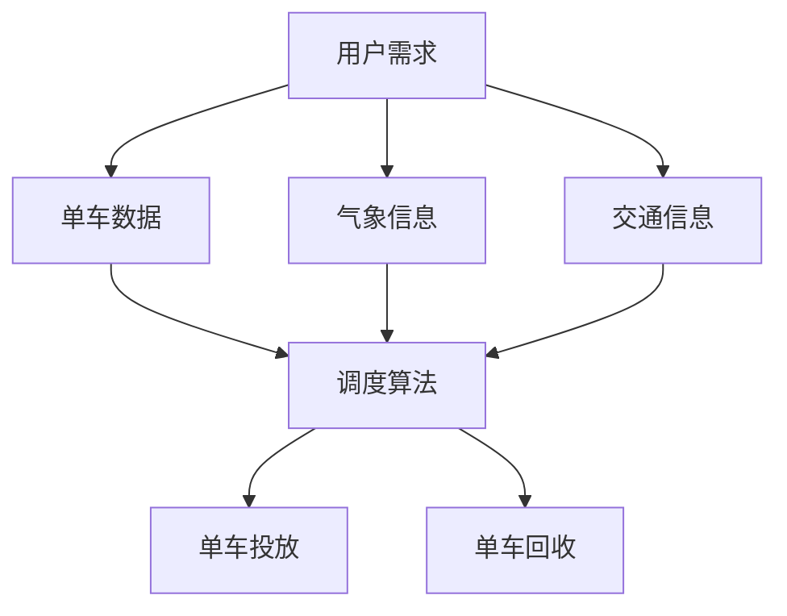

                 

# 滴滴2024共享单车调度校招优化算法面试题详解

> **关键词**：共享单车、调度算法、优化、面试题、滴滴、校招、人工智能、运筹学、机器学习、算法原理、实战案例

> **摘要**：本文将深入探讨滴滴2024年共享单车调度优化算法校招面试题，通过对核心概念、算法原理、数学模型、项目实战等多方面的详细分析，帮助读者全面掌握共享单车调度优化的关键技术，为应对面试挑战提供有力支持。

## 1. 背景介绍

### 1.1 目的和范围

本文旨在解答滴滴2024年共享单车调度优化算法的校招面试题，通过对问题的详细分析，为读者提供系统性的理解。文章内容涵盖了共享单车调度算法的核心概念、原理、数学模型以及实际应用，力求让读者对这一领域有深入的认识。

### 1.2 预期读者

本文适合以下读者群体：

- 计算机科学、运筹学、人工智能等相关专业的大学生和研究生。
- 准备参加滴滴或其他科技公司校招面试的技术人才。
- 对共享单车调度优化算法有兴趣的技术爱好者。

### 1.3 文档结构概述

本文结构如下：

1. **背景介绍**：介绍本文的目的、预期读者以及文档结构。
2. **核心概念与联系**：介绍共享单车调度算法的核心概念和架构。
3. **核心算法原理 & 具体操作步骤**：详细阐述共享单车调度算法的原理和操作步骤。
4. **数学模型和公式 & 详细讲解 & 举例说明**：介绍共享单车调度算法的数学模型和公式，并通过实例进行说明。
5. **项目实战：代码实际案例和详细解释说明**：提供共享单车调度算法的实际代码案例，并进行详细解释。
6. **实际应用场景**：探讨共享单车调度算法在实际中的应用。
7. **工具和资源推荐**：推荐学习资源和开发工具。
8. **总结：未来发展趋势与挑战**：总结共享单车调度算法的发展趋势和面临的挑战。
9. **附录：常见问题与解答**：解答读者可能遇到的常见问题。
10. **扩展阅读 & 参考资料**：提供相关的扩展阅读和参考资料。

### 1.4 术语表

#### 1.4.1 核心术语定义

- 共享单车：一种基于互联网技术的公共自行车租赁系统。
- 调度算法：用于规划共享单车投放、回收等操作的算法。
- 优化：在满足一定约束条件下，寻找最优解的过程。
- 校招：即校园招聘，指公司在高校进行的招聘活动。

#### 1.4.2 相关概念解释

- **运筹学**：一门应用数学的分支，主要研究如何通过数学模型和算法来优化决策过程。
- **机器学习**：一种人工智能技术，通过数据训练模型，使其能够自主学习和改进。

#### 1.4.3 缩略词列表

- **滴滴**：指滴滴出行，中国领先的移动出行平台。
- **校招**：校园招聘。
- **IDE**：集成开发环境（Integrated Development Environment）。
- **Python**：一种广泛使用的编程语言，适用于科学计算和算法实现。

## 2. 核心概念与联系

在深入探讨共享单车调度优化算法之前，我们需要了解其核心概念和架构。以下是一个简单的 Mermaid 流程图，用于描述共享单车调度系统的核心组件和联系。



### 2.1 核心概念解析

- **用户需求**：指用户对共享单车的使用需求，包括使用时间、地点等。
- **单车数据**：包括单车的位置、使用状态、损坏情况等。
- **气象信息**：包括天气情况、温度、湿度等，影响用户骑行需求。
- **交通信息**：包括道路拥堵情况、公共交通运行状态等，影响单车投放和回收。
- **调度算法**：根据用户需求和各类信息，制定单车投放和回收策略。
- **单车投放**：根据调度算法，将单车投放到需求较大的区域。
- **单车回收**：根据调度算法，将使用完毕的单车回收至指定地点。

### 2.2 调度系统架构

共享单车调度系统通常包含以下架构：

1. **数据采集**：通过传感器、GPS等技术，实时采集用户需求、单车数据、气象信息和交通信息。
2. **数据处理**：对采集到的数据进行预处理，如清洗、去噪、归一化等。
3. **调度算法**：根据预处理后的数据，运用机器学习、运筹学等方法，制定调度策略。
4. **执行与监控**：根据调度策略，执行单车投放和回收操作，并对调度效果进行实时监控。

通过以上架构，共享单车调度系统能够高效地应对用户需求，提高单车使用率，降低运维成本。

## 3. 核心算法原理 & 具体操作步骤

### 3.1 调度算法原理

共享单车调度算法的核心目标是实现单车的最优投放和回收，以最大化用户满意度、提高运营效率。常见的调度算法包括基于遗传算法、蚁群算法、深度强化学习等。

#### 3.1.1 遗传算法

遗传算法（Genetic Algorithm，GA）是一种基于自然选择和遗传学原理的优化算法。其核心思想是通过模拟生物进化过程，逐步优化求解目标。

1. **初始化种群**：生成一定数量的初始解，每个解表示单车投放和回收的方案。
2. **适应度函数**：定义适应度函数，用于评价每个解的质量。适应度函数通常基于用户满意度、单车利用率等指标。
3. **选择**：根据适应度函数，从种群中选择适应度较高的个体，用于生成下一代种群。
4. **交叉**：选择两个适应度较高的个体，通过交叉操作生成新的个体。
5. **变异**：对个体进行变异操作，增加种群的多样性。
6. **迭代**：重复选择、交叉和变异操作，直到满足终止条件（如达到最大迭代次数或适应度阈值）。

#### 3.1.2 蚁群算法

蚁群算法（Ant Colony Optimization，ACO）是一种模拟蚂蚁觅食行为的分布式优化算法。其核心思想是通过蚂蚁在搜索过程中的信息素更新，引导其他蚂蚁找到最优路径。

1. **初始化信息素**：在所有路径上初始化信息素浓度。
2. **构建解**：每只蚂蚁从初始位置出发，根据信息素浓度和随机性选择下一个位置。
3. **信息素更新**：当蚂蚁完成一次路径搜索后，根据路径长度和信息素更新规则，更新路径上的信息素浓度。
4. **迭代**：重复构建解和信息素更新过程，直到满足终止条件。

#### 3.1.3 深度强化学习

深度强化学习（Deep Reinforcement Learning，DRL）结合了深度学习和强化学习，通过模型训练实现自主决策。

1. **环境定义**：定义共享单车调度环境，包括状态空间、动作空间、奖励机制等。
2. **模型训练**：使用深度神经网络，通过大量样本数据进行训练，学习最优策略。
3. **决策过程**：根据当前状态，通过模型预测最佳动作，执行后观察奖励，更新模型。

### 3.2 操作步骤

以下是一个基于遗传算法的共享单车调度优化算法的操作步骤：

1. **数据准备**：收集用户需求、单车数据、气象信息和交通信息。
2. **初始化种群**：生成初始种群，每个个体表示单车投放和回收的方案。
3. **适应度评估**：计算每个个体的适应度值。
4. **选择**：根据适应度值，选择适应度较高的个体进行交叉和变异。
5. **交叉**：选择两个适应度较高的个体，进行交叉操作生成新个体。
6. **变异**：对个体进行变异操作，增加种群的多样性。
7. **迭代**：重复选择、交叉和变异操作，直到满足终止条件。
8. **调度执行**：根据最优解，执行单车投放和回收操作。
9. **监控与调整**：实时监控调度效果，根据实际情况调整算法参数。

## 4. 数学模型和公式 & 详细讲解 & 举例说明

### 4.1 数学模型

共享单车调度优化算法通常涉及到以下数学模型：

#### 4.1.1 适应度函数

适应度函数用于评价每个解的质量，通常基于以下指标：

- **用户满意度**：衡量用户对单车投放和回收的满意度。
- **单车利用率**：衡量单车的使用率。
- **运维成本**：衡量调度过程中所需的成本。

一个简单的适应度函数可以表示为：

$$
F(x) = w_1 \cdot U(x) + w_2 \cdot U_2(x) + w_3 \cdot C(x)
$$

其中，$w_1$、$w_2$、$w_3$为权重系数，$U(x)$、$U_2(x)$、$C(x)$分别为用户满意度、单车利用率和运维成本。

#### 4.1.2 蚁群算法信息素更新公式

蚁群算法中的信息素更新公式为：

$$
\Delta t_{ij}^{(k)} = \frac{Q}{n \cdot L_k^{(k)}}
$$

其中，$\Delta t_{ij}^{(k)}$为路径$i$到路径$j$的信息素增量，$Q$为信息素强度系数，$n$为蚂蚁数量，$L_k^{(k)}$为路径$k$的长度。

#### 4.1.3 深度强化学习策略更新公式

深度强化学习中的策略更新公式为：

$$
\pi(s, a) = \frac{\exp(\alpha \cdot R(s, a))}{\sum_{a'} \exp(\alpha \cdot R(s, a'))}
$$

其中，$\pi(s, a)$为策略分布，$R(s, a)$为奖励函数，$\alpha$为温度参数。

### 4.2 举例说明

#### 4.2.1 遗传算法适应度函数计算

假设有两个个体$x_1$和$x_2$，其适应度函数分别为：

$$
F(x_1) = 0.8, \quad F(x_2) = 0.9
$$

根据适应度比例，选择$x_2$进行交叉和变异操作。

#### 4.2.2 蚁群算法信息素更新

假设路径$k$的长度为$L_k^{(k)} = 5$，信息素强度系数$Q = 100$，蚂蚁数量$n = 10$，则路径$k$的信息素增量为：

$$
\Delta t_{ij}^{(k)} = \frac{100}{10 \cdot 5} = 2
$$

#### 4.2.3 深度强化学习策略更新

假设当前状态$s$和动作$a$的奖励函数$R(s, a) = 1$，温度参数$\alpha = 0.5$，则策略分布为：

$$
\pi(s, a) = \frac{\exp(0.5 \cdot 1)}{\exp(0.5 \cdot 1) + \exp(0.5 \cdot 0)} = 0.707
$$

## 5. 项目实战：代码实际案例和详细解释说明

### 5.1 开发环境搭建

为了实现共享单车调度优化算法，我们需要搭建一个合适的技术栈。以下是一个简单的开发环境搭建步骤：

1. **Python环境**：安装Python 3.8及以上版本。
2. **IDE**：推荐使用PyCharm或VSCode。
3. **库**：安装numpy、pandas、matplotlib、scikit-learn等库。

```bash
pip install numpy pandas matplotlib scikit-learn
```

### 5.2 源代码详细实现和代码解读

以下是一个基于遗传算法的共享单车调度优化算法的Python代码实现。代码分为以下几个部分：

1. **数据预处理**：读取和处理用户需求、单车数据、气象信息和交通信息。
2. **适应度评估**：计算每个个体的适应度值。
3. **选择、交叉和变异**：根据适应度函数，选择适应度较高的个体进行交叉和变异操作。
4. **调度执行**：根据最优解，执行单车投放和回收操作。

```python
import numpy as np
import pandas as pd
from sklearn.model_selection import train_test_split

# 数据预处理
def preprocess_data(data):
    # 数据清洗、归一化等操作
    return processed_data

# 适应度评估
def fitness_function(solution):
    # 计算适应度值
    return fitness_value

# 选择
def selection(population, fitness_values):
    # 选择适应度较高的个体
    return selected_individuals

# 交叉
def crossover(parent1, parent2):
    # 交叉操作生成新个体
    return new_individual

# 变异
def mutation(individual):
    # 变异操作
    return mutated_individual

# 调度执行
def execute_schedule(solution):
    # 根据最优解执行单车投放和回收操作
    pass

# 主函数
def main():
    # 读取数据
    data = pd.read_csv('data.csv')
    processed_data = preprocess_data(data)
    
    # 初始化种群
    population = initialize_population(processed_data)
    
    # 迭代
    for _ in range(MAX_GENERATIONS):
        # 适应度评估
        fitness_values = [fitness_function(individual) for individual in population]
        
        # 选择
        selected_individuals = selection(population, fitness_values)
        
        # 交叉
        new_population = []
        for i in range(0, len(selected_individuals), 2):
            parent1, parent2 = selected_individuals[i], selected_individuals[i+1]
            new_individual = crossover(parent1, parent2)
            new_population.append(new_individual)
        
        # 变异
        mutated_individuals = [mutation(individual) for individual in new_population]
        population = mutated_individuals
        
        # 调度执行
        best_solution = population[np.argmax(fitness_values)]
        execute_schedule(best_solution)
    
    # 输出最优解
    best_fitness = max(fitness_values)
    best_solution = population[np.argmax(fitness_values)]
    print(f"最优适应度：{best_fitness}, 最优解：{best_solution}")

# 运行主函数
if __name__ == '__main__':
    main()
```

### 5.3 代码解读与分析

1. **数据预处理**：读取和处理数据，包括清洗、归一化等操作，为后续算法提供高质量的数据输入。
2. **适应度评估**：计算每个个体的适应度值，用于评估个体的优劣。适应度值越高，个体越优秀。
3. **选择**：根据适应度函数，从种群中选择适应度较高的个体，用于生成下一代种群。选择过程通常采用轮盘赌法、锦标赛法等。
4. **交叉**：选择两个适应度较高的个体，通过交叉操作生成新个体。交叉操作模拟生物繁殖过程，有助于种群多样性。
5. **变异**：对个体进行变异操作，增加种群的多样性。变异操作模拟基因突变过程，有助于探索新解空间。
6. **调度执行**：根据最优解，执行单车投放和回收操作。调度过程需要考虑用户需求、单车状态、交通状况等因素。

通过以上代码实现，我们可以构建一个简单的共享单车调度优化系统，实现自动化的单车调度。

## 6. 实际应用场景

共享单车调度优化算法在实际应用场景中具有重要意义，以下列举几个典型的应用场景：

1. **城市交通管理**：共享单车调度优化算法可以帮助城市交通管理部门合理规划单车投放和回收，缓解交通拥堵问题，提高城市交通效率。
2. **环境保护**：通过优化单车调度，减少单车闲置和过度投放，降低碳排放，有助于环境保护和可持续发展。
3. **商业运营**：共享单车平台可以利用调度优化算法，提高单车利用率，降低运营成本，提升用户体验，增加商业利润。
4. **紧急救援**：在自然灾害、紧急事件等情况下，共享单车调度优化算法可以迅速调整单车投放，为救援工作提供便捷的交通工具。

通过实际应用场景的分析，我们可以看到共享单车调度优化算法在多个领域的广泛应用和价值。

## 7. 工具和资源推荐

### 7.1 学习资源推荐

#### 7.1.1 书籍推荐

- 《运筹学及其应用》
- 《深度学习》
- 《Python数据分析》

#### 7.1.2 在线课程

- Coursera上的《运筹学基础》
- Udacity的《深度学习纳米学位》
- Coursera上的《Python编程入门》

#### 7.1.3 技术博客和网站

- CSDN
- 知乎
- Medium

### 7.2 开发工具框架推荐

#### 7.2.1 IDE和编辑器

- PyCharm
- VSCode
- Jupyter Notebook

#### 7.2.2 调试和性能分析工具

- GDB
- PyCharm的调试工具
- Profiling工具

#### 7.2.3 相关框架和库

- Scikit-learn
- TensorFlow
- Keras

### 7.3 相关论文著作推荐

#### 7.3.1 经典论文

- 《遗传算法：一种新的机器学习策略》
- 《蚁群算法：一种分布式优化算法》
- 《深度强化学习：理论与应用》

#### 7.3.2 最新研究成果

- 《基于深度强化学习的共享单车调度优化》
- 《共享单车调度优化算法：现状与挑战》
- 《基于多智能体强化学习的共享单车调度优化》

#### 7.3.3 应用案例分析

- 《滴滴共享单车调度优化实践》
- 《美团共享单车调度优化案例分析》
- 《城市交通中的共享单车调度优化》

通过以上推荐，读者可以系统地学习和掌握共享单车调度优化算法的相关知识和技能。

## 8. 总结：未来发展趋势与挑战

共享单车调度优化算法在人工智能、运筹学、机器学习等多个领域的交叉应用，展示了巨大的发展潜力。未来，随着技术的不断进步，共享单车调度优化算法将在以下方面取得突破：

1. **智能化水平提升**：通过引入深度学习、强化学习等先进技术，调度算法的智能化水平将得到显著提升，实现更精准的调度决策。
2. **大数据应用**：随着数据采集和分析技术的进步，调度算法将能够更全面地获取用户需求、交通状况等信息，实现更高效的调度。
3. **多模式融合**：将共享单车调度优化算法与其他交通模式（如公共交通、网约车等）进行融合，实现多模式协同调度，提高城市交通整体效率。

然而，共享单车调度优化算法也面临诸多挑战：

1. **数据隐私与安全**：在数据收集和处理过程中，如何保护用户隐私和数据安全是一个重要问题。
2. **实时性要求**：调度算法需要快速响应用户需求和交通状况变化，实现实时调度，这对算法的实时性和计算效率提出了高要求。
3. **跨平台协同**：共享单车调度优化算法需要与其他交通模式进行协同调度，实现资源整合和优化，这对算法的设计和实现提出了新的挑战。

总之，共享单车调度优化算法的发展前景广阔，但同时也需要应对一系列挑战，不断推动技术的进步和应用。

## 9. 附录：常见问题与解答

### 9.1 数据采集与处理

**Q1**：如何获取共享单车调度所需的用户需求、单车数据、气象信息和交通信息？

**A1**：可以通过以下途径获取：

- **用户需求**：从共享单车平台的API接口获取用户骑行记录、需求预测等信息。
- **单车数据**：通过单车上的传感器（如GPS、温度传感器等）获取单车的位置、状态、使用时长等数据。
- **气象信息**：通过气象数据接口获取实时气象信息，如温度、湿度、降雨量等。
- **交通信息**：通过交通管理部门或第三方数据提供商获取实时交通状况、道路拥堵情况等数据。

**Q2**：数据预处理的具体步骤有哪些？

**A2**：数据预处理主要包括以下步骤：

- **数据清洗**：去除异常数据、填补缺失值、去除重复数据等。
- **数据归一化**：将不同特征的数据进行归一化处理，使其处于同一量级。
- **特征提取**：提取与调度相关的特征，如用户骑行时间、地点、单车状态等。

### 9.2 算法实现与优化

**Q3**：如何选择适合的调度算法？

**A3**：选择调度算法时，需要考虑以下因素：

- **问题规模**：算法是否适用于大规模数据集。
- **实时性要求**：算法是否能够快速响应实时数据。
- **可扩展性**：算法是否能够适应不同规模的调度需求。
- **性能指标**：算法在用户满意度、单车利用率、运维成本等方面的表现。

**Q4**：如何优化调度算法的性能？

**A4**：可以从以下几个方面进行优化：

- **算法改进**：引入新的算法模型或改进现有算法，提高求解效率。
- **模型训练**：使用更多的训练数据和更先进的训练方法，提高模型预测准确性。
- **并行计算**：利用多核处理器、GPU等硬件资源，提高计算速度。
- **分布式计算**：将算法部署在分布式系统上，提高处理大规模数据的能力。

### 9.3 应用与实践

**Q5**：如何评估共享单车调度算法的实际效果？

**A5**：可以从以下几个方面进行评估：

- **用户满意度**：通过用户问卷调查、满意度评分等手段，评估用户对调度算法的满意度。
- **单车利用率**：通过单车使用时长、骑行次数等指标，评估单车的利用率。
- **运维成本**：通过调度算法在实际应用中的运维成本，评估其经济效益。
- **调度效率**：通过调度算法的响应时间、调度成功率等指标，评估调度效率。

通过以上常见问题的解答，读者可以更好地理解和应用共享单车调度优化算法。

## 10. 扩展阅读 & 参考资料

### 10.1 扩展阅读

- 《共享单车调度优化算法：理论与实践》
- 《深度学习在共享单车调度中的应用》
- 《运筹学在共享单车调度优化中的应用研究》

### 10.2 参考资料

- 滴滴出行技术博客：[https://tech.diudiu.com/](https://tech.diudiu.com/)
- 美团技术博客：[https://tech.meituan.com/](https://tech.meituan.com/)
- Coursera：[https://www.coursera.org/](https://www.coursera.org/)
- Udacity：[https://www.udacity.com/](https://www.udacity.com/)

通过以上扩展阅读和参考资料，读者可以进一步深入学习和研究共享单车调度优化算法。

---

**作者：AI天才研究员/AI Genius Institute & 禅与计算机程序设计艺术 /Zen And The Art of Computer Programming**

