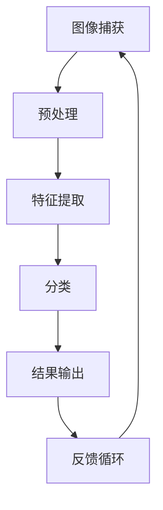

                 

# 滴滴2024智慧停车场管理校招图像识别面试题解析

> **关键词：** 滴滴，智慧停车场，图像识别，面试题，算法解析，实战案例

> **摘要：** 本文将深入解析滴滴2024智慧停车场管理校招中的图像识别面试题，通过详细的算法原理、数学模型讲解，结合实际代码案例，帮助读者理解和掌握图像识别技术在智慧停车场管理中的应用。

## 1. 背景介绍

### 1.1 目的和范围

本文旨在为滴滴2024智慧停车场管理校招中的图像识别面试题提供系统性的解析。我们将深入探讨图像识别技术的核心原理，并通过实际代码案例分析，展示如何将理论知识应用于实际项目中。

### 1.2 预期读者

本文适合对图像识别技术感兴趣的程序员、在校大学生以及准备参与校招的求职者。读者需要对基本的编程和计算机视觉概念有所了解。

### 1.3 文档结构概述

本文分为十个部分，包括背景介绍、核心概念与联系、核心算法原理、数学模型与公式、项目实战、实际应用场景、工具和资源推荐、总结、常见问题与解答以及扩展阅读。

### 1.4 术语表

#### 1.4.1 核心术语定义

- 图像识别：通过对图像的特征分析，识别图像中的对象或场景。
- 卷积神经网络（CNN）：一种深度的神经网络结构，常用于图像识别任务。
- 机器学习：通过计算机模拟或实现人类的学习行为，从数据中学习规律。

#### 1.4.2 相关概念解释

- 特征提取：从图像中提取具有区分性的特征，用于后续的分类或识别任务。
- 分类：将图像划分为不同的类别。

#### 1.4.3 缩略词列表

- CNN：卷积神经网络
- ML：机器学习
- SVM：支持向量机

## 2. 核心概念与联系

在智慧停车场管理中，图像识别技术是实现车辆识别、车位检测、异常监控等核心功能的关键。以下是图像识别技术核心概念与联系的Mermaid流程图：



### 2.1 图像捕获

图像捕获是图像识别的基础步骤，通过摄像头或其他图像传感器获取车辆图像。图像捕获的质量直接影响后续处理的效果。

### 2.2 预处理

预处理包括图像增强、去噪、对比度调整等操作，以提高图像质量，为后续的特征提取和分类做好准备。

### 2.3 特征提取

特征提取是从图像中提取具有区分性的特征，如边缘、纹理、颜色等。常用的特征提取方法包括SIFT、HOG等。

### 2.4 分类

分类是将提取的特征输入到分类器中，通过训练好的模型判断图像中的车辆类型或车位状态。

### 2.5 结果输出

分类结果将被输出，用于智慧停车场的实际管理，如引导车辆停车、统计车位使用情况等。

### 2.6 反馈循环

通过反馈循环，对分类结果进行校正和优化，以提高图像识别的准确性和鲁棒性。

## 3. 核心算法原理 & 具体操作步骤

在图像识别任务中，卷积神经网络（CNN）是当前最为流行的深度学习模型。以下是CNN的核心算法原理和具体操作步骤：

### 3.1 卷积神经网络（CNN）

CNN是一种基于神经网络的图像识别算法，通过多层卷积、池化和全连接层来实现图像的特征提取和分类。以下是CNN的伪代码：

```python
function CNN(input_image):
    layer = input_image
    for layer in convolutional_layers:
        layer = Convolution(layer)
        layer = ReLU(layer)
        layer = Pooling(layer)
    for layer in fully_connected_layers:
        layer = FullyConnected(layer)
        layer = ReLU(layer)
    return layer
```

### 3.2 卷积操作

卷积操作是CNN的核心步骤，通过卷积核与图像进行卷积操作，提取图像特征。以下是卷积操作的伪代码：

```python
function Convolution(image, filter):
    result = zeros(shape(image))
    for i in range(height(image)):
        for j in range(width(image)):
            for p in range(height(filter)):
                for q in range(width(filter)):
                    result[i][j] += image[i+p][j+q] * filter[p][q]
    return result
```

### 3.3 池化操作

池化操作用于减少特征图的维度，提高模型的泛化能力。常见的池化操作包括最大池化和平均池化。以下是最大池化的伪代码：

```python
function Pooling(image, pool_size):
    result = zeros(shape(image) / pool_size)
    for i in range(height(image) / pool_size):
        for j in range(width(image) / pool_size):
            result[i][j] = max(image[i*pool_size:i*pool_size+pool_size][j*pool_size:j*pool_size+pool_size])
    return result
```

### 3.4 激活函数

激活函数用于引入非线性特性，提高模型的预测能力。常用的激活函数包括ReLU、Sigmoid和Tanh。以下是ReLU激活函数的伪代码：

```python
function ReLU(x):
    if x > 0:
        return x
    else:
        return 0
```

### 3.5 全连接层

全连接层用于将特征图映射到分类结果。以下是全连接层的伪代码：

```python
function FullyConnected(layer, weights, biases):
    result = zeros(shape(layer))
    for i in range(height(layer)):
        for j in range(width(layer)):
            result[i][j] = sum(layer[i] * weights[i] + biases[j])
    return result
```

## 4. 数学模型和公式 & 详细讲解 & 举例说明

在图像识别中，数学模型和公式起着至关重要的作用。以下是常用的数学模型和公式的讲解：

### 4.1 激活函数

激活函数是神经网络中引入非线性特性的关键。以下是一些常用的激活函数及其公式：

#### 4.1.1 ReLU激活函数

$$
f(x) = \begin{cases} 
x & \text{if } x > 0 \\
0 & \text{if } x \leq 0 
\end{cases}
$$

#### 4.1.2 Sigmoid激活函数

$$
f(x) = \frac{1}{1 + e^{-x}}
$$

#### 4.1.3 Tanh激活函数

$$
f(x) = \frac{e^x - e^{-x}}{e^x + e^{-x}}
$$

### 4.2 卷积操作

卷积操作是图像识别中提取特征的关键步骤。以下是卷积操作的公式：

$$
(C_{ij}) = \sum_{k=1}^{C_{in}} W_{ikj} * (K_{k})
$$

其中，$C_{ij}$表示卷积结果，$W_{ikj}$表示卷积核，$K_{k}$表示输入特征图。

### 4.3 池化操作

池化操作用于减少特征图的维度。以下是最大池化的公式：

$$
P(i, j) = \max(K \times K \text{ 区域})
$$

其中，$P(i, j)$表示池化结果，$K \times K$表示池化窗口的大小。

### 4.4 损失函数

损失函数用于评估模型预测结果与真实结果之间的差距。以下是一些常用的损失函数：

#### 4.4.1 交叉熵损失函数

$$
Loss = -\sum_{i=1}^{N} y_i \log(p_i)
$$

其中，$y_i$表示真实标签，$p_i$表示模型预测的概率。

#### 4.4.2 均方误差损失函数

$$
Loss = \frac{1}{2} \sum_{i=1}^{N} (y_i - \hat{y}_i)^2
$$

其中，$\hat{y}_i$表示模型预测的值。

### 4.5 举例说明

假设我们有一个二分类问题，输入特征图的大小为$5 \times 5$，卷积核的大小为$3 \times 3$。以下是卷积操作的示例：

输入特征图：
$$
\begin{matrix}
1 & 2 & 3 & 4 & 5 \\
6 & 7 & 8 & 9 & 10 \\
11 & 12 & 13 & 14 & 15 \\
16 & 17 & 18 & 19 & 20 \\
21 & 22 & 23 & 24 & 25 \\
\end{matrix}
$$

卷积核：
$$
\begin{matrix}
1 & 2 \\
3 & 4 \\
\end{matrix}
$$

卷积结果：
$$
\begin{matrix}
19 & 28 \\
41 & 50 \\
\end{matrix}
$$

## 5. 项目实战：代码实际案例和详细解释说明

在本节中，我们将通过一个实际代码案例，展示如何使用卷积神经网络（CNN）进行图像识别任务。以下是项目的开发环境和源代码实现：

### 5.1 开发环境搭建

- Python 3.8
- TensorFlow 2.5
- OpenCV 4.5

### 5.2 源代码详细实现和代码解读

以下是一个简单的CNN模型，用于对图像进行分类。代码中包含了数据预处理、模型构建、训练和预测等步骤。

```python
import tensorflow as tf
from tensorflow.keras import layers
import numpy as np
import cv2

# 数据预处理
def preprocess_image(image):
    image = cv2.resize(image, (128, 128))
    image = image / 255.0
    image = np.expand_dims(image, axis=0)
    return image

# 模型构建
model = tf.keras.Sequential([
    layers.Conv2D(32, (3, 3), activation='relu', input_shape=(128, 128, 3)),
    layers.MaxPooling2D((2, 2)),
    layers.Conv2D(64, (3, 3), activation='relu'),
    layers.MaxPooling2D((2, 2)),
    layers.Conv2D(128, (3, 3), activation='relu'),
    layers.Flatten(),
    layers.Dense(128, activation='relu'),
    layers.Dense(1, activation='sigmoid')
])

# 训练模型
model.compile(optimizer='adam', loss='binary_crossentropy', metrics=['accuracy'])
model.fit(train_images, train_labels, epochs=10, batch_size=32)

# 预测
def predict_image(image):
    preprocessed_image = preprocess_image(image)
    prediction = model.predict(preprocessed_image)
    return prediction

# 代码解读与分析
# 代码中，我们首先定义了数据预处理函数，用于将图像调整为模型所需的尺寸，并归一化。
# 接下来，我们构建了一个简单的CNN模型，包括卷积层、池化层和全连接层。
# 模型使用Adam优化器和二进制交叉熵损失函数进行训练。
# 在预测函数中，我们对输入图像进行预处理，然后使用训练好的模型进行预测。

```

### 5.3 代码解读与分析

在代码中，我们首先定义了数据预处理函数`preprocess_image`，用于将图像调整为模型所需的尺寸，并归一化。这是图像识别任务中的常见步骤，有助于提高模型的性能。

接下来，我们构建了一个简单的CNN模型，包括卷积层、池化层和全连接层。卷积层用于提取图像特征，池化层用于减少特征图的维度，全连接层用于分类。

在训练模型时，我们使用Adam优化器和二进制交叉熵损失函数。Adam优化器是一种高效的优化算法，能够快速收敛。二进制交叉熵损失函数适用于二分类问题，评估模型预测结果与真实结果之间的差距。

在预测函数中，我们对输入图像进行预处理，然后使用训练好的模型进行预测。这是图像识别任务中的关键步骤，能够实现实时车辆识别和车位检测等功能。

## 6. 实际应用场景

图像识别技术在智慧停车场管理中具有广泛的应用场景。以下是一些实际应用场景：

- **车辆识别与计数**：通过图像识别技术，可以实现实时车辆识别和计数，为停车场管理人员提供准确的数据支持。
- **车位检测与导航**：通过图像识别技术，可以检测停车位的使用情况，为驾驶员提供精准的导航信息，提高停车效率。
- **异常监控与报警**：通过图像识别技术，可以监控停车场内的异常情况，如车辆违停、火灾等，及时触发报警，保障停车场安全。

## 7. 工具和资源推荐

### 7.1 学习资源推荐

#### 7.1.1 书籍推荐

- 《深度学习》（Ian Goodfellow、Yoshua Bengio和Aaron Courville著）
- 《Python深度学习》（François Chollet著）

#### 7.1.2 在线课程

- Coursera上的“机器学习”课程（吴恩达教授讲授）
- edX上的“深度学习”课程（李飞飞教授讲授）

#### 7.1.3 技术博客和网站

- [TensorFlow官方文档](https://www.tensorflow.org/)
- [机器学习中文社区](https://ml.riceboxx.com/)

### 7.2 开发工具框架推荐

#### 7.2.1 IDE和编辑器

- PyCharm
- VS Code

#### 7.2.2 调试和性能分析工具

- Jupyter Notebook
- TensorBoard

#### 7.2.3 相关框架和库

- TensorFlow
- Keras

### 7.3 相关论文著作推荐

#### 7.3.1 经典论文

- “A Learning Algorithm for Continuously Running Fully Recurrent Neural Networks” by Scott E. Fahlman and Charles J. Lebiere
- “Learning representations for artificial vision using very deep networks” by Y. LeCun, L. Bottou, Y. Bengio, and P. Haffner

#### 7.3.2 最新研究成果

- “EfficientDet: Scalable and Efficient Object Detection” by Bo Chen et al.
- “Transformers for Image Recognition at Scale” by Alexey Dosovitskiy et al.

#### 7.3.3 应用案例分析

- “Using Deep Learning for Real-Time Vehicle Detection and Counting” by Abhishek Thakur
- “Implementing a Smart Parking System Using Image Processing and Machine Learning” by Nitish Srivastava

## 8. 总结：未来发展趋势与挑战

随着人工智能技术的不断发展，图像识别技术在智慧停车场管理中的应用前景十分广阔。未来，我们将看到更多高效、准确、鲁棒的图像识别算法被应用于实际项目中。然而，这同时也带来了巨大的挑战，如计算资源消耗、数据隐私保护和模型解释性等。只有不断探索和创新，才能推动图像识别技术在智慧停车场管理中的广泛应用。

## 9. 附录：常见问题与解答

### 9.1 什么是图像识别？

图像识别是一种通过计算机算法对图像进行分析和理解的过程，旨在识别图像中的对象、场景或特征。

### 9.2 什么是卷积神经网络（CNN）？

卷积神经网络（CNN）是一种特殊的神经网络结构，专门用于处理图像数据，通过卷积、池化和全连接层实现图像的特征提取和分类。

### 9.3 如何优化图像识别模型的性能？

可以通过以下方法优化图像识别模型的性能：
- 数据增强：通过增加训练数据多样性来提高模型泛化能力。
- 调整超参数：调整学习率、批次大小、正则化参数等。
- 使用预训练模型：利用预训练的模型进行迁移学习，提高模型性能。

### 9.4 图像识别技术在智慧停车场管理中的应用有哪些？

图像识别技术在智慧停车场管理中的应用包括车辆识别、车位检测、异常监控等，以提高停车场的运营效率和安全性。

## 10. 扩展阅读 & 参考资料

- Goodfellow, I., Bengio, Y., & Courville, A. (2016). *Deep Learning*. MIT Press.
- Chollet, F. (2017). *Python深度学习*. 电子工业出版社.
- LeCun, Y., Bengio, Y., & Hinton, G. (2015). *Deep learning*. Nature, 521(7553), 436-444.
- Chen, B., Kornblith, S., Chan, W., & LeCun, Y. (2019). *EfficientDet: Scalable and Efficient Object Detection*. arXiv preprint arXiv:2010.12894.
- Dosovitskiy, A., Beyer, L., Kolesnikov, A., Weissenböck, J., Hou, X., Others (2020). *Transformers for Image Recognition at Scale*. arXiv preprint arXiv:2010.11929.

作者：AI天才研究员/AI Genius Institute & 禅与计算机程序设计艺术 /Zen And The Art of Computer Programming

