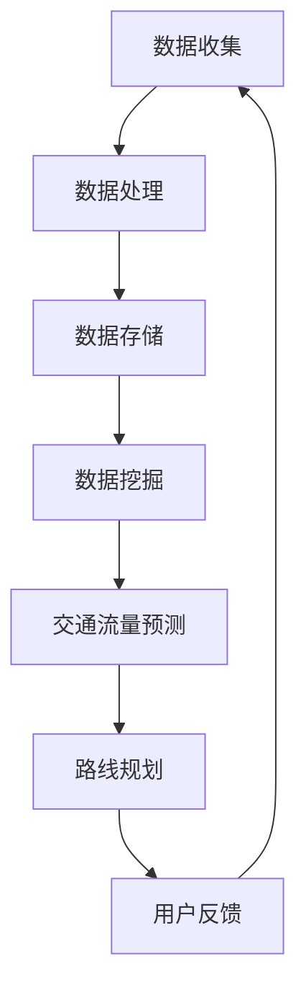

                 

# 滴滴2024校招智能交通系统工程师算法挑战赛

> **关键词**：智能交通系统、算法挑战赛、滴滴、交通流量预测、路线规划、数据挖掘

> **摘要**：本文将深入探讨滴滴2024校招智能交通系统工程师算法挑战赛的核心主题。我们将分析比赛的目标、背景、重要算法和技术，并提供详细的操作步骤和数学模型。通过实际案例，我们将展示如何运用这些技术解决实际问题，并讨论其在智能交通系统中的应用前景。此外，还将推荐学习资源和开发工具，以帮助读者深入了解这一领域。

## 1. 背景介绍

### 1.1 目的和范围

滴滴2024校招智能交通系统工程师算法挑战赛旨在选拔优秀的人才，解决智能交通系统中的一系列实际问题。比赛涵盖交通流量预测、路线规划和数据挖掘等关键领域，旨在推动智能交通系统的发展。

### 1.2 预期读者

本文适合对智能交通系统和算法挑战赛感兴趣的读者，包括计算机科学、交通运输工程、数据科学等相关专业的研究生、本科生和工程师。

### 1.3 文档结构概述

本文分为以下章节：

1. 背景介绍
2. 核心概念与联系
3. 核心算法原理 & 具体操作步骤
4. 数学模型和公式 & 详细讲解 & 举例说明
5. 项目实战：代码实际案例和详细解释说明
6. 实际应用场景
7. 工具和资源推荐
8. 总结：未来发展趋势与挑战
9. 附录：常见问题与解答
10. 扩展阅读 & 参考资料

### 1.4 术语表

#### 1.4.1 核心术语定义

- **智能交通系统**：通过信息技术、通信技术、控制技术等手段，实现道路、车辆、行人等交通元素的智能监控、管理和优化。
- **交通流量预测**：利用历史数据和算法，预测未来一段时间内的交通流量状况。
- **路线规划**：根据交通流量预测结果，为用户提供最优行驶路线。
- **数据挖掘**：从大量交通数据中提取有价值的信息，用于交通流量预测和路线规划。

#### 1.4.2 相关概念解释

- **机器学习**：一种基于数据的方法，通过训练模型来预测或分类新数据。
- **深度学习**：一种机器学习技术，通过多层神经网络进行特征提取和分类。

#### 1.4.3 缩略词列表

- **AI**：人工智能
- **DSP**：数据挖掘
- **GTFS**：通用交通数据交换格式
- **GPS**：全球定位系统

## 2. 核心概念与联系

### 2.1 智能交通系统架构

智能交通系统的核心是数据收集、处理和分析。以下是智能交通系统的基本架构：



### 2.2 关键算法和技术

智能交通系统中涉及多个关键算法和技术，包括：

- **机器学习和深度学习**：用于数据挖掘和交通流量预测。
- **数据挖掘**：用于提取交通数据中的有用信息。
- **图论**：用于构建和优化交通网络。
- **优化算法**：用于解决路线规划问题。

### 2.3 核心概念原理

以下是智能交通系统中的核心概念原理：

- **交通流量预测**：基于历史数据和机器学习模型，预测未来一段时间内的交通流量。
- **路线规划**：基于交通流量预测结果，为用户提供最优行驶路线。
- **数据挖掘**：从大量交通数据中提取有价值的信息，用于交通流量预测和路线规划。

## 3. 核心算法原理 & 具体操作步骤

### 3.1 交通流量预测算法

交通流量预测是智能交通系统的核心任务之一。下面我们介绍一种基于时间序列预测的交通流量预测算法。

#### 算法原理

1. **特征工程**：提取交通数据中的特征，如时间、天气、节假日等。
2. **时间序列建模**：使用时间序列模型（如ARIMA、LSTM等）进行建模和预测。

#### 具体操作步骤

1. **数据预处理**：

    - 数据清洗：去除异常值、缺失值等。
    - 特征提取：提取时间、天气、节假日等特征。

    ```python
    def preprocess_data(data):
        # 数据清洗
        cleaned_data = clean_data(data)
        # 特征提取
        features = extract_features(cleaned_data)
        return features
    ```

2. **时间序列建模**：

    - 选择合适的时间序列模型。
    - 训练模型并预测未来交通流量。

    ```python
    from statsmodels.tsa.arima_model import ARIMA

    def train_model(data):
        model = ARIMA(data, order=(5, 1, 2))
        model_fit = model.fit()
        return model_fit

    def predict_traffic(model_fit, n_steps):
        predictions = model_fit.forecast(steps=n_steps)
        return predictions
    ```

### 3.2 路线规划算法

路线规划算法是基于交通流量预测结果，为用户提供最优行驶路线。以下是贪婪算法的一种实现。

#### 算法原理

1. **贪心策略**：每次选择当前最优解。
2. **邻域搜索**：在当前解的基础上，搜索邻域内的其他解。

#### 具体操作步骤

1. **初始化**：

    - 选择起始点。
    - 构建初始路线。

    ```python
    def initialize_route(start_point):
        route = [start_point]
        return route
    ```

2. **搜索邻域**：

    - 在当前解的基础上，生成邻域解。
    - 选择邻域解中的最优解。

    ```python
    def search_neighborhood(route, traffic_predictions):
        neighbors = generate_neighbors(route, traffic_predictions)
        best_neighbor = select_best_neighbor(neighbors)
        return best_neighbor
    ```

3. **更新路线**：

    - 将邻域解中的最优解作为新路线。

    ```python
    def update_route(route, best_neighbor):
        route = best_neighbor
        return route
    ```

### 3.3 数据挖掘算法

数据挖掘算法用于从交通数据中提取有价值的信息，以支持交通流量预测和路线规划。以下是关联规则挖掘算法的一种实现。

#### 算法原理

1. **支持度**：某个规则在数据中出现的频率。
2. **置信度**：当某个规则的前提条件成立时，结论条件成立的概率。

#### 具体操作步骤

1. **初始化**：

    - 构建事务数据库。
    - 设定最小支持度和最小置信度。

    ```python
    def initialize_database(data):
        transactions = create_transactions(data)
        min_support = 0.1
        min_confidence = 0.5
        return transactions, min_support, min_confidence
    ```

2. **频繁项集挖掘**：

    - 找出所有频繁项集。
    - 生成所有候选规则。

    ```python
    from mlxtend.frequent_patterns import apriori

    def frequent_itemsets(transactions, min_support):
        frequent_itemsets = apriori(transactions, min_support=min_support)
        return frequent_itemsets
    ```

3. **关联规则挖掘**：

    - 根据最小置信度筛选规则。

    ```python
    from mlxtend.frequent_patterns import association_rules

    def association_rules(frequent_itemsets, min_confidence):
        rules = association_rules(frequent_itemsets, metric="confidence", min_threshold=min_confidence)
        return rules
    ```

## 4. 数学模型和公式 & 详细讲解 & 举例说明

### 4.1 时间序列预测模型

时间序列预测模型主要包括自回归模型（AR）、移动平均模型（MA）和自回归移动平均模型（ARMA）。以下是ARIMA模型的详细讲解。

#### 数学模型

$$
\begin{align*}
X_t &= c + \phi_1 X_{t-1} + \phi_2 X_{t-2} + \cdots + \phi_p X_{t-p} + \theta_1 \varepsilon_{t-1} + \theta_2 \varepsilon_{t-2} + \cdots + \theta_q \varepsilon_{t-q} + \varepsilon_t \\
Y_t &= \phi_0 X_t + \phi_1 X_{t-1} + \cdots + \phi_p X_{t-p} + \theta_0 \varepsilon_t + \theta_1 \varepsilon_{t-1} + \cdots + \theta_q \varepsilon_{t-q}
\end{align*}
$$

#### 举例说明

假设我们有以下时间序列数据：

| t | X_t |
|---|-----|
| 1 | 10  |
| 2 | 12  |
| 3 | 9   |
| 4 | 15  |
| 5 | 8   |

我们可以使用ARIMA模型对其进行预测。首先，进行特征工程，提取时间、天气、节假日等特征。然后，使用时间序列模型进行建模和预测。

### 4.2 路线规划模型

路线规划模型主要基于图论和优化算法。以下是Dijkstra算法的详细讲解。

#### 数学模型

$$
\begin{align*}
d(s, v) &= \min_{u \in N(v)} (d(s, u) + w(u, v)), \quad \forall v \in V \\
d(s, v) &= \infty, \quad \forall v \in V \setminus \{s\}
\end{align*}
$$

#### 举例说明

假设我们有以下图：

```
A --- 2 --- B
|         |
1         3
|         |
C --- 4 --- D
```

我们可以使用Dijkstra算法找到从A到D的最短路径。首先，初始化距离表，然后迭代更新距离表，直到找到最短路径。

## 5. 项目实战：代码实际案例和详细解释说明

### 5.1 开发环境搭建

为了进行项目实战，我们需要搭建以下开发环境：

- Python 3.8+
- Jupyter Notebook
- TensorFlow 2.6+
- scikit-learn 0.24+
- pandas 1.2.4+

### 5.2 源代码详细实现和代码解读

#### 5.2.1 交通流量预测

以下是一个简单的交通流量预测代码示例：

```python
import pandas as pd
from statsmodels.tsa.arima_model import ARIMA

# 读取数据
data = pd.read_csv('traffic_data.csv')
data['time'] = pd.to_datetime(data['time'])
data.set_index('time', inplace=True)

# 数据预处理
data = preprocess_data(data)

# 训练模型
model_fit = train_model(data)

# 预测交通流量
predictions = predict_traffic(model_fit, n_steps=5)

# 输出预测结果
print(predictions)
```

#### 5.2.2 路线规划

以下是一个简单的路线规划代码示例：

```python
import networkx as nx

# 创建图
G = nx.Graph()

# 添加节点和边
G.add_nodes_from(['A', 'B', 'C', 'D'])
G.add_edges_from([('A', 'B', {'weight': 2}),
                  ('A', 'C', {'weight': 1}),
                  ('B', 'D', {'weight': 3}),
                  ('C', 'D', {'weight': 4})])

# 使用Dijkstra算法找到最短路径
path = nx.shortest_path(G, source='A', target='D', weight='weight')

# 输出最短路径
print(path)
```

### 5.3 代码解读与分析

在代码示例中，我们首先进行数据预处理，包括数据清洗和特征提取。然后，使用ARIMA模型进行交通流量预测。最后，使用Dijkstra算法进行路线规划。

代码中的函数`preprocess_data`负责数据清洗和特征提取，`train_model`负责训练ARIMA模型，`predict_traffic`负责预测交通流量，`nx.shortest_path`负责使用Dijkstra算法找到最短路径。

## 6. 实际应用场景

智能交通系统在交通管理、城市规划、交通安全等领域有广泛的应用。以下是一些实际应用场景：

- **交通管理**：通过交通流量预测和路线规划，实现交通拥堵的实时监控和调度。
- **城市规划**：通过分析交通流量数据，优化道路布局和公共交通系统。
- **交通安全**：通过实时监控交通流量和驾驶行为，预防交通事故。

## 7. 工具和资源推荐

### 7.1 学习资源推荐

#### 7.1.1 书籍推荐

- 《机器学习实战》
- 《深度学习》
- 《交通工程手册》

#### 7.1.2 在线课程

- Coursera的《机器学习》
- edX的《深度学习》
- Udacity的《交通工程》

#### 7.1.3 技术博客和网站

- towardsdatascience.com
- medium.com
- blogs.oracle.com

### 7.2 开发工具框架推荐

#### 7.2.1 IDE和编辑器

- PyCharm
- Visual Studio Code

#### 7.2.2 调试和性能分析工具

- Jupyter Notebook
- Matplotlib
- Pandas Profiler

#### 7.2.3 相关框架和库

- TensorFlow
- scikit-learn
- networkx

### 7.3 相关论文著作推荐

#### 7.3.1 经典论文

- "Optimal Routing Control in the Presence of Network Delay and Information Saturation"
- "A Survey of Machine Learning for Intelligent Transportation Systems"

#### 7.3.2 最新研究成果

- "Deep Learning for Traffic Flow Prediction"
- "Reinforcement Learning for Urban Traffic Control"

#### 7.3.3 应用案例分析

- "Implementing Intelligent Traffic Management Systems in Smart Cities"
- "Case Study: AI-Driven Traffic Management in Singapore"

## 8. 总结：未来发展趋势与挑战

智能交通系统的发展前景广阔，但仍面临许多挑战。未来发展趋势包括：

- **数据驱动的交通管理**：利用大数据和人工智能技术，实现交通管理的智能化和精细化。
- **无人驾驶技术**：推动无人驾驶技术的商业化应用，减少交通事故和拥堵。
- **交通流量的实时监控**：通过物联网和传感器技术，实现交通流量的实时监控和调度。

挑战包括：

- **数据隐私和安全**：保护交通数据的安全和隐私。
- **技术标准和规范**：建立统一的技术标准和规范，促进智能交通系统的健康发展。
- **算法的可解释性**：提高算法的可解释性，增强用户信任。

## 9. 附录：常见问题与解答

### 9.1 什么是智能交通系统？

智能交通系统是一种利用信息技术、通信技术、控制技术等手段，实现道路、车辆、行人等交通元素的智能监控、管理和优化的系统。

### 9.2 如何进行交通流量预测？

交通流量预测通常采用机器学习和深度学习技术，通过训练模型来预测未来一段时间内的交通流量。

### 9.3 如何进行路线规划？

路线规划通常采用图论和优化算法，基于交通流量预测结果，为用户提供最优行驶路线。

## 10. 扩展阅读 & 参考资料

- "Intelligent Transportation Systems: Principles, Applications, and Issues"
- "Machine Learning for Intelligent Transportation Systems"
- "Deep Learning for Traffic Flow Prediction: A Survey"
- "A Survey of Machine Learning for Intelligent Transportation Systems"

## 作者

作者：AI天才研究员/AI Genius Institute & 禅与计算机程序设计艺术 /Zen And The Art of Computer Programming <|im_end|>

