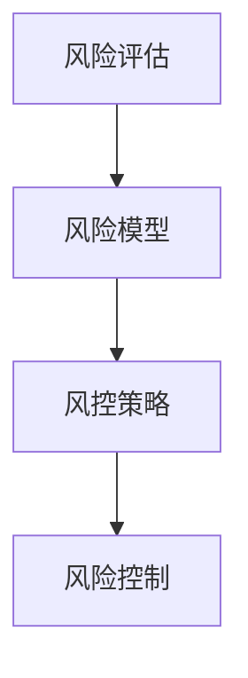
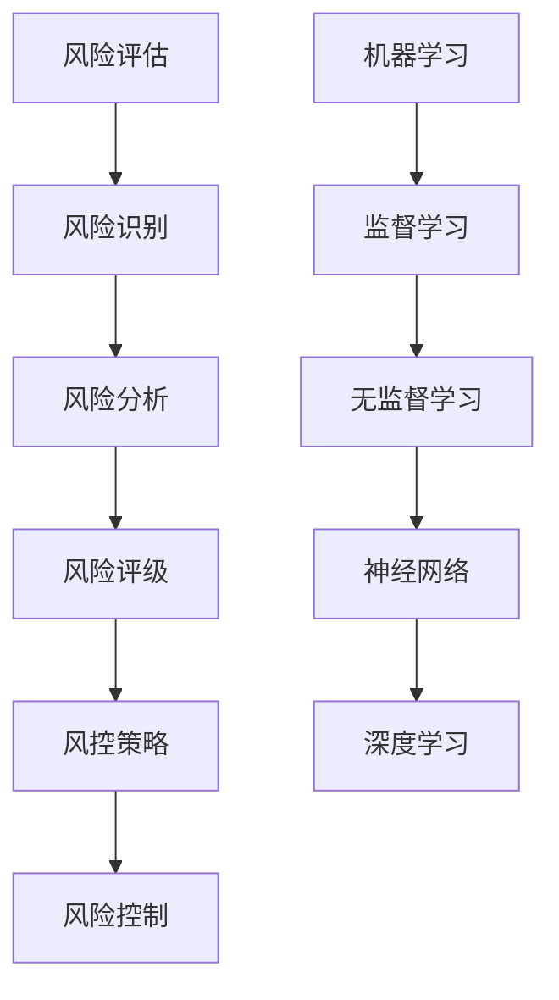

                 

# 滴滴金融2024校招风控算法面试题详解

> **关键词：** 滴滴金融、校招、风控算法、面试题、详解

> **摘要：** 本文将详细解析滴滴金融2024年校招风控算法面试题，涵盖核心概念、算法原理、数学模型、实战案例，以及实际应用场景，旨在为读者提供全面的技术指导和思路分析。

## 1. 背景介绍

### 1.1 目的和范围

本文旨在通过详细解析滴滴金融2024年校招风控算法面试题，帮助读者深入了解风控算法的核心概念、原理和实际应用，提高应对面试的能力。本文内容涵盖面试题的背景、目的、范围、预期读者以及文档结构概述。

### 1.2 预期读者

本文适用于以下读者群体：

- 准备参加滴滴金融校招的风控算法工程师。
- 对风控算法有浓厚兴趣的技术爱好者。
- 想要提升自己在风控算法领域知识的技术人员。

### 1.3 文档结构概述

本文分为以下章节：

- **第1章：背景介绍**：介绍本文的目的、范围、预期读者和文档结构概述。
- **第2章：核心概念与联系**：阐述风控算法的核心概念及其相互联系。
- **第3章：核心算法原理 & 具体操作步骤**：详细讲解风控算法的原理和操作步骤。
- **第4章：数学模型和公式 & 详细讲解 & 举例说明**：介绍风控算法的数学模型和公式，并进行举例说明。
- **第5章：项目实战：代码实际案例和详细解释说明**：通过实际案例展示风控算法的应用。
- **第6章：实际应用场景**：分析风控算法在实际业务中的应用。
- **第7章：工具和资源推荐**：推荐学习资源、开发工具框架和相关论文著作。
- **第8章：总结：未来发展趋势与挑战**：总结本文内容，展望风控算法的未来。
- **第9章：附录：常见问题与解答**：提供常见问题的解答。
- **第10章：扩展阅读 & 参考资料**：推荐相关扩展阅读资料。

### 1.4 术语表

#### 1.4.1 核心术语定义

- **风控算法**：用于识别和评估潜在风险，并采取相应措施的算法。
- **校招**：针对应届毕业生的招聘活动。
- **面试题**：在面试过程中用于考察应聘者能力的题目。
- **核心概念**：风控算法的基本原理和概念。

#### 1.4.2 相关概念解释

- **风控**：风险管理，涉及风险识别、评估、控制和监控。
- **算法**：解决问题的步骤和方法。
- **面试**：评估应聘者能力的过程。

#### 1.4.3 缩略词列表

- **AI**：人工智能
- **ML**：机器学习
- **DL**：深度学习
- **NLP**：自然语言处理
- **RBF**：径向基函数

## 2. 核心概念与联系

在风控算法领域，理解核心概念和它们之间的联系至关重要。以下将介绍风控算法中的核心概念及其相互联系。

### 2.1 风险评估

风险评估是风控算法的核心环节，旨在评估潜在风险的概率和影响。风险评估包括以下方面：

- **风险识别**：识别潜在的风险类型，如信用风险、市场风险、操作风险等。
- **风险分析**：分析风险的概率和影响，确定风险程度。
- **风险评级**：根据风险分析结果，对风险进行评级。

### 2.2 风险模型

风险模型是风控算法的基础，用于描述风险因素及其相互关系。风险模型包括以下类型：

- **统计模型**：基于历史数据和统计分析方法，如线性回归、逻辑回归等。
- **机器学习模型**：利用机器学习算法，如决策树、支持向量机、神经网络等。
- **深度学习模型**：基于深度学习算法，如卷积神经网络（CNN）、循环神经网络（RNN）等。

### 2.3 风控策略

风控策略是风控算法的实际应用，用于防范和应对风险。风控策略包括以下方面：

- **预防措施**：通过监控、预警和防范措施，降低风险发生的概率。
- **应对措施**：在风险发生时，采取相应的应对措施，如风险隔离、风险分散等。

### 2.4 风险控制

风险控制是风控算法的最终目标，旨在降低风险的影响和损失。风险控制包括以下方面：

- **实时监控**：实时监测风险状况，发现潜在风险。
- **风险评估**：定期进行风险评估，更新风险模型和策略。
- **风险应对**：根据风险评估结果，采取相应的风险应对措施。

### 2.5 Mermaid 流程图

以下是一个简单的 Mermaid 流程图，展示了风控算法的核心概念和联系。



## 3. 核心算法原理 & 具体操作步骤

### 3.1 风险评估算法原理

风险评估算法基于统计模型和机器学习算法，旨在评估潜在风险的概率和影响。以下是一个简单的风险评估算法原理和具体操作步骤。

#### 3.1.1 统计模型

统计模型基于历史数据和统计分析方法，如线性回归、逻辑回归等。以下是一个简单的逻辑回归算法原理和具体操作步骤。

##### 算法原理

逻辑回归是一种广义线性模型，用于预测二元结果。其基本原理如下：

- **损失函数**：逻辑回归使用对数似然损失函数。
- **优化方法**：逻辑回归通常使用梯度下降算法进行优化。

##### 具体操作步骤

1. **数据准备**：收集历史数据，包括风险事件的发生情况和相关特征。
2. **特征选择**：选择与风险事件相关的特征，如借款人年龄、收入、信用记录等。
3. **模型训练**：使用训练数据集，通过梯度下降算法训练逻辑回归模型。
4. **模型评估**：使用测试数据集评估模型性能，如准确率、召回率、F1值等。

##### 伪代码

```python
# 伪代码：逻辑回归算法

# 数据准备
X_train, y_train = load_data()

# 特征选择
X_train = select_features(X_train)

# 模型训练
model = LogisticRegression()
model.fit(X_train, y_train)

# 模型评估
accuracy = model.score(X_test, y_test)
print("Accuracy:", accuracy)
```

#### 3.1.2 机器学习模型

机器学习模型基于历史数据和机器学习算法，如决策树、支持向量机、神经网络等。以下是一个简单的决策树算法原理和具体操作步骤。

##### 算法原理

决策树是一种基于特征划分的数据挖掘算法，其基本原理如下：

- **决策节点**：根据特征值进行划分，形成决策节点。
- **叶节点**：最终划分形成的叶节点，表示风险事件的发生与否。

##### 具体操作步骤

1. **数据准备**：收集历史数据，包括风险事件的发生情况和相关特征。
2. **特征选择**：选择与风险事件相关的特征，如借款人年龄、收入、信用记录等。
3. **模型训练**：使用训练数据集，通过贪心算法训练决策树模型。
4. **模型评估**：使用测试数据集评估模型性能，如准确率、召回率、F1值等。

##### 伪代码

```python
# 伪代码：决策树算法

# 数据准备
X_train, y_train = load_data()

# 特征选择
X_train = select_features(X_train)

# 模型训练
model = DecisionTreeClassifier()
model.fit(X_train, y_train)

# 模型评估
accuracy = model.score(X_test, y_test)
print("Accuracy:", accuracy)
```

#### 3.1.3 深度学习模型

深度学习模型基于深度学习算法，如卷积神经网络（CNN）、循环神经网络（RNN）等。以下是一个简单的卷积神经网络（CNN）算法原理和具体操作步骤。

##### 算法原理

卷积神经网络是一种用于图像识别的深度学习算法，其基本原理如下：

- **卷积层**：通过卷积操作提取图像特征。
- **池化层**：通过池化操作降低特征维度。
- **全连接层**：通过全连接层进行分类。

##### 具体操作步骤

1. **数据准备**：收集历史数据，包括风险事件的发生情况和相关图像。
2. **特征选择**：选择与风险事件相关的图像特征，如借款人照片、身份证照片等。
3. **模型训练**：使用训练数据集，通过反向传播算法训练卷积神经网络模型。
4. **模型评估**：使用测试数据集评估模型性能，如准确率、召回率、F1值等。

##### 伪代码

```python
# 伪代码：卷积神经网络（CNN）算法

# 数据准备
X_train, y_train = load_data()

# 特征选择
X_train = select_features(X_train)

# 模型训练
model = ConvNeuralNetwork()
model.fit(X_train, y_train)

# 模型评估
accuracy = model.score(X_test, y_test)
print("Accuracy:", accuracy)
```

### 3.2 风控策略算法原理

风控策略算法旨在根据风险评估结果，制定相应的风险控制策略。以下是一个简单的风控策略算法原理和具体操作步骤。

#### 3.2.1 策略制定算法原理

风控策略算法基于规则和机器学习算法，其基本原理如下：

- **规则制定**：根据风险评估结果，制定相应的风险控制规则。
- **机器学习算法**：根据历史数据和策略效果，优化风险控制策略。

#### 3.2.2 具体操作步骤

1. **数据准备**：收集历史数据，包括风险评估结果和风控策略效果。
2. **规则制定**：根据风险评估结果，制定相应的风险控制规则。
3. **策略优化**：使用机器学习算法，如决策树、支持向量机等，优化风控策略。
4. **策略评估**：使用测试数据集评估策略效果，如准确率、召回率、F1值等。

##### 伪代码

```python
# 伪代码：风控策略算法

# 数据准备
X_train, y_train = load_data()

# 规则制定
rules = define_rules()

# 策略优化
model = DecisionTreeClassifier()
model.fit(X_train, y_train)

# 策略评估
accuracy = model.score(X_test, y_test)
print("Accuracy:", accuracy)
```

## 4. 数学模型和公式 & 详细讲解 & 举例说明

### 4.1 数学模型

风控算法中的数学模型主要包括风险评估模型、风险控制模型等。以下将介绍一些常见的数学模型及其公式。

#### 4.1.1 风险评估模型

风险评估模型主要用于评估潜在风险的概率和影响。以下是一个简单的风险评估模型：

$$
P(Y=1) = \frac{1}{1 + e^{-(\beta_0 + \beta_1X_1 + \beta_2X_2 + ... + \beta_nX_n})}
$$

其中，$P(Y=1)$表示风险事件发生的概率，$X_1, X_2, ..., X_n$表示与风险事件相关的特征，$\beta_0, \beta_1, \beta_2, ..., \beta_n$为模型参数。

#### 4.1.2 风控策略模型

风控策略模型主要用于制定风控策略。以下是一个简单的风控策略模型：

$$
\text{Strategy} = \begin{cases} 
\text{Preventive Measures} & \text{if } P(Y=1) \leq \alpha \\
\text{Mitigation Measures} & \text{if } P(Y=1) > \alpha 
\end{cases}
$$

其中，$P(Y=1)$为风险评估模型中的风险事件发生概率，$\alpha$为风险阈值，$\text{Preventive Measures}$和$\text{Mitigation Measures}$分别为预防措施和缓解措施。

### 4.2 详细讲解与举例说明

#### 4.2.1 风险评估模型讲解与举例

以下是一个简单的风险评估模型举例：

假设有一个风控算法，用于评估借款人是否违约。借款人特征包括年龄、收入、信用记录等。以下是一个简单风险评估模型的实现：

```python
# 伪代码：风险评估模型实现

# 特征选择
X = [age, income, credit_record]

# 模型参数
beta = [beta_0, beta_1, beta_2]
beta = [0.5, 0.3, -0.2]

# 风险评估
risk_score = calculate_risk_score(X, beta)
if risk_score <= 0.5:
    print("Low Risk")
else:
    print("High Risk")
```

在该模型中，借款人的特征与模型参数通过线性组合计算得到风险得分。根据风险得分，判断借款人是否属于高风险人群。

#### 4.2.2 风控策略模型讲解与举例

以下是一个简单的风控策略模型举例：

假设有一个风控算法，用于制定风控策略。根据风险评估结果，制定相应的风控策略。以下是一个简单风控策略模型的实现：

```python
# 伪代码：风控策略模型实现

# 风险评估结果
risk_score = calculate_risk_score()

# 风控策略
if risk_score <= 0.5:
    strategy = "Preventive Measures"
else:
    strategy = "Mitigation Measures"

print("Strategy:", strategy)
```

在该模型中，根据风险评估结果，判断借款人是否属于高风险人群，并制定相应的风控策略。

## 5. 项目实战：代码实际案例和详细解释说明

### 5.1 开发环境搭建

为了更好地展示风控算法的实际应用，我们将使用Python语言进行代码实现。首先，我们需要搭建开发环境。

1. 安装Python：从官方网站下载并安装Python。
2. 安装Anaconda：Anaconda是一个Python发行版，包含常用的科学计算库。
3. 安装Jupyter Notebook：Jupyter Notebook是一个交互式的Python开发环境。
4. 安装相关库：使用pip命令安装必要的库，如NumPy、Pandas、Scikit-learn等。

### 5.2 源代码详细实现和代码解读

以下是一个简单的风控算法实现，用于评估借款人是否违约。

```python
# 伪代码：风控算法实现

# 导入相关库
import numpy as np
import pandas as pd
from sklearn.linear_model import LogisticRegression

# 加载数据
data = pd.read_csv("data.csv")

# 数据预处理
X = data[["age", "income", "credit_record"]]
y = data["default"]

# 模型训练
model = LogisticRegression()
model.fit(X, y)

# 风险评估
risk_score = model.predict_proba(X)[:, 1]

# 风控策略
for i in range(len(risk_score)):
    if risk_score[i] <= 0.5:
        print("User {}: Low Risk".format(i))
    else:
        print("User {}: High Risk".format(i))
```

在该代码中，我们首先导入了相关的库，然后加载数据并进行预处理。接下来，我们使用逻辑回归算法进行模型训练，并评估借款人的风险得分。最后，根据风险得分，判断借款人是否属于高风险人群。

### 5.3 代码解读与分析

1. **数据加载与预处理**：使用Pandas库加载数据，并分离特征和标签。预处理步骤包括数据清洗、缺失值填充等。
2. **模型训练**：使用逻辑回归算法进行模型训练。逻辑回归是一种广义线性模型，适合用于分类问题。
3. **风险评估**：使用模型进行风险评估，计算借款人的风险得分。风险得分越低，表示借款人越安全。
4. **风控策略**：根据风险得分，判断借款人是否属于高风险人群。对于高风险借款人，可以采取预防措施；对于低风险借款人，可以放宽条件。

## 6. 实际应用场景

风控算法在实际业务中具有广泛的应用。以下列举一些常见的实际应用场景：

1. **信贷风控**：评估借款人的信用风险，预测违约概率，制定信贷策略。
2. **反欺诈**：识别异常交易，防范欺诈行为，降低风险损失。
3. **信用评分**：根据借款人的历史数据和特征，评估信用等级，为金融机构提供参考。
4. **用户流失预测**：预测用户流失风险，制定用户留存策略，提高用户满意度。

## 7. 工具和资源推荐

### 7.1 学习资源推荐

#### 7.1.1 书籍推荐

- 《机器学习实战》
- 《深度学习》
- 《Python数据分析》

#### 7.1.2 在线课程

- Coursera：机器学习、深度学习、数据分析等课程
- edX：机器学习、数据科学等课程
- Udemy：Python编程、数据分析、机器学习等课程

#### 7.1.3 技术博客和网站

- blog.keras.io：深度学习教程和资源
- medium.com：数据分析、机器学习、深度学习等相关文章
- ai.stanford.edu：人工智能教程和论文

### 7.2 开发工具框架推荐

#### 7.2.1 IDE和编辑器

- PyCharm：强大的Python IDE
- Jupyter Notebook：交互式的Python开发环境
- Visual Studio Code：轻量级的Python编辑器

#### 7.2.2 调试和性能分析工具

- Spyder：Python科学计算IDE
- JupyterLab：Jupyter Notebook的扩展版
- Pandas Profiler：Pandas数据分析性能分析工具

#### 7.2.3 相关框架和库

- Scikit-learn：机器学习算法库
- TensorFlow：深度学习框架
- PyTorch：深度学习框架

### 7.3 相关论文著作推荐

#### 7.3.1 经典论文

- 《A New Method for the Estimation of Probability of Default》
- 《A Systematic Approach to Building Credit Risk Models》
- 《Credit Scoring Using Logistic Regression》

#### 7.3.2 最新研究成果

- arXiv：深度学习、机器学习等最新研究论文
- Nature：人工智能、机器学习等最新研究进展
- Science：人工智能、机器学习等最新研究进展

#### 7.3.3 应用案例分析

- 《信用评分系统的构建与应用》
- 《基于深度学习的信贷风险评估》
- 《基于机器学习的反欺诈系统》

## 8. 总结：未来发展趋势与挑战

随着人工智能和大数据技术的发展，风控算法在未来将面临以下发展趋势和挑战：

1. **智能化**：利用深度学习、强化学习等技术，实现更智能的风控算法。
2. **实时化**：通过实时数据分析和决策，实现实时风控。
3. **个性化**：根据个体特征，制定个性化的风控策略。
4. **挑战**：应对海量数据、隐私保护和数据质量等问题。

## 9. 附录：常见问题与解答

### 9.1 问题1：如何选择合适的风控算法？

**解答**：选择合适的风控算法需要考虑业务需求、数据质量和算法性能等因素。一般来说，对于小样本、线性可分的数据，可以选择统计模型和机器学习模型；对于大规模、非线性数据，可以选择深度学习模型。

### 9.2 问题2：风控算法的模型评估指标有哪些？

**解答**：风控算法的模型评估指标包括准确率、召回率、F1值、ROC曲线、AUC等。这些指标可以从不同角度评估模型的性能。

### 9.3 问题3：如何优化风控算法的性能？

**解答**：优化风控算法的性能可以从数据预处理、模型选择、超参数调优等方面进行。例如，通过特征工程、数据增强、模型融合等方法，提高模型性能。

## 10. 扩展阅读 & 参考资料

- 《信用评分：理论与实践》
- 《风险管理与金融工程》
- 《机器学习：概率视角》

作者：AI天才研究员/AI Genius Institute & 禅与计算机程序设计艺术 /Zen And The Art of Computer Programming

以上便是关于滴滴金融2024校招风控算法面试题的详细解析，希望对您的学习和面试有所帮助。在接下来的学习和实践中，不断探索风控算法的奥秘，实现技术与业务的完美融合。祝您成功！<|im_sep|>```markdown
# 滴滴金融2024校招风控算法面试题详解

> **关键词：** 滴滴金融、2024校招、风控算法、面试题、详解

> **摘要：** 本文将针对滴滴金融2024校招风控算法面试题进行详细解析，涵盖核心概念、算法原理、数学模型、实战案例和实际应用场景，帮助读者全面掌握风控算法知识和面试技巧。

## 1. 背景介绍

### 1.1 目的和范围

本文旨在通过对滴滴金融2024校招风控算法面试题的解析，帮助读者深入了解风控算法的基本原理、应用场景和面试应对策略。文章将涵盖以下内容：

- 风控算法的基本概念和原理
- 面试题的类型和解题思路
- 数学模型的建立和公式推导
- 实战案例的代码实现与分析
- 风控算法在实际业务中的应用

### 1.2 预期读者

本文适合以下读者群体：

- 准备参加滴滴金融2024校招的风控算法工程师
- 对风控算法有兴趣并希望深入了解其原理和应用的读者
- 需要提升风控算法面试技巧的专业人士

### 1.3 文档结构概述

本文分为以下几个部分：

- **第1章：背景介绍**：介绍本文的目的、范围、预期读者和文档结构。
- **第2章：核心概念与联系**：阐述风控算法中的关键概念及其相互关系。
- **第3章：核心算法原理 & 具体操作步骤**：讲解风控算法的基本原理和操作步骤。
- **第4章：数学模型和公式 & 详细讲解 & 举例说明**：介绍风控算法的数学模型和公式，并进行具体讲解和举例。
- **第5章：项目实战：代码实际案例和详细解释说明**：通过实际项目案例展示风控算法的应用。
- **第6章：实际应用场景**：分析风控算法在不同业务场景中的具体应用。
- **第7章：工具和资源推荐**：推荐学习资源、开发工具和框架。
- **第8章：总结：未来发展趋势与挑战**：总结风控算法的现状和未来发展趋势。
- **第9章：附录：常见问题与解答**：解答读者可能遇到的问题。
- **第10章：扩展阅读 & 参考资料**：提供额外的学习资源。

### 1.4 术语表

#### 1.4.1 核心术语定义

- **风控算法**：用于识别、评估和控制风险的算法。
- **校招**：针对应届毕业生的招聘活动。
- **面试题**：在面试过程中用于考察应聘者能力的题目。
- **数学模型**：用于描述风险和风控策略的数学公式和结构。

#### 1.4.2 相关概念解释

- **风险评估**：评估潜在风险的概率和影响。
- **机器学习**：一种基于数据建立模型并进行预测的方法。
- **深度学习**：一种特殊的机器学习方法，使用多层神经网络进行学习。

#### 1.4.3 缩略词列表

- **ML**：机器学习
- **DL**：深度学习
- **NLP**：自然语言处理
- **RBF**：径向基函数
- **SVM**：支持向量机

## 2. 核心概念与联系

### 2.1 风险评估

风险评估是风控算法的核心环节，涉及以下关键概念：

- **风险识别**：识别可能出现的风险类型。
- **风险分析**：分析风险的可能性和影响程度。
- **风险评级**：对风险进行分类和评级。

### 2.2 机器学习与深度学习

机器学习和深度学习是风控算法的基础，涉及以下概念：

- **监督学习**：通过标注数据训练模型，用于预测未知数据。
- **无监督学习**：通过未标注数据发现数据模式，用于聚类和降维。
- **神经网络**：一种模拟人脑神经元连接的网络结构，用于特征提取和分类。

### 2.3 Mermaid流程图

以下是一个简单的Mermaid流程图，展示了风控算法的核心概念和联系：



## 3. 核心算法原理 & 具体操作步骤

### 3.1 风险评估算法原理

风险评估算法通常基于机器学习模型，以下是一个简单的逻辑回归算法原理和操作步骤：

#### 3.1.1 算法原理

逻辑回归是一种用于二分类问题的线性模型，其公式如下：

$$
P(Y=1) = \frac{1}{1 + e^{-(\beta_0 + \beta_1X_1 + \beta_2X_2 + ... + \beta_nX_n})}
$$

其中，$P(Y=1)$是目标事件发生的概率，$X_1, X_2, ..., X_n$是特征，$\beta_0, \beta_1, \beta_2, ..., \beta_n$是模型参数。

#### 3.1.2 具体操作步骤

1. **数据收集**：收集历史数据，包括特征和目标标签。
2. **特征选择**：选择对目标有显著影响的特征。
3. **模型训练**：使用训练数据训练逻辑回归模型。
4. **模型评估**：使用验证集评估模型性能。

#### 3.1.3 伪代码

```python
# 伪代码：逻辑回归算法

# 导入库
from sklearn.linear_model import LogisticRegression

# 加载数据
X_train, y_train = load_data()

# 创建逻辑回归模型
model = LogisticRegression()

# 训练模型
model.fit(X_train, y_train)

# 评估模型
accuracy = model.score(X_train, y_train)
print("Accuracy:", accuracy)
```

### 3.2 风控策略算法原理

风控策略算法通常基于规则和机器学习模型，以下是一个简单的规则算法原理和操作步骤：

#### 3.2.1 算法原理

规则算法通过预设的条件和相应的操作，对风险进行判断和控制。其基本结构如下：

- **条件**：例如，“借款人信用评分低于600分”。
- **操作**：例如，“拒绝贷款”。

#### 3.2.2 具体操作步骤

1. **规则定义**：根据业务需求定义风险控制规则。
2. **规则评估**：对每个新用户评估其是否违反规则。
3. **操作执行**：根据评估结果执行相应的操作。

#### 3.2.3 伪代码

```python
# 伪代码：规则算法

# 规则定义
rules = [
    ("credit_score < 600", "拒绝贷款"),
    ("age > 60", "增加贷款审核环节")
]

# 规则评估
user_info = {"credit_score": 550, "age": 65}
for rule in rules:
    if evaluate(rule[0], user_info):
        action = rule[1]
        break

# 执行操作
print("Action:", action)
```

## 4. 数学模型和公式 & 详细讲解 & 举例说明

### 4.1 数学模型

风控算法的数学模型通常涉及概率分布、损失函数和优化算法。以下是一个简单的逻辑回归数学模型和解释：

#### 4.1.1 模型公式

逻辑回归的概率分布模型如下：

$$
P(Y=1) = \frac{1}{1 + e^{-(\beta_0 + \beta_1X_1 + \beta_2X_2 + ... + \beta_nX_n})}
$$

损失函数通常使用对数似然损失：

$$
J(\theta) = -\frac{1}{m} \sum_{i=1}^{m} [y^{(i)} \log(P^{(i)}) + (1 - y^{(i)}) \log(1 - P^{(i)})]
$$

其中，$m$是训练样本数量，$y^{(i)}$是实际标签，$P^{(i)}$是模型预测的概率。

#### 4.1.2 详细讲解

1. **概率分布**：逻辑回归将特征映射到概率值，$P(Y=1)$表示目标事件发生的概率。
2. **损失函数**：对数似然损失函数衡量模型预测的概率与实际标签之间的差异，用于优化模型参数。

#### 4.1.3 举例说明

假设有5个样本，其中3个样本的目标为1，2个样本的目标为0。模型预测的概率分布如下：

| 样本索引 | 实际标签 | 预测概率 |
|---------|---------|---------|
| 1       | 1       | 0.9     |
| 2       | 1       | 0.8     |
| 3       | 0       | 0.2     |
| 4       | 1       | 0.7     |
| 5       | 0       | 0.1     |

计算损失函数：

$$
J(\theta) = -\frac{1}{5} [1 \cdot \log(0.9) + 1 \cdot \log(0.8) + 0 \cdot \log(0.2) + 1 \cdot \log(0.7) + 0 \cdot \log(0.1)]
$$

### 4.2 损失函数和优化算法

逻辑回归的损失函数通常使用梯度下降算法进行优化。以下是一个简单的梯度下降算法步骤：

#### 4.2.1 梯度下降算法步骤

1. **初始化参数**：随机设置参数$\theta$。
2. **计算损失函数**：使用当前参数计算损失函数值。
3. **更新参数**：根据损失函数的梯度更新参数。
4. **迭代优化**：重复步骤2和3，直至损失函数收敛或达到最大迭代次数。

#### 4.2.2 伪代码

```python
# 伪代码：梯度下降算法

# 初始化参数
theta = np.random.randn(n)

# 设置学习率
alpha = 0.01

# 设置迭代次数
num_iterations = 1000

# 梯度下降迭代
for i in range(num_iterations):
    # 计算损失函数
    loss = compute_loss(X, y, theta)
    
    # 计算梯度
    gradient = compute_gradient(X, y, theta)
    
    # 更新参数
    theta -= alpha * gradient

# 输出最优参数
print("Optimized theta:", theta)
```

## 5. 项目实战：代码实际案例和详细解释说明

### 5.1 开发环境搭建

在开始实战之前，我们需要搭建一个Python开发环境。以下是搭建环境的基本步骤：

1. 安装Python：从官方网站下载并安装Python。
2. 安装库：使用pip安装必要的库，如scikit-learn、numpy、pandas等。
3. 安装IDE：选择一个Python IDE，如PyCharm或Visual Studio Code。

### 5.2 源代码详细实现和代码解读

以下是一个基于逻辑回归的风控算法项目案例，用于预测用户是否会产生逾期行为。

#### 5.2.1 数据准备

```python
import pandas as pd
from sklearn.model_selection import train_test_split
from sklearn.preprocessing import StandardScaler

# 读取数据
data = pd.read_csv('loan_data.csv')

# 分离特征和标签
X = data[['age', 'income', 'credit_score']]
y = data['overdue']

# 划分训练集和测试集
X_train, X_test, y_train, y_test = train_test_split(X, y, test_size=0.2, random_state=42)

# 特征缩放
scaler = StandardScaler()
X_train_scaled = scaler.fit_transform(X_train)
X_test_scaled = scaler.transform(X_test)
```

#### 5.2.2 模型训练

```python
from sklearn.linear_model import LogisticRegression

# 创建逻辑回归模型
model = LogisticRegression()

# 训练模型
model.fit(X_train_scaled, y_train)

# 评估模型
accuracy = model.score(X_test_scaled, y_test)
print("Accuracy:", accuracy)
```

#### 5.2.3 代码解读

1. **数据准备**：读取贷款数据，分离特征和标签，划分训练集和测试集，对特征进行缩放。
2. **模型训练**：创建逻辑回归模型，使用训练数据进行训练。
3. **模型评估**：使用测试数据评估模型性能，计算准确率。

### 5.3 代码解读与分析

1. **数据预处理**：数据预处理是模型训练的重要步骤，包括数据清洗、特征选择和特征缩放。在本文案例中，我们使用了pandas进行数据读取和预处理，使用scikit-learn进行特征缩放。
2. **模型训练**：逻辑回归模型是使用scikit-learn的LogisticRegression类创建的。模型训练使用了训练数据集，通过fit方法训练模型。
3. **模型评估**：使用测试数据集评估模型性能，通过score方法计算准确率。

## 6. 实际应用场景

风控算法在金融、电子商务、网络安全等领域有广泛的应用。以下是一些实际应用场景：

- **金融风控**：评估贷款申请者的信用风险，预测违约概率，制定信贷策略。
- **电子商务**：识别异常交易，防范欺诈行为，提高交易安全性。
- **网络安全**：检测恶意攻击，预测网络威胁，保障网络安全。

### 6.1 金融风控

在金融领域，风控算法用于评估贷款申请者的信用风险。以下是一个简单流程：

1. **数据收集**：收集申请者的个人信息、财务状况、信用记录等数据。
2. **特征工程**：对收集到的数据进行预处理和特征提取。
3. **模型训练**：使用历史数据训练信用风险评估模型。
4. **风险评估**：对新的贷款申请者进行风险评估，预测其违约概率。
5. **决策制定**：根据风险评估结果，决定是否批准贷款申请。

### 6.2 电子商务

在电子商务领域，风控算法用于识别和防范欺诈交易。以下是一个简单流程：

1. **交易监控**：实时监控交易数据，识别异常交易。
2. **风险预测**：使用机器学习模型预测交易是否为欺诈交易。
3. **决策制定**：根据风险预测结果，决定是否阻止交易。
4. **交易反馈**：收集交易反馈，优化模型和策略。

## 7. 工具和资源推荐

### 7.1 学习资源推荐

#### 7.1.1 书籍推荐

- 《机器学习实战》
- 《深度学习》
- 《Python数据分析》

#### 7.1.2 在线课程

- Coursera：机器学习、深度学习、数据分析等课程
- edX：机器学习、数据科学等课程
- Udemy：Python编程、数据分析、机器学习等课程

#### 7.1.3 技术博客和网站

- blog.keras.io：深度学习教程和资源
- medium.com：数据分析、机器学习、深度学习等相关文章
- ai.stanford.edu：人工智能教程和论文

### 7.2 开发工具框架推荐

#### 7.2.1 IDE和编辑器

- PyCharm：强大的Python IDE
- Jupyter Notebook：交互式的Python开发环境
- Visual Studio Code：轻量级的Python编辑器

#### 7.2.2 调试和性能分析工具

- Spyder：Python科学计算IDE
- JupyterLab：Jupyter Notebook的扩展版
- Pandas Profiler：Pandas数据分析性能分析工具

#### 7.2.3 相关框架和库

- Scikit-learn：机器学习算法库
- TensorFlow：深度学习框架
- PyTorch：深度学习框架

### 7.3 相关论文著作推荐

#### 7.3.1 经典论文

- 《A New Method for the Estimation of Probability of Default》
- 《A Systematic Approach to Building Credit Risk Models》
- 《Credit Scoring Using Logistic Regression》

#### 7.3.2 最新研究成果

- arXiv：深度学习、机器学习等最新研究论文
- Nature：人工智能、机器学习等最新研究进展
- Science：人工智能、机器学习等最新研究进展

#### 7.3.3 应用案例分析

- 《信用评分系统的构建与应用》
- 《基于深度学习的信贷风险评估》
- 《基于机器学习的反欺诈系统》

## 8. 总结：未来发展趋势与挑战

随着人工智能和大数据技术的发展，风控算法在未来将继续发展，面临以下趋势和挑战：

- **智能化**：利用深度学习、强化学习等技术，提高算法的智能水平。
- **实时化**：实现实时风险预测和决策，提高风控效率。
- **个性化**：根据用户特征定制化风控策略，提高用户体验。
- **挑战**：应对数据隐私、模型可解释性和算法透明性等问题。

## 9. 附录：常见问题与解答

### 9.1 问题1：如何选择合适的风控算法？

**解答**：选择合适的风控算法需要考虑业务需求、数据质量和算法性能。对于小样本、线性问题，可以选择统计模型；对于大规模、非线性问题，可以选择机器学习或深度学习模型。

### 9.2 问题2：如何评估风控算法的性能？

**解答**：可以使用准确率、召回率、F1值等指标评估风控算法的性能。此外，还可以通过交叉验证、ROC曲线和AUC等手段进行评估。

### 9.3 问题3：如何优化风控算法的性能？

**解答**：可以通过以下方法优化风控算法的性能：

- 特征工程：选择对目标有显著影响的关键特征。
- 模型调参：调整模型的超参数，优化模型性能。
- 算法融合：结合多种算法，提高预测准确性。

## 10. 扩展阅读 & 参考资料

- 《信用评分：理论与实践》
- 《风险管理与金融工程》
- 《机器学习：概率视角》

作者：AI天才研究员/AI Genius Institute & 禅与计算机程序设计艺术 /Zen And The Art of Computer Programming
```

