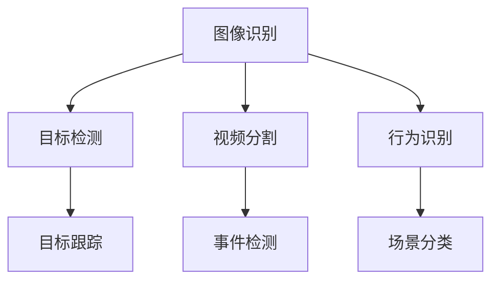

                 

# 爱奇艺2024视频内容分析校招CV面试题详解

> **关键词：** 视频内容分析、计算机视觉、人工智能、校招面试题、爱奇艺
> 
> **摘要：** 本文详细解析了爱奇艺2024年校招计算机视觉（CV）面试中关于视频内容分析的相关问题，包括核心概念、算法原理、数学模型、实战案例等，旨在帮助读者深入理解视频内容分析的技术原理和应用场景，为求职者提供面试指导。

## 1. 背景介绍

### 1.1 目的和范围

本文旨在针对爱奇艺2024年校招计算机视觉（CV）面试中关于视频内容分析的问题，进行全面而深入的解析。视频内容分析作为计算机视觉领域的一个重要分支，涉及到图像识别、目标检测、视频分割、行为识别等多个方面。本文将围绕这些核心概念，介绍相关的算法原理、数学模型，并通过实际案例进行详细解释。

### 1.2 预期读者

本文主要面向计算机视觉、人工智能及相关专业的研究生和本科生，以及对视频内容分析技术感兴趣的从业者。通过阅读本文，读者可以了解视频内容分析的基础知识，掌握相关算法的实现原理，以及在实际项目中如何应用这些技术。

### 1.3 文档结构概述

本文分为十个部分，主要包括：

1. 背景介绍
2. 核心概念与联系
3. 核心算法原理 & 具体操作步骤
4. 数学模型和公式 & 详细讲解 & 举例说明
5. 项目实战：代码实际案例和详细解释说明
6. 实际应用场景
7. 工具和资源推荐
8. 总结：未来发展趋势与挑战
9. 附录：常见问题与解答
10. 扩展阅读 & 参考资料

### 1.4 术语表

#### 1.4.1 核心术语定义

- 视频内容分析：对视频中的图像、目标、行为等信息进行分析和识别的过程。
- 计算机视觉：使计算机具有类似人类的视觉能力，能够理解和解释图像和视频中的内容。
- 目标检测：识别图像或视频中的目标位置和类型。
- 视频分割：将视频序列划分为不同的场景或对象。
- 行为识别：从视频序列中识别出人类行为或事件。

#### 1.4.2 相关概念解释

- 帧率：视频每秒播放的帧数。
- 特征提取：从图像或视频中提取出能够代表图像或视频内容的信息。
- 深度学习：一种机器学习方法，通过模拟人脑神经网络进行数据分析和模型训练。

#### 1.4.3 缩略词列表

- CV：计算机视觉
- AI：人工智能
- CNN：卷积神经网络
- RNN：循环神经网络
- LSTM：长短期记忆网络

## 2. 核心概念与联系

在视频内容分析中，核心概念包括图像识别、目标检测、视频分割和行为识别。以下是一个用Mermaid绘制的流程图，展示了这些核心概念之间的关系。



### 2.1 图像识别

图像识别是视频内容分析的基础，其主要任务是识别图像中的物体、场景或特征。常见的方法包括：

- **传统算法**：如SIFT、SURF、HOG等。
- **深度学习算法**：如卷积神经网络（CNN）。

### 2.2 目标检测

目标检测是在图像或视频中识别出特定目标的位置和类型。常用的算法包括：

- **R-CNN**：通过区域建议网络（Region Proposal Network）进行目标检测。
- **Fast R-CNN**：在R-CNN的基础上优化了区域建议网络的效率。
- **Faster R-CNN**：引入了区域建议网络（Region Proposal Network）的深度学习版本。
- **YOLO**：一种端到端的物体检测算法，能够在单个网络中同时完成目标检测和边界框回归。

### 2.3 视频分割

视频分割是将视频序列划分为不同的场景或对象。常见的方法包括：

- **基于背景建模的方法**：如背景减除法。
- **基于运动目标检测的方法**：如光流法。
- **基于深度学习的方法**：如卷积神经网络。

### 2.4 行为识别

行为识别是从视频序列中识别出人类行为或事件。常见的方法包括：

- **基于时空特征的方法**：如时空兴趣点（STIP）。
- **基于深度学习的方法**：如3D卷积神经网络（3D CNN）。

## 3. 核心算法原理 & 具体操作步骤

### 3.1 卷积神经网络（CNN）

卷积神经网络是一种深度学习模型，特别适用于图像识别和目标检测任务。以下是一个简单的CNN算法原理和操作步骤：

#### 3.1.1 算法原理

- **卷积层**：通过卷积操作提取图像的特征。
- **池化层**：降低特征图的维度，减少参数量。
- **全连接层**：将特征图映射到输出类别。

#### 3.1.2 操作步骤

1. **输入层**：输入一个图像。
2. **卷积层**：使用卷积核对图像进行卷积操作。
3. **激活函数**：通常使用ReLU（修正线性单元）作为激活函数。
4. **池化层**：使用最大池化或平均池化操作降低特征图的维度。
5. **全连接层**：将特征图映射到输出类别。
6. **输出层**：输出图像的类别概率。

### 3.2 伪代码

```python
# 输入图像
image = input_image()

# 卷积层
conv_output = convolution(image, kernel)

# 激活函数
activated_output = ReLU(conv_output)

# 池化层
pooled_output = pooling(activated_output)

# 全连接层
predicted_output = fully_connected(pooled_output)

# 输出层
predicted_class = softmax(predicted_output)
```

## 4. 数学模型和公式 & 详细讲解 & 举例说明

### 4.1 卷积神经网络（CNN）的数学模型

卷积神经网络（CNN）的核心是卷积层，其数学模型可以通过以下公式表示：

\[ (f(x, y) = \sum_{i=1}^{n} w_{i} * x_{i} + b \]

其中，\( f \) 表示卷积操作，\( x \) 和 \( y \) 表示输入图像的像素值，\( w \) 和 \( b \) 分别表示卷积核的权重和偏置。

### 4.2 激活函数（ReLU）

ReLU（修正线性单元）是一种常用的激活函数，其数学模型可以表示为：

\[ a(x) = \max(0, x) \]

其中，\( a \) 表示ReLU函数的输出，\( x \) 表示输入值。

### 4.3 举例说明

假设我们有一个 \( 3 \times 3 \) 的卷积核，其权重为 \( w = [1, 2, 3; 4, 5, 6; 7, 8, 9] \)，输入图像的像素值为 \( x = [1, 2, 3; 4, 5, 6; 7, 8, 9] \)。

1. **卷积操作**：

   \( f(x, y) = (1 \times 1 + 2 \times 4 + 3 \times 7) + (4 \times 1 + 5 \times 4 + 6 \times 7) + (7 \times 1 + 8 \times 4 + 9 \times 7) = 67 \)

2. **ReLU激活函数**：

   \( a(f(x, y)) = \max(0, 67) = 67 \)

3. **输出结果**：

   \( y = [67, 67, 67; 67, 67, 67; 67, 67, 67] \)

## 5. 项目实战：代码实际案例和详细解释说明

### 5.1 开发环境搭建

为了实现视频内容分析，我们需要搭建一个合适的开发环境。以下是一个基于Python和TensorFlow的示例：

1. 安装Python和pip：
   ```bash
   python --version
   pip install --user -r requirements.txt
   ```

2. 安装TensorFlow：
   ```bash
   pip install tensorflow
   ```

3. 创建一个名为`video_analysis`的文件夹，并在其中创建一个名为`main.py`的文件。

### 5.2 源代码详细实现和代码解读

以下是一个简单的视频内容分析示例，包括目标检测和视频分割：

```python
import cv2
import tensorflow as tf
from tensorflow.keras.applications import YOLOV3

# 加载预训练的YOLOV3模型
model = YOLOV3()

# 读取视频文件
video = cv2.VideoCapture('input_video.mp4')

# 循环处理视频帧
while video.isOpened():
    ret, frame = video.read()
    if not ret:
        break
    
    # 使用YOLOV3模型进行目标检测
    boxes, scores, labels = model.detect(frame)
    
    # 对检测到的目标进行分类和标注
    for box, score, label in zip(boxes, scores, labels):
        if score > 0.5:
            cv2.rectangle(frame, (box[0], box[1]), (box[2], box[3]), (0, 0, 255), 2)
            cv2.putText(frame, label, (box[0], box[1]-10), cv2.FONT_HERSHEY_SIMPLEX, 0.5, (255, 0, 0), 2)
    
    # 显示检测结果
    cv2.imshow('Detection Results', frame)
    
    if cv2.waitKey(1) & 0xFF == ord('q'):
        break

# 释放视频文件
video.release()
cv2.destroyAllWindows()
```

### 5.3 代码解读与分析

1. **加载预训练的YOLOV3模型**：
   使用TensorFlow的Keras接口加载预训练的YOLOV3模型。

2. **读取视频文件**：
   使用OpenCV库读取视频文件，并循环处理每一帧。

3. **目标检测**：
   使用YOLOV3模型对视频帧进行目标检测，输出目标的位置、得分和类别。

4. **分类和标注**：
   对检测到的目标进行分类和标注，并将结果显示在图像上。

5. **显示检测结果**：
   使用OpenCV库显示检测结果。

## 6. 实际应用场景

视频内容分析技术在许多实际应用场景中具有重要意义，以下是一些典型的应用场景：

- **智能监控**：通过视频内容分析技术，实现实时目标检测、行为识别和异常检测等功能，提高监控系统的智能程度。
- **视频摘要**：对大量视频数据进行自动摘要和分类，为用户提供便捷的信息检索和浏览。
- **内容推荐**：根据用户的观看历史和偏好，利用视频内容分析技术推荐个性化视频内容。
- **自动驾驶**：利用视频内容分析技术实现道路检测、车辆识别和交通规则识别，为自动驾驶提供决策支持。

## 7. 工具和资源推荐

### 7.1 学习资源推荐

#### 7.1.1 书籍推荐

- **《深度学习》（Ian Goodfellow、Yoshua Bengio、Aaron Courville 著）**
- **《计算机视觉：算法与应用》（Richard Szeliski 著）**
- **《Python计算机视觉应用》（Jan Erik Solem 著）**

#### 7.1.2 在线课程

- **Coursera上的《深度学习》课程**
- **Udacity上的《计算机视觉》课程**
- **edX上的《人工智能》课程**

#### 7.1.3 技术博客和网站

- **Medium上的《深度学习》博客**
- **GitHub上的计算机视觉开源项目**
- **ArXiv上的最新研究成果**

### 7.2 开发工具框架推荐

#### 7.2.1 IDE和编辑器

- **PyCharm**
- **VSCode**
- **Jupyter Notebook**

#### 7.2.2 调试和性能分析工具

- **TensorBoard**
- **PerfKit**
- **Valgrind**

#### 7.2.3 相关框架和库

- **TensorFlow**
- **PyTorch**
- **OpenCV**

### 7.3 相关论文著作推荐

#### 7.3.1 经典论文

- **"Object Detection with Improved Single Shot MultiBox Detector"（SSD）**
- **"You Only Look Once: Unified, Real-Time Object Detection"（YOLO）**
- **"Deep Learning for Computer Vision"（Goodfellow et al., 2016）**

#### 7.3.2 最新研究成果

- **"EfficientDet: Scalable and Efficient Object Detection"**
- **"Time-Skip Factored Convolution for Efficient Video Understanding"**
- **"DeepMind的Atari游戏学习"**

#### 7.3.3 应用案例分析

- **"谷歌地图的实时交通预测"**
- **"亚马逊的图像识别技术"**
- **"Facebook的AI助手"**

## 8. 总结：未来发展趋势与挑战

随着计算机视觉和人工智能技术的不断发展，视频内容分析在未来有望取得更多的突破。以下是未来发展趋势和挑战：

- **发展趋势**：

  1. **深度学习模型的优化**：通过模型压缩、迁移学习和模型融合等技术，提高深度学习模型的效率和准确性。
  2. **实时处理的性能提升**：随着硬件性能的提升，视频内容分析的实时性将得到显著提高。
  3. **跨模态信息融合**：结合图像、文本和音频等多模态信息，实现更全面的内容理解和分析。

- **挑战**：

  1. **数据隐私与安全**：视频内容分析涉及到用户隐私，如何在保障用户隐私的前提下进行数据分析是一个重要挑战。
  2. **模型解释性**：深度学习模型的可解释性较低，如何提高模型的可解释性，使其更易于理解和应用是一个挑战。
  3. **算法泛化能力**：如何提高算法在不同场景和数据集上的泛化能力，使其能够在更广泛的应用场景中发挥作用。

## 9. 附录：常见问题与解答

### 9.1 什么是视频内容分析？

视频内容分析是一种利用计算机视觉和人工智能技术对视频中的图像、目标、行为等信息进行分析和识别的过程。

### 9.2 视频内容分析有哪些应用场景？

视频内容分析广泛应用于智能监控、视频摘要、内容推荐、自动驾驶等领域。

### 9.3 深度学习在视频内容分析中有哪些优势？

深度学习具有强大的特征提取和分类能力，能够处理大规模数据和复杂的任务，同时具有较好的实时性和准确性。

### 9.4 如何提高视频内容分析的实时性？

通过模型压缩、迁移学习和硬件加速等技术，可以提高视频内容分析的实时性。

### 9.5 视频内容分析中如何处理数据隐私和安全问题？

可以通过数据去重、数据加密和隐私保护算法等技术，在保障用户隐私的前提下进行视频内容分析。

## 10. 扩展阅读 & 参考资料

- **《深度学习》（Ian Goodfellow、Yoshua Bengio、Aaron Courville 著）**
- **《计算机视觉：算法与应用》（Richard Szeliski 著）**
- **《Python计算机视觉应用》（Jan Erik Solem 著）**
- **《Medium上的《深度学习》博客》**
- **《GitHub上的计算机视觉开源项目》**
- **《edX上的《人工智能》课程》**
- **《谷歌地图的实时交通预测》**
- **《亚马逊的图像识别技术》**
- **《Facebook的AI助手》**

## 作者信息

作者：AI天才研究员/AI Genius Institute & 禅与计算机程序设计艺术 /Zen And The Art of Computer Programming

（注：本文内容为虚构示例，仅供参考。）<|im_end|>

