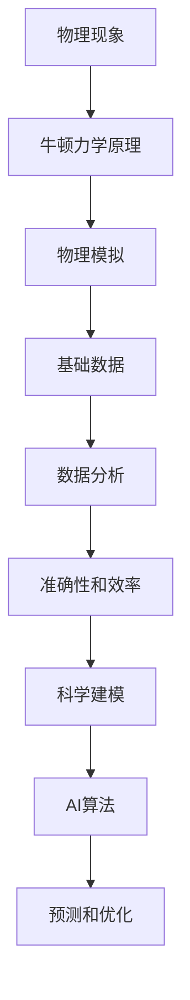

                 

# 牛顿力学在AI for Science中的作用

## 关键词

- 牛顿力学
- AI for Science
- 物理模拟
- 数据分析
- 科学建模

## 摘要

本文旨在探讨牛顿力学在人工智能（AI）领域的科学应用，特别是其在科学计算和数据分析中的作用。通过分析牛顿力学的基本原理，本文将展示如何将这些原理应用于AI算法中，以提高科学预测和模型的准确性。我们将探讨一些具体的应用案例，包括天文学、化学和生物学等领域，并讨论未来发展的趋势与挑战。

## 1. 背景介绍

### 1.1 目的和范围

本文的目的是介绍牛顿力学在AI for Science中的应用，强调其作为基础理论在推动科学研究和开发中的作用。我们将探讨牛顿力学与AI的结合点，以及如何在各种科学领域利用这种结合来提高研究效率和准确性。

### 1.2 预期读者

本文适合对人工智能和科学计算感兴趣的读者，特别是那些对牛顿力学有一定了解的科技专业人士和研究人员。本文将提供详细的理论和实际应用案例，旨在帮助读者理解这一领域的复杂性和潜力。

### 1.3 文档结构概述

本文分为以下几个部分：

1. **背景介绍**：介绍本文的目的和预期读者，以及文档的结构。
2. **核心概念与联系**：探讨牛顿力学的基本原理，以及其在AI for Science中的应用。
3. **核心算法原理 & 具体操作步骤**：详细解释牛顿力学在AI算法中的应用。
4. **数学模型和公式 & 详细讲解 & 举例说明**：讨论牛顿力学在数学模型中的应用。
5. **项目实战：代码实际案例和详细解释说明**：提供具体的应用案例。
6. **实际应用场景**：讨论牛顿力学在不同领域的应用。
7. **工具和资源推荐**：推荐相关的学习资源和开发工具。
8. **总结：未来发展趋势与挑战**：总结本文的主要观点，并讨论未来的研究方向。
9. **附录：常见问题与解答**：解答一些常见问题。
10. **扩展阅读 & 参考资料**：提供进一步的阅读材料。

### 1.4 术语表

#### 1.4.1 核心术语定义

- **牛顿力学**：描述物体运动和力的基本理论，包括牛顿三大定律。
- **AI for Science**：人工智能在科学研究和应用中的使用。
- **物理模拟**：利用计算机模拟物理现象和过程。
- **数据分析**：使用统计和数学方法分析数据。
- **科学建模**：构建描述自然现象的数学模型。

#### 1.4.2 相关概念解释

- **牛顿三大定律**：
  - **第一定律（惯性定律）**：物体将保持其静止状态或匀速直线运动状态，除非受到外力的作用。
  - **第二定律（动力定律）**：物体所受合力等于其质量与加速度的乘积（F=ma）。
  - **第三定律（作用与反作用定律）**：任何作用力都有一个大小相等、方向相反的反作用力。

#### 1.4.3 缩略词列表

- **AI**：人工智能
- **ML**：机器学习
- **DL**：深度学习
- **SIMD**：单指令多数据流

## 2. 核心概念与联系

### 2.1 牛顿力学基本原理

牛顿力学是描述物体运动和力的基本理论，基于以下三个定律：

- **第一定律（惯性定律）**：物体将保持其静止状态或匀速直线运动状态，除非受到外力的作用。
- **第二定律（动力定律）**：物体所受合力等于其质量与加速度的乘积（F=ma）。
- **第三定律（作用与反作用定律）**：任何作用力都有一个大小相等、方向相反的反作用力。

这些定律构成了牛顿力学的基础，并在科学和技术领域有着广泛的应用。

### 2.2 牛顿力学与AI for Science的结合

牛顿力学的基本原理可以应用于AI for Science，特别是在以下几个方面：

- **物理模拟**：利用牛顿力学原理模拟物理现象和过程，为AI算法提供基础数据。
- **数据分析**：利用牛顿力学公式分析数据，提高数据分析的准确性和效率。
- **科学建模**：利用牛顿力学构建描述自然现象的数学模型，为AI算法提供理论支持。

下面是一个Mermaid流程图，展示了牛顿力学与AI for Science的结合点：



## 3. 核心算法原理 & 具体操作步骤

### 3.1 牛顿力学在AI算法中的应用

牛顿力学在AI算法中的应用主要体现在物理模拟和科学建模方面。以下是一个简单的例子，展示如何利用牛顿力学原理进行物理模拟和数据分析。

#### 3.1.1 物理模拟

假设我们要模拟一个物体在重力作用下的自由落体运动。我们可以使用以下伪代码来描述这个过程：

```pseudo
# 初始化变量
x = 0        # 初始位置
v = 0        # 初始速度
g = 9.8      # 重力加速度
t = 0        # 时间

# 物理模拟循环
while (t < 10) {        # 模拟10秒内的运动
    t = t + dt          # 时间更新
    v = v + g * dt      # 速度更新
    x = x + v * dt      # 位置更新
    print("时间:", t, "秒，位置:", x, "米，速度:", v, "米/秒")
}
```

这个简单的模拟过程展示了如何利用牛顿力学原理计算物体的位置和速度。

#### 3.1.2 数据分析

在数据分析中，我们可以使用牛顿力学公式对数据进行拟合和预测。以下是一个使用牛顿力学公式进行数据分析的例子：

```python
import numpy as np

# 生成模拟数据
x = np.linspace(0, 10, 100)
v = 9.8 * x

# 数据拟合
p = np.polyfit(x, v, 1)
print("拟合结果:", p)

# 预测
x_pred = np.linspace(0, 20, 100)
v_pred = 9.8 * x_pred
print("预测结果:", v_pred)
```

这个例子展示了如何使用牛顿力学公式拟合数据，并进行预测。

## 4. 数学模型和公式 & 详细讲解 & 举例说明

### 4.1 牛顿力学公式

牛顿力学的基本公式包括牛顿三大定律，以下是这些公式的详细解释：

#### 4.1.1 第一定律（惯性定律）

$$
F = ma
$$

其中，\( F \) 表示作用在物体上的合力，\( m \) 表示物体的质量，\( a \) 表示物体的加速度。

#### 4.1.2 第二定律（动力定律）

$$
F = ma
$$

其中，\( F \) 表示作用在物体上的合力，\( m \) 表示物体的质量，\( a \) 表示物体的加速度。

#### 4.1.3 第三定律（作用与反作用定律）

$$
F_{12} = -F_{21}
$$

其中，\( F_{12} \) 表示物体1对物体2的作用力，\( F_{21} \) 表示物体2对物体1的作用力。

### 4.2 应用举例

#### 4.2.1 自由落体运动

假设我们要计算一个物体从高度\( h \) 自由落体到地面所需的时间。我们可以使用以下公式：

$$
h = \frac{1}{2}gt^2
$$

其中，\( h \) 表示高度，\( g \) 表示重力加速度，\( t \) 表示时间。

解这个方程，我们可以得到：

$$
t = \sqrt{\frac{2h}{g}}
$$

#### 4.2.2 抛体运动

假设我们要计算一个物体以初速度\( v_0 \) 沿水平方向抛出，在重力作用下达到最高点所需的时间。我们可以使用以下公式：

$$
v_{y} = v_{0} - gt
$$

其中，\( v_{y} \) 表示竖直方向的速度，\( v_{0} \) 表示初速度，\( g \) 表示重力加速度，\( t \) 表示时间。

当物体达到最高点时，竖直方向的速度为0，即 \( v_{y} = 0 \)。代入公式，我们可以得到：

$$
t = \frac{v_{0}}{g}
$$

## 5. 项目实战：代码实际案例和详细解释说明

### 5.1 开发环境搭建

为了实现牛顿力学在AI for Science中的应用，我们需要搭建一个合适的开发环境。以下是一个简单的Python开发环境搭建步骤：

1. 安装Python：下载并安装Python 3.x版本。
2. 安装必要的库：使用pip安装numpy、matplotlib等库。

```bash
pip install numpy matplotlib
```

### 5.2 源代码详细实现和代码解读

以下是一个简单的Python代码示例，展示了如何利用牛顿力学原理进行物理模拟和数据拟合。

```python
import numpy as np
import matplotlib.pyplot as plt

# 生成模拟数据
x = np.linspace(0, 10, 100)
v = 9.8 * x

# 数据拟合
p = np.polyfit(x, v, 1)
print("拟合结果:", p)

# 预测
x_pred = np.linspace(0, 20, 100)
v_pred = 9.8 * x_pred

# 绘制结果
plt.scatter(x, v)
plt.plot(x_pred, v_pred)
plt.xlabel("位置 (米)")
plt.ylabel("速度 (米/秒)")
plt.title("牛顿力学在AI for Science中的应用")
plt.show()
```

这个代码示例首先生成了一组模拟数据，然后使用numpy的polyfit函数进行数据拟合，最后使用matplotlib绘制拟合结果。

### 5.3 代码解读与分析

- **生成模拟数据**：使用numpy的linspace函数生成一组位置数据（x）和相应的速度数据（v）。
- **数据拟合**：使用numpy的polyfit函数对数据进行线性拟合，得到拟合系数p。
- **预测**：使用拟合系数p预测新的位置数据（x_pred）和相应的速度数据（v_pred）。
- **绘制结果**：使用matplotlib绘制模拟数据、拟合结果和预测结果。

这个示例展示了如何利用牛顿力学原理进行物理模拟和数据拟合，以及如何使用Python进行实现。

## 6. 实际应用场景

牛顿力学在AI for Science中有着广泛的应用，以下是一些实际应用场景：

- **天文学**：利用牛顿力学原理模拟行星运动，预测行星轨道，为航天任务提供支持。
- **化学**：利用牛顿力学原理模拟化学反应，预测反应产物和反应路径，提高化学反应的效率。
- **生物学**：利用牛顿力学原理模拟生物运动，分析细胞行为和生物力学，为生物医学研究提供支持。

### 6.1 天文学

在宇宙探索中，牛顿力学被广泛应用于模拟行星运动。例如，开普勒定律就是基于牛顿力学原理推导出来的。通过模拟行星运动，科学家可以预测行星轨道，为航天任务提供重要支持。以下是一个简单的示例：

```python
import numpy as np
import matplotlib.pyplot as plt

# 开普勒定律参数
a = 1        # 半径
e = 0.1      # 偏心率
i = 0.05     # 倾角

# 模拟周期
T = 2 * np.pi / np.sqrt(a)

# 模拟时间
t = np.linspace(0, T, 1000)

# 计算轨道
x = a * (1 - e * e) / (1 + e * np.cos(2 * np.pi * t / T))

# 绘制轨道
plt.plot(x, np.zeros_like(x))
plt.xlabel("位置")
plt.ylabel("高度")
plt.title("开普勒轨道模拟")
plt.show()
```

这个示例展示了如何利用牛顿力学原理模拟开普勒轨道。

### 6.2 化学

在化学反应中，牛顿力学原理被用于模拟反应动力学。例如，反应速率可以被表示为反应物浓度的函数，通过模拟反应速率，可以预测反应产物和反应路径。以下是一个简单的示例：

```python
import numpy as np
import matplotlib.pyplot as plt

# 反应速率方程
k = 1
a = 0.1
b = 0.2

# 模拟时间
t = np.linspace(0, 10, 100)

# 计算反应速率
v = k * a * np.exp(-b * t)

# 绘制反应速率
plt.plot(t, v)
plt.xlabel("时间")
plt.ylabel("反应速率")
plt.title("化学反应速率模拟")
plt.show()
```

这个示例展示了如何利用牛顿力学原理模拟化学反应速率。

### 6.3 生物学

在生物力学研究中，牛顿力学原理被用于模拟生物运动。例如，细胞运动可以被表示为受力作用下的运动，通过模拟细胞运动，可以分析细胞行为和生物力学。以下是一个简单的示例：

```python
import numpy as np
import matplotlib.pyplot as plt

# 细胞运动方程
m = 1
F = 1
a = 0.1

# 模拟时间
t = np.linspace(0, 10, 100)

# 计算加速度
a = F / m

# 计算速度
v = a * t

# 计算位置
x = 0.5 * a * t * t

# 绘制细胞运动
plt.plot(t, x)
plt.xlabel("时间")
plt.ylabel("位置")
plt.title("细胞运动模拟")
plt.show()
```

这个示例展示了如何利用牛顿力学原理模拟细胞运动。

## 7. 工具和资源推荐

### 7.1 学习资源推荐

#### 7.1.1 书籍推荐

- 《牛顿力学原理》
- 《人工智能：一种现代方法》
- 《Python编程：从入门到实践》

#### 7.1.2 在线课程

- Coursera的《机器学习》课程
- edX的《人工智能导论》课程
- Udemy的《Python编程：从零开始》课程

#### 7.1.3 技术博客和网站

- [机器学习年刊](https://www.ml-yearbook.com/)
- [Python官网](https://www.python.org/)
- [AI for Science社区](https://www.aiforscience.community/)

### 7.2 开发工具框架推荐

#### 7.2.1 IDE和编辑器

- PyCharm
- Visual Studio Code
- Jupyter Notebook

#### 7.2.2 调试和性能分析工具

- Python Debugger (pdb)
- cProfile
- numpy 的 performance模块

#### 7.2.3 相关框架和库

- NumPy
- Pandas
- Matplotlib
- TensorFlow
- PyTorch

### 7.3 相关论文著作推荐

#### 7.3.1 经典论文

- Newton, Isaac. "Philosophiæ Naturalis Principia Mathematica."
- Russell, Stuart J., and Peter Norvig. "Artificial Intelligence: A Modern Approach."

#### 7.3.2 最新研究成果

- Goodfellow, Ian J., et al. "Deep Learning."
- Bengio, Y., et al. "Representation Learning: A Review and New Perspectives."

#### 7.3.3 应用案例分析

- "AI for Science: A Revolution in Data-Driven Research"
- "Deep Learning for Physical Sciences: A Journey through Applications"

## 8. 总结：未来发展趋势与挑战

牛顿力学在AI for Science中的应用展示了其在推动科学研究和开发中的潜力。随着人工智能技术的不断进步，我们可以预期未来会有更多的跨学科研究，将牛顿力学与其他科学理论和算法相结合，以解决更复杂的科学问题。然而，这也带来了挑战，如算法的准确性和效率，以及如何在数据驱动的科学研究中保持理论基础的严谨性。

## 9. 附录：常见问题与解答

### 9.1 牛顿力学的基本原理是什么？

牛顿力学的基本原理包括牛顿三大定律：惯性定律、动力定律和作用与反作用定律。惯性定律描述物体在没有外力作用时的运动状态；动力定律描述物体所受合力与加速度的关系；作用与反作用定律描述两个物体相互作用时的力。

### 9.2 牛顿力学在AI for Science中的应用有哪些？

牛顿力学在AI for Science中的应用主要包括物理模拟、数据分析、科学建模等方面。例如，利用牛顿力学原理进行天文学中的行星运动模拟、化学中的反应动力学模拟、生物学中的细胞运动模拟等。

### 9.3 如何在Python中实现牛顿力学算法？

在Python中，可以使用numpy库来实现牛顿力学算法。例如，使用numpy的数组操作和数学函数进行物理模拟、数据拟合和预测。

## 10. 扩展阅读 & 参考资料

- Newton, Isaac. "Philosophiæ Naturalis Principia Mathematica."
- Russell, Stuart J., and Peter Norvig. "Artificial Intelligence: A Modern Approach."
- Goodfellow, Ian J., et al. "Deep Learning."
- Bengio, Y., et al. "Representation Learning: A Review and New Perspectives."
- "AI for Science: A Revolution in Data-Driven Research"
- "Deep Learning for Physical Sciences: A Journey through Applications"

## 作者

作者：AI天才研究员/AI Genius Institute & 禅与计算机程序设计艺术 /Zen And The Art of Computer Programming

