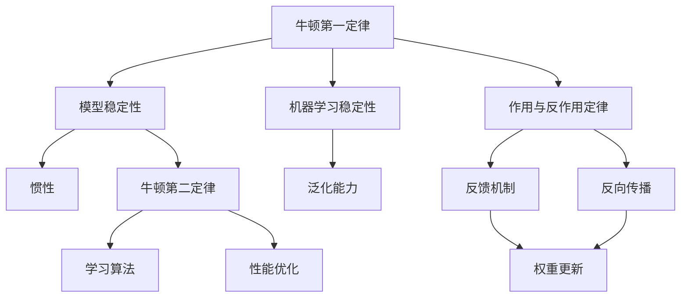

                 

# 牛顿力学在AI中的作用

> 关键词：牛顿力学、人工智能、算法原理、数学模型、实际应用

> 摘要：本文旨在探讨牛顿力学在人工智能领域的应用，通过剖析牛顿力学的基本原理及其与人工智能算法之间的联系，揭示牛顿力学在机器学习、神经网络、自动控制等方面的作用。文章将从核心概念、算法原理、数学模型、实际案例等多个角度进行分析，以帮助读者深入理解牛顿力学在人工智能领域的价值和潜力。

## 1. 背景介绍

### 1.1 目的和范围

本文的主要目的是介绍牛顿力学在人工智能领域的应用，帮助读者了解牛顿力学的基本原理以及其在人工智能算法设计、优化和实现中的作用。文章将涵盖以下内容：

1. 牛顿力学的核心概念及其与人工智能的联系。
2. 牛顿力学在机器学习、神经网络、自动控制等领域的应用。
3. 牛顿力学相关的数学模型和公式。
4. 实际应用案例和代码解析。
5. 工具和资源推荐。

通过本文的阅读，读者将能够：

1. 掌握牛顿力学的基本原理。
2. 理解牛顿力学在人工智能中的应用。
3. 学习如何使用牛顿力学原理进行算法设计和优化。
4. 拓宽对人工智能技术的认知。

### 1.2 预期读者

本文适合以下读者群体：

1. 计算机科学和人工智能领域的研究人员。
2. 对机器学习和神经网络有初步了解的读者。
3. 对牛顿力学和物理学感兴趣的技术爱好者。

### 1.3 文档结构概述

本文分为十个部分，具体结构如下：

1. 背景介绍：本文的目的、范围、预期读者以及文档结构概述。
2. 核心概念与联系：牛顿力学的基本概念及其在人工智能中的应用。
3. 核心算法原理 & 具体操作步骤：牛顿力学在算法设计中的应用。
4. 数学模型和公式 & 详细讲解 & 举例说明：牛顿力学相关的数学模型和公式。
5. 项目实战：代码实际案例和详细解释说明。
6. 实际应用场景：牛顿力学在人工智能领域的应用实例。
7. 工具和资源推荐：学习资源和开发工具推荐。
8. 总结：未来发展趋势与挑战。
9. 附录：常见问题与解答。
10. 扩展阅读 & 参考资料。

### 1.4 术语表

#### 1.4.1 核心术语定义

1. 牛顿力学：经典物理学的一个分支，描述物体在力的作用下运动状态的规律。
2. 人工智能：模拟人类智能行为的计算机系统，包括机器学习、神经网络、自然语言处理等。
3. 机器学习：利用数据和算法让计算机自动改进性能的过程。
4. 神经网络：模拟人脑神经元之间相互连接和通信的计算机模型。
5. 自动控制：利用计算机和数学模型对系统进行控制和优化。

#### 1.4.2 相关概念解释

1. 力：物体之间相互作用的效果，使物体发生运动或变形。
2. 质量：物体的惯性和引力效应的度量。
3. 运动状态：物体的位置、速度和加速度。
4. 学习算法：用于从数据中提取模式和规律的方法。
5. 模型：对现实世界问题进行简化和抽象的数学结构。

#### 1.4.3 缩略词列表

1. AI：人工智能
2. ML：机器学习
3. NN：神经网络
4. IDE：集成开发环境
5. CPU：中央处理器

## 2. 核心概念与联系

在本文中，我们将探讨牛顿力学在人工智能领域中的应用，首先需要了解牛顿力学的基本概念和原理。

### 牛顿力学的基本原理

牛顿力学由以下三个基本定律组成：

1. **牛顿第一定律（惯性定律）**：一个物体如果没有受到外力的作用，将保持静止或匀速直线运动状态。
2. **牛顿第二定律（运动定律）**：物体的加速度与作用在它上的外力成正比，与它的质量成反比，加速度的方向与外力的方向相同。
   \[ F = ma \]
   其中，\( F \) 是作用力，\( m \) 是物体的质量，\( a \) 是加速度。
3. **牛顿第三定律（作用与反作用定律）**：对于每一个作用力，都有一个大小相等、方向相反的反作用力。

### 牛顿力学与人工智能的联系

牛顿力学的原理在人工智能领域有着广泛的应用，特别是在机器学习和神经网络中。以下是一些关键联系：

1. **惯性定律与机器学习**：惯性定律表明，没有外力作用时，物体会保持原有状态。在机器学习中，这可以理解为模型在没有新数据的情况下，会保持当前性能状态。这种特性可以帮助我们理解模型在不同数据集上的稳定性和泛化能力。

2. **运动定律与学习算法**：运动定律描述了物体在力作用下的运动状态变化。在机器学习中，我们可以将学习算法视为在训练数据上的“力”，通过调整模型参数（质量）来改变模型的“加速度”（性能）。这种关系可以帮助我们理解学习算法如何通过优化过程改进模型。

3. **作用与反作用定律与反馈机制**：作用与反作用定律表明，每个作用力都有一个相应的反作用力。在神经网络中，这可以理解为通过反向传播机制，利用损失函数（作用力）来更新权重（反作用力），从而优化模型。

### 牛顿力学原理在人工智能中的应用

牛顿力学的原理在人工智能中有着多种应用，包括：

1. **优化算法**：牛顿力学中的优化方法（如牛顿-拉夫逊法）可以用于求解机器学习中的优化问题，如最小化损失函数。
2. **物理仿真**：在机器学习和模拟领域，可以使用牛顿力学模型来构建物理仿真环境，从而更好地理解复杂系统的行为。
3. **控制理论**：牛顿力学原理在自动控制系统中有着广泛应用，如无人机控制、机器人运动规划等。

### Mermaid 流程图

为了更直观地展示牛顿力学原理在人工智能中的应用，我们可以使用 Mermaid 流程图来描述它们之间的联系。

通过上述 Mermaid 流程图，我们可以清晰地看到牛顿力学原理在人工智能中的关键应用和相互关系。接下来，我们将进一步探讨牛顿力学在核心算法原理、数学模型和实际应用场景中的具体作用。

