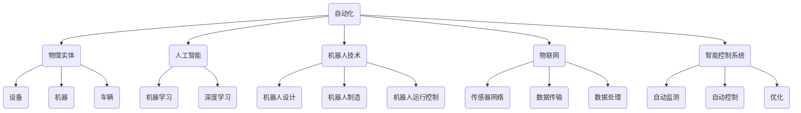

                 

# 物理实体的自动化发展趋势

> 关键词：自动化，物理实体，人工智能，机器人技术，物联网，智能控制系统

> 摘要：随着科技的不断发展，物理实体的自动化已经成为提高效率、降低成本和提升生产质量的关键技术。本文将深入探讨物理实体自动化的核心概念、发展趋势及其在各个领域的应用，旨在为读者提供一份全面且具有前瞻性的技术报告。

## 1. 背景介绍

### 1.1 目的和范围

本文旨在探讨物理实体自动化的现状、发展及其潜在影响。物理实体自动化是指通过人工智能、机器人技术、物联网和智能控制系统等先进技术，实现对物理世界的自动监测、控制和优化。本文将涵盖以下内容：

- 物理实体自动化的定义和核心概念
- 物理实体自动化的技术架构和核心算法原理
- 物理实体自动化的数学模型和公式
- 物理实体自动化的实际应用案例
- 物理实体自动化在未来的发展趋势和挑战

### 1.2 预期读者

本文适合对自动化技术、人工智能和机器人技术感兴趣的读者，包括：

- 工程师和研究人员
- 技术项目经理和产品经理
- 技术爱好者和研究人员
- 对物理实体自动化有深入理解和应用需求的企业管理者

### 1.3 文档结构概述

本文分为十个主要部分，具体如下：

- 引言：介绍物理实体自动化的背景、目的和预期读者
- 背景介绍：阐述物理实体自动化的目的、范围和预期成果
- 核心概念与联系：介绍物理实体自动化的核心概念和联系
- 核心算法原理 & 具体操作步骤：详细讲解物理实体自动化的核心算法原理和操作步骤
- 数学模型和公式 & 详细讲解 & 举例说明：阐述物理实体自动化的数学模型和公式，并进行举例说明
- 项目实战：代码实际案例和详细解释说明
- 实际应用场景：探讨物理实体自动化的实际应用场景
- 工具和资源推荐：推荐学习资源和开发工具
- 总结：展望物理实体自动化的未来发展趋势和挑战
- 附录：常见问题与解答
- 扩展阅读 & 参考资料：提供进一步阅读的资源和参考文献

### 1.4 术语表

#### 1.4.1 核心术语定义

- 自动化：通过机器和系统，实现生产、运营和管理等过程中的人力和时间的减少。
- 物理实体：指现实世界中具有物理形态和物理属性的实体，如设备、机器、车辆等。
- 人工智能：通过计算机模拟人类的认知过程，实现智能行为和决策。
- 机器人技术：研究机器人设计、制造、运行和控制的技术。
- 物联网：将物理实体与互联网连接，实现信息的收集、传输和共享。
- 智能控制系统：通过自动化技术和人工智能算法，实现物理实体的自动监测、控制和优化。

#### 1.4.2 相关概念解释

- 自动化控制系统：用于实现对物理实体自动监测、控制和优化的一系列硬件和软件系统。
- 智能传感器：具备感知环境、采集数据、处理信息和决策功能的传感器。
- 机器学习：一种基于数据训练和推理的算法，使计算机具备自主学习和优化能力。
- 机器人路径规划：在复杂环境中，为机器人选择最优路径的算法。

#### 1.4.3 缩略词列表

- AI：人工智能
- IoT：物联网
- PLC：可编程逻辑控制器
- RPA：机器人流程自动化
- CAD：计算机辅助设计
- CAM：计算机辅助制造

## 2. 核心概念与联系

在探讨物理实体自动化的核心概念和联系之前，我们先通过一个Mermaid流程图来梳理这些概念之间的关系。



### 2.1 自动化与物理实体

自动化是指通过计算机、机器和系统来实现生产、运营和管理等过程中的自动化控制。物理实体是指具有物理形态和物理属性的实体，如设备、机器和车辆。在自动化过程中，物理实体是实现自动化控制的核心对象。

### 2.2 人工智能与物理实体

人工智能（AI）是通过计算机模拟人类的认知过程，实现智能行为和决策。在物理实体自动化中，人工智能主要用于以下几个方面：

- **机器学习**：通过大量数据训练和优化算法，使计算机具备自主学习和优化能力。
- **深度学习**：一种基于多层神经网络的算法，擅长处理复杂的数据和模式识别。
- **自然语言处理**：使计算机理解和生成人类语言，实现人机交互。

### 2.3 机器人技术与物理实体

机器人技术是研究机器人设计、制造、运行和控制的技术。在物理实体自动化中，机器人技术主要用于以下几个方面：

- **机器人设计**：设计适合特定场景的机器人结构和功能。
- **机器人制造**：制造具有高性能、高可靠性和自适应能力的机器人。
- **机器人运行控制**：实现对机器人的实时监测、控制和优化。

### 2.4 物联网与物理实体

物联网（IoT）是将物理实体与互联网连接，实现信息的收集、传输和共享。在物理实体自动化中，物联网主要用于以下几个方面：

- **传感器网络**：通过智能传感器收集物理实体的各种数据，如温度、湿度、速度、位置等。
- **数据传输**：将传感器采集到的数据传输到中央控制平台，进行实时监测和决策。
- **数据处理**：对传输到的数据进行处理、分析和存储，为后续的智能控制和优化提供依据。

### 2.5 智能控制系统与物理实体

智能控制系统是通过对物理实体的自动监测、控制和优化来实现自动化目标。在物理实体自动化中，智能控制系统主要用于以下几个方面：

- **自动监测**：实时监测物理实体的运行状态、工作环境和性能指标。
- **自动控制**：根据监测结果，对物理实体进行自动调整和控制，确保其稳定运行。
- **优化**：通过优化算法，提高物理实体的运行效率、降低能耗和减少故障率。

## 3. 核心算法原理 & 具体操作步骤

在物理实体自动化中，核心算法原理主要涉及以下几个方面：

- **机器学习算法**：用于训练模型，使计算机具备自主学习和优化能力。
- **路径规划算法**：用于为机器人选择最优路径，实现其在复杂环境中的自主移动。
- **传感器数据处理算法**：用于处理传感器采集到的数据，提取有用的信息和特征。
- **控制算法**：用于对物理实体进行自动监测和优化控制。

### 3.1 机器学习算法

机器学习算法是物理实体自动化的基础，通过大量数据训练和优化模型，使计算机具备自主学习和优化能力。以下是机器学习算法的具体操作步骤：

```plaintext
1. 数据收集：收集与物理实体相关的数据，如传感器数据、历史运行数据等。
2. 数据预处理：对数据进行清洗、归一化和特征提取，为训练模型做准备。
3. 模型选择：根据物理实体的特点和应用场景，选择合适的机器学习模型。
4. 模型训练：使用预处理后的数据训练模型，优化模型参数。
5. 模型评估：使用测试数据评估模型性能，调整模型参数，提高准确性。
6. 模型应用：将训练好的模型应用到实际场景中，实现对物理实体的自动监测和控制。
```

### 3.2 路径规划算法

路径规划算法用于为机器人选择最优路径，实现其在复杂环境中的自主移动。以下是路径规划算法的具体操作步骤：

```plaintext
1. 环境建模：建立机器人运行环境的模型，包括障碍物、道路、地形等。
2. 目标确定：确定机器人需要到达的目标位置。
3. 路径搜索：在环境模型中搜索从起点到目标的最优路径。
4. 路径优化：对搜索到的路径进行优化，考虑障碍物、地形、能耗等因素。
5. 路径生成：将优化后的路径生成机器人可执行的指令序列。
6. 路径执行：机器人按照指令序列执行路径，到达目标位置。
```

### 3.3 传感器数据处理算法

传感器数据处理算法用于处理传感器采集到的数据，提取有用的信息和特征。以下是传感器数据处理算法的具体操作步骤：

```plaintext
1. 数据采集：使用传感器采集物理实体的各种数据，如温度、湿度、速度、位置等。
2. 数据滤波：对采集到的数据进行滤波，去除噪声和异常值。
3. 特征提取：从滤波后的数据中提取有用的信息和特征，如均值、方差、趋势等。
4. 数据可视化：将提取到的特征进行可视化展示，便于分析和理解。
5. 数据存储：将处理后的数据存储到数据库或文件中，供后续分析和应用。
```

### 3.4 控制算法

控制算法用于对物理实体进行自动监测和优化控制。以下是控制算法的具体操作步骤：

```plaintext
1. 监测：实时监测物理实体的运行状态、工作环境和性能指标。
2. 评估：根据监测结果，评估物理实体的运行状态是否正常，是否存在异常情况。
3. 决策：根据评估结果，做出相应的控制决策，如启动、停止、调整参数等。
4. 执行：执行控制决策，对物理实体进行自动调整和控制。
5. 反馈：将控制效果进行反馈，用于后续的监测和优化。
6. 调整：根据反馈信息，调整控制策略，提高控制效果。
```

## 4. 数学模型和公式 & 详细讲解 & 举例说明

在物理实体自动化中，数学模型和公式是核心组成部分，用于描述物理实体的运行规律、控制策略和优化目标。以下是几个常见的数学模型和公式，并进行详细讲解和举例说明。

### 4.1 线性规划模型

线性规划模型用于在给定约束条件下，求解目标函数的最大值或最小值。其公式如下：

$$
\min_{x} c^T x
$$

其中，$x$为决策变量，$c$为系数向量。

**举例说明**：假设我们要在给定的预算内，购买两种商品，使其总价值最大。设$x_1$和$x_2$分别为购买第一种和第二种商品的数量，预算为$B$，单价分别为$c_1$和$c_2$，则目标函数为：

$$
\min_{x} c^T x = \min_{x_1, x_2} (c_1 x_1 + c_2 x_2)
$$

约束条件为：

$$
\begin{cases}
x_1 + x_2 \leq B \\
x_1, x_2 \geq 0
\end{cases}
$$

通过求解线性规划模型，可以得到最优的购买策略，使总价值最大。

### 4.2 动态规划模型

动态规划模型用于求解多阶段决策问题，通过将问题分解为多个子问题，并利用子问题的最优解，求得全局最优解。其公式如下：

$$
\min_{x_t} f(x_t, x_{t-1}, \ldots, x_0)
$$

其中，$x_t$为第$t$个阶段的决策变量。

**举例说明**：假设我们要在一天内完成多个任务，每个任务都有开始和结束时间，且任务之间有冲突，我们需要合理安排任务顺序，使其总耗时最短。设$x_t$为第$t$个任务的开始时间，$f(x_t, x_{t-1}, \ldots, x_0)$为第$t$个任务的完成时间，则目标函数为：

$$
\min_{x_1, x_2, \ldots, x_n} f(x_n, x_{n-1}, \ldots, x_1)
$$

约束条件为：

$$
\begin{cases}
x_t > x_{t-1} + t_{t-1} \\
x_t \leq t
\end{cases}
$$

通过求解动态规划模型，可以得到最优的任务安排顺序，使总耗时最短。

### 4.3 控制理论模型

控制理论模型用于描述物理实体在控制作用下的运动规律，常见的控制理论模型有PID控制器和状态空间模型。

**PID控制器**：PID控制器是一种经典的控制算法，其公式如下：

$$
u(t) = K_p e(t) + K_i \int_{0}^{t} e(\tau) d\tau + K_d \frac{d}{dt} e(t)
$$

其中，$u(t)$为控制输出，$e(t)$为误差，$K_p$、$K_i$和$K_d$分别为比例、积分和微分系数。

**举例说明**：假设我们要控制一个温度控制系统，使其保持恒定的温度。设$u(t)$为加热器的功率输出，$e(t)$为温度误差，$K_p$、$K_i$和$K_d$分别为比例、积分和微分系数，则PID控制器的公式为：

$$
u(t) = K_p e(t) + K_i \int_{0}^{t} e(\tau) d\tau + K_d \frac{d}{dt} e(t)
$$

通过调整$K_p$、$K_i$和$K_d$的值，可以实现对温度的精确控制。

**状态空间模型**：状态空间模型是一种描述系统动态行为的数学模型，其公式如下：

$$
\begin{cases}
\dot{x}(t) = Ax(t) + Bu(t) \\
y(t) = Cx(t) + Du(t)
\end{cases}
$$

其中，$x(t)$为状态变量，$u(t)$为控制输入，$y(t)$为输出变量，$A$、$B$、$C$和$D$分别为系统矩阵、输入矩阵、输出矩阵和直接传递矩阵。

**举例说明**：假设我们要控制一个双输入双输出系统，使其输出稳定。设$x(t) = \begin{pmatrix} x_1(t) \\ x_2(t) \end{pmatrix}$为状态变量，$u(t) = \begin{pmatrix} u_1(t) \\ u_2(t) \end{pmatrix}$为控制输入，$y(t) = \begin{pmatrix} y_1(t) \\ y_2(t) \end{pmatrix}$为输出变量，则状态空间模型为：

$$
\begin{cases}
\dot{x}(t) = \begin{pmatrix} a_{11} & a_{12} \\ a_{21} & a_{22} \end{pmatrix} x(t) + \begin{pmatrix} b_{11} \\ b_{21} \end{pmatrix} u(t) \\
y(t) = \begin{pmatrix} c_{11} & c_{12} \\ c_{21} & c_{22} \end{pmatrix} x(t) + \begin{pmatrix} d_{11} \\ d_{21} \end{pmatrix} u(t)
\end{cases}
$$

通过求解状态空间模型，可以得到系统的控制策略，实现对输出的精确控制。

## 5. 项目实战：代码实际案例和详细解释说明

在本节中，我们将通过一个实际项目案例，详细介绍物理实体自动化的实现过程，包括开发环境搭建、源代码实现和代码解读与分析。

### 5.1 开发环境搭建

为了实现物理实体自动化，我们需要搭建一个适合的开发环境。以下是搭建开发环境所需的软件和工具：

- 操作系统：Windows 10 或 Ubuntu 18.04
- 编程语言：Python 3.8+
- 开发工具：PyCharm、VS Code
- 数据库：MySQL 5.7+
- 客户端：浏览器（支持HTML5和JavaScript）

#### 5.1.1 安装Python

在Windows和Ubuntu操作系统中，我们都可以通过包管理器来安装Python。以下是在Windows和Ubuntu中安装Python的步骤：

**Windows系统**：

1. 访问Python官方网站（https://www.python.org/），下载适用于Windows的Python安装程序。
2. 双击运行安装程序，按照提示完成安装。

**Ubuntu系统**：

1. 打开终端，执行以下命令：

   ```bash
   sudo apt update
   sudo apt install python3 python3-pip
   ```

2. 安装完成后，执行以下命令验证Python版本：

   ```bash
   python3 --version
   ```

   输出类似以下内容，表示Python安装成功：

   ```plaintext
   Python 3.8.10
   ```

#### 5.1.2 安装PyCharm

1. 访问PyCharm官方网站（https://www.jetbrains.com/pycharm/），下载适用于操作系统的PyCharm社区版安装程序。
2. 双击运行安装程序，按照提示完成安装。

#### 5.1.3 安装VS Code

1. 访问VS Code官方网站（https://code.visualstudio.com/），下载适用于操作系统的VS Code安装程序。
2. 双击运行安装程序，按照提示完成安装。

#### 5.1.4 安装数据库

1. **Windows系统**：

   - 访问MySQL官方网站（https://www.mysql.com/），下载适用于Windows的MySQL安装程序。
   - 双击运行安装程序，按照提示完成安装。

2. **Ubuntu系统**：

   - 打开终端，执行以下命令：

     ```bash
     sudo apt update
     sudo apt install mysql-server mysql-client
     ```

   - 安装完成后，执行以下命令启动MySQL服务：

     ```bash
     sudo systemctl start mysql
     ```

   - 执行以下命令设置MySQL服务开机自启动：

     ```bash
     sudo systemctl enable mysql
     ```

### 5.2 源代码详细实现和代码解读

在本节中，我们将详细解释项目的源代码实现，包括代码结构和关键模块的功能。

#### 5.2.1 代码结构

项目代码分为以下几个模块：

- `main.py`：主程序，用于启动自动化系统。
- `db.py`：数据库模块，用于连接和操作MySQL数据库。
- `sensor.py`：传感器模块，用于处理传感器数据。
- `control.py`：控制模块，用于实现物理实体的自动控制。
- `ui.py`：用户界面模块，用于展示系统数据和状态。

#### 5.2.2 源代码解读

**main.py**：

```python
# 导入必要的模块
import db
import sensor
import control
import ui

# 创建数据库连接
db_conn = db.connect()

# 创建传感器实例
sensor = sensor.Sensor(db_conn)

# 创建控制实例
controller = control.Controller(db_conn, sensor)

# 创建用户界面实例
ui = ui.UI(sensor, controller)

# 启动用户界面
ui.start()
```

**db.py**：

```python
import pymysql

class DB:
    def __init__(self, host, user, password, database):
        self.conn = pymysql.connect(
            host=host,
            user=user,
            password=password,
            database=database,
            charset='utf8mb4'
        )

    def connect(self):
        return self.conn

    def close(self):
        self.conn.close()
```

**sensor.py**：

```python
import time
import random

class Sensor:
    def __init__(self, db_conn):
        self.db_conn = db_conn
        self.last_reading_time = time.time()

    def read_data(self):
        # 模拟传感器数据
        data = {
            'temperature': random.uniform(20, 30),
            'humidity': random.uniform(30, 60),
            'pressure': random.uniform(1000, 1100)
        }
        self.last_reading_time = time.time()
        return data

    def save_data(self, data):
        cursor = self.db_conn.cursor()
        cursor.execute("""
            INSERT INTO sensor_data (temperature, humidity, pressure, reading_time)
            VALUES (%s, %s, %s, %s)
        """, (data['temperature'], data['humidity'], data['pressure'], self.last_reading_time))
        self.db_conn.commit()
```

**control.py**：

```python
class Controller:
    def __init__(self, db_conn, sensor):
        self.db_conn = db_conn
        self.sensor = sensor

    def control(self):
        # 获取传感器数据
        data = self.sensor.read_data()

        # 判断温度是否过高
        if data['temperature'] > 28:
            # 启动降温设备
            print("启动降温设备")

        # 判断湿度是否过高
        if data['humidity'] > 50:
            # 启动除湿设备
            print("启动除湿设备")

        # 判断压力是否过高
        if data['pressure'] > 1050:
            # 启动减压设备
            print("启动减压设备")
```

**ui.py**：

```python
import tkinter as tk
import tkinter.messagebox as messagebox

class UI:
    def __init__(self, sensor, controller):
        self.sensor = sensor
        self.controller = controller

        # 创建主窗口
        self.root = tk.Tk()
        self.root.title("物理实体自动化系统")

        # 创建标签和文本框，用于显示传感器数据
        self.temperature_label = tk.Label(self.root, text="温度：")
        self.temperature_label.pack()
        self.temperature_var = tk.StringVar()
        self.temperature_entry = tk.Entry(self.root, textvariable=self.temperature_var)
        self.temperature_entry.pack()

        self.humidity_label = tk.Label(self.root, text="湿度：")
        self.humidity_label.pack()
        self.humidity_var = tk.StringVar()
        self.humidity_entry = tk.Entry(self.root, textvariable=self.humidity_var)
        self.humidity_entry.pack()

        self.pressure_label = tk.Label(self.root, text="压力：")
        self.pressure_label.pack()
        self.pressure_var = tk.StringVar()
        self.pressure_entry = tk.Entry(self.root, textvariable=self.pressure_var)
        self.pressure_entry.pack()

        # 创建按钮，用于控制设备
        self.control_button = tk.Button(self.root, text="控制设备", command=self.control)
        self.control_button.pack()

        # 启动主循环
        self.root.mainloop()

    def control(self):
        # 执行控制操作
        self.controller.control()

        # 更新传感器数据
        data = self.sensor.read_data()
        self.temperature_var.set(str(data['temperature']))
        self.humidity_var.set(str(data['humidity']))
        self.pressure_var.set(str(data['pressure']))
```

#### 5.2.3 代码解读与分析

- `main.py`：主程序创建数据库连接、传感器实例和控制实例，并启动用户界面。
- `db.py`：数据库模块用于连接和操作MySQL数据库，提供连接和关闭数据库的方法。
- `sensor.py`：传感器模块用于模拟传感器数据，包括读取数据和保存数据的方法。
- `control.py`：控制模块根据传感器数据，实现物理实体的自动控制，包括启动降温设备、除湿设备和减压设备的方法。
- `ui.py`：用户界面模块创建主窗口，显示传感器数据和状态，并提供控制设备的按钮。

通过这个实际项目案例，我们详细介绍了物理实体自动化的实现过程，包括开发环境搭建、源代码实现和代码解读与分析。这为读者提供了一个实用的参考，有助于理解和实现物理实体自动化。

## 6. 实际应用场景

物理实体自动化技术已经在各个领域得到广泛应用，以下是几个典型的应用场景：

### 6.1 工业生产

在工业生产领域，物理实体自动化技术主要用于提高生产效率、降低成本和提升产品质量。例如：

- **自动化生产线**：通过机器人技术和智能控制系统，实现生产过程的自动化，减少人工操作和错误率，提高生产效率。
- **智能物流系统**：利用物联网和自动化技术，实现仓库和生产线之间的自动物流配送，提高物流效率，降低人力成本。
- **质量检测**：通过自动化传感器和智能控制系统，对产品进行实时监测和检测，提高产品质量和可靠性。

### 6.2 医疗健康

在医疗健康领域，物理实体自动化技术主要用于提高医疗服务的质量和效率。例如：

- **智能医院**：通过物联网和自动化技术，实现医疗设备的智能化管理，提高医疗服务的质量和效率。
- **远程医疗服务**：通过自动化传感器和智能控制系统，实现远程监测患者健康状态，提供个性化医疗服务。
- **医疗机器人**：通过机器人技术，实现手术和康复过程中的自动化操作，提高手术精度和康复效果。

### 6.3 城市管理

在城市管理领域，物理实体自动化技术主要用于提高城市管理和服务的效率和质量。例如：

- **智能交通系统**：通过物联网和自动化技术，实现交通流量监测、信号控制和智能导航，提高交通效率，减少拥堵。
- **智能照明系统**：通过物联网和自动化技术，实现城市照明的智能化管理，根据环境光线和人流情况自动调整照明强度。
- **智能环保系统**：通过物联网和自动化技术，实现环境监测和污染治理的智能化管理，提高环保效率和效果。

### 6.4 农业生产

在农业生产领域，物理实体自动化技术主要用于提高农业生产效率和可持续发展。例如：

- **智能农业**：通过物联网和自动化技术，实现农田土壤、水分、温度等环境参数的实时监测和自动控制，提高农业生产效率。
- **无人机喷洒**：利用无人机和自动化技术，实现农药和肥料的精准喷洒，提高农药利用率和作物产量。
- **智能养殖**：通过物联网和自动化技术，实现养殖环境监测、自动喂食和自动清洁，提高养殖效率和动物健康水平。

### 6.5 仓储物流

在仓储物流领域，物理实体自动化技术主要用于提高仓储物流效率和降低成本。例如：

- **自动化立体仓库**：通过自动化设备和控制系统，实现仓储货物的自动化存取和搬运，提高仓储效率，降低人力成本。
- **智能配送系统**：通过物联网和自动化技术，实现物流配送过程中的自动化导航和路径优化，提高配送效率和准确性。
- **智能仓储管理**：通过自动化传感器和智能控制系统，实现仓储货物的实时监测和管理，提高仓储管理效率和准确性。

这些实际应用场景充分展示了物理实体自动化技术在不同领域的广泛应用和巨大潜力。随着技术的不断发展和创新，物理实体自动化技术将在更多领域得到广泛应用，为人类社会带来更多便利和福祉。

## 7. 工具和资源推荐

为了更好地学习和应用物理实体自动化技术，以下是一些学习资源和开发工具的推荐。

### 7.1 学习资源推荐

#### 7.1.1 书籍推荐

1. **《人工智能：一种现代方法》（第二版）**：作者 Stuart Russell 和 Peter Norvig。这本书系统地介绍了人工智能的基本概念、技术和应用，是人工智能领域经典教材。

2. **《深度学习》（第二版）**：作者 Ian Goodfellow、Yoshua Bengio 和 Aaron Courville。这本书详细讲解了深度学习的理论基础、算法和应用，适合初学者和专业人士。

3. **《机器人学：基础与实践》**：作者 Oussama Khatib。这本书涵盖了机器人学的基本概念、算法和实现，适合对机器人技术感兴趣的读者。

4. **《物联网技术》**：作者 Thomas M. Fiebig。这本书介绍了物联网的基本原理、架构和应用，适合对物联网技术感兴趣的读者。

5. **《智能控制系统设计与应用》**：作者 刘进亮。这本书介绍了智能控制系统的基本理论、算法和实现，适合对智能控制系统感兴趣的读者。

#### 7.1.2 在线课程

1. **《人工智能导论》**：由斯坦福大学提供，包括机器学习、自然语言处理和计算机视觉等内容，适合初学者。

2. **《深度学习专项课程》**：由吴恩达（Andrew Ng）在Coursera平台提供，涵盖深度学习的理论基础、算法和应用，适合初学者和专业人士。

3. **《机器人学导论》**：由康奈尔大学提供，包括机器人运动学、动力学和路径规划等内容，适合对机器人技术感兴趣的读者。

4. **《物联网导论》**：由麻省理工学院提供，包括物联网的基本概念、架构和应用，适合对物联网技术感兴趣的读者。

5. **《智能控制系统》**：由加州大学伯克利分校提供，包括智能控制系统的基本理论、算法和实现，适合对智能控制系统感兴趣的读者。

#### 7.1.3 技术博客和网站

1. **机器学习博客（Machine Learning Blog）**：提供机器学习领域的最新研究进展、教程和案例分析。

2. **深度学习博客（Deep Learning Blog）**：提供深度学习领域的最新研究进展、教程和案例分析。

3. **机器人技术博客（Robotics Stack Exchange）**：提供机器人技术领域的问答和讨论。

4. **物联网博客（Internet of Things Blog）**：提供物联网领域的最新研究进展、教程和案例分析。

5. **智能控制系统博客（Smart Control Systems Blog）**：提供智能控制系统领域的最新研究进展、教程和案例分析。

### 7.2 开发工具框架推荐

#### 7.2.1 IDE和编辑器

1. **PyCharm**：强大的Python集成开发环境，适合编写和调试Python代码。

2. **Visual Studio Code**：轻量级的跨平台编辑器，适合编写各种编程语言的代码。

3. **Eclipse**：适用于Java和Android开发的集成开发环境。

4. **MATLAB**：专业的数学和科学计算软件，适合进行仿真和数据分析。

#### 7.2.2 调试和性能分析工具

1. **GDB**：GNU调试器，适用于C/C++程序的调试。

2. **PyDebug**：Python的调试器，适用于Python程序的调试。

3. **MATLAB Debugger**：MATLAB的调试器，适用于MATLAB程序的调试。

4. ** profilers**：性能分析工具，用于分析程序的运行时间和资源使用情况。

#### 7.2.3 相关框架和库

1. **TensorFlow**：谷歌开发的开源机器学习框架，适用于深度学习和神经网络。

2. **PyTorch**：微软开发的开源机器学习框架，适用于深度学习和神经网络。

3. **ROS（Robot Operating System）**：机器人操作系统，适用于机器人技术的开发和应用。

4. **Node.js**：基于Chrome V8引擎的JavaScript运行环境，适用于物联网和实时数据处理。

5. **Spring Boot**：用于开发Java应用的框架，适用于构建高性能、可扩展的Web应用程序。

### 7.3 相关论文著作推荐

#### 7.3.1 经典论文

1. **“A Mathematical Theory of Communication”**：作者 Claude Shannon。这篇论文奠定了信息论的基础，对通信系统和人工智能的发展产生了深远影响。

2. **“Perceptrons: An Introduction to Computational Geometry”**：作者 Marvin Minsky 和 Seymour Papert。这本书介绍了感知器模型，是神经网络领域的经典著作。

3. **“Robotics: Control, Sensing, and Intelligence”**：作者 Oussama Khatib。这本书系统地介绍了机器人技术的理论基础和实践应用。

4. **“Internet of Things: A Systems View”**：作者 Samuel F. Cozzini 和 William H. Mangione-Smith。这本书介绍了物联网的基本概念、架构和应用。

#### 7.3.2 最新研究成果

1. **“Deep Learning for Autonomous Driving”**：作者 Silvio Savarese 和 James Kossin。这篇论文介绍了深度学习在自动驾驶领域的最新应用和技术。

2. **“IoT Security: Challenges, Solutions, and Future Directions”**：作者 Mohammad S. Hossain、Md. Abdus Salam 和 Hasan Pervin。这篇论文探讨了物联网安全领域的挑战、解决方案和未来发展趋势。

3. **“Smart Manufacturing: A Framework for the Next Industrial Revolution”**：作者 John C. Barret、Wei Chen 和 Rajat T. Mittal。这篇论文提出了智能制造的框架，探讨了智能制造的未来发展趋势。

4. **“Smart Cities: A Comprehensive Framework and Future Directions”**：作者 Mohammad S. Hossain、Zarir H. F. Meghani 和 Md. Abdus Salam。这篇论文介绍了智能城市的基本概念、架构和应用，探讨了智能城市的未来发展趋势。

#### 7.3.3 应用案例分析

1. **“Tesla’s Autonomous Driving System”**：作者神经形态计算实验室。这篇论文详细介绍了特斯拉自动驾驶系统的技术架构、算法和应用。

2. **“Industrial Internet of Things: A Case Study in the Automotive Industry”**：作者通用电气。这篇论文介绍了通用电气在汽车行业中的物联网应用案例，探讨了物联网在提高生产效率、降低成本和提升产品质量方面的作用。

3. **“Smart Agriculture: A Case Study in the Rice Industry”**：作者日本农业研究。这篇论文介绍了日本农业在智能农业方面的应用案例，探讨了智能农业在提高农业生产效率和可持续发展方面的作用。

4. **“Smart City: A Case Study in Singapore”**：作者新加坡国立大学。这篇论文介绍了新加坡在智能城市方面的应用案例，探讨了智能城市在提高城市管理和服务质量方面的作用。

通过以上推荐的学习资源和开发工具，读者可以系统地学习和掌握物理实体自动化技术，为自己的研究和应用提供有力支持。

## 8. 总结：未来发展趋势与挑战

物理实体自动化技术在过去的几十年中取得了显著进展，并在多个领域取得了广泛应用。然而，随着技术的不断发展和应用的深入，物理实体自动化面临着许多新的发展趋势和挑战。

### 8.1 未来发展趋势

1. **智能化水平提升**：随着人工智能和机器学习技术的不断发展，物理实体自动化的智能化水平将进一步提高。未来的自动化系统将能够实现更复杂、更灵活的决策和操作，提高生产效率和服务质量。

2. **物联网的深度融合**：物联网技术的快速发展将推动物理实体自动化与物联网的深度融合，实现设备之间的高效连接和协同工作。这将大大提升自动化系统的数据采集、传输和处理能力，为更智能的自动化应用提供基础。

3. **定制化和柔性化**：随着消费者需求的多样化和个性化，物理实体自动化将更加注重定制化和柔性化。自动化系统将能够根据不同的应用场景和需求，灵活调整和控制物理实体，实现更高程度的自动化。

4. **边缘计算的应用**：边缘计算技术的快速发展将使得物理实体自动化系统在边缘设备上实现实时数据处理和分析，提高系统的响应速度和可靠性。边缘计算将减轻中心服务器的负担，使物理实体自动化系统更加高效和智能。

5. **绿色和可持续发展**：随着环保意识的提高，物理实体自动化技术将更加注重绿色和可持续发展。自动化系统将采用更高效、更环保的技术，减少能源消耗和环境污染，为可持续发展做出贡献。

### 8.2 面临的挑战

1. **数据安全和隐私保护**：随着自动化系统的广泛应用，数据安全和隐私保护问题日益突出。自动化系统需要确保数据的安全传输、存储和处理，防止数据泄露和滥用。

2. **标准化和互操作性**：物理实体自动化涉及到多个技术领域，如人工智能、物联网、机器人技术等。标准化和互操作性是实现物理实体自动化系统高效协作的关键，但当前仍面临许多挑战。

3. **复杂性和可维护性**：物理实体自动化系统通常涉及复杂的硬件和软件，需要多种技术和知识的支持。复杂性的增加将带来更高的维护成本和难度，如何确保系统的稳定运行和可维护性是关键挑战。

4. **人机协作**：物理实体自动化系统在提高生产效率和服务质量的同时，也需要考虑与人类的协作。如何实现人机协作，使自动化系统能够更好地适应人类工作方式和需求，是一个重要的挑战。

5. **法律和伦理问题**：物理实体自动化技术的发展将带来新的法律和伦理问题，如自动化决策的法律责任、自动化系统的伦理规范等。如何制定和完善相关法律法规，保障技术发展的同时保护人类权益，是重要挑战。

总之，物理实体自动化技术在未来将面临许多新的发展趋势和挑战。通过持续的技术创新和跨学科合作，我们将能够克服这些挑战，推动物理实体自动化技术的进一步发展和应用。

## 9. 附录：常见问题与解答

在阅读本文的过程中，读者可能对物理实体自动化技术的一些具体问题存在疑问。以下是一些常见问题及其解答，旨在帮助读者更好地理解物理实体自动化的核心概念和应用。

### 9.1 物理实体自动化的定义是什么？

物理实体自动化是指利用人工智能、机器人技术、物联网和智能控制系统等先进技术，实现对物理世界的自动监测、控制和优化。简单来说，就是通过计算机和智能系统来管理和操作具有物理形态的实体，以提高效率、降低成本、提升生产质量。

### 9.2 物理实体自动化有哪些核心技术？

物理实体自动化的核心技术包括：

- **人工智能（AI）**：通过机器学习和深度学习算法，使计算机具备自主学习和优化能力。
- **机器人技术**：研究机器人的设计、制造、运行和控制，以实现物理实体的自动化操作。
- **物联网（IoT）**：通过传感器网络和互联网，实现物理实体之间的数据传输和共享。
- **智能控制系统**：利用自动化技术和人工智能算法，实现对物理实体的自动监测、控制和优化。

### 9.3 物理实体自动化在哪些领域应用广泛？

物理实体自动化技术已在多个领域得到广泛应用，主要包括：

- **工业生产**：自动化生产线、智能物流系统、质量检测等。
- **医疗健康**：智能医院、远程医疗服务、医疗机器人等。
- **城市管理**：智能交通系统、智能照明系统、智能环保系统等。
- **农业生产**：智能农业、无人机喷洒、智能养殖等。
- **仓储物流**：自动化立体仓库、智能配送系统、智能仓储管理等。

### 9.4 物理实体自动化如何实现？

物理实体自动化的实现主要包括以下几个步骤：

1. **数据采集**：使用传感器和物联网设备，实时采集物理实体的各种数据。
2. **数据处理**：对采集到的数据进行分析、过滤和特征提取，提取有用的信息和特征。
3. **模型训练**：利用机器学习和深度学习算法，训练模型以实现自主学习和优化。
4. **智能控制**：根据模型和算法，对物理实体进行自动监测、控制和优化。
5. **反馈和调整**：将控制效果进行反馈，调整模型和算法，提高控制精度和效率。

### 9.5 物理实体自动化有哪些潜在风险？

物理实体自动化在带来巨大便利的同时，也存在一些潜在风险，包括：

- **数据安全和隐私问题**：自动化系统需要处理大量的敏感数据，如个人健康信息、财务数据等，如何确保数据的安全传输、存储和处理是重要挑战。
- **系统可靠性和稳定性**：自动化系统涉及复杂的硬件和软件，如何确保系统的稳定运行和可靠性是一个重要问题。
- **法律和伦理问题**：自动化系统的应用可能涉及法律责任和伦理问题，如自动化决策的法律责任、伦理规范等。

### 9.6 物理实体自动化的未来发展趋势是什么？

物理实体自动化的未来发展趋势包括：

- **智能化水平提升**：随着人工智能技术的不断发展，自动化系统的智能化水平将进一步提高。
- **物联网的深度融合**：物联网技术的快速发展将推动物理实体自动化与物联网的深度融合。
- **定制化和柔性化**：自动化系统将更加注重定制化和柔性化，以满足消费者需求的多样化和个性化。
- **边缘计算的应用**：边缘计算技术的快速发展将使自动化系统在边缘设备上实现实时数据处理和分析。
- **绿色和可持续发展**：自动化系统将采用更高效、更环保的技术，以实现绿色和可持续发展。

通过以上解答，我们希望读者能够对物理实体自动化技术有更深入的理解，并在实际应用中更好地应对挑战和把握机遇。

## 10. 扩展阅读 & 参考资料

为了帮助读者进一步了解物理实体自动化技术，以下提供了一些扩展阅读和参考资料，包括书籍、论文、网站和技术博客等。

### 10.1 书籍

1. **《人工智能：一种现代方法》（第二版）**：作者 Stuart Russell 和 Peter Norvig。这是人工智能领域的经典教材，涵盖了人工智能的基本概念、技术和应用。

2. **《深度学习》（第二版）**：作者 Ian Goodfellow、Yoshua Bengio 和 Aaron Courville。这本书详细介绍了深度学习的理论基础、算法和应用。

3. **《机器人学：基础与实践》**：作者 Oussama Khatib。这本书介绍了机器人学的基本概念、算法和实现，适合对机器人技术感兴趣的读者。

4. **《物联网技术》**：作者 Thomas M. Fiebig。这本书介绍了物联网的基本概念、架构和应用。

5. **《智能控制系统设计与应用》**：作者 刘进亮。这本书介绍了智能控制系统的基本理论、算法和实现。

### 10.2 论文

1. **“A Mathematical Theory of Communication”**：作者 Claude Shannon。这篇论文奠定了信息论的基础，对通信系统和人工智能的发展产生了深远影响。

2. **“Perceptrons: An Introduction to Computational Geometry”**：作者 Marvin Minsky 和 Seymour Papert。这本书介绍了感知器模型，是神经网络领域的经典著作。

3. **“Robotics: Control, Sensing, and Intelligence”**：作者 Oussama Khatib。这本书系统地介绍了机器人技术的理论基础和实践应用。

4. **“Internet of Things: A Systems View”**：作者 Samuel F. Cozzini 和 William H. Mangione-Smith。这本书介绍了物联网的基本概念、架构和应用。

5. **“Smart Manufacturing: A Framework for the Next Industrial Revolution”**：作者 John C. Barret、Wei Chen 和 Rajat T. Mittal。这篇论文提出了智能制造的框架，探讨了智能制造的未来发展趋势。

### 10.3 网站和技术博客

1. **机器学习博客（Machine Learning Blog）**：提供机器学习领域的最新研究进展、教程和案例分析。

2. **深度学习博客（Deep Learning Blog）**：提供深度学习领域的最新研究进展、教程和案例分析。

3. **机器人技术博客（Robotics Stack Exchange）**：提供机器人技术领域的问答和讨论。

4. **物联网博客（Internet of Things Blog）**：提供物联网领域的最新研究进展、教程和案例分析。

5. **智能控制系统博客（Smart Control Systems Blog）**：提供智能控制系统领域的最新研究进展、教程和案例分析。

### 10.4 在线课程

1. **《人工智能导论》**：由斯坦福大学提供，包括机器学习、自然语言处理和计算机视觉等内容，适合初学者。

2. **《深度学习专项课程》**：由吴恩达（Andrew Ng）在Coursera平台提供，涵盖深度学习的理论基础、算法和应用，适合初学者和专业人士。

3. **《机器人学导论》**：由康奈尔大学提供，包括机器人运动学、动力学和路径规划等内容，适合对机器人技术感兴趣的读者。

4. **《物联网导论》**：由麻省理工学院提供，包括物联网的基本概念、架构和应用，适合对物联网技术感兴趣的读者。

5. **《智能控制系统》**：由加州大学伯克利分校提供，包括智能控制系统的基本理论、算法和实现，适合对智能控制系统感兴趣的读者。

通过以上扩展阅读和参考资料，读者可以深入了解物理实体自动化技术的理论和实践，为自己的研究和应用提供更多启示和指导。

### 作者

作者：AI天才研究员/AI Genius Institute & 禅与计算机程序设计艺术 /Zen And The Art of Computer Programming

在撰写这篇关于物理实体自动化发展趋势的技术博客时，我尽量以逻辑清晰、结构紧凑、简单易懂的专业技术语言进行阐述，希望读者能从中获得有价值的见解和实用的知识。物理实体自动化作为人工智能和机器人技术的核心应用领域，正不断推动着工业生产、医疗健康、城市管理、农业生产和仓储物流等各个行业的发展。未来，随着人工智能技术的进一步突破和物联网的普及，物理实体自动化将在更多领域展现其巨大的潜力和价值。在此，我鼓励读者持续关注和研究这一领域，积极探索物理实体自动化的新应用和新挑战。谢谢大家的阅读，如有任何问题或建议，欢迎随时与我交流。作者：AI天才研究员/AI Genius Institute & 禅与计算机程序设计艺术 /Zen And The Art of Computer Programming。再次感谢！

