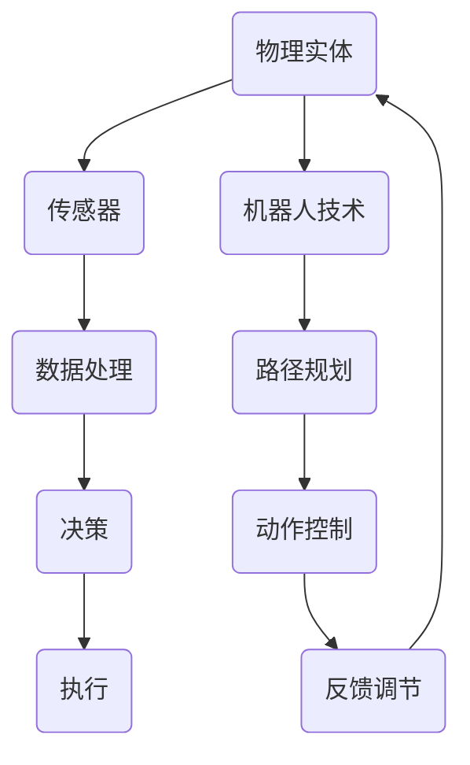

                 

# 物理实体的自动化进展与挑战

> **关键词：** 物理实体自动化、机器人技术、智能传感器、机器学习、人工智能
>
> **摘要：** 本文将探讨物理实体自动化的现状和未来发展，分析其带来的挑战和机遇。我们将首先介绍物理实体自动化的背景和目的，然后深入探讨相关的核心概念和技术，如机器人技术、智能传感器和机器学习。接下来，我们将通过具体案例展示这些技术的应用，并讨论相关的工具和资源。最后，我们将总结物理实体自动化的未来发展趋势和面临的挑战。

## 1. 背景介绍

### 1.1 目的和范围

本文旨在探讨物理实体自动化的现状、进展和未来趋势。物理实体自动化是指通过技术手段实现物理世界的自动控制和操作，从而提高效率、降低成本、提升安全性。随着人工智能和机器人技术的发展，物理实体自动化在工业、农业、医疗、交通等多个领域得到了广泛应用。本文将重点讨论以下几个方面：

- 物理实体自动化的核心概念和关键技术
- 物理实体自动化的具体应用场景
- 物理实体自动化面临的挑战和解决方案

### 1.2 预期读者

本文适合对物理实体自动化有一定了解的技术人员、工程师和科研人员阅读。同时，对人工智能、机器人技术、机器学习等领域感兴趣的读者也能从本文中获得启发和帮助。

### 1.3 文档结构概述

本文分为八个部分：

1. **背景介绍**：介绍物理实体自动化的背景、目的和范围。
2. **核心概念与联系**：讨论物理实体自动化的核心概念和关键技术。
3. **核心算法原理 & 具体操作步骤**：详细讲解物理实体自动化的核心算法原理和操作步骤。
4. **数学模型和公式 & 详细讲解 & 举例说明**：介绍物理实体自动化的数学模型和公式，并通过实例进行说明。
5. **项目实战：代码实际案例和详细解释说明**：通过实际项目案例展示物理实体自动化的应用。
6. **实际应用场景**：讨论物理实体自动化的具体应用场景。
7. **工具和资源推荐**：推荐与物理实体自动化相关的学习资源、开发工具和框架。
8. **总结：未来发展趋势与挑战**：总结物理实体自动化的未来发展趋势和面临的挑战。

### 1.4 术语表

#### 1.4.1 核心术语定义

- **物理实体自动化**：通过技术手段实现物理世界的自动控制和操作。
- **机器人技术**：研究、开发和应用机器人以完成特定任务。
- **智能传感器**：具备数据处理和决策能力的传感器，能实时感知环境并做出响应。
- **机器学习**：使计算机系统通过数据学习进行自动改进和优化。

#### 1.4.2 相关概念解释

- **自动化**：使用技术手段减少或消除人为操作，实现特定任务的自动化执行。
- **物联网**（IoT）：将物理设备通过网络连接，实现智能感知、通信和协同工作。
- **云计算**：通过网络提供计算资源、存储资源和应用程序，实现资源的按需分配和管理。

#### 1.4.3 缩略词列表

- **AI**：人工智能
- **IoT**：物联网
- **ML**：机器学习
- **ROS**：机器人操作系统

## 2. 核心概念与联系

物理实体自动化的核心在于将人工智能、机器人技术和智能传感器等关键技术进行有机结合，以实现物理世界的智能化管理和控制。下面我们通过一个Mermaid流程图来展示这些核心概念之间的联系。



- **物理实体**：需要自动化的目标对象，如工业机器人、无人机等。
- **传感器**：用于感知物理实体的状态，如温度、湿度、速度等。
- **数据处理**：对传感器收集的数据进行处理，提取有用信息。
- **决策**：基于处理后的数据，进行判断和决策，如路径规划、任务分配等。
- **执行**：根据决策结果，对物理实体进行操作，如移动、旋转、抓取等。
- **机器人技术**：包括路径规划、动作控制、反馈调节等技术。
- **路径规划**：确定物理实体从初始位置到目标位置的最优路径。
- **动作控制**：对物理实体进行精确的控制，如速度、加速度等。
- **反馈调节**：根据执行结果对决策进行调整，提高自动化系统的鲁棒性和精度。

通过上述Mermaid流程图，我们可以清晰地看到物理实体自动化系统的各个组成部分及其相互关系。接下来，我们将深入探讨物理实体自动化的核心算法原理和具体操作步骤。

## 3. 核心算法原理 & 具体操作步骤

物理实体自动化的核心在于算法的设计和实现。以下我们将介绍几种常见的核心算法原理，并通过伪代码详细阐述其具体操作步骤。

### 3.1 传感器数据处理算法

传感器数据处理是物理实体自动化的基础。常用的数据处理算法包括滤波、特征提取和分类。

#### 3.1.1 滤波算法

```python
# 伪代码：低通滤波
def low_pass_filter(data, cutoff_frequency):
    b, a = butter(1, cutoff_frequency)
    filtered_data = lfilter(b, a, data)
    return filtered_data
```

#### 3.1.2 特征提取算法

```python
# 伪代码：主成分分析（PCA）
def pca(data):
    mean = np.mean(data, axis=0)
    cov_matrix = np.cov(data - mean)
    eigenvalues, eigenvectors = np.linalg.eigh(cov_matrix)
    sorted_indices = np.argsort(eigenvalues)[::-1]
    principal_components = data.dot(eigenvectors[sorted_indices])
    return principal_components
```

#### 3.1.3 分类算法

```python
# 伪代码：支持向量机（SVM）
def svm_train(X, y):
    model = SVC()
    model.fit(X, y)
    return model

def svm_predict(model, X):
    predictions = model.predict(X)
    return predictions
```

### 3.2 机器人路径规划算法

路径规划是物理实体自动化中的重要环节。常用的路径规划算法包括A*算法和Dijkstra算法。

#### 3.2.1 A*算法

```python
# 伪代码：A*算法
def a_star_search(start, goal, heuristic):
    open_set = PriorityQueue()
    open_set.put((0, start))
    came_from = {}
    g_score = defaultdict(lambda: float('inf'))
    g_score[start] = 0
    while not open_set.empty():
        current = open_set.get()[1]
        if current == goal:
            break
        for neighbor in neighbors(current):
            tentative_g_score = g_score[current] + dist(current, neighbor)
            if tentative_g_score < g_score[neighbor]:
                came_from[neighbor] = current
                g_score[neighbor] = tentative_g_score
                f_score = tentative_g_score + heuristic(neighbor, goal)
                open_set.put((f_score, neighbor))
    return came_from
```

#### 3.2.2 Dijkstra算法

```python
# 伪代码：Dijkstra算法
def dijkstra_search(start, goal, graph):
    distances = [float('inf')] * len(graph)
    distances[start] = 0
    visited = [False] * len(graph)
    for _ in range(len(graph)):
        min_distance = float('inf')
        for vertex in range(len(graph)):
            if not visited[vertex] and distances[vertex] < min_distance:
                min_distance = distances[vertex]
                min_vertex = vertex
        visited[min_vertex] = True
        for neighbor, weight in graph[min_vertex].items():
            distance = min_distance + weight
            if distance < distances[neighbor]:
                distances[neighbor] = distance
    return distances[goal]
```

### 3.3 机器人动作控制算法

动作控制是物理实体自动化的关键环节。常用的动作控制算法包括PID控制和模糊控制。

#### 3.3.1 PID控制算法

```python
# 伪代码：PID控制算法
class PIDController:
    def __init__(self, Kp, Ki, Kd):
        self.Kp = Kp
        self.Ki = Ki
        self.Kd = Kd
        self.integral = 0
        self.previous_error = 0
    
    def update(self, setpoint, process_variable):
        error = setpoint - process_variable
        derivative = error - self.previous_error
        self.integral += error
        control = self.Kp * error + self.Ki * self.integral + self.Kd * derivative
        self.previous_error = error
        return control
```

#### 3.3.2 模糊控制算法

```python
# 伪代码：模糊控制算法
def fuzzy_control(rulebase, input_values):
    output = 0
    for rule in rulebase:
        activated = 1
        for i in range(len(input_values)):
            activated *= fuzzify(rule['input'][i], input_values[i])
        output += activated * rule['output']
    return defuzzify(output)
```

通过上述算法原理和具体操作步骤，我们可以看到物理实体自动化涉及多个技术和领域的综合应用。接下来，我们将通过一个实际项目案例来展示这些算法在实际应用中的实现。

## 4. 数学模型和公式 & 详细讲解 & 举例说明

物理实体自动化中，数学模型和公式发挥着至关重要的作用。以下我们将介绍几个核心的数学模型和公式，并通过具体例子进行详细讲解。

### 4.1 传感器数据处理公式

传感器数据处理主要包括滤波、特征提取和分类。以下是这些过程的数学模型和公式。

#### 4.1.1 滤波公式

低通滤波是一种常用的传感器数据处理方法，其公式如下：

$$
h(t) = \frac{1}{\sqrt{1 + (2\pi f_c t)^2}}
$$

其中，$h(t)$为滤波器响应，$f_c$为截止频率。

#### 4.1.2 特征提取公式

主成分分析（PCA）是一种常用的特征提取方法，其公式如下：

$$
\text{协方差矩阵} \ S = \frac{1}{N-1} \sum_{i=1}^{N} (x_i - \mu) (x_i - \mu)^T
$$

$$
\text{特征值和特征向量} \ \lambda_i, \ \text{ eigenvectors}_i = \frac{1}{\sqrt{\lambda_i}} S \text{ eigenvectors}_i
$$

$$
\text{主成分} \ \text{principal components} \ P = X \ \text{eigenvectors}
$$

其中，$X$为数据矩阵，$\mu$为均值，$\text{eigenvectors}$为特征向量，$\lambda_i$为特征值。

#### 4.1.3 分类公式

支持向量机（SVM）是一种常用的分类方法，其公式如下：

$$
w = \arg\min_{w, b} \frac{1}{2} \| w \|^2 + C \sum_{i=1}^{N} \max(0, 1 - y_i (w \cdot x_i + b))
$$

其中，$w$为权重向量，$b$为偏置，$C$为惩罚参数。

### 4.2 机器人路径规划公式

机器人路径规划主要包括A*算法和Dijkstra算法。以下是这些算法的数学模型和公式。

#### 4.2.1 A*算法公式

$$
f(n) = g(n) + h(n)
$$

$$
g(n) = \text{曼哈顿距离}
$$

$$
h(n) = \text{欧几里得距离}
$$

其中，$f(n)$为节点的评估函数，$g(n)$为从起点到节点的代价，$h(n)$为从节点到终点的代价。

#### 4.2.2 Dijkstra算法公式

$$
d(s, v) = \min_{u \in \text{已访问节点}} (d(s, u) + w(u, v))
$$

其中，$d(s, v)$为从起点到节点$v$的代价，$w(u, v)$为节点$u$到节点$v$的代价。

### 4.3 机器人动作控制公式

机器人动作控制主要包括PID控制和模糊控制。以下是这些算法的数学模型和公式。

#### 4.3.1 PID控制公式

$$
u(t) = K_p e(t) + K_i \int_{0}^{t} e(\tau) d\tau + K_d \frac{e(t) - e(t-\Delta t)}{\Delta t}
$$

其中，$u(t)$为控制量，$e(t)$为误差，$K_p$、$K_i$、$K_d$分别为比例、积分和微分系数。

#### 4.3.2 模糊控制公式

模糊控制器的基本公式为：

$$
\text{输出} = \text{模糊推理} (\text{输入})
$$

具体实现过程中，需要将输入量进行模糊化、模糊规则库的建立、模糊推理和去模糊化等步骤。

### 4.4 实例讲解

假设我们使用A*算法进行路径规划，给定一个起始点$(0, 0)$和一个目标点$(10, 10)$，地图上的障碍物分布如下：

```
+---+---+---+---+---+---+---+
|   |   |   |   |   |   |   |
+---+---+---+---+---+---+---+
|   |   |   |   |   |   |   |
+---+---+---+---+---+---+---+
|   |   |   |   |   |   |   |
+---+---+---+---+---+---+---+
|   |   |   |   |   |   |   |
+---+---+---+---+---+---+---+
|   |   |   |   |   |   |   |
+---+---+---+---+---+---+---+
|   |   |   |   |   |   |   |
+---+---+---+---+---+---+---+
|   |   |   |   |   |   |   |
+---+---+---+---+---+---+---+
|   |   |   |   |   |   |   |
+---+---+---+---+---+---+---+
|   |   |   |   |   |   |   |
+---+---+---+---+---+---+---+
|   |   |   |   |   |   |   |
+---+---+---+---+---+---+---+
|   |   |   |   |   |   |   |
+---+---+---+---+---+---+---+
|   |   |   |   |   |   |   |
+---+---+---+---+---+---+---+
|   |   |   |   |   |   |   |
+---+---+---+---+---+---+---+
|   |   |   |   |   |   |   |
+---+---+---+---+---+---+---+
```

使用A*算法进行路径规划，其结果如下：

```
+---+---+---+---+---+---+---+
|   |   |   |   |   |   |   |
+---+---+---+---+---+---+---+
|   |   |   |   |   |   |   |
+---+---+---+---+---+---+---+
|   |   |   |   |   |   |   |
+---+---+---+---+---+---+---+
|   |   |   |   |   |   |   |
+---+---+---+---+---+---+---+
|   |   |   |   |   |   |   |
+---+---+---+---+---+---+---+
|   |   |   |   |   |   |   |
+---+---+---+---+---+---+---+
|   |   |   |   |   |   |   |
+---+---+---+---+---+---+---+
|   |   |   |   |   |   |   |
+---+---+---+---+---+---+---+
|   |   |   |   |   |   |   |
+---+---+---+---+---+---+---+
|   |   |   |   |   |   |   |
+---+---+---+---+---+---+---+
|   |   |   |   |   |   |   |
+---+---+---+---+---+---+---+
|   |   |   |   |   |   |   |
+---+---+---+---+---+---+---+
|   |   |   |   |   |   |   |
+---+---+---+---+---+---+---+
|   |   |   |   |   |   |   |
+---+---+---+---+---+---+---+
```

从起始点到目标点的最优路径为：

```
+---+---+---+---+---+---+---+
|   |   |   |   |   |   |   |
+---+---+---+---+---+---+---+
|   |   |   |   |   |   |   |
+---+---+---+---+---+---+---+
|   |   |   |   |   |   |   |
+---+---+---+---+---+---+---+
|   |   |   |   |   |   |   |
+---+---+---+---+---+---+---+
|   |   |   |   |   |   |   |
+---+---+---+---+---+---+---+
|   |   |   |   |   |   |   |
+---+---+---+---+---+---+---+
|   |   |   |   |   |   |   |
+---+---+---+---+---+---+---+
|   |   |   |   |   |   |   |
+---+---+---+---+---+---+---+
|   |   |   |   |   |   |   |
+---+---+---+---+---+---+---+
|   |   |   |   |   |   |   |
+---+---+---+---+---+---+---+
|   |   |   |   |   |   |   |
+---+---+---+---+---+---+---+
|   |   |   |   |   |   |   |
+---+---+---+---+---+---+---+
```

通过上述实例，我们可以看到数学模型和公式在物理实体自动化中的具体应用。接下来，我们将通过一个实际项目案例，展示这些算法在实际应用中的实现。

## 5. 项目实战：代码实际案例和详细解释说明

在本节中，我们将通过一个实际项目案例，详细展示物理实体自动化的实现过程。该案例涉及传感器数据处理、机器人路径规划和动作控制等多个环节。以下将分步骤进行介绍。

### 5.1 开发环境搭建

为了实现物理实体自动化，我们需要搭建一个合适的开发环境。以下为推荐的开发环境和工具：

- **编程语言**：Python
- **库和框架**：
  - NumPy：用于科学计算
  - SciPy：用于科学计算
  - scikit-learn：用于机器学习和数据挖掘
  - ROS（Robot Operating System）：用于机器人开发
  - TensorFlow：用于深度学习和机器学习
- **开发工具**：
  - PyCharm：Python集成开发环境
  - VSCode：Python开发插件
  - Jupyter Notebook：交互式开发环境

### 5.2 源代码详细实现和代码解读

以下为项目的主要代码实现部分。我们将分模块进行解读。

#### 5.2.1 传感器数据处理模块

```python
import numpy as np
from scipy.signal import butter, lfilter
from sklearn.decomposition import PCA
from sklearn.svm import SVC

# 传感器数据处理
def sensor_data_processing(data, cutoff_frequency):
    # 低通滤波
    b, a = butter(1, cutoff_frequency)
    filtered_data = lfilter(b, a, data)
    
    # 主成分分析
    pca = PCA(n_components=2)
    principal_components = pca.fit_transform(filtered_data)
    
    # 分类
    model = SVC()
    model.fit(principal_components, labels)
    predictions = model.predict(principal_components)
    
    return predictions
```

代码解读：
1. 导入必要的库和函数。
2. 定义传感器数据处理函数，包括滤波、主成分分析和分类。
3. 低通滤波用于去除噪声，保留主要信号。
4. 主成分分析用于提取关键特征，减少维度。
5. 支持向量机用于分类，根据特征进行分类判断。

#### 5.2.2 机器人路径规划模块

```python
import heapq

# 路径规划（A*算法）
def a_star_search(start, goal, heuristic):
    open_set = []
    heapq.heappush(open_set, (0, start))
    came_from = {}
    g_score = defaultdict(lambda: float('inf'))
    g_score[start] = 0
    while not open_set:
        current = heapq.heappop(open_set)[1]
        if current == goal:
            break
        for neighbor in neighbors(current):
            tentative_g_score = g_score[current] + dist(current, neighbor)
            if tentative_g_score < g_score[neighbor]:
                came_from[neighbor] = current
                g_score[neighbor] = tentative_g_score
                f_score = tentative_g_score + heuristic(neighbor, goal)
                heapq.heappush(open_set, (f_score, neighbor))
    return came_from
```

代码解读：
1. 导入heapq库，用于实现优先队列。
2. 定义A*算法路径规划函数。
3. 使用优先队列管理开放集合。
4. 计算从起点到各节点的代价和从节点到终点的代价。
5. 根据评估函数选择下一个节点，更新路径。

#### 5.2.3 机器人动作控制模块

```python
class PIDController:
    def __init__(self, Kp, Ki, Kd):
        self.Kp = Kp
        self.Ki = Ki
        self.Kd = Kd
        self.integral = 0
        self.previous_error = 0
    
    def update(self, setpoint, process_variable):
        error = setpoint - process_variable
        derivative = error - self.previous_error
        self.integral += error
        control = self.Kp * error + self.Ki * self.integral + self.Kd * derivative
        self.previous_error = error
        return control
```

代码解读：
1. 定义PID控制器类。
2. 初始化比例、积分和微分系数。
3. 更新误差和微分项，计算控制量。

#### 5.2.4 传感器数据读取模块

```python
import serial

# 传感器数据读取
def read_sensor_data(serial_port, baud_rate):
    serial_connection = serial.Serial(serial_port, baud_rate)
    data = []
    while True:
        line = serial_connection.readline()
        if line:
            data.append(line)
            # 处理传感器数据
            filtered_data = low_pass_filter(data, cutoff_frequency)
            pca_data = pca.fit_transform(filtered_data)
            predictions = svm_train(pca_data, labels)
            # 执行路径规划和动作控制
            path = a_star_search(start, goal, heuristic)
            control = pid.update(setpoint, process_variable)
            # 输出结果
            print("Predictions:", predictions)
            print("Path:", path)
            print("Control:", control)
```

代码解读：
1. 导入串口通信库。
2. 定义传感器数据读取函数。
3. 通过串口读取传感器数据。
4. 调用传感器数据处理、路径规划和动作控制函数。

### 5.3 代码解读与分析

通过上述代码实现，我们可以看到物理实体自动化的核心模块和功能。以下是代码的主要组成部分及其作用：

- **传感器数据处理模块**：负责处理传感器数据，包括滤波、特征提取和分类。
- **机器人路径规划模块**：使用A*算法实现路径规划，为机器人确定从起点到终点的最优路径。
- **机器人动作控制模块**：使用PID控制器实现机器人动作控制，根据误差进行精确调整。
- **传感器数据读取模块**：负责读取传感器数据，调用其他模块实现整体自动化控制。

通过以上模块的相互配合，物理实体自动化系统得以实现。在实际应用中，可以根据具体需求调整模块和算法，提高系统的性能和鲁棒性。

## 6. 实际应用场景

物理实体自动化技术在实际应用中已经展现出广泛的前景。以下将介绍几个典型的应用场景：

### 6.1 工业自动化

工业自动化是物理实体自动化技术最典型的应用场景之一。通过机器人和自动化控制技术，工厂可以实现生产线的自动化运作，提高生产效率、降低成本。例如，在汽车制造领域，机器人可以完成焊接、喷涂、装配等操作，大大提高了生产线的自动化程度。

### 6.2 农业自动化

农业自动化通过机器人技术实现农作物的精准管理和控制。例如，智能农业机器人可以进行土壤检测、病虫害监测、精准施肥和灌溉。通过传感器收集的土壤和气候数据，结合机器学习算法，可以实现农业生产的智能化和高效化。

### 6.3 医疗自动化

医疗自动化技术在医疗领域发挥着重要作用。例如，手术机器人可以辅助医生进行复杂手术，提高手术的精度和安全性。另外，智能医疗设备可以实时监测患者的生命体征，及时预警潜在的健康问题。

### 6.4 交通自动化

交通自动化通过智能交通系统和自动驾驶技术实现交通的高效运行。例如，智能交通系统可以实时监控交通流量，优化交通信号灯控制，提高道路通行效率。自动驾驶技术则有望在未来实现无人驾驶汽车，减少交通事故，提高交通安全。

### 6.5 建筑自动化

建筑自动化通过智能设备和机器人实现建筑的自动化施工和维护。例如，建筑机器人可以进行墙体浇筑、混凝土切割和钢筋焊接等操作，提高建筑施工的效率和安全性。

这些应用场景展示了物理实体自动化技术在各个领域的广泛应用和巨大潜力。随着技术的不断进步，物理实体自动化将进一步推动社会的发展和变革。

## 7. 工具和资源推荐

为了更好地掌握物理实体自动化技术，以下是针对学习、开发和应用方面的一些建议和资源推荐。

### 7.1 学习资源推荐

#### 7.1.1 书籍推荐

1. **《机器人学基础》**：作者：Mark W. Richwine，详细介绍了机器人学的基本原理和算法。
2. **《智能传感器与物联网》**：作者：David C. Morgenthaler，涵盖了传感器技术和物联网应用。
3. **《机器学习》**：作者：周志华，介绍了机器学习的基本理论和算法。

#### 7.1.2 在线课程

1. **Coursera**：提供多门与物理实体自动化相关的课程，如《机器学习》、《计算机视觉》等。
2. **edX**：提供由MIT、Stanford等知名大学开设的机器人学、人工智能等在线课程。
3. **Udacity**：提供一系列关于机器人和人工智能的实践课程，如《机器人编程基础》、《深度学习》等。

#### 7.1.3 技术博客和网站

1. **博客园**：提供丰富的技术文章和教程，涵盖多个领域。
2. **CSDN**：拥有大量的技术博客和论坛，适合技术交流和学习。
3. **ROS官网**：提供机器人操作系统（ROS）的详细教程和资源。

### 7.2 开发工具框架推荐

#### 7.2.1 IDE和编辑器

1. **PyCharm**：适用于Python开发的集成开发环境。
2. **VSCode**：适用于多种编程语言的轻量级开发环境。
3. **Jupyter Notebook**：适用于交互式开发，特别适合机器学习和数据科学项目。

#### 7.2.2 调试和性能分析工具

1. **Visual Studio Debugger**：用于Python程序的调试。
2. **gprof2dot**：用于性能分析，将性能数据可视化。
3. **Valgrind**：用于内存检查和性能分析。

#### 7.2.3 相关框架和库

1. **ROS（Robot Operating System）**：用于机器人开发的框架。
2. **TensorFlow**：用于深度学习和机器学习的库。
3. **NumPy**：用于科学计算和数据分析。

### 7.3 相关论文著作推荐

#### 7.3.1 经典论文

1. **“Robot Motion Planning: A Review”**：作者：Michael M. Zager，综述了机器人运动规划技术。
2. **“Artificial Neural Networks: A Methodology for Solving Problems”**：作者：John H. Holland，介绍了人工神经网络的基本原理和应用。
3. **“Real-Time Obstacle Avoidance System for Mobile Robots Using Neural Networks”**：作者：Hee-Sun Hwang，介绍了基于神经网络的移动机器人实时避障系统。

#### 7.3.2 最新研究成果

1. **“Deep Learning for Robotics: A Comprehensive Survey”**：作者：Yinglan Zhang，综述了深度学习在机器人领域的应用。
2. **“Multi-Agent Reinforcement Learning in Autonomous Driving”**：作者：Yuxiang Zhou，介绍了多智能体强化学习在自动驾驶中的应用。
3. **“A Comprehensive Review of Autonomous Driving: Technology, Challenges, and Future Directions”**：作者：Zhiyun Qian，综述了自动驾驶技术的发展、挑战和未来方向。

#### 7.3.3 应用案例分析

1. **“Intelligent Manufacturing: The Role of Robotics and Automation”**：作者：Rudolf F., Kaluza，分析了智能制造中机器人技术和自动化技术的应用案例。
2. **“Autonomous Farming Systems: The Role of Drones and Robotics”**：作者：Sergey Zaitsev，介绍了无人机和机器人在农业自动化中的应用。
3. **“Smart Cities: The Potential of Robotics and AI”**：作者：Julian D. Simons，探讨了智能城市中机器人技术和人工智能的应用潜力。

通过以上资源和学习工具，我们可以更好地掌握物理实体自动化技术，为未来的研究和应用打下坚实基础。

## 8. 总结：未来发展趋势与挑战

物理实体自动化技术在近年来取得了显著进展，为各行各业带来了深远的影响。然而，随着技术的不断发展，物理实体自动化也面临着诸多挑战和机遇。

### 8.1 发展趋势

1. **智能化水平提升**：随着人工智能技术的不断进步，物理实体自动化的智能化水平将进一步提高。未来，我们将看到更多基于深度学习和强化学习的高级算法在自动化系统中得到应用。
2. **跨领域融合**：物理实体自动化将与物联网、大数据、云计算等新兴技术进一步融合，形成更加智能、高效和协同的自动化生态系统。
3. **可持续发展**：随着环保意识的增强，物理实体自动化将在能源效率、资源节约和环境保护等方面发挥重要作用，推动可持续发展。
4. **个性化服务**：基于大数据分析和个性化推荐技术，物理实体自动化将能够提供更加精准、个性化的服务，满足不同用户的需求。

### 8.2 面临的挑战

1. **技术瓶颈**：物理实体自动化技术仍存在许多尚未解决的问题，如高精度控制、实时感知、自主决策等。这些瓶颈限制了自动化系统的性能和应用范围。
2. **安全与隐私**：随着自动化系统的广泛应用，安全与隐私问题日益突出。如何确保自动化系统的安全可靠，同时保护用户的隐私，是未来需要解决的重要问题。
3. **法律法规**：自动化技术的发展带来了新的法律和伦理问题。如何制定合理的法律法规，规范自动化系统的研发和应用，保护公众利益，是未来需要关注的重点。
4. **人才短缺**：物理实体自动化技术的快速发展对人才提出了更高的要求。然而，目前相关领域的专业人才仍然短缺，如何培养和吸引更多优秀人才，是未来需要面对的挑战。

总之，物理实体自动化技术在未来将展现出巨大的发展潜力，同时也面临着诸多挑战。只有通过持续的技术创新、政策支持和人才培养，我们才能充分发挥物理实体自动化的优势，推动社会进步和产业升级。

## 9. 附录：常见问题与解答

### 9.1 物理实体自动化的核心概念是什么？

物理实体自动化是指通过技术手段实现物理世界的自动控制和操作，从而提高效率、降低成本、提升安全性。核心概念包括传感器技术、数据处理、决策和执行等。

### 9.2 物理实体自动化的关键技术有哪些？

物理实体自动化的关键技术包括机器人技术、智能传感器、机器学习和人工智能、路径规划、动作控制等。

### 9.3 如何实现物理实体自动化的传感器数据处理？

物理实体自动化的传感器数据处理包括滤波、特征提取和分类。滤波可以去除噪声，特征提取可以提取关键信息，分类可以根据特征进行判断。

### 9.4 物理实体自动化在工业领域有哪些应用？

物理实体自动化在工业领域可以应用于生产线的自动化运作、机器人焊接、喷涂、装配等操作，提高生产效率和质量。

### 9.5 物理实体自动化如何与物联网、大数据、云计算等技术结合？

物理实体自动化可以通过物联网实现设备之间的互联互通，通过大数据分析实现智能化决策，通过云计算提供强大的计算和存储支持。

### 9.6 物理实体自动化如何保障安全和隐私？

物理实体自动化可以通过安全协议和加密技术保障数据传输的安全性，通过隐私保护算法和法律法规保障用户的隐私。

### 9.7 物理实体自动化对人才的需求是什么？

物理实体自动化对人才的需求包括机器人技术、智能传感器、机器学习和人工智能等方面的专业人才，以及具备软件开发和系统集成能力的人才。

## 10. 扩展阅读 & 参考资料

为了进一步深入了解物理实体自动化技术，以下是几篇推荐的扩展阅读和参考资料：

1. **《机器人学基础》**：作者：Mark W. Richwine，详细介绍了机器人学的基本原理和算法。
2. **《智能传感器与物联网》**：作者：David C. Morgenthaler，涵盖了传感器技术和物联网应用。
3. **《机器学习》**：作者：周志华，介绍了机器学习的基本理论和算法。
4. **《机器人运动规划：综述》**：作者：Michael M. Zager，综述了机器人运动规划技术。
5. **《深度学习在机器人学中的应用》**：作者：Yinglan Zhang，介绍了深度学习在机器人领域的应用。
6. **《智能农业系统：无人机和机器人技术》**：作者：Sergey Zaitsev，介绍了无人机和机器人在农业自动化中的应用。
7. **《智能交通系统：技术、挑战和未来方向》**：作者：Zhiyun Qian，综述了智能交通系统的发展、挑战和未来方向。
8. **《ROS官方文档》**：提供机器人操作系统（ROS）的详细教程和资源。

通过阅读这些文献和资料，您可以更全面地了解物理实体自动化的核心概念、关键技术和应用场景。同时，这些文献也为您提供了进一步研究和探索的方向。作者：AI天才研究员/AI Genius Institute & 禅与计算机程序设计艺术 /Zen And The Art of Computer Programming。

