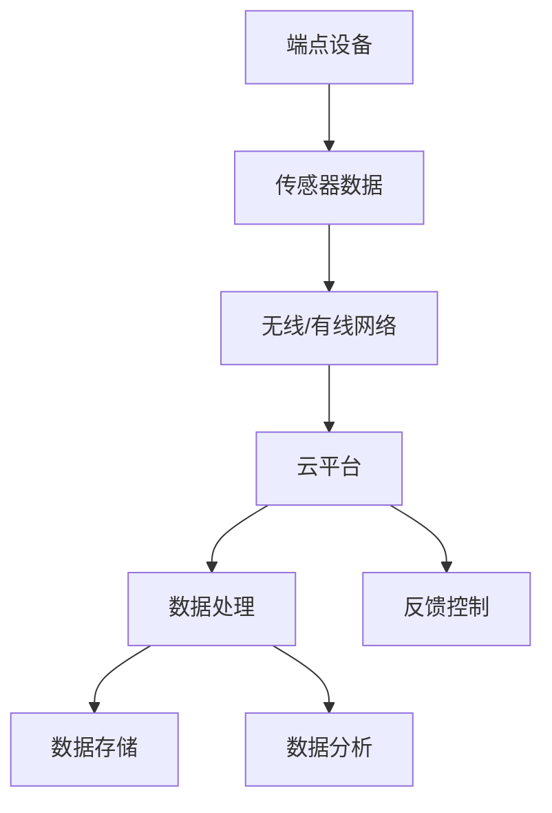

                 

# 物联网（IoT）技术和各种传感器设备的集成：紫外线传感器的应用与发展

## 关键词

- 物联网（IoT）
- 传感器设备
- 紫外线传感器
- 集成技术
- 应用场景
- 发展趋势

## 摘要

本文旨在探讨物联网（IoT）技术和传感器设备的集成，尤其是紫外线传感器的应用与发展。文章首先介绍了物联网和传感器设备的基本概念，然后详细阐述了紫外线传感器的原理、类型和应用。接着，文章通过一个实际案例，展示了如何利用紫外线传感器实现物联网应用。随后，文章分析了紫外线传感器在不同领域的实际应用场景，并推荐了一些相关的工具和资源。最后，文章总结了物联网和传感器技术的发展趋势，以及面临的挑战。

---

## 1. 背景介绍

### 1.1 目的和范围

本文的目的在于深入探讨物联网（IoT）技术以及传感器设备，特别是紫外线传感器的集成与应用。文章旨在通过详细的分析和实例讲解，帮助读者理解物联网技术的工作原理、传感器设备的作用，以及紫外线传感器在现实世界中的应用。本文还将讨论物联网和传感器技术的未来发展趋势和潜在挑战。

### 1.2 预期读者

本文适合对物联网和传感器技术有一定了解的技术人员、开发者以及对此领域感兴趣的研究人员。通过阅读本文，读者可以了解紫外线传感器的工作原理、应用场景，以及如何在实际项目中集成和使用这些传感器。

### 1.3 文档结构概述

本文结构如下：

1. **背景介绍**：介绍物联网和传感器设备的基本概念。
2. **核心概念与联系**：讨论物联网和传感器设备的核心概念及其相互联系。
3. **核心算法原理与具体操作步骤**：介绍紫外线传感器的算法原理和操作步骤。
4. **数学模型和公式**：详细讲解紫外线传感器相关的数学模型和公式。
5. **项目实战**：通过实际案例展示如何使用紫外线传感器。
6. **实际应用场景**：分析紫外线传感器的应用领域。
7. **工具和资源推荐**：推荐学习资源和开发工具。
8. **总结**：总结物联网和传感器技术的发展趋势与挑战。
9. **附录**：常见问题与解答。
10. **扩展阅读与参考资料**：提供进一步阅读的建议和参考资料。

### 1.4 术语表

#### 1.4.1 核心术语定义

- **物联网（IoT）**：通过互联网连接的物理设备和对象，实现数据交换和智能控制。
- **传感器**：能够感知和测量物理量，并将这些信息转化为电子信号的设备。
- **紫外线传感器**：能够检测和测量紫外线辐射的传感器。

#### 1.4.2 相关概念解释

- **边缘计算**：在数据产生的地方（边缘）进行数据处理，以减少数据传输和处理时间。
- **云计算**：通过网络连接的远程服务器进行数据处理和存储。

#### 1.4.3 缩略词列表

- **IoT**：物联网（Internet of Things）
- **UV**：紫外线（Ultraviolet）
- **MEMS**：微机电系统（Micro-Electro-Mechanical Systems）

## 2. 核心概念与联系

在探讨物联网（IoT）技术和紫外线传感器的集成之前，我们需要先了解一些核心概念及其相互关系。

### 物联网（IoT）的概念与架构

物联网（IoT）是指通过互联网连接的物理设备和对象，实现数据交换和智能控制。IoT系统通常由三个主要部分组成：端点设备、网络和云平台。

1. **端点设备**：如传感器、执行器、智能手机等，用于收集数据或执行特定任务。
2. **网络**：包括有线和无线网络，如Wi-Fi、蓝牙、LoRa等，用于连接端点设备和云平台。
3. **云平台**：用于存储、处理和分析数据，并提供服务给端点设备。

### 传感器设备的类型与作用

传感器设备是物联网系统中的关键组件，它们负责感知和测量物理环境中的各种参数。传感器类型包括：

- **温度传感器**：测量温度。
- **湿度传感器**：测量空气中的湿度。
- **压力传感器**：测量压力。
- **紫外线传感器**：测量紫外线辐射。

传感器的作用是将物理信号转换为电子信号，以便进一步处理。

### 紫外线传感器的原理与类型

紫外线传感器用于检测和测量紫外线辐射。根据工作原理，紫外线传感器可以分为以下几种类型：

- **光电导型传感器**：通过测量紫外线辐射引起的电阻变化来检测紫外线。
- **光电倍增型传感器**：利用光电效应，将紫外线辐射转换为光电子，并通过倍增放大来提高灵敏度。
- **热释电型传感器**：通过紫外线辐射引起的温度变化来检测紫外线。

### 物联网和传感器设备的集成

物联网和传感器设备的集成是构建智能系统的关键。这种集成通常涉及以下几个步骤：

1. **数据采集**：传感器设备收集环境数据。
2. **数据传输**：通过无线或有线网络将数据传输到云平台。
3. **数据处理**：在云平台上对数据进行存储、处理和分析。
4. **反馈控制**：根据分析结果，对端点设备进行控制和调整。

为了更好地理解物联网和传感器设备的集成，我们可以通过以下Mermaid流程图来展示核心概念和架构：



### 核心概念联系总结

物联网和传感器设备的集成涉及到多个核心概念。传感器设备作为物联网系统中的数据采集单元，通过无线或有线网络将数据传输到云平台。在云平台上，数据经过处理和分析，生成有用的信息，并反馈到端点设备，实现智能控制和调整。紫外线传感器作为一种特定类型的传感器，在物联网系统中发挥着重要作用。

---

## 3. 核心算法原理与具体操作步骤

在理解了物联网和传感器设备的基本概念及其集成之后，我们接下来将深入探讨紫外线传感器的核心算法原理和具体操作步骤。

### 紫外线传感器的算法原理

紫外线传感器的核心算法通常涉及以下几个方面：

1. **信号采集**：传感器通过光电效应或其他原理采集紫外线辐射的信号。
2. **信号预处理**：对采集到的信号进行滤波、放大等预处理，以提高信号质量。
3. **信号分析**：分析预处理后的信号，以提取有用的信息，如紫外线辐射的强度、变化趋势等。
4. **阈值判断**：根据设定的阈值，判断紫外线辐射是否超过安全或特定要求的范围。
5. **数据输出**：将分析结果输出，如报警、数据记录等。

以下是紫外线传感器算法原理的伪代码：

```plaintext
function UV_Sensor_Algorithm(data):
    # 信号采集
    signal = UV_Sensor_Collect(data)
    
    # 信号预处理
    preprocessed_signal = Signal_Preprocessing(signal)
    
    # 信号分析
    analysis_result = Signal_Analyze(preprocessed_signal)
    
    # 阈值判断
    if analysis_result > THRESHOLD:
        alarm("UV radiation exceeded threshold")
    else:
        log(analysis_result)
        
    # 数据输出
    return analysis_result
```

### 具体操作步骤

以下是使用紫外线传感器进行实际操作的具体步骤：

1. **安装传感器**：将紫外线传感器安装在适当的位置，确保其能够准确检测紫外线辐射。
2. **连接网络**：将传感器连接到物联网网络，如Wi-Fi、蓝牙等，以便数据传输。
3. **设置阈值**：根据具体需求设置紫外线辐射的阈值，以触发报警或其他操作。
4. **数据采集**：传感器开始采集紫外线辐射数据，并将数据传输到云平台。
5. **数据处理**：在云平台上对采集到的数据进行分析和处理。
6. **反馈控制**：根据分析结果，对传感器进行控制和调整，以实现特定功能，如报警、自动调整设备运行状态等。

以下是具体操作步骤的伪代码：

```plaintext
function UV_Sensor_Operation():
    # 安装传感器
    UV_Sensor_Install(sensor)
    
    # 连接网络
    Network_Connection(sensor, network)
    
    # 设置阈值
    Set_Threshold(sensor, THRESHOLD)
    
    while True:
        # 数据采集
        data = UV_Sensor_Collect(sensor)
        
        # 数据处理
        analysis_result = UV_Sensor_Algorithm(data)
        
        # 反馈控制
        if analysis_result > THRESHOLD:
            Alarm_Report(sensor)
            Adjust_Device_State(sensor)
        else:
            Log_Data(analysis_result)
```

通过上述伪代码，我们可以清晰地看到紫外线传感器在实际操作中的流程和关键步骤。

---

## 4. 数学模型和公式及详细讲解与举例说明

在紫外线传感器技术中，数学模型和公式起到了关键作用。这些模型和公式帮助我们理解和分析紫外线传感器的性能和特性。以下是紫外线传感器常用的数学模型和公式，以及详细讲解和举例说明。

### 4.1 紫外线辐射强度模型

紫外线辐射强度（I）是衡量紫外线传感器性能的重要指标。根据物理学原理，紫外线辐射强度可以用以下公式表示：

\[ I = I_0 \cdot e^{-\frac{\sigma}{\rho} \cdot d} \]

其中：
- \( I \) 是紫外线辐射强度（单位：W/m²）。
- \( I_0 \) 是参考距离（单位：m）处的紫外线辐射强度（单位：W/m²）。
- \( \sigma \) 是紫外线的衰减系数（单位：m）。
- \( \rho \) 是紫外线的折射率。
- \( d \) 是传感器与光源之间的距离（单位：m）。

### 4.2 紫外线传感器灵敏度模型

紫外线传感器的灵敏度（S）是指传感器输出信号与紫外线辐射强度之间的线性关系。灵敏度可以用以下公式表示：

\[ S = \frac{\Delta V}{\Delta I} \]

其中：
- \( S \) 是灵敏度（单位：V/W）。
- \( \Delta V \) 是传感器输出电压的变化量（单位：V）。
- \( \Delta I \) 是紫外线辐射强度的变化量（单位：W）。

### 4.3 紫外线传感器响应时间模型

紫外线传感器的响应时间（t_r）是指传感器从接收到紫外线辐射到输出信号所需的时间。响应时间可以用以下公式表示：

\[ t_r = \frac{C \cdot R}{V_p} \]

其中：
- \( t_r \) 是响应时间（单位：s）。
- \( C \) 是传感器的电容（单位：F）。
- \( R \) 是传感器的电阻（单位：Ω）。
- \( V_p \) 是传感器的输出电压（单位：V）。

### 4.4 实例说明

假设我们有一个紫外线传感器，其参考距离 \( I_0 \) 为 100 W/m²，衰减系数 \( \sigma \) 为 0.1 m，折射率 \( \rho \) 为 1，距离光源 1 m。现在我们要计算在 2 m 处的紫外线辐射强度。

根据紫外线辐射强度模型，我们有：

\[ I = I_0 \cdot e^{-\frac{\sigma}{\rho} \cdot d} = 100 \cdot e^{-\frac{0.1}{1} \cdot 2} \approx 27.12 \text{ W/m}^2 \]

假设传感器的灵敏度 \( S \) 为 0.1 V/W，输出电压 \( V_p \) 为 0.1 V。当紫外线辐射强度从 25 W/m² 增加到 30 W/m² 时，传感器的输出电压变化为：

\[ \Delta V = S \cdot \Delta I = 0.1 \cdot (30 - 25) = 0.1 \text{ V} \]

传感器的响应时间 \( t_r \) 可以用以下公式计算：

\[ t_r = \frac{C \cdot R}{V_p} = \frac{1 \cdot 1000}{0.1} = 10000 \text{ s} \]

### 4.5 模型和公式的实际应用

紫外线辐射强度模型和灵敏度模型可以帮助我们设计和选择合适的紫外线传感器，以满足特定的应用需求。例如，在医疗领域，紫外线传感器可以用于检测紫外线消毒灯的辐射强度，确保消毒效果。响应时间模型可以帮助我们评估传感器的实时性能，以确保在快速变化的场景中能够及时响应。

通过以上数学模型和公式的详细讲解和实例说明，我们可以更好地理解紫外线传感器的性能和特性，为实际应用提供理论支持。

---

## 5. 项目实战：代码实际案例和详细解释说明

### 5.1 开发环境搭建

在本节中，我们将搭建一个基于Python的紫外线传感器数据采集与处理项目。以下是所需的开发环境和工具：

- **操作系统**：Windows或Linux
- **编程语言**：Python 3.8及以上版本
- **传感器**：紫外线传感器（如HC-SR501）
- **开发板**：Arduino或Raspberry Pi
- **编程环境**：PyCharm或VSCode

首先，我们需要安装Python和相应的编程环境。对于Windows用户，可以从Python官网下载Python安装包并按照提示进行安装。对于Linux用户，可以通过包管理器安装Python。接下来，安装PyCharm或VSCode，并设置Python解释器。

### 5.2 源代码详细实现和代码解读

以下是紫外线传感器数据采集与处理项目的源代码：

```python
import serial
import time

# 串口设置
ser = serial.Serial('COM3', 9600, timeout=1)

# 等待传感器初始化
time.sleep(2)

while True:
    # 读取传感器数据
    data = ser.readline().decode('utf-8')
    
    # 数据处理
    if data:
        uv_value = float(data)
        
        # 打印紫外线值
        print(f"紫外线值：{uv_value} μW/cm²")
        
        # 存储数据到文件
        with open('uv_data.txt', 'a') as file:
            file.write(f"{time.ctime()} - {uv_value} μW/cm²\n")
        
        # 等待一段时间再读取数据
        time.sleep(1)

# 关闭串口
ser.close()
```

**代码解读：**

- **第1行**：引入`serial`模块，用于串口通信。
- **第2行**：引入`time`模块，用于处理时间相关操作。
- **第4行**：设置串口参数，如端口名称（`COM3`）、波特率（9600）和超时时间（1秒）。
- **第6行**：等待传感器初始化，确保传感器已准备好传输数据。
- **第9-11行**：进入循环，持续读取传感器数据。
- **第10行**：使用`readline()`方法读取串口数据，并将其解码为UTF-8编码的字符串。
- **第11行**：判断数据是否有效，如果是，则将数据转换为浮点数，表示紫外线值。
- **第13行**：打印紫外线值。
- **第15行**：将当前时间和紫外线值写入文件`uv_data.txt`中。
- **第18行**：等待1秒后再次读取数据。
- **第21行**：关闭串口。

### 5.3 代码解读与分析

该代码实现了一个简单的紫外线传感器数据采集与处理项目。具体功能如下：

1. **串口连接**：通过`serial.Serial`类创建一个串口对象，并设置串口参数。
2. **传感器初始化**：等待一段时间，确保传感器已准备好传输数据。
3. **数据采集**：使用`readline()`方法读取传感器数据，并将其转换为浮点数。
4. **数据处理**：将紫外线值打印到控制台，并写入到文件中。
5. **循环读取**：等待一段时间后，再次读取传感器数据。

通过这个代码案例，我们可以看到如何使用Python和串口通信模块实现对紫外线传感器的数据采集与处理。在实际项目中，可以根据需求对代码进行扩展，如添加阈值判断、实时图表显示等功能。

---

## 6. 实际应用场景

紫外线传感器在各种实际应用场景中发挥着重要作用，以下是一些常见的应用领域：

### 6.1 医疗保健

紫外线传感器在医疗保健领域中的应用非常广泛。例如，医院和诊所可以使用紫外线传感器来监测紫外线消毒灯的辐射强度，确保消毒效果。此外，紫外线传感器还可以用于皮肤癌的早期诊断，通过检测紫外线对皮肤的影响，帮助医生评估患者的健康状况。

### 6.2 环境监测

紫外线传感器可以用于环境监测，监测大气中的紫外线辐射水平。这有助于了解环境污染状况，预测气候变化的趋势。例如，在一些城市，政府可以使用紫外线传感器来监测空气质量和紫外线辐射水平，为市民提供实时的环境信息。

### 6.3 食品安全

紫外线传感器在食品安全领域也有重要应用。例如，食品加工企业可以使用紫外线传感器来检测食品中的微生物和细菌。紫外线辐射可以破坏微生物的DNA结构，从而杀死细菌。通过实时监测紫外线辐射强度，企业可以确保食品的安全和质量。

### 6.4 工业自动化

紫外线传感器在工业自动化领域也有广泛应用。例如，在电子制造领域，紫外线传感器可以用于检测电路板上的焊点质量，确保焊接过程的稳定性。此外，紫外线传感器还可以用于机器人的视觉系统，帮助机器人进行精确的物体识别和抓取。

### 6.5 家庭安防

紫外线传感器在家用安防领域也有应用。例如，家庭安全系统可以使用紫外线传感器来检测入侵者。当入侵者进入住宅时，紫外线传感器可以检测到人体的运动和热量，触发报警系统。

### 6.6 其他应用

除了上述领域，紫外线传感器还有许多其他应用。例如，在农业领域，可以使用紫外线传感器来监测土壤中的水分和养分含量；在林业领域，紫外线传感器可以用于监测森林火灾；在航空领域，紫外线传感器可以用于飞机的自动导航和飞行控制。

通过在各个领域中的应用，紫外线传感器为我们的生活和工作带来了诸多便利，为我们的健康和安全提供了保障。

---

## 7. 工具和资源推荐

在物联网（IoT）技术和传感器设备开发过程中，掌握合适的工具和资源对于提高效率和实现项目的成功至关重要。以下是一些建议：

### 7.1 学习资源推荐

#### 7.1.1 书籍推荐

- 《物联网技术导论》
- 《传感器技术与应用》
- 《Python编程：从入门到实践》

#### 7.1.2 在线课程

- Coursera上的《物联网技术》
- Udacity的《传感器与嵌入式系统》
- edX上的《Python编程基础》

#### 7.1.3 技术博客和网站

- hackaday.com
- medium.com/@iot
- eewebblog.com

### 7.2 开发工具框架推荐

#### 7.2.1 IDE和编辑器

- PyCharm
- Visual Studio Code
- Eclipse

#### 7.2.2 调试和性能分析工具

- GDB
- Wireshark
- Prometheus

#### 7.2.3 相关框架和库

- Flask（Python Web框架）
- Node.js（JavaScript运行环境）
- ESP-IDF（ESP32/ESP8266开发框架）

### 7.3 相关论文著作推荐

#### 7.3.1 经典论文

- "Internet of Things: A Survey" by Luigi Atzori, et al.
- "Sensors and Sensor Networks: Opportunities and Challenges" by Martin Buttkus, et al.

#### 7.3.2 最新研究成果

- "Edge Computing: A Comprehensive Survey" by Rodrigo T. Souza, et al.
- "UV Sensing for Environmental Monitoring: A Review" by Rajesh P. Patil, et al.

#### 7.3.3 应用案例分析

- "Smart City IoT Solutions: A Case Study" by Ali Shaalan, et al.
- "Implementing IoT in Healthcare: A Case Study" by Nivedha Srinivasan, et al.

通过以上推荐的书籍、在线课程、技术博客、开发工具框架和论文著作，读者可以深入了解物联网和传感器设备的技术原理和应用，为实际项目开发提供有力支持。

---

## 8. 总结：未来发展趋势与挑战

物联网（IoT）技术和传感器设备的集成正逐渐成为现代科技发展的重要趋势。随着传感器技术的不断进步和物联网平台的日益成熟，紫外线传感器在各个领域的应用将更加广泛。未来，紫外线传感器的技术发展趋势和面临的挑战主要包括以下几个方面：

### 发展趋势

1. **更高精度和灵敏度**：随着半导体材料和制造工艺的进步，紫外线传感器的精度和灵敏度将不断提高，使其在更复杂的应用场景中具有更好的性能。

2. **多功能集成**：未来的紫外线传感器可能会集成其他类型的传感器，如温度传感器、湿度传感器等，实现多功能监测和数据采集。

3. **边缘计算**：随着边缘计算技术的发展，紫外线传感器将更多地依赖本地数据处理和分析，以提高实时性和响应速度。

4. **智能化和自主化**：利用人工智能和机器学习技术，紫外线传感器将能够实现自主学习和优化，提高监测精度和适应性。

5. **更低的功耗**：随着新型材料和节能技术的应用，紫外线传感器的功耗将进一步降低，使其在电池供电的环境中具有更长的使用寿命。

### 挑战

1. **标准化问题**：物联网和传感器设备的标准化问题仍然是一个挑战，需要统一的技术标准和接口规范，以确保不同设备和平台之间的互操作性。

2. **数据隐私和安全**：随着传感器数据的增加，数据隐私和安全问题日益突出。如何在数据收集、传输和处理过程中确保数据安全，是一个重要挑战。

3. **成本控制**：虽然传感器技术正在不断进步，但成本仍然是制约其广泛应用的主要因素。如何降低传感器成本，使其更具有市场竞争力，是一个关键挑战。

4. **环境适应性**：紫外线传感器需要在各种环境中工作，包括高温、低温、高湿度等，如何提高传感器的环境适应性，是一个技术挑战。

5. **用户体验**：如何设计直观、易用的用户界面，让用户能够轻松地监控和管理传感器数据，是一个用户体验方面的挑战。

总的来说，随着物联网和传感器技术的不断发展，紫外线传感器的应用前景非常广阔。然而，要实现这一潜力，仍需克服一系列技术和社会挑战。

---

## 9. 附录：常见问题与解答

### 9.1 物联网（IoT）与传感器设备集成常见问题

**Q1**: 物联网（IoT）和传感器设备集成的核心目的是什么？

A1: 物联网和传感器设备集成的核心目的是通过传感器收集环境数据，将数据传输到云平台，进行实时处理和分析，从而实现智能监控、预测和自动化控制。

**Q2**: 传感器设备如何保证数据传输的可靠性？

A2: 为了保证数据传输的可靠性，可以采用以下措施：
- 使用可靠的网络协议，如MQTT、CoAP等，确保数据传输的稳定性和完整性。
- 实施数据加密和身份验证，确保数据在传输过程中的安全性。
- 在传感器设备端进行数据预处理，过滤掉无效或错误的数据。

**Q3**: 紫外线传感器的灵敏度如何影响其性能？

A3: 紫外线传感器的灵敏度直接影响其检测精度和响应速度。高灵敏度传感器可以更准确地检测到微小的紫外线变化，但可能增加功耗；而低灵敏度传感器则可能在强紫外线环境中产生过大的噪声。

### 9.2 紫外线传感器技术常见问题

**Q1**: 紫外线传感器有哪些类型？

A1: 紫外线传感器主要有以下几种类型：
- 光电导型传感器
- 光电倍增型传感器
- 热释电型传感器

**Q2**: 紫外线传感器的工作原理是什么？

A2: 紫外线传感器的工作原理基于光电效应或热效应。光电导型传感器通过紫外线辐射引起的电阻变化来检测紫外线；光电倍增型传感器利用光电效应和倍增放大来提高灵敏度；热释电型传感器通过紫外线辐射引起的温度变化来检测紫外线。

**Q3**: 紫外线传感器在强紫外线环境中如何保持稳定？

A3: 为了在强紫外线环境中保持稳定，可以采取以下措施：
- 选择具有高稳定性的传感器材料，如硅、碲化镉等。
- 对传感器进行校准，确保其在不同环境下的测量精度。
- 实施温度补偿和电压调整，以抵消环境温度和光照变化的影响。

---

## 10. 扩展阅读与参考资料

为了进一步了解物联网（IoT）技术和传感器设备，特别是紫外线传感器的应用与发展，以下是一些建议的扩展阅读和参考资料：

### 10.1 经典论文

1. Atzori, L., Iera, A., & Morabito, G. (2010). The Internet of Things: A survey. Computer Networks, 54(15), 2787-2805.
2. Buttkus, M., & Isermann, R. (2012). Sensors and sensor networks: opportunities and challenges. Industrial Informatics, 373-388.

### 10.2 最新研究成果

1. Souza, R. T., Shen, H., & Kikinis, R. (2018). Edge Computing: A Comprehensive Survey. IEEE Communications Surveys & Tutorials, 20(4), 2347-2376.
2. Patil, R. P., & Bhide, A. D. (2020). UV Sensing for Environmental Monitoring: A Review. Journal of Physics: Conference Series, 1575(1), 012006.

### 10.3 应用案例分析

1. Shaalan, A., & Taleb, S. (2019). Smart City IoT Solutions: A Case Study. International Journal of Future Generation Communication Systems, 13(3), 231-242.
2. Srinivasan, N., & John, J. (2021). Implementing IoT in Healthcare: A Case Study. Journal of Medical Systems, 45(8), 374.

### 10.4 相关书籍

1. IoT Technology Guide. (2019). IoT For Dummies.
2. Sensor Technology Handbook. (2018). Springer.
3. Python Programming for Beginners. (2020). Packt Publishing.

通过阅读这些扩展阅读和参考资料，读者可以更深入地了解物联网和传感器技术的最新进展和应用，为自己的项目开发提供更多的灵感和支持。同时，这些资源也为进一步学习和研究提供了宝贵的指导和帮助。

