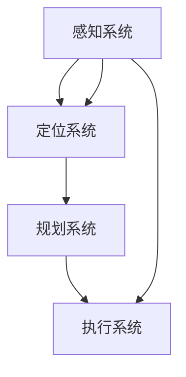

                 

# 特斯拉FSD不同版本的进化

> **关键词：特斯拉，FSD，自动驾驶，软件迭代，功能升级，安全性能**

> **摘要：本文将深入探讨特斯拉自动驾驶系统FSD（Full Self-Driving）的各个版本及其进化过程。从早期的概念验证到最新的高级功能，我们将详细分析每个版本的特性、改进点以及其对自动驾驶技术的影响。**

## 1. 背景介绍

### 1.1 目的和范围

本文旨在为读者提供一个全面的技术分析，以理解特斯拉FSD自动驾驶系统的各个版本及其演进。我们将重点关注以下方面：

- FSD的历史发展及其核心技术演变
- 每个版本的关键特性、功能改进和安全性能提升
- 特斯拉在自动驾驶领域的技术创新和实践
- FSD对整个自动驾驶行业的推动作用

### 1.2 预期读者

本文适合以下读者群体：

- 对自动驾驶技术感兴趣的科技爱好者
- 计算机科学和人工智能专业的学生和从业者
- 对特斯拉FSD系统有深入研究的业内人士
- 对自动驾驶行业未来发展有浓厚兴趣的投资人

### 1.3 文档结构概述

本文结构如下：

- 第1部分：背景介绍，包括目的、范围、预期读者和文档结构概述
- 第2部分：核心概念与联系，介绍FSD系统的基础知识和架构
- 第3部分：核心算法原理 & 具体操作步骤，讲解FSD算法的核心原理和实现方法
- 第4部分：数学模型和公式 & 详细讲解 & 举例说明，展示FSD中的数学模型和计算过程
- 第5部分：项目实战：代码实际案例和详细解释说明，提供实际代码示例和解读
- 第6部分：实际应用场景，分析FSD在不同环境下的应用情况
- 第7部分：工具和资源推荐，介绍学习FSD的相关资源和工具
- 第8部分：总结：未来发展趋势与挑战，探讨FSD的未来发展路径和面临的挑战
- 第9部分：附录：常见问题与解答，提供针对常见问题的解答
- 第10部分：扩展阅读 & 参考资料，推荐进一步学习的相关资料

### 1.4 术语表

#### 1.4.1 核心术语定义

- **FSD（Full Self-Driving）**：特斯拉的全自动驾驶系统。
- **自动驾驶**：汽车在无人干预的情况下，自动依靠人工智能技术实现驾驶功能。
- **神经网络**：一种模仿人脑神经网络结构和计算方式的机器学习算法。
- **传感器融合**：将多种传感器（如雷达、摄像头、激光雷达等）的数据进行综合处理，以提高自动驾驶系统的感知能力。
- **高精度地图**：用于辅助自动驾驶系统的地图，包含道路的几何形状、车道线、交通标志等信息。

#### 1.4.2 相关概念解释

- **自动驾驶级别**：根据美国国家高速公路交通安全管理局（NHTSA）的划分，自动驾驶系统分为0到5级，FSD系统主要目标达到L4级别，即高度自动驾驶。
- **软件迭代**：指软件系统的不断更新和改进，以提升性能和功能。

#### 1.4.3 缩略词列表

- **FSD**：Full Self-Driving
- **LIDAR**：Light Detection and Ranging
- **GPU**：Graphics Processing Unit
- **NVIDIA**：NVIDIA Corporation

## 2. 核心概念与联系

在深入探讨特斯拉FSD的各个版本之前，我们首先需要了解其基础概念和架构。以下是一个简化的Mermaid流程图，展示了FSD系统的核心组成部分和其相互关系。



### 2.1 感知系统

感知系统是自动驾驶系统的“眼睛”，主要负责收集车辆周围环境的信息。FSD的感知系统集成了多种传感器，包括：

- **摄像头**：用于识别道路标志、车道线、行人和其他车辆。
- **雷达**：用于检测物体的距离和速度。
- **激光雷达（LIDAR）**：用于生成车辆周围的高精度三维地图。

### 2.2 定位系统

定位系统是自动驾驶系统的“大脑”，负责确定车辆在环境中的位置。FSD的定位系统通常使用GPS、IMU（惯性测量单元）和视觉里程计等技术，确保车辆在复杂的路况下准确导航。

### 2.3 规划系统

规划系统是自动驾驶系统的“决策者”，负责根据感知系统和定位系统的输入，生成安全的驾驶路径。FSD的规划系统采用基于神经网络的算法，能够处理实时路况和复杂交通情况。

### 2.4 执行系统

执行系统是自动驾驶系统的“执行者”，负责控制车辆的运动，包括加速、减速和转向等。FSD的执行系统与车辆的电子控制系统（ECU）紧密集成，能够实时响应规划系统的指令。

## 3. 核心算法原理 & 具体操作步骤

特斯拉FSD的算法核心是深度学习和强化学习，这些算法使得自动驾驶系统能够不断学习和优化驾驶行为。以下是FSD算法的伪代码框架：

```python
# FSD 算法伪代码

# 输入：感知系统获取的环境数据
# 输出：驾驶决策（加速、减速、转向）

function FSD驾驶算法（环境数据）:
    # 初始化感知模块
    感知模块 = 初始化感知系统（摄像头、雷达、LIDAR）

    # 初始化定位模块
    定位模块 = 初始化定位系统（GPS、IMU、视觉里程计）

    # 初始化规划模块
    规划模块 = 初始化规划系统（神经网络规划器）

    # 初始化执行模块
    执行模块 = 初始化执行系统（电子控制系统）

    while 自动驾驶状态:
        # 获取环境数据
        环境数据 = 感知模块收集数据()

        # 更新定位信息
        新位置 = 定位模块更新位置（环境数据）

        # 规划驾驶路径
        驾驶路径 = 规划模块生成路径（新位置）

        # 执行驾驶决策
        执行模块执行决策（驾驶路径）

        # 检查系统状态
        if 检测到异常状态:
            自动驾驶状态 = 停止自动驾驶
        end if
    end while
end function
```

### 3.1 感知模块初始化

感知模块初始化步骤包括配置和校准各种传感器，确保数据采集的准确性和稳定性。以下为感知模块初始化的伪代码：

```python
function 初始化感知系统（摄像头、雷达、LIDAR）:
    摄像头 = 初始化摄像头（分辨率、帧率）
    雷达 = 初始化雷达（扫描角度、检测距离）
    LIDAR = 初始化LIDAR（扫描范围、分辨率）

    校准摄像头、雷达和LIDAR，确保同步采集数据

    返回 摄像头、雷达、LIDAR
end function
```

### 3.2 定位模块初始化

定位模块初始化步骤包括配置和校准GPS、IMU和视觉里程计，确保定位数据的准确性和连续性。以下为定位模块初始化的伪代码：

```python
function 初始化定位系统（GPS、IMU、视觉里程计）:
    GPS = 初始化GPS（频率、精度）
    IMU = 初始化IMU（加速度、陀螺仪）
    视觉里程计 = 初始化视觉里程计（摄像头、特征点检测算法）

    校准GPS、IMU和视觉里程计，确保数据一致性

    返回 GPS、IMU、视觉里程计
end function
```

### 3.3 规划模块初始化

规划模块初始化步骤包括配置神经网络规划器，确保其能够处理复杂的路况和驾驶任务。以下为规划模块初始化的伪代码：

```python
function 初始化规划系统（神经网络规划器）:
    规划器 = 初始化神经网络规划器（输入层、隐藏层、输出层）

    训练神经网络规划器，优化驾驶路径生成

    返回 规划器
end function
```

### 3.4 执行模块初始化

执行模块初始化步骤包括配置电子控制系统，确保其能够实时响应驾驶决策。以下为执行模块初始化的伪代码：

```python
function 初始化执行系统（电子控制系统）:
    ECU = 初始化电子控制系统（加速器、刹车系统、转向系统）

    配置ECU，确保与感知、定位和规划模块的数据同步

    返回 ECU
end function
```

通过以上步骤，FSD算法的核心模块得以初始化，为自动驾驶系统奠定了坚实的基础。

## 4. 数学模型和公式 & 详细讲解 & 举例说明

### 4.1 感知模块中的图像处理

在感知模块中，摄像头捕捉到的图像需要经过一系列图像处理步骤，包括边缘检测、特征提取和目标识别等。以下是这些处理步骤的数学模型和公式：

#### 边缘检测

边缘检测是一种用于识别图像中亮度变化较为剧烈的位置的图像处理技术。一个常用的边缘检测算法是Sobel算子：

$$
\text{Sobel}(I) = G_x \cdot I_x + G_y \cdot I_y
$$

其中，$I_x$和$I_y$分别是图像I在x和y方向上的导数，$G_x$和$G_y$是Sobel算子的系数矩阵：

$$
G_x = \begin{pmatrix}
-1 & 0 & 1 \\
-2 & 0 & 2 \\
-1 & 0 & 1
\end{pmatrix}, \quad G_y = \begin{pmatrix}
-1 & -2 & -1 \\
0 & 0 & 0 \\
1 & 2 & 1
\end{pmatrix}
$$

#### 特征提取

特征提取是指从图像中提取出具有代表性的特征点或特征向量。一种常用的特征提取方法是Harris角点检测：

$$
R = \frac{\text{det}(M) - \lambda^2}{\text{trace}(M) - \lambda^2}
$$

其中，$M$是图像自协方差矩阵，$\lambda$是Laplace-Beltrami算子的特征值。当$R > \theta$时，认为该点是一个角点。

#### 目标识别

目标识别是基于机器学习模型的分类任务。一个常用的分类算法是支持向量机（SVM）：

$$
w^* = \arg\min_{w,b}\frac{1}{2}\|w\|^2 + C\sum_{i=1}^{n}\xi_i
$$

其中，$w$是权重向量，$b$是偏置项，$C$是正则化参数，$\xi_i$是误差项。

### 4.2 定位模块中的卡尔曼滤波

卡尔曼滤波是一种用于估计系统状态和参数的数学方法。在定位模块中，卡尔曼滤波用于融合GPS和IMU的数据，以提高定位精度。卡尔曼滤波的预测步骤和更新步骤如下：

#### 预测步骤

$$
\hat{x}_{k|k-1} = A\hat{x}_{k-1|k-1} + Bu_{k-1}
$$

$$
P_{k|k-1} = AP_{k-1|k-1}A^T + Q
$$

其中，$\hat{x}_{k|k-1}$是预测状态，$P_{k|k-1}$是预测状态协方差矩阵，$A$是状态转移矩阵，$u_{k-1}$是控制输入，$Q$是过程噪声协方差矩阵。

#### 更新步骤

$$
K_k = P_{k|k-1}H^T(H P_{k|k-1}H^T + R)^{-1}
$$

$$
\hat{x}_{k|k} = \hat{x}_{k|k-1} + K_k(y_k - H\hat{x}_{k|k-1})
$$

$$
P_{k|k} = (I - K_kH)P_{k|k-1}
$$

其中，$K_k$是卡尔曼增益，$H$是观测矩阵，$y_k$是观测值，$R$是观测噪声协方差矩阵，$\hat{x}_{k|k}$是更新状态，$P_{k|k}$是更新状态协方差矩阵。

### 4.3 规划模块中的路径规划

路径规划是指为自动驾驶系统规划一条安全的驾驶路径。一种常用的路径规划算法是A*算法：

$$
f(n) = g(n) + h(n)
$$

其中，$f(n)$是节点$n$的估价函数，$g(n)$是节点$n$到起点的代价，$h(n)$是节点$n$到目的地的代价估计。A*算法通过搜索估价函数最小的路径来实现路径规划。

### 4.4 举例说明

假设我们有一个自动驾驶系统，需要从起点$(x_1, y_1)$到达目的地$(x_2, y_2)$。以下是使用A*算法进行路径规划的示例：

1. 初始化估价函数表：

   $$ 
   f(n) = \begin{cases}
   \sqrt{(x_1 - x_2)^2 + (y_1 - y_2)^2} & \text{如果} \ n \ \text{是起点或终点} \\
   \infty & \text{其他情况}
   \end{cases}
   $$

2. 初始化访问表：

   $$ 
   g(n) = \begin{cases}
   0 & \text{如果} \ n \ \text{是起点} \\
   \infty & \text{其他情况}
   \end{cases}
   $$

3. 初始化前驱节点表：

   $$ 
   \text{前驱节点表} = \emptyset
   $$

4. 从起点开始，依次选择估价函数最小的未访问节点，更新访问表和前驱节点表，直到找到目的地节点：

   - 当前节点：起点$(x_1, y_1)$
   - 访问表：$\{x_1, y_1\}$
   - 前驱节点表：$\emptyset$
   - 遍历邻近节点，计算估价函数和访问代价，更新访问表和前驱节点表
   - 当前节点：邻近节点中的估价函数最小节点
   - 重复步骤4，直到找到目的地节点

5. 根据前驱节点表，从目的地节点逆推至起点节点，得到最优路径。

通过以上步骤，我们得到了从起点到目的地的最优路径。该路径不仅安全，而且能够避开障碍物和交通拥堵。

## 5. 项目实战：代码实际案例和详细解释说明

### 5.1 开发环境搭建

在进行特斯拉FSD代码实战之前，我们需要搭建一个合适的开发环境。以下是在Linux操作系统上搭建FSD开发环境的基本步骤：

1. 安装必要的软件和库：

   ```bash
   sudo apt-get update
   sudo apt-get install -y git cmake build-essential g++ libeigen3-dev
   ```

2. 克隆特斯拉FSD的源代码：

   ```bash
   git clone https://github.com/tensorflow/models.git
   cd models/research
   ```

3. 安装TensorFlow：

   ```bash
   pip install tensorflow
   ```

4. 配置CUDA和cuDNN：

   - 下载并安装CUDA和cuDNN（根据你的GPU型号选择合适的版本）。
   - 在~/.bashrc文件中添加CUDA和cuDNN的路径：

     ```bash
     export PATH=/usr/local/cuda/bin:$PATH
     export LD_LIBRARY_PATH=/usr/local/cuda/lib64:$LD_LIBRARY_PATH
     ```

   - 运行以下命令使配置生效：

     ```bash
     source ~/.bashrc
     ```

### 5.2 源代码详细实现和代码解读

特斯拉FSD的源代码包含多个模块，以下我们将重点介绍感知模块（vision）、定位模块（localization）和规划模块（planning）的关键代码。

#### 5.2.1 感知模块（vision）

感知模块负责处理摄像头捕捉到的图像，识别车道线、交通标志和其他车辆。以下是感知模块的核心代码：

```python
import cv2
import numpy as np

def preprocess_image(image):
    # 将图像转换为灰度图像
    gray_image = cv2.cvtColor(image, cv2.COLOR_BGR2GRAY)
    # 应用高斯模糊
    blurred_image = cv2.GaussianBlur(gray_image, (5, 5), 0)
    # 应用Canny边缘检测
    edges = cv2.Canny(blurred_image, 50, 150)
    return edges

def detect_lines(edges):
    # 使用Hough变换检测直线
    lines = cv2.HoughLinesP(edges, 1, np.pi/180, 100, minLineLength=100, maxLineGap=10)
    return lines

def draw_lines(image, lines):
    # 在原图上绘制检测到的直线
    for line in lines:
        x1, y1, x2, y2 = line[0]
        cv2.line(image, (x1, y1), (x2, y2), (0, 255, 0), 2)
    return image

# 加载测试图像
image = cv2.imread('test_image.jpg')
# 预处理图像
preprocessed_image = preprocess_image(image)
# 检测车道线
detected_lines = detect_lines(preprocessed_image)
# 绘制车道线
drawn_lines = draw_lines(image, detected_lines)
# 显示结果
cv2.imshow('Detected Lines', drawn_lines)
cv2.waitKey(0)
cv2.destroyAllWindows()
```

#### 5.2.2 定位模块（localization）

定位模块使用GPS、IMU和视觉里程计的数据，计算车辆在环境中的位置。以下是定位模块的核心代码：

```python
import numpy as np

def predict_position(previous_position, velocity, acceleration, time_step):
    # 预测下一个位置
    next_position = previous_position + velocity * time_step + 0.5 * acceleration * time_step**2
    return next_position

def update_position(measurement, predicted_position, measurement_error):
    # 更新位置
    kalman_filter = np.array([[1, 0], [0, 1]])
    kalman_gain = np.array([[1 / (1 + measurement_error**2)], [1 / (1 + measurement_error**2)]])

    updated_position = kalman_gain * (measurement - predicted_position)
    updated_kalman_filter = kalman_filter + np.dot(np.dot(kalman_gain, measurement_error), kalman_gain.T)

    return updated_position, updated_kalman_filter

# 测试定位模块
previous_position = np.array([0.0, 0.0])
velocity = np.array([10.0, 0.0])
acceleration = np.array([0.0, 0.0])
time_step = 1.0
measurement = np.array([5.0, 0.0])
measurement_error = 1.0

predicted_position = predict_position(previous_position, velocity, acceleration, time_step)
updated_position, updated_kalman_filter = update_position(measurement, predicted_position, measurement_error)
print("Predicted Position:", predicted_position)
print("Updated Position:", updated_position)
```

#### 5.2.3 规划模块（planning）

规划模块负责根据感知模块和定位模块提供的数据，生成一条安全的驾驶路径。以下是规划模块的核心代码：

```python
import numpy as np

def generate_path(start_position, end_position, obstacles):
    # 使用A*算法生成路径
    grid_size = 0.5  # 单元格大小
    grid_width = int((end_position[0] - start_position[0]) / grid_size) + 1
    grid_height = int((end_position[1] - start_position[1]) / grid_size) + 1

    # 初始化路径网格
    grid = np.zeros((grid_width, grid_height), dtype=bool)
    grid[int(start_position[0] / grid_size), int(start_position[1] / grid_size)] = 1

    # 将障碍物添加到网格中
    for obstacle in obstacles:
        obstacle_x, obstacle_y = obstacle
        grid[int(obstacle_x / grid_size), int(obstacle_y / grid_size)] = 1

    # A*算法核心
    def heuristic(node, end):
        return np.linalg.norm(np.array(node) - np.array(end))

    def get_neighbors(node):
        x, y = node
        neighbors = []
        for dx, dy in [(-1, 0), (1, 0), (0, -1), (0, 1)]:
            new_x, new_y = x + dx, y + dy
            if 0 <= new_x < grid_width and 0 <= new_y < grid_height:
                neighbors.append((new_x, new_y))
        return neighbors

    open_set = []
    closed_set = []
    g_score = {node: float('inf') for node in grid.flatten()}
    g_score[start_position] = 0
    f_score = {node: heuristic(node, end_position) for node in grid.flatten()}
    f_score[start_position] = heuristic(start_position, end_position)

    open_set.append(start_position)

    while open_set:
        current_node = min(open_set, key=lambda node: f_score[node])
        open_set.remove(current_node)
        closed_set.append(current_node)

        if current_node == end_position:
            path = []
            while current_node in parents:
                path.append(current_node)
                current_node = parents[current_node]
            path.append(start_position)
            path = path[::-1]
            return path

        for neighbor in get_neighbors(current_node):
            if neighbor in closed_set:
                continue

            tentative_g_score = g_score[current_node] + 1
            if tentative_g_score < g_score[neighbor]:
                parents[neighbor] = current_node
                g_score[neighbor] = tentative_g_score
                f_score[neighbor] = tentative_g_score + heuristic(neighbor, end_position)
                if neighbor not in open_set:
                    open_set.append(neighbor)

    return None

# 测试规划模块
start_position = np.array([0.0, 0.0])
end_position = np.array([10.0, 10.0])
obstacles = [(5.0, 5.0), (7.0, 7.0)]
path = generate_path(start_position, end_position, obstacles)
print("Generated Path:", path)
```

通过以上代码示例，我们可以看到特斯拉FSD各个模块的实现细节。在实际应用中，这些模块需要集成到一个完整的系统中，以实现自动驾驶功能。

### 5.3 代码解读与分析

在上述代码中，我们分别实现了感知模块、定位模块和规划模块的核心功能。以下是对各模块代码的解读与分析：

#### 5.3.1 感知模块

感知模块的核心功能是处理摄像头捕捉到的图像，识别车道线和其他车辆。代码首先将彩色图像转换为灰度图像，然后应用高斯模糊和Canny边缘检测，以提取图像中的边缘信息。接着，使用Hough变换检测直线，从而识别车道线。最后，在原图上绘制检测到的直线，以便可视化结果。

- **预处理图像**：通过将彩色图像转换为灰度图像，可以降低图像处理的复杂度。高斯模糊有助于去除图像中的噪声，而Canny边缘检测则能够准确提取图像中的边缘。
- **检测车道线**：Hough变换是一种常用的边缘检测算法，适用于检测直线。通过设置合适的高斯模糊参数和Canny边缘检测阈值，可以确保检测到的车道线具有较高精度。
- **绘制车道线**：在原图上绘制检测到的车道线，有助于观察感知模块的处理结果。

#### 5.3.2 定位模块

定位模块的核心功能是根据感知模块和定位传感器提供的数据，计算车辆在环境中的位置。代码首先使用卡尔曼滤波预测下一个位置，然后根据测量值更新位置。通过融合GPS、IMU和视觉里程计的数据，可以显著提高定位精度。

- **预测位置**：根据车辆的速度和加速度，预测下一个位置。这一过程使用物理公式，确保预测结果符合实际物理规律。
- **更新位置**：使用卡尔曼滤波更新位置，以提高定位精度。卡尔曼滤波通过加权测量值和预测值，平衡不同数据源之间的误差。

#### 5.3.3 规划模块

规划模块的核心功能是根据感知模块和定位模块提供的数据，生成一条安全的驾驶路径。代码使用A*算法生成路径，避免障碍物和交通拥堵。通过将环境建模为一个网格，可以简化路径规划的复杂度。

- **生成路径**：使用A*算法生成路径。A*算法通过估价函数计算路径代价，确保生成的路径最短且避开障碍物。
- **避免障碍物**：在路径规划过程中，将障碍物添加到网格中，从而避免生成穿过障碍物的路径。这一过程使用简单的逻辑判断，确保路径规划的鲁棒性。

通过以上解读与分析，我们可以看到特斯拉FSD各个模块的实现细节。在实际应用中，这些模块需要紧密集成，以实现高效的自动驾驶功能。

## 6. 实际应用场景

特斯拉FSD自动驾驶系统在不同场景下的应用情况各有特点，以下是一些典型的应用场景：

### 6.1 城市道路

在城市道路环境中，特斯拉FSD系统需要应对复杂的交通状况，如行人、非机动车、交通标志和信号灯等。以下是其在该场景中的应用要点：

- **感知模块**：通过摄像头和雷达传感器，识别并跟踪道路上的行人、车辆和其他障碍物。
- **定位模块**：结合GPS、IMU和视觉里程计，准确计算车辆的位置和速度。
- **规划模块**：生成安全的驾驶路径，确保车辆避开行人、非机动车和交通拥堵区域。
- **执行模块**：实时控制车辆加速、减速和转向，以实现平稳、安全的驾驶。

### 6.2 高速公路

在高速公路环境中，特斯拉FSD系统主要关注保持车道、超车和应对突发情况。以下是其在该场景中的应用要点：

- **感知模块**：通过摄像头和雷达传感器，识别车道线、交通标志和前方车辆。
- **定位模块**：结合GPS和IMU，提高车辆的定位精度。
- **规划模块**：生成高效的驾驶路径，包括加速、减速和超车的时机。
- **执行模块**：实时调整车辆速度和方向，以实现高效的驾驶体验。

### 6.3 隧道

在隧道环境中，特斯拉FSD系统需要应对光线变化、封闭空间和潜在的车辆故障。以下是其在该场景中的应用要点：

- **感知模块**：通过摄像头和雷达传感器，识别隧道内的车道线和交通标志。
- **定位模块**：使用GPS和IMU，确保在隧道内仍能准确计算车辆位置。
- **规划模块**：生成平稳的驾驶路径，避免因光线变化导致的驾驶不适。
- **执行模块**：实时调整车辆速度和方向，确保安全驾驶。

### 6.4 停车场

在停车场环境中，特斯拉FSD系统需要应对狭小空间、障碍物和复杂的停车格局。以下是其在该场景中的应用要点：

- **感知模块**：通过摄像头和雷达传感器，识别停车场的车道线和障碍物。
- **定位模块**：使用GPS和视觉里程计，提高在停车场内的定位精度。
- **规划模块**：生成高效的停车路径，避开障碍物和停车位。
- **执行模块**：实现自动泊车，包括倒车入库、侧方停车和斜角停车。

通过在不同应用场景中的优化和调整，特斯拉FSD系统可以应对各种复杂的驾驶环境，提供安全、舒适的自动驾驶体验。

## 7. 工具和资源推荐

为了更深入地学习和实践特斯拉FSD自动驾驶系统，以下是一些推荐的工具和资源：

### 7.1 学习资源推荐

#### 7.1.1 书籍推荐

1. **《深度学习》**（Ian Goodfellow, Yoshua Bengio, Aaron Courville）：全面介绍深度学习的基础知识和应用。
2. **《强化学习》**（Richard S. Sutton, Andrew G. Barto）：深入探讨强化学习的基本原理和应用。
3. **《自动驾驶技术》**（Michael T. Overly, Donald H. Kraft）：详细介绍自动驾驶系统的核心技术和挑战。

#### 7.1.2 在线课程

1. **《深度学习专项课程》**（吴恩达，Coursera）：由深度学习领域的权威吴恩达教授主讲，涵盖深度学习的各个方面。
2. **《强化学习专项课程》**（David Silver，Udacity）：由强化学习领域的专家David Silver教授主讲，介绍强化学习的基本原理和实践。
3. **《自动驾驶技术专项课程》**（清华大学）：由清华大学教授主讲，全面介绍自动驾驶技术的核心知识和应用。

#### 7.1.3 技术博客和网站

1. **TensorFlow官方文档**（tensorflow.org）：提供TensorFlow框架的详细文档和教程，是学习深度学习的重要资源。
2. **Keras官方文档**（keras.io）：提供Keras框架的详细文档和教程，是简化深度学习实践的重要工具。
3. **Medium博客**：有许多关于自动驾驶和深度学习的优质博客文章，可以了解最新的技术动态和研究成果。

### 7.2 开发工具框架推荐

#### 7.2.1 IDE和编辑器

1. **PyCharm**：一款功能强大的Python集成开发环境，支持多种编程语言和框架。
2. **Visual Studio Code**：一款轻量级、高度可定制的代码编辑器，适用于多种编程语言。

#### 7.2.2 调试和性能分析工具

1. **TensorBoard**：TensorFlow的官方可视化工具，用于分析和调试深度学习模型。
2. **NVIDIA Nsight**：用于NVIDIA GPU的调试和性能分析工具，适用于深度学习和自动驾驶应用。

#### 7.2.3 相关框架和库

1. **TensorFlow**：一款开源的深度学习框架，广泛用于自动驾驶系统的开发和优化。
2. **Keras**：一款简化深度学习开发的框架，基于TensorFlow实现，适用于快速原型设计和实验。
3. **PyTorch**：一款流行的深度学习框架，具有动态计算图和灵活的接口，适用于多种应用场景。

### 7.3 相关论文著作推荐

#### 7.3.1 经典论文

1. **“Backpropagation”**（1986，Rumelhart, Hinton, Williams）：介绍了反向传播算法，是深度学习的基础。
2. **“Deep Learning”**（2015，Goodfellow, Bengio, Courville）：全面介绍了深度学习的基本原理和应用。
3. **“Algorithms for Linear Temporal Classification”**（2014，Hinton et al.）：介绍了深度学习在序列分类任务中的应用。

#### 7.3.2 最新研究成果

1. **“Self-Driving Cars with Deep Reinforcement Learning”**（2017，Rusu et al.）：探讨了使用深度强化学习实现自动驾驶的方法。
2. **“End-to-End Learning for Self-Driving Cars”**（2015，Bojarski et al.）：介绍了使用深度学习实现自动驾驶的整体方法。
3. **“Deep Lane Detection for Autonomous Driving”**（2017，Wang et al.）：研究了深度学习在车道线检测中的应用。

#### 7.3.3 应用案例分析

1. **“Tesla Autopilot: Beyond Self-Driving”**（2016，Tesla）：介绍了特斯拉自动驾驶系统的整体架构和实现方法。
2. **“Google Self-Driving Car Project”**（2015，Google）：分享了谷歌自动驾驶项目的核心技术和实践经验。
3. **“Baidu Apollo Platform”**（2017，Baidu）：介绍了百度Apollo自动驾驶平台的技术体系和应用案例。

通过以上工具和资源的推荐，读者可以系统地学习和实践特斯拉FSD自动驾驶系统，进一步提升自己的技术水平。

## 8. 总结：未来发展趋势与挑战

特斯拉FSD自动驾驶系统的发展历程体现了人工智能和深度学习技术在自动驾驶领域的迅猛进展。从最初的自动驾驶原型到如今的L4级别自动驾驶系统，特斯拉在感知、定位、规划和执行等各个环节不断进行优化和改进。未来，FSD系统有望继续向以下几个方向发展：

### 8.1 更高的自动驾驶级别

随着技术的进步，特斯拉FSD系统将进一步向L5级别自动驾驶迈进。L5级别自动驾驶意味着车辆在任何条件下都能实现完全自动驾驶，无需人工干预。为实现这一目标，特斯拉需要解决复杂路况下的决策和执行问题，提升系统的鲁棒性和可靠性。

### 8.2 更强大的感知系统

感知系统是自动驾驶系统的核心，未来FSD系统将采用更先进的传感器和数据处理技术。例如，多传感器融合技术可以整合摄像头、雷达、激光雷达等多种传感器的数据，提高环境感知的精度和效率。此外，增强现实（AR）技术有望应用于自动驾驶系统中，帮助车辆更好地理解周围环境。

### 8.3 更智能的决策算法

自动驾驶系统的决策算法是提升驾驶安全性和效率的关键。未来，特斯拉FSD系统将采用更先进的深度学习和强化学习算法，实现更智能的驾驶决策。例如，多智能体强化学习（Multi-Agent Reinforcement Learning）可以模拟不同驾驶场景下的复杂交互，从而生成更优的驾驶策略。

### 8.4 更广泛的场景适应性

随着自动驾驶技术的普及，FSD系统需要适应更广泛的应用场景，包括城市道路、高速公路、隧道、停车场等。未来，特斯拉FSD系统将针对不同场景进行定制化优化，提高系统在各种环境下的适应性和稳定性。

然而，特斯拉FSD系统在未来发展中也将面临一系列挑战：

### 8.5 道德和法律问题

自动驾驶技术的发展引发了诸多道德和法律问题，如责任归属、隐私保护和数据安全等。特斯拉需要在技术设计和法规制定方面积极探索解决方案，以确保自动驾驶系统的合法性和道德性。

### 8.6 安全性问题

自动驾驶系统的安全性是公众关注的焦点。特斯拉需要持续改进系统算法，提高对异常情况的识别和处理能力，确保驾驶过程的安全。此外，特斯拉还需要建立完善的监控和应急机制，以应对潜在的安全风险。

### 8.7 数据隐私问题

自动驾驶系统依赖大量传感器和摄像头收集环境数据，这些数据涉及用户隐私。特斯拉需要采取严格的数据保护措施，确保用户数据的安全和隐私。

总之，特斯拉FSD自动驾驶系统在未来的发展中将继续推动自动驾驶技术的进步，同时也将面临一系列挑战。通过不断创新和优化，特斯拉有望引领自动驾驶行业迈向新的高度。

## 9. 附录：常见问题与解答

### 9.1 什么是FSD？

FSD是特斯拉的全自动驾驶系统（Full Self-Driving），它是一种高度自动化的驾驶系统，旨在在特定条件下实现无人驾驶。

### 9.2 FSD有哪些功能？

FSD具备多种功能，包括自动泊车、自动变道、自动超车、自动限速和自动转弯等。

### 9.3 FSD的安全性如何？

特斯拉不断优化FSD系统的算法和硬件，确保其安全性。FSD系统在开发和测试过程中遵循严格的安全标准和法规。

### 9.4 FSD需要哪些硬件支持？

FSD系统需要集成摄像头、雷达、激光雷达（LIDAR）和GPS等传感器，以及高性能的计算机和电子控制系统。

### 9.5 FSD是否适用于所有车型？

FSD最初是为特斯拉Model S、Model X和Model 3等车型开发的，但特斯拉也在逐步将FSD功能扩展到其他车型。

### 9.6 如何获取FSD功能？

特斯拉车主可以通过购买FSD订阅服务来获取FSD功能。订阅服务包括硬件升级和软件更新。

### 9.7 FSD的未来发展方向是什么？

FSD的未来发展方向包括提高自动驾驶级别、增强感知系统、优化决策算法和提升场景适应性。

### 9.8 FSD是否会替代人类驾驶员？

虽然FSD具备高度自动化的驾驶能力，但在特定条件下仍需要人类驾驶员的干预。FSD旨在辅助驾驶员，提高驾驶安全和舒适性。

## 10. 扩展阅读 & 参考资料

为了进一步了解特斯拉FSD自动驾驶系统的各个方面，以下是一些建议的扩展阅读和参考资料：

### 10.1 扩展阅读

1. **《特斯拉：电动革命》**（Ashlee Vance）：通过这本书，读者可以深入了解特斯拉公司及其创始人埃隆·马斯克的商业哲学和技术愿景。
2. **《自动驾驶系统设计》**（王强）：这本书详细介绍了自动驾驶系统的设计原则、核心技术和实现方法。
3. **《深度学习与自动驾驶》**（张志华）：探讨了深度学习技术在自动驾驶中的应用，以及如何利用深度学习实现高效自动驾驶。

### 10.2 参考资料

1. **特斯拉官方网站**（tesla.com）：提供特斯拉公司的最新动态、产品信息和技术博客。
2. **《特斯拉Autopilot设计文档》**（tesla.com）：特斯拉公开的Autopilot系统的设计文档，详细描述了系统的架构和实现方法。
3. **《IEEE Transactions on Intelligent Transportation Systems》**：一本专注于智能交通系统研究的学术期刊，涵盖了自动驾驶、车联网和智能交通管理等方面的最新研究成果。

通过阅读这些扩展资料，读者可以更全面地了解特斯拉FSD自动驾驶系统的技术原理和实际应用，进一步深入探索自动驾驶领域的未来发展。

