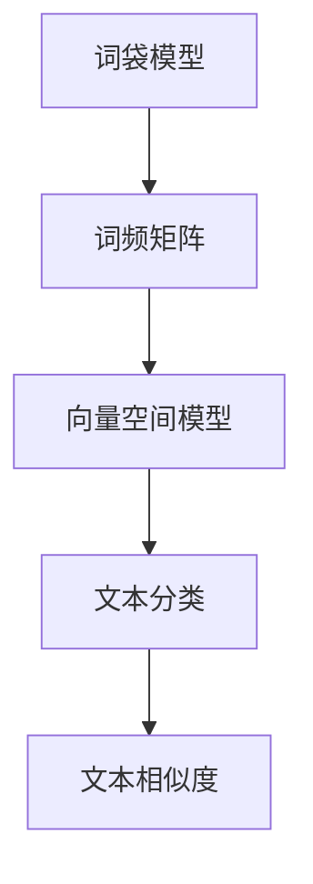
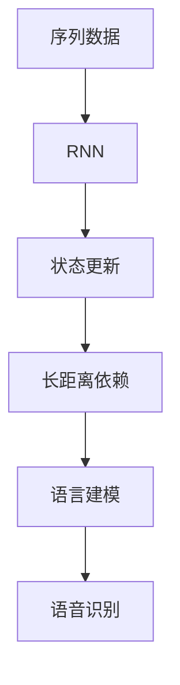
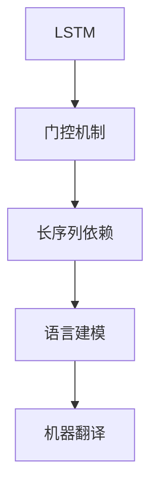
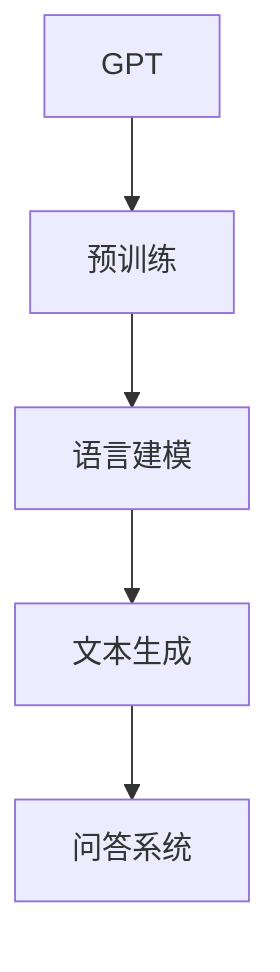

                 

# 现代自然语言处理：从规则到统计

> 关键词：自然语言处理、规则、统计、机器学习、神经网络、文本分析

> 摘要：本文旨在探讨现代自然语言处理（NLP）技术的发展历程，从早期的基于规则的方法到现代基于统计和机器学习的方法。通过详细阐述核心概念、算法原理和实际应用，本文为读者提供了一个全面了解NLP领域发展脉络的视角。

## 1. 背景介绍

### 1.1 目的和范围

本文的目标是介绍现代自然语言处理技术，并探讨其从规则到统计的发展历程。我们将重点关注以下几个方面：

- NLP的核心概念和基础
- 基于规则的方法及其局限性
- 基于统计的方法和算法原理
- 基于机器学习的方法及其在NLP中的应用
- 神经网络在NLP中的角色和贡献

### 1.2 预期读者

本文适合以下读者：

- 对自然语言处理感兴趣的技术爱好者
- 数据科学和机器学习从业者
- 计算机科学和人工智能专业学生
- 对NLP技术有深入研究的学者和研究人员

### 1.3 文档结构概述

本文的结构如下：

1. **背景介绍**：介绍本文的目的、范围、预期读者和文档结构。
2. **核心概念与联系**：介绍NLP的核心概念和原理，并使用Mermaid流程图进行说明。
3. **核心算法原理与具体操作步骤**：详细阐述基于规则和统计的NLP算法原理和操作步骤。
4. **数学模型和公式**：介绍NLP中的数学模型和公式，并进行举例说明。
5. **项目实战**：通过实际代码案例，展示NLP算法的具体应用。
6. **实际应用场景**：分析NLP技术在各个领域的应用。
7. **工具和资源推荐**：推荐学习资源和开发工具。
8. **总结**：展望NLP技术的未来发展趋势和挑战。
9. **附录**：提供常见问题与解答。
10. **扩展阅读与参考资料**：提供进一步阅读的建议。

### 1.4 术语表

#### 1.4.1 核心术语定义

- 自然语言处理（NLP）：对自然语言进行计算机处理和理解的技术。
- 基于规则的方法：使用预定义的规则进行文本分析和处理的方法。
- 统计方法：使用统计模型和算法进行文本分析和处理的方法。
- 机器学习：一种从数据中自动学习规律和模式的方法。
- 神经网络：一种由大量神经元组成的计算模型。

#### 1.4.2 相关概念解释

- 词袋模型：一种将文本表示为词频向量的方法。
- 递归神经网络（RNN）：一种能够处理序列数据的神经网络。
- 长短期记忆网络（LSTM）：一种改进的RNN，能够更好地处理长序列依赖。

#### 1.4.3 缩略词列表

- NLP：自然语言处理
- ML：机器学习
- RNN：递归神经网络
- LSTM：长短期记忆网络
- BERT：双向编码表示器
- GPT：生成预训练网络

## 2. 核心概念与联系

为了更好地理解自然语言处理，我们需要首先了解其核心概念和原理。以下是NLP中一些关键的概念和它们之间的联系：

### 2.1. 词袋模型

词袋模型（Bag-of-Words, BoW）是NLP中最基本的模型之一。它将文本表示为词频向量，忽略了单词的顺序和语法结构。词袋模型的核心概念是将文档表示为词频矩阵，其中每个行代表一个单词，每个列代表一个文档。



### 2.2. 递归神经网络

递归神经网络（Recurrent Neural Network, RNN）是一种能够处理序列数据的神经网络。RNN通过在时间步上递归地更新其状态，可以捕捉序列中的长距离依赖关系。



### 2.3. 长短期记忆网络

长短期记忆网络（Long Short-Term Memory, LSTM）是RNN的一种改进，能够更好地处理长序列依赖。LSTM通过引入门控机制，有效地解决了传统RNN在处理长序列时遇到的梯度消失和梯度爆炸问题。



### 2.4. 生成预训练网络

生成预训练网络（Generative Pre-trained Transformer, GPT）是一种基于Transformer架构的预训练语言模型。GPT通过在大量文本上进行预训练，可以生成与输入文本相似的文本。



通过这些核心概念和联系，我们可以更好地理解自然语言处理的基本原理和技术发展。

## 3. 核心算法原理 & 具体操作步骤

在自然语言处理中，核心算法原理对于理解和实现各种NLP任务至关重要。以下是几种主要的算法原理和它们的操作步骤：

### 3.1. 基于规则的方法

基于规则的方法通过预定义的规则来分析和处理文本。这些规则可以是语法规则、词法规则等，用于识别和分类文本中的实体、关系等。

**具体操作步骤：**

1. **定义规则**：根据任务需求，定义一组规则。例如，用于命名实体识别的规则可能包括匹配特定的单词或词组。
2. **规则匹配**：遍历输入文本，检查每个单词或短语是否符合预定义的规则。
3. **结果输出**：将匹配的实体或关系输出。

**伪代码：**

```python
def rule_based_nlp(input_text, rules):
    entities = []
    for token in input_text:
        for rule in rules:
            if rule.matches(token):
                entities.append(rule.entity)
    return entities
```

### 3.2. 基于统计的方法

基于统计的方法使用统计模型和算法来分析和处理文本。这种方法通常涉及概率模型、隐马尔可夫模型（HMM）等。

**具体操作步骤：**

1. **数据预处理**：对输入文本进行分词、标记等预处理。
2. **特征提取**：从预处理后的文本中提取特征，如词频、词性等。
3. **模型训练**：使用提取的特征训练统计模型，如条件概率模型。
4. **预测**：使用训练好的模型对新的文本进行预测。

**伪代码：**

```python
def statistical_nlp(input_text, model):
    features = extract_features(input_text)
    prediction = model.predict(features)
    return prediction
```

### 3.3. 基于机器学习的方法

基于机器学习的方法使用机器学习算法来自动学习和识别文本中的模式。这种方法通常涉及监督学习和无监督学习。

**具体操作步骤：**

1. **数据准备**：收集和准备用于训练的数据集。
2. **特征提取**：对数据进行特征提取。
3. **模型训练**：使用特征训练机器学习模型。
4. **模型评估**：评估模型的性能，并进行调优。
5. **预测**：使用训练好的模型对新的文本进行预测。

**伪代码：**

```python
def machine_learning_nlp(input_text, model, features_extractor):
    features = features_extractor.extract(input_text)
    prediction = model.predict(features)
    return prediction
```

通过这些算法原理和操作步骤，我们可以更好地理解如何使用不同方法进行自然语言处理。

## 4. 数学模型和公式 & 详细讲解 & 举例说明

在自然语言处理中，数学模型和公式是理解和实现各种任务的关键。以下是几个重要的数学模型和它们的详细讲解及举例说明：

### 4.1. 词袋模型

词袋模型是一种将文本表示为词频向量的方法。词袋模型的核心公式如下：

$$
\textbf{X} = \sum_{i=1}^{n}\textbf{x}_i
$$

其中，$\textbf{X}$ 是词频向量，$\textbf{x}_i$ 是第 $i$ 个单词的词频。

**举例说明：**

假设有一个简单的文本：“The cat sat on the mat。”词袋模型可以表示为以下词频向量：

$$
\textbf{X} = \begin{bmatrix}
1 & 1 & 0 & 0 & 1 \\
0 & 0 & 1 & 0 & 1 \\
\end{bmatrix}
$$

### 4.2. 递归神经网络

递归神经网络（RNN）是一种能够处理序列数据的神经网络。RNN的核心公式如下：

$$
h_t = \sigma(W_h \cdot [h_{t-1}, x_t] + b_h)
$$

其中，$h_t$ 是第 $t$ 个时间步的隐藏状态，$x_t$ 是第 $t$ 个输入，$W_h$ 是权重矩阵，$b_h$ 是偏置，$\sigma$ 是激活函数。

**举例说明：**

假设有一个简单的序列输入：“cat dog bird。”使用RNN进行序列处理，隐藏状态可以表示为：

$$
h_1 = \sigma(W_h \cdot [h_0, x_1] + b_h)
$$
$$
h_2 = \sigma(W_h \cdot [h_1, x_2] + b_h)
$$
$$
h_3 = \sigma(W_h \cdot [h_2, x_3] + b_h)
$$

### 4.3. 长短期记忆网络

长短期记忆网络（LSTM）是一种改进的RNN，能够更好地处理长序列依赖。LSTM的核心公式如下：

$$
i_t = \sigma(W_i \cdot [h_{t-1}, x_t] + b_i)
$$
$$
f_t = \sigma(W_f \cdot [h_{t-1}, x_t] + b_f)
$$
$$
g_t = \tanh(W_g \cdot [h_{t-1}, x_t] + b_g)
$$
$$
o_t = \sigma(W_o \cdot [h_{t-1}, x_t] + b_o)
$$
$$
h_t = o_t \cdot \tanh(f_t \cdot h_{t-1} + i_t \cdot g_t)
$$

其中，$i_t$、$f_t$、$g_t$ 和 $o_t$ 分别是输入门、遗忘门、生成门和输出门的状态，$W_i$、$W_f$、$W_g$ 和 $W_o$ 是权重矩阵，$b_i$、$b_f$、$b_g$ 和 $b_o$ 是偏置。

**举例说明：**

假设有一个简单的序列输入：“cat dog bird。”使用LSTM进行序列处理，隐藏状态可以表示为：

$$
i_1 = \sigma(W_i \cdot [h_0, x_1] + b_i)
$$
$$
f_1 = \sigma(W_f \cdot [h_0, x_1] + b_f)
$$
$$
g_1 = \tanh(W_g \cdot [h_0, x_1] + b_g)
$$
$$
o_1 = \sigma(W_o \cdot [h_0, x_1] + b_o)
$$
$$
h_1 = o_1 \cdot \tanh(f_1 \cdot h_0 + i_1 \cdot g_1)
$$
$$
i_2 = \sigma(W_i \cdot [h_1, x_2] + b_i)
$$
$$
f_2 = \sigma(W_f \cdot [h_1, x_2] + b_f)
$$
$$
g_2 = \tanh(W_g \cdot [h_1, x_2] + b_g)
$$
$$
o_2 = \sigma(W_o \cdot [h_1, x_2] + b_o)
$$
$$
h_2 = o_2 \cdot \tanh(f_2 \cdot h_1 + i_2 \cdot g_2)
$$
$$
i_3 = \sigma(W_i \cdot [h_2, x_3] + b_i)
$$
$$
f_3 = \sigma(W_f \cdot [h_2, x_3] + b_f)
$$
$$
g_3 = \tanh(W_g \cdot [h_2, x_3] + b_g)
$$
$$
o_3 = \sigma(W_o \cdot [h_2, x_3] + b_o)
$$
$$
h_3 = o_3 \cdot \tanh(f_3 \cdot h_2 + i_3 \cdot g_3)
$$

通过这些数学模型和公式，我们可以更好地理解和实现自然语言处理的各种任务。

## 5. 项目实战：代码实际案例和详细解释说明

为了更好地展示自然语言处理技术在实践中的应用，我们将在本节中通过一个实际的项目案例进行详细解释说明。本案例将使用Python编程语言和几个流行的NLP库，如NLTK和spaCy，来演示文本分类任务。

### 5.1 开发环境搭建

在进行项目实战之前，我们需要搭建一个合适的开发环境。以下是所需的步骤：

1. **安装Python**：确保安装了Python 3.7或更高版本。
2. **安装依赖库**：使用pip安装以下库：

```bash
pip install nltk spacy sklearn
```

3. **下载NLP库的数据集**：对于spaCy，我们需要下载相应的语言模型。例如，对于英文，可以使用以下命令：

```bash
python -m spacy download en_core_web_sm
```

### 5.2 源代码详细实现和代码解读

以下是我们的文本分类项目的完整源代码：

```python
import nltk
from nltk.corpus import stopwords
from nltk.tokenize import word_tokenize
from sklearn.feature_extraction.text import TfidfVectorizer
from sklearn.model_selection import train_test_split
from sklearn.naive_bayes import MultinomialNB
from sklearn.metrics import accuracy_score, classification_report
import spacy

# 加载spaCy语言模型
nlp = spacy.load("en_core_web_sm")

# 读取数据集
with open("data/emails.txt", "r") as file:
    emails = file.readlines()

# 分割数据集
train_data, test_data = train_test_split(emails, test_size=0.2, random_state=42)

# 预处理文本
def preprocess_text(text):
    doc = nlp(text.lower())
    tokens = [token.lemma_ for token in doc if not token.is_stop]
    return " ".join(tokens)

train_texts = [preprocess_text(text) for text in train_data]
test_texts = [preprocess_text(text) for text in test_data]

# 提取特征
vectorizer = TfidfVectorizer()
train_features = vectorizer.fit_transform(train_texts)
test_features = vectorizer.transform(test_texts)

# 训练模型
model = MultinomialNB()
model.fit(train_features, train_data)

# 预测
predictions = model.predict(test_features)

# 评估
print("Accuracy:", accuracy_score(test_data, predictions))
print("\nClassification Report:\n", classification_report(test_data, predictions))
```

下面是对代码的详细解读：

1. **导入库**：首先，我们导入了所需的库，包括NLTK、spaCy、scikit-learn等。

2. **加载语言模型**：我们使用spaCy加载了英文语言模型`en_core_web_sm`。

3. **读取数据集**：我们从一个包含电子邮件数据的文本文件中读取数据。数据集应该按照类别进行组织，例如，每个类别下的邮件都保存在单独的行中。

4. **预处理文本**：我们定义了一个`preprocess_text`函数，该函数将文本转换为小写，并使用spaCy进行分词和词性还原。我们还剔除了停用词，以减少噪声。

5. **分割数据集**：我们使用scikit-learn的`train_test_split`函数将数据集分为训练集和测试集。

6. **提取特征**：我们使用TF-IDF向量器（`TfidfVectorizer`）将预处理后的文本转换为特征矩阵。

7. **训练模型**：我们选择了一个朴素贝叶斯分类器（`MultinomialNB`）来训练模型。

8. **预测**：使用训练好的模型对测试集进行预测。

9. **评估**：我们计算了分类的准确率和分类报告，以评估模型的性能。

通过这个实际案例，我们可以看到如何使用基于规则和统计的方法进行文本分类。尽管这是一个简单的例子，但它展示了NLP项目的基本流程和关键步骤。

### 5.3 代码解读与分析

在本节中，我们将对项目中的关键部分进行详细解读和分析：

1. **数据预处理**：
   - **文本转换**：将文本转换为小写有助于统一处理，因为文本的大小写在NLP中通常没有区别。
   - **分词**：使用spaCy的分词器对文本进行分词，这是文本分析的重要步骤。
   - **词性还原**：词性还原（lemmatization）是将单词还原为其基本形式，这在减少数据冗余和提高模型性能方面至关重要。
   - **停用词剔除**：停用词（如"the"、"is"等）通常不包含有关文档主题的重要信息，因此从文本中剔除它们可以减少噪声。

2. **特征提取**：
   - **TF-IDF向量器**：TF-IDF（Term Frequency-Inverse Document Frequency）是一种常用的文本表示方法，它能够衡量一个词在特定文档中的重要程度。TF-IDF向量器将预处理后的文本转换为特征矩阵，这是模型训练的关键步骤。

3. **模型训练**：
   - **朴素贝叶斯分类器**：朴素贝叶斯分类器是一种基于概率的简单分类器，它在文本分类任务中表现出色。朴素贝叶斯模型假设特征之间是独立的，这在实际应用中是一个近似，但通常足够有效。

4. **模型评估**：
   - **准确率**：准确率是评估模型性能的常用指标，它计算了预测正确的样本数与总样本数的比例。
   - **分类报告**：分类报告提供了详细的分类结果，包括每个类别的精确率、召回率和F1分数。

通过这个案例，我们可以看到如何将NLP的理论知识应用于实际项目中，并理解每个步骤的重要性。这为我们提供了深入理解自然语言处理技术如何工作的宝贵经验。

### 5.4 总结与扩展

通过本案例的实战，我们展示了如何使用Python和常见的NLP库实现一个简单的文本分类任务。以下是该项目的主要总结和扩展方向：

- **总结**：
  - 数据预处理是NLP任务的重要步骤，它包括文本转换、分词、词性还原和停用词剔除。
  - 特征提取是文本分类任务的关键，TF-IDF向量器是一个有效的选择。
  - 朴素贝叶斯分类器在文本分类任务中表现出色，是一种简单而有效的选择。

- **扩展方向**：
  - **增强数据集**：收集更多、更高质量的标注数据，以提升模型的泛化能力。
  - **改进模型**：尝试其他更复杂的分类模型，如支持向量机（SVM）或深度学习模型，以进一步提高性能。
  - **多标签分类**：在电子邮件分类任务中，一个邮件可能属于多个类别，可以尝试实现多标签分类。
  - **实时分类**：在实际应用中，可以实现实时分类，以便在用户提交邮件时立即进行分类。

通过这些扩展，我们可以进一步提升文本分类任务的性能和应用范围。

### 5.5 实际应用场景

文本分类技术在许多实际应用场景中发挥着重要作用，以下是一些典型场景：

- **电子邮件分类**：如本案例所示，文本分类可以用于自动分类电子邮件，帮助用户快速识别重要邮件和垃圾邮件。
- **新闻分类**：新闻媒体可以使用文本分类技术对新闻文章进行分类，以自动构建分类目录或推荐系统。
- **社交媒体分析**：社交媒体平台可以使用文本分类技术分析用户评论，以识别和监控不当言论或敏感内容。
- **客户服务**：客户服务系统可以使用文本分类技术自动分类用户反馈，以便更快地响应和处理用户问题。

通过这些实际应用场景，我们可以看到文本分类技术如何在不同领域发挥重要作用，提高效率和准确性。

## 6. 工具和资源推荐

为了更好地学习和应用自然语言处理技术，以下是我们推荐的工具和资源：

### 6.1 学习资源推荐

- **书籍推荐**：
  - 《自然语言处理入门》
  - 《深度学习与自然语言处理》
  - 《自然语言处理综论》

- **在线课程**：
  - Coursera的《自然语言处理》课程
  - edX的《深度学习与自然语言处理》课程

- **技术博客和网站**：
  - Medium上的NLP专题
  - ArXiv上的最新研究成果

### 6.2 开发工具框架推荐

- **IDE和编辑器**：
  - PyCharm
  - VSCode

- **调试和性能分析工具**：
  - Jupyter Notebook
  - TensorBoard

- **相关框架和库**：
  - NLTK
  - spaCy
  - Transformers（用于预训练模型）

通过这些工具和资源，我们可以更有效地学习和应用自然语言处理技术。

### 6.3 相关论文著作推荐

- **经典论文**：
  - “A Statistical Approach to Machine Translation” by Yaser Abu-Mostafa and Shai Shalev-Shwartz
  - “Foundations of Statistical Natural Language Processing” by Christopher D. Manning and Hinrich Schütze

- **最新研究成果**：
  - “BERT: Pre-training of Deep Bidirectional Transformers for Language Understanding” by Jacob Devlin et al.
  - “GPT-3: Language Models are Few-Shot Learners” by Tom B. Brown et al.

- **应用案例分析**：
  - “Natural Language Processing in Healthcare: Applications and Challenges” by Tim Vieira

通过阅读这些论文和著作，我们可以深入了解NLP领域的最新发展和应用。

## 7. 总结：未来发展趋势与挑战

自然语言处理技术在过去几十年中取得了显著进展，从基于规则的简单方法到现代基于统计和深度学习的方法。随着数据量的大幅增加和计算能力的提升，NLP技术的应用场景也在不断扩大。未来，NLP的发展将面临以下几个趋势和挑战：

### 7.1. 趋势

1. **模型规模化**：更大的预训练模型将进一步提高NLP任务的性能，例如GPT-3和T5。
2. **多模态融合**：结合文本、图像、声音等多种数据类型，实现更全面的语义理解和交互。
3. **零样本学习**：研究如何让模型在未见过的数据上也能表现出色，减少对大规模标注数据的依赖。
4. **增强现实与交互**：NLP与增强现实（AR）和虚拟现实（VR）技术的结合，提供更自然、更直观的交互方式。

### 7.2. 挑战

1. **数据隐私**：随着数据量的增加，如何保护用户隐私成为一个重要挑战。
2. **偏见与公平性**：模型在处理文本时可能引入偏见，如何消除这些偏见并实现公平性是一个难题。
3. **通用性**：NLP技术在不同领域和语言的通用性还有待提高，如何设计跨语言的模型是一个挑战。
4. **计算资源**：大规模模型的训练和部署需要大量的计算资源，如何优化模型以减少计算需求是一个关键问题。

未来，随着技术的不断进步和应用的拓展，自然语言处理将继续在各个领域发挥重要作用，同时也需要克服一系列挑战，以确保其发展能够惠及社会和人类。

## 8. 附录：常见问题与解答

### 8.1. 问题1：什么是自然语言处理（NLP）？

**解答**：自然语言处理（NLP）是指使用计算机技术和算法对人类语言进行理解、生成和处理的学科。它的目标是将人类语言转换为计算机可以理解和处理的形式，并使计算机能够模拟人类的语言交流能力。

### 8.2. 问题2：自然语言处理有哪些主要应用领域？

**解答**：自然语言处理的应用领域非常广泛，包括但不限于以下领域：

- 文本分类和情感分析
- 机器翻译
- 命名实体识别
- 问答系统
- 语音识别和生成
- 语义理解和信息检索

### 8.3. 问题3：自然语言处理中的统计方法和机器学习方法有哪些区别？

**解答**：统计方法主要依赖于概率模型和统计模型来分析文本数据，如朴素贝叶斯、隐马尔可夫模型（HMM）等。这些方法通常需要对数据进行特征提取，然后使用统计模型进行建模和预测。

机器学习方法则更侧重于从数据中自动学习和提取特征，如支持向量机（SVM）、随机森林（Random Forest）和深度学习模型等。机器学习方法通常不需要手动设计特征，而是通过算法自动从原始数据中学习出特征表示。

### 8.4. 问题4：什么是词袋模型？

**解答**：词袋模型（Bag-of-Words, BoW）是一种将文本表示为词频向量的方法。它将文本中的所有单词收集到一个列表中，然后计算每个单词在文本中出现的频率，形成一个向量。词袋模型忽略了单词的顺序和语法结构，将文本视为一个词频向量集合。

### 8.5. 问题5：什么是递归神经网络（RNN）和长短期记忆网络（LSTM）？

**解答**：递归神经网络（Recurrent Neural Network, RNN）是一种能够处理序列数据的神经网络。它通过在时间步上递归地更新其状态，可以捕捉序列中的长距离依赖关系。

长短期记忆网络（Long Short-Term Memory, LSTM）是RNN的一种改进，它通过引入门控机制，有效地解决了传统RNN在处理长序列时遇到的梯度消失和梯度爆炸问题。LSTM通过输入门、遗忘门和输出门控制信息的流动，能够更好地处理长序列依赖。

### 8.6. 问题6：如何选择合适的自然语言处理模型？

**解答**：选择合适的自然语言处理模型需要考虑以下几个因素：

- 任务类型：不同类型的NLP任务可能需要不同类型的模型，例如文本分类任务可能更适合使用朴素贝叶斯或支持向量机。
- 数据规模：对于大规模数据集，深度学习模型通常表现更好；对于小规模数据集，统计方法和传统机器学习方法可能更为合适。
- 特定需求：根据具体的应用场景，可能需要考虑模型的实时性、准确率和计算资源消耗等因素。
- 可用资源：根据可用的计算资源和预算，选择合适的模型进行训练和部署。

### 8.7. 问题7：自然语言处理中的数据预处理包括哪些步骤？

**解答**：自然语言处理中的数据预处理包括以下步骤：

- 清洗数据：去除文本中的噪声，如HTML标签、特殊字符等。
- 分词：将文本拆分为单词或子词。
- 去除停用词：去除常见但不包含主题信息的词语，如“和”、“是”等。
- 词性标注：标注每个词的词性，如名词、动词等。
- 词干提取：将单词还原为其基本形式，如“running”还原为“run”。
- 向量表示：将文本转换为数值向量，如使用词袋模型、TF-IDF或词嵌入等。

通过这些预处理步骤，可以减少数据的噪声，提高模型的性能。

## 9. 扩展阅读与参考资料

为了深入了解自然语言处理（NLP）领域，以下是一些扩展阅读和参考资料：

### 9.1. 学习资源

- **书籍**：
  - 《自然语言处理入门》：由Daniel Jurafsky和James H. Martin撰写，是一本全面的NLP入门书籍。
  - 《深度学习与自然语言处理》：由D. Sculley和J. Langford撰写，介绍深度学习在NLP中的应用。
  - 《自然语言处理综论》：由Daniel Jurafsky和James H. Martin撰写，涵盖了NLP的多个方面。

- **在线课程**：
  - Coursera的《自然语言处理》：由Stanford大学提供，涵盖NLP的基础理论和实践。
  - edX的《深度学习与自然语言处理》：由DeepLearning.AI提供，介绍深度学习在NLP中的应用。

- **技术博客和网站**：
  - Medium上的NLP专题：提供最新的NLP研究成果和应用案例。
  - ArXiv：提供最新的NLP学术论文和研究成果。

### 9.2. 开发工具和框架

- **IDE和编辑器**：
  - PyCharm：适用于Python开发的强大IDE。
  - VSCode：跨平台的轻量级IDE，支持多种编程语言。

- **NLP库**：
  - NLTK：提供一系列NLP工具和资源，适用于文本预处理和基本NLP任务。
  - spaCy：高效的NLP库，支持快速文本处理和丰富的语言模型。
  - Transformers：由Hugging Face提供，用于实现和微调预训练模型。

- **调试和性能分析工具**：
  - Jupyter Notebook：适用于数据科学和机器学习的交互式开发环境。
  - TensorBoard：用于可视化深度学习模型的性能和优化。

### 9.3. 相关论文和著作

- **经典论文**：
  - “A Statistical Approach to Machine Translation” by Yaser Abu-Mostafa and Shai Shalev-Shwartz
  - “Foundations of Statistical Natural Language Processing” by Christopher D. Manning and Hinrich Schütze

- **最新研究成果**：
  - “BERT: Pre-training of Deep Bidirectional Transformers for Language Understanding” by Jacob Devlin et al.
  - “GPT-3: Language Models are Few-Shot Learners” by Tom B. Brown et al.

- **应用案例分析**：
  - “Natural Language Processing in Healthcare: Applications and Challenges” by Tim Vieira

通过这些扩展阅读和参考资料，您可以进一步深入了解NLP领域的理论和实践，掌握最新的研究成果和技术动态。

