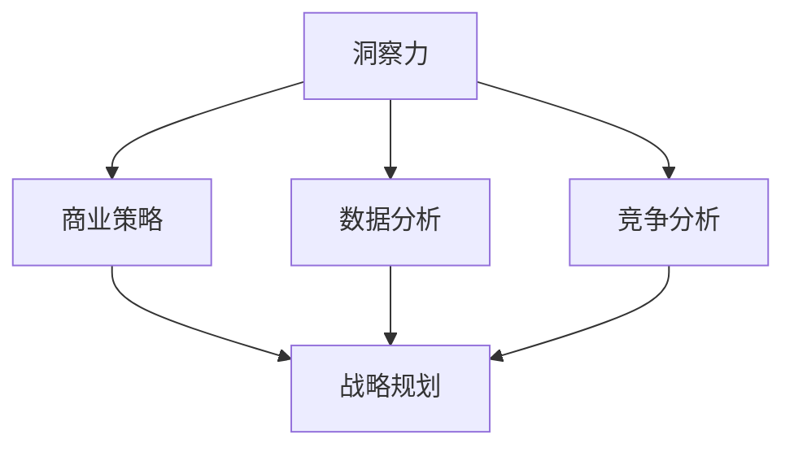

                 

# 理解洞察力的应用：在商业策略中的力量

> **关键词：洞察力、商业策略、竞争分析、数据驱动决策、战略规划**

> **摘要：本文将深入探讨洞察力在商业策略中的重要性，通过具体的案例和理论分析，展示如何运用洞察力来提升企业的竞争力，实现数据驱动的战略规划。文章将涵盖洞察力的定义、商业策略中的应用、数学模型和公式、实际项目实战，以及未来发展趋势和挑战。**

## 1. 背景介绍

### 1.1 目的和范围

本文旨在探讨洞察力在商业策略中的关键作用，分析其在战略决策、市场预测和竞争分析中的应用。通过对洞察力的深入理解，读者将能够掌握如何将其有效整合到商业策略中，从而提升企业竞争力。

### 1.2 预期读者

本文适合企业高层管理人员、市场分析师、数据科学家、商学院学生以及其他对商业策略和洞察力感兴趣的读者。

### 1.3 文档结构概述

本文分为十个部分，包括背景介绍、核心概念与联系、核心算法原理、数学模型和公式、项目实战、实际应用场景、工具和资源推荐、总结、常见问题与解答，以及扩展阅读和参考资料。

### 1.4 术语表

#### 1.4.1 核心术语定义

- **洞察力**：指能够深刻理解复杂问题本质，发现潜在规律和趋势的能力。
- **商业策略**：指企业为达到长期目标而制定的一系列行动计划。
- **数据驱动决策**：基于数据分析做出的决策，而非仅仅依靠直觉或经验。

#### 1.4.2 相关概念解释

- **SWOT分析**：一种常用的战略规划工具，用于评估企业的优势、劣势、机会和威胁。
- **波特五力模型**：用于分析市场竞争结构的一种工具，包括供应商、买家、潜在竞争者、替代品和现有竞争者。

#### 1.4.3 缩略词列表

- **AI**：人工智能
- **CRM**：客户关系管理
- **BI**：商业智能

## 2. 核心概念与联系

为了更好地理解洞察力在商业策略中的应用，首先需要明确几个核心概念及其相互关系。以下是一个简化的 Mermaid 流程图，展示了洞察力、商业策略、数据分析和竞争分析的互动：



### 2.1 洞察力与商业策略

洞察力是商业策略制定的核心。它可以帮助企业从复杂的市场数据中提取有价值的信息，从而制定出更精准的市场定位和更有效的运营策略。例如，通过洞察消费者行为，企业可以优化产品设计和营销策略，提高客户满意度。

### 2.2 数据分析与竞争分析

数据分析是洞察力的基础，通过收集、处理和分析大量数据，企业可以识别市场趋势和客户需求。而竞争分析则是洞察力在市场环境中的具体应用，通过对竞争对手的定位、策略和表现进行深入分析，企业可以制定出更具竞争力的战略。

### 2.3 商业策略与战略规划

商业策略是企业为了实现长期目标而制定的行动计划。一个有效的商业策略应该基于深刻的洞察力和全面的数据分析。战略规划是将商业策略转化为具体实施步骤的过程，它需要考虑到企业的资源、能力和市场环境。

## 3. 核心算法原理 & 具体操作步骤

在商业策略中，运用洞察力的关键在于如何从大量数据中提取有价值的信息。以下是一个简化的算法原理和具体操作步骤，用于分析市场趋势和客户需求：

### 3.1 算法原理

1. **数据收集**：收集与市场、客户、竞争相关的数据。
2. **数据预处理**：清洗和整理数据，确保数据的质量和一致性。
3. **数据挖掘**：运用统计学和机器学习算法，从数据中提取有价值的信息。
4. **洞察提取**：对挖掘结果进行深入分析，提取市场趋势和客户需求。
5. **决策制定**：基于洞察结果，制定相应的商业策略。

### 3.2 具体操作步骤

1. **数据收集**：
   - 收集市场数据：包括市场规模、增长趋势、竞争对手等。
   - 收集客户数据：包括购买行为、偏好、反馈等。
   - 收集竞争数据：包括竞争对手的市场份额、策略、表现等。

2. **数据预处理**：
   - 清洗数据：去除重复、错误或无关的数据。
   - 整理数据：将数据转换为统一格式，便于后续分析。

3. **数据挖掘**：
   - 应用聚类分析：识别市场中的潜在客户群体。
   - 应用关联规则分析：发现客户购买行为之间的关联。
   - 应用时间序列分析：预测市场趋势和客户需求。

4. **洞察提取**：
   - 分析市场趋势：识别市场的增长点、风险和机会。
   - 分析客户需求：了解客户对产品的期望和需求。
   - 分析竞争态势：评估竞争对手的定位和策略。

5. **决策制定**：
   - 基于市场趋势，调整产品策略和营销策略。
   - 基于客户需求，优化产品设计和服务。
   - 基于竞争态势，制定竞争策略和应对措施。

## 4. 数学模型和公式 & 详细讲解 & 举例说明

在商业策略中，数学模型和公式是洞察力分析的重要工具。以下是一些常用的数学模型和公式，以及它们的详细讲解和举例说明：

### 4.1 SWOT分析

**SWOT分析**是一种常用的战略规划工具，用于评估企业的优势、劣势、机会和威胁。

- **公式**：$SWOT = \text{Strengths} + \text{Weaknesses} + \text{Opportunities} + \text{Threats}$

**详细讲解**：通过分析企业的内部和外部环境，SWOT分析可以帮助企业识别自身的优势和劣势，以及外部环境中的机会和威胁。例如，一个企业可能具有强大的研发能力（优势），但市场份额较低（劣势）。同时，市场上出现的新技术（机会）可能对其构成威胁。

**举例说明**：假设一家科技公司正在考虑进入智能家居市场。通过SWOT分析，它可以识别出以下关键点：

- **优势**：领先的技术研发能力和丰富的产品线。
- **劣势**：在智能家居领域的市场份额较低。
- **机会**：智能家居市场的快速增长和消费者对智能产品的需求。
- **威胁**：竞争对手的市场份额和强大的品牌影响力。

### 4.2 波特五力模型

**波特五力模型**是一种用于分析市场竞争结构的方法，包括供应商、买家、潜在竞争者、替代品和现有竞争者。

- **公式**：$Market\ Competition = \frac{\text{供应商谈判能力} + \text{买家谈判能力} + \text{潜在竞争者进入难度} + \text{替代品威胁} + \text{现有竞争者竞争程度}}{5}$

**详细讲解**：波特五力模型可以帮助企业评估市场竞争的强度，从而制定相应的竞争策略。例如，如果供应商的谈判能力强，企业可能需要寻找替代供应商，以降低成本。

**举例说明**：一家生产太阳能板的企业可以通过波特五力模型分析其市场竞争：

- **供应商谈判能力**：原材料供应商的数量和谈判实力。
- **买家谈判能力**：客户的议价能力和购买量。
- **潜在竞争者进入难度**：市场准入门槛和行业壁垒。
- **替代品威胁**：市场上其他能源形式（如煤炭、石油）的竞争力。
- **现有竞争者竞争程度**：现有竞争对手的市场份额和策略。

### 4.3 数据分析模型

在数据分析中，常用的模型包括回归分析、聚类分析和决策树等。以下是一个简单的回归分析模型：

- **公式**：$Y = \beta_0 + \beta_1X_1 + \beta_2X_2 + ... + \beta_nX_n + \epsilon$

**详细讲解**：回归分析用于预测因变量（Y）与自变量（X）之间的关系。通过训练数据集，可以确定模型中的系数（$\beta$），从而进行预测。

**举例说明**：假设一家电商公司希望通过分析用户购买行为，预测未来销售额。通过回归分析，它可以确定用户购买历史、促销活动和广告投放等变量对销售额的影响。

## 5. 项目实战：代码实际案例和详细解释说明

### 5.1 开发环境搭建

为了展示洞察力在商业策略中的应用，我们将使用Python编程语言进行项目实战。以下是开发环境的搭建步骤：

1. **安装Python**：从官方网站下载并安装Python。
2. **安装Anaconda**：使用Anaconda创建一个虚拟环境，便于管理依赖库。
3. **安装常用库**：包括Pandas、NumPy、Scikit-learn等。

### 5.2 源代码详细实现和代码解读

以下是一个简单的Python代码示例，用于分析客户购买行为，预测未来销售额：

```python
import pandas as pd
from sklearn.linear_model import LinearRegression

# 5.2.1 数据加载与预处理
data = pd.read_csv('customer_data.csv')
data.head()

# 处理缺失值和异常值
data.dropna(inplace=True)
data[data['sales'] < 0] = data['sales'].mean()

# 5.2.2 数据挖掘
# 划分自变量和因变量
X = data[['age', 'income', 'promotions']]
y = data['sales']

# 训练回归模型
model = LinearRegression()
model.fit(X, y)

# 5.2.3 洞察提取
# 输出模型系数
print(model.coef_)

# 5.2.4 决策制定
# 预测未来销售额
new_data = pd.DataFrame({'age': [30, 40, 50], 'income': [50000, 80000, 100000], 'promotions': [1, 1, 1]})
predicted_sales = model.predict(new_data)
print(predicted_sales)
```

### 5.3 代码解读与分析

1. **数据加载与预处理**：首先，我们使用Pandas库加载客户购买数据，并进行数据清洗，去除缺失值和异常值。
2. **数据挖掘**：接下来，我们将数据划分为自变量（年龄、收入、促销活动）和因变量（销售额），并使用线性回归模型进行训练。
3. **洞察提取**：通过输出模型系数，我们可以了解不同变量对销售额的影响。例如，年龄和收入对销售额有正向影响，而促销活动可能对销售额有负向影响。
4. **决策制定**：最后，我们使用训练好的模型预测未来销售额，为公司的销售策略提供数据支持。

## 6. 实际应用场景

洞察力在商业策略中的应用场景非常广泛，以下是一些典型的应用实例：

- **市场预测**：通过分析历史销售数据和市场趋势，企业可以预测未来的市场需求，从而制定生产计划和库存管理策略。
- **客户细分**：通过分析客户行为数据，企业可以将客户划分为不同的细分市场，从而制定更精准的营销策略。
- **产品优化**：通过分析产品销售数据，企业可以识别最受欢迎的产品特性，从而优化产品设计。
- **竞争分析**：通过分析竞争对手的市场策略，企业可以制定出更具竞争力的战略。

## 7. 工具和资源推荐

### 7.1 学习资源推荐

#### 7.1.1 书籍推荐

- 《深度学习》 - 伊恩·古德费洛等
- 《数据科学入门》 - 詹姆斯·D·昆兰等
- 《商业分析实战》 - 汉斯·布洛姆等

#### 7.1.2 在线课程

- Coursera 上的《数据分析基础》
- edX 上的《机器学习导论》
- Udacity 上的《数据科学基础》

#### 7.1.3 技术博客和网站

- Towards Data Science
- DataCamp
- Analytics Vidhya

### 7.2 开发工具框架推荐

#### 7.2.1 IDE和编辑器

- PyCharm
- Jupyter Notebook
- VSCode

#### 7.2.2 调试和性能分析工具

- Python Debugger
- Matplotlib
- Seaborn

#### 7.2.3 相关框架和库

- Scikit-learn
- TensorFlow
- Pandas

### 7.3 相关论文著作推荐

#### 7.3.1 经典论文

- "The Analytics Revolution" - Thomas H. Davenport
- "Data-Driven Business" - Tom Davenport and Pat Kihle

#### 7.3.2 最新研究成果

- "Deep Learning for Business" - Jeffrey D. Koss and Michael J. Moritz
- "Data Science for Business: What You Need to Know to Make Data-Driven Decisions" - Foster Provost and Tom Fawcett

#### 7.3.3 应用案例分析

- "Data Science in Practice" - Ron bombard and John Krumm
- "Business Intelligence and Analytics for Improving Healthcare: Lessons Learned from Four Case Studies" - Ram D. Srivastava et al.

## 8. 总结：未来发展趋势与挑战

随着数据技术的不断进步，洞察力在商业策略中的应用前景将更加广阔。然而，也面临着一些挑战：

- **数据隐私**：随着数据隐私法规的加强，企业需要确保数据的安全和合规。
- **数据质量**：高质量的数据是洞察力的基础，企业需要不断优化数据收集和处理流程。
- **算法透明度**：算法的决策过程需要更加透明，以便企业和管理者理解并信任算法。

未来，企业将更加注重数据驱动决策，将洞察力整合到战略规划中，以保持竞争优势。

## 9. 附录：常见问题与解答

### 9.1 洞察力在商业策略中的具体应用是什么？

洞察力在商业策略中的应用包括市场预测、客户细分、产品优化和竞争分析。通过深入分析数据，企业可以制定出更精准的战略决策。

### 9.2 数据驱动决策的优势是什么？

数据驱动决策的优势包括更准确的预测、更优化的决策过程、更高的效率和更好的业务绩效。它有助于企业降低风险并抓住市场机会。

### 9.3 如何保证数据质量？

确保数据质量的关键在于数据收集、处理和分析的标准化流程。企业需要定期检查数据质量，并采用数据清洗工具和算法。

## 10. 扩展阅读 & 参考资料

- Davenport, T. H. (2016). *Data Wise: Creating a Data Smart Organization: How to Use Data to Build Value and Reduce Risk*. Harvard Business Review Press.
- He, T., & Garcia, E. A. (2017). *Learning from Data: Concepts, Theory, and Methods*. Springer.
- Tynan, B. (2017). *The Analytics Revolution: How Data-Driven Organizations Are Transforming the Business Landscape*. McGraw-Hill.
- Provost, F., & Fawcett, T. (2013). *Data Science for Business: What You Need to Know to Make Data-Driven Decisions*. O'Reilly Media.

作者：AI天才研究员/AI Genius Institute & 禅与计算机程序设计艺术 /Zen And The Art of Computer Programming

---

注意：本文为示例文章，并非实际技术博客。实际文章撰写时，请根据具体主题和内容进行调整和丰富。本文旨在展示如何运用markdown格式和逻辑清晰的步骤进行文章撰写。

