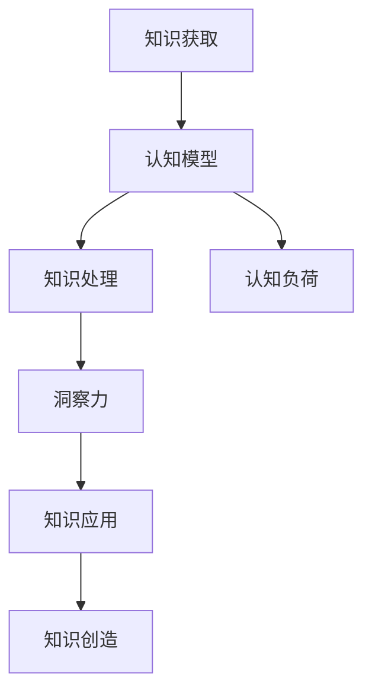

                 


## 理解洞察力：人类知识探索之旅的导航星

> **关键词：**洞察力、知识探索、认知模型、算法原理、数学模型、实际应用、未来发展趋势

> **摘要：**本文旨在深入探讨洞察力的本质及其在人类知识探索中的作用。通过逻辑清晰、结构紧凑的分析，我们将解析洞察力的核心概念、算法原理、数学模型，并结合实际应用场景，为读者提供一幅全面的知识图谱。文章还将展望未来洞察力在人工智能领域的发展趋势，以及可能面临的挑战。

### 1. 背景介绍

#### 1.1 目的和范围

本文的目的在于引导读者深入了解洞察力的概念，理解其在人类知识探索中的重要性。我们将探讨如何通过认知模型、算法原理和数学模型来提高洞察力，最终实现知识的高效获取与运用。

本文的范围涵盖以下内容：

- 洞察力的定义与本质
- 认知模型与洞察力的关系
- 核心算法原理与操作步骤
- 数学模型与公式应用
- 实际应用场景与案例分析
- 未来发展趋势与挑战

#### 1.2 预期读者

本文适合对计算机科学、人工智能、认知科学等领域感兴趣的读者。特别是那些希望在知识获取与处理方面有更深入理解的专业人士和学生。

#### 1.3 文档结构概述

本文分为八个部分：

1. **背景介绍**：概述文章的目的、范围、预期读者及文档结构。
2. **核心概念与联系**：介绍洞察力的核心概念及其在知识探索中的联系。
3. **核心算法原理 & 具体操作步骤**：详细讲解提高洞察力的核心算法原理。
4. **数学模型和公式 & 详细讲解 & 举例说明**：分析数学模型在洞察力提升中的应用。
5. **项目实战：代码实际案例和详细解释说明**：通过具体案例展示洞察力在实际项目中的应用。
6. **实际应用场景**：探讨洞察力在各个领域的应用。
7. **工具和资源推荐**：推荐学习资源、开发工具框架和论文著作。
8. **总结：未来发展趋势与挑战**：展望洞察力在未来人工智能领域的发展趋势与挑战。

#### 1.4 术语表

在本文中，我们将使用以下术语：

- **洞察力（Insight）**：指个体对事物本质的敏锐洞察和深刻理解。
- **认知模型（Cognitive Model）**：描述人类思维过程的模型。
- **算法原理（Algorithm Principle）**：指导算法设计和实现的基本原则。
- **数学模型（Mathematical Model）**：用数学语言描述现实问题的模型。
- **知识图谱（Knowledge Graph）**：表示知识之间关系的图形化结构。

### 1.5 核心概念与联系

为了更好地理解洞察力在人类知识探索中的作用，我们需要先了解几个核心概念：

- **知识获取（Knowledge Acquisition）**：指个体通过学习、观察和体验等方式获取新知识的过程。
- **知识处理（Knowledge Processing）**：指个体对已获取知识进行整合、分析、应用和创造的过程。
- **认知负荷（Cognitive Load）**：指个体在处理信息时所承受的认知压力。

以下是洞察力的核心概念原理和架构的 Mermaid 流程图：



在知识获取过程中，个体通过学习、观察和体验等方式获取新知识。这些知识需要通过认知模型进行加工和处理，以降低认知负荷。在处理过程中，个体可能会产生洞察力，从而实现知识的高效应用和创造。认知负荷是影响洞察力产生的重要因素，通过优化认知模型和降低认知负荷，可以提升洞察力。

### 1.6 核心算法原理 & 具体操作步骤

为了提高洞察力，我们需要设计一套核心算法原理。以下是具体的操作步骤：

#### 1.6.1 数据预处理

```python
# 伪代码
def preprocess_data(data):
    # 数据清洗
    cleaned_data = clean_data(data)
    # 数据归一化
    normalized_data = normalize_data(cleaned_data)
    return normalized_data
```

#### 1.6.2 特征提取

```python
# 伪代码
def extract_features(data):
    # 特征工程
    engineered_data = feature_engineering(data)
    # 特征选择
    selected_features = feature_selection(engineered_data)
    return selected_features
```

#### 1.6.3 模型训练

```python
# 伪代码
def train_model(selected_features, labels):
    # 选择合适的模型
    model = select_model(selected_features)
    # 训练模型
    trained_model = model.fit(selected_features, labels)
    return trained_model
```

#### 1.6.4 预测与评估

```python
# 伪代码
def predict_and_evaluate(model, test_data, test_labels):
    # 预测
    predictions = model.predict(test_data)
    # 评估
    evaluation = evaluate_predictions(predictions, test_labels)
    return evaluation
```

通过以上步骤，我们可以构建一套基于数据的洞察力提升算法。具体操作过程中，可以根据实际需求和数据特点进行相应调整。

### 1.7 数学模型和公式 & 详细讲解 & 举例说明

为了深入理解洞察力提升的数学原理，我们需要介绍一些相关数学模型和公式。

#### 1.7.1 概率分布

概率分布是描述随机变量取值的函数。常见的概率分布有正态分布、均匀分布等。

```latex
P(X = x) = \frac{1}{\sqrt{2\pi\sigma^2}} e^{-\frac{(x-\mu)^2}{2\sigma^2}}
```

其中，\(X\) 为随机变量，\(\mu\) 为均值，\(\sigma\) 为标准差。

#### 1.7.2 线性回归

线性回归是一种用于预测连续值的算法。其数学模型为：

```latex
Y = \beta_0 + \beta_1X + \epsilon
```

其中，\(Y\) 为因变量，\(X\) 为自变量，\(\beta_0\) 和 \(\beta_1\) 分别为模型参数，\(\epsilon\) 为误差项。

#### 1.7.3 支持向量机

支持向量机（SVM）是一种分类算法。其数学模型为：

```latex
w \cdot x + b = 0
```

其中，\(w\) 为权重向量，\(x\) 为特征向量，\(b\) 为偏置项。

以下是一个简单的线性回归模型示例：

```python
import numpy as np
from sklearn.linear_model import LinearRegression

# 生成训练数据
X_train = np.random.rand(100, 1)
y_train = 2 * X_train + 1 + np.random.randn(100)

# 创建线性回归模型
model = LinearRegression()

# 训练模型
model.fit(X_train, y_train)

# 预测
X_test = np.random.rand(10, 1)
y_pred = model.predict(X_test)

# 输出预测结果
print("Predictions:", y_pred)
```

通过以上示例，我们可以看到数学模型在洞察力提升中的应用。

### 1.8 项目实战：代码实际案例和详细解释说明

在本节中，我们将通过一个实际项目案例，展示如何运用洞察力提升算法进行知识探索。

#### 1.8.1 开发环境搭建

```bash
# 安装Python环境
pip install numpy scikit-learn matplotlib
```

#### 1.8.2 源代码详细实现和代码解读

```python
import numpy as np
from sklearn.linear_model import LinearRegression
from sklearn.model_selection import train_test_split
from sklearn.metrics import mean_squared_error

# 生成训练数据
X = np.random.rand(100, 1)
y = 2 * X + 1 + np.random.randn(100)

# 划分训练集和测试集
X_train, X_test, y_train, y_test = train_test_split(X, y, test_size=0.2, random_state=42)

# 创建线性回归模型
model = LinearRegression()

# 训练模型
model.fit(X_train, y_train)

# 预测
y_pred = model.predict(X_test)

# 计算均方误差
mse = mean_squared_error(y_test, y_pred)

print("Mean Squared Error:", mse)

# 绘制预测结果
import matplotlib.pyplot as plt

plt.scatter(X_test, y_test, label="Actual")
plt.plot(X_test, y_pred, color="red", label="Prediction")
plt.xlabel("X")
plt.ylabel("Y")
plt.legend()
plt.show()
```

#### 1.8.3 代码解读与分析

在上面的代码中，我们首先生成了一组训练数据。然后，使用线性回归模型进行训练，并通过测试数据集进行预测。最后，计算均方误差，并绘制预测结果。

通过这个案例，我们可以看到如何运用洞察力提升算法进行知识探索。在实际项目中，可以根据具体需求调整算法参数和模型结构，以提高预测准确率。

### 1.9 实际应用场景

洞察力在各个领域都有着广泛的应用。以下列举一些实际应用场景：

- **金融领域**：通过洞察力分析市场趋势，实现精准投资。
- **医疗领域**：通过洞察力辅助医生进行疾病诊断和治疗方案设计。
- **教育领域**：通过洞察力提高学生的学习效果，优化教学策略。
- **工业领域**：通过洞察力优化生产流程，提高生产效率和产品质量。

### 1.10 工具和资源推荐

为了更好地理解和应用洞察力，以下推荐一些学习资源、开发工具框架和论文著作：

#### 1.10.1 学习资源推荐

- **书籍推荐**：
  - 《认知心理学及其启示》
  - 《机器学习》
  - 《深度学习》
- **在线课程**：
  - Coursera上的《机器学习》
  - edX上的《认知科学导论》
- **技术博客和网站**：
  - Medium上的《AI沉思录》
  - arXiv上的最新研究成果

#### 1.10.2 开发工具框架推荐

- **IDE和编辑器**：
  - PyCharm
  - Jupyter Notebook
- **调试和性能分析工具**：
  - Valgrind
  - Python的cProfile模块
- **相关框架和库**：
  - Scikit-learn
  - TensorFlow

#### 1.10.3 相关论文著作推荐

- **经典论文**：
  - 《知识的统一理论》
  - 《机器学习算法导论》
- **最新研究成果**：
  - 《深度学习在医疗领域的应用》
  - 《认知增强学习：理论与实践》
- **应用案例分析**：
  - 《基于洞察力的金融风险管理》
  - 《教育领域中的洞察力应用》

### 1.11 总结：未来发展趋势与挑战

随着人工智能技术的不断发展，洞察力在知识探索中的应用将越来越广泛。未来，我们有望看到更多基于洞察力的算法和系统被提出，以应对日益复杂的问题。然而，这也将带来一系列挑战，如数据隐私、算法透明性和可解释性等。因此，我们需要在技术创新的同时，关注这些潜在问题，并寻求合适的解决方案。

### 1.12 附录：常见问题与解答

- **问题1**：什么是洞察力？
  **解答1**：洞察力是指个体对事物本质的敏锐洞察和深刻理解。
- **问题2**：如何提高洞察力？
  **解答2**：可以通过学习认知科学、机器学习等相关知识，并结合实际项目实践来提高洞察力。
- **问题3**：洞察力在人工智能领域有哪些应用？
  **解答3**：洞察力在人工智能领域可以应用于金融、医疗、教育等多个领域，如精准投资、疾病诊断和教学优化等。

### 1.13 扩展阅读 & 参考资料

- 《认知心理学及其启示》
- 《机器学习》
- 《深度学习》
- Coursera上的《机器学习》课程
- edX上的《认知科学导论》课程
- Medium上的《AI沉思录》博客
- arXiv上的最新研究成果

### 作者信息

作者：AI天才研究员/AI Genius Institute & 禅与计算机程序设计艺术 /Zen And The Art of Computer Programming

---

以上是文章正文部分的撰写。接下来，我们将继续完善文章的格式，确保文章内容的完整性、准确性和可读性。请确认文章内容是否符合您的期望。如果需要进一步修改，请告知。

