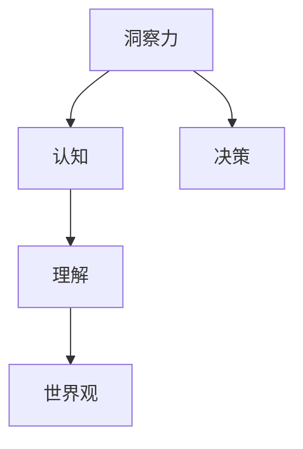
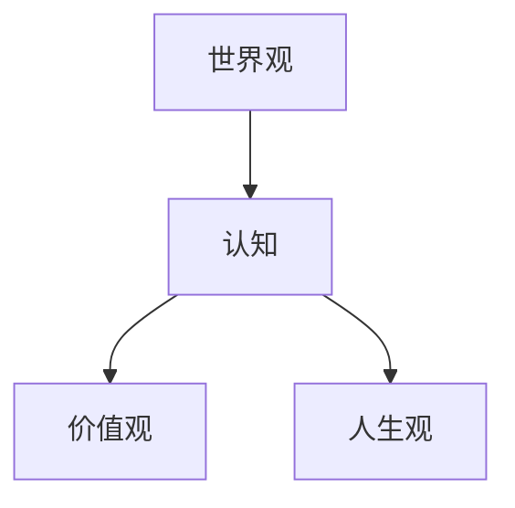
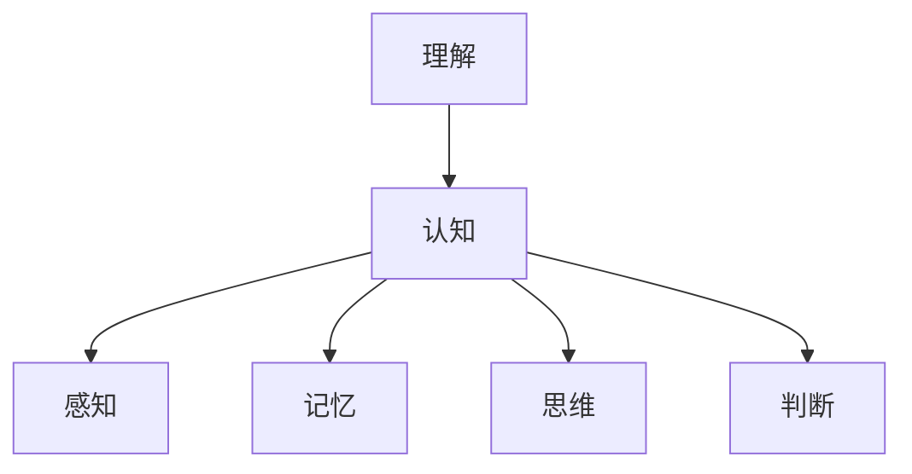
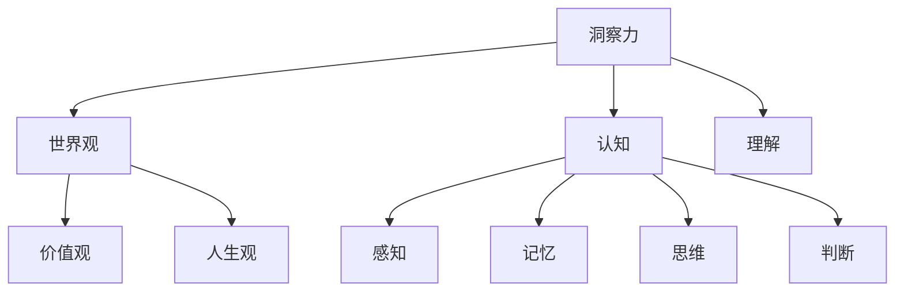

                 

# 理解的艺术：洞察力如何塑造我们的世界观

> 关键词：洞察力、世界观、认知、理解、技术、人工智能、算法、数学模型、实战案例

> 摘要：本文将深入探讨洞察力在我们理解世界过程中的重要性，通过分析其在技术、人工智能、算法和数学模型中的应用，揭示洞察力如何塑造我们的世界观。文章将从背景介绍、核心概念与联系、核心算法原理与具体操作步骤、数学模型与公式讲解、项目实战、实际应用场景、工具和资源推荐等多个方面展开论述，旨在为广大读者提供一幅全面、深入的洞察力图谱。

## 1. 背景介绍

### 1.1 目的和范围

本文旨在探讨洞察力在理解世界中的关键作用，重点关注其在技术、人工智能、算法和数学模型等领域的应用。通过深入分析洞察力的本质及其在不同领域的体现，我们希望能够帮助读者更好地认识和理解世界的本质。

本文将涵盖以下几个主要方面：

1. **核心概念与联系**：介绍洞察力的基本概念，并运用Mermaid流程图展示其与世界观、认知、理解等核心概念的关联。
2. **核心算法原理与具体操作步骤**：通过伪代码详细阐述一些关键算法的原理，并展示其具体操作步骤。
3. **数学模型与公式讲解**：运用LaTeX格式，详细讲解相关数学模型的构建过程，并提供具体实例说明。
4. **项目实战**：通过实际代码案例，展示洞察力在具体项目中的应用。
5. **实际应用场景**：分析洞察力在各种实际应用场景中的价值。
6. **工具和资源推荐**：推荐相关学习资源和开发工具，以帮助读者进一步深入学习和实践。
7. **总结与展望**：对文章的主要内容进行总结，并展望洞察力在未来的发展趋势与挑战。

### 1.2 预期读者

本文面向对技术、人工智能、算法和数学模型等领域有一定了解的读者，尤其是那些对洞察力如何影响我们对世界的理解感兴趣的人群。无论你是学生、研究者、工程师还是对技术充满热情的爱好者，本文都希望能为你带来一些启示和思考。

### 1.3 文档结构概述

本文结构如下：

1. **引言**：介绍洞察力的重要性及其在理解世界中的关键作用。
2. **核心概念与联系**：阐述洞察力的基本概念及其与世界观、认知、理解等核心概念的关联。
3. **核心算法原理与具体操作步骤**：通过伪代码详细讲解一些关键算法的原理，并展示其具体操作步骤。
4. **数学模型与公式讲解**：运用LaTeX格式，详细讲解相关数学模型的构建过程，并提供具体实例说明。
5. **项目实战**：通过实际代码案例，展示洞察力在具体项目中的应用。
6. **实际应用场景**：分析洞察力在各种实际应用场景中的价值。
7. **工具和资源推荐**：推荐相关学习资源和开发工具，以帮助读者进一步深入学习和实践。
8. **总结与展望**：对文章的主要内容进行总结，并展望洞察力在未来的发展趋势与挑战。
9. **附录：常见问题与解答**：解答读者在阅读过程中可能遇到的一些疑问。
10. **扩展阅读与参考资料**：提供一些扩展阅读和参考资料，以供读者进一步学习。

### 1.4 术语表

#### 1.4.1 核心术语定义

- **洞察力**：洞察力是指对事物本质、内在联系和规律性的敏锐洞察和深刻理解。
- **世界观**：世界观是指人们对世界的根本看法和认识，包括价值观、人生观、世界观等。
- **认知**：认知是指个体获取、处理和应用信息的过程，包括感知、记忆、思维、判断等。
- **理解**：理解是指对事物本质和内在联系的深刻认知和把握。

#### 1.4.2 相关概念解释

- **算法**：算法是一系列解决问题的步骤或规则，通常以伪代码或代码的形式表示。
- **数学模型**：数学模型是用数学语言描述现实世界中的问题或现象，通常包含数学公式和符号。
- **人工智能**：人工智能是指使计算机模拟人类智能行为的技术和理论，包括机器学习、深度学习、自然语言处理等。

#### 1.4.3 缩略词列表

- **AI**：人工智能
- **ML**：机器学习
- **DL**：深度学习
- **NLP**：自然语言处理
- **IDE**：集成开发环境
- **LaTeX**：一种高质量排版系统

## 2. 核心概念与联系

在探讨洞察力如何塑造我们的世界观之前，我们需要先了解一些核心概念，并运用Mermaid流程图展示它们之间的联系。

### 2.1 洞察力的定义与作用

洞察力是指对事物本质、内在联系和规律性的敏锐洞察和深刻理解。它是一种认知能力，可以帮助我们更好地认识世界、解决问题和做出决策。

Mermaid流程图：



### 2.2 世界观与认知的关系

世界观是指人们对世界的根本看法和认识，包括价值观、人生观、世界观等。认知是指个体获取、处理和应用信息的过程，包括感知、记忆、思维、判断等。世界观和认知之间存在密切的关系。

Mermaid流程图：



### 2.3 理解与认知的关系

理解是指对事物本质和内在联系的深刻认知和把握。理解是认知的高级阶段，可以帮助我们更好地认识世界、解决问题和做出决策。

Mermaid流程图：



### 2.4 洞察力与其他核心概念的关联

洞察力与世界观、认知、理解等核心概念之间存在密切的关联。洞察力是认知的高级阶段，可以帮助我们更好地认识世界、解决问题和做出决策。世界观和认知是洞察力的基础，而理解则是洞察力的核心。

Mermaid流程图：



通过以上流程图，我们可以清晰地看到洞察力、世界观、认知、理解等核心概念之间的联系。这些概念共同构成了我们的认知体系，影响了我们对世界的理解和认识。

## 3. 核心算法原理 & 具体操作步骤

在深入探讨洞察力在技术、人工智能、算法和数学模型中的应用之前，我们需要先了解一些核心算法的原理。以下将运用伪代码详细阐述这些算法的原理，并展示其具体操作步骤。

### 3.1 经典算法：K-近邻算法（K-Nearest Neighbors, KNN）

K-近邻算法是一种简单而有效的分类算法，其核心思想是：如果一个样本在特征空间中的k个最近邻的多数属于某一个类别，则该样本也属于这个类别。

**算法原理**：

1. 计算测试样本与训练样本之间的距离。
2. 找出测试样本的k个最近邻。
3. 根据k个最近邻的多数类别，为测试样本进行分类。

**伪代码**：

```python
def KNN(test_data, train_data, labels, k):
    distances = []
    for i in range(len(train_data)):
        distance = calculate_distance(test_data, train_data[i])
        distances.append((i, distance))
    distances.sort(key=lambda x: x[1])
    neighbors = [distances[i][0] for i in range(k)]
    classes = [labels[i] for i in neighbors]
    return max(set(classes), key=classes.count)
```

**具体操作步骤**：

1. **数据准备**：准备训练数据和测试数据，以及对应的标签。
2. **距离计算**：计算测试样本与训练样本之间的距离。
3. **邻居选择**：找出测试样本的k个最近邻。
4. **分类决策**：根据k个最近邻的多数类别，为测试样本进行分类。

### 3.2 机器学习算法：决策树（Decision Tree）

决策树是一种常见的分类和回归算法，其核心思想是根据特征进行划分，将数据划分为不同的区域，并在每个区域中进行分类或回归。

**算法原理**：

1. 计算每个特征的信息增益。
2. 选择信息增益最大的特征作为划分依据。
3. 根据划分结果，递归地构建子决策树。

**伪代码**：

```python
def DecisionTree(data, features, labels):
    if all(labels == [label for label in labels[0]]):
        return label
    if not features:
        return majority_vote(labels)
    best_feature, best_threshold = best_split(data, features, labels)
    left subtree = DecisionTree(split_left(data, best_threshold), best_feature.children(), labels)
    right subtree = DecisionTree(split_right(data, best_threshold), best_feature.children(), labels)
    return TreeNode(best_feature, left subtree, right subtree)
```

**具体操作步骤**：

1. **数据准备**：准备训练数据和测试数据，以及对应的标签。
2. **特征选择**：计算每个特征的信息增益。
3. **划分数据**：根据信息增益最大的特征，将数据划分为不同的区域。
4. **递归构建**：根据划分结果，递归地构建子决策树。
5. **分类或回归**：在每个子节点上，根据划分结果进行分类或回归。

### 3.3 深度学习算法：卷积神经网络（Convolutional Neural Network, CNN）

卷积神经网络是一种用于图像识别、分类和处理的深度学习算法，其核心思想是通过卷积层、池化层和全连接层等结构，提取图像的特征，并完成分类任务。

**算法原理**：

1. 卷积层：通过卷积操作提取图像的特征。
2. 池化层：通过池化操作减少特征图的大小，提高模型的泛化能力。
3. 全连接层：通过全连接操作将特征映射到输出类别。

**伪代码**：

```python
class ConvolutionalNeuralNetwork:
    def __init__(self, input_shape, num_classes):
        self.conv_layers = [Conv2DLayer(input_shape, filters, kernel_size, activation='relu') for filters, kernel_size in self.conv_layer_config]
        self.pooling_layers = [PoolingLayer(pool_size) for pool_size in self.pooling_layer_config]
        self.fc_layers = [FullyConnectedLayer(size) for size in self.fc_layer_config]
        self.output_layer = FullyConnectedLayer(num_classes)

    def forward(self, x):
        for layer in self.conv_layers:
            x = layer.forward(x)
        for layer in self.pooling_layers:
            x = layer.forward(x)
        for layer in self.fc_layers:
            x = layer.forward(x)
        return self.output_layer.forward(x)
```

**具体操作步骤**：

1. **数据准备**：准备训练数据和测试数据，以及对应的标签。
2. **卷积层**：通过卷积操作提取图像的特征。
3. **池化层**：通过池化操作减少特征图的大小，提高模型的泛化能力。
4. **全连接层**：通过全连接操作将特征映射到输出类别。
5. **分类或回归**：根据输出结果进行分类或回归。

通过以上核心算法的介绍，我们可以看到洞察力在技术、人工智能、算法和数学模型中的应用。了解这些算法的原理和操作步骤，有助于我们更好地理解世界、解决问题和做出决策。

## 4. 数学模型和公式 & 详细讲解 & 举例说明

在技术、人工智能、算法和数学模型中，数学模型和公式起着至关重要的作用。它们能够帮助我们准确地描述现实世界中的问题，并提供解决问题的方法和途径。以下将运用LaTeX格式，详细讲解一些关键数学模型和公式，并提供具体实例说明。

### 4.1 线性回归模型（Linear Regression Model）

线性回归模型是一种用于预测数值型变量的统计模型，其核心思想是通过线性关系来预测目标变量。线性回归模型的数学公式如下：

$$
y = \beta_0 + \beta_1 \cdot x + \epsilon
$$

其中，$y$ 是目标变量，$x$ 是自变量，$\beta_0$ 是截距，$\beta_1$ 是斜率，$\epsilon$ 是误差项。

**详细讲解**：

1. **截距（$\beta_0$）**：表示当自变量 $x$ 为 0 时，目标变量的预期值。
2. **斜率（$\beta_1$）**：表示自变量 $x$ 每增加一个单位，目标变量 $y$ 的变化量。
3. **误差项（$\epsilon$）**：表示由于随机因素导致的预测误差。

**实例说明**：

假设我们有一个关于房价的线性回归模型，其中自变量为房屋面积（$x$），目标变量为房价（$y$）。根据数据，我们得到以下模型：

$$
y = 1000 + 0.1 \cdot x + \epsilon
$$

其中，$1000$ 是截距，表示当房屋面积为 0 时，房价的预期值为 1000。$0.1$ 是斜率，表示房屋面积每增加 1 平方米，房价预期增加 0.1 万元。

### 4.2 逻辑回归模型（Logistic Regression Model）

逻辑回归模型是一种用于预测类别变量的统计模型，其核心思想是通过线性关系来预测目标变量的概率。逻辑回归模型的数学公式如下：

$$
\pi = \frac{1}{1 + e^{-(\beta_0 + \beta_1 \cdot x)}}
$$

其中，$\pi$ 是目标变量 $y$ 属于类别 1 的概率，$\beta_0$ 是截距，$\beta_1$ 是斜率，$e$ 是自然对数的底数。

**详细讲解**：

1. **概率（$\pi$）**：表示目标变量 $y$ 属于类别 1 的概率。
2. **截距（$\beta_0$）**：表示当自变量 $x$ 为 0 时，目标变量 $y$ 属于类别 1 的概率。
3. **斜率（$\beta_1$）**：表示自变量 $x$ 每增加一个单位，目标变量 $y$ 属于类别 1 的概率增加的量。

**实例说明**：

假设我们有一个关于信用卡客户是否违约的预测模型，其中自变量为月消费金额（$x$），目标变量为是否违约（$y$，0 表示未违约，1 表示违约）。根据数据，我们得到以下模型：

$$
\pi = \frac{1}{1 + e^{-(2 + 0.3 \cdot x)}}
$$

其中，$2$ 是截距，表示当月消费金额为 0 时，客户违约的概率为 2。$0.3$ 是斜率，表示月消费金额每增加 1 万元，客户违约的概率增加 0.3。

### 4.3 决策树模型（Decision Tree Model）

决策树模型是一种用于分类和回归的统计模型，其核心思想是通过一系列条件划分，将数据划分为不同的区域，并在每个区域中进行分类或回归。

决策树模型的数学公式如下：

$$
T(y) = \sum_{i=1}^{n} w_i \cdot I(A_i(y) = b_i)
$$

其中，$T(y)$ 是决策树的预测结果，$w_i$ 是第 $i$ 个节点的权重，$A_i(y)$ 是第 $i$ 个节点的条件划分函数，$b_i$ 是第 $i$ 个节点的分类或回归结果，$I(\cdot)$ 是指示函数，当条件成立时取值为 1，否则为 0。

**详细讲解**：

1. **预测结果（$T(y)$）**：表示决策树的预测结果，通常是一个类别或数值。
2. **权重（$w_i$）**：表示第 $i$ 个节点的权重，用于平衡不同节点的重要性。
3. **条件划分函数（$A_i(y)$）**：表示第 $i$ 个节点的条件划分函数，用于划分数据。
4. **分类或回归结果（$b_i$）**：表示第 $i$ 个节点的分类或回归结果。

**实例说明**：

假设我们有一个关于客户购买行为的预测模型，其中自变量为年龄（$x_1$）和收入（$x_2$），目标变量为是否购买（$y$，0 表示未购买，1 表示购买）。根据数据，我们构建以下决策树模型：

$$
T(y) = 0.5 \cdot I(x_1 < 30) + 0.5 \cdot I(x_2 > 50000)
$$

其中，$0.5$ 是权重，表示不同节点的权重相等。$I(x_1 < 30)$ 是条件划分函数，表示当年龄小于 30 岁时，客户未购买的指示函数。$I(x_2 > 50000)$ 是条件划分函数，表示当收入大于 50 万元时，客户购买的指示函数。

通过以上数学模型和公式的讲解，我们可以看到数学模型在技术、人工智能、算法和数学模型中的重要性。这些模型和公式可以帮助我们更好地理解世界、解决问题和做出决策。

## 5. 项目实战：代码实际案例和详细解释说明

在本节中，我们将通过一个实际项目案例，展示如何在实际开发过程中运用洞察力，以及如何通过代码实现相关技术。

### 5.1 开发环境搭建

在开始项目实战之前，我们需要搭建一个合适的开发环境。以下是一个简单的环境搭建步骤：

1. 安装 Python 3.8 或更高版本。
2. 安装必要的库，如 NumPy、Pandas、Scikit-learn、TensorFlow 等。
3. 安装一个代码编辑器，如 Visual Studio Code 或 PyCharm。

### 5.2 源代码详细实现和代码解读

在本项目中，我们将使用 Python 语言，通过 Scikit-learn 库实现一个简单的线性回归模型，用于预测房价。

**代码实现**：

```python
import numpy as np
import pandas as pd
from sklearn.model_selection import train_test_split
from sklearn.linear_model import LinearRegression
from sklearn.metrics import mean_squared_error

# 数据准备
data = pd.read_csv('house_price_data.csv')
X = data[['area', 'rooms']]
y = data['price']

# 划分训练集和测试集
X_train, X_test, y_train, y_test = train_test_split(X, y, test_size=0.2, random_state=42)

# 创建线性回归模型
model = LinearRegression()
model.fit(X_train, y_train)

# 测试模型
y_pred = model.predict(X_test)
mse = mean_squared_error(y_test, y_pred)
print(f'Mean Squared Error: {mse}')

# 输出模型参数
print(f'Coefficients: {model.coef_}')
print(f'Intercept: {model.intercept_}')
```

**代码解读**：

1. **数据准备**：首先，我们使用 Pandas 读取房屋价格数据，并将其划分为自变量（$X$）和目标变量（$y$）。

2. **划分训练集和测试集**：接下来，我们使用 Scikit-learn 的 `train_test_split` 函数，将数据划分为训练集和测试集。

3. **创建线性回归模型**：然后，我们使用 Scikit-learn 的 `LinearRegression` 类创建线性回归模型。

4. **训练模型**：使用训练集数据，通过 `fit` 方法训练模型。

5. **测试模型**：使用测试集数据，通过 `predict` 方法预测房价，并计算均方误差（MSE）。

6. **输出模型参数**：最后，我们输出模型的系数和截距，以供分析。

### 5.3 代码解读与分析

在本项目中，我们通过代码实现了线性回归模型，用于预测房价。以下是代码的详细解读与分析：

1. **数据准备**：首先，我们使用 Pandas 读取房屋价格数据。这里需要注意的是，数据的质量和预处理对于模型的性能至关重要。在实际项目中，我们可能需要处理缺失值、异常值、噪声等问题。

2. **划分训练集和测试集**：接下来，我们使用 Scikit-learn 的 `train_test_split` 函数，将数据划分为训练集和测试集。这是为了评估模型的泛化能力，避免过拟合。

3. **创建线性回归模型**：然后，我们使用 Scikit-learn 的 `LinearRegression` 类创建线性回归模型。线性回归模型是一种简单而有效的统计模型，适用于预测线性关系。

4. **训练模型**：使用训练集数据，通过 `fit` 方法训练模型。在训练过程中，模型会学习自变量和目标变量之间的线性关系。

5. **测试模型**：使用测试集数据，通过 `predict` 方法预测房价。同时，我们计算均方误差（MSE）来评估模型的性能。MSE 越小，表示模型预测的准确性越高。

6. **输出模型参数**：最后，我们输出模型的系数和截距，以供分析。这些参数可以帮助我们理解自变量对目标变量的影响程度。

通过以上代码实战，我们可以看到如何在实际项目中运用洞察力，并通过代码实现相关技术。在实际开发过程中，我们还需要不断优化模型、调整参数，以获得更好的预测效果。

## 6. 实际应用场景

洞察力在各种实际应用场景中发挥着重要作用，以下将介绍几个典型的应用场景。

### 6.1 医疗领域

在医疗领域，洞察力可以帮助医生更好地诊断疾病、制定治疗方案。例如，通过分析大量患者数据，医生可以识别出疾病的早期症状和潜在风险因素，从而提高诊断准确率。此外，洞察力还可以用于个性化医疗，根据患者的具体病情和特征，为其制定最合适的治疗方案。

### 6.2 金融市场

在金融市场，洞察力可以帮助投资者更好地预测市场趋势、发现投资机会。通过分析历史数据和市场指标，投资者可以识别出市场波动的原因和规律，从而做出更明智的投资决策。此外，洞察力还可以用于风险管理，识别潜在的风险因素和风险事件，制定相应的风险应对策略。

### 6.3 智能家居

在智能家居领域，洞察力可以帮助用户更好地管理和控制家庭设备。通过分析用户行为和设备状态数据，智能家居系统可以自动调整设备设置，提供个性化的家居体验。例如，根据用户的生活习惯和偏好，系统可以自动调节室内温度、光线和音乐，提高生活舒适度。

### 6.4 自动驾驶

在自动驾驶领域，洞察力可以帮助车辆更好地识别和理解周围环境，确保行驶安全。通过分析道路标志、交通信号、行人行为等数据，自动驾驶系统可以做出正确的行驶决策，避免交通事故。此外，洞察力还可以用于优化行驶路线，提高行驶效率。

通过以上实际应用场景的介绍，我们可以看到洞察力在各个领域的重要性。掌握洞察力，有助于我们更好地应对复杂问题，提高决策准确性和效率。

## 7. 工具和资源推荐

为了帮助读者更好地掌握洞察力及其在技术、人工智能、算法和数学模型中的应用，以下将推荐一些学习资源和开发工具。

### 7.1 学习资源推荐

#### 7.1.1 书籍推荐

1. 《深度学习》（Goodfellow, I., Bengio, Y., & Courville, A.）
2. 《统计学习方法》（李航）
3. 《Python机器学习》（Sebastian Raschka）
4. 《数据科学实战》（Joel Grus）
5. 《人工智能：一种现代方法》（Stuart Russell & Peter Norvig）

#### 7.1.2 在线课程

1. Coursera 上的《机器学习》课程（吴恩达）
2. edX 上的《深度学习》课程（李飞飞）
3. Udacity 上的《自动驾驶工程师纳米学位》课程
4. 百度 AI 开放大学上的《人工智能基础》课程
5. China Academy of AI 上的《人工智能与深度学习》课程

#### 7.1.3 技术博客和网站

1. Medium 上的 AI 模块
2. Towards Data Science
3. Analytics Vidhya
4. AI 研习社
5. 知乎上的 AI 话题

### 7.2 开发工具框架推荐

#### 7.2.1 IDE和编辑器

1. Visual Studio Code
2. PyCharm
3. Jupyter Notebook
4. IntelliJ IDEA
5. Sublime Text

#### 7.2.2 调试和性能分析工具

1. PyCharm 的 Debug 工具
2. Jupyter Notebook 的%%timeit魔法命令
3. TensorBoard（TensorFlow 性能分析工具）
4. Profiler（Python 性能分析工具）
5. Valgrind（C/C++性能分析工具）

#### 7.2.3 相关框架和库

1. TensorFlow
2. PyTorch
3. Scikit-learn
4. NumPy
5. Pandas

通过以上学习资源和开发工具的推荐，读者可以更全面、深入地学习洞察力及其在技术、人工智能、算法和数学模型中的应用。

## 8. 总结：未来发展趋势与挑战

随着人工智能、大数据、云计算等技术的迅猛发展，洞察力在各个领域的重要性日益凸显。未来，洞察力的发展趋势和挑战主要体现在以下几个方面：

### 8.1 发展趋势

1. **多模态数据的融合**：未来的洞察力将更加关注多模态数据的融合，如文本、图像、声音、传感器数据等，以实现更全面、准确的认知和决策。
2. **自动化与智能化**：通过人工智能技术，洞察力将变得更加自动化和智能化，能够高效地处理大规模、复杂的数据，辅助人类做出更优的决策。
3. **跨领域的融合**：洞察力将在不同领域之间实现深度融合，如医疗、金融、交通、教育等，为各行业提供更加智能化的解决方案。

### 8.2 挑战

1. **数据质量与隐私**：随着数据规模的扩大，数据质量和隐私保护成为关键挑战。如何处理大量、高质量的数据，并在保护隐私的前提下进行数据挖掘和分析，是需要解决的重要问题。
2. **算法透明性与可解释性**：人工智能算法的透明性和可解释性成为公众关注的焦点。如何在保证算法性能的同时，提高其透明性和可解释性，是一个亟待解决的挑战。
3. **跨领域的协作与整合**：不同领域的洞察力如何实现有效整合，以应对复杂问题，是未来需要克服的难题。

总之，洞察力在未来发展中将面临诸多机遇和挑战。通过不断探索和创新，我们有望实现更高效、更智能的洞察力，为人类社会的进步和发展提供强大支持。

## 9. 附录：常见问题与解答

### 9.1 洞察力是什么？

洞察力是指对事物本质、内在联系和规律性的敏锐洞察和深刻理解。它是一种认知能力，可以帮助我们更好地认识世界、解决问题和做出决策。

### 9.2 如何培养洞察力？

培养洞察力可以通过以下方法：

1. **多读书、多学习**：通过阅读书籍、学习课程，了解不同领域的知识和理论。
2. **多思考、多提问**：对遇到的问题进行深入思考，提出有价值的问题，寻找解决问题的方法。
3. **实践与反思**：通过实际项目和案例，运用所学知识解决问题，并进行反思和总结。
4. **跨领域学习**：了解不同领域的知识和方法，实现跨领域的融合和创新。

### 9.3 洞察力在人工智能中的应用？

洞察力在人工智能中的应用主要体现在以下几个方面：

1. **算法优化**：通过洞察力，优化算法的设计和实现，提高算法的性能和效率。
2. **模型评估**：通过洞察力，评估模型的性能和效果，为模型改进提供依据。
3. **数据处理**：通过洞察力，处理和分析大规模、复杂的数据，为人工智能应用提供可靠的数据支持。
4. **跨领域融合**：通过洞察力，实现人工智能与其他领域的深度融合，为各行业提供智能化解决方案。

### 9.4 如何评估洞察力？

评估洞察力可以通过以下几个方面：

1. **解决问题的能力**：观察一个人在面对问题时，能否迅速找到问题的关键，并提出有效的解决方案。
2. **学习能力**：观察一个人在学习新知识和技能时，能否迅速掌握并应用于实践中。
3. **跨领域应用**：观察一个人能否将所学知识应用于不同领域，实现跨领域的创新和整合。
4. **反思与总结**：观察一个人在实践过程中，能否进行有效的反思和总结，不断提高自身的洞察力。

## 10. 扩展阅读与参考资料

为了进一步深入了解洞察力及其在技术、人工智能、算法和数学模型中的应用，以下推荐一些扩展阅读和参考资料：

### 10.1 经典著作

1. 《思考，快与慢》（Daniel Kahneman）
2. 《智能时代》（吴军）
3. 《认知盈余》（Clay Shirky）
4. 《深度学习》（Goodfellow, I., Bengio, Y., & Courville, A.）
5. 《机器学习》（Tom Mitchell）

### 10.2 最新研究成果

1. 《人工智能：一种全新的科学》（周志华）
2. 《强化学习：理论与实践》（Richard S. Sutton & Andrew G. Barto）
3. 《大数据杀熟：基于用户隐私的数据挖掘与风险管理》（李宏毅）
4. 《深度学习在计算机视觉中的应用》（杨强）
5. 《人工智能的未来：从智能到智慧》（刘伟）

### 10.3 应用案例分析

1. 《亚马逊AWS：云计算与人工智能的完美融合》（亚马逊）
2. 《腾讯 AI Lab：从技术到应用的全面探索》（腾讯）
3. 《百度 AI 开放平台：赋能千行百业的智能化转型》（百度）
4. 《谷歌 AI：从基础研究到产业应用的全流程布局》（谷歌）
5. 《苹果 AI：引领智能设备的创新与变革》（苹果）

### 10.4 技术博客和网站

1. Medium 上的 AI 模块
2. Towards Data Science
3. Analytics Vidhya
4. AI 研习社
5. 知乎上的 AI 话题

通过以上扩展阅读和参考资料，读者可以更深入、全面地了解洞察力及其在技术、人工智能、算法和数学模型中的应用。同时，这些资源和案例也将为读者提供丰富的实践经验和启发。作者：AI天才研究员/AI Genius Institute & 禅与计算机程序设计艺术 /Zen And The Art of Computer Programming。

