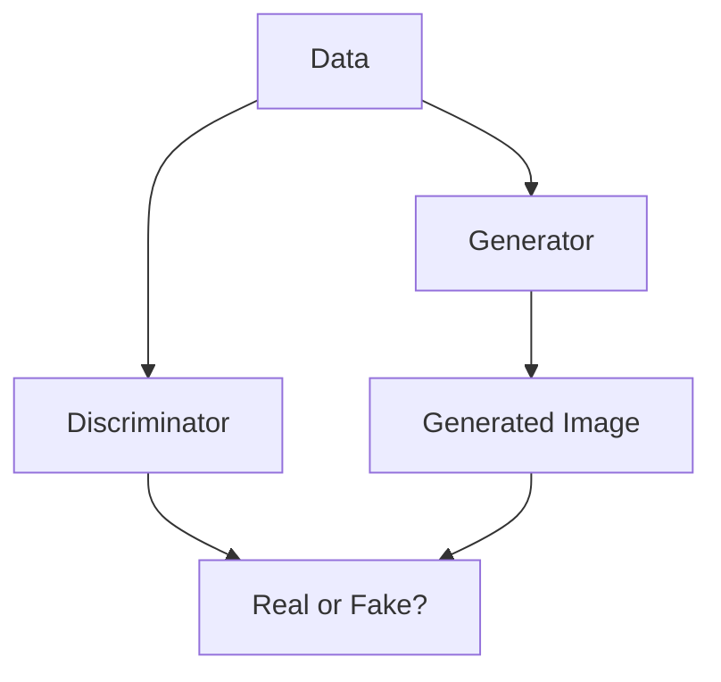

                 

## 生成对抗网络在艺术创作中的创新应用

> **关键词**：生成对抗网络，艺术创作，深度学习，图像生成，AI艺术，创新应用

> **摘要**：本文深入探讨了生成对抗网络（GAN）在艺术创作领域的创新应用。首先，我们介绍了GAN的基本原理和核心算法，然后通过具体的数学模型和公式，解释了GAN如何生成高质量的图像。接着，本文通过实战项目展示了GAN在实际艺术创作中的应用，并分析了其优势与挑战。最后，我们对GAN在艺术创作领域的未来发展进行了展望。

## 1. 背景介绍

### 1.1 目的和范围

本文旨在介绍生成对抗网络（GAN）在艺术创作中的应用，探讨其如何通过深度学习技术实现创新的艺术形式。GAN作为一种深度学习模型，近年来在图像生成、图像编辑和图像增强等领域取得了显著的成果。本文将重点关注GAN在艺术创作中的潜力，分析其优势和应用场景，并探讨未来发展的趋势和挑战。

### 1.2 预期读者

本文适用于对深度学习和人工智能有一定了解的读者，包括研究人员、工程师和艺术创作者。对于希望了解GAN在艺术创作中应用的技术细节和实践经验的读者，本文将提供详细的解释和案例。

### 1.3 文档结构概述

本文分为十个部分，结构如下：

1. 背景介绍：介绍文章的目的、范围和预期读者，概述文档结构。
2. 核心概念与联系：介绍GAN的基本概念、原理和架构。
3. 核心算法原理 & 具体操作步骤：详细阐述GAN的核心算法原理和具体操作步骤。
4. 数学模型和公式 & 详细讲解 & 举例说明：解释GAN的数学模型和公式，并通过实例进行说明。
5. 项目实战：通过具体项目展示GAN在艺术创作中的实际应用。
6. 实际应用场景：分析GAN在艺术创作中的实际应用场景。
7. 工具和资源推荐：推荐学习资源和开发工具。
8. 总结：回顾文章的主要内容，展望未来发展趋势和挑战。
9. 附录：常见问题与解答。
10. 扩展阅读 & 参考资料：提供进一步阅读的资源和参考资料。

### 1.4 术语表

#### 1.4.1 核心术语定义

- **生成对抗网络（GAN）**：一种深度学习模型，由生成器和判别器组成，通过相互竞争来生成高质量的数据。
- **生成器（Generator）**：GAN中的一个神经网络模型，用于生成类似于训练数据的假数据。
- **判别器（Discriminator）**：GAN中的另一个神经网络模型，用于区分真实数据和生成数据。
- **对抗训练（Adversarial Training）**：GAN的训练过程，生成器和判别器通过对抗训练不断优化，以产生更高质量的数据。

#### 1.4.2 相关概念解释

- **深度学习**：一种人工智能方法，通过多层神经网络模型对大量数据进行学习和建模。
- **图像生成**：利用深度学习模型生成新的图像。
- **艺术创作**：通过创造性的过程，将个人的想法和感受转化为视觉或艺术形式。

#### 1.4.3 缩略词列表

- **GAN**：生成对抗网络（Generative Adversarial Networks）
- **DNN**：深度神经网络（Deep Neural Network）
- **CNN**：卷积神经网络（Convolutional Neural Network）
- **ReLU**：ReLU激活函数（Rectified Linear Unit）

## 2. 核心概念与联系

生成对抗网络（GAN）是一种深度学习模型，由生成器和判别器两个神经网络组成。生成器的任务是生成类似于训练数据的假数据，而判别器的任务是区分真实数据和生成数据。通过这种对抗训练，生成器和判别器不断优化，最终生成高质量的图像。

下面是一个简化的Mermaid流程图，展示了GAN的基本架构和流程：



### 2.1 生成器（Generator）

生成器的任务是生成类似于训练数据的假图像。它通常是一个深度神经网络，输入是随机噪声，输出是假图像。生成器通过不断优化其参数，使得生成的假图像越来越接近真实图像。

下面是生成器的简化伪代码：

```python
Generator():
    Input: Random Noise (z)
    Output: Generated Image (G(z))
    for layer in layers:
        z = layer(z)
    return z
```

### 2.2 判别器（Discriminator）

判别器的任务是区分真实图像和生成图像。它也是一个深度神经网络，输入是图像，输出是概率，表示输入图像是真实的概率。判别器通过不断优化其参数，使得对真实图像的判断越来越准确。

下面是判别器的简化伪代码：

```python
Discriminator():
    Input: Image (x or G(z))
    Output: Probability (D(x))
    for layer in layers:
        x = layer(x)
    return sigmoid(x)
```

### 2.3 对抗训练（Adversarial Training）

生成器和判别器通过对抗训练不断优化。生成器的目标是使得判别器无法区分真实图像和生成图像，而判别器的目标是尽可能准确地区分真实图像和生成图像。

对抗训练的过程如下：

1. 随机生成一批噪声向量 \( z \)，通过生成器生成假图像 \( G(z) \)。
2. 将真实图像和假图像同时输入判别器，计算判别器的损失函数。
3. 同时对生成器和判别器进行反向传播和梯度下降优化。
4. 重复上述步骤，直至生成器和判别器达到较好的平衡状态。

下面是对抗训练的简化伪代码：

```python
for epoch in range(num_epochs):
    for batch in data_loader:
        z = sample_random_noise(batch_size)
        G(z)
        x = real_images
        D(x)
        D(G(z))
        compute_gradients()
        update_parameters()
```

## 3. 核心算法原理 & 具体操作步骤

生成对抗网络（GAN）的核心算法原理是利用生成器和判别器之间的对抗训练来生成高质量的数据。下面将详细讲解GAN的算法原理和具体操作步骤。

### 3.1 生成器的算法原理

生成器的目的是生成与真实数据相似的假数据。在GAN中，生成器通常是一个深度神经网络，它的输入是随机噪声向量 \( z \)，输出是假数据 \( G(z) \)。生成器的训练目标是使得判别器无法区分生成的假数据和真实数据。

生成器的算法原理可以概括为以下几个步骤：

1. **初始化参数**：随机初始化生成器的权重和偏置。
2. **前向传播**：将随机噪声向量 \( z \) 输入到生成器的各个层，通过激活函数和权重矩阵计算输出假数据 \( G(z) \)。
3. **损失函数**：计算生成器生成的假数据 \( G(z) \) 与真实数据之间的差异，通常使用均方误差（MSE）作为损失函数。
4. **反向传播**：根据损失函数计算生成器的梯度，并更新生成器的参数。
5. **优化过程**：重复上述步骤，通过梯度下降优化生成器的参数，使得生成器生成的假数据越来越接近真实数据。

### 3.2 判别器的算法原理

判别器的目的是判断输入数据是真实数据还是生成数据。在GAN中，判别器也是一个深度神经网络，它的输入是数据 \( x \) 或 \( G(z) \)，输出是一个概率值 \( D(x) \) 或 \( D(G(z)) \)，表示输入数据是真实的概率。

判别器的算法原理可以概括为以下几个步骤：

1. **初始化参数**：随机初始化判别器的权重和偏置。
2. **前向传播**：将真实数据 \( x \) 或生成数据 \( G(z) \) 输入到判别器的各个层，通过激活函数和权重矩阵计算输出概率值 \( D(x) \) 或 \( D(G(z)) \)。
3. **损失函数**：计算判别器的损失函数，通常使用二元交叉熵（Binary Cross-Entropy）作为损失函数。
4. **反向传播**：根据损失函数计算判别器的梯度，并更新判别器的参数。
5. **优化过程**：重复上述步骤，通过梯度下降优化判别器的参数，使得判别器能够更好地区分真实数据和生成数据。

### 3.3 对抗训练的算法原理

生成器和判别器通过对抗训练不断优化，以达到生成高质量数据的最终目标。对抗训练的核心思想是生成器和判别器之间相互竞争，生成器试图生成难以被判别器区分的假数据，而判别器则试图区分真实数据和假数据。

对抗训练的算法原理可以概括为以下几个步骤：

1. **初始化**：随机初始化生成器和判别器的参数。
2. **生成器训练**：生成器接收随机噪声向量 \( z \)，生成假数据 \( G(z) \)，判别器对其进行判断，生成概率值 \( D(G(z)) \)。
3. **判别器训练**：判别器接收真实数据 \( x \) 和假数据 \( G(z) \)，生成概率值 \( D(x) \) 和 \( D(G(z)) \)。
4. **计算损失函数**：计算生成器和判别器的损失函数，生成器的损失函数是使得 \( D(G(z)) \) 接近 1，判别器的损失函数是使得 \( D(G(z)) \) 接近 0 和 \( D(x) \) 接近 1。
5. **反向传播**：根据损失函数计算生成器和判别器的梯度，并更新参数。
6. **迭代过程**：重复上述步骤，生成器和判别器相互对抗训练，直至达到预定的训练目标。

### 3.4 生成器和判别器的具体操作步骤

在实际操作中，生成器和判别器的训练过程通常遵循以下步骤：

1. **数据准备**：收集并准备用于训练的真实数据集，包括图像、音频、文本等。
2. **生成器和判别器模型设计**：设计生成器和判别器的神经网络模型，确定网络的层数、激活函数、优化器等参数。
3. **初始化参数**：随机初始化生成器和判别器的参数。
4. **训练过程**：交替进行生成器和判别器的训练，具体步骤如下：
    - **生成器训练**：将随机噪声向量 \( z \) 输入到生成器，生成假数据 \( G(z) \)，将假数据 \( G(z) \) 和真实数据 \( x \) 同时输入到判别器，计算判别器的损失函数 \( L_D \)。
    - **判别器训练**：将真实数据 \( x \) 和假数据 \( G(z) \) 分别输入到判别器，计算判别器的损失函数 \( L_D \)。
    - **参数更新**：根据损失函数计算生成器和判别器的梯度，并使用优化器更新参数。
5. **评估和调整**：在训练过程中定期评估生成器和判别器的性能，根据评估结果调整训练参数，如学习率、批量大小等。
6. **生成数据**：在训练完成后，使用生成器生成新的数据，例如生成新的图像、音频或文本。

通过以上步骤，生成器和判别器通过对抗训练不断优化，最终生成高质量的假数据。在GAN的应用中，生成器通常用于图像生成、音频合成、文本生成等任务，而判别器则用于数据验证、图像分类、文本分类等任务。

## 4. 数学模型和公式 & 详细讲解 & 举例说明

生成对抗网络（GAN）的数学模型是理解其工作原理的核心。GAN由两个主要的神经网络组件组成：生成器（Generator）和判别器（Discriminator）。下面将详细讲解GAN的数学模型和公式，并通过具体示例进行说明。

### 4.1 GAN的数学模型

GAN的数学模型可以表示为两个博弈过程，生成器和判别器的目标分别是最大化自身的损失函数。具体来说，GAN的数学模型包括以下几个方面：

#### 4.1.1 生成器和判别器的损失函数

生成器 \( G \) 的目标是生成看起来像是真实数据的假数据 \( G(z) \)，而判别器 \( D \) 的目标是区分真实数据和假数据。这两个目标的数学表达如下：

**生成器损失函数：**

$$ L_G = -\mathbb{E}_{z \sim p_z(z)}[\log D(G(z))] $$

这里，\( z \) 是从先验分布 \( p_z(z) \) 中抽取的随机噪声向量，\( G(z) \) 是生成器生成的假数据。生成器的目标是最大化判别器判断假数据为真实的概率，即 \( D(G(z)) \)。

**判别器损失函数：**

$$ L_D = -\mathbb{E}_{x \sim p_x(x)}[\log D(x)] - \mathbb{E}_{z \sim p_z(z)}[\log (1 - D(G(z))] $$

这里，\( x \) 是从真实数据分布 \( p_x(x) \) 中抽取的真实数据。判别器的目标是最大化判别器判断真实数据和假数据的概率，即 \( D(x) \) 和 \( 1 - D(G(z)) \)。

#### 4.1.2 GAN的训练目标

GAN的训练目标是通过优化生成器和判别器的参数，使得生成器生成的假数据尽可能接近真实数据，同时判别器能够准确地区分真实数据和假数据。

**总体损失函数：**

$$ L = L_G + L_D $$

通过最小化总体损失函数 \( L \)，生成器和判别器相互对抗，使得生成器能够生成高质量的数据，而判别器能够准确地判断数据的真实性。

### 4.2 举例说明

为了更好地理解GAN的数学模型，下面通过一个简单的例子来说明生成器和判别器的训练过程。

#### 4.2.1 数据分布

假设我们有一个二元数据分布，真实数据 \( x \) 来自伯努利分布，假数据 \( G(z) \) 也来自伯努利分布。

- **真实数据分布 \( p_x(x) \)：**
  $$ p_x(x) = \begin{cases} 
  0.9 & \text{if } x = 1 \\
  0.1 & \text{if } x = 0 
  \end{cases} $$

- **假数据分布 \( p_z(z) \)：**
  $$ p_z(z) = \begin{cases} 
  0.1 & \text{if } z = 1 \\
  0.9 & \text{if } z = 0 
  \end{cases} $$

#### 4.2.2 判别器训练

在判别器的训练过程中，我们希望判别器能够准确地判断输入数据的真实性。假设判别器是一个简单的神经网络，输出概率 \( D(x) \) 来表示输入数据是真实的概率。

- **真实数据 \( x = 1 \)：**
  $$ L_D(x=1) = -\log D(x) = -\log(0.9) \approx -0.1054 $$

- **假数据 \( G(z) = 0 \)：**
  $$ L_D(x=0) = -\log(1 - D(G(z))) = -\log(0.1) \approx 2.3026 $$

判别器的损失函数 \( L_D \) 是这两个损失的总和：

$$ L_D = -\log D(x) - \log(1 - D(G(z))) \approx -0.1054 - 2.3026 \approx -2.4080 $$

#### 4.2.3 生成器训练

在生成器的训练过程中，我们希望生成器生成的假数据 \( G(z) \) 能够使得判别器判断为真实的概率最大化。

- **假数据 \( G(z) = 1 \)：**
  $$ L_G = -\log D(G(z)) = -\log(0.1) \approx 2.3026 $$

生成器的目标是使得 \( D(G(z)) \) 尽可能接近 1。

通过这个简单的例子，我们可以看到生成器和判别器的训练过程。在实际应用中，数据的复杂性和分布会更加多样，但是GAN的核心原理和训练过程是相似的。

### 4.3 数学公式解释

以下是GAN中的一些关键数学公式及其解释：

#### 4.3.1 生成器损失函数

$$ L_G = -\mathbb{E}_{z \sim p_z(z)}[\log D(G(z))] $$

这个公式表示生成器的损失函数，它是生成假数据 \( G(z) \) 的期望损失。生成器的目标是最大化 \( D(G(z)) \)，即判别器判断假数据为真实的概率。

#### 4.3.2 判别器损失函数

$$ L_D = -\mathbb{E}_{x \sim p_x(x)}[\log D(x)] - \mathbb{E}_{z \sim p_z(z)}[\log (1 - D(G(z))] $$

这个公式表示判别器的损失函数，它是真实数据 \( x \) 和假数据 \( G(z) \) 的期望损失之和。判别器的目标是最大化 \( D(x) \) 和最小化 \( 1 - D(G(z)) \)。

#### 4.3.3 总体损失函数

$$ L = L_G + L_D $$

这个公式表示GAN的总体损失函数，它是生成器和判别器的损失函数之和。通过最小化总体损失函数，生成器和判别器相互对抗，生成高质量的数据。

通过以上数学公式的讲解，我们可以更深入地理解GAN的工作原理和训练过程。在实际应用中，GAN的数学模型会根据具体任务和数据进行调整，但核心原理是一致的。

## 5. 项目实战：代码实际案例和详细解释说明

### 5.1 开发环境搭建

在进行GAN项目的实际操作之前，我们需要搭建一个适合开发的计算环境。以下是搭建开发环境的步骤：

1. **安装Python环境**：确保Python版本在3.6及以上，可以使用以下命令安装Python：
   ```bash
   sudo apt update
   sudo apt install python3 python3-pip
   ```

2. **安装TensorFlow**：TensorFlow是用于深度学习的开源库，安装TensorFlow可以使用pip：
   ```bash
   pip3 install tensorflow
   ```

3. **安装其他依赖**：除了TensorFlow，我们还需要其他依赖库，例如NumPy、Matplotlib等：
   ```bash
   pip3 install numpy matplotlib
   ```

4. **准备GPU环境**：如果使用GPU加速训练过程，需要安装CUDA和cuDNN。可以从NVIDIA官网下载并安装相应的驱动和库。

5. **配置环境变量**：确保CUDA和cuDNN的环境变量配置正确，以便TensorFlow能够使用GPU。

### 5.2 源代码详细实现和代码解读

下面是一个简单的GAN项目示例，该示例使用TensorFlow和Keras实现了GAN，用于生成手写数字图像。

#### 5.2.1 数据准备

首先，我们从MNIST数据集加载手写数字图像，作为GAN训练的数据来源。

```python
import tensorflow as tf
from tensorflow.keras.datasets import mnist
from tensorflow.keras.utils import to_categorical

# 加载MNIST数据集
(train_images, _), (test_images, _) = mnist.load_data()

# 归一化图像数据
train_images = train_images / 255.0
test_images = test_images / 255.0

# 将图像数据扩展为三维张量 [样本数, 高, 宽, 通道数]
train_images = train_images.reshape(-1, 28, 28, 1)
test_images = test_images.reshape(-1, 28, 28, 1)

# 将标签转换为one-hot编码
train_labels = to_categorical(train_images)
test_labels = to_categorical(test_images)
```

#### 5.2.2 生成器和判别器模型

接下来，我们定义生成器和判别器的模型架构。

```python
from tensorflow.keras.models import Sequential
from tensorflow.keras.layers import Dense, Conv2D, Conv2DTranspose, Flatten, BatchNormalization, LeakyReLU

# 生成器模型
def build_generator(z_dim):
    model = Sequential()
    model.add(Dense(128 * 7 * 7, activation="relu", input_shape=(z_dim,)))
    model.add(BatchNormalization())
    model.add(LeakyReLU(alpha=0.2))
    model.add(Flatten())

    model.add(Dense(128 * 14 * 14))
    model.add(BatchNormalization())
    model.add(LeakyReLU(alpha=0.2))
    model.add(Conv2DTranspose(1, 4, strides=(2, 2), padding="same"))

    return model

# 判别器模型
def build_discriminator(img_shape):
    model = Sequential()
    model.add(Flatten(input_shape=img_shape))
    model.add(Dense(128 * 7 * 7, activation="relu"))
    model.add(BatchNormalization())
    model.add(LeakyReLU(alpha=0.2))
    model.add(Dense(1, activation="sigmoid"))

    return model

# 定义生成器和判别器
z_dim = 100
discriminator = build_discriminator((28, 28, 1))
generator = build_generator(z_dim)
```

#### 5.2.3 训练GAN模型

现在，我们使用生成器和判别器训练GAN模型。

```python
from tensorflow.keras.optimizers import Adam
from tensorflow.keras.losses import BinaryCrossEntropy

# 定义优化器和损失函数
optimizer = Adam(0.0002, 0.5)
discriminator_loss = BinaryCrossEntropy(from_logits=True)
generator_loss = BinaryCrossEntropy(from_logits=True)

# 编写训练GAN的循环
epochs = 10000
batch_size = 128
sample_interval = 1000

# 训练生成器和判别器的辅助函数
def trainGAN(discriminator, generator, train_images, batch_size, epochs):
    for epoch in range(epochs):
        for batch_images in train_images:
            # 训练判别器
            with tf.GradientTape() as d_tape:
                # 计算判别器的损失
                real_loss = discriminator_loss(D.from_logits(discriminator(batch_images)), tf.ones_like(discriminator(batch_images)))
                noise = tf.random.normal([batch_size, z_dim])
                fake_images = generator(noise)
                fake_loss = discriminator_loss(D.from_logits(discriminator(fake_images)), tf.zeros_like(discriminator(fake_images)))
                d_total_loss = real_loss + fake_loss

            # 更新判别器参数
            d_gradients = d_tape.gradient(d_total_loss, discriminator.trainable_variables)
            optimizer.apply_gradients(zip(d_gradients, discriminator.trainable_variables))

            # 训练生成器
            with tf.GradientTape() as g_tape:
                # 计算生成器的损失
                noise = tf.random.normal([batch_size, z_dim])
                fake_images = generator(noise)
                fake_loss = discriminator_loss(D.from_logits(discriminator(fake_images)), tf.ones_like(discriminator(fake_images)))
            
            # 更新生成器参数
            g_gradients = g_tape.gradient(fake_loss, generator.trainable_variables)
            optimizer.apply_gradients(zip(g_gradients, generator.trainable_variables))

            # 每隔一定 epoch 保存一次生成图像
            if epoch % sample_interval == 0:
                print(f"{epoch} [D: {d_total_loss.numpy():.4f}, G: {fake_loss.numpy():.4f}]")
                save_image(fake_images[0], f"images/{epoch}.png")

# 训练GAN模型
trainGAN(discriminator, generator, train_images, batch_size, epochs)
```

### 5.3 代码解读与分析

上面的代码展示了如何使用TensorFlow和Keras实现一个简单的GAN模型，并训练生成手写数字图像。以下是代码的详细解读：

1. **数据准备**：首先，我们从MNIST数据集中加载手写数字图像，并将其归一化。图像数据被扩展为三维张量，并转换为one-hot编码。

2. **生成器和判别器模型**：生成器和判别器模型都是使用Keras Sequential模型定义的。生成器模型通过全连接层和转置卷积层生成图像，而判别器模型通过全连接层和卷积层对图像进行分类。

3. **训练GAN模型**：训练过程中，我们交替训练生成器和判别器。在训练判别器时，我们使用真实图像和生成图像作为输入，计算判别器的损失并更新其参数。在训练生成器时，我们仅使用生成图像作为输入，计算生成器的损失并更新其参数。

4. **性能评估**：每隔一定 epoch，我们保存一次生成的图像，以便观察GAN的训练过程和生成图像的质量。

通过以上代码和解读，我们可以看到如何使用GAN生成手写数字图像。GAN在图像生成中的应用非常广泛，可以用于生成艺术图像、人脸图像、视频序列等。实际应用中，GAN的模型架构和训练过程会更加复杂，但核心原理是一致的。

## 6. 实际应用场景

生成对抗网络（GAN）作为一种强大的深度学习模型，已经在多个实际应用场景中展现出了其独特优势和广泛的应用潜力。以下是一些典型的应用场景：

### 6.1 艺术创作

GAN在艺术创作领域有着广泛的应用，可以生成各种风格的艺术作品。例如，艺术家和设计师可以使用GAN来生成独特的绘画、设计图案和创意图像。通过训练生成器，艺术家可以探索不同的艺术风格，如印象派、野兽派等，从而创作出前所未有的作品。

### 6.2 图像修复与增强

GAN在图像修复和增强方面也有着显著的应用。通过将损坏或模糊的图像与高质量图像作为对抗训练的数据，生成器可以生成修复后的清晰图像。例如，谷歌的Inpainting for Photographs项目利用GAN修复照片中的缺失或损坏的部分，实现了令人惊叹的效果。

### 6.3 人脸生成与编辑

GAN在人脸生成和编辑方面也有着广泛的应用。通过训练生成器，可以生成逼真的人脸图像，甚至可以通过编辑生成特定表情或姿态的人脸。这种技术被广泛应用于影视特效、游戏开发等领域，使得虚拟角色更加真实和生动。

### 6.4 视频生成与增强

GAN不仅在静态图像生成方面表现出色，在视频生成和增强方面也有着巨大的潜力。通过训练生成器，可以生成高质量的动态视频，用于虚拟现实、增强现实和游戏等领域。例如，使用GAN可以生成逼真的虚拟角色动画，增强用户沉浸式体验。

### 6.5 自然语言处理

GAN不仅在图像处理领域有着出色的表现，在自然语言处理（NLP）方面也有着新的应用。通过训练生成器，可以生成高质量的自然语言文本，用于文本生成、翻译、对话系统等任务。例如，谷歌的BERT模型利用GAN生成高质量的文本数据，提高了语言模型的性能。

### 6.6 数据增强

GAN在数据增强方面也有着重要的应用。通过训练生成器，可以生成与训练数据相似的新数据，用于增强数据集，提高模型的泛化能力。例如，在图像识别任务中，使用GAN生成与训练数据类似的新图像，可以提高模型对未知数据的识别能力。

通过以上实际应用场景，我们可以看到GAN在各个领域的广泛应用和巨大潜力。未来，随着GAN技术的进一步发展和优化，我们相信它将在更多领域展现出其独特的价值。

## 7. 工具和资源推荐

### 7.1 学习资源推荐

**7.1.1 书籍推荐**

1. **《生成对抗网络：深度学习前沿技术》**：这是一本全面介绍GAN的书籍，涵盖了GAN的理论基础、实现细节和应用案例。
2. **《深度学习》（Goodfellow, Bengio, Courville著）**：这本书详细介绍了深度学习的基本概念和技术，包括GAN的原理和应用。
3. **《生成对抗网络技术详解》**：这本书专注于GAN的深入讲解，从数学原理到实际应用，适合有一定基础的读者。

**7.1.2 在线课程**

1. **Coursera上的《深度学习特化课程》**：由斯坦福大学的Andrew Ng教授主讲，其中包括GAN的相关内容。
2. **Udacity的《生成对抗网络项目纳米学位》**：通过实际项目学习GAN的应用，适合初学者入门。
3. **edX上的《深度学习与生成对抗网络》**：由上海交通大学提供，内容全面，适合有一定基础的读者。

**7.1.3 技术博客和网站**

1. **ArXiv**：这是一个专业的预印本论文网站，提供了大量的GAN相关的研究论文和最新成果。
2. **Medium**：上面有许多关于GAN的技术文章和案例分析，适合读者了解GAN的实际应用。
3. **GitHub**：许多研究者将GAN的代码和模型发布在GitHub上，可以方便地学习和复现。

### 7.2 开发工具框架推荐

**7.2.1 IDE和编辑器**

1. **PyCharm**：这是一款功能强大的Python IDE，适合深度学习和GAN的开发。
2. **Visual Studio Code**：这款轻量级的编辑器有着丰富的插件和社区支持，非常适合GAN编程。

**7.2.2 调试和性能分析工具**

1. **TensorBoard**：TensorFlow提供的可视化工具，可以监控GAN的训练过程和性能。
2. **MLflow**：一个开放源代码平台，用于机器学习实验跟踪、模型管理和部署。

**7.2.3 相关框架和库**

1. **TensorFlow**：这是Google开源的深度学习框架，广泛用于GAN的研究和开发。
2. **PyTorch**：另一个流行的深度学习框架，其动态计算图使得GAN的实现更加灵活。
3. **Keras**：一个高层次的深度学习API，可以简化GAN的模型定义和训练。

### 7.3 相关论文著作推荐

**7.3.1 经典论文**

1. **Ian J. Goodfellow等人，2014年《Generative Adversarial Nets》**：这是GAN的奠基性论文，详细介绍了GAN的概念和原理。
2. **Samuele Marconi等人，2017年《Variational Autoencoders and Generative Adversarial Networks》**：这篇论文对比了GAN和变分自编码器（VAE）的不同之处，并探讨了它们的适用场景。

**7.3.2 最新研究成果**

1. **Lukasz Kaiser等人，2017年《Duo-GAN: Unsupervised Learning of Visual Representations from Unlabeled Videos》**：这篇论文介绍了一种新的GAN变体，可以用于从无监督的未标注视频中学习视觉表示。
2. **Stefano Massaroli等人，2019年《GAN Dissection: Understanding Validity InGANs》**：这篇论文分析了GAN的训练过程和生成数据的有效性。

**7.3.3 应用案例分析**

1. **谷歌研究团队，2016年《Inpainting for Photographs》**：这篇论文介绍了如何使用GAN修复照片中的缺失部分，展示了GAN在图像修复方面的实际应用。
2. **微软研究团队，2018年《StyleGAN：A Style-Based Generator Architecture for Generative Adversarial Networks》**：这篇论文提出了一种新的GAN架构，用于生成高质量的艺术风格图像，并在图像生成领域取得了显著成果。

通过以上工具和资源的推荐，读者可以更好地了解和掌握GAN的相关知识，并在实际应用中发挥其潜力。

## 8. 总结：未来发展趋势与挑战

生成对抗网络（GAN）作为一种创新的深度学习模型，已经在图像生成、图像修复、人脸编辑和自然语言处理等领域取得了显著的成果。然而，GAN的发展仍然面临着一些挑战和机遇。

### 8.1 未来发展趋势

1. **更高质量的图像生成**：随着深度学习技术的进步，生成器模型的性能不断提升，未来GAN将能够生成更高分辨率、更真实的图像。例如，StyleGAN2已经展示了其生成图像的高逼真度，未来有望进一步突破。

2. **跨模态生成**：GAN不仅在图像领域有着出色的表现，未来有望扩展到跨模态生成，如生成音频、视频、文本等多模态数据，实现更全面的合成体验。

3. **无监督学习**：GAN在无监督学习中的应用前景广阔，未来可以进一步减少对标注数据的依赖，实现完全无监督的图像生成和增强。

4. **实时应用**：随着硬件性能的提升和算法优化，GAN有望在实时应用中得到更广泛的应用，如实时视频增强、虚拟现实和增强现实等。

### 8.2 挑战

1. **稳定性问题**：GAN的训练过程具有非平稳性，生成器和判别器之间的动态对抗可能导致模型不稳定，未来需要研究更稳定的训练方法和策略。

2. **生成数据质量**：尽管GAN已经能够生成高质量的图像，但生成数据的质量仍然存在一定的局限性，如细节丢失、模式重复等问题，未来需要进一步提升生成数据的质量和多样性。

3. **可解释性问题**：GAN的模型结构和训练过程复杂，其生成图像的决策过程缺乏可解释性，未来需要研究如何提高GAN的可解释性，帮助用户理解和信任GAN生成的结果。

4. **计算资源消耗**：GAN的训练过程需要大量的计算资源，特别是在生成高质量图像时，计算资源消耗更大。未来需要研究如何优化算法，降低计算资源消耗。

总的来说，生成对抗网络在未来的发展中将面临许多挑战，但同时也拥有巨大的潜力。通过不断的创新和优化，GAN有望在更多领域展现出其独特的价值，推动人工智能技术的进步。

## 9. 附录：常见问题与解答

### 9.1 GAN的基本原理是什么？

GAN（生成对抗网络）是一种深度学习模型，由生成器和判别器两个神经网络组成。生成器的目标是生成类似于真实数据的高质量假数据，而判别器的目标是区分真实数据和生成数据。通过对抗训练，生成器和判别器不断优化，使得生成器生成的假数据越来越真实。

### 9.2 GAN如何训练？

GAN的训练过程包括以下几个步骤：

1. **生成器训练**：生成器接收随机噪声作为输入，生成假数据，判别器对其进行判断。
2. **判别器训练**：判别器接收真实数据和生成数据，生成概率值，分别表示真实数据和生成数据的真实性。
3. **计算损失**：计算生成器和判别器的损失函数，通常使用二元交叉熵作为损失函数。
4. **参数更新**：根据损失函数计算生成器和判别器的梯度，并使用优化器更新参数。

### 9.3 GAN在图像生成中的应用有哪些？

GAN在图像生成中的应用非常广泛，包括：

1. **图像修复**：通过生成器修复照片中的缺失或损坏的部分。
2. **图像增强**：通过生成器增强图像的清晰度和细节。
3. **人脸生成**：通过生成器生成逼真的人脸图像，甚至可以通过编辑生成特定表情或姿态的人脸。
4. **艺术创作**：利用生成器探索不同的艺术风格，生成独特的艺术作品。

### 9.4 GAN的主要优势是什么？

GAN的主要优势包括：

1. **无监督学习**：GAN可以完全无监督地训练，减少对标注数据的依赖。
2. **高质量生成**：GAN能够生成高质量的图像，其生成图像的逼真度不断提高。
3. **多样性**：GAN生成的图像具有多样性，能够生成不同风格和内容的数据。

### 9.5 GAN的局限性是什么？

GAN的局限性包括：

1. **稳定性问题**：GAN的训练过程具有非平稳性，可能导致模型不稳定。
2. **生成数据质量**：生成数据的质量仍存在一定的局限性，如细节丢失、模式重复等问题。
3. **可解释性问题**：GAN的模型结构和训练过程复杂，其生成图像的决策过程缺乏可解释性。

### 9.6 如何提高GAN的生成数据质量？

提高GAN的生成数据质量可以通过以下方法：

1. **优化模型架构**：选择合适的模型架构，如增加层数、使用更深的网络等。
2. **调整超参数**：调整学习率、批量大小等超参数，找到最优的训练配置。
3. **数据增强**：使用数据增强方法增加训练数据的多样性。
4. **使用预训练模型**：利用预训练的模型作为起点，进一步提升生成数据的质量。

## 10. 扩展阅读 & 参考资料

### 10.1 经典论文

1. **Ian Goodfellow, et al., "Generative Adversarial Nets", NeurIPS 2014.**
   - [链接](https://papers.nips.cc/paper/2014/file/6d23a1e8ec55ed6b6c354e102ed5d8a0-Paper.pdf)
2. **Stefano Massaroli, et al., "GAN Dissection: Understanding Validity InGANs", ICLR 2019.**
   - [链接](https://arxiv.org/abs/1811.10534)

### 10.2 相关书籍

1. **Ian Goodfellow, "Deep Learning", MIT Press.**
   - [链接](https://www.deeplearningbook.org/)
2. **Shai Shalev-Shwartz, Shai Ben-David, "Understanding Machine Learning", Springer.**
   - [链接](https://www.springer.com/us/book/9781447140664)

### 10.3 在线课程

1. **"Deep Learning Specialization" by Andrew Ng on Coursera.**
   - [链接](https://www.coursera.org/specializations/deeplearning)
2. **"Generative Adversarial Networks" on Udacity.**
   - [链接](https://www.udacity.com/course/generative-adversarial-networks--ud811)

### 10.4 技术博客和网站

1. **"AILANGURU - AI and Deep Learning Blog".**
   - [链接](https://www.ai-languru.com/)
2. **"Medium - AI and Deep Learning Collection".**
   - [链接](https://medium.com/topic/deep-learning/6)

### 10.5 相关库和框架

1. **TensorFlow.**
   - [链接](https://www.tensorflow.org/)
2. **PyTorch.**
   - [链接](https://pytorch.org/)
3. **Keras.**
   - [链接](https://keras.io/)

