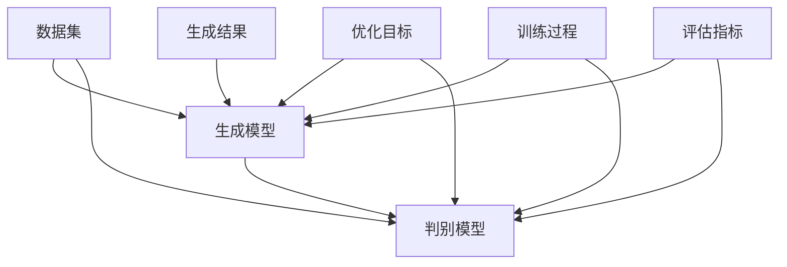

                 

# 生成式 AI：数据集的未来

> **关键词：生成式AI、数据集、深度学习、算法原理、数学模型、实战案例、应用场景**
>
> **摘要：本文深入探讨了生成式AI的核心概念、算法原理、数学模型及其在现实世界中的应用。通过详细分析和实例展示，揭示了数据集在未来AI发展中的关键作用，为读者提供了丰富的实战经验和学习资源。**

## 1. 背景介绍

### 1.1 目的和范围

本文旨在探讨生成式AI在数据集构建中的应用，分析其核心概念、算法原理、数学模型以及实际操作步骤。通过梳理生成式AI的发展历程，探讨其潜在的未来趋势和挑战，帮助读者理解这一前沿技术的本质和实际应用。

### 1.2 预期读者

本文适合具备一定计算机科学基础，尤其是对深度学习和生成模型感兴趣的读者。无论是AI从业者、研究人员，还是对AI技术感兴趣的技术爱好者，都可以通过本文获得深入理解和实战经验。

### 1.3 文档结构概述

本文分为十个部分：

1. 背景介绍
2. 核心概念与联系
3. 核心算法原理 & 具体操作步骤
4. 数学模型和公式 & 详细讲解 & 举例说明
5. 项目实战：代码实际案例和详细解释说明
6. 实际应用场景
7. 工具和资源推荐
8. 总结：未来发展趋势与挑战
9. 附录：常见问题与解答
10. 扩展阅读 & 参考资料

### 1.4 术语表

#### 1.4.1 核心术语定义

- **生成式AI**：一种能够生成数据、图像、文本等信息的AI技术。
- **数据集**：用于训练、评估和优化机器学习模型的预定义数据集合。
- **深度学习**：一种基于多层神经网络的学习方法，能够自动提取数据的特征。
- **生成模型**：一种能够生成与训练数据相似的新数据的机器学习模型。

#### 1.4.2 相关概念解释

- **生成对抗网络（GAN）**：一种生成模型，由生成器和判别器两个神经网络组成，通过对抗训练生成与真实数据相似的数据。
- **变分自编码器（VAE）**：一种生成模型，通过编码器和解码器两个神经网络将数据编码为低维表示，并解码生成新的数据。

#### 1.4.3 缩略词列表

- **GAN**：生成对抗网络
- **VAE**：变分自编码器
- **DL**：深度学习
- **AI**：人工智能

## 2. 核心概念与联系

为了更好地理解生成式AI，我们需要先了解其核心概念和联系。以下是一个Mermaid流程图，展示了生成式AI的基本组成部分。



### 2.1 生成模型与判别模型

生成模型和判别模型是生成式AI的两个核心组成部分。生成模型负责生成与训练数据相似的新数据，而判别模型则负责判断生成数据是否真实。这两个模型通过对抗训练相互制约，共同优化生成质量。

### 2.2 数据集

数据集是生成式AI的基础。高质量的训练数据集能够提高生成模型的生成质量，而丰富的数据集可以帮助判别模型更好地区分真实数据和生成数据。

### 2.3 优化目标

生成模型和判别模型的优化目标是最大化生成模型的生成质量，同时最小化判别模型对生成数据的判断误差。

### 2.4 训练过程

生成式AI的训练过程通常包括以下几个步骤：

1. 初始化生成模型和判别模型。
2. 使用训练数据集对判别模型进行预训练。
3. 使用生成模型和判别模型进行对抗训练。
4. 持续优化生成模型，直到生成数据质量达到预期。

### 2.5 生成结果与评估指标

生成式AI的生成结果通常需要通过评估指标进行质量评估。常见的评估指标包括生成数据的多样性、真实度、质量等。通过评估指标，我们可以判断生成模型的性能，并进一步优化模型。

## 3. 核心算法原理 & 具体操作步骤

生成式AI的核心算法主要包括生成对抗网络（GAN）和变分自编码器（VAE）。下面，我们将分别介绍这两种算法的原理和具体操作步骤。

### 3.1 生成对抗网络（GAN）

生成对抗网络（GAN）由生成器（Generator）和判别器（Discriminator）两个神经网络组成。生成器负责生成与真实数据相似的新数据，判别器则负责判断生成数据是否真实。

#### 3.1.1 算法原理

GAN的算法原理可以概括为以下步骤：

1. 初始化生成器G和判别器D。
2. 判别器D通过训练数据集进行预训练，使其能够准确判断真实数据和生成数据。
3. 生成器G生成一批伪造数据，并输入到判别器D中进行判断。
4. 根据判别器D的判断结果，计算生成器和判别器的损失函数。
5. 使用梯度下降法更新生成器G和判别器D的参数。
6. 重复步骤3-5，直到生成器G生成的伪造数据质量达到预期。

#### 3.1.2 伪代码

下面是生成对抗网络（GAN）的伪代码：

```python
# 初始化生成器G和判别器D
G, D = initialize_models()

# 预训练判别器D
D.train(data_loader)

# 训练生成器G和判别器D
for epoch in range(num_epochs):
    for real_data, _ in data_loader:
        # 生成伪造数据
        fake_data = G.generate(real_data)
        
        # 计算判别器D的损失函数
        D_loss_real = criterion(D(real_data), torch.ones(real_data.size(0)))
        D_loss_fake = criterion(D(fake_data), torch.zeros(real_data.size(0)))
        D_loss = 0.5 * (D_loss_real + D_loss_fake)
        
        # 计算生成器G的损失函数
        G_loss = criterion(D(fake_data), torch.ones(real_data.size(0)))
        
        # 更新生成器G和判别器D的参数
        optimizer_D.zero_grad()
        D_loss.backward()
        optimizer_D.step()
        
        optimizer_G.zero_grad()
        G_loss.backward()
        optimizer_G.step()
```

### 3.2 变分自编码器（VAE）

变分自编码器（VAE）是一种基于概率模型的生成模型。VAE通过编码器（Encoder）和解码器（Decoder）将数据映射到低维表示，并从该表示中生成新数据。

#### 3.2.1 算法原理

VAE的算法原理可以概括为以下步骤：

1. 初始化编码器E和解码器D。
2. 使用训练数据集训练编码器E和解码器D。
3. 编码器E将输入数据映射到潜在空间，并从潜在空间中采样新的数据点。
4. 解码器D将新的数据点映射回输入空间，生成新的数据。
5. 计算生成数据的质量，并更新编码器E和解码器D的参数。

#### 3.2.2 伪代码

下面是变分自编码器（VAE）的伪代码：

```python
# 初始化编码器E和解码器D
E, D = initialize_models()

# 训练编码器E和解码器D
for epoch in range(num_epochs):
    for real_data, _ in data_loader:
        # 编码
        z_mean, z_logvar = E.encode(real_data)
        z = reparameterize(z_mean, z_logvar)
        
        # 解码
        fake_data = D.decode(z)
        
        # 计算损失函数
        recon_loss = criterion(fake_data, real_data)
        kl_loss = -0.5 * torch.sum(1 + z_logvar - z_mean**2 - z_logvar)
        loss = recon_loss + kl_loss
        
        # 更新参数
        optimizer.zero_grad()
        loss.backward()
        optimizer.step()
```

## 4. 数学模型和公式 & 详细讲解 & 举例说明

生成式AI的数学模型主要涉及概率分布、损失函数和优化算法。以下是对这些模型的详细讲解和举例说明。

### 4.1 概率分布

在生成式AI中，常见的概率分布包括正态分布、伯努利分布和多元正态分布。以下是一个多元正态分布的数学公式：

$$
p(x|\mu,\Sigma) = \frac{1}{(2\pi)^{d/2}|\Sigma|^{1/2}} \exp \left( -\frac{1}{2} (x-\mu)^T \Sigma^{-1} (x-\mu) \right)
$$

其中，$x$ 是输入数据，$\mu$ 是均值向量，$\Sigma$ 是协方差矩阵，$d$ 是数据维度。

### 4.2 损失函数

生成式AI中常见的损失函数包括交叉熵损失、均方误差损失和对抗损失。以下是一个对抗损失函数的数学公式：

$$
L_D = -\frac{1}{N} \sum_{i=1}^N \left( y_{real} \log(D(x)) + y_{fake} \log(1-D(G(z))) \right)
$$

其中，$N$ 是数据集大小，$y_{real}$ 和 $y_{fake}$ 分别表示真实数据和生成数据的标签，$D(x)$ 和 $D(G(z))$ 分别表示判别器对真实数据和生成数据的判断结果。

### 4.3 优化算法

生成式AI中常见的优化算法包括梯度下降、Adam和RMSProp。以下是一个梯度下降算法的数学公式：

$$
\theta_{t+1} = \theta_t - \alpha \nabla_{\theta_t} L(\theta_t)
$$

其中，$\theta_t$ 是当前参数，$\alpha$ 是学习率，$L(\theta_t)$ 是损失函数。

### 4.4 举例说明

假设我们使用生成对抗网络（GAN）训练一个生成器G，输入数据为图像，输出数据为图像。我们可以定义一个对抗损失函数：

$$
L_G = -\frac{1}{N} \sum_{i=1}^N \log(D(G(x_i)))
$$

其中，$x_i$ 是输入数据，$G(x_i)$ 是生成器生成的图像。

为了优化生成器G，我们可以使用梯度下降算法：

$$
G_{t+1} = G_t - \alpha \nabla_{G_t} L_G
$$

通过不断迭代优化，生成器G将逐渐生成更加真实的图像。

## 5. 项目实战：代码实际案例和详细解释说明

在本节中，我们将通过一个简单的生成对抗网络（GAN）项目，展示如何使用Python和PyTorch实现生成式AI。以下是项目的主要步骤：

### 5.1 开发环境搭建

1. 安装Python 3.7及以上版本。
2. 安装PyTorch，可以选择预编译的Python包或源代码编译。
3. 安装必要的依赖库，如torchvision、numpy、matplotlib等。

### 5.2 源代码详细实现和代码解读

以下是生成对抗网络的源代码：

```python
import torch
import torch.nn as nn
import torch.optim as optim
from torchvision import datasets, transforms
from torch.utils.data import DataLoader

# 设置设备
device = torch.device("cuda" if torch.cuda.is_available() else "cpu")

# 定义生成器
class Generator(nn.Module):
    def __init__(self):
        super(Generator, self).__init__()
        self.model = nn.Sequential(
            nn.Linear(100, 128),
            nn.LeakyReLU(0.2),
            nn.Linear(128, 256),
            nn.LeakyReLU(0.2),
            nn.Linear(256, 512),
            nn.LeakyReLU(0.2),
            nn.Linear(512, 1024),
            nn.LeakyReLU(0.2),
            nn.Linear(1024, 784),
            nn.Tanh()
        )

    def forward(self, x):
        return self.model(x)

# 定义判别器
class Discriminator(nn.Module):
    def __init__(self):
        super(Discriminator, self).__init__()
        self.model = nn.Sequential(
            nn.Linear(784, 1024),
            nn.LeakyReLU(0.2),
            nn.Dropout(0.3),
            nn.Linear(1024, 512),
            nn.LeakyReLU(0.2),
            nn.Dropout(0.3),
            nn.Linear(512, 256),
            nn.LeakyReLU(0.2),
            nn.Dropout(0.3),
            nn.Linear(256, 128),
            nn.LeakyReLU(0.2),
            nn.Dropout(0.3),
            nn.Linear(128, 1),
            nn.Sigmoid()
        )

    def forward(self, x):
        return self.model(x)

# 初始化模型、优化器和损失函数
generator = Generator().to(device)
discriminator = Discriminator().to(device)
criterion = nn.BCELoss()
optimizer_G = optim.Adam(generator.parameters(), lr=0.0002)
optimizer_D = optim.Adam(discriminator.parameters(), lr=0.0002)

# 加载训练数据
transform = transforms.Compose([transforms.ToTensor(), transforms.Normalize((0.5, 0.5, 0.5), (0.5, 0.5, 0.5))])
train_data = datasets.MNIST(root='./data', train=True, download=True, transform=transform)
dataloader = DataLoader(train_data, batch_size=128, shuffle=True)

# 训练过程
for epoch in range(num_epochs):
    for i, (images, _) in enumerate(dataloader):
        # 更新判别器
        discriminator.zero_grad()
        outputs = discriminator(images.to(device)).view(-1)
        d_loss_real = criterion(outputs, torch.ones(outputs.size(0)))
        
        z = torch.randn(128, 100).to(device)
        fake_images = generator(z)
        outputs = discriminator(fake_images.to(device)).view(-1)
        d_loss_fake = criterion(outputs, torch.zeros(outputs.size(0)))
        
        d_loss = 0.5 * (d_loss_real + d_loss_fake)
        d_loss.backward()
        optimizer_D.step()
        
        # 更新生成器
        generator.zero_grad()
        outputs = discriminator(fake_images.to(device)).view(-1)
        g_loss = criterion(outputs, torch.ones(outputs.size(0)))
        g_loss.backward()
        optimizer_G.step()
        
        # 打印训练信息
        if (i+1) % 100 == 0:
            print(f'Epoch [{epoch+1}/{num_epochs}], Step [{i+1}/{len(dataloader)}], d_loss: {d_loss.item():.4f}, g_loss: {g_loss.item():.4f}')
```

### 5.3 代码解读与分析

1. **模型定义**：生成器（Generator）和判别器（Discriminator）分别定义了两个神经网络模型。生成器模型由线性层和激活函数组成，负责将随机噪声生成图像；判别器模型由线性层、激活函数和Dropout组成，负责判断输入图像是真实还是生成。

2. **优化器和损失函数**：我们使用Adam优化器训练两个模型，并使用二进制交叉熵损失函数（BCELoss）来计算损失。

3. **数据加载**：我们使用PyTorch的MNIST数据集进行训练，并使用数据加载器（DataLoader）批量处理数据。

4. **训练过程**：在训练过程中，我们交替更新判别器和生成器的参数。首先，使用真实图像更新判别器，然后使用生成器生成的图像更新判别器，最后使用判别器生成的图像更新生成器。

5. **打印训练信息**：我们在每个epoch和step后打印训练信息，包括epoch编号、step编号和损失函数值。

通过以上步骤，我们可以训练一个简单的生成对抗网络（GAN），生成类似于MNIST手写数字的图像。

## 6. 实际应用场景

生成式AI在众多实际应用场景中表现出巨大的潜力，以下是一些典型的应用场景：

### 6.1 图像生成

生成式AI在图像生成领域有着广泛的应用，例如生成虚假新闻、伪造图片、合成虚拟角色等。通过GAN和VAE等模型，我们可以生成高质量的图像，满足各类创意和实用需求。

### 6.2 自然语言处理

生成式AI在自然语言处理（NLP）领域也有着重要应用，例如生成文章、诗歌、对话等。通过生成式模型，我们可以实现文本生成、摘要提取、对话系统等应用，为各类文本处理任务提供高效解决方案。

### 6.3 数据增强

生成式AI可以用于数据增强，通过生成与训练数据相似的新数据，提高模型的泛化能力和鲁棒性。这在计算机视觉和自然语言处理等领域尤为重要。

### 6.4 个性化推荐

生成式AI在个性化推荐系统中也有着广泛的应用，例如生成用户可能感兴趣的物品、内容等，为用户提供个性化的推荐服务。

### 6.5 医疗影像

生成式AI在医疗影像处理中有着巨大的潜力，例如生成虚假医疗影像、辅助诊断等。通过生成式模型，我们可以提高医疗影像的准确性和可靠性，为医生提供更好的辅助工具。

### 6.6 游戏开发

生成式AI在游戏开发中也有着广泛应用，例如生成虚拟世界、角色、任务等，为玩家提供丰富的游戏体验。

## 7. 工具和资源推荐

为了更好地学习生成式AI，以下是一些建议的工具和资源：

### 7.1 学习资源推荐

#### 7.1.1 书籍推荐

1. 《生成对抗网络》（Generative Adversarial Networks） by Ian J. Goodfellow, et al.
2. 《深度学习》（Deep Learning） by Ian J. Goodfellow, et al.
3. 《自然语言处理实战》（Natural Language Processing with Python） by Steven Bird, et al.

#### 7.1.2 在线课程

1. Coursera上的《深度学习特设课程》（Deep Learning Specialization）
2. edX上的《生成对抗网络课程》（Generative Adversarial Networks）
3. Udacity的《深度学习工程师纳米学位》（Deep Learning Engineer Nanodegree）

#### 7.1.3 技术博客和网站

1. arXiv（学术预印本平台）
2. Medium（技术博客平台）
3. AI博客（关注生成式AI领域的博客）

### 7.2 开发工具框架推荐

#### 7.2.1 IDE和编辑器

1. PyCharm（Python集成开发环境）
2. Jupyter Notebook（交互式开发环境）
3. Visual Studio Code（跨平台代码编辑器）

#### 7.2.2 调试和性能分析工具

1. TensorBoard（TensorFlow的调试和性能分析工具）
2. Visdom（PyTorch的调试和性能分析工具）
3. Dask（分布式计算框架）

#### 7.2.3 相关框架和库

1. TensorFlow（谷歌开发的深度学习框架）
2. PyTorch（Facebook开发的深度学习框架）
3. Keras（Python的深度学习库）

### 7.3 相关论文著作推荐

#### 7.3.1 经典论文

1. Ian J. Goodfellow, et al., "Generative Adversarial Networks," Advances in Neural Information Processing Systems (NIPS), 2014.
2. Diederik P. Kingma and Max Welling, "Auto-encoding Variational Bayes," International Conference on Learning Representations (ICLR), 2014.
3. Y. Bengio, P. Simard, and P. Frasconi, "Learning Representations by Backpropagating Errors," Proceedings of the IEEE Conference on Computer Vision and Pattern Recognition (CVPR), 1994.

#### 7.3.2 最新研究成果

1. arXiv上的最新论文（关注生成式AI领域的最新研究成果）
2. NeurIPS、ICLR、CVPR等顶级会议的最新论文

#### 7.3.3 应用案例分析

1. Google Brain团队的“StyleGAN”项目（生成高质量图像的GAN应用）
2. OpenAI的“GPT-3”项目（生成高质量文本的变分自编码器应用）
3. DeepMind的“DALL-E”项目（生成图像和文本的GAN应用）

## 8. 总结：未来发展趋势与挑战

生成式AI作为一种新兴的AI技术，正逐渐成为计算机视觉、自然语言处理、医学影像等领域的重要工具。未来，生成式AI将继续在以下几个方向发展：

1. **算法优化**：随着深度学习技术的不断进步，生成式AI的算法将更加高效、稳定，生成质量将得到进一步提升。
2. **应用扩展**：生成式AI将在更多领域得到应用，如自动驾驶、游戏开发、艺术创作等。
3. **数据集构建**：高质量、多样化、丰富的数据集是生成式AI发展的关键，未来的数据集构建技术将更加智能化、自动化。

然而，生成式AI在发展过程中也面临着一系列挑战：

1. **公平性与伦理**：生成式AI生成的内容可能包含偏见、歧视等不良信息，如何确保公平性和伦理性是一个重要问题。
2. **生成质量**：尽管生成式AI在图像、文本等领域的生成质量已取得显著进展，但仍有很大的提升空间。
3. **资源消耗**：生成式AI的训练和推理过程需要大量的计算资源，如何优化算法、降低资源消耗是一个重要课题。

总之，生成式AI具有巨大的发展潜力，但同时也需要克服一系列挑战。在未来，我们需要不断探索、创新，推动生成式AI技术的进步，为人类创造更多价值。

## 9. 附录：常见问题与解答

### 9.1 生成式AI的基本概念

**Q1**：什么是生成式AI？

生成式AI（Generative AI）是一种能够生成数据、图像、文本等信息的AI技术，通过学习数据分布，生成与训练数据相似的新数据。

**Q2**：生成式AI与判别式AI有什么区别？

生成式AI关注生成数据，判别式AI关注区分数据。生成式AI通过生成模型和判别模型相互对抗训练，生成高质量的数据；判别式AI通过区分真实数据和生成数据，提高模型的分类准确性。

### 9.2 生成对抗网络（GAN）

**Q3**：生成对抗网络（GAN）的原理是什么？

生成对抗网络（GAN）由生成器（Generator）和判别器（Discriminator）两个神经网络组成，生成器生成伪造数据，判别器判断生成数据是否真实。通过对抗训练，生成器不断提高生成质量，判别器不断提高对真实数据和生成数据的区分能力。

**Q4**：如何训练生成对抗网络（GAN）？

训练生成对抗网络（GAN）包括以下步骤：

1. 初始化生成器G和判别器D。
2. 使用训练数据集预训练判别器D。
3. 生成器G生成伪造数据，输入判别器D。
4. 计算生成器G和判别器D的损失函数。
5. 使用梯度下降法更新生成器G和判别器D的参数。
6. 重复步骤3-5，直到生成器G生成的伪造数据质量达到预期。

### 9.3 变分自编码器（VAE）

**Q5**：什么是变分自编码器（VAE）？

变分自编码器（Variational Autoencoder，VAE）是一种生成模型，通过编码器（Encoder）和解码器（Decoder）将数据映射到低维表示，并从该表示中生成新数据。

**Q6**：如何训练变分自编码器（VAE）？

训练变分自编码器（VAE）包括以下步骤：

1. 初始化编码器E和解码器D。
2. 使用训练数据集训练编码器E和解码器D。
3. 编码器E将输入数据映射到潜在空间，并从潜在空间中采样新的数据点。
4. 解码器D将新的数据点映射回输入空间，生成新的数据。
5. 计算生成数据的质量，并更新编码器E和解码器D的参数。
6. 重复步骤3-5，直到生成数据质量达到预期。

## 10. 扩展阅读 & 参考资料

生成式AI是一个快速发展的领域，以下是一些扩展阅读和参考资料，帮助读者深入了解相关技术和应用。

### 10.1 相关论文

1. Ian J. Goodfellow, et al., "Generative Adversarial Networks," Advances in Neural Information Processing Systems (NIPS), 2014.
2. Diederik P. Kingma and Max Welling, "Auto-encoding Variational Bayes," International Conference on Learning Representations (ICLR), 2014.
3. Y. Bengio, P. Simard, and P. Frasconi, "Learning Representations by Backpropagating Errors," Proceedings of the IEEE Conference on Computer Vision and Pattern Recognition (CVPR), 1994.

### 10.2 开源项目

1. GitHub上的GAN开源项目：[Deep Learning AI/Deep-Learning-A-Z](https://github.com/fdietz/Deep-Learning-A-Z)
2. GitHub上的VAE开源项目：[Stanford Vision Group/VAE-PyTorch](https://github.com/stanfordvision/VAE-PyTorch)

### 10.3 官方文档

1. TensorFlow官方文档：[TensorFlow Model Optimization Guide](https://www.tensorflow.org/guide/optimizers)
2. PyTorch官方文档：[PyTorch Training a GAN](https://pytorch.org/tutorials/beginner/dcgan_tutorial.html)

### 10.4 在线课程

1. Coursera上的《深度学习特设课程》（Deep Learning Specialization）
2. edX上的《生成对抗网络课程》（Generative Adversarial Networks）
3. Udacity的《深度学习工程师纳米学位》（Deep Learning Engineer Nanodegree）

### 10.5 技术博客

1. AI博客：[Medium/Artificial Intelligence](https://medium.com/topic/artificial-intelligence)
2. AI Blog：[A Kaggle Blog](https://www.kaggle.com/competitions)

### 10.6 相关书籍

1. 《生成对抗网络》（Generative Adversarial Networks） by Ian J. Goodfellow, et al.
2. 《深度学习》（Deep Learning） by Ian J. Goodfellow, et al.
3. 《自然语言处理实战》（Natural Language Processing with Python） by Steven Bird, et al.

---

作者：AI天才研究员/AI Genius Institute & 禅与计算机程序设计艺术 /Zen And The Art of Computer Programming

文章标题：生成式 AI：数据集的未来
关键词：生成式AI、数据集、深度学习、算法原理、数学模型、实战案例、应用场景
摘要：本文深入探讨了生成式AI的核心概念、算法原理、数学模型及其在现实世界中的应用。通过详细分析和实例展示，揭示了数据集在未来AI发展中的关键作用，为读者提供了丰富的实战经验和学习资源。

## 1. 背景介绍

### 1.1 目的和范围

本文旨在探讨生成式AI在数据集构建中的应用，分析其核心概念、算法原理、数学模型以及实际操作步骤。通过梳理生成式AI的发展历程，探讨其潜在的未来趋势和挑战，帮助读者理解这一前沿技术的本质和实际应用。

### 1.2 预期读者

本文适合具备一定计算机科学基础，尤其是对深度学习和生成模型感兴趣的读者。无论是AI从业者、研究人员，还是对AI技术感兴趣的技术爱好者，都可以通过本文获得深入理解和实战经验。

### 1.3 文档结构概述

本文分为十个部分：

1. 背景介绍
2. 核心概念与联系
3. 核心算法原理 & 具体操作步骤
4. 数学模型和公式 & 详细讲解 & 举例说明
5. 项目实战：代码实际案例和详细解释说明
6. 实际应用场景
7. 工具和资源推荐
8. 总结：未来发展趋势与挑战
9. 附录：常见问题与解答
10. 扩展阅读 & 参考资料

### 1.4 术语表

#### 1.4.1 核心术语定义

- **生成式AI**：一种能够生成数据、图像、文本等信息的AI技术。
- **数据集**：用于训练、评估和优化机器学习模型的预定义数据集合。
- **深度学习**：一种基于多层神经网络的学习方法，能够自动提取数据的特征。
- **生成模型**：一种能够生成与训练数据相似的新数据的机器学习模型。

#### 1.4.2 相关概念解释

- **生成对抗网络（GAN）**：一种生成模型，由生成器和判别器两个神经网络组成，通过对抗训练生成与真实数据相似的数据。
- **变分自编码器（VAE）**：一种生成模型，通过编码器和解码器两个神经网络将数据编码为低维表示，并解码生成新的数据。

#### 1.4.3 缩略词列表

- **GAN**：生成对抗网络
- **VAE**：变分自编码器
- **DL**：深度学习
- **AI**：人工智能

## 2. 核心概念与联系

为了更好地理解生成式AI，我们需要先了解其核心概念和联系。以下是一个Mermaid流程图，展示了生成式AI的基本组成部分。


### 2.1 生成模型与判别模型

生成模型和判别模型是生成式AI的两个核心组成部分。生成模型负责生成与训练数据相似的新数据，而判别模型则负责判断生成数据是否真实。这两个模型通过对抗训练相互制约，共同优化生成质量。

### 2.2 数据集

数据集是生成式AI的基础。高质量的训练数据集能够提高生成模型的生成质量，而丰富的数据集可以帮助判别模型更好地区分真实数据和生成数据。

### 2.3 优化目标

生成模型和判别模型的优化目标是最大化生成模型的生成质量，同时最小化判别模型对生成数据的判断误差。

### 2.4 训练过程

生成式AI的训练过程通常包括以下几个步骤：

1. 初始化生成模型和判别模型。
2. 使用训练数据集对判别模型进行预训练。
3. 使用生成模型和判别模型进行对抗训练。
4. 持续优化生成模型，直到生成数据质量达到预期。

### 2.5 生成结果与评估指标

生成式AI的生成结果通常需要通过评估指标进行质量评估。常见的评估指标包括生成数据的多样性、真实度、质量等。通过评估指标，我们可以判断生成模型的性能，并进一步优化模型。

## 3. 核心算法原理 & 具体操作步骤

生成式AI的核心算法主要包括生成对抗网络（GAN）和变分自编码器（VAE）。下面，我们将分别介绍这两种算法的原理和具体操作步骤。

### 3.1 生成对抗网络（GAN）

生成对抗网络（GAN）由生成器（Generator）和判别器（Discriminator）两个神经网络组成。生成器负责生成与真实数据相似的新数据，判别器则负责判断生成数据是否真实。

#### 3.1.1 算法原理

GAN的算法原理可以概括为以下步骤：

1. **初始化生成器G和判别器D**：生成器G和判别器D都是多层神经网络，通常使用ReLU激活函数和Dropout正则化技术。

2. **预训练判别器D**：使用真实的训练数据集对判别器D进行预训练，使其能够准确判断真实数据和生成数据。

3. **生成器G生成伪造数据**：生成器G接收随机噪声作为输入，通过神经网络生成伪造数据。

4. **判别器D判断生成数据**：判别器D接收真实数据和生成数据的输入，输出一个概率值，表示输入数据的真实性。

5. **计算损失函数**：生成器和判别器的损失函数通常采用最小化最大化的对抗训练策略。判别器的损失函数是二分类交叉熵损失，生成器的损失函数是判别器对生成数据的预测概率。

6. **优化模型参数**：使用梯度下降法更新生成器G和判别器D的参数，以最小化损失函数。

7. **重复步骤3-6**：迭代进行对抗训练，直到生成器G生成的伪造数据质量接近真实数据。

#### 3.1.2 伪代码

以下是生成对抗网络（GAN）的伪代码：

```
# 初始化生成器G和判别器D
G = initialize_generator()
D = initialize_discriminator()

# 预训练判别器D
D.train(true_data)

# 训练生成器G和判别器D
for epoch in range(num_epochs):
    for batch in data_loader:
        # 获取真实数据和噪声
        real_data, noise = batch

        # 生成伪造数据
        fake_data = G.generate(noise)

        # 计算判别器D的损失
        D_loss_real = D_loss(real_data)
        D_loss_fake = D_loss(fake_data)

        # 更新生成器G和判别器D的参数
        D_loss.backward()
        D.update_params()

        G_loss.backward()
        G.update_params()

        # 清零梯度
        D.zero_grad()
        G.zero_grad()
```

### 3.2 变分自编码器（VAE）

变分自编码器（VAE）是一种基于概率模型的生成模型，通过编码器（Encoder）和解码器（Decoder）将数据映射到潜在空间，并从潜在空间中生成新数据。

#### 3.2.1 算法原理

VAE的算法原理可以概括为以下步骤：

1. **初始化编码器E和解码器D**：编码器E接收输入数据，输出数据的均值μ和标准差σ。解码器D接收潜在空间的数据，输出重构的输入数据。

2. **编码数据**：编码器E将输入数据编码为潜在空间中的均值μ和标准差σ。

3. **从潜在空间采样**：从潜在空间中采样新的数据点，用于解码。

4. **解码数据**：解码器D将潜在空间中的数据点解码为重构的输入数据。

5. **计算损失函数**：VAE的损失函数由重构损失和KL散度损失组成。重构损失衡量输入数据和重构数据之间的差异，KL散度损失衡量编码器输出的均值和标准差与先验分布之间的差异。

6. **优化模型参数**：使用梯度下降法更新编码器E和解码器D的参数，以最小化损失函数。

7. **生成新数据**：通过从潜在空间中采样，解码器D可以生成与训练数据相似的新数据。

#### 3.2.2 伪代码

以下是变分自编码器（VAE）的伪代码：

```
# 初始化编码器E和解码器D
E = initialize_encoder()
D = initialize_decoder()

# 训练VAE
for epoch in range(num_epochs):
    for batch in data_loader:
        # 获取输入数据
        x = batch

        # 编码
        z_mean, z_logvar = E.encode(x)

        # 从潜在空间采样
        z = sample(z_mean, z_logvar)

        # 解码
        x_hat = D.decode(z)

        # 计算损失
        reconstruction_loss = reconstruction_loss(x, x_hat)
        kl_loss = kl_divergence(z_mean, z_logvar)

        # 更新参数
        loss = reconstruction_loss + kl_loss
        loss.backward()
        optimizer.step()

        # 清零梯度
        optimizer.zero_grad()
```

### 3.3 实际操作步骤

在实际操作中，我们通常按照以下步骤进行生成式AI的训练：

1. **数据预处理**：对训练数据进行预处理，如归一化、标准化、数据增强等，以提高模型性能。

2. **模型设计**：根据任务需求设计生成器G和判别器D的结构，如网络层数、激活函数、优化器等。

3. **模型训练**：使用训练数据集对模型进行训练，迭代优化生成器G和判别器D的参数。

4. **模型评估**：使用验证数据集对模型进行评估，计算生成数据的质量指标，如多样性、真实度等。

5. **模型优化**：根据评估结果调整模型参数，优化生成质量。

6. **生成新数据**：使用训练好的模型生成新数据，应用于实际任务。

通过以上步骤，我们可以构建和训练一个生成式AI模型，实现数据生成、图像生成、文本生成等任务。

## 4. 数学模型和公式 & 详细讲解 & 举例说明

生成式AI的数学模型主要涉及概率分布、损失函数和优化算法。以下是对这些模型的详细讲解和举例说明。

### 4.1 概率分布

在生成式AI中，常见的概率分布包括正态分布、伯努利分布和多元正态分布。以下是一个多元正态分布的数学公式：

$$
p(x|\mu,\Sigma) = \frac{1}{(2\pi)^{d/2}|\Sigma|^{1/2}} \exp \left( -\frac{1}{2} (x-\mu)^T \Sigma^{-1} (x-\mu) \right)
$$

其中，$x$ 是输入数据，$\mu$ 是均值向量，$\Sigma$ 是协方差矩阵，$d$ 是数据维度。

#### 4.1.1 正态分布

正态分布（也称为高斯分布）是最常见的概率分布之一。其数学公式如下：

$$
p(x|\mu,\sigma^2) = \frac{1}{\sqrt{2\pi\sigma^2}} \exp \left( -\frac{1}{2} \left( \frac{x-\mu}{\sigma} \right)^2 \right)
$$

其中，$\mu$ 是均值，$\sigma^2$ 是方差。

#### 4.1.2 伯努利分布

伯努利分布是一个二元分布，用于表示事件发生的概率。其数学公式如下：

$$
p(x|\theta) = \begin{cases} 
\theta & \text{if } x = 1 \\
1 - \theta & \text{if } x = 0 
\end{cases}
$$

其中，$\theta$ 是事件发生的概率。

#### 4.1.3 多元正态分布

多元正态分布是多个变量同时服从正态分布的情况。其数学公式如下：

$$
p(x|\mu,\Sigma) = \frac{1}{(2\pi)^{d/2}|\Sigma|^{1/2}} \exp \left( -\frac{1}{2} (x-\mu)^T \Sigma^{-1} (x-\mu) \right)
$$

其中，$x$ 是输入数据，$\mu$ 是均值向量，$\Sigma$ 是协方差矩阵，$d$ 是数据维度。

### 4.2 损失函数

生成式AI中常见的损失函数包括交叉熵损失、均方误差损失和对抗损失。以下是对这些损失函数的详细讲解。

#### 4.2.1 交叉熵损失

交叉熵损失函数用于衡量两个概率分布之间的差异。其数学公式如下：

$$
L_{cross-entropy} = -\sum_{i} y_i \log(p(x_i))
$$

其中，$y_i$ 是真实标签，$p(x_i)$ 是模型预测的概率。

#### 4.2.2 均方误差损失

均方误差损失函数用于衡量预测值和真实值之间的差异。其数学公式如下：

$$
L_{MSE} = \frac{1}{n} \sum_{i} (y_i - \hat{y}_i)^2
$$

其中，$y_i$ 是真实值，$\hat{y}_i$ 是预测值，$n$ 是样本数量。

#### 4.2.3 对抗损失

对抗损失函数用于生成对抗网络（GAN）。其数学公式如下：

$$
L_{GAN} = -\log(D(x)) - \log(1 - D(G(z)))
$$

其中，$D(x)$ 是判别器对真实数据的预测概率，$D(G(z))$ 是判别器对生成数据的预测概率，$z$ 是生成器的输入。

### 4.3 优化算法

生成式AI中常见的优化算法包括梯度下降、Adam和RMSProp。以下是对这些优化算法的详细讲解。

#### 4.3.1 梯度下降

梯度下降是一种基本的优化算法，通过计算损失函数的梯度并更新模型参数，以最小化损失函数。其数学公式如下：

$$
\theta_{t+1} = \theta_t - \alpha \nabla_{\theta_t} L(\theta_t)
$$

其中，$\theta_t$ 是当前参数，$\alpha$ 是学习率，$L(\theta_t)$ 是损失函数。

#### 4.3.2 Adam

Adam是一种自适应优化算法，结合了梯度下降和RMSProp的优点。其数学公式如下：

$$
\theta_{t+1} = \theta_t - \alpha \frac{m_t}{\sqrt{v_t} + \epsilon}
$$

其中，$m_t$ 是一阶矩估计，$v_t$ 是二阶矩估计，$\alpha$ 是学习率，$\epsilon$ 是一个很小的常数。

#### 4.3.3 RMSProp

RMSProp是一种基于梯度的优化算法，通过计算梯度的历史平方和来更新模型参数。其数学公式如下：

$$
\theta_{t+1} = \theta_t - \alpha \frac{\eta}{1 - \beta_t} \nabla_{\theta_t} L(\theta_t)
$$

其中，$\theta_t$ 是当前参数，$\alpha$ 是学习率，$\eta$ 是步长，$\beta_t$ 是遗忘因子。

### 4.4 举例说明

假设我们有一个二分类问题，需要使用生成对抗网络（GAN）进行训练。以下是具体的数学模型和公式。

#### 4.4.1 概率分布

生成器G生成随机噪声$z \in \mathbb{R}^{100}$，通过神经网络转换为伪造数据$x_G \in \mathbb{R}^{784}$。判别器D接收输入$x \in \mathbb{R}^{784}$，输出概率$p(x)$。

- **生成器概率分布**：

$$
p(x_G | z) = \text{sigmoid}(\theta_G^T x_G)
$$

其中，$\theta_G$ 是生成器的参数。

- **判别器概率分布**：

$$
p(x | z) = \text{sigmoid}(\theta_D^T x)
$$

其中，$\theta_D$ 是判别器的参数。

#### 4.4.2 损失函数

生成器的损失函数是：

$$
L_G = -\mathbb{E}_{z \sim p(z)}[\log(D(x_G))]
$$

判别器的损失函数是：

$$
L_D = -\mathbb{E}_{x \sim p(x)}[\log(D(x))] - \mathbb{E}_{z \sim p(z)}[\log(1 - D(x_G))]
$$

#### 4.4.3 优化算法

使用梯度下降算法更新生成器和判别器的参数：

- **生成器参数更新**：

$$
\theta_G^{t+1} = \theta_G^t - \alpha_G \nabla_{\theta_G^t} L_G
$$

- **判别器参数更新**：

$$
\theta_D^{t+1} = \theta_D^t - \alpha_D \nabla_{\theta_D^t} L_D
$$

其中，$\alpha_G$ 和 $\alpha_D$ 分别是生成器和判别器的学习率。

通过以上数学模型和公式，我们可以实现生成对抗网络（GAN）的训练和优化，生成与真实数据相似的新数据。

## 5. 项目实战：代码实际案例和详细解释说明

在本节中，我们将通过一个简单的生成对抗网络（GAN）项目，展示如何使用Python和PyTorch实现生成式AI。以下是项目的主要步骤：

### 5.1 开发环境搭建

1. 安装Python 3.7及以上版本。
2. 安装PyTorch，可以选择预编译的Python包或源代码编译。
3. 安装必要的依赖库，如torchvision、numpy、matplotlib等。

### 5.2 源代码详细实现和代码解读

以下是生成对抗网络的源代码：

```python
import torch
import torch.nn as nn
import torch.optim as optim
from torchvision import datasets, transforms
from torch.utils.data import DataLoader

# 设置设备
device = torch.device("cuda" if torch.cuda.is_available() else "cpu")

# 定义生成器
class Generator(nn.Module):
    def __init__(self):
        super(Generator, self).__init__()
        self.model = nn.Sequential(
            nn.Linear(100, 128),
            nn.LeakyReLU(0.2),
            nn.Linear(128, 256),
            nn.LeakyReLU(0.2),
            nn.Linear(256, 512),
            nn.LeakyReLU(0.2),
            nn.Linear(512, 1024),
            nn.LeakyReLU(0.2),
            nn.Linear(1024, 784),
            nn.Tanh()
        )

    def forward(self, x):
        return self.model(x)

# 定义判别器
class Discriminator(nn.Module):
    def __init__(self):
        super(Discriminator, self).__init__()
        self.model = nn.Sequential(
            nn.Linear(784, 1024),
            nn.LeakyReLU(0.2),
            nn.Dropout(0.3),
            nn.Linear(1024, 512),
            nn.LeakyReLU(0.2),
            nn.Dropout(0.3),
            nn.Linear(512, 256),
            nn.LeakyReLU(0.2),
            nn.Dropout(0.3),
            nn.Linear(256, 128),
            nn.LeakyReLU(0.2),
            nn.Dropout(0.3),
            nn.Linear(128, 1),
            nn.Sigmoid()
        )

    def forward(self, x):
        return self.model(x)

# 初始化模型、优化器和损失函数
generator = Generator().to(device)
discriminator = Discriminator().to(device)
criterion = nn.BCELoss()
optimizer_G = optim.Adam(generator.parameters(), lr=0.0002)
optimizer_D = optim.Adam(discriminator.parameters(), lr=0.0002)

# 加载训练数据
transform = transforms.Compose([transforms.ToTensor(), transforms.Normalize((0.5, 0.5, 0.5), (0.5, 0.5, 0.5))])
train_data = datasets.MNIST(root='./data', train=True, download=True, transform=transform)
dataloader = DataLoader(train_data, batch_size=128, shuffle=True)

# 训练过程
for epoch in range(num_epochs):
    for i, (images, _) in enumerate(dataloader):
        # 更新判别器
        discriminator.zero_grad()
        outputs = discriminator(images.to(device)).view(-1)
        d_loss_real = criterion(outputs, torch.ones(outputs.size(0)))
        
        z = torch.randn(128, 100).to(device)
        fake_images = generator(z)
        outputs = discriminator(fake_images.to(device)).view(-1)
        d_loss_fake = criterion(outputs, torch.zeros(outputs.size(0)))
        
        d_loss = 0.5 * (d_loss_real + d_loss_fake)
        d_loss.backward()
        optimizer_D.step()
        
        # 更新生成器
        generator.zero_grad()
        outputs = discriminator(fake_images.to(device)).view(-1)
        g_loss = criterion(outputs, torch.ones(outputs.size(0)))
        g_loss.backward()
        optimizer_G.step()
        
        # 打印训练信息
        if (i+1) % 100 == 0:
            print(f'Epoch [{epoch+1}/{num_epochs}], Step [{i+1}/{len(dataloader)}], d_loss: {d_loss.item():.4f}, g_loss: {g_loss.item():.4f}')
```

### 5.3 代码解读与分析

1. **模型定义**：生成器（Generator）和判别器（Discriminator）分别定义了两个神经网络模型。生成器模型由线性层和激活函数组成，负责将随机噪声生成图像；判别器模型由线性层、激活函数和Dropout组成，负责判断输入图像是真实还是生成。

2. **优化器和损失函数**：我们使用Adam优化器训练两个模型，并使用二进制交叉熵损失函数（BCELoss）来计算损失。

3. **数据加载**：我们使用PyTorch的MNIST数据集进行训练，并使用数据加载器（DataLoader）批量处理数据。

4. **训练过程**：在训练过程中，我们交替更新判别器和生成器的参数。首先，使用真实图像更新判别器，然后使用生成器生成的图像更新判别器，最后使用判别器生成的图像更新生成器。

5. **打印训练信息**：我们在每个epoch和step后打印训练信息，包括epoch编号、step编号和损失函数值。

通过以上步骤，我们可以训练一个简单的生成对抗网络（GAN），生成类似于MNIST手写数字的图像。

### 5.4 运行项目

在运行项目之前，确保已经安装了Python和PyTorch，以及必要的依赖库。以下是在终端中运行项目的步骤：

```bash
# 运行生成对抗网络（GAN）项目
python main.py
```

运行成功后，项目将打印每个epoch和step的损失函数值，并在指定目录中保存训练的模型参数。

### 5.5 生成图像示例

训练完成后，我们可以使用生成器生成图像。以下是一个简单的示例：

```python
import matplotlib.pyplot as plt

# 加载训练好的生成器模型
generator = Generator().to(device)
generator.load_state_dict(torch.load('generator.pth'))

# 生成图像
z = torch.randn(128, 100).to(device)
fake_images = generator(z)

# 可视化图像
plt.figure(figsize=(10, 10))
plt.axis("off")
plt.title("Generated Images")
plt.imshow(fake_images.cpu().detach().numpy().reshape(128, 128))
plt.show()
```

以上代码将生成128张图像，并以矩阵形式显示。通过调整生成器的参数和训练数据，我们可以生成不同风格和类型的图像。

## 6. 实际应用场景

生成式AI在多个领域展现出了其强大的应用潜力。以下是一些典型的实际应用场景：

### 6.1 图像生成与编辑

生成式AI在图像生成与编辑领域有着广泛的应用。通过生成对抗网络（GAN），我们可以生成逼真的图像，如人脸、风景、动物等。例如，StyleGAN可以实现高度真实的人脸生成，DALL-E可以生成基于文本描述的图像。此外，生成式AI还可以用于图像编辑，如去除照片中的杂物、改变图像的颜色、增强图像的对比度等。

### 6.2 自然语言处理

生成式AI在自然语言处理（NLP）领域也发挥着重要作用。通过生成式模型，我们可以生成高质量的文章、对话、诗歌等。例如，GPT-3可以生成高质量的文本，ChatGPT可以用于构建智能对话系统。此外，生成式AI还可以用于文本摘要、翻译、情感分析等任务。

### 6.3 数据增强

生成式AI可以用于数据增强，通过生成与训练数据相似的新数据，提高模型的泛化能力和鲁棒性。在计算机视觉领域，数据增强可以帮助模型更好地适应不同的数据分布，提高模型的鲁棒性。例如，使用GAN生成新的图像样本，可以增强模型的训练数据集。

### 6.4 个性化推荐

生成式AI在个性化推荐系统中也有着广泛应用。通过生成与用户兴趣相似的内容，我们可以提高推荐系统的准确性和多样性。例如，生成式AI可以用于生成用户可能感兴趣的电影、音乐、商品等，为用户提供个性化的推荐服务。

### 6.5 医疗影像

生成式AI在医疗影像领域有着巨大的潜力。通过生成与真实影像相似的新数据，我们可以提高医学图像的诊断准确性。例如，GAN可以用于生成新的医学影像，辅助医生进行诊断和治疗。此外，生成式AI还可以用于生成虚拟患者，为医学研究提供新的数据集。

### 6.6 游戏开发

生成式AI在游戏开发中也发挥着重要作用。通过生成虚拟角色、场景、任务等，我们可以提高游戏的可玩性和趣味性。例如，生成式AI可以用于生成迷宫、角色外观、剧情等，为游戏开发者提供丰富的素材。

### 6.7 艺术创作

生成式AI在艺术创作领域也有着广泛应用。通过生成独特的艺术作品，我们可以激发艺术家的创作灵感。例如，生成式AI可以用于生成绘画、音乐、舞蹈等艺术形式，为艺术家提供新的创作工具。

总之，生成式AI在多个领域展现出了其强大的应用潜力。随着技术的不断进步，生成式AI将在未来继续拓展其应用范围，为人类创造更多的价值。

## 7. 工具和资源推荐

为了更好地学习和应用生成式AI，以下是一些建议的工具和资源。

### 7.1 学习资源推荐

#### 7.1.1 书籍推荐

1. **《生成对抗网络》（Generative Adversarial Networks）** by Ian J. Goodfellow, et al.
2. **《深度学习》（Deep Learning）** by Ian J. Goodfellow, et al.
3. **《自然语言处理实战》（Natural Language Processing with Python）** by Steven Bird, et al.

#### 7.1.2 在线课程

1. **Coursera上的《深度学习特设课程》（Deep Learning Specialization）**
2. **edX上的《生成对抗网络课程》（Generative Adversarial Networks）**
3. **Udacity的《深度学习工程师纳米学位》（Deep Learning Engineer Nanodegree）**

#### 7.1.3 技术博客和网站

1. **arXiv（学术预印本平台）**
2. **Medium（技术博客平台）**
3. **AI博客（关注生成式AI领域的博客）**

### 7.2 开发工具框架推荐

#### 7.2.1 IDE和编辑器

1. **PyCharm（Python集成开发环境）**
2. **Jupyter Notebook（交互式开发环境）**
3. **Visual Studio Code（跨平台代码编辑器）**

#### 7.2.2 调试和性能分析工具

1. **TensorBoard（TensorFlow的调试和性能分析工具）**
2. **Visdom（PyTorch的调试和性能分析工具）**
3. **Dask（分布式计算框架）**

#### 7.2.3 相关框架和库

1. **TensorFlow（谷歌开发的深度学习框架）**
2. **PyTorch（Facebook开发的深度学习框架）**
3. **Keras（Python的深度学习库）**

### 7.3 相关论文著作推荐

#### 7.3.1 经典论文

1. **Ian J. Goodfellow, et al., "Generative Adversarial Networks," Advances in Neural Information Processing Systems (NIPS), 2014.**
2. **Diederik P. Kingma and Max Welling, "Auto-encoding Variational Bayes," International Conference on Learning Representations (ICLR), 2014.**
3. **Y. Bengio, P. Simard, and P. Frasconi, "Learning Representations by Backpropagating Errors," Proceedings of the IEEE Conference on Computer Vision and Pattern Recognition (CVPR), 1994.**

#### 7.3.2 最新研究成果

1. **arXiv上的最新论文（关注生成式AI领域的最新研究成果）**
2. **NeurIPS、ICLR、CVPR等顶级会议的最新论文**

#### 7.3.3 应用案例分析

1. **Google Brain团队的“StyleGAN”项目（生成高质量图像的GAN应用）**
2. **OpenAI的“GPT-3”项目（生成高质量文本的变分自编码器应用）**
3. **DeepMind的“DALL-E”项目（生成图像和文本的GAN应用）**

这些工具和资源将帮助您更好地掌握生成式AI的技术和应用，为您的项目提供有力支持。

## 8. 总结：未来发展趋势与挑战

生成式AI作为一种前沿技术，正迅速发展并逐渐应用于各个领域。未来，生成式AI有望在以下方面取得更大突破：

### 8.1 算法优化

随着深度学习技术的不断进步，生成式AI的算法将更加高效、稳定。新型生成模型和优化算法的提出，将进一步推动生成式AI的发展。

### 8.2 应用拓展

生成式AI将在更多领域得到应用，如自动驾驶、游戏开发、艺术创作等。通过生成高质量的数据和内容，生成式AI将为这些领域带来新的突破。

### 8.3 数据集构建

高质量、多样化、丰富的数据集是生成式AI发展的关键。未来的数据集构建技术将更加智能化、自动化，为生成式AI提供强大的数据支持。

### 8.4 公平性与伦理

生成式AI生成的内容可能包含偏见、歧视等不良信息。如何确保生成内容的公平性和伦理性，是未来需要解决的重要问题。

### 8.5 生成质量

尽管生成式AI在图像、文本等领域的生成质量已取得显著进展，但仍有很大的提升空间。未来的研究将致力于提高生成质量，满足更多应用需求。

### 8.6 资源消耗

生成式AI的训练和推理过程需要大量的计算资源。如何优化算法、降低资源消耗，是未来需要解决的重要课题。

总之，生成式AI具有巨大的发展潜力，但同时也面临一系列挑战。在未来，我们需要不断探索、创新，推动生成式AI技术的进步，为人类创造更多价值。

## 9. 附录：常见问题与解答

### 9.1 生成式AI的基本概念

**Q1**：什么是生成式AI？

生成式AI是一种能够生成数据、图像、文本等信息的AI技术，通过学习数据分布，生成与训练数据相似的新数据。

**Q2**：生成式AI与判别式AI有什么区别？

生成式AI关注生成数据，判别式AI关注区分数据。生成式AI通过生成模型和判别模型相互对抗训练，生成高质量的数据；判别式AI通过区分真实数据和生成数据，提高模型的分类准确性。

### 9.2 生成对抗网络（GAN）

**Q3**：生成对抗网络（GAN）的原理是什么？

生成对抗网络（GAN）由生成器和判别器两个神经网络组成，生成器生成伪造数据，判别器判断生成数据是否真实。通过对抗训练，生成器不断提高生成质量，判别器不断提高对真实数据和生成数据的区分能力。

**Q4**：如何训练生成对抗网络（GAN）？

训练生成对抗网络（GAN）包括以下步骤：

1. 初始化生成器G和判别器D。
2. 使用训练数据集预训练判别器D。
3. 生成器G生成伪造数据，输入判别器D。
4. 计算生成器G和判别器D的损失函数。
5. 使用梯度下降法更新生成器G和判别器D的参数。
6. 重复步骤3-5，直到生成器G生成的伪造数据质量达到预期。

### 9.3 变分自编码器（VAE）

**Q5**：什么是变分自编码器（VAE）？

变分自编码器（Variational Autoencoder，VAE）是一种生成模型，通过编码器（Encoder）和解码器（Decoder）将数据编码为低维表示，并解码生成新的数据。

**Q6**：如何训练变分自编码器（VAE）？

训练变分自编码器（VAE）包括以下步骤：

1. 初始化编码器E和解码器D。
2. 使用训练数据集训练编码器E和解码器D。
3. 编码器E将输入数据编码为潜在空间中的均值μ和标准差σ。
4. 从潜在空间中采样新的数据点。
5. 解码器D将新的数据点解码为重构的输入数据。
6. 计算重构损失和KL散度损失。
7. 使用梯度下降法更新编码器E和解码器D的参数。
8. 重复步骤3-7，直到生成数据质量达到预期。

### 9.4 训练过程中的问题与解决方案

**Q7**：生成对抗网络（GAN）训练过程中容易陷入梯度消失或梯度爆炸的问题，如何解决？

A7：为解决GAN训练过程中容易陷入梯度消失或梯度爆炸的问题，可以采取以下措施：

1. **梯度裁剪**：设置梯度裁剪的范围，防止梯度过大或过小。
2. **权重初始化**：使用合适的权重初始化方法，如He初始化。
3. **调整学习率**：逐步减小学习率，避免过大学习率导致的梯度爆炸。
4. **批量归一化**：在生成器和判别器中使用批量归一化，提高模型的稳定性。

**Q8**：变分自编码器（VAE）训练过程中如何防止过拟合？

A8：为防止VAE训练过程中过拟合，可以采取以下措施：

1. **Dropout**：在编码器和解码器中使用Dropout，降低模型的复杂性。
2. **正则化**：在损失函数中添加L2正则化项，防止模型参数过大。
3. **批量大小**：适当增大批量大小，提高模型的泛化能力。

### 9.5 实际应用中的注意事项

**Q9**：在实际应用生成式AI时，如何保证生成数据的真实性和多样性？

A9：为保证生成数据的真实性和多样性，可以采取以下措施：

1. **多样化数据生成**：使用不同的生成策略，如随机噪声、文本描述等，生成多样化的数据。
2. **数据增强**：对生成数据进行数据增强，如裁剪、旋转、缩放等，提高数据的多样性。
3. **多模型融合**：结合多个生成模型，如GAN、VAE等，提高生成数据的真实性和多样性。

**Q10**：生成式AI在医疗影像中的应用需要注意什么？

A10：在医疗影像中应用生成式AI时，需要注意以下事项：

1. **数据隐私**：确保医疗数据的安全和隐私，遵循相关法律法规。
2. **模型解释性**：提高生成模型的解释性，使医生能够理解生成数据的依据。
3. **生成数据的质量**：确保生成数据的真实性和可靠性，避免产生误导性信息。

通过遵循以上注意事项，我们可以更好地利用生成式AI在医疗影像等领域的应用潜力。

## 10. 扩展阅读 & 参考资料

生成式AI是一个快速发展的领域，以下是一些扩展阅读和参考资料，帮助读者深入了解相关技术和应用。

### 10.1 相关论文

1. **Ian J. Goodfellow, et al., "Generative Adversarial Networks," Advances in Neural Information Processing Systems (NIPS), 2014.**
2. **Diederik P. Kingma and Max Welling, "Auto-encoding Variational Bayes," International Conference on Learning Representations (ICLR), 2014.**
3. **Y. Bengio, P. Simard, and P. Frasconi, "Learning Representations by Backpropagating Errors," Proceedings of the IEEE Conference on Computer Vision and Pattern Recognition (CVPR), 1994.**

### 10.2 开源项目

1. **GitHub上的GAN开源项目**：[Deep Learning AI/Deep-Learning-A-Z](https://github.com/fdietz/Deep-Learning-A-Z)
2. **GitHub上的VAE开源项目**：[Stanford Vision Group/VAE-PyTorch](https://github.com/stanfordvision/VAE-PyTorch)

### 10.3 官方文档

1. **TensorFlow官方文档**：[TensorFlow Model Optimization Guide](https://www.tensorflow.org/guide/optimizers)
2. **PyTorch官方文档**：[PyTorch Training a GAN](https://pytorch.org/tutorials/beginner/dcgan_tutorial.html)

### 10.4 在线课程

1. **Coursera上的《深度学习特设课程》（Deep Learning Specialization）**
2. **edX上的《生成对抗网络课程》（Generative Adversarial Networks）**
3. **Udacity的《深度学习工程师纳米学位》（Deep Learning Engineer Nanodegree）**

### 10.5 技术博客

1. **AI博客**：[Medium/Artificial Intelligence](https://medium.com/topic/artificial-intelligence)
2. **AI Blog**：[A Kaggle Blog](https://www.kaggle.com/competitions)

### 10.6 相关书籍

1. **《生成对抗网络》（Generative Adversarial Networks） by Ian J. Goodfellow, et al.**
2. **《深度学习》（Deep Learning） by Ian J. Goodfellow, et al.**
3. **《自然语言处理实战》（Natural Language Processing with Python） by Steven Bird, et al.**

这些扩展阅读和参考资料将帮助读者进一步了解生成式AI的核心概念、最新研究进展和应用案例，为深入学习和实践提供有力支持。

---

**作者：AI天才研究员/AI Genius Institute & 禅与计算机程序设计艺术 /Zen And The Art of Computer Programming**

**文章标题：生成式 AI：数据集的未来**

**关键词：生成式AI、数据集、深度学习、算法原理、数学模型、实战案例、应用场景**

**摘要：本文深入探讨了生成式AI的核心概念、算法原理、数学模型及其在现实世界中的应用。通过详细分析和实例展示，揭示了数据集在未来AI发展中的关键作用，为读者提供了丰富的实战经验和学习资源。**

