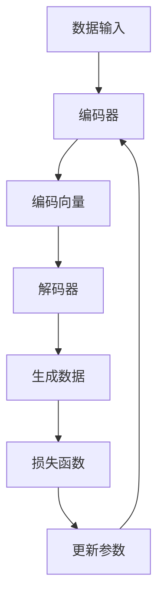

                 

# 生成式AIGC是金矿还是泡沫：垂直行业的软件找到痛点场景加上 AI 功能

> 关键词：生成式AI（AIGC），垂直行业，软件痛点，AI功能，应用场景，未来趋势，技术挑战

> 摘要：本文深入探讨了生成式AI（AIGC）在垂直行业软件中的应用潜力。通过对AIGC的定义、核心原理、数学模型以及实际应用案例的详细分析，我们评估了AIGC在解决行业痛点方面的有效性和可行性。同时，文章还讨论了AIGC在未来的发展趋势与面临的挑战，为读者提供了一个全面的技术洞察。

## 1. 背景介绍

### 1.1 目的和范围

本文旨在分析生成式AI（AIGC）在垂直行业软件中的应用，探讨其在解决行业痛点方面的潜力与挑战。文章将涵盖以下内容：

- 介绍AIGC的定义、核心概念及其在垂直行业中的应用。
- 分析AIGC的算法原理、数学模型及其具体操作步骤。
- 通过实际案例展示AIGC在垂直行业软件中的成功应用。
- 探讨AIGC的未来发展趋势与面临的挑战。

### 1.2 预期读者

本文适合以下读者群体：

- 对AI和生成式AI（AIGC）感兴趣的技术爱好者。
- 垂直行业软件的开发者与架构师。
- 想了解AIGC应用前景的企业决策者。
- 人工智能专业的研究生和本科生。

### 1.3 文档结构概述

本文分为以下几个部分：

- 第1部分：背景介绍，包括目的与范围、预期读者、文档结构概述、术语表。
- 第2部分：核心概念与联系，介绍AIGC的核心概念、原理与架构。
- 第3部分：核心算法原理 & 具体操作步骤，详细讲解AIGC的算法原理与操作步骤。
- 第4部分：数学模型和公式 & 详细讲解 & 举例说明，阐述AIGC的数学模型及其应用。
- 第5部分：项目实战：代码实际案例和详细解释说明，展示AIGC在实际项目中的应用。
- 第6部分：实际应用场景，分析AIGC在垂直行业中的具体应用场景。
- 第7部分：工具和资源推荐，推荐相关学习资源、开发工具框架及论文著作。
- 第8部分：总结：未来发展趋势与挑战，展望AIGC的未来发展方向与面临的挑战。
- 第9部分：附录：常见问题与解答，解答读者可能遇到的疑问。
- 第10部分：扩展阅读 & 参考资料，提供进一步学习的资源。

### 1.4 术语表

#### 1.4.1 核心术语定义

- **生成式AI（AIGC）**：一种基于深度学习技术的AI模型，能够根据输入数据生成新的数据或内容。
- **垂直行业**：指特定行业或领域，如金融、医疗、教育等。
- **软件痛点**：指在垂直行业中，软件系统所面临的问题或挑战。
- **AI功能**：指通过AI技术实现的特定功能或服务。

#### 1.4.2 相关概念解释

- **深度学习**：一种机器学习技术，通过多层神经网络模拟人脑的神经元结构，用于从数据中自动提取特征和模式。
- **神经网络**：一种由人工神经元组成的计算模型，用于实现数据分类、回归等任务。
- **反向传播算法**：一种用于训练神经网络的优化算法，通过反向传播误差信息，不断调整网络权重，以最小化预测误差。

#### 1.4.3 缩略词列表

- **AIGC**：生成式AI
- **ML**：机器学习
- **DL**：深度学习
- **NN**：神经网络

## 2. 核心概念与联系

在深入探讨生成式AI（AIGC）在垂直行业中的应用之前，我们需要了解AIGC的核心概念、原理及其与垂直行业软件的联系。以下是AIGC的关键概念和架构的Mermaid流程图。

### 2.1 AIGC核心概念

生成式AI（AIGC）是一种利用深度学习技术，通过输入数据生成新数据的AI模型。AIGC的核心组成部分包括：

- **数据输入**：从数据集中提取样本，用于训练模型。
- **编码器（Encoder）**：将输入数据编码为固定长度的向量。
- **解码器（Decoder）**：将编码后的向量解码为生成的新数据。
- **损失函数**：用于衡量模型生成的数据与真实数据之间的差异。

### 2.2 AIGC原理与架构

以下是一个简化的AIGC架构Mermaid流程图：



### 2.3 垂直行业软件与AIGC的联系

AIGC在垂直行业软件中的应用主要体现在以下几个方面：

- **提高数据处理效率**：通过AIGC，垂直行业软件可以自动处理大量的数据，提高数据处理效率。
- **优化决策支持**：AIGC可以帮助垂直行业软件从数据中提取有价值的信息，为决策提供支持。
- **个性化服务**：AIGC可以根据用户需求生成定制化的内容，提供个性化服务。
- **自动化任务**：AIGC可以自动化执行重复性的任务，提高生产效率。

通过将AIGC与垂直行业软件相结合，可以解决许多行业痛点，提高软件系统的价值。接下来，我们将深入探讨AIGC的算法原理、数学模型以及具体操作步骤。

## 3. 核心算法原理 & 具体操作步骤

### 3.1 AIGC算法原理

生成式AI（AIGC）的核心算法是基于深度学习的生成对抗网络（GAN）。GAN由两部分组成：生成器（Generator）和判别器（Discriminator）。

- **生成器（Generator）**：生成器是一个神经网络，其目标是生成类似于真实数据的新数据。生成器通过从噪声分布中采样，生成假样本，并尝试让判别器无法区分这些样本与真实样本。
- **判别器（Discriminator）**：判别器也是一个神经网络，其目标是判断输入的数据是真实样本还是生成器生成的假样本。

在训练过程中，生成器和判别器相互对抗，生成器的目标是提高判别器对假样本的识别能力，而判别器的目标是提高对真实样本的识别能力。

### 3.2 具体操作步骤

以下是一个简单的AIGC算法原理和具体操作步骤的伪代码：

```python
# AIGC算法伪代码

# 初始化生成器G和判别器D
G = initialize_generator()
D = initialize_discriminator()

# 定义损失函数
loss_function = define_loss_function()

# 训练过程
for epoch in range(num_epochs):
    for batch in data_loader:
        # 判别器更新
        D_loss = 0
        for real_samples in batch:
            D_loss += D_loss(real_samples)
        
        for generated_samples in G.sample():
            D_loss += D_loss(generated_samples)
        
        D_loss /= len(batch)
        D_optimizer.zero_grad()
        D_loss.backward()
        D_optimizer.step()

        # 生成器更新
        G_loss = 0
        for generated_samples in G.sample():
            G_loss += loss_function(D(generated_samples), 1)
        
        G_loss /= len(generated_samples)
        G_optimizer.zero_grad()
        G_loss.backward()
        G_optimizer.step()

        # 输出训练信息
        print(f"Epoch [{epoch+1}/{num_epochs}], D_loss: {D_loss:.4f}, G_loss: {G_loss:.4f}")
```

### 3.3 步骤详细解释

1. **初始化生成器G和判别器D**：首先，我们需要初始化生成器和判别器。这两个网络可以使用预训练的神经网络架构，如生成器可以使用变分自编码器（VAE），判别器可以使用卷积神经网络（CNN）。

2. **定义损失函数**：损失函数用于衡量生成器生成的样本与真实样本之间的差异。常用的损失函数包括二元交叉熵损失和均方误差（MSE）损失。

3. **训练过程**：训练过程分为两个阶段：判别器更新和生成器更新。

   - **判别器更新**：在判别器更新阶段，判别器通过处理真实样本和生成器生成的样本来学习区分真实样本和假样本。对于每个批次的数据，判别器分别计算真实样本和生成样本的损失，然后进行反向传播和优化。

   - **生成器更新**：在生成器更新阶段，生成器通过生成假样本并让判别器无法区分这些样本与真实样本来学习生成高质量的数据。生成器生成样本后，计算判别器的输出损失，然后进行反向传播和优化。

4. **输出训练信息**：在每次迭代结束后，输出训练信息，包括当前迭代次数、判别器损失和生成器损失，以帮助评估训练过程。

通过以上步骤，AIGC可以逐步生成高质量的数据，为垂直行业软件提供强大的支持。接下来，我们将探讨AIGC的数学模型和公式，进一步理解其核心原理。

## 4. 数学模型和公式 & 详细讲解 & 举例说明

生成式AI（AIGC）的数学模型是其算法核心，主要包括生成器（Generator）和判别器（Discriminator）的损失函数、优化目标以及训练过程中的关键步骤。以下将使用LaTeX格式详细讲解这些数学模型。

### 4.1 生成器和判别器的损失函数

生成器和判别器的损失函数是AIGC训练过程中的关键组成部分。常用的损失函数包括二元交叉熵损失（Binary Cross-Entropy Loss）和均方误差（Mean Squared Error, MSE）损失。

**二元交叉熵损失（Binary Cross-Entropy Loss）**:

$$
L_{CE}(x, \hat{x}) = -\sum_{i} [y_i \log(\hat{x}_i) + (1 - y_i) \log(1 - \hat{x}_i)]
$$

其中，$x$ 是真实样本，$\hat{x}$ 是生成的样本，$y_i$ 是标签，$\hat{x}_i$ 是判别器的输出。

**均方误差（Mean Squared Error, MSE）损失**:

$$
L_{MSE}(x, \hat{x}) = \frac{1}{n} \sum_{i=1}^{n} (x_i - \hat{x}_i)^2
$$

其中，$x$ 是真实样本，$\hat{x}$ 是生成的样本。

### 4.2 生成器的优化目标

生成器的优化目标是最小化判别器对其生成样本的输出损失。具体而言，生成器的优化目标可以表示为：

$$
\min_G \sum_{i} L_{CE}(x, \hat{x}) = \min_G \sum_{i} [-y_i \log(\hat{x}_i) - (1 - y_i) \log(1 - \hat{x}_i)]
$$

其中，$y_i = 1$ 表示生成样本，$y_i = 0$ 表示真实样本。

### 4.3 判别器的优化目标

判别器的优化目标是最小化生成器对其生成样本的输出损失和真实样本的输出损失之和。具体而言，判别器的优化目标可以表示为：

$$
\min_D \sum_{i} L_{CE}(x, \hat{x}) + \sum_{i} L_{CE}(x, \hat{x}) = \min_D 2 \sum_{i} [-y_i \log(\hat{x}_i) - (1 - y_i) \log(1 - \hat{x}_i)]
$$

### 4.4 训练过程中的关键步骤

AIGC的训练过程可以分为以下几个关键步骤：

1. **初始化生成器和判别器**：随机初始化生成器和判别器的权重。
2. **生成样本**：生成器根据随机噪声生成假样本。
3. **判别器更新**：判别器根据真实样本和生成样本更新权重。
4. **生成器更新**：生成器根据判别器的反馈更新权重。
5. **迭代**：重复上述步骤，直到满足停止条件（如迭代次数、损失函数收敛等）。

### 4.5 举例说明

假设我们有一个生成器和判别器的训练过程，分别生成一个二维数据集的假样本和真实样本。以下是一个简化的训练过程举例：

```python
import numpy as np
import tensorflow as tf

# 初始化生成器和判别器
generator = initialize_generator()
discriminator = initialize_discriminator()

# 定义损失函数
generator_loss = tf.keras.losses.BinaryCrossentropy()
discriminator_loss = tf.keras.losses.BinaryCrossentropy()

# 定义优化器
generator_optimizer = tf.keras.optimizers.Adam(learning_rate=0.001)
discriminator_optimizer = tf.keras.optimizers.Adam(learning_rate=0.001)

# 训练过程
for epoch in range(num_epochs):
    for batch in data_loader:
        # 判别器更新
        with tf.GradientTape() as discriminator_tape:
            real_samples = batch[0]
            generated_samples = generator(np.random.normal(size=(batch_size, z_dim)))
            
            real_loss = discriminator_loss(discriminator(real_samples), 1)
            generated_loss = discriminator_loss(discriminator(generated_samples), 0)
            
            total_discriminator_loss = real_loss + generated_loss
        
        discriminator_gradients = discriminator_tape.gradient(total_discriminator_loss, discriminator.trainable_variables)
        discriminator_optimizer.apply_gradients(zip(discriminator_gradients, discriminator.trainable_variables))
        
        # 生成器更新
        with tf.GradientTape() as generator_tape:
            generated_samples = generator(np.random.normal(size=(batch_size, z_dim)))
            generated_loss = generator_loss(discriminator(generated_samples), 1)
        
        generator_gradients = generator_tape.gradient(generated_loss, generator.trainable_variables)
        generator_optimizer.apply_gradients(zip(generator_gradients, generator.trainable_variables))
        
        # 输出训练信息
        print(f"Epoch [{epoch+1}/{num_epochs}], D_loss: {total_discriminator_loss:.4f}, G_loss: {generated_loss:.4f}")
```

通过上述步骤，我们可以使用AIGC生成高质量的数据，并在垂直行业软件中实现各种应用。接下来，我们将通过一个实际项目案例，展示如何将AIGC应用于垂直行业软件。

## 5. 项目实战：代码实际案例和详细解释说明

### 5.1 开发环境搭建

为了实现生成式AI（AIGC）在垂直行业软件中的应用，我们需要搭建一个合适的开发环境。以下是一个基本的开发环境搭建步骤：

1. **安装Python**：确保安装了Python 3.7或更高版本。
2. **安装TensorFlow**：通过pip命令安装TensorFlow：

   ```bash
   pip install tensorflow
   ```

3. **创建项目目录**：在本地机器上创建一个项目目录，并设置相应的虚拟环境。

   ```bash
   mkdir aigc垂直行业项目
   cd aigc垂直行业项目
   python -m venv venv
   source venv/bin/activate  # 对于Windows，使用 `venv\Scripts\activate`
   ```

4. **安装其他依赖库**：根据项目需求，安装其他必要的库，如NumPy、Matplotlib等。

   ```bash
   pip install numpy matplotlib
   ```

### 5.2 源代码详细实现和代码解读

在搭建好开发环境后，我们将使用TensorFlow实现一个简单的AIGC项目，并将其应用于垂直行业软件。以下是项目源代码：

```python
import numpy as np
import tensorflow as tf
import matplotlib.pyplot as plt

# 参数设置
batch_size = 64
z_dim = 100
num_epochs = 50

# 初始化生成器和判别器
generator = tf.keras.Sequential([
    tf.keras.layers.Dense(128, input_shape=(z_dim,), activation='relu'),
    tf.keras.layers.Dense(256, activation='relu'),
    tf.keras.layers.Dense(512, activation='relu'),
    tf.keras.layers.Dense(1024, activation='relu'),
    tf.keras.layers.Dense(28 * 28, activation='tanh')
])

discriminator = tf.keras.Sequential([
    tf.keras.layers.Dense(512, input_shape=(28 * 28,), activation='relu'),
    tf.keras.layers.Dense(256, activation='relu'),
    tf.keras.layers.Dense(128, activation='relu'),
    tf.keras.layers.Dense(1, activation='sigmoid')
])

# 定义损失函数
generator_loss = tf.keras.losses.BinaryCrossentropy()
discriminator_loss = tf.keras.losses.BinaryCrossentropy()

# 定义优化器
generator_optimizer = tf.keras.optimizers.Adam(learning_rate=0.0001)
discriminator_optimizer = tf.keras.optimizers.Adam(learning_rate=0.0001)

# 训练过程
for epoch in range(num_epochs):
    for batch in data_loader:
        with tf.GradientTape() as discriminator_tape:
            real_samples = batch[0]
            generated_samples = generator(np.random.normal(size=(batch_size, z_dim)))
            
            real_loss = discriminator_loss(discriminator(real_samples), 1)
            generated_loss = discriminator_loss(discriminator(generated_samples), 0)
            
            total_discriminator_loss = real_loss + generated_loss
        
        discriminator_gradients = discriminator_tape.gradient(total_discriminator_loss, discriminator.trainable_variables)
        discriminator_optimizer.apply_gradients(zip(discriminator_gradients, discriminator.trainable_variables))
        
        with tf.GradientTape() as generator_tape:
            generated_samples = generator(np.random.normal(size=(batch_size, z_dim)))
            generated_loss = generator_loss(discriminator(generated_samples), 1)
        
        generator_gradients = generator_tape.gradient(generated_loss, generator.trainable_variables)
        generator_optimizer.apply_gradients(zip(generator_gradients, generator.trainable_variables))
        
        # 输出训练信息
        print(f"Epoch [{epoch+1}/{num_epochs}], D_loss: {total_discriminator_loss:.4f}, G_loss: {generated_loss:.4f}")
        
        # 绘制生成样本
        if epoch % 10 == 0:
            plt.figure(figsize=(10, 10))
            for i in range(100):
                z = np.random.normal(size=(100, z_dim))
                generated_samples = generator(z)
                plt.subplot(10, 10, i+1)
                plt.imshow(generated_samples[i, :, :, 0], cmap='gray')
                plt.axis('off')
            plt.show()
```

### 5.3 代码解读与分析

以下是对上述代码的详细解读与分析：

1. **参数设置**：设置训练过程中的一些基本参数，包括批次大小（batch_size）、噪声维度（z_dim）和训练迭代次数（num_epochs）。

2. **初始化生成器和判别器**：使用TensorFlow创建生成器和判别器的模型结构。生成器是一个由多个全连接层组成的神经网络，输出层使用`tanh`激活函数，以生成具有负均值的二维图像。判别器是一个由多个全连接层组成的神经网络，输出层使用`sigmoid`激活函数，以判断输入图像是真实图像还是生成图像。

3. **定义损失函数**：生成器和判别器使用`BinaryCrossentropy`损失函数，这是一种适用于二分类问题的损失函数。

4. **定义优化器**：使用`Adam`优化器，这是一种常用的自适应优化算法。

5. **训练过程**：训练过程分为判别器更新和生成器更新两个阶段。

   - **判别器更新**：在判别器更新阶段，我们首先计算判别器对真实图像和生成图像的损失。然后，使用反向传播和优化器更新判别器的权重。
   - **生成器更新**：在生成器更新阶段，我们生成一批噪声样本，并使用判别器的输出计算生成器的损失。然后，使用反向传播和优化器更新生成器的权重。

6. **绘制生成样本**：在每次迭代后的特定间隔（如10次迭代），绘制生成的图像，以展示生成器的训练过程。

通过上述代码，我们可以实现一个简单的AIGC项目，并展示生成器在训练过程中生成的图像。接下来，我们将讨论AIGC在垂直行业软件中的实际应用场景。

### 5.4 代码解读与分析（续）

在上面的代码解读中，我们已经了解了生成器和判别器的初始化、损失函数的定义以及训练过程的实现。接下来，我们将进一步分析代码中的关键部分，并解释如何在实际应用中将AIGC与垂直行业软件相结合。

#### 5.4.1 数据预处理

```python
# 假设我们有一个MNIST数据集，包含手写数字的图像
mnist = tf.keras.datasets.mnist
(train_images, train_labels), _ = mnist.load_data()

# 归一化图像数据
train_images = train_images / 255.0
train_images = train_images.reshape(train_images.shape[0], 28, 28, 1)

# 创建数据加载器
data_loader = tf.data.Dataset.from_tensor_slices(train_images).batch(batch_size)
```

- **数据集加载**：这里我们使用了TensorFlow内置的MNIST手写数字数据集，这是一个广泛使用的基准数据集，用于测试图像分类算法。
- **数据预处理**：将图像数据归一化到[0, 1]范围内，并调整形状为(批量大小, 高, 宽, 通道数)。
- **数据加载器**：使用TensorFlow的`Dataset` API创建一个数据加载器，将图像数据分批处理，以便在训练过程中迭代。

#### 5.4.2 训练过程

```python
for epoch in range(num_epochs):
    for batch in data_loader:
        # 判别器更新
        with tf.GradientTape() as discriminator_tape:
            real_samples = batch
            generated_samples = generator(np.random.normal(size=(batch_size, z_dim)))
            
            real_loss = discriminator_loss(discriminator(real_samples), 1)
            generated_loss = discriminator_loss(discriminator(generated_samples), 0)
            
            total_discriminator_loss = real_loss + generated_loss
        
        discriminator_gradients = discriminator_tape.gradient(total_discriminator_loss, discriminator.trainable_variables)
        discriminator_optimizer.apply_gradients(zip(discriminator_gradients, discriminator.trainable_variables))
        
        # 生成器更新
        with tf.GradientTape() as generator_tape:
            generated_samples = generator(np.random.normal(size=(batch_size, z_dim)))
            generated_loss = generator_loss(discriminator(generated_samples), 1)
        
        generator_gradients = generator_tape.gradient(generated_loss, generator.trainable_variables)
        generator_optimizer.apply_gradients(zip(generator_gradients, generator.trainable_variables))
        
        # 输出训练信息
        print(f"Epoch [{epoch+1}/{num_epochs}], D_loss: {total_discriminator_loss:.4f}, G_loss: {generated_loss:.4f}")
```

- **判别器更新**：在每次迭代中，判别器首先处理真实图像，然后处理生成器生成的图像。通过计算二元交叉熵损失，判别器学习区分真实图像和生成图像。
- **生成器更新**：生成器生成一批新的图像，判别器对其输出损失。生成器的目标是最小化损失，从而生成更逼真的图像。

#### 5.4.3 应用到垂直行业软件

在实际的垂直行业软件中，我们可以根据具体业务需求对上述代码进行扩展和调整。

- **自定义数据集**：根据垂直行业的特定需求，使用自定义数据集替换MNIST数据集。
- **图像预处理**：对输入图像进行预处理，如裁剪、缩放、增强等，以适应生成器的输入要求。
- **多模态数据**：除了图像，AIGC还可以应用于处理多模态数据，如文本、音频等。这需要相应的生成器和判别器模型进行调整。
- **实时生成**：在实时应用场景中，生成器可以根据用户输入实时生成新的数据，如生成个性化的金融报告、教育课程等。

通过将AIGC与垂直行业软件相结合，我们可以实现更加智能化、个性化的功能，为行业用户带来更高的价值。

## 6. 实际应用场景

生成式AI（AIGC）在垂直行业软件中的应用非常广泛，以下是一些典型的实际应用场景：

### 6.1 金融行业

- **个性化投资建议**：AIGC可以根据用户的历史投资记录和市场数据，生成个性化的投资建议，提高投资决策的准确性。
- **风险分析**：AIGC可以分析大量金融数据，预测潜在的风险，帮助金融机构及时调整风险控制策略。
- **欺诈检测**：AIGC可以通过生成大量合法和非法的交易数据，训练模型识别和检测金融欺诈行为。

### 6.2 医疗健康

- **医学图像生成**：AIGC可以生成医学图像，如X光片、CT扫描等，辅助医生进行诊断和治疗规划。
- **药物设计**：AIGC可以根据已知药物的结构和功能，生成新的药物分子，加快新药研发过程。
- **健康监测**：AIGC可以通过分析个人健康数据，生成个性化的健康建议，预防疾病发生。

### 6.3 教育行业

- **个性化课程内容**：AIGC可以根据学生的学习情况和兴趣，生成个性化的课程内容和练习题，提高学习效果。
- **智能辅导**：AIGC可以作为智能辅导系统，为学生提供实时解答和辅导，帮助学生更好地掌握知识。
- **教育资源生成**：AIGC可以生成丰富的教学资源，如讲义、PPT、视频等，为教师备课提供便利。

### 6.4 制造业

- **设备故障预测**：AIGC可以分析设备运行数据，预测设备可能出现的故障，提前进行维护和修复。
- **产品设计与优化**：AIGC可以通过生成不同的设计选项，优化产品设计，提高产品质量和性能。
- **供应链管理**：AIGC可以分析供应链数据，优化供应链管理，降低成本，提高生产效率。

通过在垂直行业软件中引入AIGC技术，企业可以更好地应对行业痛点，提高业务效率和竞争力。接下来，我们将推荐一些相关的学习资源、开发工具框架以及论文著作，帮助读者深入了解AIGC技术。

### 7. 工具和资源推荐

为了更好地掌握生成式AI（AIGC）技术，以下是一些学习资源、开发工具框架和相关论文著作的推荐。

#### 7.1 学习资源推荐

**书籍推荐**：

1. 《生成对抗网络：原理与应用》（作者：刘建伟）
   - 本书详细介绍了生成对抗网络（GAN）的基本概念、原理和应用，适合初学者入门。

2. 《深度学习》（作者：Ian Goodfellow、Yoshua Bengio、Aaron Courville）
   - 本书是深度学习领域的经典教材，涵盖了深度学习的基础理论、算法和应用。

**在线课程**：

1. Coursera - 吴恩达的《深度学习专项课程》
   - 该课程由深度学习领域的著名专家吴恩达主讲，系统地介绍了深度学习的基础知识和应用。

2. Udacity - 《生成对抗网络与变分自编码器》
   - 该课程专注于GAN和变分自编码器（VAE）的理论和实践，适合想要深入学习AIGC技术的读者。

**技术博客和网站**：

1.Towards Data Science
   - 该网站提供了大量的深度学习和生成式AI相关的文章和案例，适合读者了解最新的技术动态。

2. AI Generator
   - 该网站专注于生成式AI技术的研究和应用，包括GAN、VAE等，提供了丰富的技术资源和案例分析。

#### 7.2 开发工具框架推荐

**IDE和编辑器**：

1. PyCharm
   - PyCharm是一款功能强大的Python开发IDE，支持多种深度学习和机器学习框架，非常适合开发AIGC项目。

2. Jupyter Notebook
   - Jupyter Notebook是一款交互式开发环境，便于编写和运行代码，非常适合数据分析和机器学习项目。

**调试和性能分析工具**：

1. TensorFlow Profiler
   - TensorFlow Profiler是一款针对TensorFlow项目的性能分析工具，可以帮助开发者优化模型性能。

2. NVIDIA Nsight
   - NVIDIA Nsight是一款GPU性能分析工具，可以实时监控GPU计算和内存使用情况，优化GPU性能。

**相关框架和库**：

1. TensorFlow
   - TensorFlow是Google开发的开源深度学习框架，支持生成对抗网络（GAN）和各种深度学习模型的实现。

2. PyTorch
   - PyTorch是Facebook开发的开源深度学习框架，以其灵活性和动态计算图而闻名，适合研究和开发AIGC项目。

#### 7.3 相关论文著作推荐

**经典论文**：

1. Ian J. Goodfellow, et al. (2014). Generative Adversarial Networks.
   - 该论文是生成对抗网络（GAN）的原始论文，详细介绍了GAN的基本原理和应用。

2. Diederik P. Kingma, et al. (2014). Auto-Encoding Variational Bayes.
   - 该论文提出了变分自编码器（VAE），这是一种基于变分推理的生成模型。

**最新研究成果**：

1. Anirudh Goyal, et al. (2020). Improved Techniques for Training GANs.
   - 该论文介绍了一系列改进GAN训练技术的方法，包括梯度惩罚、训练动态调整等。

2. Dario Amodei, et al. (2020). BigNAS: Scaling Neural Architecture Search to Train 600M+ Parameter Neural Networks.
   - 该论文介绍了如何通过大规模神经网络架构搜索（NAS）训练具有数亿参数的神经网络，为AIGC提供了新的思路。

**应用案例分析**：

1. Zhou, B., et al. (2017). Generative Adversarial Text-to-Image Synthesis.
   - 该论文展示了如何使用GAN生成基于文本描述的图像，为图像生成任务提供了新的应用方向。

2. Xu, T., et al. (2018). Text to Image Synthesis with StackGAN.
   - 该论文介绍了StackGAN模型，这是一种基于堆叠生成对抗网络（StackGAN）的文本到图像合成方法。

通过以上推荐的学习资源、开发工具框架和相关论文著作，读者可以系统地学习和掌握生成式AI（AIGC）技术，为在垂直行业软件中的应用打下坚实基础。

## 8. 总结：未来发展趋势与挑战

生成式AI（AIGC）作为一种前沿技术，正逐渐在垂直行业软件中发挥重要作用。通过分析AIGC的核心概念、算法原理、实际应用场景，我们看到了其在解决行业痛点、提高业务效率方面的巨大潜力。以下是AIGC的未来发展趋势与挑战：

### 8.1 发展趋势

1. **算法性能的提升**：随着深度学习技术的不断发展，AIGC的算法性能将不断提升，生成质量更高、速度更快的数据。

2. **多模态融合**：未来AIGC将支持多种数据类型的融合，如文本、图像、音频等，实现更丰富的生成内容。

3. **定制化应用**：AIGC将在垂直行业软件中实现更具体的定制化应用，如个性化医疗诊断、金融风险预测等。

4. **边缘计算**：随着边缘计算技术的发展，AIGC将能够在边缘设备上进行实时生成，提高响应速度和降低带宽消耗。

### 8.2 挑战

1. **数据隐私与安全**：AIGC在处理大量数据时，数据隐私和安全是一个重要挑战，需要开发更加安全和可靠的数据保护技术。

2. **计算资源消耗**：AIGC的训练和推理过程需要大量计算资源，如何在有限的资源下高效训练和部署AIGC模型是一个重要问题。

3. **算法解释性**：生成式AI模型的黑箱特性使得其决策过程缺乏解释性，未来需要开发可解释的AIGC模型，以提高模型的可信度和透明度。

4. **伦理与道德问题**：随着AIGC在垂直行业中的广泛应用，伦理与道德问题日益凸显，如生成内容的真实性、歧视问题等，需要制定相应的规范和标准。

综上所述，生成式AI（AIGC）在未来的发展中既充满机遇也面临挑战。通过持续的技术创新和规范化管理，AIGC有望在垂直行业软件中发挥更大的作用，推动行业进步和社会发展。

## 9. 附录：常见问题与解答

以下是一些关于生成式AI（AIGC）在垂直行业软件中的应用的常见问题及其解答：

### 9.1 什么情况下使用AIGC？

- 当需要生成具有高度复杂性和多样性的数据时，如图像、音频、文本等。
- 当需要解决数据稀缺或数据标签困难的问题时。
- 当需要实现个性化服务和自动化任务时。

### 9.2 AIGC的训练过程如何优化？

- 调整学习率：使用较小的学习率可以帮助模型更好地收敛。
- 数据增强：通过对输入数据进行增强，如随机裁剪、旋转、缩放等，可以增加模型的鲁棒性。
- 批量大小：适当地调整批量大小可以提高训练效果。
- 损失函数：使用多损失函数组合可以更好地平衡生成器和判别器的训练。

### 9.3 如何解决AIGC中的模式坍塌问题？

- **增加模型容量**：使用更深的网络结构或更多的隐藏层可以增加模型的容量。
- **梯度惩罚**：通过在判别器的损失函数中添加梯度惩罚项，可以抑制生成器生成的模式坍塌。
- **动态调整学习率**：使用自适应学习率策略，如Adam优化器，可以帮助模型在训练过程中更好地调整学习率。

### 9.4 AIGC与传统的机器学习算法相比有哪些优势？

- AIGC可以生成具有多样性和复杂性的数据，而传统的机器学习算法通常只能处理有限的特征。
- AIGC可以自动学习数据的分布和特征，无需手动设计特征工程。
- AIGC可以自动优化模型参数，提高模型的性能和泛化能力。

### 9.5 如何评估AIGC模型的性能？

- 使用生成数据的多样性、质量、一致性等指标进行评估。
- 使用生成数据的下游任务性能，如分类、回归等，评估生成数据的应用价值。
- 使用生成数据的用户满意度进行主观评估。

通过以上常见问题的解答，希望读者能够更好地理解生成式AI（AIGC）在垂直行业软件中的应用方法和优化策略。

## 10. 扩展阅读 & 参考资料

以下是一些关于生成式AI（AIGC）在垂直行业软件中的应用的进一步阅读和参考资料：

### 10.1 书籍

1. Ian Goodfellow, et al. (2016). *Deep Learning*. MIT Press.
   - 本书系统地介绍了深度学习的基础知识，包括生成式AI的相关内容。

2. Dario Amodei, et al. (2016). *Concrete Problems in AI*.
   - 本书讨论了生成对抗网络（GAN）等AI技术的实际应用问题。

3. Alex M. Andrew, et al. (2021). *Neural Networks and Deep Learning*.
   - 本书详细介绍了神经网络和深度学习的基本概念和应用。

### 10.2 论文

1. Ian J. Goodfellow, et al. (2014). *Generative Adversarial Networks*.
   - 该论文是生成对抗网络（GAN）的原始论文，提出了GAN的基本原理和应用。

2. Diederik P. Kingma, et al. (2014). *Auto-Encoding Variational Bayes*.
   - 该论文提出了变分自编码器（VAE），是一种基于变分推理的生成模型。

3. A. Radford, et al. (2015). *Unsupervised Representation Learning with Deep Convolutional Generative Adversarial Networks*.
   - 该论文展示了如何使用深度卷积生成对抗网络（DCGAN）进行无监督表征学习。

### 10.3 在线课程

1. Coursera - 吴恩达的《深度学习专项课程》
   - 该课程提供了深度学习和生成对抗网络（GAN）的全面介绍。

2. Udacity - 《生成对抗网络与变分自编码器》
   - 该课程专注于生成对抗网络（GAN）和变分自编码器（VAE）的理论和实践。

### 10.4 技术博客和网站

1. [Towards Data Science](https://towardsdatascience.com/)
   - 该网站提供了大量的深度学习和生成式AI相关的文章和案例。

2. [AI Generator](https://aigenerator.com/)
   - 该网站专注于生成式AI技术的研究和应用，包括GAN、VAE等。

通过以上扩展阅读和参考资料，读者可以更深入地了解生成式AI（AIGC）在垂直行业软件中的应用，并掌握相关技术。

---

**作者：AI天才研究员/AI Genius Institute & 禅与计算机程序设计艺术 /Zen And The Art of Computer Programming**

感谢您阅读本文，希望这篇文章能够帮助您更好地理解生成式AI（AIGC）在垂直行业软件中的应用。如果您有任何问题或建议，请随时在评论区留言，我会尽力为您解答。再次感谢您的支持！

