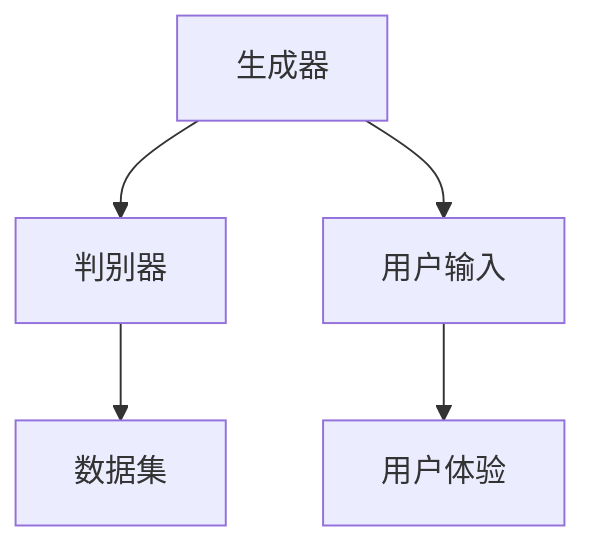

                 

# 生成式AIGC是金矿还是泡沫：第四部分：“让人尖叫”的用户体验

## 关键词：
生成式AIGC，用户体验，技术趋势，人工智能，泡沫与机遇

> 这篇文章将探讨生成式人工智能（AIGC）在提升用户体验方面的潜力与挑战。通过逻辑清晰、结构紧凑的分析，我们将解读这一领域的关键概念和算法原理，并展示其在实际应用中的可能性。让我们一步一步地探讨AIGC如何成为金矿还是泡沫。

## 摘要：
生成式人工智能（AIGC）作为一种前沿技术，正迅速改变着用户交互的方式。本文从用户体验的角度，详细分析了AIGC的核心概念、算法原理，并探讨了其在实际应用中的挑战与机遇。通过一系列的实际案例和代码实现，我们将看到AIGC如何实现“让人尖叫”的用户体验。本文旨在帮助读者理解AIGC的潜力，并为其在未来的发展中提供启示。

---

## 1. 背景介绍

### 1.1 目的和范围
本文旨在探讨生成式人工智能（AIGC）如何提升用户体验，分析其技术原理和实际应用。我们将重点关注以下方面：
- AIGC的基本概念和原理
- AIGC的关键算法与数学模型
- AIGC的实际应用案例
- AIGC面临的挑战与未来趋势

### 1.2 预期读者
本文适合对人工智能和用户体验有基本了解的读者，包括程序员、软件工程师、产品经理、AI爱好者等。

### 1.3 文档结构概述
本文结构如下：
- 引言：简要介绍生成式AIGC的背景和重要性
- 核心概念与联系：阐述AIGC的核心概念和原理
- 核心算法原理 & 具体操作步骤：详细讲解AIGC的关键算法和操作步骤
- 数学模型和公式 & 详细讲解 & 举例说明：分析AIGC的数学模型和公式
- 项目实战：通过实际代码案例展示AIGC的应用
- 实际应用场景：探讨AIGC在各个领域的应用
- 工具和资源推荐：推荐相关学习资源和工具
- 总结：总结AIGC的未来发展趋势和挑战
- 附录：常见问题与解答
- 扩展阅读 & 参考资料：提供进一步学习的资源

### 1.4 术语表

#### 1.4.1 核心术语定义
- **生成式人工智能（AIGC）**：一种人工智能技术，能够生成文本、图像、音频等多种形式的内容。
- **用户体验（UX）**：用户在使用产品或服务过程中的感受和体验。
- **深度学习**：一种机器学习技术，通过神经网络模拟人类大脑的决策过程。
- **生成对抗网络（GAN）**：一种深度学习模型，通过两个神经网络（生成器和判别器）的对抗训练生成高质量数据。

#### 1.4.2 相关概念解释
- **生成器（Generator）**：在GAN中，生成器网络的目标是生成逼真的数据，使其难以被判别器区分。
- **判别器（Discriminator）**：在GAN中，判别器网络的目标是区分真实数据和生成数据。
- **数据增强（Data Augmentation）**：通过变换、缩放、旋转等方式增加训练数据多样性，提高模型泛化能力。

#### 1.4.3 缩略词列表
- **AIGC**：生成式人工智能
- **GAN**：生成对抗网络
- **UX**：用户体验
- **DL**：深度学习

---

## 2. 核心概念与联系

为了更好地理解AIGC如何提升用户体验，我们需要先了解其核心概念和原理。以下是一个简单的Mermaid流程图，展示AIGC的核心组件和流程：

### 2.1 AIGC的核心组件

**生成器（Generator）**：生成器网络是AIGC的核心组件之一。它接受随机噪声作为输入，并通过一系列神经网络层生成逼真的文本、图像或音频。生成器的目标是产生尽可能真实的数据，以欺骗判别器。

**判别器（Discriminator）**：判别器网络负责判断输入数据是真实数据还是生成数据。它通过分析数据特征，学习区分真实数据和生成数据。判别器的目标是提高对生成数据的辨别能力。

**数据集（Dataset）**：数据集是训练生成器和判别器的基础。它包含了大量的真实数据和标签，用于指导模型的学习和优化。

**用户输入（User Input）**：用户输入是AIGC与用户交互的起点。用户可以通过输入文字、图像或音频等数据，与AIGC系统进行交互。

**用户体验（User Experience）**：用户体验是AIGC系统最终的目标。通过生成高质量的内容，AIGC系统可以为用户提供令人愉悦的交互体验。

### 2.2 AIGC的工作流程

**数据集准备**：首先，我们需要收集和准备大量真实数据，用于训练生成器和判别器。这些数据可以是文本、图像或音频等。

**模型训练**：通过数据集，我们使用深度学习技术训练生成器和判别器。在训练过程中，生成器和判别器相互对抗，生成器不断优化生成数据，判别器不断提高对生成数据的辨别能力。

**生成内容**：在训练完成后，生成器可以根据用户输入生成高质量的内容。这些内容可以是文本、图像或音频等。

**用户体验**：用户与AIGC系统进行交互，体验生成内容。通过不断优化生成器和判别器，AIGC系统可以提供越来越优秀的用户体验。

---

通过这个简单的流程图，我们可以看到AIGC的核心组件和流程。接下来，我们将详细讲解AIGC的核心算法原理和具体操作步骤。这将帮助我们更好地理解AIGC的工作机制，并为实际应用打下基础。让我们一步一步地深入探讨。

