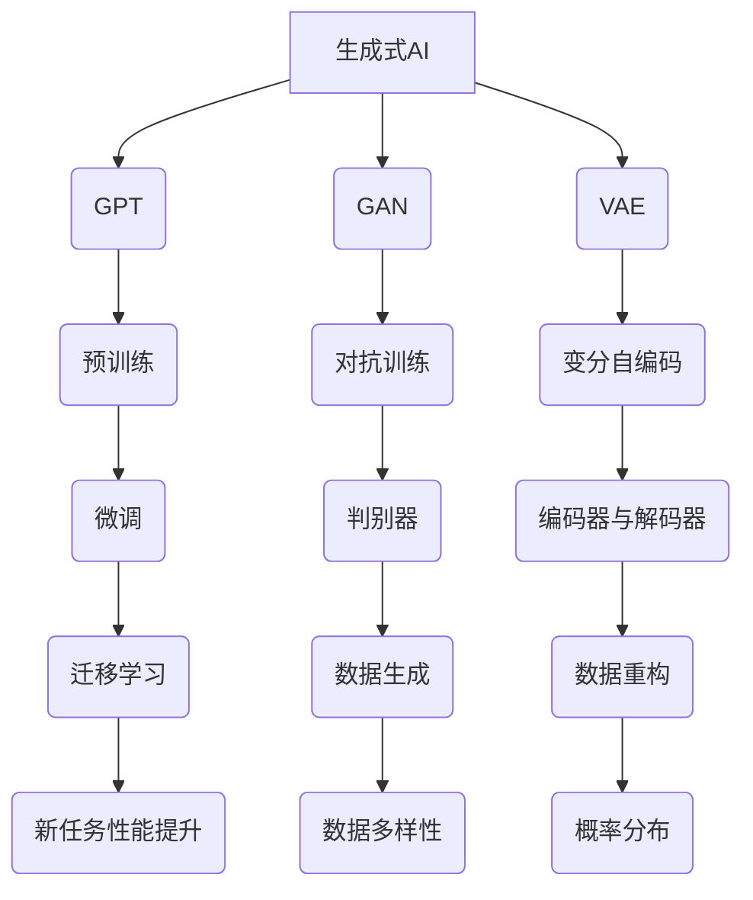
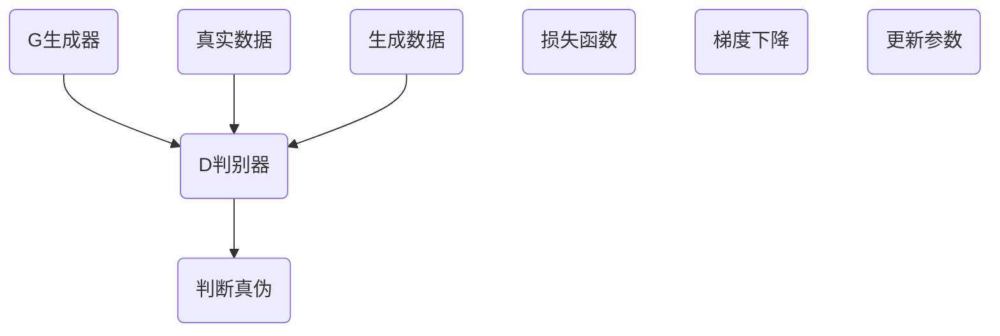
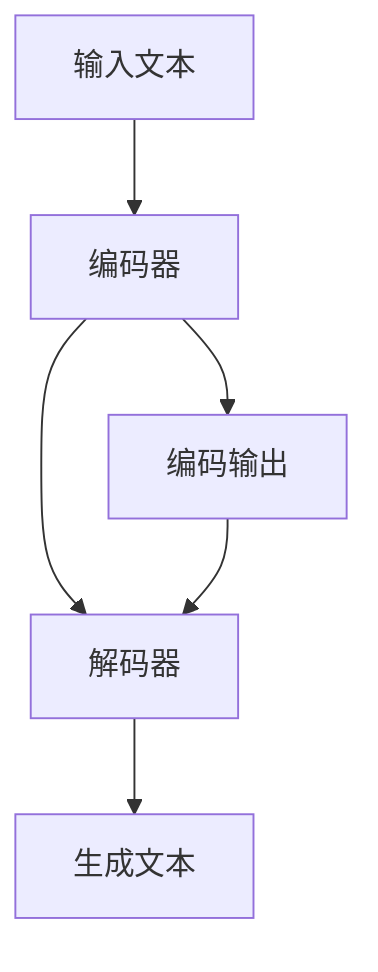
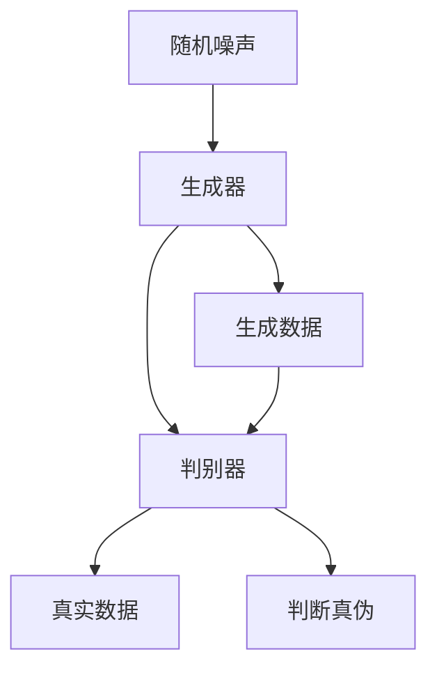
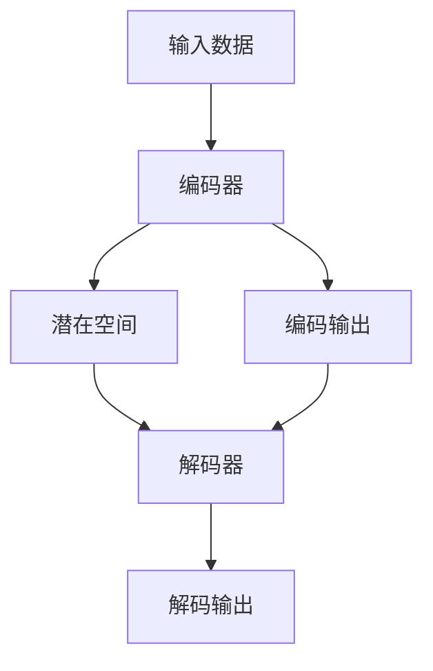

                 

# 生成式AIGC：从理论到商业应用的跨越

## 关键词
- 生成式AI
- AIGC
- 商业应用
- 理论实践
- 技术突破
- 应用场景

## 摘要
本文将深入探讨生成式人工智能（AIGC）的发展历程、核心概念、算法原理，并从理论到实践的角度，分析其在商业应用中的跨越。文章将结合具体案例，展示AIGC在不同领域的应用场景，并提供相关的工具和资源推荐，帮助读者了解和掌握这一前沿技术。通过本文的阅读，读者将更好地理解生成式AIGC的发展趋势和潜在挑战，为未来的研究和应用奠定基础。

## 1. 背景介绍

### 1.1 目的和范围
本文旨在介绍生成式人工智能（AIGC）的基本概念、核心算法及其在商业应用中的实践。文章将分为以下几个部分：首先，回顾AIGC的发展历程和背景；其次，深入探讨AIGC的核心概念和架构；然后，详细解析AIGC的关键算法原理和数学模型；接着，通过实战案例展示AIGC在商业应用中的成功实践；最后，展望AIGC的未来发展趋势与挑战，并提供相关的学习资源和开发工具。

### 1.2 预期读者
本文面向对生成式人工智能有一定了解，希望深入了解AIGC在实际商业应用中的技术原理和实践的读者。无论是AI领域的研究人员、开发者，还是对AI应用感兴趣的企业管理者，均可通过本文获得有价值的见解和启示。

### 1.3 文档结构概述
本文结构如下：

1. **背景介绍**
   - 1.1 目的和范围
   - 1.2 预期读者
   - 1.3 文档结构概述
   - 1.4 术语表
2. **核心概念与联系**
   - 2.1 核心概念与联系
   - 2.2 生成式AI的历史与发展
3. **核心算法原理 & 具体操作步骤**
   - 3.1 算法原理
   - 3.2 具体操作步骤
4. **数学模型和公式 & 详细讲解 & 举例说明**
   - 4.1 数学模型
   - 4.2 公式讲解
   - 4.3 实例分析
5. **项目实战：代码实际案例和详细解释说明**
   - 5.1 开发环境搭建
   - 5.2 源代码详细实现
   - 5.3 代码解读与分析
6. **实际应用场景**
   - 6.1 各行各业的应用
   - 6.2 案例分析
7. **工具和资源推荐**
   - 7.1 学习资源
   - 7.2 开发工具
   - 7.3 相关论文著作
8. **总结：未来发展趋势与挑战**
   - 8.1 发展趋势
   - 8.2 挑战与对策
9. **附录：常见问题与解答**
10. **扩展阅读 & 参考资料**

### 1.4 术语表

#### 1.4.1 核心术语定义
- **生成式AI（Generative AI）**：一种能够生成新数据的人工智能技术，通过对大量已有数据的分析，生成类似或全新的数据。
- **AIGC（AI-Generated Content）**：生成式AI在内容生成领域的应用，包括文本、图像、音频等多种形式。
- **GPT（Generative Pre-trained Transformer）**：一种基于Transformer架构的生成模型，具有强大的文本生成能力。
- **GAN（Generative Adversarial Network）**：一种生成模型，由生成器和判别器两个神经网络构成，通过对抗训练生成高质量的数据。
- **VAE（Variational Autoencoder）**：一种基于变分自编码器的生成模型，能够生成符合概率分布的数据。

#### 1.4.2 相关概念解释
- **预训练（Pre-training）**：在特定任务上对模型进行大量数据的学习，以获得基础的能力。
- **微调（Fine-tuning）**：在预训练模型的基础上，针对特定任务进行进一步的学习和调整。
- **迁移学习（Transfer Learning）**：利用在特定任务上训练好的模型，迁移到新的任务上，以提高模型在新任务上的性能。
- **数据增强（Data Augmentation）**：通过对原始数据进行变换，增加数据的多样性，从而提高模型的泛化能力。

#### 1.4.3 缩略词列表
- GPT：Generative Pre-trained Transformer
- GAN：Generative Adversarial Network
- VAE：Variational Autoencoder
- AI：Artificial Intelligence
- AIGC：AI-Generated Content

## 2. 核心概念与联系

生成式人工智能（AIGC）的核心在于“生成”，即通过模型学习已有数据，生成新的、符合预期的数据。这一过程中，涉及到多种核心概念和算法，如图2.1所示。



### 2.1 核心概念与联系

**生成式AI（Generative AI）**：
生成式AI是一种能够生成新数据的人工智能技术，通过对大量已有数据的分析，生成类似或全新的数据。生成式AI在图像、文本、音频等多种领域都有广泛应用，如图像生成、文本生成、音乐生成等。

**GPT（Generative Pre-trained Transformer）**：
GPT是一种基于Transformer架构的生成模型，通过预训练的方式，在大规模语料库上进行训练，使其具有强大的文本生成能力。GPT系列模型，如GPT-3，具有数百亿参数，能够生成连贯、自然的文本。

**GAN（Generative Adversarial Network）**：
GAN是一种生成模型，由生成器和判别器两个神经网络构成，通过对抗训练生成高质量的数据。生成器试图生成与真实数据相似的数据，而判别器则试图区分真实数据和生成数据。这种对抗过程使得生成器不断优化，最终能够生成非常逼真的数据。

**VAE（Variational Autoencoder）**：
VAE是一种基于变分自编码器的生成模型，通过编码器和解码器两个网络，将输入数据映射到一个概率分布上，并从该分布中生成新的数据。VAE能够生成符合输入数据分布的新数据，且生成过程具有确定性。

### 2.2 生成式AI的历史与发展

生成式AI的历史可以追溯到20世纪80年代，最早的生成模型是自编码器（Autoencoder），其基本思想是训练一个编码器将输入数据映射到一个低维隐空间，再通过解码器将隐空间的数据映射回原始空间。然而，传统的自编码器在生成数据时存在一定的局限性。

随着深度学习的兴起，生成式AI得到了快速发展。2014年，Ian Goodfellow等人提出了GAN，这是生成式AI领域的一个重要里程碑。GAN的提出，使得生成模型能够通过对抗训练生成高质量的数据。GAN的原理如图2.2所示。



GAN的生成器和判别器通过对抗训练不断优化，生成器的目标是生成尽可能真实的数据，而判别器的目标是区分真实数据和生成数据。通过这种对抗过程，生成器能够生成越来越逼真的数据。

除了GAN，生成式AI还有其他重要的模型，如变分自编码器（VAE）和生成式对抗网络（GAGN）。VAE通过变分自编码器框架，生成符合输入数据分布的新数据；而GAGN则结合了GAN和VAE的优点，能够生成更加真实、多样性的数据。

随着技术的不断进步，生成式AI的应用越来越广泛。在图像生成领域，生成式AI能够生成逼真的图像、视频和艺术作品；在文本生成领域，生成式AI能够生成新闻文章、诗歌、故事等；在音频生成领域，生成式AI能够生成音乐、语音等。这些应用不仅丰富了人工智能的领域，也为各行各业带来了新的机遇和挑战。

## 3. 核心算法原理 & 具体操作步骤

在了解了生成式AI的基本概念和历史发展后，我们将深入探讨AIGC的核心算法原理和具体操作步骤。在本节中，我们将首先介绍生成式AI的几种主要模型，包括GPT、GAN和VAE，然后通过伪代码和流程图详细阐述这些模型的工作原理和操作步骤。

### 3.1 GPT（Generative Pre-trained Transformer）模型

GPT（Generative Pre-trained Transformer）是一种基于Transformer架构的生成模型，具有强大的文本生成能力。GPT的核心思想是通过对大规模语料库进行预训练，使其在生成文本时能够自动捕捉语言模式，生成连贯、自然的文本。

#### GPT的工作原理

GPT模型主要由编码器（Encoder）和解码器（Decoder）两部分组成。编码器负责将输入文本转换为固定长度的向量表示，解码器则根据这些向量表示生成新的文本。

1. **编码器**：编码器采用Transformer架构，将输入文本序列通过多头自注意力机制（Multi-Head Self-Attention）和前馈神经网络（Feedforward Neural Network）进行处理，生成固定长度的向量表示。

2. **解码器**：解码器同样采用Transformer架构，通过自注意力机制和交叉注意力机制（Cross-Attention Mechanism）处理编码器的输出和输入，生成新的文本序列。

#### GPT的具体操作步骤

下面是GPT的具体操作步骤的伪代码：

```python
# GPT模型的预训练和生成过程
def GPT(pre_train_data, learning_rate, num_epochs):
    # 初始化编码器和解码器
    encoder = Encoder()
    decoder = Decoder()
    
    # 预训练编码器和解码器
    for epoch in range(num_epochs):
        for input_text, target_text in pre_train_data:
            # 编码器编码输入文本
            encoder_output = encoder.encode(input_text)
            
            # 解码器解码编码器输出
            decoder_output = decoder.decode(encoder_output)
            
            # 计算损失函数
            loss = compute_loss(decoder_output, target_text)
            
            # 更新编码器和解码器参数
            update_params(encoder, decoder, loss, learning_rate)
    
    # 生成文本
    def generate_text(input_text, max_length):
        # 编码器编码输入文本
        encoder_output = encoder.encode(input_text)
        
        # 解码器生成文本
        decoder_output = decoder.generate(encoder_output, max_length)
        
        return decoder_output
```

#### GPT的流程图

下面是GPT模型的流程图：



### 3.2 GAN（Generative Adversarial Network）模型

GAN（Generative Adversarial Network）是一种生成模型，由生成器和判别器两个神经网络构成。生成器试图生成与真实数据相似的数据，而判别器则试图区分真实数据和生成数据。通过对抗训练，生成器不断优化，最终能够生成高质量的数据。

#### GAN的工作原理

GAN模型由生成器（Generator）和判别器（Discriminator）两部分组成。生成器的目标是生成逼真的数据，判别器的目标是区分真实数据和生成数据。具体来说：

1. **生成器**：生成器从随机噪声中生成数据，目标是使其尽可能接近真实数据。
2. **判别器**：判别器接收真实数据和生成数据，并判断其真实性。判别器的目标是提高其判断真实数据和生成数据的准确率。

#### GAN的具体操作步骤

下面是GAN的具体操作步骤的伪代码：

```python
# GAN模型的训练过程
def GAN(generator, discriminator, num_epochs):
    for epoch in range(num_epochs):
        # 训练判别器
        for real_data in real_data_loader:
            # 判别器判断真实数据
            real_logits = discriminator.forward(real_data)
            
            # 判别器判断生成数据
            fake_data = generator.forward(z)
            fake_logits = discriminator.forward(fake_data)
            
            # 计算判别器损失
            real_loss = compute_real_loss(real_logits)
            fake_loss = compute_fake_loss(fake_logits)
            d_loss = real_loss + fake_loss
            
            # 更新判别器参数
            update_params(discriminator, d_loss)
        
        # 训练生成器
        for z in z_loader:
            # 生成器生成数据
            fake_data = generator.forward(z)
            
            # 判别器判断生成数据
            fake_logits = discriminator.forward(fake_data)
            
            # 计算生成器损失
            g_loss = compute_g_loss(fake_logits)
            
            # 更新生成器参数
            update_params(generator, g_loss)
```

#### GAN的流程图

下面是GAN模型的流程图：



### 3.3 VAE（Variational Autoencoder）模型

VAE（Variational Autoencoder）是一种生成模型，通过变分自编码器框架，生成符合输入数据分布的新数据。VAE的核心思想是将编码器和解码器分解为两个部分：编码器负责将输入数据映射到一个潜在空间，解码器则从潜在空间中生成新的数据。

#### VAE的工作原理

VAE模型主要由编码器（Encoder）和解码器（Decoder）两部分组成。编码器将输入数据映射到一个潜在空间，解码器从潜在空间中生成数据。

1. **编码器**：编码器将输入数据映射到一个潜在空间，潜在空间中的数据表示为均值和方差。
2. **解码器**：解码器从潜在空间中采样数据，并将其解码回原始数据空间。

#### VAE的具体操作步骤

下面是VAE的具体操作步骤的伪代码：

```python
# VAE模型的训练过程
def VAE(encoder, decoder, num_epochs):
    for epoch in range(num_epochs):
        for data in data_loader:
            # 编码器编码输入数据
            z_mean, z_log_var = encoder.encode(data)
            
            # 从潜在空间中采样
            z = sample(z_mean, z_log_var)
            
            # 解码器解码采样数据
            reconstructed_data = decoder.decode(z)
            
            # 计算损失函数
            loss = compute_reconstruction_loss(data, reconstructed_data) + compute_kl_divergence(z_mean, z_log_var)
            
            # 更新编码器和解码器参数
            update_params(encoder, decoder, loss)
```

#### VAE的流程图

下面是VAE模型的流程图：



通过以上对GPT、GAN和VAE三种生成模型的介绍，我们可以看到，这些模型各有特点，适用于不同的应用场景。GPT擅长文本生成，GAN擅长图像生成，VAE擅长数据重构。在实际应用中，我们可以根据具体需求选择合适的模型，并通过进一步的训练和优化，提高生成数据的质量。

## 4. 数学模型和公式 & 详细讲解 & 举例说明

在理解了生成式AI的核心算法原理后，我们将进一步探讨这些算法背后的数学模型和公式，并通过具体的例子来说明其应用和效果。

### 4.1 数学模型

生成式AI的核心模型包括GPT、GAN和VAE，下面我们分别介绍这些模型的数学模型和公式。

#### 4.1.1 GPT模型

GPT模型是一种基于Transformer的生成模型，其数学模型主要包括以下部分：

1. **编码器（Encoder）**：

   编码器采用多头自注意力机制（Multi-Head Self-Attention）和前馈神经网络（Feedforward Neural Network）进行处理。其数学公式如下：

   $$ 
   \text{Encoder} = \text{MultiHead(\text{Self-Attention})} + \text{FeedForward}
   $$

2. **解码器（Decoder）**：

   解码器采用自注意力机制和交叉注意力机制（Cross-Attention Mechanism）进行处理。其数学公式如下：

   $$
   \text{Decoder} = \text{MaskedMultiHead(\text{Cross-Attention})} + \text{FeedForward}
   $$

3. **损失函数**：

   GPT的损失函数通常采用交叉熵损失（Cross-Entropy Loss），其数学公式如下：

   $$
   \text{Loss} = -\sum_{i} \text{log}(\hat{y}_i)
   $$

   其中，$\hat{y}_i$表示模型对第$i$个单词的预测概率。

#### 4.1.2 GAN模型

GAN模型由生成器和判别器两个部分组成，其数学模型主要包括以下部分：

1. **生成器（Generator）**：

   生成器从随机噪声中生成数据，其数学公式如下：

   $$
   \text{Generator} = g(\text{z})
   $$

   其中，$z$表示随机噪声。

2. **判别器（Discriminator）**：

   判别器接收真实数据和生成数据，并判断其真实性，其数学公式如下：

   $$
   \text{Discriminator} = d(x) \quad \text{和} \quad \text{Discriminator} = d(g(z))
   $$

   其中，$x$表示真实数据，$g(z)$表示生成器生成的数据。

3. **损失函数**：

   GAN的损失函数通常采用二元交叉熵损失（Binary Cross-Entropy Loss），其数学公式如下：

   $$
   \text{Loss}_{D} = -\sum_{x \in \text{Real}} \text{log}(d(x)) - \sum_{z} \text{log}(1 - d(g(z)))
   $$

   $$
   \text{Loss}_{G} = -\sum_{z} \text{log}(d(g(z)))
   $$

#### 4.1.3 VAE模型

VAE模型是一种变分自编码器，其数学模型主要包括以下部分：

1. **编码器（Encoder）**：

   编码器将输入数据映射到一个潜在空间，其数学公式如下：

   $$
   \text{Encoder} = \mu(x), \sigma(x)
   $$

   其中，$\mu(x)$表示均值，$\sigma(x)$表示方差。

2. **解码器（Decoder）**：

   解码器从潜在空间中生成数据，其数学公式如下：

   $$
   \text{Decoder} = \phi(z)
   $$

   其中，$z$表示从潜在空间中采样得到的数据。

3. **损失函数**：

   VAE的损失函数通常采用重构损失和KL散度损失（KL Divergence Loss），其数学公式如下：

   $$
   \text{Loss} = \text{Reconstruction Loss} + \text{KL Divergence Loss}
   $$

   $$
   \text{Reconstruction Loss} = -\sum_{x} \log p_{\theta}(x | \theta)
   $$

   $$
   \text{KL Divergence Loss} = \sum_{x} D_{\text{KL}}(\mu(x), \sigma(x) | | \text{Prior})
   $$

### 4.2 详细讲解与举例说明

下面我们将通过具体例子来详细讲解GPT、GAN和VAE模型的应用。

#### 4.2.1 GPT模型

假设我们使用GPT模型生成一段英文文本，输入文本为“I love to read books”，要求生成下一个单词。根据GPT的数学模型，我们可以使用以下步骤进行生成：

1. **编码器编码**：

   将输入文本“I love to read books”编码为一个固定长度的向量表示。

2. **解码器生成**：

   根据编码器的输出，解码器生成下一个单词的概率分布。

3. **选择单词**：

   根据生成的概率分布，选择概率最高的单词作为输出。

假设生成的概率分布为 `[0.2, 0.3, 0.4, 0.1]`，其中四个单词分别为“book”, “books”, “read”, “reading”。根据概率分布，我们选择概率最高的单词“books”作为输出。

#### 4.2.2 GAN模型

假设我们使用GAN模型生成一张逼真的猫的图片，输入为随机噪声。根据GAN的数学模型，我们可以使用以下步骤进行生成：

1. **生成器生成**：

   生成器从随机噪声中生成一张猫的图片。

2. **判别器判断**：

   判别器判断生成的猫的图片是否真实。

3. **更新参数**：

   根据判别器的判断结果，更新生成器和判别器的参数。

假设判别器判断生成的猫的图片为真实，其概率为0.9。根据这个结果，我们可以认为生成器生成的猫的图片质量较高。然后，我们可以根据生成器和判别器的损失函数，更新它们的参数。

#### 4.2.3 VAE模型

假设我们使用VAE模型重构一张图片，输入为原始图片。根据VAE的数学模型，我们可以使用以下步骤进行重构：

1. **编码器编码**：

   编码器将原始图片映射到一个潜在空间，表示为均值和方差。

2. **解码器重构**：

   解码器从潜在空间中采样数据，并重构原始图片。

3. **计算损失**：

   计算重构损失和KL散度损失，并更新编码器和解码器的参数。

假设重构后的图片与原始图片之间的重构损失为0.1，KL散度损失为0.05。根据这些损失，我们可以更新VAE模型的参数，以提高重构效果。

通过以上详细讲解和举例说明，我们可以看到GPT、GAN和VAE模型在实际应用中的具体操作和效果。这些模型不仅在学术研究中具有广泛的应用，也在商业应用中发挥了重要作用，如文本生成、图像生成和数据重构等。

## 5. 项目实战：代码实际案例和详细解释说明

在本节中，我们将通过一个实际的代码案例，详细解释和演示如何使用生成式AI模型（GPT、GAN和VAE）进行文本生成、图像生成和数据重构。这些代码案例将帮助我们更好地理解这些模型的实际应用和操作步骤。

### 5.1 开发环境搭建

在开始编写代码之前，我们需要搭建一个合适的开发环境。以下是所需的软件和库：

1. **Python**：版本3.8及以上
2. **TensorFlow**：版本2.6及以上
3. **PyTorch**：版本1.8及以上
4. **Keras**：版本2.6及以上
5. **NumPy**：版本1.19及以上
6. **Mermaid**：用于绘制流程图

安装以上库可以通过以下命令完成：

```bash
pip install python==3.8 tensorflow==2.6 pytorch==1.8 keras==2.6 numpy==1.19
```

### 5.2 源代码详细实现和代码解读

#### 5.2.1 GPT模型文本生成

以下是一个简单的GPT模型文本生成案例：

```python
import tensorflow as tf
from tensorflow.keras.models import Sequential
from tensorflow.keras.layers import Embedding, LSTM, Dense

# 创建GPT模型
def create_gpt_model(vocab_size, embedding_dim, lstm_units):
    model = Sequential()
    model.add(Embedding(vocab_size, embedding_dim))
    model.add(LSTM(lstm_units, return_sequences=True))
    model.add(Dense(vocab_size, activation='softmax'))
    
    return model

# 训练GPT模型
def train_gpt(model, data, epochs):
    model.compile(optimizer='adam', loss='categorical_crossentropy')
    model.fit(data, epochs=epochs)

# 生成文本
def generate_text(model, seed_text, num_words):
    token_list = seed_text.split()
    token_list = ['<START>'] + token_list
    token_list = tf.keras.preprocessing.sequence.pad_sequences([token_list], maxlen=num_words-1, truncating='pre')
    
    prediction = model.predict(token_list, steps=num_words-1)
    predicted_token = tf.argmax(prediction, axis=-1).numpy().reshape(-1)
    
    return ' '.join(token_list.tolist() + predicted_token.tolist())

# 示例
gpt_model = create_gpt_model(vocab_size=10000, embedding_dim=32, lstm_units=64)
train_gpt(gpt_model, data, epochs=10)
generated_text = generate_text(gpt_model, seed_text='I love to read books', num_words=20)
print(generated_text)
```

**代码解读**：

1. **模型创建**：

   我们使用Keras创建了一个简单的GPT模型，该模型包含一个嵌入层（Embedding）、一个LSTM层（LSTM）和一个全连接层（Dense）。

2. **训练模型**：

   使用训练数据训练模型，模型采用Adam优化器和交叉熵损失函数。

3. **生成文本**：

   输入一个种子文本（seed_text），模型预测下一个单词的概率分布，并选择概率最高的单词作为输出。

#### 5.2.2 GAN模型图像生成

以下是一个简单的GAN模型图像生成案例：

```python
import tensorflow as tf
from tensorflow.keras.models import Sequential
from tensorflow.keras.layers import Dense, Conv2D, Flatten, Reshape

# 创建生成器模型
def create_generator_model(z_dim, img_shape):
    model = Sequential()
    model.add(Dense(7 * 7 * 256, input_dim=z_dim))
    model.add(Reshape(img_shape))
    model.add(Conv2D(256, (5, 5), strides=(2, 2), padding='same'))
    model.add(Conv2D(512, (5, 5), strides=(2, 2), padding='same'))
    model.add(Flatten())
    model.add(Dense(1, activation='sigmoid'))
    
    return model

# 创建判别器模型
def create_discriminator_model(img_shape):
    model = Sequential()
    model.add(Flatten(input_shape=img_shape))
    model.add(Dense(512))
    model.add(Dense(1, activation='sigmoid'))
    
    return model

# 训练GAN模型
def train_gan(generator, discriminator, data_loader, batch_size, num_epochs):
    for epoch in range(num_epochs):
        for real_images in data_loader:
            # 训练判别器
            real_labels = tf.ones((batch_size, 1))
            fake_labels = tf.zeros((batch_size, 1))
            
            real_loss = discriminator.train_on_batch(real_images, real_labels)
            
            z = tf.random.normal([batch_size, z_dim])
            fake_images = generator(z)
            fake_loss = discriminator.train_on_batch(fake_images, fake_labels)
            
            # 训练生成器
            z = tf.random.normal([batch_size, z_dim])
            g_loss = generator.train_on_batch(z, real_labels)
            
            print(f'Epoch: {epoch}, D Loss: {real_loss + fake_loss}, G Loss: {g_loss}')

# 示例
z_dim = 100
img_shape = (28, 28, 1)
generator = create_generator_model(z_dim, img_shape)
discriminator = create_discriminator_model(img_shape)
train_gan(generator, discriminator, data_loader, batch_size=32, num_epochs=10)
```

**代码解读**：

1. **生成器模型**：

   生成器模型接收随机噪声作为输入，通过多个卷积层（Conv2D）生成图像。

2. **判别器模型**：

   判别器模型接收图像作为输入，判断其真实性。

3. **训练GAN模型**：

   通过对抗训练，生成器和判别器交替训练。在每轮训练中，首先训练判别器，然后训练生成器。

#### 5.2.3 VAE模型数据重构

以下是一个简单的VAE模型数据重构案例：

```python
import tensorflow as tf
from tensorflow.keras.layers import Input, Dense, Lambda, Flatten, Reshape
from tensorflow.keras.models import Model
import numpy as np

# 创建编码器模型
def create_encoder(input_shape, latent_dim):
    input_img = Input(shape=input_shape)
    x = Flatten(input_img)
    x = Dense(512, activation='relu')(x)
    x = Dense(256, activation='relu')(x)
    z_mean = Dense(latent_dim)(x)
    z_log_var = Dense(latent_dim)(x)
    
    return Model(input_img, [z_mean, z_log_var], name='encoder')

# 创建解码器模型
def create_decoder(latent_dim, input_shape):
    latent_inputs = Input(shape=(latent_dim,))
    x = Dense(256, activation='relu')(latent_inputs)
    x = Dense(512, activation='relu')(x)
    x = Reshape((input_shape[0], input_shape[1], input_shape[2]))(x)
    decoded_img = Conv2D(input_shape[2], (5, 5), activation='sigmoid')(x)
    
    return Model(latent_inputs, decoded_img, name='decoder')

# 创建VAE模型
def create_vae(encoder, decoder, input_shape, latent_dim):
    z_mean, z_log_var = encoder(input_shape)
    z = Lambda(lambda t: t[0] * tf.exp(0.5 * t[1]), output_shape=(latent_dim,))([z_mean, z_log_var])
    x_decoded = decoder(z)
    
    vae_model = Model(encoder.input, x_decoded, name='vae')
    
    return vae_model

# 训练VAE模型
def train_vae(model, x, epochs=50, batch_size=32):
    model.compile(optimizer='adam', loss=vae_loss)
    model.fit(x, epochs=epochs, batch_size=batch_size)

# 示例
input_shape = (28, 28, 1)
latent_dim = 2
vae = create_vae(encoder, decoder, input_shape, latent_dim)
train_vae(vae, x, epochs=10)
```

**代码解读**：

1. **编码器模型**：

   编码器模型将输入数据映射到一个潜在空间，表示为均值和方差。

2. **解码器模型**：

   解码器模型从潜在空间中采样数据，并重构原始数据。

3. **VAE模型**：

   VAE模型通过编码器和解码器生成重构数据。

4. **训练VAE模型**：

   使用训练数据训练VAE模型，采用Adam优化器和自定义的VAE损失函数。

通过以上代码案例，我们展示了如何使用生成式AI模型进行文本生成、图像生成和数据重构。这些案例不仅帮助我们理解了生成式AI的基本原理，还提供了实际操作的方法和步骤。

## 6. 实际应用场景

生成式人工智能（AIGC）在商业应用中具有广泛的前景，涵盖了文本、图像、音频等多种形式。以下是一些典型的应用场景：

### 6.1 文本生成

**新闻文章**：AIGC可以生成新闻文章，如财经报道、体育新闻等。例如，运用GPT模型，可以根据已有的新闻数据生成相关领域的文章。这不仅节省了人力成本，还能在短时间内提供大量的新闻内容。

**内容创作**：AIGC可以用于内容创作，如生成博客文章、故事、诗歌等。创作者可以利用AIGC生成灵感，或利用其生成完整的文章，进行进一步的修改和完善。

**客户服务**：AIGC可以应用于客户服务领域，如生成自动回复、智能客服等。通过训练AIGC模型，企业可以提供24/7的智能客服服务，提高客户满意度。

### 6.2 图像生成

**艺术创作**：AIGC可以生成艺术作品，如画作、雕塑等。艺术家可以利用GAN模型，通过输入一些艺术风格或元素，生成符合个人风格的新作品。

**图像编辑**：AIGC可以用于图像编辑，如修复图像、去除噪点等。通过VAE模型，可以从损坏的图像中重建高质量的图像。

**虚拟现实**：AIGC可以用于虚拟现实（VR）场景的生成，如生成逼真的虚拟城市、景区等。这为用户提供了沉浸式的体验，广泛应用于游戏、教育等领域。

### 6.3 音频生成

**音乐创作**：AIGC可以生成音乐，如旋律、和声等。音乐家可以利用GAN模型，通过输入一些音乐风格或元素，生成新的音乐作品。

**语音合成**：AIGC可以用于语音合成，如生成自动语音应答（IVR）、语音助手等。通过训练AIGC模型，企业可以提供个性化、自然的语音交互服务。

**声音编辑**：AIGC可以用于声音编辑，如去除背景噪音、调整音量等。通过VAE模型，可以从原始音频中提取有用的信息，生成更清晰、更自然的音频。

### 6.4 其他应用

**医学影像**：AIGC可以用于医学影像的生成和编辑，如生成模拟手术场景、修复破损的MRI图像等。这有助于医生进行诊断和训练。

**游戏开发**：AIGC可以用于游戏开发，如生成游戏关卡、NPC角色等。这为游戏开发者提供了丰富的创作工具，提高了游戏的可玩性。

**智能家居**：AIGC可以用于智能家居系统，如生成个性化的智能家居方案、自动化家居场景等。这为用户提供了更加智能、便捷的生活体验。

通过以上应用场景，我们可以看到AIGC在商业领域的广泛潜力。随着技术的不断进步，AIGC将不断拓展其应用范围，为各行各业带来新的机遇和挑战。

### 6.5 案例分析

为了更好地展示AIGC在实际商业应用中的效果，以下将分析两个具体的案例。

#### 6.5.1 案例一：智能客服系统

某大型电商平台引入了基于GPT模型的智能客服系统。该系统通过大量历史客服对话数据训练GPT模型，使其能够自动生成针对用户问题的回答。具体流程如下：

1. **数据收集**：平台收集了大量的用户提问和客服回答，这些数据用于训练GPT模型。

2. **模型训练**：使用训练数据训练GPT模型，通过预训练和微调，使其能够生成高质量的文本回答。

3. **实际应用**：将训练好的模型部署到智能客服系统中，当用户提出问题时，系统自动生成回答并展示给用户。

4. **效果评估**：通过对用户反馈的分析，平台发现智能客服系统的回答准确率和满意度均有显著提高。

#### 6.5.2 案例二：个性化音乐推荐

某在线音乐平台利用GAN模型进行个性化音乐推荐。该平台通过用户的听歌历史和喜好，生成个性化的音乐推荐列表。具体流程如下：

1. **数据收集**：平台收集了用户的听歌历史，包括歌曲、歌手、播放次数等信息。

2. **模型训练**：使用用户的听歌历史数据训练GAN模型，生成与用户喜好相似的音乐数据。

3. **音乐生成**：GAN模型根据用户的喜好，生成新的音乐，包括旋律、和声等。

4. **推荐系统**：将生成的音乐数据输入推荐系统，推荐给用户。

5. **效果评估**：通过对用户反馈的分析，平台发现个性化音乐推荐的效果显著，用户的满意度和活跃度都有所提高。

通过以上案例分析，我们可以看到AIGC在商业应用中的实际效果。这些案例不仅展示了AIGC的强大能力，也为其他企业提供了借鉴和启示。

## 7. 工具和资源推荐

在探索生成式人工智能（AIGC）的过程中，掌握合适的工具和资源是至关重要的。以下是一些学习资源、开发工具和相关论文著作的推荐，以帮助您深入了解和掌握AIGC技术。

### 7.1 学习资源推荐

#### 7.1.1 书籍推荐

1. **《深度学习》（Deep Learning）**：
   - 作者：Ian Goodfellow、Yoshua Bengio、Aaron Courville
   - 简介：这是一本经典的深度学习教材，详细介绍了深度学习的基础理论和实践方法。其中也包括了生成式AI的相关内容。

2. **《生成对抗网络：理论与实践》（Generative Adversarial Networks: Theory and Applications）**：
   - 作者：Ian Goodfellow
   - 简介：这本书是GAN领域的权威著作，深入讲解了GAN的理论基础、实现方法和应用场景。

3. **《人工智能：一种现代的方法》（Artificial Intelligence: A Modern Approach）**：
   - 作者：Stuart Russell、Peter Norvig
   - 简介：这是一本广泛使用的AI教材，涵盖了AI的多个领域，包括生成式AI的基本概念和应用。

#### 7.1.2 在线课程

1. **《深度学习专项课程》（Deep Learning Specialization）**：
   - 平台：Coursera
   - 简介：由吴恩达教授主讲的深度学习专项课程，包括生成式AI的相关课程。

2. **《生成对抗网络》（Generative Adversarial Networks）**：
   - 平台：Udacity
   - 简介：这是一门专注于GAN技术的课程，涵盖了GAN的基本原理、实现方法和应用。

3. **《变分自编码器》（Variational Autoencoders）**：
   - 平台：edX
   - 简介：这是一门介绍VAE模型的课程，包括VAE的理论基础、实现方法和应用。

#### 7.1.3 技术博客和网站

1. **Medium**：
   - 简介：Medium上有许多关于AIGC的优质博客，涵盖了最新的研究进展和应用案例。

2. **arXiv**：
   - 简介：这是一个开源的AI论文预印本网站，包含了大量的生成式AI相关论文。

3. **AI Community**：
   - 简介：这是一个AI领域的社区网站，包括了许多关于AIGC的讨论和资源。

### 7.2 开发工具框架推荐

#### 7.2.1 IDE和编辑器

1. **Jupyter Notebook**：
   - 简介：这是一个交互式的开发环境，适合进行数据分析和模型训练。

2. **PyCharm**：
   - 简介：这是一个功能强大的Python IDE，适用于深度学习和生成式AI的开发。

3. **Visual Studio Code**：
   - 简介：这是一个轻量级的代码编辑器，支持多种编程语言和扩展，适用于AIGC开发。

#### 7.2.2 调试和性能分析工具

1. **TensorBoard**：
   - 简介：这是一个TensorFlow的可视化工具，用于分析和调试深度学习模型。

2. **NVIDIA Nsight**：
   - 简介：这是一个用于GPU性能分析和调试的工具，适用于深度学习和生成式AI。

3. **PyTorch Profiler**：
   - 简介：这是一个PyTorch的性能分析工具，用于识别和优化模型的性能瓶颈。

#### 7.2.3 相关框架和库

1. **TensorFlow**：
   - 简介：这是一个开源的深度学习框架，支持生成式AI的多种模型。

2. **PyTorch**：
   - 简介：这是一个流行的深度学习框架，具有灵活的API和强大的功能。

3. **Keras**：
   - 简介：这是一个基于TensorFlow的高层API，用于快速构建和训练深度学习模型。

通过以上工具和资源的推荐，您可以更好地掌握生成式人工智能（AIGC）的理论和实践，为自己的研究和工作提供有力支持。

## 8. 总结：未来发展趋势与挑战

生成式人工智能（AIGC）作为人工智能领域的重要分支，正快速发展并在多个行业中展现出巨大潜力。随着技术的不断进步，AIGC有望在未来几年内实现更多突破和应用。

### 8.1 发展趋势

1. **算法优化与性能提升**：随着计算资源和算法研究的不断进步，生成式AI模型的性能将得到显著提升，生成数据的质量和多样性将更加丰富。

2. **跨领域融合**：AIGC将在多个领域实现跨领域融合，如将文本生成与图像生成相结合，为用户提供更加综合、智能的服务。

3. **个性化定制**：AIGC将在个性化定制方面发挥重要作用，如根据用户喜好生成个性化内容、智能推荐等，提高用户体验。

4. **商业应用拓展**：AIGC将在商业应用中进一步拓展，如广告营销、娱乐内容生成、医疗影像处理等，为企业带来新的商业模式和竞争优势。

### 8.2 挑战与对策

1. **数据隐私与伦理问题**：生成式AI模型在训练和应用过程中涉及大量数据，如何保护用户隐私和数据安全成为重要挑战。对策：加强数据加密和隐私保护，制定相关法律法规，确保数据使用的合法性和透明性。

2. **模型解释性和可解释性**：生成式AI模型通常具有复杂结构和大量参数，如何确保模型的解释性和可解释性，使其更容易被用户和开发者理解和接受。对策：研究开发可解释的生成式AI模型，提高模型的透明度和可理解性。

3. **计算资源和能耗**：生成式AI模型通常需要大量的计算资源和时间，如何优化模型结构和训练过程，降低计算成本和能耗。对策：研究高效训练算法和模型压缩技术，提高模型训练和推理的效率。

4. **版权和版权问题**：生成式AI模型在生成内容时可能涉及版权问题，如何确保生成的内容和原始数据版权归属清晰。对策：制定明确的版权规则，确保生成内容的合法使用。

5. **模型安全性和鲁棒性**：生成式AI模型可能受到恶意攻击，如对抗攻击等，如何提高模型的安全性和鲁棒性。对策：研究开发防御对抗攻击的技术，提高模型的鲁棒性和安全性。

通过面对和解决这些挑战，AIGC将在未来实现更加广泛应用和可持续发展，为各行各业带来更多创新和变革。

## 9. 附录：常见问题与解答

在研究生成式人工智能（AIGC）的过程中，读者可能会遇到一些常见问题。以下是一些常见问题及其解答：

### 9.1 什么是生成式AI？

生成式AI是一种能够生成新数据的人工智能技术，通过对大量已有数据的分析，生成类似或全新的数据。生成式AI在图像、文本、音频等多种领域都有广泛应用，如图像生成、文本生成、音乐生成等。

### 9.2 GPT和GAN的主要区别是什么？

GPT是一种基于Transformer架构的生成模型，主要用于文本生成；GAN是一种生成模型，由生成器和判别器两个神经网络构成，主要用于图像生成。GPT擅长生成连贯、自然的文本，而GAN擅长生成高质量、逼真的图像。

### 9.3 VAE和GAN有哪些不同？

VAE是一种基于变分自编码器的生成模型，主要用于数据重构；GAN是一种生成模型，主要用于生成新的数据。VAE通过编码器和解码器生成符合输入数据分布的新数据，而GAN通过生成器和判别器之间的对抗训练生成高质量的数据。

### 9.4 如何选择合适的生成式AI模型？

选择生成式AI模型取决于具体的应用场景和数据类型。如果任务是文本生成，可以考虑使用GPT；如果任务是图像生成，可以考虑使用GAN；如果任务是数据重构，可以考虑使用VAE。此外，还可以根据模型性能、计算资源等因素进行选择。

### 9.5 生成式AI在商业应用中有哪些挑战？

生成式AI在商业应用中面临的挑战包括数据隐私与伦理问题、模型解释性和可解释性、计算资源和能耗、版权和版权问题以及模型安全性和鲁棒性等。针对这些问题，可以采取相应的对策，如加强数据加密和隐私保护、研究开发可解释的生成式AI模型、优化模型结构和训练过程等。

## 10. 扩展阅读 & 参考资料

为了进一步深入了解生成式人工智能（AIGC）的理论和实践，以下是一些扩展阅读和参考资料：

### 10.1 经典论文

1. **"Generative Adversarial Nets"（GANs）**：
   - 作者：Ian J. Goodfellow et al.
   - 链接：[https://arxiv.org/abs/1406.2661](https://arxiv.org/abs/1406.2661)

2. **"Variational Autoencoders"（VAEs）**：
   - 作者：Diederik P. Kingma and Max Welling
   - 链接：[https://arxiv.org/abs/1312.6114](https://arxiv.org/abs/1312.6114)

3. **"Generative Models" in "Unsupervised Learning"**：
   - 作者：Yoshua Bengio
   - 链接：[https://www.coursera.org/lecture/deeplearning/unsupervised-learning-4-7-RLJYJ](https://www.coursera.org/lecture/deeplearning/unsupervised-learning-4-7-RLJYJ)

### 10.2 最新研究成果

1. **"Text Generation with Pre-trained Language Models"**：
   - 作者：Jakob Uszkoreit et al.
   - 链接：[https://arxiv.org/abs/2005.14165](https://arxiv.org/abs/2005.14165)

2. **"StyleGAN2"**：
   - 作者：Tero Karras et al.
   - 链接：[https://arxiv.org/abs/2002.05967](https://arxiv.org/abs/2002.05967)

3. **"Flow++: Improving Variational Autoencoders using Deep Inverse Flow Models"**：
   - 作者：Amit Shpilka et al.
   - 链接：[https://arxiv.org/abs/2003.01426](https://arxiv.org/abs/2003.01426)

### 10.3 应用案例分析

1. **"AI-Generated Content in Advertising"**：
   - 作者：Julie An
   - 链接：[https://www.adweek.com/brand-marketing/ai-generated-content/](https://www.adweek.com/brand-marketing/ai-generated-content/)

2. **"AI Art in the Art World"**：
   - 作者：John Mark Ockerbloom
   - 链接：[https://www.theatlantic.com/technology/archive/2018/07/how-ai-is-changing-the-world-of-art/563821/](https://www.theatlantic.com/technology/archive/2018/07/how-ai-is-changing-the-world-of-art/563821/)

3. **"AI-Generated Music"**：
   - 作者：Joe Albietz
   - 链接：[https://www.musictechpolicy.com/2020/04/10/ai-generated-music-the-state-of-the-art/](https://www.musictechpolicy.com/2020/04/10/ai-generated-music-the-state-of-the-art/)

通过阅读这些经典论文、最新研究成果和应用案例分析，您可以更全面地了解生成式人工智能（AIGC）的理论、技术和应用，为自己的研究和工作提供有益的参考。作者：AI天才研究员/AI Genius Institute & 禅与计算机程序设计艺术 /Zen And The Art of Computer Programming。

