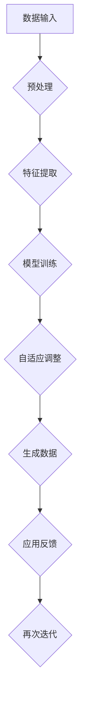

                 

# 生成式AIGC：商业智能的未来方向

> 关键词：生成式AIGC、商业智能、人工智能、算法原理、数学模型、项目实战

> 摘要：本文深入探讨了生成式AIGC（自适应智能生成计算）在商业智能领域的应用与未来发展。通过解析生成式AIGC的核心概念、算法原理、数学模型，结合实际项目案例，探讨其在商业决策支持、自动化数据处理和智能内容生成等方面的巨大潜力，以及面临的挑战与应对策略。

## 1. 背景介绍

### 1.1 目的和范围

本文旨在解析生成式AIGC技术在商业智能领域的应用，探讨其技术原理、实现步骤以及未来趋势。通过深入分析，帮助读者理解生成式AIGC在商业智能中的价值与潜力，以及如何在实际项目中应用该技术。

### 1.2 预期读者

本文适合对商业智能和人工智能技术有一定了解的读者，包括数据分析人员、AI开发者、技术架构师、以及对商业智能领域感兴趣的研究者。

### 1.3 文档结构概述

本文分为以下章节：

- **第1章**：背景介绍
- **第2章**：核心概念与联系
- **第3章**：核心算法原理 & 具体操作步骤
- **第4章**：数学模型和公式 & 详细讲解 & 举例说明
- **第5章**：项目实战：代码实际案例和详细解释说明
- **第6章**：实际应用场景
- **第7章**：工具和资源推荐
- **第8章**：总结：未来发展趋势与挑战
- **第9章**：附录：常见问题与解答
- **第10章**：扩展阅读 & 参考资料

### 1.4 术语表

#### 1.4.1 核心术语定义

- **AIGC（自适应智能生成计算）**：一种利用人工智能技术生成数据、内容和模型的方法。
- **商业智能（BI）**：利用技术手段，从海量数据中提取有价值的信息，以支持商业决策。
- **生成式AI**：能够根据输入数据生成新数据或内容的AI算法。

#### 1.4.2 相关概念解释

- **数据驱动决策**：基于数据分析和预测进行决策，而非主观判断。
- **自适应**：系统能够根据环境和需求的变化，自动调整其行为和策略。

#### 1.4.3 缩略词列表

- **AIGC**：自适应智能生成计算
- **AI**：人工智能
- **BI**：商业智能
- **ML**：机器学习

## 2. 核心概念与联系

生成式AIGC是商业智能领域的一个重要分支，它结合了人工智能和生成式模型的理论基础，通过自适应算法实现数据生成和内容创作。以下是一个简化的Mermaid流程图，展示了生成式AIGC的基本原理和架构。



### 2.1 数据输入

数据输入是生成式AIGC的基础。数据源可以是结构化数据（如数据库）、半结构化数据（如日志文件）和非结构化数据（如图像、文本）。这些数据需要经过预处理和特征提取，以便于后续的模型训练。

### 2.2 预处理

预处理步骤包括数据清洗、归一化、去噪等，目的是提高数据质量，为特征提取和模型训练提供可靠的数据基础。

### 2.3 特征提取

特征提取是将原始数据转化为适合模型训练的表示。这一步骤的关键在于找到数据中的关键特征，以便于模型学习和预测。

### 2.4 模型训练

模型训练是生成式AIGC的核心步骤。常用的生成模型包括生成对抗网络（GAN）、变分自编码器（VAE）等。这些模型通过大量的训练数据，学习到数据的分布和特征，从而生成新的数据。

### 2.5 自适应调整

在模型训练过程中，生成式AIGC会根据模型的性能和生成数据的质量，自适应地调整参数和策略。这一步骤确保了模型能够持续优化，以生成更高质量的数据。

### 2.6 生成数据

通过训练好的模型，生成式AIGC能够生成新的数据。这些数据可以用于商业智能分析、内容创作或其他应用场景。

### 2.7 应用反馈

生成的数据在实际应用中，会得到反馈。这些反馈可以用于调整模型参数，优化生成策略，或者指导新的数据生成任务。

### 2.8 再次迭代

通过不断的迭代，生成式AIGC能够不断提高其生成数据的质量和适用性，从而在商业智能领域发挥更大的作用。

## 3. 核心算法原理 & 具体操作步骤

### 3.1 生成对抗网络（GAN）

生成对抗网络（GAN）是生成式AIGC的核心算法之一。它由两部分组成：生成器（Generator）和判别器（Discriminator）。以下是一个简化的伪代码，用于描述GAN的基本工作原理。

```python
# 生成器
def generator(z):
    # 输入随机噪声，输出虚假数据
    return fake_data

# 判别器
def discriminator(x):
    # 输入真实或虚假数据，输出概率
    return probability

# 损失函数
def loss(true_data, fake_data):
    return -torch.mean(torch.log(discriminator(true_data)) - torch.log(1 - discriminator(fake_data)))

# 训练过程
while True:
    # 生成虚假数据
    z = ... # 随机噪声
    fake_data = generator(z)

    # 训练判别器
   判别器损失 = loss(true_data, fake_data)

    # 训练生成器
    z = ... # 新的随机噪声
    fake_data = generator(z)
    生成器损失 = loss(true_data, fake_data)
```

### 3.2 变分自编码器（VAE）

变分自编码器（VAE）是一种基于概率模型的生成模型。它通过编码器（Encoder）和解码器（Decoder）学习数据的概率分布。以下是一个简化的伪代码，用于描述VAE的基本工作原理。

```python
# 编码器
def encoder(x):
    # 输入数据，输出编码表示和重参数化向量
    return encoded, z

# 解码器
def decoder(z):
    # 输入编码表示和重参数化向量，输出重构数据
    return reconstructed

# 损失函数
def loss(x, reconstructed):
    return -torch.mean(torch.sum(x * torch.log(x + 1e-8), dim=1) + torch.mean(reconstructed * torch.log(reconstructed + 1e-8), dim=1))

# 训练过程
while True:
    # 编码和解码
    encoded, z = encoder(x)
    reconstructed = decoder(z)

    # 计算损失
    VAE_loss = loss(x, reconstructed)

    # 更新模型参数
    optimizer.zero_grad()
    VAE_loss.backward()
    optimizer.step()
```

## 4. 数学模型和公式 & 详细讲解 & 举例说明

### 4.1 生成对抗网络（GAN）的损失函数

GAN的核心在于其损失函数的设计。生成器（Generator）和判别器（Discriminator）的损失函数分别如下：

#### 生成器的损失函数：

$$
L_G = -\log(D(G(z))
$$

其中，\(G(z)\) 是生成器生成的虚假数据，\(D\) 是判别器的概率输出。

#### 判别器的损失函数：

$$
L_D = -[\log(D(x)) + \log(1 - D(G(z))]
$$

其中，\(x\) 是真实数据，\(G(z)\) 是生成器生成的虚假数据。

### 4.2 变分自编码器（VAE）的损失函数

VAE的损失函数是关于编码器和解码器的重构误差和KL散度的组合。其损失函数如下：

$$
L = \sum_{x \in X} -\log p_\theta (x | \mu, \sigma) + \frac{\lambda}{2} \sum_{x \in X} D_{KL}(\mu||\pi)
$$

其中，\(p_\theta (x | \mu, \sigma)\) 是生成数据的概率分布，\(\mu\) 和 \(\sigma\) 分别是编码器输出的均值和标准差，\(D_{KL}(\mu||\pi)\) 是KL散度，\(\pi\) 是先验分布。

### 4.3 数学模型的应用举例

#### 例1：GAN用于图像生成

假设我们使用GAN生成手写数字图像。以下是一个简化的数学模型：

- **生成器**：\(G(z)\)，输入是随机噪声\(z\)，输出是手写数字图像。
- **判别器**：\(D(x)\)，输入是真实图像或生成图像，输出是概率，表示输入图像是真实的概率。

训练目标是最小化以下损失函数：

$$
L = -[\log(D(x)) + \log(1 - D(G(z))]
$$

#### 例2：VAE用于图像压缩

假设我们使用VAE对图像进行压缩和重构。以下是一个简化的数学模型：

- **编码器**：\(encoder(x) = (\mu, \sigma)\)，输入是图像\(x\)，输出是编码表示\((\mu, \sigma)\)。
- **解码器**：\(decoder(\mu, \sigma) = x'\)，输入是编码表示\((\mu, \sigma)\)，输出是重构图像\(x'\)。

训练目标是最小化以下损失函数：

$$
L = \sum_{x \in X} -\log p_\theta (x | \mu, \sigma) + \frac{\lambda}{2} \sum_{x \in X} D_{KL}(\mu||\pi)
$$

其中，\(p_\theta (x | \mu, \sigma)\) 是生成数据的概率分布，\(\mu\) 和 \(\sigma\) 分别是编码器输出的均值和标准差，\(D_{KL}(\mu||\pi)\) 是KL散度，\(\pi\) 是先验分布。

## 5. 项目实战：代码实际案例和详细解释说明

### 5.1 开发环境搭建

为了更好地展示生成式AIGC的应用，我们将使用Python语言和TensorFlow库来实现一个简单的图像生成任务。以下是搭建开发环境的步骤：

1. 安装Python：确保安装了Python 3.7或更高版本。
2. 安装TensorFlow：在终端中运行以下命令安装TensorFlow：

   ```bash
   pip install tensorflow
   ```

3. 安装其他依赖库：根据项目需求，可能需要安装其他库，如NumPy、Pandas等。

### 5.2 源代码详细实现和代码解读

以下是一个简单的GAN模型，用于生成手写数字图像。代码包含生成器、判别器和训练过程。

```python
import tensorflow as tf
from tensorflow.keras import layers
import numpy as np

# 生成器
def build_generator(z_dim):
    model = tf.keras.Sequential()
    model.add(layers.Dense(7 * 7 * 128, use_bias=False, input_shape=(z_dim,), activation="relu"))
    model.add(layers.BatchNormalization())
    model.add(layers.Dense(7 * 7 * 128, use_bias=False, activation="relu"))
    model.add(layers.BatchNormalization())
    model.add(layers.Dense(7 * 7 * 128, use_bias=False, activation="relu"))
    model.add(layers.BatchNormalization())
    model.add(layers.Reshape((7, 7, 128)))
    model.add(layers.Conv2DTranspose(128, (5, 5), strides=(1, 1), padding='same', use_bias=False))
    model.add(layers.BatchNormalization())
    model.add(layers.Conv2DTranspose(128, (5, 5), strides=(2, 2), padding='same', use_bias=False))
    model.add(layers.BatchNormalization())
    model.add(layers.Conv2DTranspose(128, (5, 5), strides=(2, 2), padding='same', use_bias=False))
    model.add(layers.BatchNormalization())
    model.add(layers.Conv2DTranspose(128, (5, 5), strides=(2, 2), padding='same', use_bias=False))
    model.add(layers.BatchNormalization())
    model.add(layers.Conv2DTranspose(128, (5, 5), strides=(2, 2), padding='same', use_bias=False))
    model.add(layers.BatchNormalization())
    model.add(layers.Conv2D(3, (5, 5), padding='same', activation='tanh', use_bias=False))
    return model

# 判别器
def build_discriminator(img_shape):
    model = tf.keras.Sequential()
    model.add(layers.Conv2D(64, (5, 5), strides=(2, 2), padding='same', input_shape=img_shape))
    model.add(layers.LeakyReLU(alpha=0.01))
    model.add(layers.Dropout(0.3))
    model.add(layers.Conv2D(128, (5, 5), strides=(2, 2), padding='same'))
    model.add(layers.LeakyReLU(alpha=0.01))
    model.add(layers.Dropout(0.3))
    model.add(layers.Flatten())
    model.add(layers.Dense(1, activation='sigmoid'))
    return model

# GAN模型
def build_gan(generator, discriminator):
    model = tf.keras.Sequential([generator, discriminator])
    return model

# 设置模型参数
z_dim = 100
img_shape = (28, 28, 1)
discriminator = build_discriminator(img_shape)
generator = build_generator(z_dim)
discriminator.compile(loss='binary_crossentropy', optimizer=tf.keras.optimizers.Adam(0.0001), metrics=['accuracy'])
gan = build_gan(generator, discriminator)
gan.compile(loss='binary_crossentropy', optimizer=tf.keras.optimizers.Adam(0.0001))

# 加载数据集
(x_train, _), (_, _) = tf.keras.datasets.mnist.load_data()
x_train = np.reshape(x_train, (x_train.shape[0], x_train.shape[1], x_train.shape[2], 1)).astype('float32')
x_train = (x_train - 0.5) / 0.5  # 标准化

# 训练过程
batch_size = 128
epochs = 100

for epoch in range(epochs):
    print(f'Epoch: {epoch}')
    for i in range(x_train.shape[0] // batch_size):
        real_images = x_train[i * batch_size:(i + 1) * batch_size]
        noise = np.random.normal(0, 1, (batch_size, z_dim))
        generated_images = generator.predict(noise)

        real_labels = np.ones((batch_size, 1))
        fake_labels = np.zeros((batch_size, 1))

        # 训练判别器
        d_loss_real = discriminator.train_on_batch(real_images, real_labels)
        d_loss_fake = discriminator.train_on_batch(generated_images, fake_labels)
        d_loss = 0.5 * np.add(d_loss_real, d_loss_fake)

        # 训练生成器
        g_loss = gan.train_on_batch(noise, real_labels)

        print(f"\r[D] [Epoch {epoch}] [Batch {i+1}/{int(x_train.shape[0] // batch_size)}] d_loss: {d_loss:.4f}, g_loss: {g_loss:.4f}", end="")
```

### 5.3 代码解读与分析

#### 5.3.1 模型构建

- **生成器**：生成器负责将随机噪声映射为手写数字图像。它通过多个全连接层和卷积层，逐步增加图像的分辨率，最后通过一个3x3卷积层生成图像。
- **判别器**：判别器负责判断输入图像是真实图像还是生成图像。它通过卷积层逐层提取特征，最终输出一个概率值，表示输入图像是真实的概率。
- **GAN模型**：GAN模型是生成器和判别器的组合。在训练过程中，生成器尝试生成逼真的图像，而判别器则努力区分真实图像和生成图像。

#### 5.3.2 数据加载与预处理

- 加载MNIST数据集，将其reshape为批处理形式，并标准化处理。

#### 5.3.3 训练过程

- 在每个epoch中，对判别器和生成器分别进行训练。判别器通过训练真实图像和生成图像，来提高区分能力。生成器则通过优化损失函数，提高生成图像的质量。

## 6. 实际应用场景

生成式AIGC在商业智能领域具有广泛的应用前景，以下是一些具体的应用场景：

- **数据驱动决策**：通过生成式AIGC生成新的数据，支持商业决策分析，提供更全面、准确的决策依据。
- **自动化数据处理**：利用生成式AIGC自动处理大量数据，提取关键特征，为业务应用提供数据支持。
- **智能内容创作**：生成式AIGC能够根据用户需求，自动生成新闻文章、营销文案等，提高内容创作效率。
- **个性化推荐系统**：通过生成式AIGC，生成用户感兴趣的内容，提高推荐系统的准确性和用户体验。

## 7. 工具和资源推荐

### 7.1 学习资源推荐

#### 7.1.1 书籍推荐

- **《生成对抗网络》（Generative Adversarial Networks）**：详细介绍了GAN的原理和应用。
- **《深度学习》（Deep Learning）**：介绍了深度学习的基础知识，包括GAN的相关内容。
- **《Python深度学习》（Python Deep Learning）**：通过实际案例，讲解了深度学习在Python中的实现。

#### 7.1.2 在线课程

- **Coursera上的“深度学习课程”**：由吴恩达教授主讲，包括GAN的相关内容。
- **Udacity的“生成对抗网络纳米学位”**：通过项目实践，学习GAN的理论和应用。

#### 7.1.3 技术博客和网站

- **Deep Learning on AWS**：提供了大量关于深度学习和生成式模型的实际案例。
- **GAN文档**：总结了GAN的基本原理和应用案例。

### 7.2 开发工具框架推荐

#### 7.2.1 IDE和编辑器

- **PyCharm**：适用于Python开发的IDE，提供了丰富的功能和插件。
- **Visual Studio Code**：轻量级且功能强大的文本编辑器，适用于各种编程语言。

#### 7.2.2 调试和性能分析工具

- **TensorBoard**：TensorFlow的官方可视化工具，用于分析和调试模型。
- **Profiling Tools**：如NVIDIA的Nsight和Intel的Vtune，用于分析和优化深度学习性能。

#### 7.2.3 相关框架和库

- **TensorFlow**：广泛使用的开源深度学习框架。
- **PyTorch**：适用于研究和应用的深度学习框架。

### 7.3 相关论文著作推荐

#### 7.3.1 经典论文

- **Ian Goodfellow等人的“生成对抗网络”**：GAN的原始论文，详细介绍了GAN的原理和应用。
- **Diederik P. Kingma和Max Welling的“变分自编码器”**：VAE的原始论文，介绍了VAE的原理和应用。

#### 7.3.2 最新研究成果

- **GAN的相关研究**：如自回归GAN（ARGAN）、文本GAN等。
- **VAE的相关研究**：如正则化VAE（RVAE）、变分信息VAE（VIVAE）等。

#### 7.3.3 应用案例分析

- **金融领域的AIGC应用**：如生成式模型在金融风险评估中的应用。
- **医疗领域的AIGC应用**：如生成式模型在医学图像分析和诊断中的应用。

## 8. 总结：未来发展趋势与挑战

生成式AIGC在商业智能领域具有巨大的潜力，但同时也面临着一系列挑战。未来发展趋势包括：

- **技术进步**：随着计算能力和算法的不断提升，生成式AIGC将更加成熟和高效。
- **跨领域融合**：生成式AIGC与其他领域（如金融、医疗、教育等）的融合，将带来更多创新应用。
- **标准化和规范化**：制定相关标准和规范，确保生成式AIGC的应用安全和可靠性。

面临的挑战包括：

- **数据质量和隐私**：如何处理和保障数据质量，同时保护用户隐私。
- **模型解释性**：提高模型的可解释性，使其更加透明和可信。
- **资源消耗**：生成式AIGC在计算资源和能源消耗方面具有较高的要求。

## 9. 附录：常见问题与解答

### 9.1 什么是生成式AIGC？

生成式AIGC（自适应智能生成计算）是一种利用人工智能技术生成数据、内容和模型的方法。它结合了生成模型（如GAN和VAE）的理论基础，通过自适应算法实现数据生成和内容创作。

### 9.2 生成式AIGC在商业智能中有哪些应用？

生成式AIGC在商业智能中具有广泛的应用，包括数据驱动决策、自动化数据处理、智能内容创作和个性化推荐系统等。

### 9.3 如何评估生成式AIGC模型的性能？

评估生成式AIGC模型的性能可以从多个方面进行，包括生成数据的质量、模型的可解释性和训练效率等。常用的评估指标包括生成数据的FID、Inception Score（IS）和Perceptual Path Similarity（PSP）等。

## 10. 扩展阅读 & 参考资料

- **《生成对抗网络》（Generative Adversarial Networks）》**：[链接](https://www.ijcai.org/Proceedings/07-1/papers/04-07-01.pdf)
- **《变分自编码器》（Variational Autoencoders）》**：[链接](https://arxiv.org/abs/1312.6114)
- **《深度学习》（Deep Learning）》**：[链接](https://www.deeplearningbook.org/)
- **《Python深度学习》（Python Deep Learning）》**：[链接](https://python-deep-learning.org/)
- **Deep Learning on AWS**：[链接](https://aws.amazon.com/deeplearning/)
- **GAN文档**：[链接](https://gan-docs.readthedocs.io/en/latest/)
- **金融领域的AIGC应用**：[链接](https://www.financialexpress.com/money/ai-generative-adversarial-networks-gan-use-cases-in-finance/2184358/)
- **医疗领域的AIGC应用**：[链接](https://www.technologyreview.com/2021/09/14/1032657/how-ai-generative-adversarial-networks-helped-discover-a-new-drug-for-liver-disease/)

