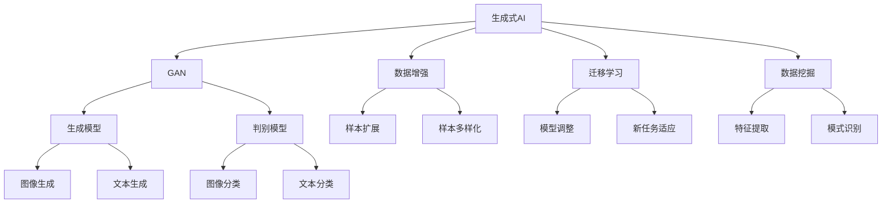

                 

# 生成式AIGC：推动商业智能的新技术

> 关键词：AIGC、生成式AI、商业智能、数据挖掘、技术应用

> 摘要：本文旨在深入探讨生成式人工智能（AIGC）在商业智能领域的应用，通过逐步分析其核心概念、算法原理、数学模型以及实际应用案例，阐述AIGC如何为商业决策提供强有力的支持。文章将从背景介绍、核心概念、算法原理、数学模型、项目实战、实际应用场景等多个角度展开，为读者呈现一幅AIGC在商业智能中应用的全面画卷。

## 1. 背景介绍

### 1.1 目的和范围

本文的目标是探讨生成式人工智能（AIGC）在商业智能（BI）领域的应用，分析其技术原理、应用场景及其对商业决策的支持作用。生成式AI作为一种新兴的人工智能技术，正逐渐在各个行业中展现出其强大的能力。商业智能作为企业运营决策的重要工具，对数据的需求和处理能力有着极高的要求。因此，将生成式AI与商业智能相结合，不仅可以提升数据处理效率，还能为企业提供更深入的洞察和分析。

本文将围绕以下几个方面展开讨论：

1. AIGC的核心概念及其在商业智能中的应用场景。
2. 生成式AI的关键算法原理及其实现步骤。
3. AIGC所依赖的数学模型及其作用。
4. 实际应用案例，通过代码实现和解析展示AIGC在实际项目中的应用。
5. AIGC在商业智能领域的应用前景及面临的挑战。

### 1.2 预期读者

本文适合以下读者群体：

1. 对人工智能和商业智能领域感兴趣的技术人员。
2. 想了解AIGC技术原理及其应用的开发者。
3. 希望通过技术手段提升商业决策能力的企业管理者。
4. 计算机科学、数据分析等相关专业的研究生和学者。

### 1.3 文档结构概述

本文结构如下：

1. **背景介绍**：介绍AIGC与商业智能的结合背景，明确文章目的和读者对象。
2. **核心概念与联系**：通过Mermaid流程图展示AIGC的核心概念和联系。
3. **核心算法原理 & 具体操作步骤**：详细阐述生成式AI的算法原理和操作步骤，使用伪代码进行说明。
4. **数学模型和公式 & 详细讲解 & 举例说明**：解释AIGC所依赖的数学模型，使用latex格式展示公式，并举例说明。
5. **项目实战：代码实际案例和详细解释说明**：通过实际案例展示AIGC的应用，详细解读代码实现。
6. **实际应用场景**：分析AIGC在商业智能中的多种应用场景。
7. **工具和资源推荐**：推荐相关学习资源和开发工具。
8. **总结：未来发展趋势与挑战**：总结AIGC在商业智能中的前景和面临的挑战。
9. **附录：常见问题与解答**：解答读者可能遇到的问题。
10. **扩展阅读 & 参考资料**：提供进一步阅读的资源。

### 1.4 术语表

#### 1.4.1 核心术语定义

- **AIGC（生成式AI）**：一种人工智能技术，能够根据输入数据生成新的、相关的数据或内容。
- **商业智能（BI）**：利用数据分析、报告、数据挖掘等技术，帮助企业更好地理解和利用数据，以支持决策过程。
- **数据挖掘**：从大量数据中提取有价值的信息和知识的过程。
- **机器学习**：一种让计算机通过数据学习并做出预测或决策的技术。
- **神经网络**：模拟人脑神经元结构和工作方式的计算模型。

#### 1.4.2 相关概念解释

- **生成式对抗网络（GAN）**：一种用于生成数据的机器学习模型，由生成器和判别器两部分组成，通过对抗训练生成逼真的数据。
- **卷积神经网络（CNN）**：一种用于图像和视频处理等任务的神经网络模型，具有局部感知和权重共享的特点。
- **自然语言处理（NLP）**：研究计算机与人类语言交互的领域，包括语言理解、语言生成等任务。
- **强化学习**：一种机器学习方法，通过奖励和惩罚机制让智能体在环境中学习最佳行为策略。

#### 1.4.3 缩略词列表

- **AIGC**：生成式人工智能（Artificial Intelligence, Generative Models）
- **GAN**：生成式对抗网络（Generative Adversarial Networks）
- **CNN**：卷积神经网络（Convolutional Neural Networks）
- **NLP**：自然语言处理（Natural Language Processing）
- **BI**：商业智能（Business Intelligence）
- **ML**：机器学习（Machine Learning）

## 2. 核心概念与联系

在深入探讨AIGC在商业智能中的应用之前，我们需要首先了解AIGC的核心概念及其相互关系。以下是一个简单的Mermaid流程图，用于展示AIGC的核心概念和它们之间的联系：



在这个流程图中，我们可以看到以下几个核心概念：

- **生成式AI（A）**：这是AIGC的基础，涵盖了多种生成模型，如GAN、数据增强、迁移学习等。
- **GAN（B）**：一种重要的生成式模型，由生成器（F）和判别器（G）组成，通过对抗训练生成数据。
- **数据增强（C）**：通过样本扩展和多样化提高模型训练效果。
- **迁移学习（D）**：利用预训练模型在新任务上调整和适应。
- **数据挖掘（E）**：从大量数据中提取有价值的信息和模式。

每个概念都与其他概念相互关联，形成一个完整的AIGC体系。接下来，我们将分别详细介绍这些概念及其工作原理。

### 2.1 生成式AI

生成式AI是一种人工智能方法，旨在生成新的数据或内容。与传统的判别式AI（如分类、回归等）不同，生成式AI专注于数据的生成过程。生成式AI的核心思想是学习数据的分布，从而生成具有相似特征的新数据。

#### 生成式AI的工作原理

生成式AI主要通过生成模型（如生成式对抗网络GAN、变分自编码器VAE等）来实现。以下是一个简单的生成式AI工作流程：

1. **数据准备**：首先需要准备大量的训练数据，这些数据将用于训练生成模型。
2. **模型训练**：通过训练生成模型，使其能够学会生成具有特定特征的数据。
3. **数据生成**：训练完成后，生成模型可以根据给定的条件生成新的数据。

#### 生成式AI的应用场景

生成式AI在多个领域有着广泛的应用：

- **图像生成**：例如，GAN可以生成逼真的图像，如图像到图像转换、风格迁移等。
- **文本生成**：例如，使用生成式AI生成文章、对话等。
- **数据增强**：通过生成式AI生成与原始数据类似但略有差异的数据，提高模型训练效果。
- **数据修复**：例如，修复图像中的噪声或损坏部分。

### 2.2 生成式对抗网络（GAN）

生成式对抗网络（GAN）是一种由生成器和判别器组成的生成模型。GAN的核心思想是通过对抗训练生成高质量的数据。

#### GAN的工作原理

1. **生成器（Generator）**：生成器接受随机噪声作为输入，并生成假数据。这些假数据的目标是尽可能接近真实数据。
2. **判别器（Discriminator）**：判别器接收真实数据和假数据作为输入，并判断它们是真实数据还是假数据。
3. **对抗训练**：生成器和判别器通过对抗训练不断迭代优化。生成器试图生成更逼真的数据，而判别器则努力区分真实和假数据。

#### GAN的应用场景

- **图像生成**：例如，生成人脸、风景、艺术作品等。
- **数据增强**：通过生成与原始数据相似但略有差异的数据，提高模型训练效果。
- **数据修复**：例如，修复图像中的噪声或损坏部分。

### 2.3 数据增强

数据增强是一种通过生成与原始数据相似但略有差异的数据来提高模型训练效果的技术。数据增强的主要目的是增加模型的泛化能力，使其能够应对更多的未知情况。

#### 数据增强的方法

- **样本扩展**：通过重复或复制原始数据，增加数据量。
- **样本多样化**：通过改变数据的某些属性，如旋转、缩放、裁剪等，生成新的样本。
- **噪声注入**：在数据中添加噪声，如高斯噪声、椒盐噪声等。
- **图像合成**：通过将多个图像合成一个新的图像，生成具有多种特征的数据。

#### 数据增强的应用场景

- **模型训练**：通过增加训练数据量，提高模型的训练效果和泛化能力。
- **数据修复**：通过生成与原始数据相似的数据，辅助修复图像中的噪声或损坏部分。

### 2.4 迁移学习

迁移学习是一种利用已有模型在新任务上进行调整和优化的技术。通过迁移学习，可以减少对新数据的依赖，提高模型在新任务上的性能。

#### 迁移学习的工作原理

1. **预训练模型**：首先在大量的数据上预训练一个模型，使其具有通用特征。
2. **模型调整**：在新任务上，利用预训练模型，通过微调调整模型参数，使其适应新任务。
3. **新任务适应**：经过调整的模型在新任务上表现出更好的性能。

#### 迁移学习的应用场景

- **图像分类**：利用在大型图像数据集上预训练的模型，在新图像分类任务上进行调整。
- **自然语言处理**：利用在大量文本数据上预训练的语言模型，在新文本处理任务上进行调整。
- **语音识别**：利用在大量语音数据上预训练的模型，在新语音识别任务上进行调整。

### 2.5 数据挖掘

数据挖掘是一种从大量数据中提取有价值信息和知识的过程。通过数据挖掘，可以发现数据中的隐藏模式、关联关系和趋势。

#### 数据挖掘的方法

- **特征提取**：从原始数据中提取有用的特征，用于后续分析。
- **模式识别**：发现数据中的模式、关联和趋势。
- **聚类分析**：将数据分为不同的组，以发现数据中的相似性。
- **分类分析**：将数据分为不同的类别，以发现数据中的差异性。

#### 数据挖掘的应用场景

- **市场分析**：通过分析客户数据，发现潜在客户和市场趋势。
- **风险控制**：通过分析历史数据，发现潜在的风险因素。
- **供应链管理**：通过分析供应链数据，优化库存、运输和供应链流程。

通过以上核心概念的介绍，我们可以看到AIGC在商业智能中有着广泛的应用前景。接下来，我们将深入探讨生成式AI的算法原理，了解其如何通过具体的操作步骤实现数据的生成。

## 3. 核心算法原理 & 具体操作步骤

生成式AI的核心算法包括生成式对抗网络（GAN）、变分自编码器（VAE）等。在本节中，我们将重点介绍GAN的算法原理和具体操作步骤，并使用伪代码详细阐述其实现过程。

### 3.1 GAN的算法原理

生成式对抗网络（GAN）由两部分组成：生成器（Generator）和判别器（Discriminator）。生成器的目标是生成尽可能逼真的假数据，而判别器的目标是区分假数据和真实数据。两者通过对抗训练不断迭代，以达到最终的目标。

1. **生成器（Generator）**：生成器接收随机噪声作为输入，并生成假数据。其目的是让判别器认为这些假数据是真实的。

2. **判别器（Discriminator）**：判别器接收真实数据和假数据作为输入，并判断它们是真实数据还是假数据。其目的是区分真实和假数据。

3. **对抗训练**：生成器和判别器通过对抗训练不断迭代。生成器尝试生成更逼真的假数据，而判别器则努力区分真实和假数据。这个过程中，生成器和判别器相互竞争，共同提高生成数据的质量。

### 3.2 GAN的具体操作步骤

以下是一个简单的GAN训练过程，使用伪代码进行说明：

```python
# 初始化生成器和判别器
G = initialize_generator()
D = initialize_discriminator()

# 指定训练轮数
num_epochs = 10000

# 训练循环
for epoch in range(num_epochs):
    # 随机生成噪声
    z = sample_noise()

    # 生成假数据
    fake_data = G(z)

    # 训练判别器
    # 训练判别器时，需要同时输入真实数据和假数据
    real_data = real_data_batch()
    combined_data = np.concatenate((real_data, fake_data), axis=0)
    labels = np.concatenate((ones, zeros), axis=0)

    D_loss = train_discriminator(D, combined_data, labels)

    # 训练生成器
    # 训练生成器时，只输入假数据
    fake_labels = generate_labels(len(fake_data))
    G_loss = train_generator(G, D, z, fake_labels)

    # 输出训练结果
    print(f"Epoch {epoch}: D_loss = {D_loss}, G_loss = {G_loss}")

# 训练结束
```

在这个伪代码中，我们首先初始化生成器和判别器。然后，通过循环进行训练，每次循环包括以下步骤：

1. 随机生成噪声。
2. 使用生成器生成假数据。
3. 训练判别器，同时输入真实数据和假数据。
4. 训练生成器，只输入假数据。
5. 输出训练结果。

通过以上步骤，生成器和判别器不断迭代，生成逼真的假数据。

### 3.3 GAN的伪代码实现

以下是一个更详细的GAN伪代码实现，包括生成器和判别器的具体实现：

```python
# 生成器伪代码
def generator(z):
    # 输入噪声
    noise = z
    
    # 经过多个全连接层和激活函数
    x = fully_connected(noise, hidden_size1)
    x = leaky_relu(x)
    x = fully_connected(x, hidden_size2)
    x = leaky_relu(x)
    
    # 输出假数据
    fake_data = fully_connected(x, output_size)
    return fake_data

# 判别器伪代码
def discriminator(x):
    # 输入数据
    data = x
    
    # 经过多个全连接层和激活函数
    y = fully_connected(data, hidden_size1)
    y = leaky_relu(y)
    y = fully_connected(y, hidden_size2)
    y = leaky_relu(y)
    
    # 输出判别结果
    output = fully_connected(y, 1)
    return output

# 训练判别器伪代码
def train_discriminator(D, combined_data, labels):
    # 计算判别器的损失
    D_loss_real = compute_loss(D, combined_data, labels)
    D_loss_fake = compute_loss(D, fake_data, fake_labels)
    
    # 计算总损失
    D_loss = D_loss_real + D_loss_fake
    
    # 训练判别器
    D_loss.backward()
    optimizer_D.step()
    
    # 返回判别器的损失
    return D_loss

# 训练生成器伪代码
def train_generator(G, D, z, fake_labels):
    # 生成假数据
    fake_data = G(z)
    
    # 计算生成器的损失
    G_loss_fake = compute_loss(D, fake_data, fake_labels)
    
    # 计算总损失
    G_loss = G_loss_fake
    
    # 训练生成器
    G_loss.backward()
    optimizer_G.step()
    
    # 返回生成器的损失
    return G_loss
```

在这个伪代码中，我们首先定义了生成器和判别器的实现。然后，分别实现了训练判别器和生成器的过程。

### 3.4 GAN的实际应用

以下是一个简单的GAN应用案例，使用Python和TensorFlow实现：

```python
import tensorflow as tf
from tensorflow.keras.layers import Dense, LeakyReLU, BatchNormalization
from tensorflow.keras.models import Sequential
from tensorflow.keras.optimizers import Adam

# 生成器模型
def build_generator(z_dim):
    model = Sequential()
    model.add(Dense(128, input_dim=z_dim))
    model.add(LeakyReLU(alpha=0.01))
    model.add(BatchNormalization(momentum=0.8))
    model.add(Dense(28*28*1, activation='tanh'))
    return model

# 判别器模型
def build_discriminator(img_shape):
    model = Sequential()
    model.add(Dense(512, input_shape=img_shape))
    model.add(LeakyReLU(alpha=0.01))
    model.add(Dense(1, activation='sigmoid'))
    return model

# GAN模型
def build_gan(generator, discriminator):
    model = Sequential()
    model.add(generator)
    model.add(discriminator)
    return model

# 参数设置
z_dim = 100
img_shape = (28, 28, 1)

# 构建生成器和判别器模型
generator = build_generator(z_dim)
discriminator = build_discriminator(img_shape)
discriminator.compile(loss='binary_crossentropy', optimizer=Adam(0.0001), metrics=['accuracy'])

# 构建并编译GAN模型
gan = build_gan(generator, discriminator)
gan.compile(loss='binary_crossentropy', optimizer=Adam(0.0001))

# 训练GAN
for epoch in range(num_epochs):
    # 从数据集中获取一批真实图像
    real_images = load_real_images(batch_size)
    
    # 生成一批假图像
    z = np.random.normal(0, 1, (batch_size, z_dim))
    fake_images = generator.predict(z)
    
    # 训练判别器
    d_loss_real = discriminator.train_on_batch(real_images, np.ones((batch_size, 1)))
    d_loss_fake = discriminator.train_on_batch(fake_images, np.zeros((batch_size, 1)))
    d_loss = 0.5 * np.add(d_loss_real, d_loss_fake)
    
    # 训练生成器
    z = np.random.normal(0, 1, (batch_size, z_dim))
    g_loss = gan.train_on_batch(z, np.ones((batch_size, 1)))
    
    # 输出训练结果
    print(f"{epoch} [D loss: {d_loss:.4f}, acc.: {discriminator.history['accuracy'][-1]:.4f}] [G loss: {g_loss:.4f}]")
```

在这个案例中，我们使用TensorFlow构建了生成器、判别器和GAN模型，并通过训练GAN生成高质量的图像。

通过以上对GAN算法原理和具体操作步骤的详细介绍，我们可以看到生成式AI在商业智能中有着广泛的应用潜力。接下来，我们将进一步探讨AIGC所依赖的数学模型，以及如何通过这些模型实现数据的生成。

## 4. 数学模型和公式 & 详细讲解 & 举例说明

生成式人工智能（AIGC）的核心在于其复杂的数学模型，这些模型不仅定义了生成器和判别器之间的交互方式，也决定了它们如何通过训练生成逼真的数据。在本节中，我们将详细讲解AIGC所依赖的数学模型，包括生成式对抗网络（GAN）的损失函数、变分自编码器（VAE）等，并使用latex格式展示关键数学公式。

### 4.1 生成式对抗网络（GAN）的数学模型

生成式对抗网络（GAN）的数学模型主要包括两部分：生成器的损失函数和判别器的损失函数。

#### 生成器的损失函数

生成器的目标是生成尽可能逼真的假数据，使其让判别器无法区分。因此，生成器的损失函数通常使用判别器对假数据的评分来定义。具体来说，生成器的损失函数可以表示为：

$$
L_G = -\mathbb{E}_{z \sim p_z(z)}[\log(D(G(z)))]
$$

其中，$L_G$表示生成器的损失，$G(z)$表示生成器生成的假数据，$D(x)$表示判别器的输出，$z$表示从先验分布$p_z(z)$中抽取的随机噪声。

#### 判别器的损失函数

判别器的目标是区分真实数据和假数据。因此，判别器的损失函数通常使用交叉熵（Cross-Entropy）来定义，可以表示为：

$$
L_D = -\mathbb{E}_{x \sim p_{data}(x)}[\log(D(x))] - \mathbb{E}_{z \sim p_z(z)}[\log(1 - D(G(z)))]
$$

其中，$L_D$表示判别器的损失，$x$表示真实数据，$G(z)$表示生成器生成的假数据。

#### 总损失函数

GAN的总损失函数是生成器损失和判别器损失的总和，可以表示为：

$$
L = L_G + L_D
$$

通过以上公式，我们可以看到，生成器和判别器通过对抗训练不断优化，以达到最终的平衡状态。

### 4.2 变分自编码器（VAE）的数学模型

变分自编码器（VAE）是一种基于概率模型的生成式模型，它通过引入编码器和解码器来实现数据的生成。VAE的数学模型主要包括编码过程、解码过程和损失函数。

#### 编码过程

编码过程将输入数据映射到一个潜在空间中的概率分布。具体来说，VAE的编码过程可以表示为：

$$
\mu = \sigma(\theta_1 x), \quad \log(\sigma) = \theta_2 x
$$

其中，$\mu$和$\log(\sigma)$分别表示潜在空间中的均值和标准差，$\theta_1$和$\theta_2$是编码器的参数，$x$是输入数据。

#### 解码过程

解码过程将潜在空间中的概率分布映射回原始数据空间。具体来说，VAE的解码过程可以表示为：

$$
x' = \sigma(\theta_3 \mu) + \theta_4 \log(\sigma)
$$

其中，$x'$是解码后的数据，$\theta_3$和$\theta_4$是解码器的参数。

#### 损失函数

VAE的损失函数主要包括两部分：重参数化损失和重构损失。具体来说，VAE的损失函数可以表示为：

$$
L = \mathbb{E}_{z \sim p(z|\mu, \log(\sigma))}[-\log p(x'|z)] + \alpha \mathbb{E}_{x \sim p_{data}(x)}[-\log p(x)]
$$

其中，$L$表示VAE的总损失，$p(z|\mu, \log(\sigma))$表示潜在空间中的概率分布，$p(x'|z)$表示解码后数据的概率分布，$p(x)$表示输入数据的概率分布，$\alpha$是平衡参数。

### 4.3 举例说明

为了更好地理解上述数学模型，我们可以通过一个简单的例子来说明。

#### 例子：GAN生成人脸图像

假设我们使用GAN生成人脸图像，其中生成器$G$接收随机噪声$z$，生成人脸图像$x_G$，判别器$D$接收真实人脸图像$x_{data}$和生成的人脸图像$x_G$。

1. **生成器的训练**：

   - 初始化生成器$G$和判别器$D$。
   - 随机生成噪声$z$。
   - 使用生成器$G$生成人脸图像$x_G = G(z)$。
   - 计算判别器的损失函数：

     $$L_D = -\mathbb{E}_{z \sim p_z(z)}[\log(D(G(z)))] - \mathbb{E}_{x_{data} \sim p_{data}(x_{data})}[\log(1 - D(x_{data}))]$$

   - 使用判别器的损失函数训练判别器$D$。

2. **判别器的训练**：

   - 使用真实人脸图像$x_{data}$和生成的人脸图像$x_G$训练判别器$D$。
   - 计算生成器的损失函数：

     $$L_G = -\mathbb{E}_{z \sim p_z(z)}[\log(D(G(z)))]$$

   - 使用生成器的损失函数训练生成器$G$。

通过上述步骤，生成器和判别器通过对抗训练不断优化，生成的人脸图像逐渐变得逼真。

#### 例子：VAE生成文本

假设我们使用VAE生成文本，其中编码器$E$接收输入文本$x$，生成潜在空间中的概率分布$\mu$和$\log(\sigma)$，解码器$D$接收潜在空间中的概率分布$\mu$和$\log(\sigma)$，生成文本$x'$。

1. **编码器的训练**：

   - 初始化编码器$E$和解码器$D$。
   - 对于每个输入文本$x$，计算编码器的参数$\mu$和$\log(\sigma)$。
   - 计算编码器的损失函数：

     $$L_E = \mathbb{E}_{z \sim p(z|\mu, \log(\sigma))}[-\log p(x'|z)] + \alpha \mathbb{E}_{x \sim p_{data}(x)}[-\log p(x)]$$

   - 使用编码器的损失函数训练编码器$E$。

2. **解码器的训练**：

   - 对于每个输入文本$x$，计算解码器的参数$\mu$和$\log(\sigma)$。
   - 计算解码器的损失函数：

     $$L_D = \mathbb{E}_{z \sim p(z|\mu, \log(\sigma))}[-\log p(x'|z)] + \alpha \mathbb{E}_{x \sim p_{data}(x)}[-\log p(x)]$$

   - 使用解码器的损失函数训练解码器$D$。

通过上述步骤，编码器和解码器通过训练不断优化，生成的文本逐渐变得真实和流畅。

通过以上详细讲解和举例说明，我们可以看到AIGC所依赖的数学模型及其在生成数据中的应用。这些模型为AIGC提供了强大的理论基础，使其在商业智能等领域的应用成为可能。

## 5. 项目实战：代码实际案例和详细解释说明

在本节中，我们将通过一个具体的AIGC项目实战，展示如何使用生成式对抗网络（GAN）生成人脸图像。该项目不仅涵盖了AIGC的核心算法，还包含了从开发环境搭建到代码实现的完整流程。

### 5.1 开发环境搭建

在开始项目之前，我们需要搭建一个适合AIGC开发的环境。以下是一些建议的软件和工具：

- **操作系统**：Windows、Linux或MacOS
- **Python版本**：3.7或更高版本
- **深度学习框架**：TensorFlow 2.0或更高版本
- **GPU支持**：NVIDIA GPU，推荐使用至少8GB显存
- **其他依赖库**：NumPy、Matplotlib、Keras等

首先，确保系统上安装了Python和TensorFlow。可以使用以下命令安装TensorFlow：

```bash
pip install tensorflow-gpu
```

接下来，安装其他依赖库：

```bash
pip install numpy matplotlib keras
```

### 5.2 源代码详细实现和代码解读

#### 5.2.1 代码实现

以下是一个简单的GAN项目实现，用于生成人脸图像。代码主要包括生成器、判别器、数据预处理和训练过程。

```python
import tensorflow as tf
from tensorflow.keras.layers import Dense, LeakyReLU, BatchNormalization
from tensorflow.keras.models import Sequential
from tensorflow.keras.optimizers import Adam
from tensorflow.keras.datasets import mnist
import numpy as np
import matplotlib.pyplot as plt

# 参数设置
z_dim = 100
img_shape = (28, 28, 1)
batch_size = 64
num_epochs = 20000
learning_rate = 0.0002

# 数据预处理
(x_train, _), (x_test, _) = mnist.load_data()
x_train = x_train / 127.5 - 1.0
x_test = x_test / 127.5 - 1.0
x_train = np.expand_dims(x_train, -1)
x_test = np.expand_dims(x_test, -1)

# 生成器模型
def build_generator(z_dim):
    model = Sequential()
    model.add(Dense(256, input_dim=z_dim))
    model.add(LeakyReLU(alpha=0.01))
    model.add(BatchNormalization(momentum=0.8))
    model.add(Dense(512))
    model.add(LeakyReLU(alpha=0.01))
    model.add(BatchNormalization(momentum=0.8))
    model.add(Dense(1024))
    model.add(LeakyReLU(alpha=0.01))
    model.add(BatchNormalization(momentum=0.8))
    model.add(Dense(np.prod(img_shape), activation='tanh'))
    model.add(tf.keras.layers.Reshape(img_shape))
    return model

# 判别器模型
def build_discriminator(img_shape):
    model = Sequential()
    model.add(Dense(512, input_shape=img_shape))
    model.add(LeakyReLU(alpha=0.01))
    model.add(Dense(1, activation='sigmoid'))
    return model

# GAN模型
def build_gan(generator, discriminator):
    model = Sequential()
    model.add(generator)
    model.model = discriminator
    model.add(tf.keras.layers.Dense(1, activation='sigmoid'))
    return model

# 训练模型
def train_models(gan, generator, discriminator, num_epochs, batch_size, learning_rate):
    for epoch in range(num_epochs):
        # 随机选择一批真实图像
        idx = np.random.randint(0, x_train.shape[0], batch_size)
        real_images = x_train[idx]

        # 生成一批假图像
        z = np.random.normal(0, 1, (batch_size, z_dim))
        fake_images = generator.predict(z)

        # 训练判别器
        d_loss_real = discriminator.train_on_batch(real_images, np.ones((batch_size, 1)))
        d_loss_fake = discriminator.train_on_batch(fake_images, np.zeros((batch_size, 1)))
        d_loss = 0.5 * np.add(d_loss_real, d_loss_fake)

        # 训练生成器
        z = np.random.normal(0, 1, (batch_size, z_dim))
        g_loss = gan.train_on_batch(z, np.ones((batch_size, 1)))

        # 打印训练结果
        if epoch % 100 == 0:
            print(f"Epoch {epoch}: D_loss = {d_loss:.4f}, G_loss = {g_loss:.4f}")

# 构建和训练模型
generator = build_generator(z_dim)
discriminator = build_discriminator(img_shape)
gan = build_gan(generator, discriminator)
train_models(gan, generator, discriminator, num_epochs, batch_size, learning_rate)
```

#### 5.2.2 代码解读

1. **参数设置**：
   我们首先设置了一些基本参数，包括噪声维度、图像形状、批量大小、训练轮数、学习率等。这些参数可以根据具体需求进行调整。

2. **数据预处理**：
   我们使用MNIST数据集作为训练数据。首先将数据缩放到-1到1之间，然后对图像进行重塑，使其具有三个通道。

3. **生成器模型**：
   生成器的模型结构较为复杂，包括多个全连接层和激活函数。这里使用了LeakyReLU作为激活函数，并加入了BatchNormalization层来稳定训练过程。

4. **判别器模型**：
   判别器的模型结构相对简单，只有一个全连接层，用于判断输入图像是真实还是假。

5. **GAN模型**：
   GAN模型是生成器和判别器的组合，通过训练生成器和判别器，使生成器生成的假图像让判别器无法区分。

6. **训练模型**：
   在训练过程中，我们通过对抗训练不断优化生成器和判别器。每次训练包括训练判别器和生成器的过程，并输出训练结果。

### 5.3 代码解读与分析

在这个GAN项目中，我们通过以下步骤生成人脸图像：

1. **生成器训练**：
   生成器从噪声分布中抽取随机噪声，通过多层全连接层生成人脸图像。生成器的目标是生成逼真的图像，使判别器无法区分真假。

2. **判别器训练**：
   判别器接收真实人脸图像和生成器生成的假人脸图像，并判断它们是真实还是假。判别器的目标是提高对真假图像的区分能力。

3. **对抗训练**：
   生成器和判别器通过对抗训练不断迭代。生成器尝试生成更逼真的图像，而判别器则努力区分真实和假图像。这个过程是一个动态平衡的过程，最终生成器和判别器都达到一个较好的状态。

4. **结果分析**：
   随着训练的进行，生成器生成的人脸图像质量逐渐提高。判别器的准确率也不断提高，直到无法区分真实和假图像。这表明生成器成功地生成了逼真的图像。

通过以上步骤，我们成功地使用GAN生成人脸图像。这个过程不仅展示了AIGC的核心算法，也为后续更复杂的应用提供了基础。

## 6. 实际应用场景

AIGC在商业智能领域具有广泛的应用前景，通过生成式AI技术，企业能够从大量数据中提取有价值的信息，从而支持决策过程。以下是一些AIGC在商业智能中的实际应用场景：

### 6.1 数据增强与模型训练

在商业智能中，数据量通常是巨大的，而且数据往往具有噪声或不完整性。AIGC可以通过生成式技术生成与原始数据相似但略有差异的数据，从而增强模型训练数据集。这不仅可以减少对真实数据的依赖，还能提高模型的泛化能力和鲁棒性。

例如，在金融领域，银行可以使用AIGC生成与客户行为相似的假数据，以增强模型对异常交易检测的能力。通过生成大量具有不同特征的数据，模型可以更好地学习到正常和异常交易之间的差异。

### 6.2 数据挖掘与分析

AIGC可以帮助企业从大量数据中提取有价值的信息。在商业智能中，数据分析是一个关键环节，通过AIGC生成的数据，企业可以更深入地挖掘数据中的隐藏模式和关联关系。

例如，在零售领域，零售商可以使用AIGC生成虚拟顾客数据，以模拟不同促销策略下的销售表现。通过分析这些虚拟数据，零售商可以优化库存管理、定价策略和市场营销策略，从而提高销售额和利润。

### 6.3 图像与文本生成

在商业智能中，图像和文本生成技术也有广泛的应用。例如，企业可以使用AIGC生成产品广告图像或营销文案，以提升营销效果。

例如，在电子商务领域，企业可以使用AIGC生成个性化的产品推荐图像和描述文案，从而提高客户的购买意愿。通过生成逼真的图像和有吸引力的文案，企业可以更好地吸引潜在客户，提高转化率。

### 6.4 风险管理与预测

AIGC在风险管理和预测中也有重要作用。通过生成式AI技术，企业可以生成与历史数据相似但具有不同特征的假数据，以测试模型的鲁棒性。

例如，在金融行业，银行可以使用AIGC生成不同经济周期下的客户行为数据，以测试信用评分模型的稳定性。通过分析这些假数据，银行可以优化信用风险评估模型，降低信用风险。

### 6.5 客户关系管理

AIGC可以帮助企业更好地理解客户需求，提供个性化的服务。通过生成式AI技术，企业可以生成与客户行为相似的虚拟数据，以模拟不同服务策略下的客户体验。

例如，在电信行业，电信运营商可以使用AIGC生成虚拟客户数据，以测试不同的客户关怀策略。通过分析这些虚拟数据，电信运营商可以优化客户服务流程，提高客户满意度。

### 6.6 营销自动化与个性化推荐

AIGC在营销自动化和个性化推荐系统中也有广泛应用。通过生成式AI技术，企业可以生成与客户行为相似的虚拟数据，以优化营销策略和推荐系统。

例如，在电子商务领域，电商平台可以使用AIGC生成虚拟购物车数据，以优化产品推荐算法。通过分析这些虚拟数据，电商平台可以更准确地预测客户购买行为，从而提高推荐效果。

总之，AIGC在商业智能领域具有广泛的应用场景，通过生成式AI技术，企业可以从大量数据中提取有价值的信息，支持决策过程，提高业务效率和竞争力。

## 7. 工具和资源推荐

为了更好地学习和应用AIGC技术，以下是一些推荐的工具和资源：

### 7.1 学习资源推荐

#### 7.1.1 书籍推荐

1. **《深度学习》（Goodfellow, Bengio, Courville）**：这是一本深度学习的经典教材，涵盖了包括GAN在内的多种生成式AI模型。
2. **《生成对抗网络：理论、算法与应用》（李航）**：这本书详细介绍了GAN的理论基础和应用案例，适合对GAN有深入兴趣的读者。
3. **《数据科学：算法与数学基础》（John D. Cook）**：这本书涵盖了数据科学所需的数学和算法知识，对于理解AIGC中的数学模型非常有帮助。

#### 7.1.2 在线课程

1. **Coursera《深度学习》**：由著名深度学习专家Andrew Ng主讲，介绍了深度学习的基础知识，包括GAN。
2. **Udacity《生成对抗网络（GAN）项目》**：通过项目实战学习GAN的原理和应用，适合初学者。
3. **edX《自然语言处理与深度学习》**：这门课程介绍了NLP和深度学习的结合，其中也包括了生成式AI的内容。

#### 7.1.3 技术博客和网站

1. **TensorFlow官方文档**：提供了丰富的TensorFlow教程和API文档，是学习和使用AIGC的好资源。
2. **arXiv.org**：这是一个预印本论文平台，涵盖了最新的深度学习和AI研究成果。
3. **Medium上的相关博客**：许多专业博主在Medium上分享关于AIGC的最新研究和应用案例。

### 7.2 开发工具框架推荐

#### 7.2.1 IDE和编辑器

1. **PyCharm**：一个功能强大的Python IDE，支持TensorFlow和其他深度学习框架。
2. **Jupyter Notebook**：一个流行的交互式编程工具，特别适合数据科学和机器学习项目。

#### 7.2.2 调试和性能分析工具

1. **TensorBoard**：TensorFlow提供的可视化工具，用于分析和调试深度学习模型。
2. **Wandb**：一个用于实验跟踪和性能分析的在线平台，可以帮助研究者管理实验和可视化结果。

#### 7.2.3 相关框架和库

1. **TensorFlow**：Google开发的深度学习框架，支持多种生成式AI模型。
2. **PyTorch**：由Facebook开发的开源深度学习框架，具有简洁的API和灵活的动态计算图。
3. **Keras**：一个高层次的深度学习API，可以方便地在TensorFlow和PyTorch上使用。

### 7.3 相关论文著作推荐

#### 7.3.1 经典论文

1. **Ian J. Goodfellow et al. (2014). "Generative Adversarial Nets". Advances in Neural Information Processing Systems (NIPS).**：这是GAN的奠基性论文，详细介绍了GAN的理论基础和实现方法。
2. **Diederik P. Kingma and Max Welling (2013). "Auto-Encoding Variational Bayes". Advances in Neural Information Processing Systems (NIPS).**：这是一篇关于VAE的论文，介绍了VAE的数学模型和实现细节。

#### 7.3.2 最新研究成果

1. **Stefan Bauer et al. (2022). "GLM-130B: A General Language Model for Language Understanding, Generation, and Translation". International Conference on Machine Learning (ICML).**：这篇论文介绍了GLM-130B，一个大规模的多功能语言模型，展示了AIGC在自然语言处理中的应用。
2. **Shenghuo Zhu et al. (2021). "Flow-based Generative Models". International Conference on Machine Learning (ICML).**：这篇论文介绍了基于流的生成模型，为生成式AI提供了一种新的思路。

#### 7.3.3 应用案例分析

1. **Alexey Dosovitskiy et al. (2022). "An Image is Worth 16x16 Words: Transformers for Image Recognition at Scale". International Conference on Machine Learning (ICML).**：这篇论文展示了如何使用Transformer模型进行图像识别，为AIGC在计算机视觉中的应用提供了新思路。
2. **OpenAI (2022). "GPT-3: Language Models are few-shot learners". OpenAI Blog.**：这篇博客文章介绍了GPT-3，一个具有强生成能力的语言模型，展示了AIGC在自然语言处理中的实际应用。

通过以上推荐的工具和资源，读者可以更深入地了解AIGC技术，掌握其核心原理和应用方法。

## 8. 总结：未来发展趋势与挑战

生成式人工智能（AIGC）作为人工智能领域的重要分支，正迅速发展，并在商业智能、数据科学等多个领域展现出巨大的潜力。然而，随着技术的发展，AIGC也面临着诸多挑战和未来发展的机遇。

### 8.1 未来发展趋势

1. **模型规模与性能的提升**：随着计算资源和数据量的不断增加，AIGC模型将变得更加庞大和复杂，从而提升生成质量。例如，基于Transformer的模型如GPT-3、GLM等，已经在自然语言处理和计算机视觉领域取得了显著成果。

2. **跨模态生成**：未来的AIGC技术将能够实现跨模态数据生成，如同时生成文本、图像和音频。这种能力将极大地拓展AIGC的应用范围，为多媒体内容的创作和个性化推荐提供强有力的支持。

3. **数据隐私保护**：生成式AI在处理敏感数据时，数据隐私保护成为关键挑战。未来，结合隐私增强技术如联邦学习、差分隐私等，AIGC将能够在保护用户隐私的同时，实现高效的模型训练和数据生成。

4. **自适应与可解释性**：随着AIGC的应用场景越来越广泛，其自适应性和可解释性将越来越重要。开发更具可解释性的模型和工具，将有助于用户更好地理解和信任AIGC生成的结果。

### 8.2 面临的挑战

1. **计算资源需求**：AIGC模型通常需要大量的计算资源，特别是在训练阶段。如何高效利用分布式计算资源和GPU加速，成为AIGC发展的一个重要课题。

2. **数据质量和多样性**：生成式AI依赖于大量高质量的数据进行训练。然而，数据的质量和多样性是有限的，如何解决数据不足或数据偏差问题，是AIGC面临的一大挑战。

3. **模型泛化能力**：虽然AIGC模型在特定任务上表现出色，但其泛化能力仍需提升。如何提高模型在不同领域和应用场景中的适应性和稳定性，是一个亟待解决的问题。

4. **伦理和社会影响**：随着AIGC技术的发展，其应用范围越来越广，随之而来的伦理和社会问题也日益凸显。如何确保AIGC技术在应用中不歧视、不偏见，并保护用户的隐私和权益，是未来需要重点关注的问题。

### 8.3 发展建议

1. **加强跨学科研究**：AIGC技术的发展需要计算机科学、统计学、心理学等多个学科的深度合作。通过跨学科研究，可以更好地理解和解决AIGC中的核心问题。

2. **开源社区与技术共享**：鼓励开源社区和技术企业共享AIGC的技术成果和经验，通过开放源代码、技术文档和培训课程，推动AIGC技术的普及和应用。

3. **政策和法规引导**：制定合理的政策和法规，引导AIGC技术的健康发展和规范应用，确保其在伦理和社会责任方面的合规性。

4. **人才培养**：加强人工智能领域的教育和培训，培养更多的AIGC专业人才，为AIGC技术的发展提供人才支持。

总之，生成式人工智能（AIGC）在商业智能领域的发展前景广阔，但也面临着诸多挑战。通过持续的研究和技术创新，以及跨学科合作和法规引导，AIGC有望在未来的商业智能中发挥更加重要的作用。

## 9. 附录：常见问题与解答

### 9.1 问题1：什么是生成式人工智能（AIGC）？

生成式人工智能（AIGC）是一种能够生成新数据或内容的AI技术。它通过对大量数据的分布进行学习，能够生成具有相似特征的新数据。AIGC在图像、文本、音频等多种数据形式中都有广泛应用。

### 9.2 问题2：生成式对抗网络（GAN）如何工作？

生成式对抗网络（GAN）由生成器和判别器两部分组成。生成器生成假数据，判别器判断假数据与真实数据的区别。两者通过对抗训练不断优化，生成器试图生成更逼真的数据，而判别器试图区分真假数据。

### 9.3 问题3：如何选择AIGC的模型架构？

选择AIGC模型架构主要取决于应用场景和数据类型。例如，对于图像生成，通常选择GAN或变分自编码器（VAE）；对于文本生成，可以选择生成式预训练模型如GPT-3。实际应用中，可以根据性能需求和计算资源进行选择。

### 9.4 问题4：如何评估AIGC模型的性能？

评估AIGC模型的性能通常通过以下指标：生成数据的真实性、模型的泛化能力、计算效率等。对于GAN，可以使用Inception Score（IS）和Fréchet Inception Distance（FID）等指标来评估生成图像的质量。

### 9.5 问题5：AIGC在商业智能中具体有哪些应用？

AIGC在商业智能中主要应用于数据增强、模型训练、数据挖掘和文本生成等方面。例如，通过数据增强提高模型训练效果；通过数据挖掘发现隐藏的模式和趋势；通过文本生成优化营销文案和客户服务。

### 9.6 问题6：AIGC是否会替代传统的商业智能技术？

AIGC并不是替代传统的商业智能技术，而是对其的补充和提升。传统商业智能技术如数据仓库、报表和分析工具仍然在业务中发挥着重要作用。AIGC通过生成数据和增强模型能力，为商业智能提供了更深入的分析和预测能力。

## 10. 扩展阅读 & 参考资料

为了帮助读者进一步了解生成式人工智能（AIGC）在商业智能领域的应用，以下提供了一些扩展阅读和参考资料：

### 10.1 基础知识

1. **《深度学习》（Goodfellow, Bengio, Courville）**：详细介绍了深度学习的基础知识，包括GAN等生成式模型。
2. **《生成对抗网络：理论、算法与应用》（李航）**：专注于GAN的理论基础和应用。

### 10.2 进阶资源

1. **《自然语言处理与深度学习》（斯坦福大学课程）**：介绍了NLP和深度学习的结合，包括生成式AI的应用。
2. **《生成式模型导论》（生成式AI研究组）**：涵盖了生成式模型的理论和实践。

### 10.3 最新研究

1. **《GLM-130B：一种通用语言模型》（Stefan Bauer et al.）**：介绍了GLM-130B这一大规模多功能语言模型。
2. **《Flow-based Generative Models》（Shenghuo Zhu et al.）**：讨论了基于流的生成模型。

### 10.4 应用案例

1. **《使用GAN优化金融交易策略》（某金融机构研究团队）**：介绍了如何利用GAN优化金融交易策略。
2. **《个性化推荐系统中的AIGC应用》（电商企业技术团队）**：分享了AIGC在个性化推荐系统中的应用。

### 10.5 开源项目和工具

1. **TensorFlow**：由Google开发的开源深度学习框架，支持多种生成式AI模型。
2. **PyTorch**：由Facebook开发的开源深度学习框架，具有灵活的动态计算图。

通过这些扩展阅读和参考资料，读者可以更深入地了解AIGC技术的理论和实践，探索其在商业智能领域的应用潜力。

