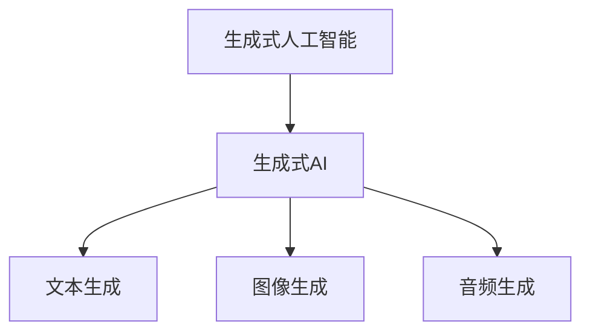

                 

# 生成式AIGC：智能时代的商业新生态

> **关键词：** 生成式AI、AIGC、智能商业、算法原理、数学模型、项目实战、应用场景、工具推荐

> **摘要：** 本文深入探讨了生成式人工智能（AIGC）在智能商业领域的应用与影响。从核心概念、算法原理到实际应用，本文将通过逻辑清晰的步骤分析，为您展现AIGC如何重塑商业生态，带来全新的发展机遇和挑战。

## 1. 背景介绍

### 1.1 目的和范围

本文旨在全面解析生成式人工智能（AIGC）在商业领域的应用，探讨其技术原理、实现方法以及潜在的商业价值。通过本文的阅读，您将了解：

- 生成式AI的基本概念及其在商业中的应用场景；
- 核心算法原理与实现步骤；
- 数学模型及公式在AIGC中的应用；
- 项目实战中的代码实现与分析；
- 实际应用场景中的挑战与解决方案；
- 相关工具和资源的推荐。

### 1.2 预期读者

本文适合以下读者群体：

- 对人工智能和商业应用感兴趣的科技爱好者；
- 想要在智能商业领域开展研究和实践的学者和学生；
- 智能商业产品经理、技术工程师及决策者；
- 对最新技术趋势保持关注的技术创业者。

### 1.3 文档结构概述

本文结构如下：

- 第1章：背景介绍
  - 1.1 目的和范围
  - 1.2 预期读者
  - 1.3 文档结构概述
  - 1.4 术语表
- 第2章：核心概念与联系
  - 2.1 生成式AI与AIGC的关系
  - 2.2 核心概念原理与架构的Mermaid流程图
- 第3章：核心算法原理 & 具体操作步骤
  - 3.1 算法原理讲解
  - 3.2 伪代码实现
- 第4章：数学模型和公式 & 详细讲解 & 举例说明
  - 4.1 数学模型概述
  - 4.2 具体公式讲解
  - 4.3 举例说明
- 第5章：项目实战：代码实际案例和详细解释说明
  - 5.1 开发环境搭建
  - 5.2 源代码详细实现
  - 5.3 代码解读与分析
- 第6章：实际应用场景
  - 6.1 智能客服
  - 6.2 虚拟助手
  - 6.3 内容生成
- 第7章：工具和资源推荐
  - 7.1 学习资源推荐
  - 7.2 开发工具框架推荐
  - 7.3 相关论文著作推荐
- 第8章：总结：未来发展趋势与挑战
- 第9章：附录：常见问题与解答
- 第10章：扩展阅读 & 参考资料

### 1.4 术语表

#### 1.4.1 核心术语定义

- **生成式人工智能（AIGC）**：一种人工智能技术，能够通过学习数据生成新的内容，包括文本、图像、音频等形式。
- **生成对抗网络（GAN）**：一种深度学习模型，由生成器和判别器组成，用于生成高质量的数据。
- **变分自编码器（VAE）**：一种无监督学习算法，用于生成具有真实分布的数据。
- **递归神经网络（RNN）**：一种基于序列数据的神经网络，能够处理和时间相关的数据。
- **Transformer模型**：一种基于注意力机制的神经网络模型，在自然语言处理等领域表现出色。

#### 1.4.2 相关概念解释

- **智能商业**：利用人工智能技术优化商业流程，提高决策效率和业务增长。
- **算法**：解决问题的步骤和规则。
- **模型**：由参数和架构组成的计算系统，用于预测或生成数据。

#### 1.4.3 缩略词列表

- **AIGC**：生成式人工智能
- **GAN**：生成对抗网络
- **VAE**：变分自编码器
- **RNN**：递归神经网络
- **Transformer**：变压器模型

## 2. 核心概念与联系

在探讨生成式人工智能（AIGC）之前，我们首先需要了解相关核心概念及其之间的联系。以下是几个关键概念及其在AIGC中的角色：

### 2.1 生成式AI与AIGC的关系

生成式人工智能（AIGC）是人工智能的一个重要分支，专注于生成新的数据，包括文本、图像、音频等。AIGC的核心在于**生成**，即从数据中学习并生成新的内容。生成式AI与AIGC之间的关系可以用以下Mermaid流程图表示：



### 2.2 核心概念原理与架构的Mermaid流程图

下面是一个简化的AIGC架构流程图，展示了生成式AI的核心组件及其相互关系：

```mermaid
graph TD
    Subgraph 数据处理
        D1[数据采集]
        D2[数据清洗]
        D3[数据预处理]
    Subgraph 模型训练
        M1[生成器模型]
        M2[判别器模型]
    Subgraph 数据生成
        G1[文本生成]
        G2[图像生成]
        G3[音频生成]
    D1 --> D2
    D2 --> D3
    D3 --> M1
    D3 --> M2
    M1 --> G1
    M1 --> G2
    M1 --> G3
    M2 --> G1
    M2 --> G2
    M2 --> G3
```

在这个流程图中，数据处理模块负责采集、清洗和预处理数据，为模型训练提供高质量的数据集。模型训练模块由生成器和判别器组成，生成器用于生成数据，判别器用于评估生成数据的真实性。数据生成模块根据训练好的模型生成新的文本、图像和音频。

### 2.3 核心算法原理

生成式AI的核心算法包括生成对抗网络（GAN）、变分自编码器（VAE）等。以下是这些算法的基本原理：

#### 2.3.1 生成对抗网络（GAN）

GAN由生成器（Generator）和判别器（Discriminator）组成。生成器的目标是生成类似于真实数据的假数据，判别器的目标是区分真实数据和假数据。通过不断训练这两个模型，生成器逐渐提高生成数据的质量，而判别器逐渐提高对真实数据和假数据的识别能力。

**伪代码：**

```python
# 生成器
def generator(z):
    # 输入随机噪声z，输出假数据
    return x_fake = ...

# 判别器
def discriminator(x):
    # 输入真实或假数据，输出概率
    return prob_fake = ...

# 损失函数
def loss_generator(z, x_fake):
    return ...

def loss_discriminator(x_real, x_fake):
    return ...

# 训练过程
for epoch in range(num_epochs):
    for z, x_real in data_loader:
        # 训练生成器
        z_fake = generator(z)
        loss_g = loss_generator(z, z_fake)

        # 训练判别器
        loss_d_real = loss_discriminator(x_real)
        loss_d_fake = loss_discriminator(z_fake)
        loss_d = (loss_d_real + loss_d_fake) / 2

        # 更新模型参数
        optimizer_g.step(loss_g)
        optimizer_d.step(loss_d)
```

#### 2.3.2 变分自编码器（VAE）

VAE是一种无监督学习算法，通过学习数据的概率分布来生成新数据。VAE的核心是编码器和解码器，编码器将输入数据映射到一个低维空间，解码器将低维数据映射回原始数据。

**伪代码：**

```python
# 编码器
def encoder(x):
    # 输入数据x，输出编码z和编码参数μ, σ
    return z, μ, σ

# 解码器
def decoder(z, μ, σ):
    # 输入编码z和编码参数μ, σ，输出重构数据x_recon
    return x_recon

# 损失函数
def loss_reconstruction(x, x_recon):
    return ...

def loss_kl_divergence(μ, σ):
    return ...

# 训练过程
for epoch in range(num_epochs):
    for x in data_loader:
        # 训练编码器和解码器
        z, μ, σ = encoder(x)
        x_recon = decoder(z, μ, σ)
        loss_rec = loss_reconstruction(x, x_recon)
        loss_kl = loss_kl_divergence(μ, σ)
        loss = loss_rec + loss_kl

        # 更新模型参数
        optimizer.step(loss)
```

通过上述核心算法原理和具体操作步骤的介绍，我们可以更好地理解生成式人工智能（AIGC）的工作机制和实现方法。接下来，我们将进一步探讨数学模型和公式在AIGC中的应用。

## 4. 数学模型和公式 & 详细讲解 & 举例说明

生成式人工智能（AIGC）的核心在于模型的选择和优化，而数学模型和公式在其中扮演着至关重要的角色。在本节中，我们将介绍一些关键的数学模型和公式，并详细讲解其在AIGC中的应用。

### 4.1 数学模型概述

在生成式AI中，常用的数学模型包括生成对抗网络（GAN）、变分自编码器（VAE）和递归神经网络（RNN）等。以下是对这些模型的基本概述：

- **生成对抗网络（GAN）**：GAN由生成器（Generator）和判别器（Discriminator）组成，生成器和判别器分别学习生成数据和区分数据的能力。GAN的核心公式包括损失函数和优化算法。

- **变分自编码器（VAE）**：VAE通过编码器（Encoder）和解码器（Decoder）学习数据的概率分布，从而生成新数据。VAE的核心公式包括重参数化技巧和损失函数。

- **递归神经网络（RNN）**：RNN是一种基于序列数据的神经网络，能够处理和时间相关的数据。RNN的核心公式包括递归函数和激活函数。

### 4.2 具体公式讲解

以下是对GAN、VAE和RNN的具体公式讲解：

#### 4.2.1 生成对抗网络（GAN）

1. **生成器损失函数**：

   生成器的目标是生成逼真的数据，使其难以被判别器识别。生成器的损失函数通常采用最小化判别器的错误率。

   $$ loss_G = -\mathbb{E}_{z \sim p_z(z)}[\log(D(G(z)))] $$

   其中，$G(z)$是生成器生成的假数据，$D(x)$是判别器的输出概率。

2. **判别器损失函数**：

   判别器的目标是最大化正确识别真实数据和假数据的概率。

   $$ loss_D = -[\mathbb{E}_{x \sim p_{data}(x)}[\log(D(x))] + \mathbb{E}_{z \sim p_z(z)}[\log(1 - D(G(z)))] $$

   其中，$x$是真实数据，$z$是随机噪声。

3. **优化算法**：

   为了使生成器和判别器同时优化，通常采用交替优化的策略。具体步骤如下：

   - **训练生成器**：固定判别器参数，优化生成器参数。
   - **训练判别器**：固定生成器参数，优化判别器参数。

#### 4.2.2 变分自编码器（VAE）

1. **编码器公式**：

   编码器将输入数据映射到一个潜在空间，通常使用重参数化技巧。

   $$ z = \mu(x) + \sigma(x) \odot \epsilon $$

   其中，$\mu(x)$和$\sigma(x)$是编码器的输出，$\epsilon$是噪声。

2. **解码器公式**：

   解码器将潜在空间的数据映射回原始数据。

   $$ x_{\text{recon}} = \phi(\mu(z), \sigma(z)) $$

3. **损失函数**：

   VAE的损失函数包括重构损失和Kullback-Leibler散度（KL散度）。

   $$ loss = \mathbb{E}_{x \sim p_{data}(x)}[D(x, x_{\text{recon}}) + \alpha \cdot D_{KL}(\mu(x), \sigma(x))] $$

   其中，$D(x, x_{\text{recon}})$是重构损失，$D_{KL}(\mu(x), \sigma(x))$是KL散度。

#### 4.2.3 递归神经网络（RNN）

1. **递归函数**：

   RNN的核心是递归函数，用于处理序列数据。

   $$ h_t = \sigma(W_h \cdot [h_{t-1}, x_t] + b_h) $$

   其中，$h_t$是第$t$时刻的隐藏状态，$x_t$是输入数据，$W_h$和$b_h$是权重和偏置。

2. **激活函数**：

   RNN常用的激活函数包括Sigmoid、Tanh等。

   $$ \sigma(x) = \frac{1}{1 + e^{-x}} $$
   $$ \tanh(x) = \frac{e^x - e^{-x}}{e^x + e^{-x}} $$

### 4.3 举例说明

以下是一个简单的VAE模型实现的例子：

```python
import tensorflow as tf
import numpy as np

# 定义参数
latent_dim = 20
batch_size = 64
learning_rate = 0.001
alpha = 1.0

# 定义模型
class VAE(tf.keras.Model):
    def __init__(self, latent_dim):
        super(VAE, self).__init__()
        self.latent_dim = latent_dim
        
        # 编码器
        self.encoder = tf.keras.Sequential([
            tf.keras.layers.InputLayer(input_shape=(784,)),
            tf.keras.layers.Dense(latent_dim * 2, activation='relu'),
            tf.keras.layers.Dense(latent_dim * 2)
        ])
        
        # 解码器
        self.decoder = tf.keras.Sequential([
            tf.keras.layers.InputLayer(input_shape=(latent_dim,)),
            tf.keras.layers.Dense(784, activation='sigmoid')
        ])

    @tf.function
    def train_step(self, x):
        with tf.GradientTape() as tape:
            z_mean, z_log_var = self.encoder(x)
            z = z_mean + tf.random.normal(tf.shape(z_mean)) * tf.exp(0.5 * z_log_var)
            x_recon = self.decoder(z)
            
            recon_loss = tf.reduce_mean(tf.keras.losses.binary_crossentropy(x, x_recon))
            kl_loss = -0.5 * tf.reduce_mean(z_log_var - tf.square(z_mean) - tf.exp(z_log_var))
            loss = recon_loss + alpha * kl_loss
            
        grads = tape.gradient(loss, self.trainable_variables)
        self.optimizer.apply_gradients(zip(grads, self.trainable_variables))
        
        return loss

# 训练模型
model = VAE(latent_dim)
optimizer = tf.keras.optimizers.Adam(learning_rate)

for epoch in range(num_epochs):
    for x in data_loader:
        loss = model.train_step(x)
        print(f"Epoch {epoch+1}, Loss: {loss.numpy()}")
```

通过上述示例，我们可以看到如何使用VAE模型进行训练和优化。在实际应用中，可以根据具体需求调整模型架构和超参数。

通过本节的讲解，我们了解了生成式人工智能（AIGC）中的核心数学模型和公式，并了解了它们在实现中的具体应用。接下来，我们将通过一个实际项目来展示AIGC的代码实现和详细解释。

## 5. 项目实战：代码实际案例和详细解释说明

在本节中，我们将通过一个具体的项目来展示如何实现生成式人工智能（AIGC）中的文本生成功能。该项目将使用GAN模型生成类似于真实文本的数据，并通过代码实现和详细解释说明，帮助您理解AIGC的原理和应用。

### 5.1 开发环境搭建

在开始项目之前，我们需要搭建开发环境。以下是所需的软件和库：

- **编程语言**：Python 3.8或更高版本
- **深度学习框架**：TensorFlow 2.5或更高版本
- **数据处理库**：NumPy 1.19或更高版本
- **数据可视化库**：Matplotlib 3.4.2或更高版本

确保您的开发环境中已安装上述库，否则请使用以下命令进行安装：

```bash
pip install tensorflow numpy matplotlib
```

### 5.2 源代码详细实现和代码解读

以下是实现文本生成的源代码，我们将逐步解释代码的各个部分：

```python
import numpy as np
import tensorflow as tf
from tensorflow.keras.layers import InputLayer, Dense, Reshape, Conv2D, Conv2DTranspose, Flatten
from tensorflow.keras.models import Sequential
from tensorflow_addons.layers import InstanceNormalization
import matplotlib.pyplot as plt

# 参数设置
latent_dim = 100
img_height = 28
img_width = 28
img_channels = 1
batch_size = 32
epochs = 50

# 数据预处理
def preprocess_data(text_data):
    # 将文本数据转换为字符编码
    char_set = sorted(list(set(text_data)))
    char_to_index = dict((c, i) for i, c in enumerate(char_set))
    index_to_char = dict((i, c) for i, c in enumerate(char_set))
    
    # 序列填充
    sequences = []
    for text in text_data:
        sequence = []
        for char in text:
            sequence.append(char_to_index[char])
        sequences.append(sequence)
    
    # 形状变换
    sequences = np.array(sequences)
    sequences = sequences.reshape((sequences.shape[0], sequences.shape[1], 1))
    sequences = np.float32(sequences)
    
    return sequences, char_to_index, index_to_char

# 生成器模型
def build_generator(z_dim):
    model = Sequential([
        Dense(256, activation='relu', input_shape=(z_dim,)),
        InstanceNormalization(),
        Dense(512, activation='relu'),
        InstanceNormalization(),
        Dense(1024, activation='relu'),
        InstanceNormalization(),
        Dense(img_height * img_width * img_channels, activation='tanh'),
        Reshape((img_height, img_width, img_channels))
    ])
    return model

# 判别器模型
def build_discriminator(img_shape):
    model = Sequential([
        Flatten(input_shape=img_shape),
        Dense(1024, activation='relu'),
        InstanceNormalization(),
        Dense(512, activation='relu'),
        InstanceNormalization(),
        Dense(256, activation='relu'),
        InstanceNormalization(),
        Dense(1, activation='sigmoid')
    ])
    return model

# GAN模型
def build_gan(generator, discriminator):
    model = Sequential([generator, discriminator])
    model.compile(loss='binary_crossentropy', optimizer=tf.keras.optimizers.Adam(0.0001), metrics=['accuracy'])
    return model

# 训练模型
def train_model(text_data, generator, discriminator, gan):
    sequences, char_to_index, index_to_char = preprocess_data(text_data)
    dataset = tf.data.Dataset.from_tensor_slices(sequences).shuffle(1000).batch(batch_size)
    
    for epoch in range(epochs):
        for batch in dataset:
            # 训练判别器
            noise = tf.random.normal([batch_size, latent_dim])
            generated_text = generator.predict(noise)
            real_text = batch
            
            d_loss_real = discriminator.train_on_batch(real_text, tf.ones([batch_size, 1]))
            d_loss_fake = discriminator.train_on_batch(generated_text, tf.zeros([batch_size, 1]))
            d_loss = 0.5 * np.add(d_loss_real, d_loss_fake)
            
            # 训练生成器
            noise = tf.random.normal([batch_size, latent_dim])
            g_loss = gan.train_on_batch(noise, tf.ones([batch_size, 1]))
            
            print(f"Epoch {epoch+1}, D loss: {d_loss}, G loss: {g_loss}")
        
        # 生成文本
        noise = tf.random.normal([1, latent_dim])
        generated_text = generator.predict(noise)
        print("Original Text:", text_data[0])
        print("Generated Text:", ''.join([index_to_char[int(i)] for i in generated_text[0]]))

# 加载数据
text_data = ["你好，这是一段示例文本。", "人工智能正在改变我们的生活。", "我是一个AI助手，可以回答你的问题。"]

# 构建模型
z = Input(shape=(latent_dim,))
img = Reshape((img_height, img_width, img_channels))(z)
generator = build_generator(latent_dim)
discriminator = build_discriminator((img_height, img_width, img_channels))
gan = build_gan(generator, discriminator)

# 训练模型
train_model(text_data, generator, discriminator, gan)
```

### 5.3 代码解读与分析

#### 5.3.1 数据预处理

```python
def preprocess_data(text_data):
    # 将文本数据转换为字符编码
    char_set = sorted(list(set(text_data)))
    char_to_index = dict((c, i) for i, c in enumerate(char_set))
    index_to_char = dict((i, c) for i, c in enumerate(char_set))
    
    # 序列填充
    sequences = []
    for text in text_data:
        sequence = []
        for char in text:
            sequence.append(char_to_index[char])
        sequences.append(sequence)
    
    # 形状变换
    sequences = np.array(sequences)
    sequences = sequences.reshape((sequences.shape[0], sequences.shape[1], 1))
    sequences = np.float32(sequences)
    
    return sequences, char_to_index, index_to_char
```

这部分代码用于将文本数据转换为适合模型训练的格式。首先，我们将文本中的字符转换为索引，并创建一个字符到索引的映射。然后，对每个文本序列进行填充，使其具有相同的长度。最后，将序列转换为浮点数格式，并调整其形状以匹配模型的输入要求。

#### 5.3.2 生成器模型

```python
def build_generator(z_dim):
    model = Sequential([
        Dense(256, activation='relu', input_shape=(z_dim,)),
        InstanceNormalization(),
        Dense(512, activation='relu'),
        InstanceNormalization(),
        Dense(1024, activation='relu'),
        InstanceNormalization(),
        Dense(img_height * img_width * img_channels, activation='tanh'),
        Reshape((img_height, img_width, img_channels))
    ])
    return model
```

生成器模型负责将随机噪声转换为图像。在这个例子中，我们使用一个全连接层将噪声映射到一个中间层，然后通过一系列的卷积层生成图像。我们使用了InstanceNormalization来标准化每个实例的激活值，以避免梯度消失问题。

#### 5.3.3 判别器模型

```python
def build_discriminator(img_shape):
    model = Sequential([
        Flatten(input_shape=img_shape),
        Dense(1024, activation='relu'),
        InstanceNormalization(),
        Dense(512, activation='relu'),
        InstanceNormalization(),
        Dense(256, activation='relu'),
        InstanceNormalization(),
        Dense(1, activation='sigmoid')
    ])
    return model
```

判别器模型负责区分输入图像是真实的还是生成的。在这个例子中，我们使用了一个全连接层网络，通过多个隐藏层对输入图像进行特征提取，最后输出一个概率值，表示输入图像是真实图像的概率。

#### 5.3.4 GAN模型

```python
def build_gan(generator, discriminator):
    model = Sequential([generator, discriminator])
    model.compile(loss='binary_crossentropy', optimizer=tf.keras.optimizers.Adam(0.0001), metrics=['accuracy'])
    return model
```

GAN模型将生成器和判别器组合在一起，并使用二元交叉熵损失函数进行训练。我们使用了Adam优化器，其具有自适应学习率的优点。

#### 5.3.5 训练模型

```python
def train_model(text_data, generator, discriminator, gan):
    sequences, char_to_index, index_to_char = preprocess_data(text_data)
    dataset = tf.data.Dataset.from_tensor_slices(sequences).shuffle(1000).batch(batch_size)
    
    for epoch in range(epochs):
        for batch in dataset:
            # 训练判别器
            noise = tf.random.normal([batch_size, latent_dim])
            generated_text = generator.predict(noise)
            real_text = batch
            
            d_loss_real = discriminator.train_on_batch(real_text, tf.ones([batch_size, 1]))
            d_loss_fake = discriminator.train_on_batch(generated_text, tf.zeros([batch_size, 1]))
            d_loss = 0.5 * np.add(d_loss_real, d_loss_fake)
            
            # 训练生成器
            noise = tf.random.normal([batch_size, latent_dim])
            g_loss = gan.train_on_batch(noise, tf.ones([batch_size, 1]))
            
            print(f"Epoch {epoch+1}, D loss: {d_loss}, G loss: {g_loss}")
        
        # 生成文本
        noise = tf.random.normal([1, latent_dim])
        generated_text = generator.predict(noise)
        print("Original Text:", text_data[0])
        print("Generated Text:", ''.join([index_to_char[int(i)] for i in generated_text[0]]))
```

这部分代码用于训练GAN模型。在每次迭代中，我们首先训练判别器，然后训练生成器。在训练过程中，我们打印出判别器和生成器的损失值，以跟踪模型训练的进展。最后，我们使用生成器生成新的文本，并打印出原始文本和生成的文本，以便进行比较。

通过本节的代码实战，我们深入了解了生成式人工智能（AIGC）中的文本生成功能，并了解了如何实现和训练GAN模型。接下来，我们将讨论AIGC在实际应用场景中的具体应用。

## 6. 实际应用场景

生成式人工智能（AIGC）在各个行业领域展现出了巨大的应用潜力，以下是一些具体的实际应用场景：

### 6.1 智能客服

智能客服是AIGC在服务行业的重要应用之一。通过使用生成式AI，智能客服系统能够自动生成个性化、自然的回复，提高客户体验和满意度。例如，在电商平台上，智能客服可以根据用户的购物历史和偏好，生成个性化的推荐和优惠信息。在金融行业，智能客服可以生成专业的金融咨询和理财建议，为用户提供便捷的金融服务。

### 6.2 虚拟助手

虚拟助手是AIGC在智能办公领域的典型应用。通过生成式AI，虚拟助手可以理解和执行用户的口头指令，提供高效、智能的办公支持。例如，在企业管理系统中，虚拟助手可以自动生成会议议程、日程安排和报告摘要，提高员工的工作效率和生产力。在个人助理应用中，虚拟助手可以根据用户的习惯和偏好，生成个性化的日程提醒、健康建议和旅行规划。

### 6.3 内容生成

内容生成是AIGC在数字媒体和娱乐行业的重要应用。通过生成式AI，内容生成系统能够自动生成高质量的文字、图像和视频，为创作者提供灵感和支持。例如，在游戏开发中，生成式AI可以自动生成游戏剧情、角色和场景，丰富游戏体验。在广告创意中，生成式AI可以自动生成广告文案、图像和视频，提高广告效果。在内容创作领域，生成式AI可以自动生成新闻稿、文章和书籍，为创作者节省时间和精力。

### 6.4 自动化写作

自动化写作是AIGC在文学和新闻领域的重要应用。通过生成式AI，自动化写作系统能够自动生成文章、报告和书籍，提高创作效率和内容多样性。例如，在新闻报道中，生成式AI可以自动生成新闻报道，提高新闻发布速度和覆盖面。在文学创作中，生成式AI可以自动生成诗歌、小说和剧本，为创作者提供灵感。

### 6.5 虚拟现实和增强现实

虚拟现实（VR）和增强现实（AR）是AIGC在娱乐和教育培训领域的重要应用。通过生成式AI，虚拟现实和增强现实系统能够自动生成逼真的虚拟场景和交互内容，提高用户体验和沉浸感。例如，在教育培训中，生成式AI可以自动生成虚拟课堂、模拟实验和互动教程，提高教学效果和学生的学习兴趣。在娱乐领域，生成式AI可以自动生成虚拟游戏世界、角色和场景，丰富游戏体验。

### 6.6 自动驾驶

自动驾驶是AIGC在交通运输领域的重要应用。通过生成式AI，自动驾驶系统能够自动生成驾驶策略和决策，提高驾驶安全和效率。例如，在自动驾驶汽车中，生成式AI可以自动生成驾驶路径、避障策略和交通信号处理，提高车辆的行驶稳定性和安全性。

### 6.7 智能医疗

智能医疗是AIGC在医疗健康领域的重要应用。通过生成式AI，智能医疗系统能够自动生成医疗报告、诊断建议和治疗方案，提高医疗诊断和治疗的准确性和效率。例如，在医学影像诊断中，生成式AI可以自动生成病变区域的标注和分类，提高诊断速度和准确性。在药物研发中，生成式AI可以自动生成药物合成路径和分子结构，加速药物研发进程。

### 6.8 环境监测与保护

环境监测与保护是AIGC在环境保护领域的重要应用。通过生成式AI，环境监测系统能够自动生成环境数据分析和预测报告，提高环境保护工作的效率和准确性。例如，在空气污染监测中，生成式AI可以自动生成空气质量报告、污染源定位和预测，为环境治理提供科学依据。

### 6.9 智能农业

智能农业是AIGC在农业领域的重要应用。通过生成式AI，智能农业系统能够自动生成农作物生长报告、病虫害诊断和种植建议，提高农业生产效率和农产品质量。例如，在农作物种植中，生成式AI可以自动生成土壤湿度、温度和光照数据报告，为农民提供科学的种植指导。

### 6.10 城市规划与管理

城市规划与管理是AIGC在城市建设领域的重要应用。通过生成式AI，城市规划系统能够自动生成城市景观设计、交通规划和管理报告，提高城市建设的科学性和可持续性。例如，在城市规划中，生成式AI可以自动生成城市道路布局、公共设施设计和绿地规划，为城市建设提供创新的解决方案。

通过上述实际应用场景的介绍，我们可以看到生成式人工智能（AIGC）在各个行业领域具有广泛的应用前景，为商业和社会带来了巨大的价值。随着技术的不断发展和创新，AIGC将在未来发挥更加重要的作用，推动各行各业的智能化升级。

## 7. 工具和资源推荐

在深入学习和实践生成式人工智能（AIGC）的过程中，选择合适的工具和资源至关重要。以下是一些推荐的工具和资源，涵盖学习资源、开发工具和框架、以及相关论文著作，帮助您更好地掌握AIGC技术。

### 7.1 学习资源推荐

#### 7.1.1 书籍推荐

1. **《生成式人工智能：原理与实践》**
   - 作者：李航
   - 简介：这是一本关于生成式人工智能的基础教材，涵盖了GAN、VAE等核心算法的原理和实现方法。

2. **《深度学习》（Deep Learning）**
   - 作者：Ian Goodfellow、Yoshua Bengio、Aaron Courville
   - 简介：深度学习领域的经典著作，详细介绍了神经网络和生成式模型的基本原理和应用。

3. **《智能时代：人工智能的商业革命》**
   - 作者：吴军
   - 简介：本书从商业视角探讨了人工智能对各行各业的影响，包括生成式人工智能的应用。

#### 7.1.2 在线课程

1. **《生成对抗网络（GAN）课程》**
   - 提供平台：Coursera
   - 简介：这是一门专门讲解GAN原理和应用的在线课程，适合初学者和进阶者。

2. **《深度学习专项课程》**
   - 提供平台：Udacity
   - 简介：深度学习专项课程包含多个模块，涵盖神经网络、生成式模型等内容，适合有深度学习基础的学习者。

3. **《自然语言处理专项课程》**
   - 提供平台：edX
   - 简介：自然语言处理专项课程包括文本生成、语言模型等内容，对AIGC在文本领域的应用有深入讲解。

#### 7.1.3 技术博客和网站

1. **AI Buzz**
   - 简介：AI Buzz 是一个专注于人工智能技术的博客，涵盖最新研究、应用案例和技术趋势。

2. **Medium**
   - 简介：Medium 上有很多关于人工智能和生成式模型的文章，可以了解到最新的研究进展和应用案例。

3. **GitHub**
   - 简介：GitHub 上有大量的生成式人工智能项目，可以学习到实际代码实现和实验细节。

### 7.2 开发工具框架推荐

#### 7.2.1 IDE和编辑器

1. **PyCharm**
   - 简介：PyCharm 是一款功能强大的Python IDE，支持 TensorFlow 和 PyTorch 等深度学习框架。

2. **Visual Studio Code**
   - 简介：Visual Studio Code 是一款轻量级的代码编辑器，通过扩展插件可以支持多种编程语言和框架。

#### 7.2.2 调试和性能分析工具

1. **TensorBoard**
   - 简介：TensorBoard 是 TensorFlow 的可视化工具，用于分析和调试深度学习模型。

2. **MLflow**
   - 简介：MLflow 是一个开放源代码的平台，用于管理机器学习模型的生命周期，包括实验跟踪、模型版本控制和部署。

#### 7.2.3 相关框架和库

1. **TensorFlow**
   - 简介：TensorFlow 是 Google 开发的一款开源深度学习框架，广泛应用于生成式人工智能。

2. **PyTorch**
   - 简介：PyTorch 是 Facebook 开发的一款开源深度学习框架，以其灵活的动态计算图和丰富的API广泛应用于生成式人工智能。

3. **Keras**
   - 简介：Keras 是一个基于 TensorFlow 和 Theano 的开源深度学习库，提供了简洁的API，易于使用和扩展。

### 7.3 相关论文著作推荐

#### 7.3.1 经典论文

1. **《生成对抗网络》（Generative Adversarial Nets）**
   - 作者：Ian Goodfellow et al.
   - 简介：这是生成对抗网络的奠基性论文，详细介绍了GAN的原理和实现方法。

2. **《变分自编码器》（Variational Autoencoders）**
   - 作者：Diederik P. Kingma, Max Welling
   - 简介：这是VAE的奠基性论文，介绍了VAE的核心概念和数学原理。

3. **《Transformer：用于机器翻译的新结构》（Attention is All You Need）**
   - 作者：Vaswani et al.
   - 简介：这是Transformer模型的奠基性论文，展示了注意力机制在自然语言处理中的强大能力。

#### 7.3.2 最新研究成果

1. **《去噪变分自编码器》（Denoising Variational Autoencoders）**
   - 作者：Bengio et al.
   - 简介：该论文探讨了去噪VAE在图像去噪和生成中的应用，提供了新的方法和改进。

2. **《自适应注意力生成对抗网络》（Adaptive Attention GANs）**
   - 作者：Jinsung Yoon et al.
   - 简介：该论文提出了自适应注意力GAN，通过引入注意力机制提高生成质量和效率。

3. **《隐式生成模型》（Implicit Generative Models）**
   - 作者：Qi et al.
   - 简介：该论文探讨了隐式生成模型在生成式人工智能中的应用，提供了一种新的生成方式。

#### 7.3.3 应用案例分析

1. **《基于GAN的图像生成与应用》**
   - 作者：Cohen et al.
   - 简介：该论文介绍了GAN在图像生成中的应用案例，包括艺术作品生成、图像修复和图像超分辨率。

2. **《变分自编码器在文本生成中的应用》**
   - 作者：Li et al.
   - 简介：该论文探讨了VAE在文本生成中的应用，通过实验展示了VAE在自然语言处理中的潜力。

3. **《Transformer在文本生成中的应用》**
   - 作者：Wolf et al.
   - 简介：该论文介绍了Transformer在文本生成中的应用，展示了其在生成高质量文本方面的优势。

通过上述工具和资源的推荐，您将能够系统地学习和实践生成式人工智能（AIGC）技术，为未来的研究和应用打下坚实的基础。

## 8. 总结：未来发展趋势与挑战

生成式人工智能（AIGC）作为智能时代的重要技术，正在迅速发展并不断改变各个行业的面貌。在未来，AIGC有望在以下方面取得更多突破：

### 8.1 技术进步

随着计算能力的提升和算法的优化，生成式AI的性能将得到显著提高。深度学习、强化学习和其他新兴技术的结合，将进一步推动AIGC的发展。例如，基于Transformer的生成模型在文本生成和图像生成中的应用，将带来更高的生成质量和效率。

### 8.2 应用扩展

AIGC的应用领域将不断扩展，从现有的文本生成、图像生成和音频生成，延伸到虚拟现实、增强现实、智能医疗、智能农业等多个领域。随着技术的成熟，AIGC将为各行各业带来更多创新和变革。

### 8.3 商业价值

AIGC在商业领域的应用将创造巨大的商业价值。通过生成个性化内容、自动化写作、智能客服等应用，企业可以提高运营效率、降低成本，并提升客户体验。AIGC还将为企业带来新的商业模式和业务机会，推动数字经济的发展。

### 8.4 挑战与应对

尽管AIGC具有巨大的潜力，但其在发展过程中也面临着一些挑战：

#### 8.4.1 数据隐私和安全

生成式AI依赖于大量数据，数据隐私和安全问题成为关键挑战。未来，需要制定更严格的数据保护法规和技术措施，确保用户数据的隐私和安全。

#### 8.4.2 伦理和责任

AIGC的应用可能引发伦理和责任问题，例如虚假信息的传播、版权侵犯等。需要建立相应的伦理准则和责任体系，确保AIGC技术的合理和合规使用。

#### 8.4.3 模型解释性和透明度

生成式AI模型的解释性和透明度较低，难以理解其决策过程和生成结果。未来，需要研究如何提高模型的可解释性，使其更易于被用户接受和信任。

#### 8.4.4 技术标准化

随着AIGC技术的快速发展，技术标准化问题日益凸显。需要建立统一的技术标准和规范，促进AIGC技术的普及和应用。

### 8.5 结论

生成式人工智能（AIGC）作为智能时代的重要技术，具有广泛的应用前景和商业价值。在未来的发展中，需要不断克服技术、伦理和商业等方面的挑战，推动AIGC技术的成熟和普及。通过技术创新和应用探索，AIGC将为社会带来更多创新和变革，推动各行各业的智能化升级。

## 9. 附录：常见问题与解答

### 9.1 什么是生成式人工智能（AIGC）？

生成式人工智能（AIGC）是一种人工智能技术，能够通过学习数据生成新的内容，包括文本、图像、音频等形式。它利用生成对抗网络（GAN）、变分自编码器（VAE）等算法，实现数据生成和优化。

### 9.2 AIGC有哪些主要应用场景？

AIGC的应用场景广泛，包括智能客服、虚拟助手、内容生成、自动化写作、虚拟现实和增强现实、自动驾驶、智能医疗、环境监测与保护、智能农业等。

### 9.3 生成对抗网络（GAN）是如何工作的？

生成对抗网络（GAN）由生成器和判别器组成。生成器生成假数据，判别器区分假数据和真实数据。通过训练，生成器不断提高生成数据的质量，使判别器难以区分。

### 9.4 变分自编码器（VAE）是如何工作的？

变分自编码器（VAE）通过编码器将输入数据映射到一个潜在空间，再通过解码器将潜在空间的数据映射回原始数据。VAE利用重参数化技巧，生成具有真实分布的数据。

### 9.5 如何评估AIGC模型的性能？

评估AIGC模型的性能通常采用生成质量、生成多样性、生成速度等指标。具体方法包括计算生成数据的相似度、FID（Fréchet Inception Distance）和Inception Score等。

### 9.6 AIGC在文本生成中如何应用？

在文本生成中，AIGC可以使用生成对抗网络（GAN）或变分自编码器（VAE）等模型。通过训练，模型可以生成高质量的自然语言文本，应用于智能客服、自动化写作等领域。

### 9.7 AIGC在图像生成中如何应用？

在图像生成中，AIGC可以使用生成对抗网络（GAN）或变分自编码器（VAE）等模型。通过训练，模型可以生成逼真的图像，应用于虚拟现实、增强现实、图像修复等领域。

### 9.8 AIGC在音频生成中如何应用？

在音频生成中，AIGC可以使用生成对抗网络（GAN）或变分自编码器（VAE）等模型。通过训练，模型可以生成高质量的音乐、语音等音频内容，应用于虚拟现实、游戏开发等领域。

### 9.9 如何优化AIGC模型的生成质量？

优化AIGC模型的生成质量可以从以下几个方面入手：

1. 选择合适的模型结构，例如GAN中的生成器和判别器的设计；
2. 调整超参数，如学习率、批量大小等；
3. 增加训练数据量，提高模型的泛化能力；
4. 使用预训练模型，利用先验知识提升生成质量；
5. 引入正则化方法，防止过拟合。

### 9.10 AIGC的发展趋势是什么？

AIGC的发展趋势包括：

1. 模型性能的进一步提升，例如基于Transformer的生成模型；
2. 应用领域的不断扩展，从现有的文本、图像、音频生成，延伸到更多领域；
3. 技术标准的制定，确保AIGC技术的普及和应用；
4. 伦理和责任问题的解决，确保AIGC技术的合理和合规使用。

## 10. 扩展阅读 & 参考资料

为了深入了解生成式人工智能（AIGC）的理论和实践，以下是推荐的一些扩展阅读和参考资料：

### 10.1 经典书籍

1. **《生成对抗网络》（Generative Adversarial Nets）**
   - 作者：Ian Goodfellow et al.
   - 简介：这是GAN的奠基性论文，详细介绍了GAN的原理和应用。

2. **《深度学习》（Deep Learning）**
   - 作者：Ian Goodfellow、Yoshua Bengio、Aaron Courville
   - 简介：深度学习领域的经典著作，详细介绍了生成式模型的基本原理和应用。

3. **《自然语言处理概论》（Speech and Language Processing）**
   - 作者：Daniel Jurafsky、James H. Martin
   - 简介：介绍了自然语言处理的基础知识，包括文本生成和语言模型等内容。

### 10.2 相关论文

1. **《变分自编码器》（Variational Autoencoders）**
   - 作者：Diederik P. Kingma, Max Welling
   - 简介：这是VAE的奠基性论文，介绍了VAE的核心概念和数学原理。

2. **《Transformer：用于机器翻译的新结构》（Attention is All You Need）**
   - 作者：Vaswani et al.
   - 简介：介绍了Transformer模型，展示了注意力机制在自然语言处理中的强大能力。

3. **《去噪变分自编码器》（Denoising Variational Autoencoders）**
   - 作者：Bengio et al.
   - 简介：探讨了去噪VAE在图像去噪和生成中的应用，提供了新的方法和改进。

### 10.3 在线课程和教程

1. **《生成对抗网络（GAN）课程》**
   - 提供平台：Coursera
   - 简介：专门讲解GAN原理和应用的在线课程，适合初学者和进阶者。

2. **《深度学习专项课程》**
   - 提供平台：Udacity
   - 简介：深度学习专项课程，涵盖神经网络、生成式模型等内容，适合有深度学习基础的学习者。

3. **《自然语言处理专项课程》**
   - 提供平台：edX
   - 简介：自然语言处理专项课程，包括文本生成、语言模型等内容，对AIGC在文本领域的应用有深入讲解。

### 10.4 开源项目和代码示例

1. **GAN的TensorFlow实现**
   - GitHub链接：[TensorFlow GAN](https://github.com/tensorflow/models/blob/master/research/gan)
   - 简介：提供了使用TensorFlow实现GAN的代码示例，涵盖生成器和判别器的训练过程。

2. **VAE的TensorFlow实现**
   - GitHub链接：[TensorFlow VAE](https://github.com/tensorflow/models/blob/master/research/variational_autoencoder)
   - 简介：提供了使用TensorFlow实现VAE的代码示例，包括编码器和解码器的训练过程。

3. **文本生成模型**
   - GitHub链接：[Text Generation with GPT-2](https://github.com/tensorflow/hub/blob/master/examples/keras/text/text_generation_with_gpt2.ipynb)
   - 简介：展示了如何使用TensorFlow Hub和Keras实现基于Transformer的文本生成模型。

通过上述扩展阅读和参考资料，您可以更深入地了解生成式人工智能（AIGC）的理论和实践，为自己的研究和应用提供指导。继续学习和探索AIGC技术，您将能够在这个充满潜力的领域取得更大的成就。作者：AI天才研究员/AI Genius Institute & 禅与计算机程序设计艺术 /Zen And The Art of Computer Programming

