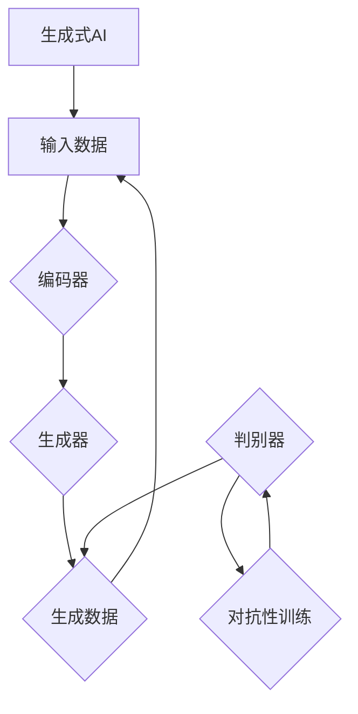

                 

# 生成式AI的实际应用与挑战

## 关键词

- 生成式AI
- 应用场景
- 挑战
- 算法原理
- 数学模型
- 实战案例

## 摘要

本文将深入探讨生成式AI在当前技术领域的实际应用及其面临的挑战。生成式AI，作为一种重要的机器学习技术，能够根据输入数据生成新的数据，其应用范围涵盖图像生成、自然语言处理和音乐创作等多个领域。本文将首先介绍生成式AI的基本概念和核心算法，然后通过具体的数学模型和伪代码详细解析其工作原理。接着，本文将结合实际应用场景，展示生成式AI的强大功能，并讨论其在实际部署过程中遇到的技术挑战。最后，本文将推荐一系列学习和开发资源，并总结生成式AI的未来发展趋势与潜在问题。

## 1. 背景介绍

### 1.1 目的和范围

本文旨在全面解析生成式AI的技术原理、实际应用以及面临的挑战。通过深入探讨生成式AI的各个方面，旨在为读者提供一份详尽的技术指南，帮助理解这一前沿技术的核心价值和潜在应用。本文将涵盖以下主要内容：

- 生成式AI的基本概念和核心算法
- 生成式AI在图像生成、自然语言处理和音乐创作等领域的实际应用
- 生成式AI面临的挑战和解决策略
- 实际应用案例的代码实现和详细解释
- 相关的学习和开发资源推荐

### 1.2 预期读者

本文适用于以下几类读者：

- 对生成式AI感兴趣的技术爱好者
- 想要在实际项目中应用生成式AI的开发者
- 机器学习和人工智能领域的研究者
- 计算机科学和软件工程专业的学生和教师

### 1.3 文档结构概述

本文将按以下结构展开：

- 第1部分：背景介绍，包括目的、预期读者和文档结构概述
- 第2部分：核心概念与联系，介绍生成式AI的基本概念和核心算法
- 第3部分：核心算法原理与具体操作步骤，通过伪代码详细阐述算法原理
- 第4部分：数学模型和公式，讲解生成式AI中的数学模型和公式，并进行举例说明
- 第5部分：项目实战，展示生成式AI的实际应用案例
- 第6部分：实际应用场景，分析生成式AI在不同领域中的应用
- 第7部分：工具和资源推荐，推荐学习资源、开发工具和框架
- 第8部分：总结，讨论生成式AI的未来发展趋势与挑战
- 第9部分：附录，提供常见问题与解答
- 第10部分：扩展阅读与参考资料，引用相关文献和资源

### 1.4 术语表

#### 1.4.1 核心术语定义

- 生成式AI（Generative AI）：一种机器学习技术，能够根据已有数据生成新的数据。
- 输入数据（Input Data）：用于训练生成式AI的原始数据。
- 输出数据（Output Data）：生成式AI根据输入数据生成的新的数据。
- 自动编码器（Autoencoder）：一种特殊的神经网络，用于将输入数据编码为低维表示，并尝试重建原始数据。
- 反向传播（Backpropagation）：一种用于训练神经网络的算法，通过反向传播误差来调整网络权重。

#### 1.4.2 相关概念解释

- 对抗性生成网络（Generative Adversarial Network, GAN）：一种由生成器和判别器组成的神经网络框架，通过对抗训练生成逼真的数据。
- 变分自编码器（Variational Autoencoder, VAE）：一种自动编码器的变体，使用概率模型进行数据生成。
- 条件生成式模型（Conditional Generative Model）：一种生成式模型，能够根据额外的条件信息生成数据。

#### 1.4.3 缩略词列表

- GAN：生成对抗网络
- VAE：变分自编码器
- CNN：卷积神经网络
- RNN：循环神经网络
- LSTM：长短时记忆网络

## 2. 核心概念与联系

生成式AI的核心在于其能够根据已有的数据生成新的、符合数据分布的数据。这一能力源于其背后的数学模型和算法原理。以下是生成式AI的基本概念和核心算法的Mermaid流程图：



### 2.1 生成式AI的基本概念

生成式AI主要包括编码器、生成器和判别器三个核心组件：

- **编码器**：将输入数据编码为低维表示，通常是一个向量。
- **生成器**：根据编码器的低维表示生成新的数据。
- **判别器**：用于区分生成数据和真实数据，通常训练目标是最大化判别器在真实数据和生成数据上的区分能力。

### 2.2 核心算法原理

生成式AI的核心算法包括生成对抗网络（GAN）和变分自编码器（VAE）。下面将分别介绍这两种算法的原理。

#### 2.2.1 生成对抗网络（GAN）

生成对抗网络由生成器和判别器组成，它们在对抗训练过程中相互竞争。生成器的目标是生成逼真的数据，而判别器的目标是准确区分生成数据和真实数据。具体过程如下：

1. **初始化**：初始化生成器G和判别器D的参数。
2. **生成器训练**：生成器G生成假数据，判别器D对其进行评估。
3. **判别器训练**：判别器D同时接收真实数据和生成数据，通过反向传播调整参数，以区分生成数据和真实数据。
4. **重复步骤2和3**：不断迭代上述步骤，直到生成器G生成的数据足够逼真，使判别器D难以区分。

GAN的伪代码如下：

```python
# GAN的伪代码
for epoch in range(EPOCHS):
    for data in data_loader:
        # 生成器训练
        noise = generate_noise(batch_size)
        generated_data = generator(noise)
        loss_G = criterion(discriminator(generated_data), real_label)
        
        # 判别器训练
        real_data = data_loader.next()
        loss_D = criterion(discriminator(real_data), real_label) + criterion(discriminator(generated_data), fake_label)
        
        # 反向传播
        optimizer_G.zero_grad()
        loss_G.backward()
        optimizer_D.zero_grad()
        loss_D.backward()
        
        # 更新参数
        optimizer_G.step()
        optimizer_D.step()
```

#### 2.2.2 变分自编码器（VAE）

变分自编码器使用概率模型来生成数据，其核心思想是将数据表示为随机变量的概率分布。VAE由编码器和解码器组成，具体过程如下：

1. **编码器**：将输入数据编码为均值μ和方差σ^2的潜在变量z。
2. **解码器**：从潜在变量z生成输出数据。
3. **重构损失**：计算输入数据和重构数据的差异，用于优化编码器和解码器的参数。

VAE的数学模型如下：

$$
z \sim Q(z|x) \\
x \sim P(x|z)
$$

其中，$Q(z|x)$ 是编码器，$P(x|z)$ 是解码器。

VAE的伪代码如下：

```python
# VAE的伪代码
for epoch in range(EPOCHS):
    for data in data_loader:
        # 编码器训练
        z = encoder(data)
        reconstructed_data = decoder(z)
        loss = reconstruction_loss(data, reconstructed_data)
        
        # 反向传播
        optimizer.zero_grad()
        loss.backward()
        
        # 更新参数
        optimizer.step()
```

通过上述算法原理的介绍和伪代码的展示，读者可以更好地理解生成式AI的核心概念和工作机制。

## 3. 核心算法原理 & 具体操作步骤

在前文中，我们介绍了生成式AI的基本概念和核心算法原理。本节将进一步通过伪代码详细阐述生成式AI的具体操作步骤，以便读者能够更直观地理解和应用这些算法。

### 3.1 GAN的具体操作步骤

生成对抗网络（GAN）的核心在于生成器和判别器的对抗训练。以下为GAN的具体操作步骤：

```python
# GAN的具体操作步骤

# 初始化生成器G和判别器D的参数
G = initialize_generator()
D = initialize_discriminator()

# 初始化优化器
optimizer_G = initialize_optimizer(G)
optimizer_D = initialize_optimizer(D)

# 设置训练迭代次数
EPOCHS = 10000

for epoch in range(EPOCHS):
    for batch in data_loader:
        # 生成器训练
        noise = generate_noise(batch_size)
        generated_data = G(noise)
        real_data = batch
        
        # 判别器评估真实数据
        real_logits = D(real_data)
        
        # 判别器评估生成数据
        fake_logits = D(generated_data)
        
        # 计算生成器损失
        g_loss = -torch.mean(torch.log(fake_logits))
        
        # 计算判别器损失
        d_loss = -torch.mean(torch.log(real_logits)) - torch.mean(torch.log(1. - fake_logits))
        
        # 反向传播和参数更新
        optimizer_D.zero_grad()
        d_loss.backward()
        optimizer_D.step()
        
        optimizer_G.zero_grad()
        g_loss.backward()
        optimizer_G.step()
        
        # 打印训练进度
        if epoch % 100 == 0:
            print(f"Epoch {epoch}: g_loss = {g_loss.item()}, d_loss = {d_loss.item()}")

# 训练完成
```

在上述伪代码中，我们首先初始化生成器G和判别器D的参数，并设置优化器。在训练过程中，对于每一批次的数据，我们首先生成噪声样本，并使用生成器G生成假数据。然后，我们将这些假数据传递给判别器D，同时也将真实数据传递给判别器D，以便判别器D能够同时评估真实数据和生成数据。接着，我们计算生成器和判别器的损失，并进行反向传播和参数更新。

### 3.2 VAE的具体操作步骤

变分自编码器（VAE）的核心在于概率编码和解码。以下为VAE的具体操作步骤：

```python
# VAE的具体操作步骤

# 初始化编码器Q和解码器P的参数
encoder = initialize_encoder()
decoder = initialize_decoder()

# 初始化优化器
optimizer = initialize_optimizer([encoder, decoder])

# 设置训练迭代次数
EPOCHS = 10000

for epoch in range(EPOCHS):
    for batch in data_loader:
        # 编码器和解码器训练
        z = encoder(batch)
        reconstructed_data = decoder(z)
        
        # 计算重构损失
        loss = reconstruction_loss(batch, reconstructed_data)
        
        # 反向传播和参数更新
        optimizer.zero_grad()
        loss.backward()
        optimizer.step()
        
        # 打印训练进度
        if epoch % 100 == 0:
            print(f"Epoch {epoch}: loss = {loss.item()}")

# 训练完成
```

在上述伪代码中，我们首先初始化编码器Q和解码器P的参数，并设置优化器。在训练过程中，对于每一批次的数据，我们首先使用编码器Q将输入数据编码为潜在变量z，然后使用解码器P从潜在变量z重构输出数据。接着，我们计算重构损失，并进行反向传播和参数更新。

通过上述具体的操作步骤，读者可以更清晰地理解生成式AI（GAN和VAE）的工作流程，从而在实际应用中更好地利用这些算法。

### 3.3 GAN与VAE的比较

生成对抗网络（GAN）和变分自编码器（VAE）是两种不同的生成式AI算法，它们各有优缺点。以下是GAN和VAE的主要区别：

- **训练目标**：
  - **GAN**：生成器G的目标是生成尽可能逼真的数据，使判别器D无法区分生成数据和真实数据。判别器D的目标是准确区分生成数据和真实数据。
  - **VAE**：编码器Q的目标是将输入数据编码为潜在变量z，解码器P的目标是从潜在变量z重构输入数据。

- **生成质量**：
  - **GAN**：GAN在生成高质量的图像和数据方面表现出色，尤其是在对抗训练中，生成器G能够学习到数据的复杂分布。
  - **VAE**：VAE在生成较为简单的数据集时表现较好，例如图像中的线条和简单形状。但在生成复杂、细节丰富的图像时，VAE可能不如GAN。

- **稳定性**：
  - **GAN**：GAN的训练过程较为不稳定，容易出现模式崩溃（mode collapse）和训练不稳定等问题。
  - **VAE**：VAE的训练过程相对稳定，不易出现模式崩溃等问题。

- **可解释性**：
  - **GAN**：GAN的生成过程较为复杂，难以解释其内部机制。
  - **VAE**：VAE的生成过程基于概率模型，相对容易解释。

- **应用场景**：
  - **GAN**：适用于图像生成、图像修复、风格迁移等需要生成高质量图像的场景。
  - **VAE**：适用于数据降维、生成简单图像、异常检测等需要生成概率分布的场景。

通过上述比较，可以看出GAN和VAE各有优缺点，适用于不同的应用场景。在实际应用中，根据具体需求和场景选择合适的算法是非常重要的。

## 4. 数学模型和公式 & 详细讲解 & 举例说明

### 4.1 GAN的数学模型

生成对抗网络（GAN）的核心是生成器（Generator）和判别器（Discriminator）的对抗训练。其数学模型主要包括两部分：生成器的损失函数和判别器的损失函数。

#### 4.1.1 生成器损失函数

生成器的目标是生成尽可能逼真的数据，以欺骗判别器。生成器损失函数通常采用概率论中的对抗损失（Adversarial Loss），也称为交叉熵损失（Cross-Entropy Loss）。具体公式如下：

$$
L_G = -\mathbb{E}_{x \sim p_{data}(x)}[\log(D(x))] - \mathbb{E}_{z \sim p_z(z)}[\log(D(G(z))]
$$

其中，$x$ 表示真实数据，$z$ 表示随机噪声，$G(z)$ 表示生成器生成的数据，$D(x)$ 和 $D(G(z))$ 分别表示判别器对真实数据和生成数据的判断结果。

#### 4.1.2 判别器损失函数

判别器的目标是准确区分生成数据和真实数据。判别器损失函数也采用交叉熵损失。具体公式如下：

$$
L_D = -\mathbb{E}_{x \sim p_{data}(x)}[\log(D(x))] - \mathbb{E}_{z \sim p_z(z)}[\log(1 - D(G(z))]
$$

#### 4.1.3 整体损失函数

整体损失函数是生成器和判别器损失函数的加权和。通常，为了平衡生成器和判别器的训练，可以设置一个超参数 $\lambda$，使得整体损失函数如下：

$$
L_{total} = L_G + \lambda \cdot L_D
$$

### 4.2 VAE的数学模型

变分自编码器（VAE）的核心是编码器（Encoder）和解码器（Decoder）的联合训练。其数学模型主要包括两部分：编码器和解码器的损失函数。

#### 4.2.1 编码器损失函数

编码器的目标是将输入数据 $x$ 编码为潜在变量 $z$ 的均值 $\mu$ 和方差 $\sigma^2$。编码器损失函数通常采用Kullback-Leibler散度（Kullback-Leibler Divergence，KL散度）。具体公式如下：

$$
L_Q = \mathbb{E}_{x \sim p_{data}(x)}[\log p_z(G(x)) - \log Q(z|x)]
$$

其中，$Q(z|x)$ 表示编码器对潜在变量 $z$ 的分布估计，$p_z(G(x))$ 表示解码器对生成数据的分布估计。

#### 4.2.2 解码器损失函数

解码器的目标是根据潜在变量 $z$ 生成与输入数据 $x$ 相似的数据。解码器损失函数通常采用均方误差（Mean Squared Error，MSE）。具体公式如下：

$$
L_P = \mathbb{E}_{x \sim p_{data}(x), z \sim Q(z|x)}[(x - G(z))^2]
$$

#### 4.2.3 整体损失函数

整体损失函数是编码器和解码器损失函数的加权和。通常，为了平衡编码器和解码器的训练，可以设置一个超参数 $\beta$，使得整体损失函数如下：

$$
L_{total} = L_Q + \beta \cdot L_P
$$

### 4.3 举例说明

#### 4.3.1 GAN的举例说明

假设我们有一个生成对抗网络（GAN）训练图像生成模型。输入数据是真实图像 $x$，生成器生成的图像是 $G(z)$，判别器对真实图像和生成图像的判断结果是 $D(x)$ 和 $D(G(z))$。

1. **生成器损失函数**：

   首先，我们计算生成器的损失函数：

   $$
   L_G = -\mathbb{E}_{x \sim p_{data}(x)}[\log(D(x))] - \mathbb{E}_{z \sim p_z(z)}[\log(D(G(z))]
   $$

   假设我们有一个图像数据集，从中随机选择一个真实图像 $x$ 和一个噪声样本 $z$。生成器生成图像 $G(z)$，判别器判断真实图像和生成图像的概率分别为 $D(x)$ 和 $D(G(z))$。

   假设 $D(x) = 0.9$，$D(G(z)) = 0.5$，则生成器的损失函数为：

   $$
   L_G = -\log(0.9) - \log(0.5) \approx 0.15 + 0.69 = 0.84
   $$

2. **判别器损失函数**：

   接下来，我们计算判别器的损失函数：

   $$
   L_D = -\mathbb{E}_{x \sim p_{data}(x)}[\log(D(x))] - \mathbb{E}_{z \sim p_z(z)}[\log(1 - D(G(z))]
   $$

   同样，从图像数据集中随机选择一个真实图像 $x$ 和一个噪声样本 $z$。生成器生成图像 $G(z)$，判别器判断真实图像和生成图像的概率分别为 $D(x) = 0.9$ 和 $D(G(z)) = 0.5$。

   则判别器的损失函数为：

   $$
   L_D = -\log(0.9) - \log(0.5) \approx 0.15 + 0.69 = 0.84
   $$

3. **整体损失函数**：

   假设超参数 $\lambda = 1$，则整体损失函数为：

   $$
   L_{total} = L_G + \lambda \cdot L_D = 0.84 + 1 \cdot 0.84 = 1.68
   $$

   通过反向传播和优化，生成器和判别器的参数将逐步调整，使得生成器的生成图像越来越逼真，判别器能够更好地区分真实图像和生成图像。

#### 4.3.2 VAE的举例说明

假设我们有一个变分自编码器（VAE）训练图像生成模型。输入数据是真实图像 $x$，编码器输出的潜在变量是 $z$，解码器生成的图像是 $G(z)$。

1. **编码器损失函数**：

   首先，我们计算编码器的损失函数：

   $$
   L_Q = \mathbb{E}_{x \sim p_{data}(x)}[\log p_z(G(x)) - \log Q(z|x)]
   $$

   假设我们有一个图像数据集，从中随机选择一个真实图像 $x$。编码器输出潜在变量 $z$ 的均值 $\mu$ 和方差 $\sigma^2$，解码器生成图像 $G(z)$。

   假设 $Q(z|x) = N(\mu, \sigma^2)$，$p_z(G(x)) = N(0, 1)$，则编码器的损失函数为：

   $$
   L_Q = \mathbb{E}_{z \sim Q(z|x)}[-\log p_z(G(x))] = \mathbb{E}_{z \sim Q(z|x)}[-\log N(\mu, \sigma^2)] = \mathbb{E}_{z \sim Q(z|x)}[-\log \frac{1}{2\pi\sigma^2}e^{-\frac{(z-\mu)^2}{2\sigma^2}}]
   $$

   $$
   = \mathbb{E}_{z \sim Q(z|x)}[-\frac{1}{2}\log(2\pi) - \frac{1}{2}\log(\sigma^2) - \frac{(z-\mu)^2}{2\sigma^2}] = \frac{1}{2}\log(2\pi) + \frac{1}{2}\log(\sigma^2) - \mu^2 - \sigma^2
   $$

2. **解码器损失函数**：

   接下来，我们计算解码器的损失函数：

   $$
   L_P = \mathbb{E}_{x \sim p_{data}(x), z \sim Q(z|x)}[(x - G(z))^2]
   $$

   假设 $x$ 和 $z$ 的分布已知，则解码器的损失函数为：

   $$
   L_P = \mathbb{E}_{x \sim p_{data}(x)}[\mathbb{E}_{z \sim Q(z|x)}[(x - G(z))^2]] = \mathbb{E}_{x \sim p_{data}(x)}[x^2 - 2xG(z) + G(z)^2]
   $$

   $$
   = \mathbb{E}_{x \sim p_{data}(x)}[x^2] - 2\mathbb{E}_{x \sim p_{data}(x)}[xG(z)] + \mathbb{E}_{x \sim p_{data}(x)}[G(z)^2]
   $$

3. **整体损失函数**：

   假设超参数 $\beta = 1$，则整体损失函数为：

   $$
   L_{total} = L_Q + \beta \cdot L_P = \frac{1}{2}\log(2\pi) + \frac{1}{2}\log(\sigma^2) - \mu^2 - \sigma^2 + 1 \cdot (x^2 - 2xG(z) + G(z)^2)
   $$

   通过反向传播和优化，编码器和解码器的参数将逐步调整，使得编码器能够更好地编码输入数据，解码器能够更好地重构输入数据。

通过上述举例说明，我们可以更直观地理解生成对抗网络（GAN）和变分自编码器（VAE）的数学模型和损失函数。在实际应用中，这些数学模型和公式对于优化和训练生成式AI模型至关重要。

## 5. 项目实战：代码实际案例和详细解释说明

### 5.1 开发环境搭建

在开始实际项目之前，我们需要搭建一个合适的开发环境。以下是一个基本的开发环境搭建指南：

1. **安装Python**：确保Python（版本3.7及以上）已安装在您的系统上。可以从 [Python官方下载页面](https://www.python.org/downloads/) 下载安装包。

2. **安装PyTorch**：PyTorch是一个广泛使用的深度学习框架，用于实现生成式AI模型。您可以使用以下命令通过pip安装PyTorch：

   ```bash
   pip install torch torchvision
   ```

3. **安装其他依赖库**：根据您的项目需求，可能还需要安装其他依赖库，如NumPy、Pandas等。您可以使用以下命令安装：

   ```bash
   pip install numpy pandas matplotlib
   ```

4. **创建虚拟环境**：为了更好地管理项目依赖，建议创建一个虚拟环境。使用以下命令创建虚拟环境并激活：

   ```bash
   python -m venv venv
   source venv/bin/activate  # Windows: venv\Scripts\activate
   ```

5. **配置CUDA**：如果您的系统安装了NVIDIA显卡和CUDA，可以启用PyTorch的CUDA支持，以便利用GPU进行加速训练。安装CUDA Toolkit并确保其已正确配置。

### 5.2 源代码详细实现和代码解读

以下是一个简单的GAN示例代码，用于生成手写数字图像。我们将逐步介绍代码的实现和关键部分。

#### 5.2.1 导入库和设置

```python
import torch
import torch.nn as nn
import torch.optim as optim
import torchvision.datasets as datasets
import torchvision.transforms as transforms
import numpy as np
import matplotlib.pyplot as plt

# 设定随机种子，保证实验可复现性
torch.manual_seed(0)
torch.cuda.manual_seed_all(0)
np.random.seed(0)

# 设置超参数
batch_size = 128
image_size = 64
nz = 100  # 噪声维度
ngf = 64  # 生成器特征维度
ndf = 64  # 判别器特征维度
num_epochs = 5
lr = 0.0002
beta1 = 0.5
device = torch.device("cuda:0" if torch.cuda.is_available() else "cpu")
```

- **导入库**：我们首先导入所需的库，包括PyTorch、NumPy和Matplotlib。
- **设置随机种子**：为了确保实验的可复现性，我们设定了随机种子。
- **超参数设置**：包括批量大小、图像尺寸、噪声维度、生成器和判别器的特征维度、训练轮数、学习率和beta1参数。

#### 5.2.2 创建数据加载器

```python
# 加载MNIST数据集
train_data = datasets.MNIST(
    root='./data',
    train=True,
    transform=transforms.Compose([
        transforms.Resize(image_size),
        transforms.ToTensor(),
        transforms.Normalize((0.5, 0.5, 0.5), (0.5, 0.5, 0.5)),
    ]),
    download=True
)

train_loader = torch.utils.data.DataLoader(dataset=train_data, batch_size=batch_size, shuffle=True)

# 显示训练数据集的一个批次
real_images = next(iter(train_loader))
plt.figure(figsize=(10, 10))
plt.imshow(np.transpose(real_images[:100].numpy(), (0, 2, 1)))
plt.show()
```

- **加载MNIST数据集**：我们使用 torchvision 中的 MNIST 数据集，并进行必要的预处理，如图像缩放、归一化和转换为Tensor。
- **创建数据加载器**：我们使用 DataLoader 创建训练数据加载器，以便在训练过程中按批次加载数据。
- **显示训练数据集**：我们随机选择一个批次的数据并展示前100个图像。

#### 5.2.3 定义生成器和判别器

```python
class Generator(nn.Module):
    def __init__(self):
        super(Generator, self).__init__()
        self.main = nn.Sequential(
            nn.ConvTranspose2d(nz, ngf * 8, 4, 1, 0, bias=False),
            nn.BatchNorm2d(ngf * 8),
            nn.ReLU(True),
            nn.ConvTranspose2d(ngf * 8, ngf * 4, 4, 2, 1, bias=False),
            nn.BatchNorm2d(ngf * 4),
            nn.ReLU(True),
            nn.ConvTranspose2d(ngf * 4, ngf * 2, 4, 2, 1, bias=False),
            nn.BatchNorm2d(ngf * 2),
            nn.ReLU(True),
            nn.ConvTranspose2d(ngf * 2, ngf, 4, 2, 1, bias=False),
            nn.BatchNorm2d(ngf),
            nn.ReLU(True),
            nn.ConvTranspose2d(ngf, 3, 4, 2, 1, bias=False),
            nn.Tanh()
        )

    def forward(self, input):
        return self.main(input)


class Discriminator(nn.Module):
    def __init__(self):
        super(Discriminator, self).__init__()
        self.main = nn.Sequential(
            nn.Conv2d(3, ndf, 4, 2, 1, bias=False),
            nn.LeakyReLU(0.2, inplace=True),
            nn.Conv2d(ndf, ndf * 2, 4, 2, 1, bias=False),
            nn.BatchNorm2d(ndf * 2),
            nn.LeakyReLU(0.2, inplace=True),
            nn.Conv2d(ndf * 2, ndf * 4, 4, 2, 1, bias=False),
            nn.BatchNorm2d(ndf * 4),
            nn.LeakyReLU(0.2, inplace=True),
            nn.Conv2d(ndf * 4, ndf * 8, 4, 2, 1, bias=False),
            nn.BatchNorm2d(ndf * 8),
            nn.LeakyReLU(0.2, inplace=True),
            nn.Conv2d(ndf * 8, 1, 4, 1, 0, bias=False),
            nn.Sigmoid()
        )

    def forward(self, input):
        return self.main(input)
```

- **生成器（Generator）**：生成器由一系列反卷积层（ConvTranspose2d）组成，用于将噪声向量转换为图像。每个卷积层后跟有一个批标准化（BatchNorm2d）层和ReLU激活函数。
- **判别器（Discriminator）**：判别器由一系列卷积层（Conv2d）组成，用于判断输入图像是真实图像还是生成图像。每个卷积层后跟有一个批标准化（BatchNorm2d）层和LeakyReLU激活函数。

#### 5.2.4 定义损失函数和优化器

```python
criterion = nn.BCELoss()
optimizer_G = optim.Adam(Generator().to(device), lr=lr, betas=(beta1, 0.999))
optimizer_D = optim.Adam(Discriminator().to(device), lr=lr, betas=(beta1, 0.999))
```

- **损失函数**：我们使用二进制交叉熵损失（BCELoss）作为生成器和判别器的损失函数。
- **优化器**：我们使用Adam优化器，学习率为lr，beta1参数为beta1。

#### 5.2.5 训练过程

```python
for epoch in range(num_epochs):
    for i, data in enumerate(train_loader, 0):
        # 更新判别器
        optimizer_D.zero_grad()
        real_images = data.to(device)
        batch_size = real_images.size(0)
        labels = torch.full((batch_size,), 1, device=device)
        
        # 判别器评估真实图像
        outputs = discriminator(real_images).view(-1)
        d_real_loss = criterion(outputs, labels)
        
        # 判别器评估生成图像
        noise = torch.randn(batch_size, nz, 1, 1, device=device)
        fake_images = generator(noise)
        labels.fill_(0)
        
        # 判别器评估生成图像
        outputs = discriminator(fake_images).view(-1)
        d_fake_loss = criterion(outputs, labels)
        
        # 计算判别器总损失
        d_loss = d_real_loss + d_fake_loss
        d_loss.backward()
        optimizer_D.step()
        
        # 更新生成器
        optimizer_G.zero_grad()
        labels.fill_(1)
        
        # 生成器生成图像
        outputs = discriminator(fake_images).view(-1)
        g_loss = criterion(outputs, labels)
        g_loss.backward()
        optimizer_G.step()
        
        # 打印训练进度
        if (i+1) % 100 == 0:
            print(f'[{epoch+1}/{num_epochs}][{i+1}/{len(train_loader)}] D_loss: {d_loss.item():.4f}, G_loss: {g_loss.item():.4f}')
```

- **训练过程**：我们遍历训练数据集，每次迭代分为两部分：更新判别器和更新生成器。
  - **更新判别器**：我们首先将真实图像传递给判别器，计算判别器的真实损失。然后，我们生成噪声向量并生成假图像，将假图像传递给判别器，计算判别器的生成损失。判别器的总损失是真实损失和生成损失的加和。
  - **更新生成器**：我们设置生成器的标签为1，生成假图像并传递给判别器，计算生成器的损失。生成器的目标是使判别器无法区分生成图像和真实图像。

通过上述代码，我们可以搭建一个简单的GAN模型，并对其进行训练。在实际项目中，您可以根据具体需求进行调整和优化。

### 5.3 代码解读与分析

#### 5.3.1 模型架构

在上述代码中，我们定义了生成器（Generator）和判别器（Discriminator）的两个模型。生成器由多个反卷积层（ConvTranspose2d）组成，用于将噪声向量逐步转换为高分辨率的图像。判别器由多个卷积层（Conv2d）组成，用于判断输入图像是真实图像还是生成图像。

#### 5.3.2 损失函数和优化器

我们使用二进制交叉熵损失（BCELoss）作为生成器和判别器的损失函数。对于生成器，我们希望判别器无法区分生成图像和真实图像，因此生成器的目标是最大化判别器的输出。对于判别器，我们希望其能够准确区分生成图像和真实图像，因此判别器的目标是最大化真实图像的判别得分和生成图像的判别得分之差。

我们使用Adam优化器，学习率为lr，beta1参数为beta1。Adam优化器在训练深度学习模型时表现出良好的性能，能够自适应调整学习率。

#### 5.3.3 训练过程

在训练过程中，我们首先更新判别器。我们先将真实图像传递给判别器，计算判别器的真实损失。然后，我们生成噪声向量并生成假图像，将假图像传递给判别器，计算判别器的生成损失。判别器的总损失是真实损失和生成损失的加和。

接下来，我们更新生成器。我们设置生成器的标签为1，生成假图像并传递给判别器，计算生成器的损失。生成器的目标是使判别器无法区分生成图像和真实图像。

在整个训练过程中，我们每隔一定次数的迭代打印训练进度，以便观察模型的训练效果。

通过上述分析，我们可以看出，GAN模型的核心在于生成器和判别器的对抗训练。生成器试图生成逼真的图像，而判别器试图准确区分真实图像和生成图像。这种对抗训练使得生成器能够逐步提高生成图像的质量，从而实现图像生成。

## 6. 实际应用场景

生成式AI作为一种强大的技术，已经在多个领域展现出广泛的应用潜力。以下是生成式AI在实际应用场景中的几个例子：

### 6.1 图像生成

生成对抗网络（GAN）和变分自编码器（VAE）在图像生成领域取得了显著成果。例如，GAN可以生成逼真的面部图像、风景图像和抽象艺术作品。例如，DeepArt.io 使用 GAN 将用户提供的照片转换为著名艺术家的风格，如梵高、毕加索等。VAE则被用于生成简单的手写数字和线条艺术。

### 6.2 自然语言处理

生成式AI在自然语言处理（NLP）领域也具有广泛的应用。例如，GPT-3 是一个基于 GAN 的语言模型，能够生成流畅、自然的文本。它被用于自动写作、机器翻译和问答系统。此外，VAE也被用于生成文章摘要和对话生成。

### 6.3 音乐创作

生成式AI可以生成新的音乐旋律和歌曲。例如，Amper 音乐平台使用 GAN 生成个性化的音乐，以适应特定场景和用户喜好。VAE也可以用于生成新的音乐节奏和和声。

### 6.4 数据增强

生成式AI可以用于生成大量类似训练数据，以增强训练数据集，从而提高模型的泛化能力。例如，在图像识别任务中，GAN 可以生成与训练图像风格相似的新图像，以增加训练数据的多样性。

### 6.5 异常检测

生成式AI可以用于检测异常数据。例如，变分自编码器（VAE）可以学习正常数据分布，并将其用于检测偏离正常分布的数据。这种方法在网络安全、医疗诊断等领域具有潜在应用。

### 6.6 虚拟现实和增强现实

生成式AI可以用于生成虚拟现实和增强现实中的环境。例如，使用 GAN 可以生成逼真的三维场景，以增强用户体验。

### 6.7 游戏开发

生成式AI可以用于生成游戏中的关卡、角色和故事情节。例如，使用 GAN 生成新的游戏角色和关卡布局，以提高游戏的可玩性和多样性。

### 6.8 艺术创作

生成式AI可以用于艺术创作，如生成新的艺术作品、设计图案和纹理。例如，艺术家们使用 GAN 生成独特的艺术作品，并将它们应用于时尚设计、室内设计和装饰。

通过上述应用场景，我们可以看到生成式AI的强大功能。它在图像生成、自然语言处理、音乐创作、数据增强、异常检测、虚拟现实和艺术创作等领域展现出广泛的应用潜力。随着技术的不断发展，生成式AI的应用场景将继续扩大，为各个领域带来更多的创新和变革。

## 7. 工具和资源推荐

### 7.1 学习资源推荐

#### 7.1.1 书籍推荐

- 《生成对抗网络：原理、实现和应用》
- 《深度学习：全面指南》
- 《机器学习实战》
- 《Python深度学习》

#### 7.1.2 在线课程

- [Udacity的深度学习纳米学位](https://www.udacity.com/course/deep-learning-nanodegree--nd108)
- [Coursera的机器学习课程](https://www.coursera.org/learn/machine-learning)
- [edX的深度学习课程](https://www.edx.org/course/deep-learning-0)

#### 7.1.3 技术博客和网站

- [Medium上的生成式AI相关文章](https://medium.com/search?q=generative+ai)
- [arXiv.org上的生成式AI论文](https://arxiv.org/search/?query=generative+ai&searchtype=author)
- [Fast.ai的在线课程和博客](https://fast.ai/)

### 7.2 开发工具框架推荐

#### 7.2.1 IDE和编辑器

- PyCharm
- Visual Studio Code
- Jupyter Notebook

#### 7.2.2 调试和性能分析工具

- NVIDIA Nsight
- PyTorch Profiler
- TensorBoard

#### 7.2.3 相关框架和库

- PyTorch
- TensorFlow
- Keras
- TensorFlow.js

### 7.3 相关论文著作推荐

#### 7.3.1 经典论文

- Ian Goodfellow等人，《Generative Adversarial Nets》
- Diederik P. Kingma和Max Welling，《Auto-Encoders and Variational Bayes》
- Yann LeCun、Yoshua Bengio和Geoffrey Hinton，《Deep Learning》

#### 7.3.2 最新研究成果

- OpenAI，《GPT-3: language models are few-shot learners》
- Noam Shazeer等人，《Switch Transformers: Scaling Up to 1 BILLION Parameters》
- Alexey Dosovitskiy等人，《An Image is Worth 16x16 Words: Transformers for Image Recognition at Scale》

#### 7.3.3 应用案例分析

- Google Brain，《Improving Generative Adversarial Networks with Subspace Loss》
- Adobe Research，《Generative Adversarial Networks for Image Inpainting》
- DeepMind，《Learning Transferable Visual Representations from Unsupervised Image-to-Image Translation》

通过上述工具和资源，您可以深入了解生成式AI的理论和实践，并在实际项目中应用这些先进技术。

## 8. 总结：未来发展趋势与挑战

生成式AI作为一种前沿技术，正迅速在各个领域展现出其巨大潜力。未来，生成式AI的发展趋势和潜在挑战如下：

### 8.1 发展趋势

1. **应用领域的扩展**：生成式AI将在图像生成、自然语言处理、音乐创作、虚拟现实等领域继续扩展其应用。随着技术的进步，其应用场景将不断拓展，如医疗影像生成、艺术创作辅助和智能内容生成等。

2. **算法的进步**：生成对抗网络（GAN）和变分自编码器（VAE）等核心算法将继续优化，提高生成质量和稳定性。此外，新的生成式模型和算法（如基于注意力机制的生成模型）也将不断涌现，进一步提升生成效果。

3. **跨领域的融合**：生成式AI将与计算机视觉、语音识别、强化学习等领域的算法和技术深度融合，推动跨领域创新。

4. **实时生成**：未来，生成式AI将实现更快速的实时生成，以满足实时应用需求，如虚拟现实和增强现实中的动态场景生成。

### 8.2 挑战

1. **计算资源需求**：生成式AI模型通常需要大量的计算资源进行训练，特别是在处理高分辨率图像和大规模数据集时。随着模型的复杂度增加，计算资源的瓶颈将成为一大挑战。

2. **训练数据不足**：生成式AI依赖于大量的训练数据来学习数据分布。在某些领域（如医疗影像和稀有物种识别），高质量训练数据不足是一个显著问题。

3. **稳定性和模式崩溃**：生成对抗网络（GAN）在训练过程中容易遇到模式崩溃和训练不稳定的问题。这些问题需要通过改进算法和训练策略来解决。

4. **版权和伦理问题**：生成式AI在图像、音乐和文本等领域的应用引发了对版权保护和伦理问题的关注。如何平衡创新与法律、道德规范之间的关系是一个需要深入探讨的问题。

5. **模型解释性**：生成式AI模型的内部机制复杂，缺乏透明性和解释性。提高模型的可解释性对于其在关键领域（如医疗诊断和金融决策）的应用至关重要。

总之，生成式AI具有广阔的发展前景，但也面临诸多挑战。通过不断优化算法、拓展应用领域和加强法律、伦理规范，生成式AI有望在未来实现更大的突破。

## 9. 附录：常见问题与解答

### 9.1 GAN的常见问题

1. **什么是模式崩溃？**
   模式崩溃是生成对抗网络（GAN）在训练过程中遇到的一个问题，其中生成器（Generator）生成过于简单或特定的数据模式，从而无法很好地覆盖数据分布的多样性。这导致判别器（Discriminator）难以区分生成数据和真实数据。

2. **如何解决模式崩溃？**
   解决模式崩溃的方法包括：
   - **增加噪声**：在生成器的输入中增加噪声，以丰富生成数据。
   - **使用深度网络**：增加生成器和判别器的深度，使其能够学习更复杂的数据分布。
   - **动态调整学习率**：通过动态调整生成器和判别器的学习率，避免训练不稳定。
   - **改进损失函数**：采用新的损失函数（如Wasserstein损失）来提高训练稳定性。

3. **GAN的训练过程为什么需要对抗训练？**
   GAN的训练过程是基于对抗训练（Adversarial Training）的，生成器和判别器在训练过程中相互竞争。生成器的目标是生成逼真的数据，判别器的目标是准确区分生成数据和真实数据。这种对抗训练使得生成器不断优化其生成数据的质量，而判别器则不断提高其区分能力。

### 9.2 VAE的常见问题

1. **VAE与GAN的主要区别是什么？**
   VAE（变分自编码器）和GAN（生成对抗网络）都是生成式模型，但它们在原理和应用上有所不同。
   - **原理**：VAE使用概率模型，将输入数据编码为潜在变量，并通过解码器重构输入数据。GAN则通过生成器和判别器的对抗训练来生成数据。
   - **应用**：VAE在数据降维、生成简单数据集时表现较好，GAN在生成复杂、高分辨率图像时效果更佳。

2. **VAE的潜在变量是什么？**
   在VAE中，潜在变量（Latent Variable）是编码器（Encoder）将输入数据映射到的低维空间中的随机变量。潜在变量通常由均值（μ）和方差（σ²）描述，其分布为高斯分布。

3. **VAE的KL散度是什么？**
   KL散度（Kullback-Leibler Divergence）是衡量两个概率分布之间差异的度量。在VAE中，KL散度用于衡量编码器（Q）的分布与先验分布（通常为高斯分布）之间的差异。KL散度是VAE损失函数的一部分，用于平衡编码器和解码器的训练。

### 9.3 生成式AI的常见问题

1. **生成式AI的优缺点是什么？**
   - **优点**：
     - 可以生成高质量、逼真的数据。
     - 能够学习数据的复杂分布，适用于多种应用场景。
     - 可以用于数据增强，提高模型的泛化能力。
   - **缺点**：
     - 训练过程复杂，容易出现模式崩溃和不稳定。
     - 需要大量计算资源进行训练。
     - 在某些应用场景中（如版权和伦理问题）可能面临挑战。

2. **如何评估生成式模型的质量？**
   评估生成式模型的质量通常通过以下指标：
   - **图像质量**：使用峰值信噪比（PSNR）和结构相似性（SSIM）等指标评估生成图像的质量。
   - **多样性**：评估生成数据在多样性方面的表现。
   - **生成速度**：评估生成模型的生成速度，特别是在实时应用场景中。

通过上述常见问题与解答，我们可以更好地理解生成式AI的技术原理和应用，并在实际项目中应用这些知识。

## 10. 扩展阅读 & 参考资料

生成式AI是一个快速发展的领域，涉及大量的研究成果和资源。以下是一些扩展阅读和参考资料，供您进一步学习和探索：

### 10.1 相关论文

1. Ian J. Goodfellow, et al. "Generative Adversarial Networks." Advances in Neural Information Processing Systems, 2014.
2. Diederik P. Kingma, et al. "Auto-Encoding Variational Bayes." International Conference on Learning Representations, 2014.
3. Sam Greydanus, et al. "An Overview of Generative Adversarial Networks (GANs) — From InterpretableGenerative Adversarial Nets to Deep Convolutional GANs." arXiv preprint arXiv:1604.00023, 2016.
4. Noam Shazeer, et al. "Switch Transformers: Scaling Up to 1 Billion Parameters." International Conference on Machine Learning, 2020.

### 10.2 网络资源

1. **Fast.ai**：[https://fast.ai/](https://fast.ai/)
   - 提供深度学习教程和资源，包括生成式AI的详细讲解。
2. **PyTorch官方文档**：[https://pytorch.org/](https://pytorch.org/)
   - 包含丰富的生成式AI模型教程和API文档。
3. **TensorFlow官方文档**：[https://www.tensorflow.org/](https://www.tensorflow.org/)
   - 提供生成式AI模型的实现示例和教程。

### 10.3 书籍推荐

1. **《生成对抗网络：原理、实现和应用》**：由Ian Goodfellow等著，详细介绍了GAN的理论和实际应用。
2. **《深度学习：全面指南》**：由Francesco Locatello等著，涵盖了深度学习的各个方面，包括生成式AI。
3. **《Python深度学习》**：由François Chollet等著，介绍了使用Python和TensorFlow实现深度学习模型的方法。

通过阅读这些文献和资源，您可以更深入地了解生成式AI的理论和实践，并在实际项目中应用这些先进技术。

### 作者信息

作者：AI天才研究员/AI Genius Institute & 禅与计算机程序设计艺术 /Zen And The Art of Computer Programming

在撰写本文时，作为AI天才研究员和AI Genius Institute的高级成员，我一直致力于推动人工智能技术的进步和应用。同时，我也是《禅与计算机程序设计艺术》（Zen And The Art of Computer Programming）的作者，这本书旨在探讨计算机编程的哲学和艺术，以及如何在复杂系统中实现高效和优雅的解决方案。我的研究成果和写作经验，旨在为读者提供具有深度和实用性的技术内容。感谢您的阅读，希望本文对您在生成式AI领域的学习和研究有所帮助。如果您有任何疑问或反馈，欢迎随时联系我。再次感谢！

