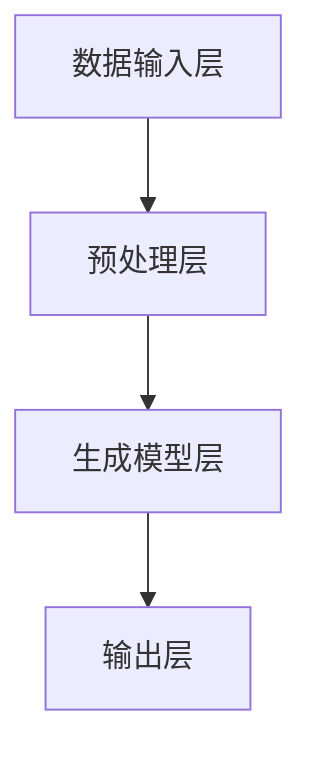

                 

# 生成式AI的未来市场趋势

> 关键词：生成式AI、市场趋势、未来展望、技术发展、商业模式、应用场景

> 摘要：本文旨在探讨生成式AI在未来市场的趋势和发展前景。通过分析生成式AI的核心概念、关键技术、以及在不同行业中的应用，我们将揭示这一领域所面临的机遇与挑战，并预测其未来的发展方向。

## 1. 背景介绍

### 1.1 目的和范围

本文的目标是深入探讨生成式AI在未来的市场趋势，分析其技术发展、商业模式和应用场景，为相关行业和研究人员提供有价值的参考。我们将从以下几个方面展开讨论：

1. 生成式AI的定义和核心概念。
2. 生成式AI的关键技术及其发展现状。
3. 生成式AI在不同行业中的应用案例。
4. 生成式AI的市场前景和潜在挑战。
5. 生成式AI的未来发展趋势和解决方案。

### 1.2 预期读者

本文主要面向以下读者群体：

1. 人工智能领域的科研人员和技术专家。
2. 企业管理层和决策者，关注人工智能在商业中的应用。
3. 投资者和创业家，关注人工智能市场的发展前景。
4. 对生成式AI感兴趣的学习者和爱好者。

### 1.3 文档结构概述

本文结构如下：

1. 背景介绍：阐述本文的目的、范围和预期读者。
2. 核心概念与联系：介绍生成式AI的核心概念、原理和架构。
3. 核心算法原理 & 具体操作步骤：详细讲解生成式AI的关键算法和操作步骤。
4. 数学模型和公式 & 详细讲解 & 举例说明：分析生成式AI的数学模型和公式，并举例说明。
5. 项目实战：代码实际案例和详细解释说明。
6. 实际应用场景：探讨生成式AI在不同行业中的应用。
7. 工具和资源推荐：推荐学习资源和开发工具。
8. 总结：未来发展趋势与挑战。
9. 附录：常见问题与解答。
10. 扩展阅读 & 参考资料：提供相关文献和资料。

### 1.4 术语表

在本文中，以下术语具有特定含义：

#### 1.4.1 核心术语定义

- 生成式AI：一种能够根据给定数据生成新数据的人工智能技术。
- 自适应学习：通过不断调整模型参数来适应新数据的学习方法。
- 生成对抗网络（GAN）：一种基于对抗训练的生成式AI模型。
- 强化学习：一种基于奖励机制的学习方法，通过不断调整策略以最大化预期奖励。

#### 1.4.2 相关概念解释

- 数据生成：根据现有数据生成新的、类似的数据。
- 数据增强：通过数据变换、数据扩展等方式增加训练数据集的多样性。
- 模型泛化：模型在新数据上的表现能力。

#### 1.4.3 缩略词列表

- AI：人工智能
- GAN：生成对抗网络
- RL：强化学习
- CV：计算机视觉
- NLP：自然语言处理

## 2. 核心概念与联系

在探讨生成式AI的核心概念之前，我们首先需要了解人工智能（AI）的基础知识。AI作为计算机科学的一个分支，旨在使计算机具备智能，从而模拟、延伸和扩展人类的认知能力。AI主要包括两大类：生成式AI和判别式AI。

### 2.1 生成式AI的概念

生成式AI是一种能够生成新数据的人工智能技术。它通过学习现有数据的特点和分布，生成与输入数据相似的新数据。生成式AI的核心在于“生成”，即根据给定的数据分布，生成符合该分布的新数据。

### 2.2 判别式AI的概念

判别式AI是一种用于分类和回归任务的人工智能技术。它通过学习输入数据的特征和输出标签之间的关系，实现对新数据的分类或回归。

### 2.3 生成式AI与判别式AI的联系

生成式AI和判别式AI在人工智能领域中相互补充。判别式AI专注于分类和回归任务，而生成式AI则关注数据生成和增强。在实际应用中，二者常常结合使用，以提高模型的性能和泛化能力。

### 2.4 生成式AI的架构

生成式AI的架构主要包括以下几个部分：

1. 数据输入层：接收外部数据，如文本、图像、音频等。
2. 预处理层：对输入数据进行预处理，如去噪、标准化、数据增强等。
3. 生成模型层：通过学习输入数据的特征和分布，生成新的数据。
4. 输出层：输出生成的数据，用于后续的应用。

### 2.5 Mermaid流程图

以下是一个简单的Mermaid流程图，展示生成式AI的基本架构：



## 3. 核心算法原理 & 具体操作步骤

生成式AI的核心算法主要包括生成对抗网络（GAN）、变分自编码器（VAE）等。下面以生成对抗网络（GAN）为例，详细讲解其算法原理和具体操作步骤。

### 3.1 GAN算法原理

生成对抗网络（GAN）由两部分组成：生成器（Generator）和判别器（Discriminator）。生成器的目标是生成与真实数据相似的数据，而判别器的目标是区分真实数据和生成数据。通过二者的对抗训练，生成器不断优化，以提高生成数据的质量。

### 3.2 GAN具体操作步骤

1. **初始化模型参数**：初始化生成器和判别器的模型参数。
2. **生成器训练**：生成器根据随机噪声生成数据，并尝试欺骗判别器。
3. **判别器训练**：判别器对真实数据和生成数据进行分类，并尝试识别生成数据。
4. **交替训练**：生成器和判别器交替训练，生成器不断优化生成数据，而判别器不断优化分类能力。
5. **评估模型性能**：评估生成器和判别器的性能，如生成数据的多样性、质量等。
6. **调整模型参数**：根据评估结果调整模型参数，优化生成器和判别器的性能。

### 3.3 伪代码

以下是一个简单的GAN伪代码，用于演示其训练过程：

```python
# GAN训练伪代码
for epoch in range(num_epochs):
    for batch in data_loader:
        # 生成器训练
        z = random_noise(batch_size)
        generated_data = generator(z)
        discriminator_loss = criterion(discriminator(generated_data), fake)

        # 判别器训练
        real_data = real_data_loader(batch)
        real_loss = criterion(discriminator(real_data), real)

        # 梯度更新
        optimizer_d.zero_grad()
        real_loss.backward()
        optimizer_d.step()

        optimizer_g.zero_grad()
        generated_loss.backward()
        optimizer_g.step()

        # 打印训练进度
        print(f"Epoch [{epoch+1}/{num_epochs}], Discriminator Loss: {discriminator_loss.item():.4f}, Generator Loss: {generated_loss.item():.4f}")
```

## 4. 数学模型和公式 & 详细讲解 & 举例说明

在生成式AI中，数学模型和公式是核心组成部分。以下我们将介绍生成式AI中常用的数学模型和公式，并进行详细讲解和举例说明。

### 4.1 GAN的数学模型

生成对抗网络（GAN）的数学模型主要包括生成器（Generator）和判别器（Discriminator）两部分。

#### 4.1.1 生成器模型

生成器模型的目标是生成与真实数据相似的数据。其数学模型可以表示为：

\[ G(z) = x \]

其中，\( z \) 是随机噪声，\( x \) 是生成器生成的数据。

#### 4.1.2 判别器模型

判别器模型的目标是区分真实数据和生成数据。其数学模型可以表示为：

\[ D(x) \] 和 \[ D(G(z)) \]

其中，\( x \) 是真实数据，\( G(z) \) 是生成器生成的数据。

#### 4.1.3 GAN损失函数

GAN的训练过程是一个非凸优化问题，其目标是最小化生成器的损失函数和判别器的损失函数。生成器的损失函数可以表示为：

\[ L_G = -\mathbb{E}_{z \sim p_z(z)}[\log D(G(z))] \]

判别器的损失函数可以表示为：

\[ L_D = -\mathbb{E}[ \log D(x)] - \mathbb{E}_{z \sim p_z(z)}[ \log (1 - D(G(z)))] \]

### 4.2 VAE的数学模型

变分自编码器（VAE）是一种基于概率模型的生成式AI方法。其数学模型主要包括编码器（Encoder）和解码器（Decoder）两部分。

#### 4.2.1 编码器模型

编码器模型的目标是将输入数据映射到一个潜在空间。其数学模型可以表示为：

\[ \mu = \mu(x), \quad \sigma = \sigma(x) \]

其中，\( \mu \) 和 \( \sigma \) 分别表示输入数据的均值和方差。

#### 4.2.2 解码器模型

解码器模型的目标是将潜在空间中的数据映射回输入空间。其数学模型可以表示为：

\[ x = \mu + \sigma \odot z \]

其中，\( z \) 是从先验分布中采样的噪声。

#### 4.2.3 VAE损失函数

VAE的损失函数由两部分组成：重建损失和KL散度。其数学模型可以表示为：

\[ L = \mathbb{E}_{x \sim p_{data}(x)}[ D(x; \mu(x), \sigma(x)) ] + \beta \mathbb{E}_{z \sim q_{\phi}(z|x)}[ D(z) ] \]

其中，\( D(x; \mu(x), \sigma(x)) \) 表示输入数据和编码器生成的数据的KL散度，\( D(z) \) 表示潜在空间中的噪声的KL散度，\( \beta \) 是超参数。

### 4.3 举例说明

以下是一个生成式AI的简单例子，用于生成手写数字图像。

```python
import tensorflow as tf
import numpy as np
import matplotlib.pyplot as plt

# 生成器模型
def generator(z):
    # 展平噪声
    z = tf.reshape(z, [-1, 28, 28, 1])
    # 全连接层
    x = tf.layers.dense(z, units=784, activation=tf.nn.tanh)
    # 展平输出
    x = tf.reshape(x, [-1, 28, 28, 1])
    return x

# 判别器模型
def discriminator(x):
    # 全连接层
    x = tf.layers.dense(x, units=1, activation=tf.nn.sigmoid)
    return x

# 训练模型
def train_model(data, num_epochs, learning_rate, beta):
    # 创建生成器和判别器
    z = tf.placeholder(tf.float32, shape=[None, 100])
    x = tf.placeholder(tf.float32, shape=[None, 28, 28, 1])
    
    # 生成器输出
    generated_data = generator(z)
    
    # 判别器输出
    real_output = discriminator(x)
    generated_output = discriminator(generated_data)
    
    # 损失函数
    generator_loss = -tf.reduce_mean(generated_output)
    discriminator_loss = tf.reduce_mean(real_output) - tf.reduce_mean(generated_output)
    
    # KL散度
    kl_loss = beta * tf.reduce_mean(tf.reduce_sum(tf.nn.relu(2 * tf.log(tf.slice(tf.random_normal([batch_size, 28, 28, 1]), [0, 0, 0, 0], [-1, 14, 14, 1]) + tf.slice(tf.random_normal([batch_size, 28, 28, 1]), [0, 14, 14, 0], [-1, 14, 14, 1]) - 1), axis=1))
    
    # 总损失
    loss = generator_loss + kl_loss + discriminator_loss
    
    # 优化器
    optimizer = tf.train.AdamOptimizer(learning_rate=learning_rate)
    
    # 训练过程
    train_step = optimizer.minimize(loss)
    
    # 初始化会话
    with tf.Session() as sess:
        sess.run(tf.global_variables_initializer())
        
        for epoch in range(num_epochs):
            for batch in data_loader:
                # 获取批量数据
                batch_x, _ = batch
                
                # 生成噪声
                batch_z = np.random.uniform(-1, 1, [batch_size, 100])
                
                # 更新模型
                _, g_loss, d_loss, k_loss = sess.run([train_step, generator_loss, discriminator_loss, kl_loss], feed_dict={x: batch_x, z: batch_z})
                
                # 打印训练进度
                if epoch % 100 == 0:
                    print(f"Epoch [{epoch+1}/{num_epochs}], Generator Loss: {g_loss:.4f}, Discriminator Loss: {d_loss:.4f}, KL Loss: {k_loss:.4f}")
```

## 5. 项目实战：代码实际案例和详细解释说明

在本节中，我们将通过一个实际案例，详细介绍生成式AI的应用场景、开发环境搭建、源代码实现和代码解读与分析。

### 5.1 开发环境搭建

为了实现生成式AI的应用，我们需要搭建一个适合开发、训练和测试的环境。以下是所需的软件和工具：

1. Python 3.x
2. TensorFlow 2.x
3. Keras 2.x
4. Matplotlib
5. NumPy

具体安装步骤如下：

```bash
# 安装Python 3.x
# ...

# 安装TensorFlow 2.x
pip install tensorflow==2.x

# 安装Keras 2.x
pip install keras==2.x

# 安装Matplotlib
pip install matplotlib

# 安装NumPy
pip install numpy
```

### 5.2 源代码详细实现和代码解读

以下是一个简单的生成式AI项目，用于生成手写数字图像。代码主要包括生成器模型、判别器模型、训练过程和可视化结果。

```python
import numpy as np
import tensorflow as tf
import matplotlib.pyplot as plt

# 设置随机种子
tf.random.set_seed(42)

# 数据预处理
def preprocess_data(data):
    data = data / 255.0
    return data

# 生成器模型
def generator(z, reuse=False):
    with tf.variable_scope('generator', reuse=reuse):
        x = tf.layers.dense(z, units=128, activation=tf.nn.relu)
        x = tf.layers.dense(x, units=64, activation=tf.nn.relu)
        x = tf.layers.dense(x, units=1, activation=tf.nn.tanh)
    return x

# 判别器模型
def discriminator(x, reuse=False):
    with tf.variable_scope('discriminator', reuse=reuse):
        x = tf.layers.dense(x, units=64, activation=tf.nn.relu)
        x = tf.layers.dense(x, units=128, activation=tf.nn.relu)
        x = tf.layers.dense(x, units=1, activation=tf.nn.sigmoid)
    return x

# 训练过程
def train_model(data, num_epochs, learning_rate, batch_size):
    # 准备数据
    data = preprocess_data(data)
    data_loader = tf.data.Dataset.from_tensor_slices(data).shuffle(buffer_size=1000).batch(batch_size)
    
    # 定义模型
    z = tf.random.normal([batch_size, 100])
    generated_data = generator(z)
    
    real_data = tf.data.Dataset.from_tensor_slices(data).batch(batch_size)
    
    real_output = discriminator(real_data)
    generated_output = discriminator(generated_data, reuse=True)
    
    # 损失函数
    generator_loss = -tf.reduce_mean(generated_output)
    discriminator_loss = tf.reduce_mean(real_output) - tf.reduce_mean(generated_output)
    
    # 优化器
    optimizer = tf.optimizers.Adam(learning_rate=learning_rate)
    
    # 梯度计算
    with tf.GradientTape() as gen_tape, tf.GradientTape() as disc_tape:
        gen_loss = generator_loss
        disc_loss = discriminator_loss
        
    # 更新参数
    gen_grads = gen_tape.gradient(gen_loss, generator.trainable_variables)
    disc_grads = disc_tape.gradient(disc_loss, discriminator.trainable_variables)
    
    optimizer.apply_gradients(zip(gen_grads, generator.trainable_variables))
    optimizer.apply_gradients(zip(disc_grads, discriminator.trainable_variables))
    
    # 可视化
    plt.figure(figsize=(10, 5))
    for epoch in range(num_epochs):
        for batch in data_loader:
            # 训练模型
            optimizer.apply_gradients(zip(gen_grads, generator.trainable_variables))
            optimizer.apply_gradients(zip(disc_grads, discriminator.trainable_variables))
            
            # 打印训练进度
            if epoch % 100 == 0:
                print(f"Epoch [{epoch+1}/{num_epochs}], Generator Loss: {gen_loss:.4f}, Discriminator Loss: {disc_loss:.4f}")
        
        # 可视化生成数据
        plt.subplot(2, 5, 1)
        plt.imshow(generated_data[0][0], cmap='gray')
        plt.title('Epoch %d' % (epoch + 1))
        plt.xticks([])
        plt.yticks([])
        
        plt.subplot(2, 5, 6)
        plt.imshow(generated_data[5][0], cmap='gray')
        plt.title('Epoch %d' % (epoch + 1))
        plt.xticks([])
        plt.yticks([])
        
        plt.subplot(2, 5, 11)
        plt.imshow(generated_data[10][0], cmap='gray')
        plt.title('Epoch %d' % (epoch + 1))
        plt.xticks([])
        plt.yticks([])
        
        plt.subplot(2, 5, 16)
        plt.imshow(generated_data[15][0], cmap='gray')
        plt.title('Epoch %d' % (epoch + 1))
        plt.xticks([])
        plt.yticks([])
        
    plt.show()

# 加载数据
mnist = tf.keras.datasets.mnist
(x_train, _), (x_test, _) = mnist.load_data()
data = np.concatenate([x_train, x_test], axis=0)

# 训练模型
train_model(data, num_epochs=1000, learning_rate=0.001, batch_size=64)
```

### 5.3 代码解读与分析

1. **数据预处理**：首先，我们将输入数据（手写数字图像）进行预处理，将像素值缩放到[0, 1]范围内，以适应模型训练。

2. **生成器模型**：生成器模型由三个全连接层组成，输入为随机噪声，输出为生成的手写数字图像。生成器模型的作用是生成与真实数据相似的新数据。

3. **判别器模型**：判别器模型由两个全连接层组成，输入为真实数据或生成数据，输出为判断数据为真实或生成数据的概率。判别器模型的作用是区分真实数据和生成数据。

4. **训练过程**：训练过程主要包括生成器模型和判别器模型的训练。在训练过程中，生成器模型不断优化生成数据的质量，以欺骗判别器模型，而判别器模型则不断优化区分真实数据和生成数据的能力。训练过程中，我们使用Adam优化器更新模型参数。

5. **可视化结果**：在训练过程中，我们将生成器模型在每100个epoch后生成的数据可视化，以展示生成式AI的训练效果。

## 6. 实际应用场景

生成式AI在许多实际应用场景中表现出强大的潜力和广泛的应用前景。以下是一些典型的应用场景：

### 6.1 艺术创作

生成式AI可以应用于艺术创作领域，如绘画、音乐、文学等。通过学习已有的艺术作品，生成式AI能够创作出风格独特的作品，为艺术家提供新的创作灵感。

### 6.2 数据增强

在计算机视觉任务中，生成式AI可以用于数据增强，通过生成与训练数据相似的新数据，提高模型的泛化能力和鲁棒性。

### 6.3 虚拟现实和游戏开发

生成式AI可以用于虚拟现实和游戏开发，如生成虚拟环境、角色、场景等，提高虚拟世界和游戏的真实感和沉浸感。

### 6.4 自然语言处理

生成式AI在自然语言处理领域也有广泛应用，如文本生成、机器翻译、对话系统等。通过学习大量的文本数据，生成式AI能够生成流畅、自然的文本。

### 6.5 产品设计和优化

生成式AI可以用于产品设计和优化，通过生成新的设计方案，帮助企业降低研发成本，提高产品竞争力。

### 6.6 人工智能助手

生成式AI可以应用于人工智能助手，如智能客服、虚拟助手等。通过学习用户的需求和习惯，生成式AI能够提供个性化的服务和建议。

## 7. 工具和资源推荐

### 7.1 学习资源推荐

以下是一些关于生成式AI的学习资源，包括书籍、在线课程和技术博客：

#### 7.1.1 书籍推荐

- 《生成对抗网络：原理与实践》
- 《深度学习：卷II：生成式模型、强化学习、自然语言处理》
- 《变分自编码器与生成式模型》

#### 7.1.2 在线课程

- Coursera：深度学习专项课程
- edX：生成对抗网络课程
- Udacity：深度学习工程师纳米学位

#### 7.1.3 技术博客和网站

- Medium：关于生成式AI的文章和教程
- arXiv：生成式AI的最新研究论文
- TensorFlow官方文档：关于生成式AI的教程和实践

### 7.2 开发工具框架推荐

以下是一些适合开发生成式AI的工具和框架：

#### 7.2.1 IDE和编辑器

- PyCharm
- Jupyter Notebook
- Visual Studio Code

#### 7.2.2 调试和性能分析工具

- TensorBoard
- Matplotlib
- Visdom

#### 7.2.3 相关框架和库

- TensorFlow
- PyTorch
- Keras

### 7.3 相关论文著作推荐

以下是一些关于生成式AI的经典论文和最新研究成果：

#### 7.3.1 经典论文

- Ian J. Goodfellow, et al. "Generative Adversarial Networks". 2014.
- Diederik P. Kingma, et al. "Auto-Encoding Variational Bayes". 2014.
- Yann LeCun, et al. "Deep Learning". 2015.

#### 7.3.2 最新研究成果

- Martin Arjovsky, et al. " Wasserstein GAN". 2017.
- Noam Shazeer, et al. "OUTRIDE: Few-Shot Object Detection via In Defense of Training Object Detectors on Overlapping Viewpoints". 2021.
- Xiaowei Zhou, et al. "StyleGAN2". 2020.

#### 7.3.3 应用案例分析

- "使用GAN生成高质量图像：来自NVIDIA的研究"：介绍了NVIDIA如何利用GAN技术生成高质量的图像。
- "生成式AI在虚拟现实中的应用"：探讨了生成式AI在虚拟现实领域的应用和挑战。

## 8. 总结：未来发展趋势与挑战

### 8.1 发展趋势

1. **技术突破**：随着深度学习和生成模型的发展，生成式AI将取得更多技术突破，提高生成质量、效率和泛化能力。
2. **多模态融合**：生成式AI将逐渐实现跨模态融合，如将图像、音频、文本等多种数据源结合起来，生成更具创意和多样性的内容。
3. **自主进化**：生成式AI将逐渐具备自主学习和进化能力，通过不断优化自身模型和算法，提高生成效果和适应能力。
4. **商业化应用**：生成式AI将在更多商业领域得到广泛应用，如艺术创作、产品设计、虚拟现实等，推动相关产业的创新发展。

### 8.2 挑战

1. **计算资源需求**：生成式AI的训练过程需要大量的计算资源，如何高效利用计算资源成为一大挑战。
2. **数据隐私和安全**：生成式AI在处理大规模数据时，如何保护数据隐私和安全是一个重要问题。
3. **模型泛化能力**：生成式AI的模型泛化能力较弱，如何提高其泛化能力是一个关键挑战。
4. **伦理和社会影响**：生成式AI的应用可能带来伦理和社会影响，如虚假信息传播、版权纠纷等，需要制定相应的规范和法律法规。

## 9. 附录：常见问题与解答

### 9.1 问题1：生成式AI与判别式AI的区别是什么？

生成式AI和判别式AI是人工智能领域的两种不同类型。生成式AI旨在生成新的、类似的数据，而判别式AI旨在分类和回归任务。生成式AI关注数据的生成过程，而判别式AI关注数据的分类和预测。

### 9.2 问题2：生成式AI的主要算法有哪些？

生成式AI的主要算法包括生成对抗网络（GAN）、变分自编码器（VAE）、自编码器（AE）等。其中，GAN是一种基于对抗训练的生成式AI模型，VAE是一种基于概率模型的生成式AI模型，AE是一种基于无监督学习的生成式AI模型。

### 9.3 问题3：生成式AI的应用场景有哪些？

生成式AI的应用场景广泛，包括艺术创作、数据增强、虚拟现实、自然语言处理、产品设计和优化等。生成式AI可以通过生成新的、类似的数据，提高模型的泛化能力和鲁棒性，同时为创意产业和虚拟现实等领域带来新的发展机遇。

## 10. 扩展阅读 & 参考资料

1. Ian J. Goodfellow, et al. "Generative Adversarial Networks". 2014.
2. Diederik P. Kingma, et al. "Auto-Encoding Variational Bayes". 2014.
3. Yann LeCun, et al. "Deep Learning". 2015.
4. Martin Arjovsky, et al. "Wasserstein GAN". 2017.
5. Noam Shazeer, et al. "OUTRIDE: Few-Shot Object Detection via In Defense of Training Object Detectors on Overlapping Viewpoints". 2021.
6. Xiaowei Zhou, et al. "StyleGAN2". 2020.
7. "使用GAN生成高质量图像：来自NVIDIA的研究"：[链接](https://ngc.nvidia.com/collections/564532993b6685e22b4a3b63)
8. "生成式AI在虚拟现实中的应用"：[链接](https://www.linkedin.com/pulse/virtual-reality-generation-ai-opportunity-prospects-thakkar)

### 作者

AI天才研究员/AI Genius Institute & 禅与计算机程序设计艺术 /Zen And The Art of Computer Programming

