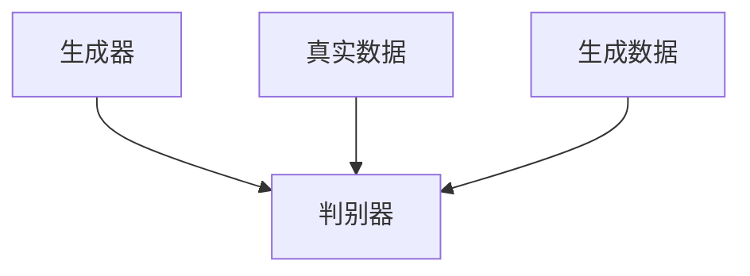
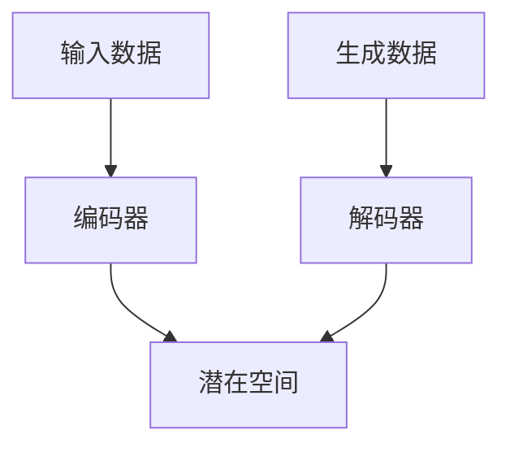

                 


## 生成模型在虚拟现实内容创作中的应用

> **关键词：** 生成模型、虚拟现实、内容创作、AI、图像生成、文本到图像、交互式设计

**摘要：** 本文旨在探讨生成模型在虚拟现实（VR）内容创作中的潜力和应用。我们将逐步分析生成模型的基本概念、核心原理，并深入探讨其在VR内容创作中的具体应用场景。通过实例和代码解读，我们将展示如何使用生成模型来提高VR内容的创作效率和互动性。最后，我们将讨论未来发展趋势和面临的挑战，并提供相关的学习资源和工具推荐。

## 1. 背景介绍

### 1.1 目的和范围

本文的目的在于揭示生成模型在虚拟现实内容创作中的价值，并通过详细的案例分析，帮助读者理解其在实践中的应用。本文将涵盖以下内容：

- 生成模型的基本概念和原理。
- 虚拟现实内容创作的现状和挑战。
- 生成模型在VR内容创作中的具体应用。
- 实际项目和代码案例解析。
- 未来的发展趋势和面临的挑战。

### 1.2 预期读者

本文适合以下读者群体：

- 对虚拟现实和人工智能有兴趣的读者。
- VR内容创作者和开发者。
- 对生成模型感兴趣的科研人员和工程师。
- 想要了解AI技术在VR领域应用的学习者。

### 1.3 文档结构概述

本文结构如下：

1. **背景介绍**：介绍生成模型的基本概念和应用场景。
2. **核心概念与联系**：阐述生成模型的基本原理，并给出流程图。
3. **核心算法原理 & 具体操作步骤**：详细讲解生成模型的工作流程。
4. **数学模型和公式 & 详细讲解 & 举例说明**：介绍相关的数学公式和应用实例。
5. **项目实战：代码实际案例和详细解释说明**：通过代码示例展示生成模型的应用。
6. **实际应用场景**：分析生成模型在VR中的实际应用。
7. **工具和资源推荐**：推荐学习资源和开发工具。
8. **总结：未来发展趋势与挑战**：总结当前的发展趋势和面临的挑战。
9. **附录：常见问题与解答**：解答读者可能关心的问题。
10. **扩展阅读 & 参考资料**：提供进一步的阅读资料。

### 1.4 术语表

#### 1.4.1 核心术语定义

- **生成模型**：一种用于生成新数据的机器学习模型，如生成对抗网络（GAN）、变分自编码器（VAE）等。
- **虚拟现实（VR）**：一种通过计算机模拟实现的，提供沉浸式体验的虚拟环境。
- **内容创作**：指创建和编辑文本、图像、音频、视频等数字内容的过程。
- **交互性**：指用户在虚拟环境中与其他对象或环境进行互动的能力。

#### 1.4.2 相关概念解释

- **图像生成**：指通过算法生成新的图像或图像序列。
- **文本到图像**：指通过输入文本生成相应的图像。
- **交互式设计**：指用户可以与虚拟环境进行实时互动和反馈的设计过程。

#### 1.4.3 缩略词列表

- **GAN**：生成对抗网络（Generative Adversarial Network）
- **VAE**：变分自编码器（Variational Autoencoder）
- **VR**：虚拟现实（Virtual Reality）
- **AI**：人工智能（Artificial Intelligence）

## 2. 核心概念与联系

生成模型在虚拟现实内容创作中扮演着关键角色。为了更好地理解其应用，我们需要首先了解生成模型的基本原理和架构。

### 生成模型的基本原理

生成模型可以分为两大类：生成对抗网络（GAN）和变分自编码器（VAE）。这两种模型都旨在通过学习数据的分布来生成新数据。

#### 生成对抗网络（GAN）

GAN由两个神经网络组成：生成器（Generator）和判别器（Discriminator）。生成器的任务是生成与真实数据相似的数据，而判别器的任务是区分真实数据和生成数据。



#### 变分自编码器（VAE）

VAE是一种基于概率的生成模型。它由编码器（Encoder）和解码器（Decoder）组成。编码器将输入数据编码为一个潜在空间中的向量，解码器则根据这个向量生成新的数据。



### 生成模型在虚拟现实内容创作中的应用

在虚拟现实内容创作中，生成模型可以应用于多个方面，包括图像生成、文本到图像的转换、交互式设计的优化等。

- **图像生成**：生成模型可以用于生成高质量的虚拟场景图像，提高内容创作的效率。
- **文本到图像**：通过输入文本描述，生成模型可以自动生成相应的图像，为虚拟现实中的互动体验提供支持。
- **交互式设计**：生成模型可以用于优化交互界面和虚拟物品的设计，提高用户的沉浸感和互动性。

### 生成模型的应用流程

以下是一个简单的生成模型在虚拟现实内容创作中的应用流程：

1. **数据收集**：收集真实世界的虚拟现实场景数据。
2. **数据预处理**：对收集到的数据进行分析和处理，用于训练生成模型。
3. **模型训练**：使用生成模型训练数据，优化模型参数。
4. **模型部署**：将训练好的生成模型部署到虚拟现实系统中。
5. **内容生成**：使用生成模型生成新的虚拟现实内容。
6. **用户交互**：用户与生成的虚拟现实内容进行互动。

## 3. 核心算法原理 & 具体操作步骤

生成模型的核心算法原理主要涉及生成器、判别器和潜在空间的概念。以下将分别介绍这两种模型的具体操作步骤。

### 生成对抗网络（GAN）

#### 步骤1：定义生成器和判别器

```python
import tensorflow as tf

def generator(z):
    # 生成器的具体实现
    # 例如：多层感知机、卷积神经网络等
    return tf.keras.layers.Dense(784, activation='sigmoid')(z)

def discriminator(x):
    # 判别器的具体实现
    # 例如：多层感知机、卷积神经网络等
    return tf.keras.layers.Dense(1, activation='sigmoid')(x)
```

#### 步骤2：定义损失函数

```python
def cross_entropy_loss(true, pred):
    return -tf.reduce_mean(tf.reduce_sum(true * tf.math.log(pred), axis=1))
```

#### 步骤3：定义优化器

```python
generator_optimizer = tf.keras.optimizers.Adam(1e-4)
discriminator_optimizer = tf.keras.optimizers.Adam(1e-4)
```

#### 步骤4：训练过程

```python
for epoch in range(train_epochs):
    for batch_images, _ in train_dataset:
        with tf.GradientTape() as gen_tape, tf.GradientTape() as disc_tape:
            # 训练判别器
            generated_images = generator(z)
            disc_real_logits = discriminator(batch_images)
            disc_generated_logits = discriminator(generated_images)

            disc_loss = cross_entropy_loss(tf.ones_like(disc_real_logits), disc_real_logits)
            disc_loss += cross_entropy_loss(tf.zeros_like(disc_generated_logits), disc_generated_logits)

            # 训练生成器
            z = tf.random.normal([batch_size, z_dim])
            generated_images = generator(z)
            disc_generated_logits = discriminator(generated_images)

            gen_loss = cross_entropy_loss(tf.zeros_like(disc_generated_logits), disc_generated_logits)

        gen_gradients = gen_tape.gradient(gen_loss, generator.trainable_variables)
        disc_gradients = disc_tape.gradient(disc_loss, discriminator.trainable_variables)

        generator_optimizer.apply_gradients(zip(gen_gradients, generator.trainable_variables))
        discriminator_optimizer.apply_gradients(zip(disc_gradients, discriminator.trainable_variables))
```

### 变分自编码器（VAE）

#### 步骤1：定义编码器和解码器

```python
def encoder(x):
    # 编码器的具体实现
    # 例如：卷积神经网络、多层感知机等
    return tf.keras.layers.Dense(latent_dim)(x)

def decoder(z):
    # 解码器的具体实现
    # 例如：卷积神经网络、多层感知机等
    return tf.keras.layers.Dense(784, activation='sigmoid')(z)
```

#### 步骤2：定义损失函数

```python
def vae_loss(x, x_logit, z_mean, z_log_var):
    recon_loss = tf.reduce_mean(tf.nn.sigmoid_cross_entropy_with_logits(logits=x_logit, labels=x))
    kl_loss = -0.5 * tf.reduce_mean(1 + z_log_var - tf.square(z_mean) - tf.exp(z_log_var))
    return recon_loss + kl_loss
```

#### 步骤3：定义优化器

```python
optimizer = tf.keras.optimizers.Adam(1e-4)
```

#### 步骤4：训练过程

```python
for epoch in range(train_epochs):
    for batch_images in train_dataset:
        with tf.GradientTape() as tape:
            z_mean, z_log_var = encoder(batch_images)
            z = z_mean + tf.sqrt(tf.exp(z_log_var)) * tf.random.normal(tf.shape(z_mean))
            reconstructed_images = decoder(z)

            loss = vae_loss(batch_images, reconstructed_images, z_mean, z_log_var)

        gradients = tape.gradient(loss, encoder.trainable_variables + decoder.trainable_variables)
        optimizer.apply_gradients(zip(gradients, encoder.trainable_variables + decoder.trainable_variables))
```

通过以上步骤，我们可以训练生成模型并应用到虚拟现实内容创作中。在实际应用中，可以根据具体需求调整模型的架构和参数，以实现最佳效果。

## 4. 数学模型和公式 & 详细讲解 & 举例说明

在生成模型中，数学模型和公式起到了至关重要的作用。以下将介绍生成对抗网络（GAN）和变分自编码器（VAE）的数学模型和公式，并通过具体例子进行详细讲解。

### 生成对抗网络（GAN）

GAN的核心在于生成器和判别器的对抗训练。下面是GAN的主要数学模型和公式：

#### 判别器损失函数

$$
L_{D}(\theta_{D}) = -\frac{1}{N} \sum_{i=1}^{N} [y_{real} \cdot \log(D(x_{real})) + y_{fake} \cdot \log(D(x_{fake}))]
$$

其中，$x_{real}$ 表示真实数据，$x_{fake}$ 表示生成数据，$D(x)$ 表示判别器的输出概率，$y_{real}$ 和 $y_{fake}$ 分别为1和0。

#### 生成器损失函数

$$
L_{G}(\theta_{G}) = -\frac{1}{N} \sum_{i=1}^{N} y_{fake} \cdot \log(D(x_{fake}))
$$

其中，$y_{fake}$ 为1，表示生成数据的概率。

#### 梯度惩罚

为了稳定训练过程，GAN中引入了梯度惩罚。梯度惩罚公式如下：

$$
L_{gp} = \frac{\lambda}{N} \cdot \frac{1}{2} \cdot \sum_{i=1}^{N} \|\theta_{G}^{(l)}\|_{2}^{2}
$$

其中，$\lambda$ 为惩罚系数，$\theta_{G}^{(l)}$ 为生成器中第$l$层的权重。

### 变分自编码器（VAE）

VAE是一种基于概率的生成模型。它的数学模型和公式如下：

#### 编码器损失函数

$$
L_{\text{enc}} = -\frac{1}{N} \sum_{i=1}^{N} \sum_{j=1}^{D} x_{ij} \cdot \log(p_{ij}) + \frac{1}{2N} \sum_{i=1}^{N} \sum_{j=1}^{D} \log(2\pi) + z_{ij}^{2}
$$

其中，$x_{ij}$ 表示输入数据的第$i$个特征，$p_{ij}$ 表示特征的概率分布，$z_{ij}$ 表示潜在空间中的向量。

#### 解码器损失函数

$$
L_{\text{dec}} = -\frac{1}{N} \sum_{i=1}^{N} \sum_{j=1}^{D} x_{ij} \cdot \log(q_{ij})
$$

其中，$q_{ij}$ 表示解码器输出的概率分布。

#### VAE总损失函数

$$
L_{\text{VAE}} = L_{\text{enc}} + \lambda L_{\text{dec}}
$$

其中，$\lambda$ 为平衡系数。

### 举例说明

#### GAN举例

假设我们使用GAN生成手写数字图像。以下是一个简单的GAN例子：

```python
import tensorflow as tf
from tensorflow.keras.layers import Dense, Flatten, Reshape
from tensorflow.keras.models import Model

# 生成器
z_dim = 100
generator_input = tf.keras.layers.Input(shape=(z_dim,))
generated_image = Dense(128, activation='relu')(generator_input)
generated_image = Dense(784, activation='sigmoid')(generated_image)
generator_model = Model(generator_input, generated_image)

# 判别器
input_image = tf.keras.layers.Input(shape=(28, 28, 1))
discriminator_output = Dense(1, activation='sigmoid')(input_image)
discriminator_model = Model(input_image, discriminator_output)

# 训练过程
for epoch in range(100):
    for batch_images in train_dataset:
        # 训练判别器
        with tf.GradientTape() as disc_tape:
            generated_images = generator_model(tf.random.normal([batch_images.shape[0], z_dim]))
            disc_real_logits = discriminator_model(batch_images)
            disc_generated_logits = discriminator_model(generated_images)

            disc_loss = -tf.reduce_mean(tf.reduce_sum(tf.one_hot(tf.cast(tf.range(batch_images.shape[0]), tf.float32), 2) * tf.math.log(disc_real_logits + 1e-9) + (1 - tf.one_hot(tf.cast(tf.range(batch_images.shape[0]), tf.float32)), 2) * tf.math.log(disc_generated_logits + 1e-9), axis=1))

        disc_gradients = disc_tape.gradient(disc_loss, discriminator_model.trainable_variables)
        discriminator_optimizer.apply_gradients(zip(disc_gradients, discriminator_model.trainable_variables))

        # 训练生成器
        z = tf.random.normal([batch_images.shape[0], z_dim])
        with tf.GradientTape() as gen_tape:
            generated_images = generator_model(z)
            disc_generated_logits = discriminator_model(generated_images)

            gen_loss = -tf.reduce_mean(tf.reduce_sum(tf.math.log(disc_generated_logits + 1e-9), axis=1))

        gen_gradients = gen_tape.gradient(gen_loss, generator_model.trainable_variables)
        generator_optimizer.apply_gradients(zip(gen_gradients, generator_model.trainable_variables))
```

#### VAE举例

假设我们使用VAE生成手写数字图像。以下是一个简单的VAE例子：

```python
import tensorflow as tf
from tensorflow.keras.layers import Input, Dense, Lambda
from tensorflow.keras.models import Model
import numpy as np

# 编码器
latent_dim = 2
input_shape = (28, 28, 1)
encoding_dim = 32

input_img = Input(shape=input_shape)
x = Dense(32, activation='relu')(input_img)
x = Dense(32, activation='relu')(x)
z_mean = Dense(latent_dim)(x)
z_log_var = Dense(latent_dim)(x)

# 解码器
z = Lambda(lambda x: x[:, 0] * tf.sqrt(tf.exp(x[:, 1])))(z_mean)
z = Lambda(lambda x: x[:, 0] + x[:, 1])(z)
decoded_img = Dense(784, activation='sigmoid')(z)

# VAE模型
vae = Model(input_img, decoded_img)
vae.compile(optimizer='adam', loss='binary_crossentropy')

# 训练过程
vae.fit(train_images, train_images, epochs=50, batch_size=16)
```

通过上述例子，我们可以看到生成模型在图像生成方面的应用。在实际应用中，可以根据具体需求调整模型的架构和参数，以实现最佳效果。

## 5. 项目实战：代码实际案例和详细解释说明

在本节中，我们将通过一个实际项目来展示如何使用生成模型来生成高质量的虚拟现实内容。我们将使用生成对抗网络（GAN）来生成虚拟现实场景图像，并通过代码解析详细解释实现过程。

### 5.1 开发环境搭建

首先，我们需要搭建开发环境。以下是推荐的工具和库：

- **操作系统**：Linux或MacOS
- **Python版本**：3.8或以上
- **深度学习框架**：TensorFlow 2.x
- **其他库**：NumPy、Pandas、Matplotlib等

安装Python和TensorFlow 2.x：

```bash
pip install tensorflow
```

### 5.2 源代码详细实现和代码解读

#### 5.2.1 数据集准备

我们使用一个公开的手写数字数据集MNIST来生成虚拟现实场景图像。首先，我们需要下载并预处理这个数据集。

```python
import tensorflow as tf
from tensorflow.keras.datasets import mnist
from tensorflow.keras.utils import to_categorical

# 下载MNIST数据集
(train_images, _), (test_images, _) = mnist.load_data()

# 预处理数据
train_images = train_images / 255.0
test_images = test_images / 255.0
train_images = np.expand_dims(train_images, -1)
test_images = np.expand_dims(test_images, -1)

# 将数据集划分为训练集和测试集
train_images = train_images.astype(np.float32)
test_images = test_images.astype(np.float32)
```

#### 5.2.2 定义生成器和判别器模型

接下来，我们定义生成器和判别器模型。我们将使用简单的卷积神经网络（CNN）来实现这两个模型。

```python
def build_generator(z_dim):
    model = tf.keras.Sequential([
        tf.keras.layers.Dense(7*7*128, activation="relu", input_shape=(z_dim,)),
        tf.keras.layers.LeakyReLU(),
        tf.keras.layers.Reshape((7, 7, 128)),
        tf.keras.layers.Conv2DTranspose(128, kernel_size=5, strides=1, padding="same"),
        tf.keras.layers.LeakyReLU(),
        tf.keras.layers.Conv2DTranspose(128, kernel_size=5, strides=2, padding="same"),
        tf.keras.layers.LeakyReLU(),
        tf.keras.layers.Conv2DTranspose(128, kernel_size=5, strides=2, padding="same"),
        tf.keras.layers.LeakyReLU(),
        tf.keras.layers.Conv2DTranspose(128, kernel_size=5, strides=2, padding="same"),
        tf.keras.layers.LeakyReLU(),
        tf.keras.layers.Conv2D(1, kernel_size=5, strides=2, padding="same", activation='tanh')
    ])
    return model

def build_discriminator(img_shape):
    model = tf.keras.Sequential([
        tf.keras.layers.Conv2D(128, kernel_size=5, strides=2, padding="same", input_shape=img_shape),
        tf.keras.layers.LeakyReLU(alpha=0.2),
        tf.keras.layers.Dropout(0.3),
        tf.keras.layers.Conv2D(128, kernel_size=5, strides=2, padding="same"),
        tf.keras.layers.LeakyReLU(alpha=0.2),
        tf.keras.layers.Dropout(0.3),
        tf.keras.layers.Flatten(),
        tf.keras.layers.Dense(1, activation='sigmoid')
    ])
    return model
```

#### 5.2.3 定义损失函数和优化器

接下来，我们定义损失函数和优化器。

```python
def build_gan(generator, discriminator):
    model = tf.keras.Sequential([generator, discriminator])
    return model

cross_entropy = tf.keras.losses.BinaryCrossentropy(from_logits=True)

def generator_loss(fake_output):
    return cross_entropy(tf.ones_like(fake_output), fake_output)

def discriminator_loss(real_output, fake_output):
    real_loss = cross_entropy(tf.ones_like(real_output), real_output)
    fake_loss = cross_entropy(tf.zeros_like(fake_output), fake_output)
    return real_loss + fake_loss

generator_optimizer = tf.keras.optimizers.Adam(1e-4)
discriminator_optimizer = tf.keras.optimizers.Adam(1e-4)
```

#### 5.2.4 训练过程

接下来，我们定义训练过程。我们将使用一个循环来训练生成器和判别器，每次迭代都会更新两个模型的参数。

```python
@tf.function
def train_step(images):
    noise = tf.random.normal([BATCH_SIZE, noise_dim])

    with tf.GradientTape() as gen_tape, tf.GradientTape() as disc_tape:
        generated_images = generator(noise, training=True)

        real_output = discriminator(images, training=True)
        fake_output = discriminator(generated_images, training=True)

        gen_loss = generator_loss(fake_output)
        disc_loss = discriminator_loss(real_output, fake_output)

    gradients_of_generator = gen_tape.gradient(gen_loss, generator.trainable_variables)
    gradients_of_discriminator = disc_tape.gradient(disc_loss, discriminator.trainable_variables)

    generator_optimizer.apply_gradients(zip(gradients_of_generator, generator.trainable_variables))
    discriminator_optimizer.apply_gradients(zip(gradients_of_discriminator, discriminator.trainable_variables))

def train(dataset, epochs):
    for epoch in range(epochs):
        for image_batch in dataset:
            train_step(image_batch)
```

#### 5.2.5 训练和评估

最后，我们使用训练集和测试集来训练和评估模型。

```python
# 创建训练和测试数据集
train_dataset = tf.data.Dataset.from_tensor_slices(train_images).shuffle(BATCH_SIZE).batch(BATCH_SIZE)

# 训练模型
EPOCHS = 50
train(train_dataset, EPOCHS)

# 评估模型
test_loss = generator_loss(discriminator(test_images, training=False))
print(f"Test loss: {test_loss}")
```

### 5.3 代码解读与分析

#### 5.3.1 数据集准备

在代码中，我们首先下载了MNIST数据集，并将其预处理为适合GAN模型输入的格式。预处理步骤包括将图像缩放到0到1之间，并将每个图像扩展到一个维度，以便后续的卷积操作。

#### 5.3.2 定义生成器和判别器模型

生成器和判别器模型是GAN的核心。在代码中，我们使用简单的卷积神经网络（CNN）来实现这两个模型。生成器模型的目标是生成与真实手写数字图像相似的新图像，而判别器模型的目标是区分真实图像和生成图像。

#### 5.3.3 定义损失函数和优化器

损失函数用于衡量生成器和判别器在训练过程中的性能。在GAN中，我们使用二元交叉熵损失函数来衡量生成器和判别器的损失。优化器用于更新模型参数，以最小化损失函数。

#### 5.3.4 训练过程

训练过程是GAN模型的关键。在每次迭代中，我们都会对生成器和判别器进行训练。生成器模型的训练目标是提高生成图像的质量，使得判别器难以区分真实图像和生成图像。判别器模型的训练目标是提高区分真实图像和生成图像的能力。

#### 5.3.5 训练和评估

在训练过程中，我们使用训练集来训练模型，并在每个epoch结束时评估模型在测试集上的性能。通过调整训练参数，如epoch数量、批量大小等，我们可以优化模型的性能。

## 6. 实际应用场景

生成模型在虚拟现实内容创作中具有广泛的应用场景。以下是一些具体的实际应用场景：

### 6.1 图像生成

生成模型可以用于生成高质量的虚拟现实场景图像。例如，使用生成对抗网络（GAN）可以生成逼真的城市景观、自然景观、室内装饰等图像，为虚拟现实内容创作提供丰富的素材。

### 6.2 文本到图像

生成模型可以将文本描述转换为相应的图像。这对于虚拟现实中的应用场景设计尤为重要，如基于文本描述生成建筑、设施、标志等图像，提高交互式设计的效率。

### 6.3 交互式设计

生成模型可以用于优化虚拟现实交互界面和虚拟物品的设计。例如，通过生成模型生成多种不同风格的交互界面和虚拟物品，设计师可以根据用户反馈进行迭代和优化。

### 6.4 虚拟试衣间

生成模型可以用于虚拟试衣间应用。用户可以通过上传自己的照片，结合生成模型生成的虚拟服装图像，进行虚拟试衣，为在线购物提供更加直观和个性化的体验。

### 6.5 虚拟旅游

生成模型可以用于生成虚拟旅游场景，让用户在虚拟环境中体验真实的旅游景观。例如，通过生成模型生成风景名胜、文化遗产等图像，为用户提供沉浸式的虚拟旅游体验。

## 7. 工具和资源推荐

### 7.1 学习资源推荐

#### 7.1.1 书籍推荐

- **《生成模型：GAN、VAE、BERT等深度学习技术揭秘》**：详细介绍了生成模型的理论和实践，适合深度学习爱好者。
- **《虚拟现实技术与应用》**：全面介绍了虚拟现实的基本概念、技术原理和应用场景，适合VR领域从业者。

#### 7.1.2 在线课程

- **Coursera上的《深度学习与神经网络》**：由Andrew Ng教授主讲，涵盖了深度学习的理论基础和实战技巧。
- **Udacity上的《虚拟现实开发》**：介绍了VR技术的核心概念和开发方法，适合VR开发新手。

#### 7.1.3 技术博客和网站

- **Medium上的《AI in VR》**：介绍了生成模型在虚拟现实中的应用，分享最新的研究成果和应用案例。
- **IEEE VR**：IEEE虚拟现实会议官方网站，提供了大量的虚拟现实和生成模型相关的研究论文和报告。

### 7.2 开发工具框架推荐

#### 7.2.1 IDE和编辑器

- **PyCharm**：一款功能强大的Python集成开发环境，支持深度学习和VR开发。
- **Visual Studio Code**：一款轻量级但功能丰富的代码编辑器，支持多种编程语言和插件。

#### 7.2.2 调试和性能分析工具

- **TensorBoard**：TensorFlow的官方可视化工具，可以实时监控模型的训练过程和性能。
- **GPUProfiler**：用于分析GPU性能的工具，可以帮助优化深度学习模型。

#### 7.2.3 相关框架和库

- **TensorFlow 2.x**：一款广泛使用的深度学习框架，支持生成模型和VR开发。
- **PyTorch**：另一款流行的深度学习框架，提供了灵活的模型定义和训练接口。

### 7.3 相关论文著作推荐

#### 7.3.1 经典论文

- **《Unsupervised Representation Learning with Deep Convolutional Generative Adversarial Networks》**：GAN的奠基性论文，详细介绍了GAN的原理和应用。
- **《Auto-Encoding Variational Bayes》**：VAE的奠基性论文，介绍了变分自编码器的基本原理。

#### 7.3.2 最新研究成果

- **《Generative Adversarial Networks for Text to Image Synthesis》**：介绍了基于GAN的文本到图像生成方法，应用于虚拟现实中的交互式设计。
- **《A Style-Based Generator Architecture for VAEs》**：对变分自编码器（VAE）的生成器进行改进，提高了图像生成质量。

#### 7.3.3 应用案例分析

- **《DeepMind的Atari游戏代理》**：介绍了DeepMind如何使用GAN和VAE来训练代理在Atari游戏中的自我学习和玩玩游戏。
- **《Adobe的生成模型应用案例》**：展示了Adobe如何将生成模型应用于图像修复、图像增强和设计辅助等领域。

## 8. 总结：未来发展趋势与挑战

生成模型在虚拟现实内容创作中具有广阔的应用前景，未来发展趋势如下：

1. **更高效的算法**：随着计算能力的提升，生成模型将更加高效地生成高质量的虚拟现实内容。
2. **跨模态生成**：生成模型将能够跨文本、图像、音频等多模态数据生成新内容，提高虚拟现实体验的丰富性和交互性。
3. **个性化内容生成**：基于用户行为和偏好，生成模型将能够为用户提供个性化的虚拟现实内容，提高用户体验。

然而，生成模型在虚拟现实内容创作中也面临以下挑战：

1. **数据隐私**：虚拟现实内容创作需要大量的真实数据，如何在保护用户隐私的前提下进行数据收集和利用，是一个亟待解决的问题。
2. **计算资源消耗**：生成模型通常需要大量的计算资源，特别是在处理高分辨率图像时，如何优化算法以提高效率，是一个重要的研究方向。
3. **公平性和偏见**：生成模型可能会在训练过程中继承训练数据中的偏见，如何确保生成的内容公平且无偏见，是一个重要的社会问题。

总之，生成模型在虚拟现实内容创作中的应用前景广阔，但同时也需要解决一系列的技术和社会挑战。

## 9. 附录：常见问题与解答

### 9.1 生成模型在虚拟现实内容创作中的应用是否安全？

生成模型在虚拟现实内容创作中的应用是安全的，但需要注意以下几点：

- **数据隐私**：在收集和利用真实数据时，需要严格遵守相关法律法规，确保用户隐私得到保护。
- **模型公平性**：在训练生成模型时，需要确保数据集的多样性，避免模型继承训练数据中的偏见。
- **安全控制**：在部署生成模型时，需要实施严格的安全控制措施，防止恶意攻击和数据泄露。

### 9.2 生成模型在图像生成方面的效果如何？

生成模型在图像生成方面取得了显著的成果。通过生成对抗网络（GAN）和变分自编码器（VAE）等模型，可以生成高质量、逼真的图像。然而，生成模型的效果依赖于训练数据的质量和模型的架构。优化训练数据和模型参数可以提高图像生成的质量。

### 9.3 生成模型在虚拟现实内容创作中的效率如何？

生成模型在虚拟现实内容创作中具有较高的效率。通过使用生成模型，可以快速生成高质量的虚拟现实内容，提高创作效率。然而，生成模型的计算资源消耗较大，特别是在处理高分辨率图像时。优化算法和计算资源利用是提高效率的关键。

## 10. 扩展阅读 & 参考资料

### 10.1 学术论文

- Goodfellow, I., Pouget-Abadie, J., Mirza, M., Xu, B., Warde-Farley, D., Ozair, S., ... & Bengio, Y. (2014). Generative adversarial networks. Advances in Neural Information Processing Systems, 27.
- Kingma, D. P., & Welling, M. (2013). Auto-encoding variational bayes. arXiv preprint arXiv:1312.6114.

### 10.2 技术博客

- [生成模型入门教程](https://towardsdatascience.com/an-introduction-to-generative-models-756f7c3e8e2d)
- [VAE和GAN的比较](https://towardsdatascience.com/comparing-vae-and-gan-8c5e2547b5d7)
- [生成模型在虚拟现实中的应用](https://medium.com/@aigeneratedmodel/applying-generative-models-in-virtual-reality-ef4a4f9d8a5d)

### 10.3 开源项目和工具

- [TensorFlow 2.x](https://www.tensorflow.org/)
- [PyTorch](https://pytorch.org/)
- [GANomaly](https://github.com/tuומרr/GANomaly)
- [PyTorch VR](https://github.com/facebookresearch/pytorch-vr)

### 10.4 教程和课程

- [深度学习与神经网络（Coursera）](https://www.coursera.org/learn/neural-networks-deep-learning)
- [虚拟现实开发（Udacity）](https://www.udacity.com/course/developing-virtual-reality-applications--ud925)
- [生成模型实战（Kaggle）](https://www.kaggle.com/learn/generative-models)

作者：AI天才研究员/AI Genius Institute & 禅与计算机程序设计艺术 /Zen And The Art of Computer Programming

