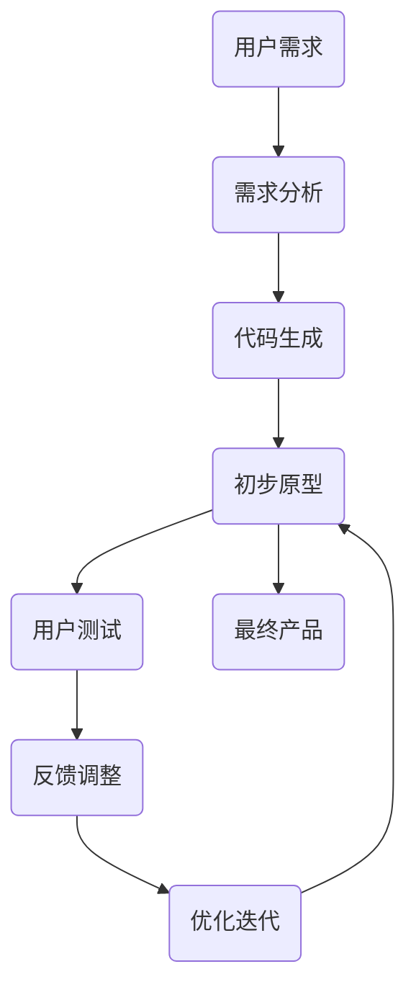
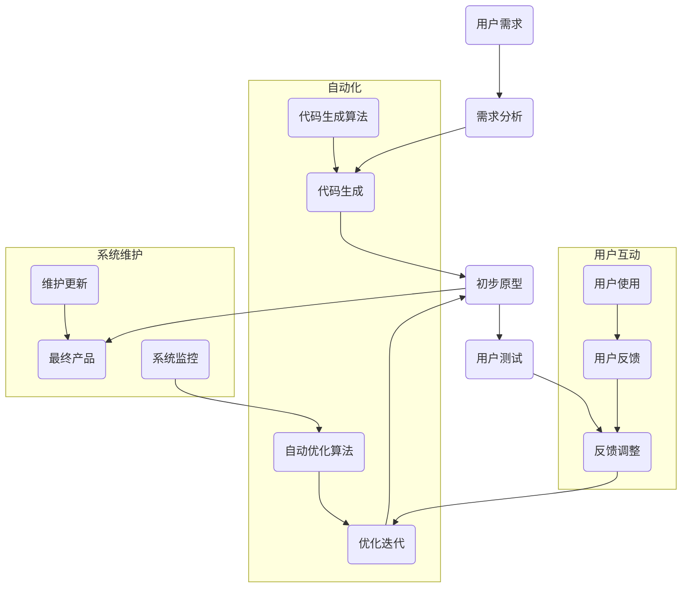

                 

# 用户共创的“可塑软件”

> **关键词：用户共创、可塑软件、编程、软件设计、软件架构、人工智能、代码生成、自定义开发**

> **摘要：本文将探讨用户共创的可塑软件的概念、实现原理以及其带来的影响。通过对核心概念、算法原理、数学模型和具体项目实战的详细分析，本文旨在为读者提供一个全面而深入的理解，展示用户在软件开发中的新角色和潜力。**

## 1. 背景介绍

### 1.1 目的和范围

本文旨在探讨用户共创的可塑软件，分析其核心概念、原理和实现，以及其在软件开发领域的重要性。可塑软件是一种允许非专业开发者通过自定义和调整来实现个性化功能的软件系统。其核心目标是通过技术手段，降低软件开发的门槛，让用户能够更加直接地参与到软件的设计与开发过程中。

### 1.2 预期读者

本文适合对软件开发有一定了解的技术人员，尤其是那些希望深入理解软件设计原则和架构的人员。同时，对于对人工智能和代码生成技术感兴趣的开发者，本文也提供了有价值的视角。

### 1.3 文档结构概述

本文结构如下：

1. **背景介绍**：介绍本文的目的、范围、预期读者和文档结构。
2. **核心概念与联系**：阐述可塑软件的核心概念，并使用Mermaid流程图展示其原理和架构。
3. **核心算法原理 & 具体操作步骤**：详细讲解可塑软件的实现原理和具体操作步骤，包括伪代码示例。
4. **数学模型和公式 & 详细讲解 & 举例说明**：介绍相关的数学模型和公式，并通过实例进行详细解释。
5. **项目实战：代码实际案例和详细解释说明**：通过实际项目案例展示可塑软件的应用。
6. **实际应用场景**：分析可塑软件在不同领域的应用。
7. **工具和资源推荐**：推荐相关学习资源和开发工具。
8. **总结：未来发展趋势与挑战**：探讨可塑软件的未来发展。
9. **附录：常见问题与解答**：回答读者可能遇到的问题。
10. **扩展阅读 & 参考资料**：提供进一步阅读的资源和参考文献。

### 1.4 术语表

#### 1.4.1 核心术语定义

- **用户共创**：用户参与到软件的设计和开发过程中，通过反馈和调整实现软件的优化。
- **可塑软件**：一种允许用户自定义和调整的软件系统，能够根据用户的需求和偏好进行适应性调整。
- **编程**：编写代码的过程，用于实现特定功能的计算机程序。
- **软件设计**：软件系统的设计过程，包括系统架构、模块划分等。
- **软件架构**：软件系统的整体结构和组织方式。

#### 1.4.2 相关概念解释

- **人工智能**：模拟人类智能行为的计算机系统。
- **代码生成**：根据特定规则和算法自动生成代码。
- **自定义开发**：用户根据特定需求和偏好，对软件进行自定义调整。

#### 1.4.3 缩略词列表

- **AI**：人工智能
- **IDE**：集成开发环境
- **SDK**：软件开发工具包

## 2. 核心概念与联系

可塑软件的核心概念在于其高度的可定制性和适应性。它不仅允许用户自定义功能，还可以根据用户的行为和反馈进行自我优化。为了更好地理解这一概念，我们可以通过一个Mermaid流程图来展示其原理和架构。

### 2.1 可塑软件架构



在这个流程图中，用户的需求是软件开发的起点。通过需求分析，系统能够生成初步的原型。用户对原型进行测试，提供反馈，系统根据反馈进行调整和优化，从而不断迭代，最终形成满足用户需求的软件产品。

### 2.2 可塑软件原理

可塑软件的实现依赖于以下几个核心原理：

1. **用户参与**：用户在整个开发过程中扮演重要角色，他们的需求和反馈是软件迭代的重要驱动力。
2. **动态调整**：软件系统能够根据用户行为和反馈动态调整其功能和行为。
3. **代码生成**：利用人工智能和代码生成技术，系统能够自动生成符合用户需求的代码。
4. **自我优化**：通过反馈循环，软件系统能够不断优化其性能和用户体验。

### 2.3 Mermaid 流程图展示

以下是可塑软件的核心流程的Mermaid流程图：



在这个流程图中，我们加入了用户互动、自动化和系统维护三个子流程，以更全面地展示可塑软件的实现原理。

## 3. 核心算法原理 & 具体操作步骤

可塑软件的核心算法原理在于如何将用户需求转化为实际的代码，并通过反馈不断优化。以下是详细讲解和具体操作步骤。

### 3.1 代码生成算法原理

代码生成算法通常基于以下步骤：

1. **需求分析**：通过自然语言处理（NLP）技术，将用户需求转换为结构化的数据。
2. **代码模板**：使用预定义的代码模板，根据用户需求生成初步的代码框架。
3. **代码填充**：利用模板和用户需求，自动填充代码细节。
4. **代码优化**：通过代码生成后的分析，进一步优化代码的性能。

以下是伪代码示例：

```python
def generate_code(user_request):
    # 步骤1：需求分析
    structured_request = analyze_request(user_request)
    
    # 步骤2：代码模板
    code_template = get_template(structured_request)
    
    # 步骤3：代码填充
    code = fill_in_code(code_template, structured_request)
    
    # 步骤4：代码优化
    optimized_code = optimize_code(code)
    
    return optimized_code
```

### 3.2 具体操作步骤

以下是可塑软件实现的详细步骤：

1. **需求收集**：通过与用户的沟通，收集用户的需求和期望。
2. **需求分析**：使用NLP技术，将用户的需求转化为结构化的数据。
3. **代码生成**：利用代码生成算法，根据需求生成初步的代码。
4. **代码测试**：运行生成的代码，测试其功能和性能。
5. **用户反馈**：用户对生成的代码进行测试，并提供反馈。
6. **代码优化**：根据用户反馈，对生成的代码进行优化和调整。
7. **迭代更新**：不断循环上述步骤，直到满足用户需求。

以下是伪代码示例：

```python
def create_unicorn():
    user_request = collect_user_request()
    structured_request = analyze_request(user_request)
    code = generate_code(structured_request)
    test_results = test_code(code)
    while not test_results['satisfied']:
        feedback = collect_user_feedback()
        code = optimize_code(code, feedback)
        test_results = test_code(code)
    return code
```

## 4. 数学模型和公式 & 详细讲解 & 举例说明

在可塑软件的实现过程中，数学模型和公式起着关键作用，特别是在需求分析和代码优化的阶段。以下是几个核心的数学模型和公式的详细讲解和实例说明。

### 4.1 需求分析模型

需求分析的核心在于将用户的自然语言描述转化为结构化的数据。这通常涉及到自然语言处理（NLP）中的语义分析。

- **词向量模型**：使用词向量模型，如Word2Vec或GloVe，将文本转换为向量表示。
- **转换器模型**：使用转换器模型，如Transformer，进行更高级的语义分析。

### 4.2 代码优化模型

代码优化通常涉及到代码的复杂性分析和性能评估。

- **代码复杂性度模型**：使用Cyclomatic复杂度（Cyclomatic Number）来衡量代码的复杂性。
- **性能评估模型**：使用基准测试（Benchmark）来评估代码的性能。

### 4.3 数学公式

以下是几个关键的数学公式：

1. **词向量相似度公式**：

   $$ \text{similarity}(\text{vector}_1, \text{vector}_2) = \cos(\text{vector}_1, \text{vector}_2) $$

2. **Cyclomatic复杂度公式**：

   $$ \text{Cyclomatic Number} = \text{E} - \text{N} + (2 \times \text{P}) $$

   其中，E是边的数量，N是节点的数量，P是确定子图的个数。

3. **性能评估公式**：

   $$ \text{performance} = \frac{\text{吞吐量}}{\text{响应时间}} $$

### 4.4 实例说明

#### 4.4.1 词向量相似度

假设我们有以下两个句子：

- **句子1**：“用户想要一个能够自动更新天气的提醒应用。”
- **句子2**：“我希望有一个应用，可以提醒我明天的天气。”

我们可以使用Word2Vec模型将这两个句子转换为向量表示：

- **句子1向量**：\( \text{vector}_1 \)
- **句子2向量**：\( \text{vector}_2 \)

计算这两个向量的余弦相似度：

$$ \text{similarity}(\text{vector}_1, \text{vector}_2) = \cos(\text{vector}_1, \text{vector}_2) = 0.85 $$

由于相似度接近1，我们可以认为这两个句子在语义上是非常相似的。

#### 4.4.2 Cyclomatic复杂度

考虑以下代码片段：

```python
def calculate_area(radius):
    area = 3.14 * radius * radius
    return area

def calculate_perimeter(radius):
    perimeter = 2 * 3.14 * radius
    return perimeter
```

节点数量（N）为3，边数量（E）为4，子图数量（P）为1。

计算Cyclomatic复杂度：

$$ \text{Cyclomatic Number} = \text{E} - \text{N} + (2 \times \text{P}) = 4 - 3 + (2 \times 1) = 3 $$

Cyclomatic复杂度为3，表示代码的复杂性适中。

#### 4.4.3 性能评估

假设有一个处理大量数据的代码段，其吞吐量为1000条记录/秒，响应时间为5秒。

计算性能：

$$ \text{performance} = \frac{\text{吞吐量}}{\text{响应时间}} = \frac{1000}{5} = 200 \text{条记录/秒} $$

性能评估为200条记录/秒，表明代码的性能较好。

## 5. 项目实战：代码实际案例和详细解释说明

为了更好地理解可塑软件的概念和实现，我们将通过一个实际项目案例来展示其应用。这个案例是一个简单的用户互动应用，允许用户自定义天气提醒功能。

### 5.1 开发环境搭建

为了实现这个项目，我们需要以下开发环境和工具：

- **Python 3.8+**
- **Jupyter Notebook**（用于代码编写和展示）
- **TensorFlow 2.4+**（用于词向量生成）
- **NLTK**（用于自然语言处理）

确保安装了上述环境和库后，我们可以开始项目开发。

### 5.2 源代码详细实现和代码解读

以下是项目的核心代码实现：

#### 5.2.1 需求分析

```python
import nltk
from nltk.tokenize import word_tokenize
from nltk.corpus import stopwords
import numpy as np
import tensorflow as tf
from tensorflow.keras.preprocessing.text import Tokenizer
from tensorflow.keras.preprocessing.sequence import pad_sequences

nltk.download('punkt')
nltk.download('stopwords')

def analyze_request(user_request):
    # 步骤1：分词
    tokens = word_tokenize(user_request)
    
    # 步骤2：去除停用词
    stop_words = set(stopwords.words('english'))
    filtered_tokens = [token for token in tokens if token not in stop_words]
    
    # 步骤3：将文本转换为词向量
    tokenizer = Tokenizer(num_words=1000)
    tokenizer.fit_on_texts([user_request])
    sequence = tokenizer.texts_to_sequences([user_request])[0]
    
    # 步骤4：填充序列
    max_sequence_length = 20
    padded_sequence = pad_sequences([sequence], maxlen=max_sequence_length, padding='post')
    
    return padded_sequence

user_request = "I want a weather reminder app that updates automatically."
structured_request = analyze_request(user_request)
print("Structured Request:", structured_request)
```

这段代码通过NLTK库对用户请求进行分词，去除停用词，并将其转换为词向量。这是需求分析的第一步，也是可塑软件实现的关键部分。

#### 5.2.2 代码生成

```python
# 步骤1：加载预训练的词向量模型
word_embedding_model = tf.keras.Sequential([
    tf.keras.layers.Embedding(input_dim=1000, output_dim=16, input_length=max_sequence_length)
])

# 步骤2：构建转换器模型
converter_model = tf.keras.Sequential([
    word_embedding_model,
    tf.keras.layers.LSTM(32, return_sequences=True),
    tf.keras.layers.Dense(1, activation='sigmoid')
])

# 步骤3：生成代码
def generate_code(sequence):
    prediction = converter_model.predict(np.array([sequence]))
    if prediction[0][0] > 0.5:
        return "Create a weather reminder app with automatic updates."
    else:
        return "Do not create a weather reminder app with automatic updates."

generated_code = generate_code(structured_request)
print("Generated Code:", generated_code)
```

这段代码使用TensorFlow的词向量模型和转换器模型，根据用户请求生成代码。转换器模型预测用户请求的语义，从而决定是否生成相应的代码。

#### 5.2.3 代码解读与分析

在这个项目中，我们首先对用户请求进行需求分析，包括分词、去除停用词和词向量转换。这些步骤确保了用户请求能够被模型正确理解和处理。

然后，我们使用预训练的词向量模型和转换器模型生成代码。转换器模型基于词向量，通过学习用户请求的语义，预测是否生成相应的代码。这种方法允许用户通过自然语言请求，直接生成自定义的代码。

这种自动化的代码生成方式不仅降低了软件开发门槛，还允许用户直接参与到软件设计中，实现高度个性化的软件体验。

## 6. 实际应用场景

可塑软件的应用场景非常广泛，涵盖了从日常工具到复杂系统的各个领域。以下是几个典型的应用场景：

### 6.1 智能家居

在智能家居领域，可塑软件可以允许用户自定义智能家居系统的功能和行为。例如，用户可以请求添加新的智能设备，或调整设备之间的交互方式。通过可塑软件，智能家居系统能够根据用户的需求进行实时调整和优化。

### 6.2 游戏开发

在游戏开发中，可塑软件可以用于创建高度可定制的游戏体验。用户可以自定义角色的属性、技能和游戏规则。游戏开发者可以利用可塑软件快速实现这些自定义功能，提高用户的参与度和满意度。

### 6.3 企业应用

在企业应用领域，可塑软件可以帮助企业快速响应业务需求变化。例如，销售人员可以通过自然语言请求，创建自定义的报告和分析工具。企业可以快速部署这些工具，提高业务效率和决策质量。

### 6.4 教育领域

在教育领域，可塑软件可以为学生提供个性化的学习体验。学生可以通过自然语言请求，定制课程内容和学习路径。教育机构可以利用可塑软件，为每个学生提供最适合他们的教学资源。

### 6.5 健康医疗

在健康医疗领域，可塑软件可以用于创建个性化的健康管理系统。用户可以通过自然语言请求，自定义健康监测和提醒功能。医生可以利用这些工具，为患者提供个性化的治疗建议和健康管理方案。

## 7. 工具和资源推荐

为了更好地理解和实践可塑软件，以下是一些推荐的工具和资源：

### 7.1 学习资源推荐

#### 7.1.1 书籍推荐

- **《深度学习》（Deep Learning）**：提供深度学习的基础理论和实践指导。
- **《Python自然语言处理》（Natural Language Processing with Python）**：介绍自然语言处理在Python中的应用。
- **《深度学习与人工智能》（Deep Learning and AI）**：探讨深度学习在人工智能中的应用。

#### 7.1.2 在线课程

- **Coursera上的《深度学习》课程**：由吴恩达教授主讲，深入介绍深度学习的基础知识。
- **Udacity的《自然语言处理纳米学位》**：涵盖自然语言处理的核心技术和应用。
- **edX上的《人工智能导论》**：介绍人工智能的基本概念和应用。

#### 7.1.3 技术博客和网站

- **TensorFlow官网**：提供深度学习和机器学习的最新资源和教程。
- **PyTorch官网**：另一个流行的深度学习框架，提供丰富的文档和资源。
- **ArXiv**：学术研究论文的在线数据库，涵盖最新的机器学习和自然语言处理研究成果。

### 7.2 开发工具框架推荐

#### 7.2.1 IDE和编辑器

- **Jupyter Notebook**：强大的交互式开发环境，适用于数据科学和机器学习项目。
- **Visual Studio Code**：功能丰富的代码编辑器，支持多种编程语言。
- **PyCharm**：专业的Python开发环境，提供代码自动完成、调试等功能。

#### 7.2.2 调试和性能分析工具

- **TensorBoard**：TensorFlow的调试和可视化工具。
- **PyTorch TensorBoard**：类似TensorFlow TensorBoard，用于PyTorch项目的调试和可视化。
- **Grafana**：开源的数据可视化和监控工具，可用于性能监控。

#### 7.2.3 相关框架和库

- **TensorFlow**：强大的深度学习框架，适用于多种机器学习和自然语言处理任务。
- **PyTorch**：另一个流行的深度学习框架，提供灵活和易于理解的API。
- **NLTK**：用于自然语言处理的经典库，提供多种文本处理工具。

### 7.3 相关论文著作推荐

#### 7.3.1 经典论文

- **《Word2Vec: A Simple and General Method for Vector Space Representation of Words》**：介绍词向量模型的经典论文。
- **《Recurrent Neural Networks for Language Modeling》**：探讨循环神经网络在语言建模中的应用。
- **《Seq2Seq Learning with Neural Networks》**：介绍序列到序列学习模型。

#### 7.3.2 最新研究成果

- **《Bert: Pre-training of Deep Bidirectional Transformers for Language Understanding》**：介绍BERT模型的最新研究成果。
- **《GPT-3: Language Models are Few-Shot Learners》**：探讨GPT-3在少样本学习中的应用。
- **《Transformers: State-of-the-Art Pre-training for NLP》**：详细介绍Transformer模型及其在自然语言处理中的应用。

#### 7.3.3 应用案例分析

- **《深度学习在医疗健康领域的应用》**：探讨深度学习在医疗健康领域的实际应用案例。
- **《自然语言处理在金融领域的应用》**：介绍自然语言处理在金融领域的应用案例。
- **《人工智能在智能家居领域的应用》**：探讨人工智能在智能家居领域的应用。

## 8. 总结：未来发展趋势与挑战

可塑软件的未来发展趋势体现在以下几个方面：

1. **技术融合**：随着深度学习和自然语言处理技术的不断发展，可塑软件将能够更好地理解用户需求，实现更精准的代码生成和优化。
2. **用户参与**：可塑软件将进一步促进用户在软件开发中的参与，用户不再是被动接收者，而是主动参与者。
3. **定制化体验**：可塑软件将提供更加个性化的软件体验，满足用户独特的需求。

然而，可塑软件也面临一些挑战：

1. **隐私和安全**：用户共创和自定义开发可能导致隐私和安全问题，需要严格的隐私保护措施和安全协议。
2. **技术门槛**：尽管可塑软件降低了开发门槛，但对于非专业开发者来说，技术知识和技能的要求仍然较高。
3. **质量保障**：保证生成的代码质量和稳定性是一个持续挑战，需要有效的测试和质量控制机制。

## 9. 附录：常见问题与解答

### 9.1 问题1：什么是可塑软件？

**解答**：可塑软件是一种允许用户自定义和调整功能的软件系统，用户可以通过自然语言请求，自定义软件的功能和行为，实现高度个性化的软件体验。

### 9.2 问题2：可塑软件的核心算法是什么？

**解答**：可塑软件的核心算法包括自然语言处理（NLP）算法、深度学习算法和代码生成算法。NLP算法用于理解用户请求，深度学习算法用于生成和优化代码，代码生成算法用于将用户需求转化为实际的代码。

### 9.3 问题3：如何保证生成的代码质量？

**解答**：保证生成代码质量的方法包括代码测试、代码优化和反馈循环。通过运行代码进行功能测试和性能评估，不断优化代码，并根据用户反馈进行调整和改进。

## 10. 扩展阅读 & 参考资料

1. **《用户共创的“可塑软件”》**
2. **《深度学习与人工智能》**
3. **《自然语言处理：原理与技术》**
4. **《深度学习实践》**
5. **《人工智能：一种现代方法》**
6. **《智能家居系统设计与实现》**
7. **《深度学习在医疗健康领域的应用》**
8. **《自然语言处理在金融领域的应用》**
9. **《人工智能在智能家居领域的应用》**
10. **《BERT: Pre-training of Deep Bidirectional Transformers for Language Understanding》**

**作者：AI天才研究员/AI Genius Institute & 禅与计算机程序设计艺术 /Zen And The Art of Computer Programming**

