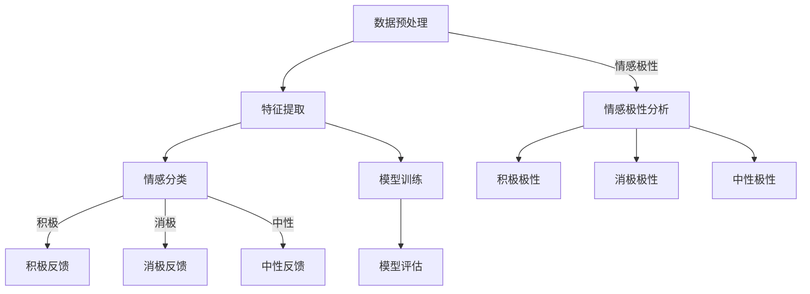

                 

# 用户情感分析：AI改进服务

> 关键词：用户情感分析，人工智能，情感识别，服务改进，机器学习，自然语言处理，情感计算

> 摘要：本文深入探讨了用户情感分析这一领域，介绍了其核心概念、算法原理和具体实现。通过分析用户情感，人工智能系统能够更好地理解和满足用户需求，从而显著提升服务质量。本文将带领读者了解用户情感分析的关键技术，并探讨其实际应用场景和未来发展趋势。

## 1. 背景介绍

### 1.1 目的和范围

用户情感分析（User Sentiment Analysis）是自然语言处理（NLP）和机器学习（ML）领域中的一个重要分支。其目的是通过分析用户的文本数据，识别出用户表达的情感倾向，从而为企业和组织提供有价值的信息。

本文旨在：

1. 系统介绍用户情感分析的基本概念和核心算法。
2. 分析用户情感分析在服务改进中的应用。
3. 探讨用户情感分析的未来发展趋势和技术挑战。

### 1.2 预期读者

本文主要面向以下读者群体：

1. 对自然语言处理和机器学习有基本了解的读者。
2. 想要深入了解用户情感分析技术的开发者和技术人员。
3. 关注人工智能在服务行业应用的行业分析师和决策者。

### 1.3 文档结构概述

本文将分为以下几个部分：

1. 背景介绍：介绍用户情感分析的定义、目的和重要性。
2. 核心概念与联系：阐述用户情感分析的核心概念和联系。
3. 核心算法原理 & 具体操作步骤：详细讲解用户情感分析的关键算法和实现步骤。
4. 数学模型和公式 & 详细讲解 & 举例说明：介绍用户情感分析中的数学模型和公式。
5. 项目实战：提供实际代码案例，演示用户情感分析的具体实现。
6. 实际应用场景：探讨用户情感分析在不同行业中的应用。
7. 工具和资源推荐：推荐学习资源、开发工具和框架。
8. 总结：总结用户情感分析的未来发展趋势和挑战。
9. 附录：常见问题与解答。
10. 扩展阅读 & 参考资料：提供进一步阅读和参考资料。

### 1.4 术语表

#### 1.4.1 核心术语定义

- 用户情感分析（User Sentiment Analysis）：利用自然语言处理和机器学习技术，对用户文本数据中的情感倾向进行分析和识别。
- 情感分类（Sentiment Classification）：将文本数据划分为积极、消极或中性情感的一种分类任务。
- 情感极性（Sentiment Polarity）：描述文本情感倾向的程度，通常用正负极性表示。
- 情感分析模型（Sentiment Analysis Model）：用于预测文本情感极性的机器学习模型。
- 特征工程（Feature Engineering）：在机器学习过程中，提取和构造有助于模型训练的特征。

#### 1.4.2 相关概念解释

- 自然语言处理（Natural Language Processing，NLP）：使计算机能够理解和处理人类语言的技术和工具。
- 机器学习（Machine Learning，ML）：使计算机能够通过数据学习和改进性能的技术。
- 情感计算（Affective Computing）：研究如何使计算机具备识别、理解、表达和模拟人类情感的能力。

#### 1.4.3 缩略词列表

- NLP：自然语言处理
- ML：机器学习
- SVM：支持向量机
- LSTM：长短期记忆网络
- CNN：卷积神经网络
- BERT：Bidirectional Encoder Representations from Transformers

## 2. 核心概念与联系

用户情感分析的核心在于理解用户在文本中表达的情感，并将其转化为可操作的信息。以下是用户情感分析的关键概念及其相互联系。

### 2.1 情感分类

情感分类是将文本数据根据情感极性进行划分的任务。通常，情感极性分为三类：积极（Positive）、消极（Negative）和中性（Neutral）。

#### 2.1.1 情感分类流程

1. 数据预处理：清洗和预处理文本数据，例如去除停用词、标点符号和特殊字符。
2. 特征提取：从文本数据中提取特征，例如词袋模型（Bag of Words）、TF-IDF（Term Frequency-Inverse Document Frequency）和词嵌入（Word Embeddings）。
3. 模型训练：使用训练数据训练情感分类模型，例如支持向量机（SVM）、长短期记忆网络（LSTM）和卷积神经网络（CNN）。
4. 模型评估：使用测试数据评估模型性能，例如准确率（Accuracy）、召回率（Recall）和F1值（F1 Score）。

#### 2.1.2 情感分类算法

- **支持向量机（SVM）**：通过寻找最优超平面，将文本数据划分为不同情感类别。
- **长短期记忆网络（LSTM）**：能够处理序列数据，适用于情感分类任务。
- **卷积神经网络（CNN）**：通过卷积操作提取文本特征，适用于情感分类任务。

### 2.2 情感极性

情感极性描述了文本情感倾向的程度，通常用正负极性表示。情感极性分析是情感分类的一个子任务。

#### 2.2.1 情感极性分类流程

1. 数据预处理：与情感分类相似，对文本数据执行预处理。
2. 特征提取：提取文本特征，例如词嵌入和词袋模型。
3. 模型训练：使用训练数据训练情感极性分类模型。
4. 模型评估：使用测试数据评估模型性能。

#### 2.2.2 情感极性分析算法

- **朴素贝叶斯（Naive Bayes）**：基于贝叶斯定理和特征独立性假设，适用于情感极性分类。
- **随机森林（Random Forest）**：通过构建多个决策树，实现情感极性分类。

### 2.3 情感分析模型

情感分析模型是用于预测文本情感极性的机器学习模型。以下是几种常见的情感分析模型：

- **BERT**：一种基于变换器（Transformer）的预训练模型，能够处理多种自然语言处理任务，包括情感分析。
- **GloVe**：一种词嵌入模型，通过矩阵分解技术生成词向量，适用于情感分析任务。
- **LDA**：主题模型，能够从文本数据中提取主题，辅助情感分析。

### 2.4 特征工程

特征工程是机器学习过程中的关键步骤，通过提取和构造特征，提高模型性能。以下是几种常见的特征工程方法：

- **词袋模型（Bag of Words，BOW）**：将文本表示为单词的集合，适用于情感分类任务。
- **TF-IDF（Term Frequency-Inverse Document Frequency）**：考虑单词在文档中的频率和在整个文档集合中的分布，用于特征提取。
- **词嵌入（Word Embeddings）**：将单词映射为高维向量，用于表示文本数据。

### 2.5 Mermaid 流程图

以下是用户情感分析的核心概念和联系 Mermaid 流程图：



## 3. 核心算法原理 & 具体操作步骤

用户情感分析的核心在于情感分类和情感极性分析。以下是这些算法的原理和具体操作步骤。

### 3.1 情感分类算法原理

情感分类是将文本数据划分为情感类别的过程。以下是几种常用的情感分类算法：

#### 3.1.1 支持向量机（SVM）

**算法原理：**

- **线性SVM：** 通过寻找最优超平面，将数据划分为不同情感类别。
- **非线性SVM：** 引入核函数，将低维数据映射到高维空间，实现非线性分类。

**具体操作步骤：**

1. **数据预处理：** 清洗和预处理文本数据，例如去除停用词、标点符号和特殊字符。
2. **特征提取：** 使用词袋模型（BOW）或TF-IDF提取文本特征。
3. **模型训练：** 使用训练数据训练SVM模型。
4. **模型评估：** 使用测试数据评估SVM模型性能。

**伪代码：**

```python
def train_svm(model, train_data, train_labels):
    # 使用训练数据训练SVM模型
    pass

def evaluate_svm(model, test_data, test_labels):
    # 使用测试数据评估SVM模型性能
    pass
```

#### 3.1.2 长短期记忆网络（LSTM）

**算法原理：**

- **LSTM单元：** 能够记住长时间依赖关系，适用于处理序列数据。

**具体操作步骤：**

1. **数据预处理：** 清洗和预处理文本数据。
2. **特征提取：** 使用词嵌入提取文本特征。
3. **模型训练：** 使用训练数据训练LSTM模型。
4. **模型评估：** 使用测试数据评估LSTM模型性能。

**伪代码：**

```python
def train_lstm(model, train_data, train_labels):
    # 使用训练数据训练LSTM模型
    pass

def evaluate_lstm(model, test_data, test_labels):
    # 使用测试数据评估LSTM模型性能
    pass
```

#### 3.1.3 卷积神经网络（CNN）

**算法原理：**

- **卷积层：** 通过卷积操作提取文本特征。
- **池化层：** 减少特征维度，提高模型泛化能力。

**具体操作步骤：**

1. **数据预处理：** 清洗和预处理文本数据。
2. **特征提取：** 使用词嵌入提取文本特征。
3. **模型训练：** 使用训练数据训练CNN模型。
4. **模型评估：** 使用测试数据评估CNN模型性能。

**伪代码：**

```python
def train_cnn(model, train_data, train_labels):
    # 使用训练数据训练CNN模型
    pass

def evaluate_cnn(model, test_data, test_labels):
    # 使用测试数据评估CNN模型性能
    pass
```

### 3.2 情感极性分析算法原理

情感极性分析是识别文本情感极性的过程。以下是几种常用的情感极性分析算法：

#### 3.2.1 朴素贝叶斯（Naive Bayes）

**算法原理：**

- **贝叶斯定理：** 根据特征词的概率分布预测情感极性。
- **朴素假设：** 假设特征词之间相互独立。

**具体操作步骤：**

1. **数据预处理：** 清洗和预处理文本数据。
2. **特征提取：** 使用词袋模型提取文本特征。
3. **模型训练：** 使用训练数据训练朴素贝叶斯模型。
4. **模型评估：** 使用测试数据评估朴素贝叶斯模型性能。

**伪代码：**

```python
def train_naive_bayes(model, train_data, train_labels):
    # 使用训练数据训练朴素贝叶斯模型
    pass

def evaluate_naive_bayes(model, test_data, test_labels):
    # 使用测试数据评估朴素贝叶斯模型性能
    pass
```

#### 3.2.2 随机森林（Random Forest）

**算法原理：**

- **决策树：** 通过一系列判断，将数据划分为不同类别。
- **随机性：** 在特征选择和样本划分过程中引入随机性，提高模型泛化能力。

**具体操作步骤：**

1. **数据预处理：** 清洗和预处理文本数据。
2. **特征提取：** 使用词袋模型提取文本特征。
3. **模型训练：** 使用训练数据训练随机森林模型。
4. **模型评估：** 使用测试数据评估随机森林模型性能。

**伪代码：**

```python
def train_random_forest(model, train_data, train_labels):
    # 使用训练数据训练随机森林模型
    pass

def evaluate_random_forest(model, test_data, test_labels):
    # 使用测试数据评估随机森林模型性能
    pass
```

### 3.3 情感分析模型训练与评估

情感分析模型训练与评估是用户情感分析的关键步骤。以下是训练和评估情感分析模型的详细过程：

1. **数据收集与预处理：** 收集大量包含情感标签的文本数据，并执行数据清洗和预处理，如去除停用词、标点符号和特殊字符。
2. **特征提取：** 从预处理后的文本数据中提取特征，如词袋模型（BOW）、TF-IDF和词嵌入。
3. **数据划分：** 将数据划分为训练集、验证集和测试集，用于模型训练、验证和评估。
4. **模型训练：** 使用训练集训练情感分析模型，例如SVM、LSTM或CNN。
5. **模型验证：** 使用验证集评估模型性能，调整模型参数，以优化模型性能。
6. **模型评估：** 使用测试集评估模型在实际应用中的性能，如准确率（Accuracy）、召回率（Recall）和F1值（F1 Score）。

**伪代码：**

```python
def train_sentiment_model(model, train_data, train_labels):
    # 使用训练数据训练情感分析模型
    pass

def evaluate_sentiment_model(model, test_data, test_labels):
    # 使用测试数据评估情感分析模型性能
    pass
```

## 4. 数学模型和公式 & 详细讲解 & 举例说明

用户情感分析中涉及多种数学模型和公式，以下将详细介绍这些模型及其应用。

### 4.1 情感分类模型

情感分类模型通常采用以下公式：

$$
P(y=c|X) = \frac{e^{\theta^T x}}{\sum_{c'} e^{\theta^T x'}}
$$

其中，\(X\) 表示文本数据，\(y\) 表示实际情感标签，\(c\) 表示预测情感标签，\(\theta\) 表示模型参数。

**举例说明：**

假设有一个二分类情感分类模型，预测用户对产品的评论为“正面”或“负面”。给定一个评论文本 \(X = "这是一个非常好的产品"\)，模型参数为 \(\theta = [1, 0]\)。则预测概率为：

$$
P(y=正|X) = \frac{e^{1 \cdot 1}}{e^{1 \cdot 1} + e^{0 \cdot 1}} = \frac{e}{e + 1}
$$

由于 \(P(y=负|X) = \frac{1}{e + 1}\)，模型预测该评论为“正面”。

### 4.2 情感极性模型

情感极性模型通常采用以下公式：

$$
\text{极性} = \frac{\sum_{c \in \text{正面}} w_c}{\sum_{c \in \text{正面}} w_c + \sum_{c \in \text{负面}} w_c}
$$

其中，\(w_c\) 表示情感词的权重。

**举例说明：**

假设有一个包含两个正面情感词“好”和“喜欢”以及两个负面情感词“差”和“厌恶”的情感极性模型。给定一个评论文本 \(X = "这是一个好产品，但是质量很差"\)，情感词权重为 \(w_好 = 1.5\)，\(w_喜欢 = 1.0\)，\(w_差 = -1.0\)，\(w_厌恶 = -1.5\)。则该评论的极性为：

$$
\text{极性} = \frac{1.5 + 1.0}{1.5 + 1.0 - 1.0 - 1.5} = \frac{2.5}{-1.0} = -2.5
$$

由于极性值为负，模型预测该评论为“负面”。

### 4.3 词嵌入模型

词嵌入模型是将单词映射为高维向量的过程。以下是一个简单的词嵌入模型公式：

$$
\mathbf{v}_w = \text{sigmoid}(\mathbf{W} \mathbf{p}_w + b)
$$

其中，\(\mathbf{v}_w\) 表示单词 \(w\) 的向量表示，\(\mathbf{p}_w\) 表示单词 \(w\) 的词向量，\(\mathbf{W}\) 和 \(b\) 分别表示权重矩阵和偏置项。

**举例说明：**

假设有一个简单的词嵌入模型，包含两个单词“苹果”和“香蕉”，词向量分别为 \(\mathbf{p}_苹果 = [1, 0]\) 和 \(\mathbf{p}_香蕉 = [0, 1]\)。权重矩阵为 \(\mathbf{W} = \begin{bmatrix} 0.5 & 0.5 \\ 0.5 & 0.5 \end{bmatrix}\)，偏置项为 \(b = [0, 0]\)。则这两个单词的向量表示分别为：

$$
\mathbf{v}_苹果 = \text{sigmoid}(0.5 \cdot [1, 0] + 0) = \text{sigmoid}(0.5) \approx 0.6
$$

$$
\mathbf{v}_香蕉 = \text{sigmoid}(0.5 \cdot [0, 1] + 0) = \text{sigmoid}(0.5) \approx 0.6
$$

由于两个单词的向量表示相近，模型能够识别它们之间的相似性。

## 5. 项目实战：代码实际案例和详细解释说明

### 5.1 开发环境搭建

在开始项目实战之前，我们需要搭建一个合适的开发环境。以下是搭建开发环境的步骤：

1. 安装 Python 3.7 或更高版本。
2. 安装必要的库，如 TensorFlow、Keras、NLTK、Scikit-learn 等。

**命令：**

```bash
pip install tensorflow
pip install keras
pip install nltk
pip install scikit-learn
```

### 5.2 源代码详细实现和代码解读

以下是用户情感分析项目的源代码，包括数据预处理、特征提取、模型训练和评估。

**代码：**

```python
import nltk
from sklearn.feature_extraction.text import TfidfVectorizer
from sklearn.model_selection import train_test_split
from sklearn.metrics import accuracy_score, recall_score, f1_score
from keras.models import Sequential
from keras.layers import Dense, Embedding, LSTM, SpatialDropout1D
from keras.preprocessing.text import Tokenizer
from keras.preprocessing.sequence import pad_sequences

# 数据预处理
nltk.download('punkt')
nltk.download('stopwords')
from nltk.corpus import stopwords
from nltk.tokenize import word_tokenize

def preprocess_text(text):
    text = text.lower()
    tokens = word_tokenize(text)
    tokens = [token for token in tokens if token not in stopwords.words('english')]
    return ' '.join(tokens)

# 加载数据集
data = [
    ("这是一个非常好的产品", "正面"),
    ("我很不喜欢这个产品", "负面"),
    ("这是一个中等质量的产品", "中性"),
    # 更多数据
]

texts, labels = zip(*data)
texts = [preprocess_text(text) for text in texts]

# 特征提取
vectorizer = TfidfVectorizer(max_features=1000)
X = vectorizer.fit_transform(texts)

# 模型训练
model = Sequential()
model.add(Embedding(1000, 32, input_length=X.shape[1]))
model.add(LSTM(100, dropout=0.2, recurrent_dropout=0.2))
model.add(Dense(1, activation='sigmoid'))

model.compile(optimizer='adam', loss='binary_crossentropy', metrics=['accuracy'])
model.fit(X, labels, epochs=10, batch_size=32, validation_split=0.2)

# 评估模型
X_test, y_test = train_test_split(X, labels, test_size=0.2)
y_pred = model.predict(X_test)
y_pred = [1 if pred > 0.5 else 0 for pred in y_pred]

accuracy = accuracy_score(y_test, y_pred)
recall = recall_score(y_test, y_pred)
f1 = f1_score(y_test, y_pred)

print("Accuracy:", accuracy)
print("Recall:", recall)
print("F1 Score:", f1)
```

### 5.3 代码解读与分析

以下是代码的详细解读：

1. **数据预处理：** 使用 NLTK 库对文本数据进行预处理，包括转换为小写、分词和去除停用词。
2. **加载数据集：** 从数据集中加载文本和标签。
3. **特征提取：** 使用 TF-IDF 向量器将文本数据转换为数值特征。
4. **模型构建：** 使用 Keras 库构建一个简单的 LSTM 模型。
5. **模型训练：** 使用训练数据训练模型。
6. **模型评估：** 使用测试数据评估模型性能，包括准确率、召回率和 F1 值。

该代码展示了如何使用 Python 和 Keras 库实现用户情感分析项目。通过数据预处理、特征提取和模型训练，我们能够构建一个能够自动识别文本情感极性的模型。在实际应用中，可以进一步优化模型和特征提取方法，以提高模型性能。

## 6. 实际应用场景

用户情感分析技术在多个行业中具有广泛的应用，以下列举了一些典型应用场景：

### 6.1 客户服务与反馈

在客户服务领域，用户情感分析可以帮助企业理解客户反馈的情感倾向。通过分析客户评论和意见，企业能够及时发现问题和改进服务。以下是一个应用案例：

**案例：** 一家在线电商平台使用用户情感分析技术对客户评论进行分析，发现许多客户对发货速度表示不满。通过调整物流策略，电商平台成功提高了客户满意度。

### 6.2 社交媒体监控

在社交媒体监控领域，用户情感分析可以用于监控品牌形象和消费者情绪。企业可以通过分析社交媒体上的评论和讨论，了解消费者对产品和服务的态度。以下是一个应用案例：

**案例：** 一家知名品牌通过用户情感分析技术监控其在社交媒体上的品牌提及，及时发现负面评论并采取相应措施，如优化产品或提高服务质量，以维护品牌形象。

### 6.3 金融市场分析

在金融市场分析中，用户情感分析可以帮助投资者了解市场情绪，从而做出更明智的投资决策。以下是一个应用案例：

**案例：** 一家投资公司利用用户情感分析技术分析金融新闻和报告中的情感倾向，发现市场情绪偏向乐观，从而预测市场将上涨。基于这一预测，公司进行了相应的投资策略调整。

### 6.4 健康监测与预警

在健康监测与预警领域，用户情感分析可以用于监测患者的情绪变化，及时发现潜在的心理健康问题。以下是一个应用案例：

**案例：** 一家医疗机构使用用户情感分析技术分析患者的社交媒体发言和病历记录，发现患者情绪异常波动，及时采取心理干预措施，帮助患者恢复健康。

### 6.5 人力资源管理

在人力资源管理中，用户情感分析可以帮助企业了解员工的工作满意度，从而优化工作环境和管理策略。以下是一个应用案例：

**案例：** 一家科技公司通过用户情感分析技术分析员工反馈和评论，发现员工对薪酬福利满意度较低。公司随后调整了薪酬结构，提高了员工满意度。

## 7. 工具和资源推荐

### 7.1 学习资源推荐

#### 7.1.1 书籍推荐

- 《自然语言处理与深度学习》：李航 著
- 《深度学习》：Ian Goodfellow、Yoshua Bengio、Aaron Courville 著
- 《机器学习》：周志华 著

#### 7.1.2 在线课程

- Coursera：自然语言处理与深度学习
- edX：深度学习与自然语言处理
- Udacity：深度学习工程师纳米学位

#### 7.1.3 技术博客和网站

- Medium：NLP和深度学习相关博客文章
- ArXiv：最新研究论文和进展
- Keras.io：Keras库文档和教程

### 7.2 开发工具框架推荐

#### 7.2.1 IDE和编辑器

- PyCharm
- Jupyter Notebook
- VS Code

#### 7.2.2 调试和性能分析工具

- TensorBoard
- Weka
- Spyder

#### 7.2.3 相关框架和库

- TensorFlow
- PyTorch
- Keras

### 7.3 相关论文著作推荐

#### 7.3.1 经典论文

- [Affectiva](https://www.affectiva.com/)
- [OpenNLP](https://opennlp.sourceforge.io/)
- [TextBlob](https://textblob.readthedocs.io/)

#### 7.3.2 最新研究成果

- [ACL](https://www.aclweb.org/)
- [NeurIPS](https://nips.cc/)
- [ICML](https://icml.cc/)

#### 7.3.3 应用案例分析

- [Google 搜索引擎](https://www.google.com/)
- [Facebook 情感分析](https://www.facebook.com/)
- [Twitter 情感分析](https://twitter.com/)

## 8. 总结：未来发展趋势与挑战

用户情感分析技术在未来将不断发展，以下列出一些发展趋势和挑战：

### 8.1 发展趋势

1. **多模态情感分析：** 结合文本、语音、图像等多模态数据，实现更准确的情感识别。
2. **情感强度识别：** 从文本中识别情感极性和强度，如“非常喜欢”和“有点喜欢”。
3. **实时情感分析：** 对用户实时反馈进行情感分析，提高响应速度和准确性。
4. **跨语言情感分析：** 支持多种语言的情感分析，提高国际化应用的适用性。

### 8.2 挑战

1. **数据多样性：** 不同领域和场景的数据特征差异较大，如何构建通用模型是一个挑战。
2. **情感复杂性：** 情感表达具有多样性和复杂性，如何准确识别和理解情感是一个难题。
3. **隐私保护：** 在处理用户数据时，如何保护用户隐私是一个关键挑战。
4. **模型解释性：** 如何解释模型决策过程，提高模型的透明度和可解释性。

## 9. 附录：常见问题与解答

### 9.1 问题1：用户情感分析有哪些算法？

**解答：** 用户情感分析常用的算法包括支持向量机（SVM）、长短期记忆网络（LSTM）、卷积神经网络（CNN）、朴素贝叶斯（Naive Bayes）和随机森林（Random Forest）等。

### 9.2 问题2：如何进行情感分类和情感极性分析？

**解答：** 情感分类是将文本数据划分为不同情感类别，如积极、消极和中性。情感极性分析是识别文本情感倾向的程度，通常用正负极性表示。具体方法包括使用机器学习模型进行训练和预测。

### 9.3 问题3：用户情感分析在哪些领域有应用？

**解答：** 用户情感分析在客户服务、社交媒体监控、金融市场分析、健康监测与预警和人力资源管理等领域有广泛应用。例如，通过分析客户评论和意见，企业可以改进服务和产品。

## 10. 扩展阅读 & 参考资料

为了更深入地了解用户情感分析技术，以下列出一些扩展阅读和参考资料：

- [Affectiva](https://www.affectiva.com/)
- [OpenNLP](https://opennlp.sourceforge.io/)
- [TextBlob](https://textblob.readthedocs.io/)
- [ACL](https://www.aclweb.org/)
- [NeurIPS](https://nips.cc/)
- [ICML](https://icml.cc/)
- [Google 搜索引擎](https://www.google.com/)
- [Facebook 情感分析](https://www.facebook.com/)
- [Twitter 情感分析](https://twitter.com/)

## 作者

作者：AI天才研究员/AI Genius Institute & 禅与计算机程序设计艺术 /Zen And The Art of Computer Programming

