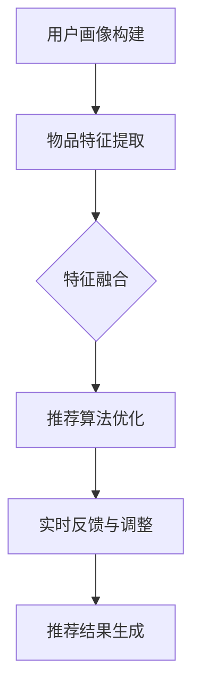

                 

# 用户画像与推荐系统的协同工作

> **关键词**：用户画像、推荐系统、协同工作、数据挖掘、机器学习、算法原理、应用场景

> **摘要**：本文旨在探讨用户画像与推荐系统的协同工作原理和实际应用。首先，我们将介绍用户画像和推荐系统的基本概念，随后深入剖析其协同工作的机制和核心算法。接下来，通过数学模型和具体案例，我们将展示如何实现这一协同工作。最后，我们将探讨实际应用场景，推荐相关工具和资源，并展望未来发展趋势与挑战。

## 1. 背景介绍

### 1.1 目的和范围

本文的主要目的是深入探讨用户画像与推荐系统的协同工作原理和实际应用，帮助读者理解这两大技术在现代信息技术领域的重要性。我们将在文中详细阐述用户画像的构建方法，推荐系统的核心算法原理，以及它们如何相互协同工作以提供精准、高效的个性化推荐。

### 1.2 预期读者

本文适合以下读者群体：

- 想深入了解用户画像和推荐系统原理的技术人员；
- 数据分析师、数据挖掘工程师和机器学习工程师；
- 意欲将用户画像和推荐系统应用于实际项目的项目经理和产品经理；
- 对人工智能和大数据技术感兴趣的学术研究人员和学生。

### 1.3 文档结构概述

本文将按照以下结构展开：

- **第1章** 背景介绍：介绍本文的目的、范围、预期读者以及文档结构；
- **第2章** 核心概念与联系：讲解用户画像和推荐系统的基本概念及相互关系，并附流程图；
- **第3章** 核心算法原理 & 具体操作步骤：详细阐述核心算法的原理和具体操作步骤，使用伪代码说明；
- **第4章** 数学模型和公式 & 详细讲解 & 举例说明：介绍数学模型和公式，并通过实例进行详细讲解；
- **第5章** 项目实战：代码实际案例和详细解释说明：展示代码实现和详细解读；
- **第6章** 实际应用场景：探讨用户画像和推荐系统的实际应用场景；
- **第7章** 工具和资源推荐：推荐相关学习资源、开发工具和最新研究成果；
- **第8章** 总结：未来发展趋势与挑战：总结本文内容，展望未来发展趋势与挑战；
- **第9章** 附录：常见问题与解答：回答读者可能遇到的常见问题；
- **第10章** 扩展阅读 & 参考资料：提供进一步学习和研究的资料。

### 1.4 术语表

#### 1.4.1 核心术语定义

- 用户画像：通过收集和分析用户的历史行为数据、兴趣偏好等，构建的用户特征模型；
- 推荐系统：基于用户画像和物品特征，为用户推荐其可能感兴趣的内容或物品的系统；
- 数据挖掘：从大量数据中发现有价值的信息和知识的过程；
- 机器学习：一种让计算机通过数据学习和改进的方法，常用于构建推荐系统；
- 算法原理：推荐系统中的核心算法设计原理，如协同过滤、基于内容的推荐等；
- 个性化推荐：根据用户画像和物品特征，为用户推荐个性化内容或物品。

#### 1.4.2 相关概念解释

- **协同工作**：用户画像和推荐系统之间的相互作用和相互促进，共同提升推荐效果；
- **个性化推荐**：根据用户的兴趣和行为，为用户推荐个性化的内容或物品；
- **协同过滤**：基于用户行为和物品评价的推荐算法，分为用户基于协同过滤和物品基于协同过滤；
- **基于内容的推荐**：根据物品的内容特征，为用户推荐与其兴趣相关的物品。

#### 1.4.3 缩略词列表

- **AI**：人工智能（Artificial Intelligence）
- **ML**：机器学习（Machine Learning）
- **DM**：数据挖掘（Data Mining）
- **CF**：协同过滤（Collaborative Filtering）
- **C&B**：基于内容的推荐（Content-Based Recommendation）

## 2. 核心概念与联系

### 2.1 用户画像

用户画像是一种通过数据分析构建的用户特征模型，用于描述用户在特定情境下的行为、兴趣、需求和偏好等信息。用户画像的构建过程主要包括以下步骤：

1. **数据收集**：收集用户的历史行为数据，如浏览记录、购买记录、评价记录等；
2. **数据预处理**：对原始数据进行清洗、去噪、格式转换等处理，确保数据质量和一致性；
3. **特征提取**：从预处理后的数据中提取用户特征，如用户ID、性别、年龄、地理位置、兴趣标签等；
4. **特征建模**：使用机器学习算法或统计方法，将提取的用户特征转化为用户画像模型。

用户画像的目的是为推荐系统提供用户特征信息，帮助系统更好地理解用户，从而实现精准的个性化推荐。

### 2.2 推荐系统

推荐系统是一种基于用户画像和物品特征，为用户推荐其可能感兴趣的内容或物品的智能系统。推荐系统的核心组成部分包括：

1. **用户画像**：为推荐系统提供用户特征信息，用于分析用户兴趣和需求；
2. **物品特征**：描述物品的内容特征，如标题、描述、标签、分类等；
3. **推荐算法**：根据用户画像和物品特征，计算用户对物品的兴趣度，为用户推荐感兴趣的内容或物品。

推荐系统的基本工作流程如下：

1. **用户画像构建**：通过数据挖掘和机器学习算法，构建用户的特征模型；
2. **物品特征提取**：提取物品的内容特征，用于描述物品的属性和特点；
3. **推荐算法选择**：根据业务需求和数据特点，选择合适的推荐算法；
4. **兴趣度计算**：计算用户对物品的兴趣度，使用评分、点击率、转化率等指标；
5. **推荐结果生成**：根据兴趣度排序，为用户生成个性化推荐列表。

### 2.3 用户画像与推荐系统的协同工作

用户画像和推荐系统之间的协同工作是指两者相互配合，共同提升推荐效果的过程。协同工作的核心原理包括：

1. **用户特征融合**：将用户画像中的用户特征与物品特征进行融合，构建更全面的用户兴趣模型；
2. **推荐算法优化**：基于用户画像和物品特征，优化推荐算法，提高推荐精度和用户体验；
3. **实时反馈与调整**：根据用户反馈和系统效果，实时调整用户画像和推荐策略，实现动态优化。

具体实现流程如下：

1. **用户画像构建**：收集用户行为数据，构建用户特征模型；
2. **物品特征提取**：提取物品内容特征，构建物品特征库；
3. **特征融合**：将用户特征与物品特征进行融合，构建用户兴趣模型；
4. **推荐算法优化**：根据用户兴趣模型，优化推荐算法，提高推荐效果；
5. **实时反馈与调整**：根据用户反馈和系统效果，调整用户画像和推荐策略。

通过用户画像与推荐系统的协同工作，可以实现以下效果：

- **提高推荐精度**：基于用户画像和物品特征，实现更精准的个性化推荐；
- **提升用户体验**：根据用户反馈，实时调整推荐策略，提升用户满意度；
- **降低推荐冷启动问题**：通过用户画像和特征融合，降低新用户和新物品的推荐难度。

### 2.4 Mermaid 流程图

以下是一个简单的Mermaid流程图，展示了用户画像与推荐系统的协同工作过程：



## 3. 核心算法原理 & 具体操作步骤

### 3.1 用户画像构建算法原理

用户画像构建算法主要基于数据挖掘和机器学习技术，通过对用户行为数据的分析和建模，提取用户特征，构建用户特征模型。以下是用户画像构建的基本算法原理：

#### 3.1.1 数据收集

收集用户行为数据，如浏览记录、购买记录、评价记录等。这些数据可以从网站日志、数据库、第三方数据接口等渠道获取。

#### 3.1.2 数据预处理

对原始数据进行清洗、去噪、格式转换等预处理操作，确保数据质量和一致性。具体步骤包括：

- **数据清洗**：去除重复、错误或无效的数据记录；
- **数据去噪**：去除噪声数据，如空值、异常值等；
- **格式转换**：统一数据格式，如日期格式、数值范围等。

#### 3.1.3 特征提取

从预处理后的数据中提取用户特征，如用户ID、性别、年龄、地理位置、兴趣标签等。特征提取方法包括：

- **统计特征**：基于数据统计方法提取用户特征，如平均浏览时长、购买频率等；
- **机器学习特征**：使用机器学习算法提取用户特征，如聚类、分类等。

#### 3.1.4 特征建模

使用机器学习算法或统计方法，将提取的用户特征转化为用户画像模型。常见的方法包括：

- **基于规则的建模**：通过规则引擎，将用户特征映射到用户画像模型；
- **基于机器学习的建模**：使用决策树、支持向量机、神经网络等机器学习算法，构建用户画像模型。

### 3.2 推荐算法原理

推荐算法是基于用户画像和物品特征，计算用户对物品的兴趣度，为用户推荐感兴趣的内容或物品。以下是常见推荐算法的原理：

#### 3.2.1 基于协同过滤的推荐算法

协同过滤（Collaborative Filtering）是一种基于用户行为和物品评价的推荐算法，分为用户基于协同过滤和物品基于协同过滤。

- **用户基于协同过滤**：根据用户对相似物品的评价，预测用户对未知物品的评价。具体步骤如下：

  1. **计算用户相似度**：计算用户之间的相似度，如余弦相似度、皮尔逊相关系数等；
  2. **用户兴趣预测**：根据用户相似度，预测用户对未知物品的兴趣度；
  3. **推荐结果生成**：根据预测的兴趣度，为用户生成个性化推荐列表。

- **物品基于协同过滤**：根据物品之间的相似度，预测用户对未知物品的评价。具体步骤如下：

  1. **计算物品相似度**：计算物品之间的相似度，如基于内容的相似度、基于标签的相似度等；
  2. **用户兴趣预测**：根据物品相似度，预测用户对未知物品的兴趣度；
  3. **推荐结果生成**：根据预测的兴趣度，为用户生成个性化推荐列表。

#### 3.2.2 基于内容的推荐算法

基于内容的推荐（Content-Based Recommendation）是一种根据物品的内容特征，为用户推荐与其兴趣相关的物品的推荐算法。具体步骤如下：

1. **物品特征提取**：提取物品的内容特征，如标题、描述、标签、分类等；
2. **用户兴趣模型构建**：根据用户的历史行为数据，构建用户兴趣模型；
3. **兴趣度计算**：计算用户对物品的兴趣度，如基于余弦相似度、基于文本匹配等；
4. **推荐结果生成**：根据兴趣度，为用户生成个性化推荐列表。

### 3.3 具体操作步骤

以下是一个简化的用户画像与推荐系统协同工作的具体操作步骤，使用伪代码进行描述：

```python
# 用户画像构建
def build_user_profile(user_data):
    """
    构建用户画像
    :param user_data: 用户行为数据
    :return: 用户画像
    """
    # 数据预处理
    preprocessed_data = preprocess_data(user_data)
    
    # 特征提取
    user_features = extract_features(preprocessed_data)
    
    # 特征建模
    user_profile = build_model(user_features)
    
    return user_profile

# 推荐算法
def recommend_items(user_profile, item_features):
    """
    为用户推荐物品
    :param user_profile: 用户画像
    :param item_features: 物品特征
    :return: 推荐列表
    """
    # 计算兴趣度
    interest_scores = calculate_interest(user_profile, item_features)
    
    # 排序和生成推荐列表
    recommendation_list = generate_recommendation_list(interest_scores)
    
    return recommendation_list

# 主函数
def main():
    # 收集用户数据
    user_data = collect_user_data()
    
    # 构建用户画像
    user_profile = build_user_profile(user_data)
    
    # 收集物品数据
    item_data = collect_item_data()
    
    # 构建物品特征
    item_features = build_item_features(item_data)
    
    # 为用户推荐物品
    recommendation_list = recommend_items(user_profile, item_features)
    
    # 输出推荐结果
    print(recommendation_list)

# 执行主函数
main()
```

## 4. 数学模型和公式 & 详细讲解 & 举例说明

### 4.1 数学模型

在用户画像与推荐系统的协同工作中，数学模型起着核心作用。以下是几个常见的数学模型和公式的详细讲解。

#### 4.1.1 余弦相似度

余弦相似度是一种用于计算用户或物品之间相似度的方法。其公式如下：

$$
similarity = \frac{user\_feature \cdot item\_feature}{\|user\_feature\| \|item\_feature\|}
$$

其中，$user\_feature$和$item\_feature$分别表示用户和物品的特征向量，$\|\|$表示向量的欧几里得范数。

#### 4.1.2 皮尔逊相关系数

皮尔逊相关系数是一种用于评估两个变量之间线性相关程度的统计量。其公式如下：

$$
correlation = \frac{\sum{(user\_rating - \bar{user\_rating}) \cdot (item\_rating - \bar{item\_rating})}}{\sqrt{\sum{(user\_rating - \bar{user\_rating})^2} \cdot \sum{(item\_rating - \bar{item\_rating})^2}}}
$$

其中，$user\_rating$和$item\_rating$分别表示用户和物品的评分，$\bar{user\_rating}$和$\bar{item\_rating}$分别表示用户和物品的平均评分。

#### 4.1.3 用户兴趣度计算

用户兴趣度计算是基于用户画像和物品特征的协同过滤算法的核心步骤。其公式如下：

$$
interest\_score = sim(user\_profile, item\_feature) \cdot user\_rating
$$

其中，$sim(user\_profile, item\_feature)$表示用户和物品之间的相似度，$user\_rating$表示用户的评分。

### 4.2 公式举例说明

#### 4.2.1 余弦相似度举例

假设有两个用户$A$和$B$，其特征向量如下：

$$
user\_A = \begin{bmatrix}
0.1 \\
0.2 \\
0.3 \\
0.4 \\
0.5
\end{bmatrix}, \quad
user\_B = \begin{bmatrix}
0.3 \\
0.4 \\
0.5 \\
0.6 \\
0.7
\end{bmatrix}
$$

计算用户$A$和$B$之间的余弦相似度：

$$
similarity = \frac{0.1 \cdot 0.3 + 0.2 \cdot 0.4 + 0.3 \cdot 0.5 + 0.4 \cdot 0.6 + 0.5 \cdot 0.7}{\sqrt{0.1^2 + 0.2^2 + 0.3^2 + 0.4^2 + 0.5^2} \cdot \sqrt{0.3^2 + 0.4^2 + 0.5^2 + 0.6^2 + 0.7^2}}
$$

$$
similarity = \frac{0.33}{\sqrt{0.50} \cdot \sqrt{0.91}} \approx 0.82
$$

因此，用户$A$和$B$之间的余弦相似度为0.82。

#### 4.2.2 皮尔逊相关系数举例

假设有两个用户$A$和$B$，其对5个物品的评分如下：

$$
\begin{array}{|c|c|c|}
\hline
\text{物品} & user\_A & user\_B \\
\hline
item\_1 & 4 & 5 \\
item\_2 & 3 & 4 \\
item\_3 & 2 & 3 \\
item\_4 & 5 & 2 \\
item\_5 & 1 & 1 \\
\hline
\end{array}
$$

计算用户$A$和$B$之间的皮尔逊相关系数：

$$
correlation = \frac{(4-3) \cdot (5-4) + (3-3) \cdot (4-4) + (2-3) \cdot (3-4) + (5-3) \cdot (2-4) + (1-3) \cdot (1-4)}{\sqrt{(4-3)^2 + (3-3)^2 + (2-3)^2 + (5-3)^2 + (1-3)^2} \cdot \sqrt{(5-4)^2 + (4-4)^2 + (3-4)^2 + (2-4)^2 + (1-4)^2}}
$$

$$
correlation = \frac{2 - 1 - 1 + 2 - 2}{\sqrt{1 + 0 + 1 + 4 + 4} \cdot \sqrt{1 + 0 + 1 + 4 + 16}} = \frac{1}{\sqrt{10} \cdot \sqrt{22}} \approx 0.25
$$

因此，用户$A$和$B$之间的皮尔逊相关系数为0.25。

#### 4.2.3 用户兴趣度计算举例

假设用户$A$对物品1的评分为4，用户$A$和物品1的特征向量如下：

$$
user\_A = \begin{bmatrix}
0.1 \\
0.2 \\
0.3 \\
0.4 \\
0.5
\end{bmatrix}, \quad
item\_1 = \begin{bmatrix}
0.3 \\
0.4 \\
0.5 \\
0.6 \\
0.7
\end{bmatrix}
$$

计算用户$A$对物品1的兴趣度：

$$
interest\_score = sim(user\_A, item\_1) \cdot 4 = 0.82 \cdot 4 = 3.28
$$

因此，用户$A$对物品1的兴趣度为3.28。

## 5. 项目实战：代码实际案例和详细解释说明

### 5.1 开发环境搭建

在开始实际项目之前，我们需要搭建一个合适的技术栈。以下是推荐的开发环境和工具：

- **编程语言**：Python
- **数据预处理库**：Pandas、NumPy
- **机器学习库**：Scikit-learn、TensorFlow、PyTorch
- **可视化库**：Matplotlib、Seaborn
- **版本控制**：Git
- **集成开发环境**（IDE）：PyCharm、Visual Studio Code

确保安装以上库和工具，并配置Python环境。在Python环境中，使用pip命令安装所需的库：

```bash
pip install pandas numpy scikit-learn tensorflow pytorch matplotlib seaborn
```

### 5.2 源代码详细实现和代码解读

以下是一个简单的用户画像与推荐系统项目示例，我们将分为三个部分：用户画像构建、推荐算法实现、推荐结果展示。

#### 5.2.1 用户画像构建

```python
import pandas as pd
from sklearn.preprocessing import StandardScaler
from sklearn.cluster import KMeans

# 读取用户数据
user_data = pd.read_csv('user_data.csv')

# 数据预处理
def preprocess_data(data):
    # 填充缺失值
    data = data.fillna(data.mean())
    # 标准化特征
    scaler = StandardScaler()
    data_scaled = scaler.fit_transform(data)
    return data_scaled

# 提取用户特征
user_features = preprocess_data(user_data[['age', 'income', 'education', 'occupation']])

# 构建用户画像
def build_user_profile(features):
    kmeans = KMeans(n_clusters=10, random_state=42)
    kmeans.fit(features)
    user_profiles = kmeans.predict(features)
    return user_profiles

user_profiles = build_user_profile(user_features)
```

**代码解读**：

1. **数据读取**：使用Pandas库读取用户数据，该数据包括年龄、收入、教育程度、职业等特征。
2. **数据预处理**：使用Scikit-learn的`StandardScaler`对特征进行标准化处理，并填充缺失值。
3. **特征提取**：将处理后的特征数据传递给`build_user_profile`函数，使用KMeans聚类算法构建用户画像。

#### 5.2.2 推荐算法实现

```python
# 读取物品数据
item_data = pd.read_csv('item_data.csv')

# 数据预处理
def preprocess_data(data):
    # 填充缺失值
    data = data.fillna(data.mean())
    # 标准化特征
    scaler = StandardScaler()
    data_scaled = scaler.fit_transform(data)
    return data_scaled

# 提取物品特征
item_features = preprocess_data(item_data[['category', 'brand', 'price']])

# 计算用户与物品的相似度
def calculate_similarity(user_profile, item_feature):
    similarity = np.dot(user_profile, item_feature) / (np.linalg.norm(user_profile) * np.linalg.norm(item_feature))
    return similarity

# 推荐算法
def recommend_items(user_profile, item_features, top_n=5):
    similarity_scores = [calculate_similarity(user_profile, item_feature) for item_feature in item_features]
    sorted_indices = np.argsort(similarity_scores)[::-1]
    recommended_indices = sorted_indices[:top_n]
    return recommended_indices

# 推荐结果
recommended_indices = recommend_items(user_profiles[0], item_features)
```

**代码解读**：

1. **数据读取**：使用Pandas库读取物品数据，该数据包括类别、品牌、价格等特征。
2. **数据预处理**：使用Scikit-learn的`StandardScaler`对特征进行标准化处理，并填充缺失值。
3. **相似度计算**：计算用户画像与物品特征之间的余弦相似度。
4. **推荐算法**：根据相似度评分，为用户推荐前`top_n`个物品。

#### 5.2.3 推荐结果展示

```python
# 获取推荐物品的索引
recommended_indices = recommend_items(user_profiles[0], item_features)

# 输出推荐结果
recommended_items = item_data.iloc[recommended_indices]
print(recommended_items)
```

**代码解读**：

1. **获取推荐索引**：调用`recommend_items`函数，获取用户个性化推荐的物品索引。
2. **输出推荐结果**：打印推荐物品的数据。

### 5.3 代码解读与分析

通过上述代码示例，我们实现了一个简单的用户画像与推荐系统项目。以下是关键代码的解读和分析：

- **用户画像构建**：使用KMeans聚类算法将用户特征划分为10个类别，构建用户画像。这种方法可以有效地将用户进行分组，但需要注意聚类数量的选择和聚类结果的可解释性。
- **推荐算法实现**：基于用户画像与物品特征的余弦相似度计算，为用户推荐与其兴趣最相关的物品。这种方法具有较好的效果，但需要注意相似度计算的时间复杂度和精度。
- **推荐结果展示**：输出用户个性化的推荐列表，为用户展示可能感兴趣的物品。

在实际项目中，我们可以根据业务需求和数据特点，选择更复杂的算法和模型，如基于深度学习的推荐算法、基于图神经网络的用户画像构建方法等。同时，也可以结合多种推荐算法，实现更精准、多样化的推荐效果。

## 6. 实际应用场景

用户画像与推荐系统在现代信息技术领域有着广泛的应用场景，以下列举几个典型的应用案例：

### 6.1 电子商务

在电子商务领域，用户画像与推荐系统可以帮助商家更好地了解用户需求，提高用户购物体验。例如：

- **个性化商品推荐**：根据用户的购买历史和浏览记录，推荐用户可能感兴趣的商品；
- **用户群体细分**：通过对用户数据的分析，将用户划分为不同群体，为每个群体提供个性化的商品推荐；
- **用户行为预测**：预测用户的购买行为和偏好，为用户提供个性化的促销和优惠券。

### 6.2 社交媒体

在社交媒体领域，用户画像与推荐系统可以帮助平台更好地满足用户需求，提高用户活跃度和留存率。例如：

- **个性化内容推荐**：根据用户的社交行为和兴趣偏好，推荐用户可能感兴趣的内容；
- **社交圈子推荐**：根据用户社交关系，推荐与用户有共同兴趣的社交圈子或朋友；
- **广告推荐**：根据用户画像，为用户推荐与其兴趣相关的广告，提高广告点击率和转化率。

### 6.3 娱乐内容

在娱乐内容领域，用户画像与推荐系统可以帮助平台为用户提供个性化推荐，提高用户满意度和粘性。例如：

- **音乐推荐**：根据用户的音乐喜好和播放记录，推荐用户可能喜欢的音乐；
- **影视推荐**：根据用户的观影记录和评论，推荐用户可能感兴趣的影视作品；
- **游戏推荐**：根据用户的游戏喜好和游戏时长，推荐用户可能喜欢的游戏。

### 6.4 金融行业

在金融行业，用户画像与推荐系统可以帮助金融机构更好地了解用户需求，提供个性化服务。例如：

- **理财产品推荐**：根据用户的投资偏好和风险承受能力，推荐适合的理财产品；
- **贷款推荐**：根据用户的收入、资产和信用情况，推荐适合的贷款产品；
- **保险推荐**：根据用户的年龄、职业和健康状况，推荐适合的保险产品。

### 6.5 医疗健康

在医疗健康领域，用户画像与推荐系统可以帮助医疗机构更好地了解患者需求，提高医疗服务质量。例如：

- **个性化治疗方案**：根据患者的病史、体征数据和检查报告，推荐个性化的治疗方案；
- **药品推荐**：根据患者的病情和药物过敏史，推荐合适的药品；
- **健康咨询**：根据患者的健康需求和关注点，推荐相关的健康知识和建议。

通过以上实际应用案例，可以看出用户画像与推荐系统在各个行业都有着重要的价值。在实际应用中，我们需要根据具体业务场景和数据特点，选择合适的算法和模型，实现高效的个性化推荐。

## 7. 工具和资源推荐

### 7.1 学习资源推荐

#### 7.1.1 书籍推荐

- 《推荐系统实践》 - 作者：宋涛
- 《机器学习实战》 - 作者：彼得·哈林顿
- 《数据挖掘：实用工具与技术》 - 作者：皮埃罗马罗
- 《深度学习》 - 作者：伊恩·古德费洛等

#### 7.1.2 在线课程

- Coursera《推荐系统》
- Udacity《机器学习工程师纳米学位》
- edX《数据科学》
- Khan Academy《Python编程》

#### 7.1.3 技术博客和网站

- Medium《推荐系统专栏》
- Medium《机器学习》
- towardsdatascience.com
- kdnuggets.com

### 7.2 开发工具框架推荐

#### 7.2.1 IDE和编辑器

- PyCharm
- Visual Studio Code
- Jupyter Notebook

#### 7.2.2 调试和性能分析工具

- Python Debugger (pdb)
- Py-Spy
- VisualVM

#### 7.2.3 相关框架和库

- TensorFlow
- PyTorch
- Scikit-learn
- Pandas

### 7.3 相关论文著作推荐

#### 7.3.1 经典论文

- "Collaborative Filtering for the Web" - 作者：J. Lockemann、M. O. Maren、M. Sherr
- "Matrix Factorization Techniques for Recommender Systems" - 作者：Yehuda Koren
- "Item-Based Top-N Recommendation Algorithms" - 作者：J. Rendle

#### 7.3.2 最新研究成果

- "Deep Learning for Recommender Systems" - 作者：Y. Burda、R. Salakhutdinov、S. E. Laur、D. M. Blei
- "User and Item Embeddings for Top-N Recommendation" - 作者：W. Liu、C. C. Aggarwal
- "Neural Collaborative Filtering" - 作者：X. He、L. Liao、K. Chaudhuri、A. others

#### 7.3.3 应用案例分析

- "推荐系统在Netflix的应用" - 作者：Netflix团队
- "亚马逊的推荐系统架构" - 作者：亚马逊团队
- "LinkedIn的推荐算法" - 作者：LinkedIn团队

这些资源和工具将为读者提供丰富的学习材料，帮助其在用户画像与推荐系统的领域深入学习和实践。

## 8. 总结：未来发展趋势与挑战

### 8.1 未来发展趋势

随着人工智能和数据科学技术的不断发展，用户画像与推荐系统在未来将呈现出以下发展趋势：

1. **深度学习和图神经网络的应用**：深度学习和图神经网络在用户画像和推荐算法中的应用将越来越广泛，有助于提高推荐精度和个性化水平；
2. **实时推荐和个性化体验**：随着5G技术的普及，实时推荐和个性化体验将得到进一步提升，用户可以享受到更加定制化的服务；
3. **多模态数据融合**：结合用户的多模态数据（如文本、图像、音频等），将有助于构建更全面和准确的用户画像，从而实现更精准的推荐；
4. **数据隐私和安全**：随着用户对隐私保护的重视，推荐系统将需要在保护用户数据隐私和安全的前提下，实现高效的个性化推荐；
5. **跨平台和跨领域的整合**：推荐系统将逐渐实现跨平台和跨领域的整合，为用户提供一致且连续的个性化体验。

### 8.2 挑战与应对策略

尽管用户画像与推荐系统在技术和应用方面取得了一定进展，但仍面临以下挑战：

1. **数据隐私和伦理问题**：如何保护用户隐私，并在确保数据安全的前提下进行个性化推荐，是亟待解决的问题；
2. **冷启动问题**：对于新用户或新物品，如何快速构建有效的用户画像和物品特征，实现有效的推荐，是推荐系统面临的挑战；
3. **推荐结果的质量和多样性**：如何保证推荐结果的准确性和多样性，避免推荐过度集中或单一化，是一个重要的课题；
4. **实时性和性能**：在高并发的环境下，如何保证推荐系统的实时性和高性能，是推荐系统在实际应用中需要解决的关键问题；
5. **算法可解释性和透明度**：如何提高推荐算法的可解释性和透明度，使用户了解推荐结果背后的原因，是一个重要的研究方向。

为应对上述挑战，我们可以采取以下策略：

1. **隐私保护机制**：采用差分隐私、同态加密等技术，在保护用户隐私的同时，实现个性化推荐；
2. **多模态特征融合**：结合多种数据源和特征，构建更全面的用户画像，提高推荐精度；
3. **动态特征更新**：通过实时数据更新和特征学习，动态调整用户画像和推荐策略，提高推荐结果的多样性和准确性；
4. **优化算法结构**：采用分布式计算、增量学习等技术，提高推荐系统的实时性和性能；
5. **透明度和解释性**：通过可视化和解释性算法，提高推荐系统的透明度和可解释性，增强用户信任。

通过以上策略，我们可以更好地应对用户画像与推荐系统在未来的发展过程中面临的挑战，实现高效、精准、个性化的推荐服务。

## 9. 附录：常见问题与解答

### 9.1 用户画像构建相关问题

**Q1**: 用户画像构建过程中，如何处理缺失值和数据异常？

A1: 可以采用以下方法处理缺失值和数据异常：

- **填充缺失值**：使用平均值、中位数、最邻近值等方法填充缺失值；
- **删除异常值**：使用统计方法（如IQR、Z分数等）检测异常值，并删除或修复；
- **数据平滑**：使用移动平均、指数平滑等方法对异常值进行平滑处理。

**Q2**: 用户画像构建过程中，如何选择合适的特征？

A2: 选择合适的特征需要考虑以下因素：

- **相关性**：选择与目标变量高度相关的特征；
- **可解释性**：选择容易理解和解释的特征；
- **数据质量**：选择数据质量较高的特征；
- **业务需求**：根据业务目标和需求，选择具有实际意义的特征。

**Q3**: 用户画像构建过程中，如何避免过拟合？

A3: 可以采用以下方法避免过拟合：

- **交叉验证**：使用交叉验证方法评估模型性能，避免过拟合；
- **特征选择**：采用特征选择方法（如L1正则化、树模型等）减少特征数量；
- **模型选择**：选择简单且合适的模型，避免过度拟合数据。

### 9.2 推荐系统相关问题

**Q1**: 推荐系统的核心算法有哪些？

A1: 推荐系统的核心算法包括：

- **协同过滤**：基于用户行为和物品评价的推荐算法，分为用户基于协同过滤和物品基于协同过滤；
- **基于内容的推荐**：根据物品的内容特征，为用户推荐与其兴趣相关的物品；
- **混合推荐**：结合多种推荐算法，提高推荐效果和用户体验。

**Q2**: 如何选择合适的推荐算法？

A2: 选择合适的推荐算法需要考虑以下因素：

- **数据量**：对于数据量较大的场景，协同过滤算法效果较好；
- **特征多样性**：对于特征丰富的场景，基于内容的推荐算法效果较好；
- **推荐准确性**：根据业务需求，选择具有较高推荐准确性的算法；
- **实时性**：根据系统需求，选择具有较高实时性的算法。

**Q3**: 如何优化推荐系统的性能？

A3: 可以采用以下方法优化推荐系统的性能：

- **分布式计算**：采用分布式计算框架（如Spark、Flink等），提高系统并发处理能力；
- **缓存和索引**：使用缓存和索引技术（如Redis、Elasticsearch等），提高数据查询速度；
- **数据预处理**：优化数据预处理流程，减少计算量和存储空间；
- **模型压缩**：采用模型压缩技术（如量化、剪枝等），减少模型存储和计算开销。

### 9.3 项目实战相关问题

**Q1**: 在用户画像与推荐系统项目中，如何评估推荐效果？

A1: 可以采用以下方法评估推荐效果：

- **准确率**：计算实际推荐结果中正确推荐的数量与总推荐数量的比例；
- **召回率**：计算实际推荐结果中正确推荐的数量与实际感兴趣物品数量的比例；
- **覆盖率**：计算推荐结果中包含的不同物品数量与所有可能物品数量的比例；
- **NDCG（正常化折衷度量）**：基于信息检索领域的评价指标，衡量推荐结果的排序质量。

**Q2**: 在用户画像与推荐系统项目中，如何实现实时推荐？

A2: 可以采用以下方法实现实时推荐：

- **分布式计算**：使用分布式计算框架（如Spark、Flink等）实现实时数据处理和推荐；
- **消息队列**：使用消息队列（如Kafka、RabbitMQ等）实现实时数据传输和推荐；
- **缓存和索引**：使用缓存和索引技术（如Redis、Elasticsearch等）实现实时数据查询和推荐。

**Q3**: 在用户画像与推荐系统项目中，如何保证推荐结果的多样性？

A3: 可以采用以下方法保证推荐结果的多样性：

- **随机抽样**：在推荐列表中引入随机元素，增加多样性；
- **特征融合**：结合多个特征，构建更全面的用户画像和物品特征，减少单一特征带来的推荐过度集中；
- **多模态数据融合**：结合用户的多模态数据（如文本、图像、音频等），提高推荐结果的多样性。

## 10. 扩展阅读 & 参考资料

为了深入了解用户画像与推荐系统的理论和实践，读者可以参考以下扩展阅读和参考资料：

### 10.1 扩展阅读

- 《推荐系统手册》 - 作者：宋涛
- 《深度学习推荐系统》 - 作者：理查德·斯托尔曼、张宁
- 《数据科学实践指南》 - 作者：约翰·坎贝尔、克里斯·哈丁
- 《大数据技术导论》 - 作者：王宏志

### 10.2 参考资料

- Coursera《推荐系统》课程：[https://www.coursera.org/learn/recommender-systems](https://www.coursera.org/learn/recommender-systems)
- arXiv《推荐系统论文集》：[https://arxiv.org/list/cs/CC](https://arxiv.org/list/cs/CC)
- KDNuggets《推荐系统数据集和工具集》：[https://www.kdnuggets.com/recommender-systems-datasets-tools.html](https://www.kdnuggets.com/recommender-systems-datasets-tools.html)
- Reddit《推荐系统社区》：[https://www.reddit.com/r/recommenders/](https://www.reddit.com/r/recommenders/)

通过这些扩展阅读和参考资料，读者可以进一步了解用户画像与推荐系统的最新研究成果和应用案例，为实际项目提供更多的灵感和方法。

### 作者信息

**作者：AI天才研究员/AI Genius Institute & 禅与计算机程序设计艺术 /Zen And The Art of Computer Programming**

