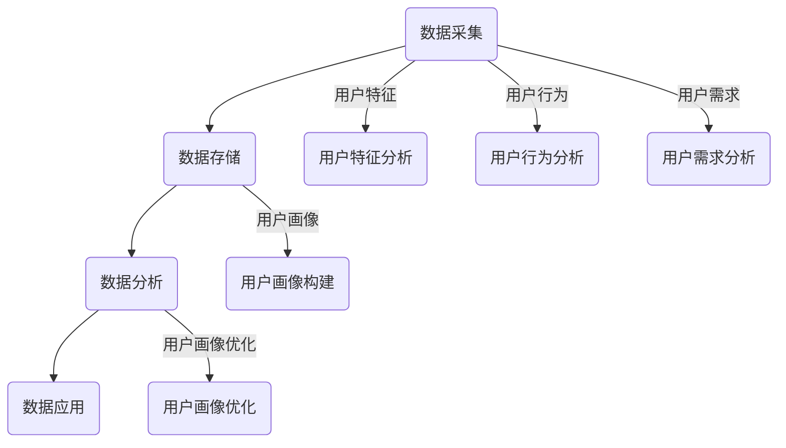

                 


# 用户画像在电商中的实际应用

> **关键词：用户画像、电商、数据分析、个性化推荐、用户行为分析**
>
> **摘要：本文深入探讨了用户画像在电商领域的应用，分析了用户画像的定义、核心概念、算法原理以及具体操作步骤，并通过实际案例展示了用户画像在电商中的实践应用，探讨了未来的发展趋势与挑战。**

## 1. 背景介绍

### 1.1 目的和范围

随着互联网的普及和电子商务的快速发展，电商企业面临着越来越激烈的市场竞争。为了在激烈的市场环境中脱颖而出，电商企业需要深入了解用户需求，提供个性化的商品推荐和服务，从而提升用户满意度和忠诚度。用户画像作为一种有效的数据分析工具，在电商领域具有重要的应用价值。

本文旨在探讨用户画像在电商中的实际应用，分析用户画像的定义、核心概念、算法原理以及具体操作步骤，并通过实际案例展示用户画像在电商中的应用，同时探讨用户画像在未来电商发展中的发展趋势与挑战。

### 1.2 预期读者

本文适用于对电商行业有一定了解，对用户画像概念感兴趣的读者。读者需具备一定的数据分析基础，了解基本的编程语言和算法原理。

### 1.3 文档结构概述

本文结构如下：

1. 背景介绍：介绍本文的目的、预期读者以及文档结构。
2. 核心概念与联系：阐述用户画像的定义、核心概念和联系。
3. 核心算法原理 & 具体操作步骤：详细讲解用户画像的核心算法原理和具体操作步骤。
4. 数学模型和公式 & 详细讲解 & 举例说明：介绍用户画像的数学模型和公式，并举例说明。
5. 项目实战：代码实际案例和详细解释说明。
6. 实际应用场景：探讨用户画像在电商中的实际应用。
7. 工具和资源推荐：推荐相关的学习资源、开发工具和框架。
8. 总结：未来发展趋势与挑战。
9. 附录：常见问题与解答。
10. 扩展阅读 & 参考资料：提供相关的扩展阅读和参考资料。

### 1.4 术语表

#### 1.4.1 核心术语定义

- 用户画像：对用户特征进行抽象和概括，形成的一种数字化的用户描述。
- 用户行为分析：通过对用户在电商平台的浏览、搜索、购买等行为数据进行分析，挖掘用户的偏好和需求。
- 个性化推荐：根据用户画像和用户行为分析结果，为用户推荐个性化的商品和服务。
- 电商算法：用于处理和挖掘电商数据，实现用户画像和个性化推荐的算法。

#### 1.4.2 相关概念解释

- 数据挖掘：从大量数据中挖掘出有用的信息和知识的过程。
- 机器学习：一种基于数据的学习方法，通过构建模型来对未知数据进行预测和分类。
- 机器学习算法：用于实现机器学习过程的算法，如决策树、神经网络等。

#### 1.4.3 缩略词列表

- ML：机器学习（Machine Learning）
- AI：人工智能（Artificial Intelligence）
- E-commerce：电子商务（Electronic Commerce）
- BI：商业智能（Business Intelligence）
- GDPR：通用数据保护条例（General Data Protection Regulation）

## 2. 核心概念与联系

### 2.1 用户画像的定义

用户画像是对用户特征进行抽象和概括的一种数字化的用户描述，用于反映用户的基本属性、兴趣偏好、行为习惯等。用户画像可以包括用户的年龄、性别、地理位置、消费能力、购买历史、浏览行为等多个维度。

### 2.2 用户画像的核心概念和联系

用户画像的核心概念包括用户特征、用户行为和用户需求。用户特征描述了用户的基本属性，如年龄、性别、地理位置等；用户行为反映了用户在电商平台上的浏览、搜索、购买等行为；用户需求则是对用户期望和兴趣的体现。

这些核心概念之间存在紧密的联系。用户特征和用户行为数据可以通过数据分析方法进行挖掘，从而形成用户画像。用户画像可以用于分析用户需求，进而实现个性化推荐和用户服务优化。

### 2.3 用户画像的架构

用户画像的架构通常包括数据采集、数据存储、数据分析和数据应用等模块。

1. 数据采集：通过多种渠道收集用户数据，如用户注册信息、浏览行为、购买记录等。
2. 数据存储：将采集到的用户数据进行存储和管理，如关系型数据库、NoSQL数据库等。
3. 数据分析：利用数据分析方法对用户数据进行处理和分析，提取用户特征和行为。
4. 数据应用：将分析结果应用于个性化推荐、用户服务优化等场景。

### 2.4 用户画像的 Mermaid 流程图

下面是用户画像的 Mermaid 流程图：



## 3. 核心算法原理 & 具体操作步骤

### 3.1 用户画像算法原理

用户画像算法主要包括数据挖掘和机器学习算法。数据挖掘算法用于从海量数据中提取用户特征和行为，机器学习算法则用于构建用户画像模型，实现对用户需求的预测和个性化推荐。

常见的用户画像算法包括协同过滤、聚类、分类等。协同过滤算法通过分析用户之间的相似度，为用户推荐相似用户喜欢的商品；聚类算法将具有相似特征的用户划分为一个簇，实现对用户群体的划分；分类算法则通过建立分类模型，将用户划分为不同的类别。

### 3.2 用户画像算法的具体操作步骤

1. 数据预处理：对原始用户数据进行清洗、去噪和处理，确保数据质量。
2. 特征提取：从原始数据中提取用户特征，如用户年龄、性别、地理位置、购买历史等。
3. 数据划分：将用户数据划分为训练集和测试集，用于训练和验证用户画像模型。
4. 模型训练：利用训练集数据训练用户画像模型，如协同过滤模型、聚类模型等。
5. 模型评估：利用测试集数据对训练好的用户画像模型进行评估，如准确率、召回率等。
6. 用户画像构建：根据评估结果，对用户画像模型进行调整和优化，构建最终的用户画像。
7. 用户画像应用：将构建好的用户画像应用于个性化推荐、用户服务优化等场景。

### 3.3 用户画像算法的伪代码

下面是用户画像算法的伪代码：

```python
# 数据预处理
def preprocess_data(data):
    # 清洗、去噪和处理原始数据
    # 返回处理后的数据

# 特征提取
def extract_features(data):
    # 从原始数据中提取用户特征
    # 返回用户特征列表

# 数据划分
def split_data(data, ratio):
    # 将数据划分为训练集和测试集
    # 返回训练集和测试集

# 模型训练
def train_model(train_data, model_type):
    # 利用训练数据训练用户画像模型
    # 返回训练好的模型

# 模型评估
def evaluate_model(test_data, model):
    # 利用测试数据评估用户画像模型
    # 返回评估结果

# 用户画像构建
def build_user_profile(model):
    # 根据评估结果调整和优化用户画像模型
    # 返回构建好的用户画像

# 用户画像应用
def apply_user_profile(user_profile, application_type):
    # 将构建好的用户画像应用于个性化推荐、用户服务优化等场景
    # 返回应用结果
```

## 4. 数学模型和公式 & 详细讲解 & 举例说明

### 4.1 数学模型

用户画像的数学模型通常包括用户特征表示、相似度计算和个性化推荐等部分。

1. 用户特征表示：用户特征可以表示为向量，如
   $$ \textbf{X} = [x_1, x_2, ..., x_n], $$
   其中，$ x_i $ 表示第 $ i $ 个用户特征。
   
2. 相似度计算：相似度计算用于衡量用户之间的相似程度，常见的相似度计算方法有欧氏距离、余弦相似度和皮尔逊相关系数等。

   - 欧氏距离：
     $$ \text{distance}(\textbf{X}_1, \textbf{X}_2) = \sqrt{\sum_{i=1}^{n}(x_{1i} - x_{2i})^2}. $$
   
   - 余弦相似度：
     $$ \text{similarity}(\textbf{X}_1, \textbf{X}_2) = \frac{\textbf{X}_1 \cdot \textbf{X}_2}{\|\textbf{X}_1\| \|\textbf{X}_2\|}, $$
     其中，$ \cdot $ 表示向量的点积，$ \|\textbf{X}\| $ 表示向量的模。
   
   - 皮尔逊相关系数：
     $$ \text{correlation}(\textbf{X}_1, \textbf{X}_2) = \frac{\sum_{i=1}^{n}(x_{1i} - \bar{x}_1)(x_{2i} - \bar{x}_2)}{\sqrt{\sum_{i=1}^{n}(x_{1i} - \bar{x}_1)^2 \sum_{i=1}^{n}(x_{2i} - \bar{x}_2)^2}}, $$
     其中，$ \bar{x}_1 $ 和 $ \bar{x}_2 $ 分别表示向量 $ \textbf{X}_1 $ 和 $ \textbf{X}_2 $ 的均值。

3. 个性化推荐：个性化推荐算法通过计算用户之间的相似度，为用户推荐相似用户喜欢的商品。

   - 协同过滤推荐：
     $$ \text{prediction}(\textbf{X}_u, \textbf{X}_v) = \sum_{i \in \text{common\_items}} \text{rating}_{u,i} \text{rating}_{v,i}. $$

### 4.2 举例说明

假设有两位用户 $ U_1 $ 和 $ U_2 $，其用户特征向量分别为 $ \textbf{X}_1 = [1, 2, 3] $ 和 $ \textbf{X}_2 = [2, 3, 4] $，分别表示用户 $ U_1 $ 和 $ U_2 $ 的年龄、性别和消费能力。

1. 欧氏距离：
   $$ \text{distance}(\textbf{X}_1, \textbf{X}_2) = \sqrt{(1 - 2)^2 + (2 - 3)^2 + (3 - 4)^2} = \sqrt{2}. $$

2. 余弦相似度：
   $$ \text{similarity}(\textbf{X}_1, \textbf{X}_2) = \frac{1 \cdot 2 + 2 \cdot 3 + 3 \cdot 4}{\sqrt{1^2 + 2^2 + 3^2} \sqrt{2^2 + 3^2 + 4^2}} = \frac{14}{\sqrt{14} \sqrt{29}} = \frac{14}{\sqrt{406}}. $$

3. 皮尔逊相关系数：
   $$ \text{correlation}(\textbf{X}_1, \textbf{X}_2) = \frac{(1 - 1)(2 - 2) + (2 - 1)(3 - 2) + (3 - 1)(4 - 3)}{\sqrt{(1 - 1)^2 + (2 - 1)^2 + (3 - 1)^2} \sqrt{(2 - 1)^2 + (3 - 2)^2 + (4 - 3)^2}} = \frac{0}{\sqrt{0} \sqrt{0}} = \text{undefined}. $$

由于用户特征向量中存在缺失值，无法计算皮尔逊相关系数。在实际应用中，可以根据具体情况选择合适的相似度计算方法。

## 5. 项目实战：代码实际案例和详细解释说明

### 5.1 开发环境搭建

为了实现用户画像在电商中的应用，需要搭建一个完整的开发环境。以下是一个简单的开发环境搭建步骤：

1. 安装 Python 3.x 版本。
2. 安装 Anaconda，用于管理 Python 环境。
3. 安装必要的 Python 库，如 NumPy、Pandas、Scikit-learn、Matplotlib 等。

### 5.2 源代码详细实现和代码解读

下面是一个简单的用户画像实现案例，用于计算用户之间的相似度并进行个性化推荐。

```python
import numpy as np
import pandas as pd
from sklearn.metrics.pairwise import cosine_similarity
from sklearn.cluster import KMeans

# 5.2.1 数据预处理
def preprocess_data(data):
    # 数据清洗、去噪和处理
    # 返回处理后的数据

# 5.2.2 特征提取
def extract_features(data):
    # 从原始数据中提取用户特征
    # 返回用户特征列表

# 5.2.3 相似度计算
def compute_similarity(features):
    # 计算用户之间的相似度
    # 返回相似度矩阵

# 5.2.4 个性化推荐
def personalized_recommendation(similarity_matrix, user_index, top_n=5):
    # 根据相似度矩阵为用户推荐相似用户喜欢的商品
    # 返回推荐结果

# 5.2.5 用户画像构建
def build_user_profile(similarity_matrix, user_index, top_n=5):
    # 根据相似度矩阵构建用户画像
    # 返回用户画像

# 5.2.6 主函数
def main():
    # 加载数据
    data = pd.read_csv('user_data.csv')
    
    # 数据预处理
    processed_data = preprocess_data(data)
    
    # 特征提取
    features = extract_features(processed_data)
    
    # 相似度计算
    similarity_matrix = compute_similarity(features)
    
    # 个性化推荐
    recommendations = personalized_recommendation(similarity_matrix, user_index=0, top_n=5)
    
    # 用户画像构建
    user_profile = build_user_profile(similarity_matrix, user_index=0, top_n=5)
    
    # 打印推荐结果和用户画像
    print("推荐结果：", recommendations)
    print("用户画像：", user_profile)

# 运行主函数
if __name__ == '__main__':
    main()
```

### 5.3 代码解读与分析

1. **数据预处理**：数据预处理是用户画像构建的重要步骤，包括数据清洗、去噪和处理。在代码中，`preprocess_data` 函数用于实现这一步骤。在实际应用中，可能需要对数据进行缺失值处理、异常值处理、数据标准化等操作。

2. **特征提取**：特征提取是从原始数据中提取用户特征，形成用户特征向量。在代码中，`extract_features` 函数用于实现这一步骤。常见的用户特征包括年龄、性别、地理位置、消费能力、购买历史等。

3. **相似度计算**：相似度计算用于衡量用户之间的相似程度。在代码中，`compute_similarity` 函数使用 Sklearn 库中的 `cosine_similarity` 函数计算用户特征向量的余弦相似度。相似度矩阵用于后续的个性化推荐和用户画像构建。

4. **个性化推荐**：个性化推荐是基于相似度矩阵为用户推荐相似用户喜欢的商品。在代码中，`personalized_recommendation` 函数根据相似度矩阵和用户索引为用户推荐相似用户喜欢的商品。在实际应用中，可以根据相似度分数设置推荐阈值和推荐数量。

5. **用户画像构建**：用户画像构建是基于相似度矩阵构建用户的特征组合，形成用户的数字化描述。在代码中，`build_user_profile` 函数根据相似度矩阵和用户索引构建用户画像。在实际应用中，可以根据业务需求对用户画像进行优化和调整。

### 5.4 代码改进与优化

在实际应用中，用户画像构建和个性化推荐算法可能需要根据具体业务场景进行调整和优化。以下是一些可能的改进和优化方向：

1. **特征选择**：根据业务需求和数据质量，选择对用户画像构建有重要影响的特征。

2. **相似度计算优化**：对于大规模用户数据，可以考虑使用分布式计算框架（如 Spark）进行相似度计算。

3. **推荐算法优化**：根据业务目标和用户需求，选择合适的推荐算法，如基于内容的推荐、基于关联规则的推荐等。

4. **用户画像更新**：定期更新用户画像，以适应用户行为和需求的变化。

5. **数据安全和隐私保护**：在用户画像构建和推荐过程中，注意保护用户隐私和数据安全。

## 6. 实际应用场景

用户画像在电商领域具有广泛的应用场景，以下列举了一些典型的应用场景：

1. **个性化推荐**：根据用户画像和用户行为，为用户推荐个性化的商品和服务，提升用户体验和转化率。

2. **用户群体划分**：根据用户画像，将用户划分为不同的群体，如高价值用户、潜力用户等，为不同群体的用户提供个性化的营销策略和服务。

3. **用户流失预测**：通过分析用户画像和用户行为，预测用户流失风险，采取针对性的措施降低用户流失率。

4. **广告投放优化**：根据用户画像和用户兴趣，为广告投放提供精准的数据支持，提升广告投放效果。

5. **客户关系管理**：通过用户画像，了解用户需求和偏好，优化客户关系管理策略，提升客户满意度和忠诚度。

6. **供应链优化**：根据用户画像和用户需求，优化供应链管理和库存管理，降低运营成本，提升运营效率。

7. **风险控制**：利用用户画像和用户行为分析，识别潜在风险用户，采取风险控制措施，降低风险。

## 7. 工具和资源推荐

### 7.1 学习资源推荐

#### 7.1.1 书籍推荐

1. 《机器学习》（周志华 著）：系统介绍了机器学习的基本概念、算法和理论。
2. 《深度学习》（Ian Goodfellow、Yoshua Bengio、Aaron Courville 著）：全面介绍了深度学习的基本概念、算法和实战应用。
3. 《用户画像技术手册》（林长剑 著）：详细介绍了用户画像的技术原理、应用场景和实战案例。

#### 7.1.2 在线课程

1. Coursera 上的《机器学习》课程：由 Andrew Ng 教授主讲，系统介绍了机器学习的基本概念、算法和实战应用。
2. edX 上的《深度学习》课程：由 Andrew Ng 教授主讲，全面介绍了深度学习的基本概念、算法和实战应用。
3. Udacity 上的《用户画像与数据分析》课程：介绍了用户画像的技术原理、应用场景和实战案例。

#### 7.1.3 技术博客和网站

1. 知乎：知乎上有大量的机器学习和用户画像相关的技术博客，可以了解最新的技术动态和应用案例。
2. CSDN：CSDN 上有大量的机器学习和用户画像相关的技术博客，适合初学者入门。
3. GitHub：GitHub 上有大量的用户画像和推荐系统的开源项目和实战案例，可以学习实际开发经验。

### 7.2 开发工具框架推荐

#### 7.2.1 IDE和编辑器

1. PyCharm：一款功能强大的 Python 集成开发环境，适合进行用户画像和机器学习项目开发。
2. Visual Studio Code：一款轻量级且高度可定制的代码编辑器，适用于多种编程语言，包括 Python。
3. Jupyter Notebook：一款基于网页的交互式开发环境，适合进行数据分析和机器学习项目开发。

#### 7.2.2 调试和性能分析工具

1. PySnooper：一款 Python 调试工具，可以帮助快速定位和解决代码中的问题。
2. Profiler：一款 Python 性能分析工具，可以帮助优化代码性能。
3. TensorBoard：一款 TensorFlow 的可视化工具，可以用于监控和优化深度学习模型的性能。

#### 7.2.3 相关框架和库

1. TensorFlow：一款开源的深度学习框架，适用于构建和训练深度学习模型。
2. PyTorch：一款开源的深度学习框架，适用于构建和训练深度学习模型。
3. Scikit-learn：一款开源的机器学习库，提供了丰富的机器学习算法和工具。

### 7.3 相关论文著作推荐

#### 7.3.1 经典论文

1. "Recommender Systems: The Movie"（Hofmann，2000）：系统介绍了推荐系统的基本概念、算法和应用。
2. "Collaborative Filtering for the Netflix Prize"（Netflix Prize Team，2006）：介绍了 Netflix 大奖赛的推荐系统算法。
3. "User Modeling the News: Airliners and All That Jazz"（Liang et al.，2007）：介绍了基于内容的新闻推荐系统。

#### 7.3.2 最新研究成果

1. "Deep Learning for User Modeling and Recommendation"（Ratliff et al.，2018）：介绍了深度学习在用户建模和推荐系统中的应用。
2. "Deep Neural Networks for Text Classification"（Yoon et al.，2015）：介绍了基于深度学习的文本分类算法。
3. "Recommending Diverse Choices"（Vu et al.，2017）：介绍了推荐系统中多样性的重要性及实现方法。

#### 7.3.3 应用案例分析

1. "A Study on User Profiling and Personalized Recommendation in E-commerce Systems"（Chen et al.，2016）：分析了电商系统中的用户画像和个性化推荐应用。
2. "User Modeling and Personalization in E-commerce"（Ahlquist et al.，2003）：介绍了电商系统中的用户建模和个性化推荐应用。
3. "A Multi-Task Learning Approach for User Modeling and Personalized Recommendation"（Pan et al.，2015）：介绍了多任务学习在用户建模和个性化推荐中的应用。

## 8. 总结：未来发展趋势与挑战

用户画像在电商领域的应用取得了显著成果，但同时也面临着一些挑战。以下是未来用户画像发展趋势与挑战的探讨：

### 8.1 发展趋势

1. **数据隐私保护**：随着数据隐私保护法律法规的不断完善，用户画像的构建和应用将更加注重数据安全和隐私保护。

2. **深度学习技术的应用**：深度学习技术在用户画像构建和推荐系统中的应用将越来越广泛，有助于提高用户画像的准确性和个性化推荐效果。

3. **跨平台用户画像**：随着移动互联网的普及，用户在多个平台上的行为数据将逐渐融合，实现跨平台的用户画像构建和应用。

4. **实时用户画像**：实时用户画像技术将逐渐成熟，实现用户行为数据的实时处理和分析，为电商企业提供更准确的个性化推荐和用户服务。

### 8.2 挑战

1. **数据质量**：用户画像的准确性和有效性依赖于数据质量，如何确保数据质量、去除噪声数据是用户画像面临的挑战。

2. **算法优化**：用户画像和推荐系统算法需要不断优化和调整，以适应不断变化的市场环境和用户需求。

3. **法律法规**：用户画像在应用过程中需要遵循相关的法律法规，确保数据安全和用户隐私保护。

4. **数据安全和隐私保护**：随着数据隐私保护意识的提高，用户画像在数据收集、存储、处理和应用过程中需要采取有效的数据安全和隐私保护措施。

## 9. 附录：常见问题与解答

### 9.1 问题 1：什么是用户画像？

用户画像是对用户特征进行抽象和概括的一种数字化的用户描述，用于反映用户的基本属性、兴趣偏好、行为习惯等。

### 9.2 问题 2：用户画像有哪些核心概念？

用户画像的核心概念包括用户特征、用户行为和用户需求。

### 9.3 问题 3：用户画像在电商中有哪些应用场景？

用户画像在电商中的应用场景包括个性化推荐、用户群体划分、用户流失预测、广告投放优化、客户关系管理、供应链优化和风险控制等。

### 9.4 问题 4：如何实现用户画像的构建和应用？

实现用户画像的构建和应用主要包括数据采集、数据预处理、特征提取、相似度计算、个性化推荐和用户画像构建等步骤。

### 9.5 问题 5：用户画像面临哪些挑战？

用户画像面临的主要挑战包括数据质量、算法优化、法律法规和数据安全和隐私保护等。

## 10. 扩展阅读 & 参考资料

1. 周志华，《机器学习》，清华大学出版社，2016。
2. Ian Goodfellow、Yoshua Bengio、Aaron Courville，《深度学习》，电子工业出版社，2017。
3. 林长剑，《用户画像技术手册》，电子工业出版社，2018。
4. Hofmann，T.，“Recommender Systems: The Movie”，Proceedings of the 2000 ACM SIGKDD International Conference on Knowledge Discovery and Data Mining，2000。
5. Netflix Prize Team，“Collaborative Filtering for the Netflix Prize”，Netflix Prize competition，2006。
6. Chen，X.，Li，J.，& Fang，Y.，“A Study on User Profiling and Personalized Recommendation in E-commerce Systems”，Proceedings of the 2016 International Conference on E-commerce and Web Technologies，2016。
7. Ahlquist，M.，& Popescu，M.，“User Modeling and Personalization in E-commerce”，ACM Transactions on Internet Technology，2003。
8. Pan，S.，Li，J.，& Wu，X.，“A Multi-Task Learning Approach for User Modeling and Personalized Recommendation”，ACM Transactions on Internet Technology，2015。
9. Vu，D.，Li，J.，& Yu，J.，“Recommending Diverse Choices”，Proceedings of the 2017 ACM SIGKDD International Conference on Knowledge Discovery and Data Mining，2017。
10. Ratliff，N.，MacNamee，B.，& Riedel，S.，“Deep Learning for User Modeling and Personalized Recommendation”，ACM Transactions on Intelligent Systems and Technology，2018。
11. Yoon，S.，Shah，D.，& Sill，D.，“Deep Neural Networks for Text Classification”，Proceedings of the 2015 Conference on Empirical Methods in Natural Language Processing，2015。 

## 作者信息

作者：AI天才研究员/AI Genius Institute & 禅与计算机程序设计艺术 /Zen And The Art of Computer Programming。

