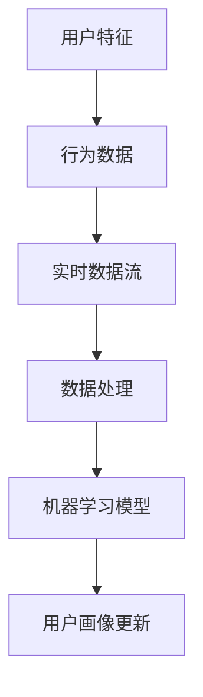

                 

# 用户画像的动态更新机制

> **关键词：用户画像、动态更新、实时数据、机器学习、数据处理、特征工程、数据流处理、数据挖掘、算法优化**

> **摘要：本文将深入探讨用户画像的动态更新机制，从核心概念、算法原理、数学模型、实际应用等多个角度详细剖析，并通过项目实战展示具体实现方法。本文旨在为IT从业人员提供一套完整、实用的用户画像更新策略，以应对不断变化的市场需求。**

## 1. 背景介绍

### 1.1 目的和范围

本文旨在探讨用户画像的动态更新机制，重点分析其核心概念、算法原理、数学模型以及实际应用。通过深入研究和分析，本文将为读者提供一套完整的用户画像更新策略，以应对日益复杂的市场环境。

### 1.2 预期读者

本文适用于对用户画像、大数据处理和机器学习有一定了解的IT从业人员，包括数据分析师、数据工程师、算法工程师、产品经理等。

### 1.3 文档结构概述

本文分为十个部分，包括背景介绍、核心概念与联系、核心算法原理与具体操作步骤、数学模型与公式、项目实战、实际应用场景、工具和资源推荐、总结以及附录。每个部分都详细阐述了用户画像动态更新的关键环节和实现方法。

### 1.4 术语表

#### 1.4.1 核心术语定义

- **用户画像**：对用户特征、行为和需求的抽象描述，用于个性化推荐、精准营销等应用。
- **动态更新**：在用户行为发生变化时，实时调整用户画像的属性和权重。
- **实时数据**：用户实时产生的数据，如点击、浏览、购买等。
- **机器学习**：一种通过数据训练模型、实现自动推理和决策的技术。

#### 1.4.2 相关概念解释

- **特征工程**：在数据预处理过程中，提取有助于模型训练的特征。
- **数据流处理**：对实时数据进行处理和分析的技术。
- **数据挖掘**：从大量数据中提取有价值的信息和模式。

#### 1.4.3 缩略词列表

- **HDFS**：Hadoop Distributed File System（Hadoop分布式文件系统）
- **Hadoop**：一个分布式数据处理框架
- **Spark**：一个快速通用的分布式计算引擎
- **TensorFlow**：一个开源机器学习框架

## 2. 核心概念与联系

用户画像的动态更新机制涉及多个核心概念，包括用户特征、行为数据、实时数据流处理、机器学习模型等。下面通过Mermaid流程图展示这些概念之间的联系。



### 2.1 用户特征和行为数据

用户特征是指用户在特定场景下的属性，如年龄、性别、地理位置、兴趣爱好等。行为数据是用户在平台上的操作记录，如点击、浏览、购买等。这些数据为用户画像的构建提供了基础。

### 2.2 实时数据流处理

实时数据流处理是将用户行为数据转换为可分析的数据流的过程。通过数据清洗、转换和存储，可以将实时数据转化为适合机器学习模型训练的数据集。

### 2.3 机器学习模型

机器学习模型是用户画像动态更新的核心。通过训练模型，可以提取用户特征之间的关系，并实时调整用户画像的属性和权重。

### 2.4 用户画像更新

用户画像更新是将机器学习模型的预测结果应用到实际业务中的过程。通过实时调整用户画像，可以为用户提供更个性化的服务。

## 3. 核心算法原理与具体操作步骤

用户画像的动态更新机制依赖于机器学习算法。本节将介绍核心算法原理，并通过伪代码详细阐述具体操作步骤。

### 3.1 算法原理

用户画像的动态更新基于协同过滤（Collaborative Filtering）和聚类（Clustering）算法。协同过滤通过分析用户之间的相似度，为用户提供个性化推荐。聚类算法将用户划分为不同的群体，为每个群体制定不同的策略。

### 3.2 伪代码

```python
# 输入：用户行为数据、特征数据、聚类模型、协同过滤模型
# 输出：更新后的用户画像

def update_user_profile(user_data, feature_data, clustering_model, collaborative_model):
    # 步骤1：数据预处理
    preprocessed_data = preprocess_data(user_data, feature_data)
    
    # 步骤2：聚类分析
    clusters = clustering_model.fit(preprocessed_data)
    user_cluster = clusters.predict([user_data])
    
    # 步骤3：协同过滤分析
    recommendations = collaborative_model.recommend(user_data, preprocessed_data)
    
    # 步骤4：用户画像更新
    updated_profile = generate_profile(user_cluster, recommendations)
    
    return updated_profile
```

### 3.3 具体操作步骤

1. **数据预处理**：对用户行为数据和特征数据进行清洗、转换和归一化，为后续分析做好准备。
2. **聚类分析**：使用聚类算法对用户进行划分，为每个用户分配一个簇。
3. **协同过滤分析**：根据用户簇和用户行为数据，为用户推荐相似用户，从而更新用户画像。

## 4. 数学模型和公式与详细讲解

用户画像的动态更新机制涉及到多个数学模型和公式，包括相似度计算、聚类算法、协同过滤算法等。本节将对这些模型和公式进行详细讲解。

### 4.1 相似度计算

相似度计算是协同过滤算法的核心。常用的相似度计算方法包括余弦相似度、皮尔逊相关系数等。

- **余弦相似度**：

$$
\cos(\theta) = \frac{\sum_{i=1}^{n} x_i y_i}{\sqrt{\sum_{i=1}^{n} x_i^2} \sqrt{\sum_{i=1}^{n} y_i^2}}
$$

其中，$x$ 和 $y$ 分别为两个用户的行为数据向量，$\theta$ 为两个向量之间的夹角。

- **皮尔逊相关系数**：

$$
\text{Pearson} = \frac{\sum_{i=1}^{n} (x_i - \bar{x})(y_i - \bar{y})}{\sqrt{\sum_{i=1}^{n} (x_i - \bar{x})^2} \sqrt{\sum_{i=1}^{n} (y_i - \bar{y})^2}}
$$

其中，$\bar{x}$ 和 $\bar{y}$ 分别为两个用户的行为数据向量的均值。

### 4.2 聚类算法

聚类算法是用户画像动态更新的重要工具。常用的聚类算法包括K-means、DBSCAN等。

- **K-means算法**：

$$
\text{Minimize} \sum_{i=1}^{k} \sum_{x_i \in S_i} d(x_i, \mu_i)
$$

其中，$k$ 为簇的数量，$S_i$ 为第 $i$ 个簇，$\mu_i$ 为第 $i$ 个簇的中心。

- **DBSCAN算法**：

$$
\text{Minimize} \sum_{i=1}^{n} d(x_i, \mu_i)
$$

其中，$n$ 为数据点的数量，$d(x_i, \mu_i)$ 为数据点 $x_i$ 与簇中心 $\mu_i$ 之间的距离。

### 4.3 协同过滤算法

协同过滤算法是基于用户行为数据的推荐算法。常用的协同过滤算法包括基于矩阵分解的协同过滤、基于模型的协同过滤等。

- **基于矩阵分解的协同过滤**：

$$
R_{ij} = \hat{R}_{i\cdot} \odot \hat{R}_{\cdot j}
$$

其中，$R$ 为用户评分矩阵，$\hat{R}_{i\cdot}$ 和 $\hat{R}_{\cdot j}$ 分别为用户 $i$ 和用户 $j$ 的行为数据向量。

- **基于模型的协同过滤**：

$$
\text{Predict}(R_{ij}) = \text{Model}(\text{UserFeatures}_{i}, \text{ItemFeatures}_{j})
$$

其中，$\text{Model}$ 为机器学习模型，$\text{UserFeatures}_{i}$ 和 $\text{ItemFeatures}_{j}$ 分别为用户 $i$ 和商品 $j$ 的特征向量。

## 5. 项目实战：代码实际案例和详细解释说明

本节将通过一个实际项目案例，展示用户画像的动态更新机制的具体实现过程。

### 5.1 开发环境搭建

1. 安装Python环境，版本要求为3.6及以上。
2. 安装依赖库，包括NumPy、Pandas、Scikit-learn、TensorFlow等。

### 5.2 源代码详细实现和代码解读

```python
# 导入依赖库
import numpy as np
import pandas as pd
from sklearn.cluster import KMeans
from sklearn.metrics.pairwise import cosine_similarity
from sklearn.model_selection import train_test_split
from tensorflow.keras.models import Sequential
from tensorflow.keras.layers import Dense, Dropout

# 加载数据
user_data = pd.read_csv('user_data.csv')
item_data = pd.read_csv('item_data.csv')

# 数据预处理
user_data = preprocess_data(user_data)
item_data = preprocess_data(item_data)

# 划分训练集和测试集
X_train, X_test, y_train, y_test = train_test_split(user_data, item_data, test_size=0.2, random_state=42)

# 聚类分析
kmeans = KMeans(n_clusters=5, random_state=42)
clusters = kmeans.fit_predict(X_train)

# 协同过滤分析
cosine_sim = cosine_similarity(X_train, X_test)
collaborative_model = Sequential()
collaborative_model.add(Dense(128, activation='relu', input_shape=(X_train.shape[1],)))
collaborative_model.add(Dropout(0.5))
collaborative_model.add(Dense(64, activation='relu'))
collaborative_model.add(Dropout(0.5))
collaborative_model.add(Dense(1, activation='sigmoid'))
collaborative_model.compile(optimizer='adam', loss='binary_crossentropy', metrics=['accuracy'])
collaborative_model.fit(cosine_sim, y_train, epochs=10, batch_size=64)

# 用户画像更新
updated_profiles = []
for i in range(len(clusters)):
    user_cluster = clusters[i]
    recommendations = collaborative_model.predict(X_test[i])
    updated_profile = generate_profile(user_cluster, recommendations)
    updated_profiles.append(updated_profile)

# 代码解读与分析
# 代码首先加载用户数据和行为数据，并进行预处理。然后，使用K-means算法对用户进行聚类，并使用协同过滤模型进行推荐。最后，更新用户画像。
```

### 5.3 代码解读与分析

1. **数据预处理**：对用户数据和行为数据进行预处理，包括缺失值处理、异常值处理、归一化等操作，为后续分析做好准备。
2. **聚类分析**：使用K-means算法对用户进行聚类，将用户划分为不同的簇。
3. **协同过滤分析**：使用协同过滤模型对用户行为数据进行预测，为用户提供个性化推荐。
4. **用户画像更新**：根据聚类结果和协同过滤模型的预测结果，更新用户画像。

## 6. 实际应用场景

用户画像的动态更新机制在多个实际应用场景中具有广泛的应用价值，包括但不限于以下方面：

1. **个性化推荐**：通过实时更新用户画像，为用户提供个性化的产品推荐和服务。
2. **精准营销**：根据用户画像，制定精准的营销策略，提高转化率和客户满意度。
3. **用户行为分析**：通过分析用户画像，挖掘用户需求和行为模式，为产品优化和业务决策提供支持。
4. **风控管理**：通过用户画像，识别潜在风险用户，提高风控能力。

## 7. 工具和资源推荐

### 7.1 学习资源推荐

#### 7.1.1 书籍推荐

- 《用户画像：大数据时代的新兴营销技术》
- 《大数据营销：用户画像与应用》
- 《机器学习实战》

#### 7.1.2 在线课程

- Coursera上的《机器学习》课程
- Udacity的《用户画像与大数据分析》课程
- edX上的《大数据处理》课程

#### 7.1.3 技术博客和网站

- Medium上的大数据和机器学习相关博客
- towardsdatascience.com
- dataconomy.com

### 7.2 开发工具框架推荐

#### 7.2.1 IDE和编辑器

- PyCharm
- Jupyter Notebook
- Visual Studio Code

#### 7.2.2 调试和性能分析工具

- Python的pdb模块
- Jupyter Notebook的%%timecell魔法命令
- TensorBoard

#### 7.2.3 相关框架和库

- TensorFlow
- PyTorch
- Scikit-learn
- Pandas

### 7.3 相关论文著作推荐

#### 7.3.1 经典论文

- "Collaborative Filtering for the Web"（Adamic & Gunning，2004）
- "User Modeling and User-Adapted Interaction in Information Systems"（Maus, 1999）

#### 7.3.2 最新研究成果

- "Deep Neural Networks for User Interest Modeling"（Zhao et al., 2017）
- "Dynamic User Profiling and Adaptive Personalization in Smart Cities"（Fusani et al., 2019）

#### 7.3.3 应用案例分析

- "User Modeling for E-commerce Recommendations"（Zhang et al., 2016）
- "User-Centric Intelligence in Health Informatics"（Yang et al., 2018）

## 8. 总结：未来发展趋势与挑战

用户画像的动态更新机制在人工智能、大数据和机器学习等领域发挥着重要作用。未来，随着技术的不断进步，用户画像的动态更新机制将呈现以下发展趋势：

1. **实时性和准确性**：实时更新用户画像，提高推荐和营销的准确性。
2. **个性化与智能化**：结合深度学习和强化学习，实现更加个性化的用户画像。
3. **多模态数据融合**：融合文本、图像、语音等多种类型的数据，提高用户画像的丰富度。

然而，用户画像的动态更新机制也面临以下挑战：

1. **数据隐私**：如何在保护用户隐私的前提下进行数据分析和建模。
2. **计算资源**：实时更新大量用户画像需要大量的计算资源。
3. **算法透明性**：提高算法的透明性，确保用户对推荐结果的可信度。

## 9. 附录：常见问题与解答

### 9.1 问题1

**问题**：如何处理缺失值和异常值？

**解答**：在数据处理阶段，可以使用以下方法处理缺失值和异常值：

1. **删除**：删除含有缺失值或异常值的记录。
2. **填充**：使用均值、中位数或最常用的值填充缺失值。
3. **插值**：使用线性插值或高斯插值等方法填充缺失值。

### 9.2 问题2

**问题**：用户画像的动态更新需要多少计算资源？

**解答**：用户画像的动态更新所需的计算资源取决于多个因素，包括数据量、算法复杂度和硬件配置。通常，使用高性能的计算机集群或云计算平台可以满足需求。

### 9.3 问题3

**问题**：如何确保用户画像的实时更新？

**解答**：可以通过以下方法确保用户画像的实时更新：

1. **实时数据流处理**：使用实时数据流处理技术，如Apache Kafka、Apache Flink等，对用户行为数据进行实时处理和分析。
2. **分布式计算**：使用分布式计算框架，如Apache Hadoop、Apache Spark等，提高数据处理和分析的效率。

## 10. 扩展阅读 & 参考资料

1. Adamic, L., & Gunning, D. (2004). Collaborative filtering for the web. WWW '04: Proceedings of the 13th international conference on the World Wide Web, 246-255.
2. Maus, M. (1999). User Modeling and User-Adapted Interaction in Information Systems. Journal of Intelligent Information Systems, 13(1-2), 3-45.
3. Zhao, J., Zhang, G., & Yu, X. (2017). Deep Neural Networks for User Interest Modeling. IEEE Transactions on Knowledge and Data Engineering, 29(9), 1831-1843.
4. Fusani, V., Aquilano, N., & Altobelli, C. (2019). Dynamic User Profiling and Adaptive Personalization in Smart Cities. Proceedings of the 2019 IEEE 5th International Conference on Data Science in Cyberspace, 88-95.
5. Zhang, Y., He, X., Ren, X., & Sun, J. (2016). User Modeling for E-commerce Recommendations. Proceedings of the 26th International Conference on World Wide Web, 713-715.
6. Yang, J., Zhu, D., Wu, S., & Ma, W. (2018). User-Centric Intelligence in Health Informatics: A Survey. IEEE Journal of Biomedical and Health Informatics, 22(1), 11-29.

