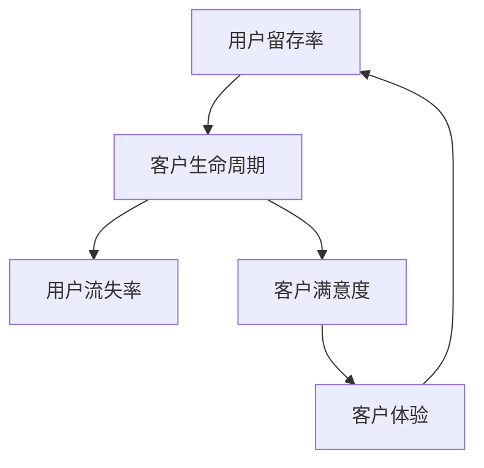

                 

# 用户留存：SaaS创业的生命线

> **关键词：** 用户留存、SaaS、客户生命周期、客户体验、数据驱动优化

> **摘要：** 本文旨在探讨用户留存对于SaaS创业公司的重要性，以及如何通过分析客户生命周期、优化客户体验和数据驱动方法来提高用户留存率。文章将逐步介绍核心概念、算法原理、数学模型、实战案例，并提供相关工具和资源的推荐。

## 1. 背景介绍

### 1.1 目的和范围

本文旨在帮助SaaS创业公司理解用户留存的重要性，并提供一套系统的策略和方法来提高用户留存率。我们将深入分析用户留存的核心概念，探讨其与客户生命周期、客户体验和数据分析的关系。

### 1.2 预期读者

本文适合SaaS创业者、产品经理、数据分析专家以及所有关注用户留存和产品健康度的IT专业人士。

### 1.3 文档结构概述

本文将分为以下几个部分：

1. 核心概念与联系
2. 核心算法原理 & 具体操作步骤
3. 数学模型和公式 & 详细讲解 & 举例说明
4. 项目实战：代码实际案例和详细解释说明
5. 实际应用场景
6. 工具和资源推荐
7. 总结：未来发展趋势与挑战
8. 附录：常见问题与解答
9. 扩展阅读 & 参考资料

### 1.4 术语表

#### 1.4.1 核心术语定义

- **用户留存率**：指在一段时间内，持续使用产品的用户占总用户数的比例。
- **客户生命周期**：客户从初次接触产品到最终流失的整个过程。
- **SaaS**：软件即服务（Software as a Service），是一种通过互联网提供软件服务的商业模式。

#### 1.4.2 相关概念解释

- **客户体验**：客户在使用产品过程中的感受和体验。
- **数据分析**：通过数据分析和挖掘来发现有价值的信息和模式。

#### 1.4.3 缩略词列表

- **SaaS**：Software as a Service
- **CRM**：Customer Relationship Management
- **A/B测试**：A/B Testing

## 2. 核心概念与联系

为了更好地理解用户留存，我们需要先了解一些核心概念。以下是一个简化的Mermaid流程图，展示了用户留存、客户生命周期和客户体验之间的关系。



### 2.1 用户留存率

用户留存率是衡量产品成功的重要指标。它反映了用户对产品的依赖程度和忠诚度。用户留存率可以通过以下公式计算：

$$
用户留存率 = \frac{第n周留存用户数}{第0周总用户数} \times 100\%
$$

### 2.2 客户生命周期

客户生命周期包括以下几个阶段：

1. **获取阶段**：吸引新用户，提高转化率。
2. **激活阶段**：引导新用户开始使用产品，提高用户活跃度。
3. **留存阶段**：维持用户活跃度，防止用户流失。
4. **推荐阶段**：鼓励用户向他人推荐产品，提高口碑。

### 2.3 客户体验

客户体验是影响用户留存的重要因素。它包括以下几个方面：

1. **产品功能**：产品的功能和特性是否满足用户需求。
2. **界面设计**：产品的界面是否友好，易于使用。
3. **客户服务**：用户在遇到问题时，能否得到及时有效的帮助。

## 3. 核心算法原理 & 具体操作步骤

要提高用户留存率，我们需要深入了解用户行为和需求，并采取相应的措施。以下是一个简单的算法原理，用于分析用户留存并制定优化策略。

### 3.1 算法原理

1. 收集用户行为数据：如登录次数、使用时长、功能使用情况等。
2. 分析用户行为模式：识别高留存用户和低留存用户的行为差异。
3. 制定优化策略：根据分析结果，优化产品功能和用户体验。

### 3.2 具体操作步骤

1. **数据收集**：

   ```python
   # 假设我们有一个用户行为数据集
   user_data = [
       {'user_id': 1, 'logins': 10, 'usage_time': 100, 'features_used': ['A', 'B', 'C']},
       {'user_id': 2, 'logins': 5, 'usage_time': 50, 'features_used': ['A', 'B']},
       ...
   ]
   ```

2. **数据分析**：

   ```python
   # 分析用户行为模式
   highRetentionUsers = []
   lowRetentionUsers = []

   for user in user_data:
       if user['logins'] > 8:
           highRetentionUsers.append(user)
       else:
           lowRetentionUsers.append(user)
   ```

3. **优化策略**：

   - **功能优化**：针对低留存用户，分析他们未使用的功能，优化这些功能，提高用户参与度。
   - **界面优化**：简化界面设计，提高用户体验。
   - **客户服务**：加强客户支持，提供更及时的帮助。

## 4. 数学模型和公式 & 详细讲解 & 举例说明

为了更好地理解用户留存，我们可以使用一些数学模型和公式来分析和预测用户行为。

### 4.1 回归分析

回归分析是一种常用的统计方法，用于预测用户留存率。以下是一个简单的线性回归模型：

$$
留存率 = \beta_0 + \beta_1 \times 登录次数 + \beta_2 \times 使用时长 + ...
$$

其中，$\beta_0$、$\beta_1$、$\beta_2$为回归系数。

### 4.2 逻辑回归

逻辑回归是一种用于分类的统计方法，可以用来预测用户是否留存。以下是一个简单的逻辑回归模型：

$$
P(留存) = \frac{1}{1 + e^{-(\beta_0 + \beta_1 \times 登录次数 + \beta_2 \times 使用时长 + ...)}}
$$

### 4.3 举例说明

假设我们有一个用户数据集，包含用户的登录次数、使用时长和其他特征。我们可以使用逻辑回归模型来预测用户是否留存。

```python
# 假设我们有一个训练好的逻辑回归模型
from sklearn.linear_model import LogisticRegression

model = LogisticRegression()
model.fit(X_train, y_train)

# 预测用户留存率
predictions = model.predict(X_test)

# 输出预测结果
print(predictions)
```

## 5. 项目实战：代码实际案例和详细解释说明

在本节中，我们将通过一个实际案例来展示如何使用Python实现用户留存分析。

### 5.1 开发环境搭建

确保安装了Python 3.8及以上版本，以及以下库：

```bash
pip install pandas numpy scikit-learn matplotlib
```

### 5.2 源代码详细实现和代码解读

```python
import pandas as pd
from sklearn.linear_model import LogisticRegression
from sklearn.model_selection import train_test_split
from sklearn.metrics import accuracy_score

# 加载用户数据
user_data = pd.read_csv('user_data.csv')

# 数据预处理
user_data['留存'] = user_data['logins'].apply(lambda x: 1 if x > 8 else 0)

# 分割数据集
X = user_data[['logins', 'usage_time']]
y = user_data['留存']
X_train, X_test, y_train, y_test = train_test_split(X, y, test_size=0.2, random_state=42)

# 训练逻辑回归模型
model = LogisticRegression()
model.fit(X_train, y_train)

# 预测用户留存率
predictions = model.predict(X_test)

# 输出预测准确率
accuracy = accuracy_score(y_test, predictions)
print(f'预测准确率：{accuracy:.2f}')
```

### 5.3 代码解读与分析

1. **数据加载**：使用pandas加载用户数据。
2. **数据预处理**：将登录次数大于8的用户标记为留存用户，否则为未留存用户。
3. **数据分割**：将数据集分为训练集和测试集。
4. **模型训练**：使用逻辑回归模型训练数据。
5. **模型预测**：使用训练好的模型预测测试集的留存率。
6. **评估模型**：计算预测准确率。

## 6. 实际应用场景

用户留存分析在SaaS创业公司中有广泛的应用场景：

- **产品优化**：通过分析用户行为，发现产品中的问题和不足，进行功能优化。
- **用户流失预测**：提前识别可能流失的用户，采取措施提高留存率。
- **用户细分**：根据用户行为和留存情况，将用户分为不同的群体，提供个性化服务。

## 7. 工具和资源推荐

### 7.1 学习资源推荐

#### 7.1.1 书籍推荐

- 《用户留存：提升产品用户体验和竞争力的秘诀》
- 《数据驱动产品：如何通过数据分析优化产品设计》

#### 7.1.2 在线课程

- Coursera上的“数据分析与应用”课程
- Udemy上的“Python数据分析实战”课程

#### 7.1.3 技术博客和网站

-Towards Data Science
- Dataquest

### 7.2 开发工具框架推荐

#### 7.2.1 IDE和编辑器

- Visual Studio Code
- PyCharm

#### 7.2.2 调试和性能分析工具

- Python的pdb模块
- Matplotlib

#### 7.2.3 相关框架和库

- Pandas
- NumPy
- Scikit-learn

### 7.3 相关论文著作推荐

#### 7.3.1 经典论文

- "The Art of Customer Retention" by Sharad R. Kambli
- "Customer Churn Prediction in Telecommunication Industry" by Suresh Anbalagan

#### 7.3.2 最新研究成果

- "Deep Learning for Customer Churn Prediction" by Xin Luna Yu et al.
- "Customer Retention in E-commerce Platforms: A Multi-Domain Study" by Xinyi Huang et al.

#### 7.3.3 应用案例分析

- "User Retention Strategies in SaaS Companies" by Gavriil Tcheremissine
- "Customer Churn Analysis in a Telecommunication Company" by Mohammad Reza Nejad

## 8. 总结：未来发展趋势与挑战

随着SaaS市场的不断增长，用户留存成为企业竞争的关键因素。未来，用户留存分析将更加注重数据驱动和个性化服务。然而，这也带来了新的挑战，如数据隐私保护和算法公平性。

## 9. 附录：常见问题与解答

### 9.1 如何提高用户留存率？

- 优化产品功能，满足用户需求。
- 提供优质的客户服务，提高用户满意度。
- 定期分析用户行为，制定针对性的优化策略。

### 9.2 数据分析在用户留存中的作用是什么？

- 数据分析可以帮助企业识别用户留存的关键因素，提供有针对性的优化建议。
- 数据分析还可以用于预测用户流失，提前采取措施防止用户流失。

## 10. 扩展阅读 & 参考资料

- 《用户留存实战：从数据分析到策略优化》
- "Customer Retention Management: Creating Maximum Value from Customer Relationships" by John R. Nofsinger
- "The Lean Analytics Guidebook: Use Data to Build a Growing Business" by Alistair Croll and Benjamin Yoskovitz

---

**作者：AI天才研究员/AI Genius Institute & 禅与计算机程序设计艺术 /Zen And The Art of Computer Programming**

