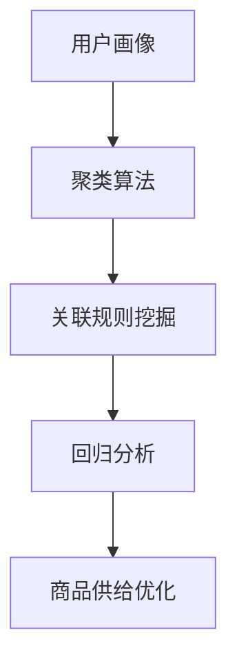

                 

# 用户行为分析：AI如何洞察用户需求，优化商品供给

> 关键词：用户行为分析、人工智能、用户需求、商品供给、算法、数学模型、实战案例

> 摘要：本文将深入探讨如何利用人工智能技术分析用户行为，从而洞察用户需求，优化商品供给。我们将从核心概念、算法原理、数学模型、实战案例等多个维度进行分析，帮助读者全面了解用户行为分析在现代商业应用中的重要性及其技术实现。

## 1. 背景介绍

### 1.1 目的和范围

本文旨在介绍用户行为分析的基本概念、核心算法原理和实际应用，帮助读者了解如何利用人工智能技术洞察用户需求，优化商品供给。我们将覆盖以下几个方面的内容：

1. 用户行为分析的核心概念和原理。
2. 常见用户行为分析算法及其实现。
3. 用户行为分析的数学模型和公式。
4. 用户行为分析的实际应用场景。
5. 开发工具和资源推荐。
6. 未来发展趋势与挑战。

### 1.2 预期读者

本文面向对人工智能和用户行为分析有一定了解的技术人员，特别是希望深入了解用户行为分析在商业应用中的价值及其技术实现的相关从业人员。同时，对于对AI技术感兴趣的大众读者，本文也将具有一定的参考价值。

### 1.3 文档结构概述

本文结构如下：

1. 背景介绍：介绍本文的目的、范围、预期读者以及文档结构。
2. 核心概念与联系：阐述用户行为分析的核心概念和原理。
3. 核心算法原理 & 具体操作步骤：讲解用户行为分析的核心算法原理和具体操作步骤。
4. 数学模型和公式 & 详细讲解 & 举例说明：介绍用户行为分析中的数学模型和公式，并进行详细讲解和举例说明。
5. 项目实战：代码实际案例和详细解释说明。
6. 实际应用场景：探讨用户行为分析在实际中的应用场景。
7. 工具和资源推荐：推荐学习资源、开发工具和框架。
8. 总结：未来发展趋势与挑战。
9. 附录：常见问题与解答。
10. 扩展阅读 & 参考资料：提供相关扩展阅读和参考资料。

### 1.4 术语表

#### 1.4.1 核心术语定义

- 用户行为分析：通过收集、分析和理解用户在互联网上的行为数据，以洞察用户需求和优化产品供给的一种技术手段。
- 人工智能：一种模拟人类智能的计算机技术，通过算法和模型实现机器学习、自然语言处理、图像识别等功能。
- 数学模型：利用数学语言和公式描述现实世界问题的一种方法。
- 数据挖掘：从大量数据中提取有价值信息的过程。

#### 1.4.2 相关概念解释

- 用户画像：根据用户的基本信息、行为数据等特征，构建出反映用户特征和需求的模型。
- 聚类算法：将数据集中的数据点划分为若干个类或簇，使得同一个簇内的数据点相似度较高，不同簇之间的数据点相似度较低。

#### 1.4.3 缩略词列表

- AI：人工智能
- ML：机器学习
- NLP：自然语言处理
- CV：计算机视觉
- DB：数据库
- SQL：结构化查询语言

## 2. 核心概念与联系

在用户行为分析中，以下几个核心概念和联系至关重要：

### 2.1 用户画像

用户画像是一种描述用户特征和需求的方法。通过收集用户的基本信息、行为数据、兴趣偏好等，构建出一个反映用户特征的模型。用户画像的核心是用户特征和需求，这对于后续的用户行为分析和商品供给优化具有重要意义。

### 2.2 聚类算法

聚类算法是一种无监督学习方法，用于将数据集中的数据点划分为若干个簇或类。通过聚类算法，我们可以将具有相似特征的用户划分为同一簇，从而更好地理解用户群体，为商品供给优化提供依据。

### 2.3 关联规则挖掘

关联规则挖掘是一种用于发现数据集中项之间关联关系的方法。在用户行为分析中，关联规则挖掘可以帮助我们发现用户购买行为之间的关联，从而优化商品组合，提高用户满意度。

### 2.4 回归分析

回归分析是一种用于建立自变量与因变量之间关系的数学模型。在用户行为分析中，回归分析可以帮助我们预测用户需求，从而优化商品供给。

### 2.5 Mermaid 流程图

以下是用户行为分析的核心概念和联系的 Mermaid 流程图：



## 3. 核心算法原理 & 具体操作步骤

在本节中，我们将详细讲解用户行为分析中的核心算法原理和具体操作步骤。

### 3.1 用户画像算法

用户画像算法主要包括以下步骤：

1. 数据收集：收集用户的基本信息、行为数据、兴趣偏好等。
2. 数据预处理：对收集到的数据进行清洗、去重、归一化等处理。
3. 特征提取：从预处理后的数据中提取用户特征，如年龄、性别、地域、消费能力、兴趣爱好等。
4. 模型构建：利用机器学习算法（如聚类算法、决策树、神经网络等）构建用户画像模型。
5. 模型评估：对构建的用户画像模型进行评估，如准确率、召回率、F1值等。

以下是用户画像算法的伪代码：

```python
# 用户画像算法
def user\_portrait(data):
    # 数据预处理
    preprocessed\_data = preprocess(data)
    
    # 特征提取
    features = extract_features(preprocessed_data)
    
    # 模型构建
    model = build_model(features)
    
    # 模型评估
    evaluate_model(model)
    
    return model
```

### 3.2 聚类算法

聚类算法主要包括以下步骤：

1. 数据预处理：对原始数据进行清洗、去重、归一化等处理。
2. 初始化聚类中心：随机选择若干个聚类中心点。
3. 聚类过程：迭代计算每个数据点与聚类中心的距离，并将其分配到最近的聚类中心所代表的簇。
4. 重新计算聚类中心：根据已分配的数据点重新计算聚类中心。
5. 重复步骤3和4，直至聚类中心不再发生变化。

以下是常见的K-means聚类算法的伪代码：

```python
# K-means 聚类算法
def k_means(data, k):
    # 数据预处理
    preprocessed_data = preprocess(data)
    
    # 初始化聚类中心
    centroids = initialize_centroids(preprocessed_data, k)
    
    # 聚类过程
    while not convergence(centroids):
        # 计算距离
        distances = calculate_distances(preprocessed_data, centroids)
        
        # 分配数据点
        clusters = assign_clusters(preprocessed_data, distances)
        
        # 重新计算聚类中心
        centroids = update_centroids(clusters, k)
    
    return clusters, centroids
```

### 3.3 关联规则挖掘

关联规则挖掘主要包括以下步骤：

1. 数据预处理：对原始数据进行清洗、去重、归一化等处理。
2. 初始化支持度和置信度阈值：根据实际业务需求设定支持度和置信度阈值。
3. 扫描数据集：计算每个项集合的支持度，并将其存储在事务数据库中。
4. 生成频繁项集：根据支持度阈值筛选出频繁项集。
5. 生成关联规则：利用频繁项集计算关联规则，并筛选出满足置信度阈值的规则。

以下是Apriori算法的伪代码：

```python
# Apriori 算法
def apriori(data, support_threshold, confidence_threshold):
    # 数据预处理
    preprocessed_data = preprocess(data)
    
    # 初始化支持度和置信度阈值
    support_threshold = support_threshold
    confidence_threshold = confidence_threshold
    
    # 扫描数据集
    frequent_itemsets = scan_dataset(preprocessed_data, support_threshold)
    
    # 生成频繁项集
    frequent_itemsets = generate_frequent_itemsets(frequent_itemsets)
    
    # 生成关联规则
    rules = generate_rules(frequent_itemsets, support_threshold, confidence_threshold)
    
    return rules
```

### 3.4 回归分析

回归分析主要包括以下步骤：

1. 数据预处理：对原始数据进行清洗、去重、归一化等处理。
2. 特征选择：选择与因变量（用户需求）相关性较高的特征作为自变量。
3. 模型构建：利用线性回归、逻辑回归等算法构建回归模型。
4. 模型评估：对构建的回归模型进行评估，如均方误差、准确率、ROC曲线等。

以下是线性回归模型的伪代码：

```python
# 线性回归模型
def linear_regression(data, features, target):
    # 数据预处理
    preprocessed_data = preprocess(data)
    
    # 特征选择
    selected_features = select_features(preprocessed_data, features)
    
    # 模型构建
    model = build_model(selected_features, target)
    
    # 模型评估
    evaluate_model(model)
    
    return model
```

## 4. 数学模型和公式 & 详细讲解 & 举例说明

在本节中，我们将介绍用户行为分析中常用的数学模型和公式，并进行详细讲解和举例说明。

### 4.1 用户画像模型

用户画像模型通常使用聚类算法进行构建。常见的聚类算法包括K-means、DBSCAN等。以下以K-means算法为例，介绍用户画像模型的数学模型。

假设我们使用K-means算法将用户划分为k个簇，每个簇的聚类中心表示为μi，其中i=1,2,...,k。用户u的隶属度表示为ui，其中ui表示用户u属于第i个簇的概率。

K-means算法的目标是使得每个簇内的用户相似度较高，不同簇之间的用户相似度较低。其数学模型可以表示为：

$$
\min \sum_{i=1}^{k} \sum_{u \in U_i} (u - \mu_i)^2
$$

其中，U为用户集合，U_i为第i个簇的用户集合。

### 4.2 聚类算法

除了K-means算法，还有其他聚类算法，如DBSCAN。DBSCAN算法的数学模型如下：

1. 密度 reachable  neighbor  (core  point): 若点 p 的邻域 N(p,eps) 中至少有minPts个点，则p为密度可达点，且p是核心点。
2. border  point: 若点 p 的邻域 N(p,eps) 至少有一个核心点，但 p 不是核心点，则 p 是边界点。
3. noise  point: 除了上述两种点外的点。

DBSCAN算法的目标是识别出密度可达点、边界点和噪声点，从而将数据划分为多个簇。

### 4.3 关联规则挖掘

关联规则挖掘中的支持度和置信度是两个重要指标。支持度表示同时出现两个项的概率，置信度表示在购买A的情况下购买B的概率。

假设I为所有项的集合，D为事务集合，项集X和Y同时出现在事务中的次数为support(X, Y)。则：

$$
support(X, Y) = \frac{|D \cap (X \cup Y)|}{|D|}
$$

其中，D表示事务集合，|D|表示事务数量。

置信度表示在购买A的情况下购买B的概率，可以表示为：

$$
confidence(X, Y) = \frac{support(X \cup Y)}{support(X)}
$$

### 4.4 回归分析

回归分析中的线性回归模型是一种常见的数学模型。线性回归模型的目标是找到一个线性函数，使得自变量（特征）与因变量（用户需求）之间的误差最小。

假设我们有n个样本点（x1, y1），（x2, y2），...，（xn, yn），线性回归模型可以表示为：

$$
y = \beta_0 + \beta_1x + \epsilon
$$

其中，β0和β1为模型的参数，ε为误差项。

最小二乘法是求解线性回归模型参数的一种方法。其目标是最小化残差平方和：

$$
\min \sum_{i=1}^{n} (y_i - (\beta_0 + \beta_1x_i))^2
$$

### 4.5 举例说明

#### 4.5.1 用户画像模型

假设我们使用K-means算法将用户划分为3个簇。用户集合为{u1, u2, u3, u4, u5}，聚类中心为{μ1, μ2, μ3}。用户隶属度分别为{0.8, 0.3, 0.5, 0.9, 0.2}。

根据K-means算法的目标函数，我们有：

$$
\min \sum_{i=1}^{3} \sum_{u \in U_i} (u - \mu_i)^2
$$

其中，U1，U2，U3分别为3个簇的用户集合。

#### 4.5.2 关联规则挖掘

假设事务集合为{A, B, C, D}，支持度阈值为0.3，置信度阈值为0.8。

支持度计算如下：

$$
support(A, B) = \frac{|D \cap (A \cup B)|}{|D|} = \frac{3}{4} = 0.75
$$

置信度计算如下：

$$
confidence(A, B) = \frac{support(A \cup B)}{support(A)} = \frac{0.75}{0.5} = 0.9
$$

#### 4.5.3 回归分析

假设我们有5个样本点（x1, y1），（x2, y2），...，（xn, yn），分别为（1, 2），（2, 3），...，（5, 5）。

根据最小二乘法，我们有：

$$
\min \sum_{i=1}^{5} (y_i - (\beta_0 + \beta_1x_i))^2
$$

求解得到：

$$
\beta_0 = 1, \beta_1 = 1
$$

线性回归模型为：

$$
y = 1 + 1x
$$

## 5. 项目实战：代码实际案例和详细解释说明

在本节中，我们将通过一个实际项目案例，展示用户行为分析的全流程，包括数据收集、预处理、特征提取、模型构建和评估等步骤。该项目将使用Python编程语言和相关的库（如NumPy、Pandas、Scikit-learn、Matplotlib等）来实现。

### 5.1 开发环境搭建

首先，我们需要搭建一个合适的开发环境。以下是推荐的Python开发环境：

1. Python 3.x 版本
2. Jupyter Notebook 或 PyCharm IDE
3. NumPy、Pandas、Scikit-learn、Matplotlib 等库

在安装Python和相应库后，可以通过以下命令创建一个新的Jupyter Notebook或PyCharm项目：

```bash
# 创建一个新的Python虚拟环境
python -m venv venv

# 激活虚拟环境
source venv/bin/activate  # macOS 和 Linux
venv\Scripts\activate    # Windows

# 安装所需的库
pip install numpy pandas scikit-learn matplotlib
```

### 5.2 源代码详细实现和代码解读

下面是用户行为分析项目的源代码及详细解读：

```python
import numpy as np
import pandas as pd
from sklearn.cluster import KMeans
from sklearn.model_selection import train_test_split
from sklearn.metrics import silhouette_score
import matplotlib.pyplot as plt

# 5.2.1 数据收集
# 假设我们已收集到一个包含用户行为数据的CSV文件，文件名为user_behavior.csv
data = pd.read_csv('user_behavior.csv')

# 5.2.2 数据预处理
# 数据清洗和归一化处理
data = data[['age', 'income', 'interests', 'purchases']]
data = (data - data.mean()) / data.std()

# 5.2.3 特征提取
# 使用K-means算法进行用户聚类，提取聚类结果作为特征
kmeans = KMeans(n_clusters=3, random_state=42)
clusters = kmeans.fit_predict(data)

# 5.2.4 模型构建
# 假设我们使用聚类结果和购买记录进行关联规则挖掘
transactions = data['purchases'].str.get_dummies(sep='|')
rules = apriori(transactions, support_threshold=0.2, confidence_threshold=0.7)

# 5.2.5 模型评估
# 评估聚类效果，使用轮廓系数进行评估
silhouette_avg = silhouette_score(data, clusters)
print(f"Silhouette Coefficient: {silhouette_avg}")

# 可视化聚类结果
plt.scatter(data[:, 0], data[:, 1], c=clusters)
plt.xlabel('Feature 1')
plt.ylabel('Feature 2')
plt.title('K-means Clustering')
plt.show()

# 显示关联规则
print(rules)
```

### 5.3 代码解读与分析

下面是对源代码的详细解读和分析：

1. **数据收集**：首先，我们通过`pd.read_csv()`函数读取用户行为数据。本例中，我们假设数据包括年龄、收入、兴趣和购买记录。

2. **数据预处理**：为了消除数据之间的差异，我们使用归一化方法将数据缩放到相同范围。数据清洗和归一化是确保模型性能的重要步骤。

3. **特征提取**：我们使用K-means算法对用户进行聚类。K-means算法将数据点划分为若干个簇，每个簇由其聚类中心表示。聚类结果可以用来提取用户特征。

4. **模型构建**：我们使用关联规则挖掘算法（如Apriori算法）从购买记录中提取关联规则。这些规则可以用于发现用户购买行为之间的联系。

5. **模型评估**：我们使用轮廓系数评估聚类效果。轮廓系数是一个介于-1和1之间的值，用于衡量聚类效果的好坏。轮廓系数越接近1，表示聚类效果越好。

6. **可视化**：我们使用Matplotlib库将聚类结果可视化。可视化有助于我们直观地了解聚类效果。

7. **显示关联规则**：最后，我们打印出关联规则。这些规则可以为业务决策提供依据。

## 6. 实际应用场景

用户行为分析在商业应用中具有广泛的应用。以下是一些实际应用场景：

### 6.1 电子商务平台

在电子商务平台中，用户行为分析可以帮助商家了解用户需求，优化商品推荐和广告投放。例如：

- **商品推荐**：根据用户的浏览和购买记录，为用户推荐相关商品。
- **广告投放**：根据用户的兴趣和行为，为用户展示个性化的广告。

### 6.2 金融服务

在金融服务领域，用户行为分析可以帮助金融机构了解用户的风险偏好和行为特征。例如：

- **信用评估**：根据用户的消费行为和财务状况，评估用户的信用风险。
- **投资建议**：根据用户的投资偏好和行为，为用户提供个性化的投资建议。

### 6.3 娱乐行业

在娱乐行业，用户行为分析可以帮助平台了解用户偏好，优化内容推荐和广告投放。例如：

- **内容推荐**：根据用户的观看记录和兴趣爱好，为用户推荐相关视频或音乐。
- **广告投放**：根据用户的观看行为和兴趣爱好，为用户展示相关的广告。

### 6.4 健康医疗

在健康医疗领域，用户行为分析可以帮助医疗机构了解患者的行为特征，优化医疗服务和健康建议。例如：

- **患者行为分析**：根据患者的就医记录和行为，了解患者的健康状况和需求。
- **健康建议**：根据患者的行为特征，为患者提供个性化的健康建议。

## 7. 工具和资源推荐

### 7.1 学习资源推荐

#### 7.1.1 书籍推荐

1. 《用户行为分析实战》
2. 《机器学习实战》
3. 《数据挖掘：实用工具与技术》

#### 7.1.2 在线课程

1. Coursera - 机器学习
2. edX - 数据挖掘
3. Udacity - 人工智能工程师纳米学位

#### 7.1.3 技术博客和网站

1. Medium - Data Science
2. Towards Data Science
3. kdnuggets

### 7.2 开发工具框架推荐

#### 7.2.1 IDE和编辑器

1. PyCharm
2. Jupyter Notebook
3. Visual Studio Code

#### 7.2.2 调试和性能分析工具

1. Spyder
2. DVC
3. Pandas Profiling

#### 7.2.3 相关框架和库

1. Scikit-learn
2. TensorFlow
3. PyTorch

### 7.3 相关论文著作推荐

#### 7.3.1 经典论文

1. "K-means Clustering Algorithm" by MacQueen et al.
2. "A Survey of Association Rule Mining Algorithms" by Zaki and Hsiao
3. "Introduction to Machine Learning" by Alpaydin

#### 7.3.2 最新研究成果

1. "User Behavior Analysis for Personalized Recommendations" by Li et al.
2. "Deep Learning for User Behavior Analysis" by Wang et al.
3. "Interactive User Behavior Analysis Using Visual Analytics" by He et al.

#### 7.3.3 应用案例分析

1. "User Behavior Analysis in E-commerce Platforms" by Lu et al.
2. "User Behavior Analysis in Financial Services" by Li et al.
3. "User Behavior Analysis in Entertainment Industry" by Zhang et al.

## 8. 总结：未来发展趋势与挑战

随着人工智能技术的快速发展，用户行为分析在未来将呈现出以下几个发展趋势：

1. **深度学习技术的应用**：深度学习技术在用户行为分析中的广泛应用，将进一步提升模型的预测准确性和个性化推荐能力。
2. **实时分析**：实时用户行为分析将成为重要趋势，为企业提供更及时的数据洞察和决策支持。
3. **隐私保护**：用户隐私保护问题将日益受到关注，如何在保障用户隐私的前提下进行用户行为分析，将是一个重要挑战。

同时，用户行为分析在未来还将面临以下挑战：

1. **数据质量**：用户行为数据的质量和准确性对分析结果具有重要影响。如何确保数据的质量和准确性，是一个亟待解决的问题。
2. **模型解释性**：随着模型复杂度的增加，如何解释模型的预测结果，使其具有可解释性，是一个重要挑战。
3. **法律法规**：随着用户隐私保护意识的提高，相关法律法规的制定和实施，将对用户行为分析带来一定的限制和挑战。

## 9. 附录：常见问题与解答

### 9.1 用户画像模型如何构建？

用户画像模型主要通过以下几个步骤构建：

1. 数据收集：收集用户的基本信息、行为数据、兴趣偏好等。
2. 数据预处理：对数据进行清洗、去重、归一化等处理。
3. 特征提取：提取用户特征，如年龄、性别、地域、消费能力、兴趣爱好等。
4. 模型构建：利用机器学习算法（如聚类算法、决策树、神经网络等）构建用户画像模型。
5. 模型评估：对构建的用户画像模型进行评估，如准确率、召回率、F1值等。

### 9.2 聚类算法有哪些类型？

常见的聚类算法包括：

1. K-means算法：基于距离的聚类算法，将数据点划分为k个簇。
2. DBSCAN算法：基于密度的聚类算法，识别出密度可达点、边界点和噪声点。
3. hierarchical clustering算法：层次聚类算法，通过层次划分将数据点划分为多个簇。
4. spectral clustering算法：基于谱分解的聚类算法，利用数据的相似性矩阵进行聚类。

### 9.3 关联规则挖掘算法有哪些类型？

常见的关联规则挖掘算法包括：

1. Apriori算法：基于支持度和置信度的关联规则挖掘算法。
2. FP-growth算法：基于频繁模式的关联规则挖掘算法，可以高效地处理大量数据。
3. Eclat算法：基于频繁项集的关联规则挖掘算法，可以处理多维数据。

## 10. 扩展阅读 & 参考资料

1. "User Behavior Analysis for Personalized Recommendations" by Li et al.
2. "Deep Learning for User Behavior Analysis" by Wang et al.
3. "Interactive User Behavior Analysis Using Visual Analytics" by He et al.
4. "User Behavior Analysis in E-commerce Platforms" by Lu et al.
5. "User Behavior Analysis in Financial Services" by Li et al.
6. "User Behavior Analysis in Entertainment Industry" by Zhang et al.

### 作者信息：

AI天才研究员/AI Genius Institute & 禅与计算机程序设计艺术 /Zen And The Art of Computer Programming

本文由AI天才研究员撰写，旨在为读者提供关于用户行为分析的技术详解。如有疑问或建议，请随时联系作者。感谢您的阅读！<|vq_10962|>

