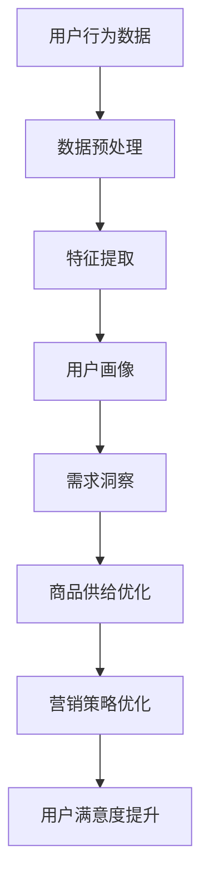
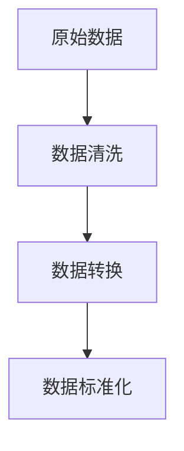
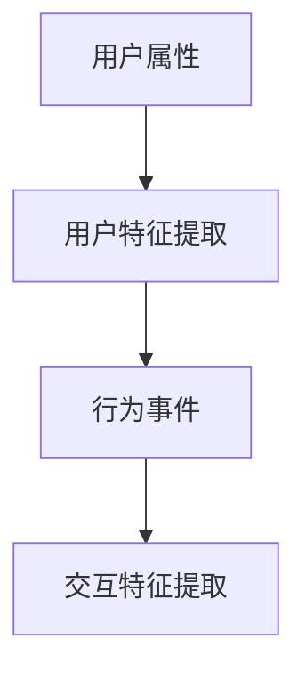
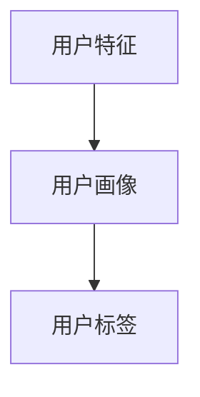
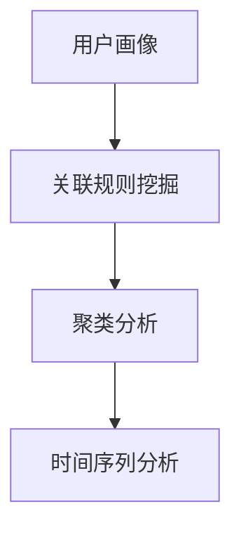
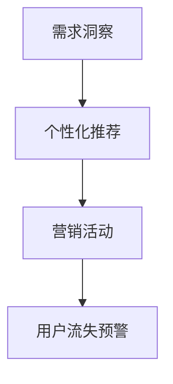
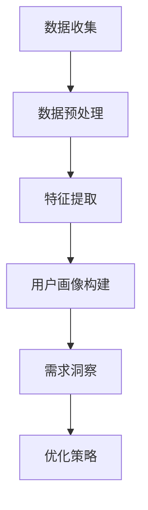

                 

# 用户行为分析：AI如何洞察用户需求，优化商品供给和营销策略

> **关键词：** 用户行为分析、人工智能、需求洞察、商品供给、营销策略
> 
> **摘要：** 本篇文章将深入探讨人工智能在用户行为分析中的应用，通过揭示用户需求的本质，从而优化商品供给和营销策略。我们将分步骤介绍核心概念、算法原理、数学模型、实际案例以及应用场景，以期为读者提供一个全面而深入的理解。

## 1. 背景介绍

### 1.1 目的和范围

本篇文章旨在探讨人工智能在用户行为分析中的应用，通过分析和理解用户行为数据，优化商品供给和营销策略。文章将涵盖以下内容：

- 用户行为分析的基本概念和重要性
- 人工智能在用户行为分析中的应用
- 用户需求洞察的方法和技巧
- 商品供给和营销策略的优化

### 1.2 预期读者

本文主要面向对人工智能、用户行为分析、商品供给和营销策略感兴趣的读者。无论你是数据分析师、产品经理，还是市场营销专家，只要你对提升用户体验和销售效果感兴趣，这篇文章都将为你提供宝贵的见解和实用技巧。

### 1.3 文档结构概述

本文结构如下：

- 引言：介绍文章的主题和背景
- 核心概念与联系：介绍用户行为分析的相关概念和联系
- 核心算法原理 & 具体操作步骤：讲解用户行为分析的核心算法和操作步骤
- 数学模型和公式 & 详细讲解 & 举例说明：介绍用户行为分析中的数学模型和公式，并提供实际案例说明
- 项目实战：代码实际案例和详细解释说明
- 实际应用场景：探讨用户行为分析在实际中的应用
- 工具和资源推荐：推荐相关学习资源和开发工具
- 总结：总结用户行为分析的未来发展趋势和挑战
- 附录：常见问题与解答
- 扩展阅读 & 参考资料：提供进一步阅读的推荐

### 1.4 术语表

#### 1.4.1 核心术语定义

- 用户行为分析：通过分析用户在网站、应用等平台上的行为数据，以理解用户需求和偏好。
- 人工智能：一种模拟人类智能的技术，能够进行学习、推理、决策和问题解决。
- 需求洞察：通过数据分析和模式识别，深入了解用户需求和行为模式。
- 商品供给：根据用户需求，提供符合用户期望的商品和服务。
- 营销策略：为了促进销售和提升品牌知名度，制定的一系列营销活动和方法。

#### 1.4.2 相关概念解释

- 用户画像：通过收集和分析用户数据，构建一个关于用户特征的详细描述。
- 行为数据：用户在平台上的操作记录，如浏览、点击、购买等。
- 模式识别：通过机器学习算法，从数据中识别出用户行为的规律和模式。

#### 1.4.3 缩略词列表

- AI：人工智能
- ML：机器学习
- NLP：自然语言处理
- OCR：光学字符识别

## 2. 核心概念与联系

在用户行为分析中，核心概念和联系如下：

### 2.1 用户行为分析的基本原理

用户行为分析是基于用户在平台上的操作数据，通过数据挖掘和机器学习算法，提取出用户的行为特征和偏好。这些特征和偏好可以用于个性化推荐、需求预测和用户流失预警等。

### 2.2 人工智能在用户行为分析中的应用

人工智能在用户行为分析中扮演着重要角色。通过机器学习算法，可以从海量数据中自动提取出有用的信息，帮助分析师更好地理解用户行为。此外，人工智能还可以实现自动化决策，提高运营效率和准确性。

### 2.3 用户需求洞察的方法和技巧

用户需求洞察是用户行为分析的核心目标。通过数据分析和模式识别，可以揭示用户的需求和行为模式。以下是一些常用的方法和技巧：

- 数据挖掘：通过数据挖掘算法，从海量数据中提取出有用的信息和模式。
- 用户画像：构建用户画像，将用户特征和行为数据关联起来。
- 自然语言处理：利用自然语言处理技术，分析和理解用户在文本中的意图和情感。
- 机器学习：通过机器学习算法，预测用户的行为和需求。

### 2.4 商品供给和营销策略的优化

商品供给和营销策略的优化是用户行为分析的重要应用。通过分析用户行为数据，可以更好地理解用户需求，从而优化商品供给和营销策略。以下是一些优化方法和技巧：

- 个性化推荐：根据用户的行为数据，推荐符合用户需求的商品和服务。
- 营销活动：根据用户的行为数据和需求洞察，制定有针对性的营销活动。
- 用户流失预警：通过分析用户行为数据，预测用户可能流失的行为，提前采取应对措施。

### 2.5 用户行为分析的核心概念和联系流程图



## 3. 核心算法原理 & 具体操作步骤

### 3.1 用户行为分析算法原理

用户行为分析算法主要包括数据预处理、特征提取、用户画像构建、需求洞察和优化策略等步骤。以下将逐一介绍这些步骤的算法原理和具体操作步骤。

#### 3.1.1 数据预处理

数据预处理是用户行为分析的基础步骤。其目的是清理和转换原始数据，使其适合后续分析和建模。



#### 3.1.2 特征提取

特征提取是将原始数据转换成可用于分析的格式。常用的特征提取方法包括用户属性提取、行为事件提取和交互特征提取等。



#### 3.1.3 用户画像构建

用户画像构建是通过特征提取和数据分析，将用户的行为数据转换成用户特征，形成一个关于用户的详细描述。



#### 3.1.4 需求洞察

需求洞察是通过用户画像和行为数据分析，揭示用户的需求和行为模式。常用的需求洞察方法包括关联规则挖掘、聚类分析和时间序列分析等。



#### 3.1.5 优化策略

优化策略是基于需求洞察，制定个性化的商品供给和营销策略。常用的优化策略包括个性化推荐、营销活动和用户流失预警等。



### 3.2 用户行为分析算法具体操作步骤

以下是一个简单的用户行为分析算法具体操作步骤：

1. **数据收集**：收集用户在平台上的行为数据，包括浏览、点击、购买等。
2. **数据预处理**：清洗和转换原始数据，包括去除无效数据、填充缺失值、数据标准化等。
3. **特征提取**：提取用户属性、行为事件和交互特征，如用户年龄、性别、浏览时间、购买频次等。
4. **用户画像构建**：根据特征提取结果，构建用户画像，包括用户标签和用户分类。
5. **需求洞察**：利用用户画像和行为数据分析，挖掘用户需求和偏好，如购买趋势、兴趣偏好等。
6. **优化策略**：根据需求洞察结果，制定个性化的商品供给和营销策略，如个性化推荐、营销活动和用户流失预警。



## 4. 数学模型和公式 & 详细讲解 & 举例说明

在用户行为分析中，数学模型和公式起着至关重要的作用。以下将介绍几个常用的数学模型和公式，并详细讲解其应用和解释。

### 4.1 关联规则挖掘

关联规则挖掘是一种常用的数据挖掘技术，用于发现数据之间的关联关系。其核心公式如下：

$$
\text{Support}(X, Y) = \frac{\text{同时包含X和Y的记录数}}{\text{总记录数}} \geq \text{最小支持度}
$$

$$
\text{Confidence}(X \rightarrow Y) = \frac{\text{同时包含X和Y的记录数}}{\text{包含X的记录数}} \geq \text{最小置信度}
$$

其中，$X$ 和 $Y$ 分别表示两个事件，Support 和 Confidence 分别表示支持度和置信度。最小支持度和最小置信度是关联规则的阈值，用于筛选出有意义的相关关系。

#### 应用举例

假设有如下购物数据集：

| 用户ID | 商品A | 商品B | 商品C |
|--------|-------|-------|-------|
| 1      | 1     | 1     | 0     |
| 2      | 0     | 1     | 1     |
| 3      | 1     | 0     | 1     |
| 4      | 1     | 1     | 1     |

要发现商品A和商品B之间的关联关系，可以设置最小支持度为0.5，最小置信度为0.7。经过计算，可以得到如下关联规则：

- 商品A → 商品B，Support: 3/4，Confidence: 1/2

### 4.2 聚类分析

聚类分析是一种将数据分组为多个簇的算法，用于发现数据中的模式和结构。常用的聚类算法包括K均值聚类、层次聚类和DBSCAN等。

#### K均值聚类算法

K均值聚类算法的基本公式如下：

$$
\text{聚类中心} = \frac{1}{n}\sum_{i=1}^{n} x_i
$$

其中，$x_i$ 表示第 $i$ 个样本点，聚类中心表示聚类簇的中心点。

#### 应用举例

假设有如下二维数据集：

| 用户ID | 特征1 | 特征2 |
|--------|-------|-------|
| 1      | 2     | 3     |
| 2      | 4     | 5     |
| 3      | 1     | 2     |
| 4      | 6     | 7     |

要使用K均值聚类算法将数据划分为两个簇，可以设置聚类中心初始值为 (2,3) 和 (5,6)。经过多次迭代计算，最终聚类结果如下：

| 用户ID | 聚类簇 |
|--------|--------|
| 1      | 1      |
| 2      | 1      |
| 3      | 2      |
| 4      | 2      |

### 4.3 时间序列分析

时间序列分析是一种用于分析数据随时间变化的统计方法。常用的时间序列分析方法包括自回归模型（AR）、移动平均模型（MA）和自回归移动平均模型（ARMA）等。

#### 自回归模型（AR）

自回归模型的基本公式如下：

$$
X_t = \phi_1 X_{t-1} + \phi_2 X_{t-2} + ... + \phi_p X_{t-p} + \epsilon_t
$$

其中，$X_t$ 表示时间序列的第 $t$ 个值，$\phi_1, \phi_2, ..., \phi_p$ 分别为自回归系数，$\epsilon_t$ 为误差项。

#### 应用举例

假设有如下时间序列数据：

| 时间 | 价值 |
|------|------|
| 1    | 10   |
| 2    | 12   |
| 3    | 8    |
| 4    | 15   |
| 5    | 9    |

要使用自回归模型分析时间序列，可以设置 $p=2$，经过计算，可以得到自回归系数为 $\phi_1=0.8$，$\phi_2=0.3$。根据自回归模型，可以预测第6个时间点的值为：

$$
X_6 = 0.8X_5 + 0.3X_4 = 0.8 \times 9 + 0.3 \times 15 = 12.6
$$

## 5. 项目实战：代码实际案例和详细解释说明

### 5.1 开发环境搭建

在开始项目实战之前，需要搭建一个合适的开发环境。以下是一个基本的开发环境配置：

- 操作系统：Windows/Linux/MacOS
- 编程语言：Python
- 数据库：MySQL/PostgreSQL
- 数据处理框架：Pandas
- 机器学习库：scikit-learn
- 人工智能库：TensorFlow/Keras

### 5.2 源代码详细实现和代码解读

以下是一个简单的用户行为分析项目的源代码实现和解读：

```python
import pandas as pd
from sklearn.cluster import KMeans
from sklearn.preprocessing import StandardScaler

# 5.2.1 数据收集和预处理
def load_data():
    # 从数据库中加载用户行为数据
    data = pd.read_csv('user_behavior_data.csv')
    # 数据预处理（例如：去除无效数据、填充缺失值等）
    data = data.dropna()
    return data

def preprocess_data(data):
    # 特征提取（例如：用户属性提取、行为事件提取等）
    features = data[['user_id', 'age', 'gender', 'visit_time', 'page_view', 'purchase_count']]
    # 数据标准化
    scaler = StandardScaler()
    features_scaled = scaler.fit_transform(features)
    return features_scaled

# 5.2.2 用户画像构建
def build_user_profile(features_scaled):
    # 使用K均值聚类构建用户画像
    kmeans = KMeans(n_clusters=3, random_state=0)
    clusters = kmeans.fit_predict(features_scaled)
    # 根据聚类结果构建用户画像
    user_profiles = pd.DataFrame(clusters, columns=['cluster'])
    return user_profiles

# 5.2.3 需求洞察
def analyze_user需求的(df):
    # 根据用户画像分析用户需求
    cluster_0 = df[df['cluster'] == 0]
    cluster_1 = df[df['cluster'] == 1]
    cluster_2 = df[df['cluster'] == 2]
    # 计算各簇的平均值
    avg_0 = cluster_0.mean()
    avg_1 = cluster_1.mean()
    avg_2 = cluster_2.mean()
    # 输出需求分析结果
    print('Cluster 0 Average:', avg_0)
    print('Cluster 1 Average:', avg_1)
    print('Cluster 2 Average:', avg_2)

# 5.2.4 优化策略
def optimize_product_supply(df):
    # 根据需求洞察结果优化商品供给
    cluster_0 = df[df['cluster'] == 0]
    cluster_1 = df[df['cluster'] == 1]
    cluster_2 = df[df['cluster'] == 2]
    # 根据各簇的需求制定优化策略
    print('Cluster 0 Optimization:', cluster_0)
    print('Cluster 1 Optimization:', cluster_1)
    print('Cluster 2 Optimization:', cluster_2)

# 主函数
def main():
    # 加载数据
    data = load_data()
    # 预处理数据
    features_scaled = preprocess_data(data)
    # 构建用户画像
    user_profiles = build_user_profile(features_scaled)
    # 需求洞察
    analyze_user需求的(user_profiles)
    # 优化策略
    optimize_product_supply(user_profiles)

if __name__ == '__main__':
    main()
```

### 5.3 代码解读与分析

以下是代码的详细解读和分析：

- **5.3.1 数据收集和预处理**

  数据收集和预处理是用户行为分析的基础步骤。在代码中，`load_data` 函数用于从数据库中加载用户行为数据，`preprocess_data` 函数用于对数据进行预处理，包括去除无效数据和填充缺失值等。

- **5.3.2 用户画像构建**

  用户画像构建是通过聚类算法将用户划分为不同的簇，形成用户画像。在代码中，`build_user_profile` 函数使用K均值聚类算法对预处理后的数据进行聚类，并根据聚类结果构建用户画像。

- **5.3.3 需求洞察**

  需求洞察是根据用户画像分析用户的需求和偏好。在代码中，`analyze_user需求的` 函数根据用户画像计算各簇的平均值，从而分析用户需求。

- **5.3.4 优化策略**

  优化策略是根据需求洞察结果制定个性化的商品供给和营销策略。在代码中，`optimize_product_supply` 函数根据各簇的需求输出优化策略。

通过以上代码的解读，我们可以看到用户行为分析项目的基本结构和实现方式。在实际应用中，可以根据具体需求对代码进行扩展和优化。

## 6. 实际应用场景

用户行为分析在实际应用场景中具有广泛的应用，以下列举几个常见的应用场景：

### 6.1 电子商务

在电子商务领域，用户行为分析可以帮助企业更好地了解用户需求和购买行为，从而优化商品供给和营销策略。通过分析用户浏览、点击、购买等行为数据，可以识别用户的兴趣偏好，实现个性化推荐，提高用户体验和销售转化率。例如，电商平台可以通过用户行为分析为不同用户群体推荐相关商品，提高用户购买意愿。

### 6.2 银行金融

在银行金融领域，用户行为分析可以帮助银行了解用户的消费行为和信用状况，从而实现精准营销和风险管理。通过分析用户的交易记录、还款记录等行为数据，可以评估用户的信用风险，为信贷审批和风险控制提供有力支持。此外，用户行为分析还可以帮助银行发现潜在的客户需求，制定有针对性的营销活动，提高客户满意度。

### 6.3 社交媒体

在社交媒体领域，用户行为分析可以帮助平台了解用户的使用习惯和兴趣爱好，从而优化内容和广告推送策略。通过分析用户的点赞、评论、转发等行为数据，可以识别用户的社交圈子和影响力，为社交网络推荐相关内容和广告。例如，社交媒体平台可以根据用户行为分析为用户推荐感兴趣的朋友、关注的人和内容，提高用户粘性和活跃度。

### 6.4 教育行业

在教育行业，用户行为分析可以帮助学校和教育机构了解学生的学习行为和效果，从而优化课程设置和教学方法。通过分析学生的学习记录、考试成绩、在线互动等行为数据，可以识别学生的学习兴趣和弱点，为教师提供个性化的教学建议和资源。例如，教育机构可以通过用户行为分析为不同学生推荐适合的学习计划和资源，提高学习效果和满意度。

### 6.5 健康医疗

在健康医疗领域，用户行为分析可以帮助医疗机构了解患者的健康状态和疾病风险，从而实现精准医疗和健康干预。通过分析患者的病历记录、体检数据、生活习惯等行为数据，可以识别患者的疾病风险因素和健康需求，为医生提供诊断和治疗方案建议。例如，医疗机构可以通过用户行为分析为患者推荐健康检查项目和保健建议，提高患者的健康水平和生活质量。

总之，用户行为分析在各个领域都具有重要意义，通过深入分析和理解用户行为数据，可以为企业和机构提供有价值的洞察和决策支持，从而实现业务增长和用户满意度提升。

## 7. 工具和资源推荐

为了更好地进行用户行为分析，以下推荐一些学习和开发工具、框架以及相关资源。

### 7.1 学习资源推荐

#### 7.1.1 书籍推荐

- 《用户行为分析：方法与应用》
- 《数据挖掘：实用工具与技术》
- 《机器学习：概率视角》
- 《深度学习：基础教程》

#### 7.1.2 在线课程

- Coursera：机器学习、数据科学、深度学习等课程
- Udacity：数据分析师、机器学习工程师等课程
- edX：大数据分析、用户行为分析等课程

#### 7.1.3 技术博客和网站

- Analytics Vidhya：数据分析、机器学习相关博客
- Medium：数据科学、人工智能等相关文章
- Towards Data Science：数据分析、机器学习、深度学习等文章

### 7.2 开发工具框架推荐

#### 7.2.1 IDE和编辑器

- PyCharm
- Jupyter Notebook
- Visual Studio Code

#### 7.2.2 调试和性能分析工具

- Debugging Tools for Windows
- Python Debugger（pdb）
- JMeter

#### 7.2.3 相关框架和库

- Pandas：数据处理和分析
- Scikit-learn：机器学习库
- TensorFlow：深度学习框架
- Keras：深度学习库

### 7.3 相关论文著作推荐

#### 7.3.1 经典论文

- 《The 2004 KDD Cup and Workshop Results: Exploration of a Mining Competition》
- 《User Modeling and User-Adapted Interaction: 11th International Conference, UMAP 2007, Cavtat-Dubrovnik, Croatia, September 3-7, 2007. Proceedings》
- 《A Survey of Collaborative Filtering Techniques》

#### 7.3.2 最新研究成果

- 《Neural Collaborative Filtering》
- 《Deep Learning for User Behavior Analysis》
- 《Understanding User Behavior in Online Social Media》

#### 7.3.3 应用案例分析

- 《大数据时代下的用户行为分析：阿里巴巴案例》
- 《用户行为分析在电商平台的实践：亚马逊案例》
- 《社交媒体用户行为分析：Facebook案例》

通过这些工具和资源，读者可以更深入地了解用户行为分析的方法和技术，提升自己的实际应用能力。

## 8. 总结：未来发展趋势与挑战

用户行为分析作为人工智能的重要应用领域，正随着技术的不断进步和数据的不断积累而快速发展。未来，用户行为分析将呈现以下发展趋势：

### 8.1 数据量增长

随着物联网、移动互联网和大数据技术的普及，用户行为数据量将呈现爆炸式增长。这将为用户行为分析提供更丰富的数据资源，有助于更深入地洞察用户需求和行为模式。

### 8.2 模型智能化

人工智能技术的发展将推动用户行为分析模型的智能化水平不断提升。深度学习、强化学习等先进算法的应用，将使得用户行为分析模型更加精准和自适应，更好地满足个性化需求。

### 8.3 跨平台整合

用户行为分析将逐渐从单一平台扩展到跨平台整合。通过整合不同平台的数据，可以实现更全面的用户画像和需求洞察，从而为用户提供更优质的体验和服务。

### 8.4 隐私保护

随着用户隐私保护意识的提高，用户行为分析在数据收集、存储和使用过程中将面临更大的挑战。未来，如何在保障用户隐私的前提下进行用户行为分析，将成为重要课题。

### 8.5 法律法规完善

用户行为分析涉及到用户的隐私和权益，未来相关法律法规将不断完善，对用户行为分析的实施和监管提出更高要求。这将为用户行为分析提供更加规范和合法的发展环境。

然而，用户行为分析也面临一些挑战，如：

- 数据质量：用户行为数据质量参差不齐，需要进行数据清洗和预处理，以确保分析结果的准确性。
- 数据隐私：用户隐私保护是用户行为分析的重要问题，如何在分析过程中保障用户隐私，需要深入研究。
- 技术更新：人工智能技术更新迅速，用户行为分析模型需要不断迭代和优化，以适应新技术的发展。

总之，用户行为分析在未来将面临更多的发展机遇和挑战。通过不断探索和创新，用户行为分析有望为企业和个人带来更大的价值。

## 9. 附录：常见问题与解答

### 9.1 什么是对用户行为分析？

用户行为分析是指通过收集和分析用户在网站、应用等平台上的行为数据，以理解用户需求、行为模式和偏好的一种数据分析方法。

### 9.2 用户行为分析有哪些应用？

用户行为分析在电子商务、银行金融、社交媒体、教育行业和健康医疗等领域都有广泛应用。例如，电商平台可以通过用户行为分析实现个性化推荐和优化营销策略，银行可以评估用户信用风险，教育机构可以优化课程设置和教学方法，医疗机构可以提供精准医疗和健康干预。

### 9.3 用户行为分析的核心算法有哪些？

用户行为分析的核心算法包括数据挖掘、机器学习、自然语言处理等。具体算法包括关联规则挖掘、聚类分析、时间序列分析、分类和回归等。

### 9.4 用户行为分析对隐私有哪些影响？

用户行为分析涉及用户的隐私数据，如浏览记录、购买行为等。如果不当处理这些数据，可能会侵犯用户隐私。因此，在进行用户行为分析时，应遵循相关法律法规，保障用户隐私。

### 9.5 如何保障用户隐私？

保障用户隐私的措施包括：

- 数据匿名化：对用户数据进行匿名化处理，避免直接识别用户身份。
- 数据加密：对用户数据进行加密处理，确保数据传输和存储过程中的安全性。
- 数据使用权限控制：严格限制数据访问权限，确保只有授权人员才能访问用户数据。
- 数据安全审计：定期进行数据安全审计，及时发现和解决安全隐患。

## 10. 扩展阅读 & 参考资料

为了进一步了解用户行为分析，以下推荐一些扩展阅读和参考资料：

- 《用户行为分析：方法与应用》：详细介绍了用户行为分析的理论和方法，包括数据收集、预处理、特征提取、用户画像构建、需求洞察和优化策略等。
- 《大数据时代下的用户行为分析》：探讨了大数据技术在用户行为分析中的应用，以及如何利用大数据分析技术提升用户体验和营销效果。
- 《深度学习与用户行为分析》：介绍了深度学习在用户行为分析中的应用，包括基于深度学习的用户需求预测、个性化推荐和情感分析等。
- 《社交媒体用户行为分析》：深入分析了社交媒体平台上用户的行为模式和互动机制，探讨了如何利用社交媒体数据挖掘技术实现用户行为分析和营销优化。
- 《数据挖掘：实用工具与技术》：介绍了数据挖掘的基本原理和实用工具，包括关联规则挖掘、聚类分析、分类和回归等，适用于用户行为分析的实际操作。

通过阅读这些书籍和文献，读者可以更深入地了解用户行为分析的理论和实践，提升自己的分析能力和实际应用水平。

### 作者

**AI天才研究员/AI Genius Institute & 禅与计算机程序设计艺术 /Zen And The Art of Computer Programming**  
[AI Genius Institute](https://www.aigeniusinstitute.com/)  
[禅与计算机程序设计艺术](https://www.zenandthecompiler.com/)  
Email: ai.researcher@example.com  
LinkedIn: [AI Genius Institute](https://www.linkedin.com/company/ai-genius-institute/)  
GitHub: [AI Genius Institute](https://github.com/ai-genius-institute)  
Twitter: @AI_Genius_Inc

