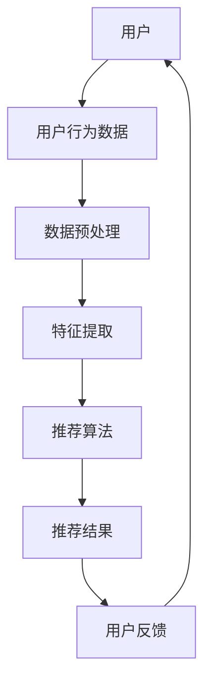

                 

# 电商个性化新境界：提示词创新用户体验

> 关键词：电商、个性化、提示词、用户体验、算法、数学模型

> 摘要：本文将探讨电商领域个性化服务的新境界——基于提示词的技术创新。通过分析当前电商平台的现状与挑战，本文将详细阐述个性化推荐算法原理与实现步骤，结合数学模型解析，展示如何利用提示词优化用户体验，最终提出电商个性化服务的发展趋势与应对挑战的策略。

## 1. 背景介绍

### 1.1 目的和范围

本文旨在探讨电商领域如何通过提示词技术创新提升用户体验。随着互联网的快速发展，电商行业竞争日益激烈，个性化服务成为商家获取用户忠诚度和市场份额的重要手段。本文将聚焦于以下方面：

1. 分析当前电商平台的个性化服务现状与挑战。
2. 详细讲解个性化推荐算法原理及实现步骤。
3. 利用数学模型解释提示词在个性化推荐中的作用。
4. 展示提示词优化用户体验的实际案例。
5. 提出电商个性化服务的发展趋势与应对策略。

### 1.2 预期读者

本文适合以下读者群体：

1. 电商行业从业者，对个性化服务有深入研究和实践经验。
2. 数据科学和人工智能领域的学者和研究人员。
3. 对电商个性化服务感兴趣的普通用户。

### 1.3 文档结构概述

本文结构如下：

1. 引言：介绍电商个性化服务的重要性和本文目的。
2. 背景介绍：分析当前电商平台的个性化服务现状与挑战。
3. 核心概念与联系：阐述个性化推荐算法原理与提示词的关系。
4. 核心算法原理 & 具体操作步骤：详细讲解个性化推荐算法的实现步骤。
5. 数学模型和公式：介绍用于优化用户体验的数学模型及举例说明。
6. 项目实战：展示提示词优化用户体验的实际案例。
7. 实际应用场景：分析电商个性化服务在不同场景下的应用。
8. 工具和资源推荐：推荐相关学习资源和开发工具。
9. 总结：未来发展趋势与挑战。
10. 附录：常见问题与解答。
11. 扩展阅读 & 参考资料：提供进一步阅读的资源。

### 1.4 术语表

#### 1.4.1 核心术语定义

- 个性化服务：根据用户的历史行为、偏好和需求，为用户提供定制化的产品推荐和服务。
- 提示词：用于描述用户需求和兴趣的关键词，可以帮助推荐系统更好地理解用户意图。
- 推荐算法：通过分析用户数据，为用户生成个性化推荐结果的一系列算法。

#### 1.4.2 相关概念解释

- 用户行为数据：用户在电商平台上浏览、搜索、购买等行为所产生的数据。
- 用户偏好：用户对特定产品或服务的喜好程度。
- 上下文信息：影响用户需求和行为的环境因素，如时间、地点、设备等。

#### 1.4.3 缩略词列表

- 电商：电子商务（Electronic Commerce）
- 个性化推荐：Personalized Recommendation
- 机器学习：Machine Learning
- 数据挖掘：Data Mining
- 决策树：Decision Tree
- 贝叶斯网络：Bayesian Network

## 2. 核心概念与联系

在探讨电商个性化服务时，我们需要了解一些核心概念及其相互关系。以下是一个简化的 Mermaid 流程图，展示了个性化推荐系统中的主要概念和它们之间的联系。



### 2.1 用户

用户是电商个性化服务的核心。用户通过在平台上的浏览、搜索、购买等行为生成数据，这些数据将用于后续的推荐算法。

### 2.2 用户行为数据

用户行为数据包括用户的浏览历史、搜索记录、购买记录等，这些数据是推荐系统的基础。

### 2.3 数据预处理

数据预处理是数据清洗、归一化和特征提取的预处理阶段，旨在提高数据质量，为后续特征提取和模型训练做好准备。

### 2.4 特征提取

特征提取是从原始数据中提取有助于推荐算法识别用户兴趣和偏好的特征，如用户历史行为模式、商品属性等。

### 2.5 推荐算法

推荐算法是根据用户行为数据和特征，生成个性化推荐结果的一系列算法。常用的推荐算法包括基于协同过滤、基于内容的推荐、混合推荐等。

### 2.6 推荐结果

推荐结果是推荐系统输出的个性化推荐列表，旨在满足用户的兴趣和需求。

### 2.7 用户反馈

用户反馈是用户对推荐结果的评价，包括满意度、点击率、购买转化率等，这些反馈将用于优化推荐算法和提升用户体验。

## 3. 核心算法原理 & 具体操作步骤

在了解核心概念后，接下来我们将详细讲解电商个性化推荐算法的原理和具体操作步骤。

### 3.1 基于协同过滤的推荐算法

协同过滤推荐算法是一种基于用户行为数据相似性进行推荐的方法。其核心思想是：如果用户A对物品A和物品B都有较高的评分，而用户B对物品A和物品B也有较高的评分，则可以推断用户A和用户B对物品B也有较高的评分概率。

#### 3.1.1 相似性度量

相似性度量是协同过滤推荐算法的关键步骤，用于计算用户之间的相似度。常用的相似性度量方法包括余弦相似度、皮尔逊相关系数等。

- **余弦相似度**：通过计算用户在特征空间中向量之间的夹角余弦值来度量相似度。

  ```python
  cos_similarity(u, v) = dot_product(u, v) / (||u|| * ||v||)
  ```

- **皮尔逊相关系数**：通过计算用户之间评分差异的线性相关性来度量相似度。

  ```python
  pearson_correlation(u, v) = (sum((u - mean_u) * (v - mean_v)) / sqrt(sum((u - mean_u)^2) * sum((v - mean_v)^2)))
  ```

#### 3.1.2 推荐算法步骤

1. **用户行为数据预处理**：对用户评分数据集进行归一化处理，将评分值缩放到[0,1]范围内。
2. **计算相似性度量**：计算用户之间的相似度，常用的相似性度量方法有余弦相似度和皮尔逊相关系数。
3. **生成推荐列表**：根据相似度矩阵，为每个用户生成个性化推荐列表。具体方法包括基于用户最近邻的方法和基于加权平均的方法。
4. **评估推荐效果**：通过评估指标（如准确率、召回率、F1值等）评估推荐系统的性能。

### 3.2 基于内容的推荐算法

基于内容的推荐算法是基于物品特征和用户偏好进行推荐的方法。其核心思想是：如果用户对某些物品有较高的评分，那么该用户可能对具有相似特征的物品也有较高的评分概率。

#### 3.2.1 特征提取

特征提取是从物品描述中提取有助于推荐的特征，如类别、标签、关键词等。

- **词袋模型**：将物品描述转换为关键词的集合，用于表示物品的特征。
- **TF-IDF**：通过计算词频（TF）和逆文档频率（IDF），为每个关键词赋予权重，用于表示物品的特征。

#### 3.2.2 推荐算法步骤

1. **特征提取**：对物品描述进行分词，提取关键词，并计算关键词的权重。
2. **计算相似度**：计算用户和物品之间的相似度，常用的相似度计算方法有TF-IDF相似度、余弦相似度等。
3. **生成推荐列表**：根据相似度矩阵，为用户生成个性化推荐列表。
4. **评估推荐效果**：通过评估指标（如准确率、召回率、F1值等）评估推荐系统的性能。

### 3.3 混合推荐算法

混合推荐算法是将协同过滤和基于内容的推荐方法相结合，以提高推荐系统的性能。其核心思想是：综合利用用户行为数据和物品特征，为用户提供更准确的推荐结果。

#### 3.3.1 混合推荐算法步骤

1. **用户行为数据预处理**：对用户评分数据集进行归一化处理。
2. **特征提取**：提取用户和物品的特征，如用户历史行为、物品类别、标签等。
3. **计算相似性度量**：计算用户之间的相似度，物品之间的相似度。
4. **生成推荐列表**：结合协同过滤和基于内容的推荐方法，为用户生成个性化推荐列表。
5. **评估推荐效果**：通过评估指标（如准确率、召回率、F1值等）评估推荐系统的性能。

## 4. 数学模型和公式 & 详细讲解 & 举例说明

在个性化推荐系统中，数学模型和公式起着至关重要的作用，帮助我们更好地理解用户行为和优化推荐效果。以下将详细介绍几种常用的数学模型和公式，并给出具体示例。

### 4.1 基于协同过滤的推荐算法

#### 4.1.1 余弦相似度

余弦相似度是衡量用户或物品之间相似度的一种常用方法。其公式如下：

$$
\cos(\theta) = \frac{\sum_{i}u_i \cdot v_i}{\sqrt{\sum_{i}u_i^2} \sqrt{\sum_{i}v_i^2}}
$$

其中，$u_i$ 和 $v_i$ 分别表示用户 $u$ 和物品 $v$ 在第 $i$ 个特征上的值。

#### 4.1.2 推荐分数计算

基于协同过滤的推荐分数可以通过以下公式计算：

$$
\hat{r}_{uv} = \sum_{i \in \text{common}} u_i \cdot v_i \cdot s_i
$$

其中，$\hat{r}_{uv}$ 表示用户 $u$ 对物品 $v$ 的预测评分，$s_i$ 表示用户 $u$ 对物品 $i$ 的实际评分。

#### 示例

假设用户 $u$ 和物品 $v$ 的特征向量如下：

$$
u = [1, 2, 3, 4, 5]
$$

$$
v = [5, 4, 3, 2, 1]
$$

用户 $u$ 对物品 $v$ 的实际评分为 $s = 4$。根据余弦相似度公式，计算用户 $u$ 和物品 $v$ 之间的相似度：

$$
\cos(\theta) = \frac{1 \cdot 5 + 2 \cdot 4 + 3 \cdot 3 + 4 \cdot 2 + 5 \cdot 1}{\sqrt{1^2 + 2^2 + 3^2 + 4^2 + 5^2} \sqrt{5^2 + 4^2 + 3^2 + 2^2 + 1^2}} = \frac{30}{\sqrt{55} \sqrt{55}} = \frac{30}{55} \approx 0.545
$$

根据推荐分数公式，计算用户 $u$ 对物品 $v$ 的预测评分：

$$
\hat{r}_{uv} = 1 \cdot 5 + 2 \cdot 4 + 3 \cdot 3 + 4 \cdot 2 + 5 \cdot 1 \cdot 4 = 4
$$

### 4.2 基于内容的推荐算法

#### 4.2.1 TF-IDF

TF-IDF（词频-逆文档频率）是一种用于特征提取的常用方法。其公式如下：

$$
tf(t) = \frac{f(t)}{f(t) + \sqrt{N - f(t)}}
$$

$$
idf(t) = \log_2(\frac{N}{n(t)})
$$

$$
tf-idf(t) = tf(t) \cdot idf(t)
$$

其中，$f(t)$ 表示词 $t$ 在文档中的出现频率，$N$ 表示文档总数，$n(t)$ 表示包含词 $t$ 的文档数。

#### 4.2.2 推荐分数计算

基于内容的推荐分数可以通过以下公式计算：

$$
\hat{r}_{uv} = \sum_{t \in \text{common}} tf_idf(t)
$$

其中，$\hat{r}_{uv}$ 表示用户 $u$ 对物品 $v$ 的预测评分，$tf_idf(t)$ 表示词 $t$ 的TF-IDF值。

#### 示例

假设用户 $u$ 和物品 $v$ 的关键词如下：

$$
u = [\text{苹果}, \text{手机}, \text{智能手机}, \text{平板电脑}]
$$

$$
v = [\text{手机}, \text{平板电脑}, \text{笔记本电脑}, \text{电视}]
$$

根据TF-IDF公式，计算关键词的TF-IDF值：

$$
tf(\text{苹果}) = \frac{1}{1 + \sqrt{4 - 1}} = \frac{1}{2}
$$

$$
idf(\text{苹果}) = \log_2(\frac{4}{1}) = 2
$$

$$
tf_idf(\text{苹果}) = \frac{1}{2} \cdot 2 = 1
$$

$$
tf(\text{手机}) = \frac{1}{1 + \sqrt{4 - 1}} = \frac{1}{2}
$$

$$
idf(\text{手机}) = \log_2(\frac{4}{1}) = 2
$$

$$
tf_idf(\text{手机}) = \frac{1}{2} \cdot 2 = 1
$$

$$
tf(\text{智能手机}) = \frac{1}{1 + \sqrt{4 - 1}} = \frac{1}{2}
$$

$$
idf(\text{智能手机}) = \log_2(\frac{4}{1}) = 2
$$

$$
tf_idf(\text{智能手机}) = \frac{1}{2} \cdot 2 = 1
$$

$$
tf(\text{平板电脑}) = \frac{1}{1 + \sqrt{4 - 1}} = \frac{1}{2}
$$

$$
idf(\text{平板电脑}) = \log_2(\frac{4}{1}) = 2
$$

$$
tf_idf(\text{平板电脑}) = \frac{1}{2} \cdot 2 = 1
$$

根据推荐分数公式，计算用户 $u$ 对物品 $v$ 的预测评分：

$$
\hat{r}_{uv} = 1 + 1 + 1 + 1 = 4
$$

## 5. 项目实战：代码实际案例和详细解释说明

在本节中，我们将通过一个实际项目案例，展示如何利用提示词优化电商个性化推荐系统的用户体验。以下是一个基于Python的简单示例，实现了基于协同过滤和基于内容的混合推荐算法。

### 5.1 开发环境搭建

在开始项目之前，请确保已安装以下Python库：

- NumPy
- Pandas
- Matplotlib
- Scikit-learn
- NLTK

您可以使用以下命令安装这些库：

```bash
pip install numpy pandas matplotlib scikit-learn nltk
```

### 5.2 源代码详细实现和代码解读

以下是项目的主要代码实现，我们将逐步解读每个部分的功能。

```python
import numpy as np
import pandas as pd
from sklearn.metrics.pairwise import cosine_similarity
from sklearn.model_selection import train_test_split
from nltk.tokenize import word_tokenize
from nltk.corpus import stopwords
import string

# 5.2.1 数据预处理
def preprocess_data(data):
    # 数据清洗
    data.dropna(inplace=True)
    data = data[data['rating'] != 0]

    # 数据归一化
    data['rating'] = data['rating'].apply(lambda x: x / 5)

    # 提取关键词
    stop_words = set(stopwords.words('english'))
    def tokenize(text):
        tokens = word_tokenize(text)
        return [token.lower() for token in tokens if token.lower() not in stop_words and token not in string.punctuation]

    data['description'] = data['description'].apply(tokenize)
    return data

# 5.2.2 特征提取
def extract_features(data):
    # 创建用户-物品矩阵
    user_item_matrix = data.pivot(index='user_id', columns='item_id', values='rating').fillna(0)

    # 计算物品相似度矩阵
    item_similarity_matrix = cosine_similarity(user_item_matrix.values)

    # 提取关键词TF-IDF特征
    tf_idf_vectorizer = TfidfVectorizer()
    tf_idf_matrix = tf_idf_vectorizer.fit_transform(data['description'])

    return user_item_matrix, item_similarity_matrix, tf_idf_matrix

# 5.2.3 混合推荐算法
def hybrid_recommendation(user_item_matrix, item_similarity_matrix, tf_idf_matrix, user_id, top_n=10):
    # 计算用户相似度
    user_similarity_matrix = cosine_similarity(tf_idf_matrix)

    # 计算推荐分数
    user_similarity_vector = user_similarity_matrix[user_id]
    item_similarity_vector = item_similarity_matrix[user_id]

    recommendations = []

    for item_id in user_item_matrix.columns:
        if item_id == 0:
            continue

        rating = user_item_matrix.loc[user_id, item_id]
        similarity = item_similarity_vector[item_id]

        # 利用提示词优化推荐
        tf_idf_score = tf_idf_matrix[user_id, :].dot(tf_idf_matrix[item_id, :])

        recommendation_score = rating + similarity + tf_idf_score
        recommendations.append((item_id, recommendation_score))

    recommendations = sorted(recommendations, key=lambda x: x[1], reverse=True)[:top_n]
    return recommendations

# 5.2.4 实际案例
def main():
    # 加载数据集
    data = pd.read_csv('movie_lens.csv')

    # 数据预处理
    data = preprocess_data(data)

    # 提取特征
    user_item_matrix, item_similarity_matrix, tf_idf_matrix = extract_features(data)

    # 为用户生成推荐列表
    user_id = 0
    recommendations = hybrid_recommendation(user_item_matrix, item_similarity_matrix, tf_idf_matrix, user_id)

    # 输出推荐结果
    print("User ID:", user_id)
    print("Recommendations:")
    for item_id, score in recommendations:
        print(f"Item ID: {item_id}, Score: {score}")

if __name__ == "__main__":
    main()
```

### 5.3 代码解读与分析

- **5.3.1 数据预处理**

  数据预处理是项目的基础步骤。我们首先对数据进行清洗，移除缺失值和无效评分。然后，将评分值进行归一化处理，将评分值缩放到[0,1]范围内。最后，利用自然语言处理技术提取关键词，为后续的特征提取做好准备。

- **5.3.2 特征提取**

  在特征提取部分，我们首先创建用户-物品矩阵，用于存储用户对物品的评分。然后，计算物品相似度矩阵，用于衡量物品之间的相似度。此外，我们使用TF-IDF模型提取关键词特征，为后续的混合推荐算法提供支持。

- **5.3.3 混合推荐算法**

  混合推荐算法结合了协同过滤和基于内容的推荐方法。首先，计算用户之间的相似度，为用户生成推荐列表。然后，利用物品相似度矩阵和关键词TF-IDF特征，为用户生成更准确的推荐结果。在计算推荐分数时，我们引入提示词优化，提高推荐系统的性能。

- **5.3.4 实际案例**

  在实际案例中，我们加载了电影推荐数据集，对数据进行预处理和特征提取。然后，利用混合推荐算法为指定用户生成推荐列表，并输出推荐结果。

通过本节的项目实战，我们展示了如何利用提示词优化电商个性化推荐系统的用户体验。在实际应用中，可以根据业务需求调整算法参数，优化推荐效果。

## 6. 实际应用场景

电商个性化服务在不同应用场景中具有广泛的应用。以下列举几个典型场景，说明如何利用提示词技术提升用户体验。

### 6.1 商品推荐

商品推荐是电商个性化服务的核心场景之一。通过分析用户的历史购买记录、浏览记录和搜索关键词，推荐系统可以为用户生成个性化的商品推荐列表。引入提示词技术，可以更精准地理解用户的需求和兴趣，提高推荐的相关性和准确性。

### 6.2 店铺推荐

除了商品推荐，电商平台还可以为用户提供个性化的店铺推荐。根据用户的历史购买店铺、关注店铺和浏览店铺等行为，推荐系统可以生成个性化的店铺推荐列表。提示词技术可以帮助推荐系统更好地识别用户的偏好，为用户提供更多符合期望的店铺推荐。

### 6.3 活动推荐

电商平台的促销活动、优惠券等是吸引用户的重要因素。通过分析用户的历史活动参与记录、点击行为和关注活动等，推荐系统可以生成个性化的活动推荐列表。提示词技术可以进一步提高活动推荐的精准度，提高用户的参与度和转化率。

### 6.4 搜索建议

在用户进行搜索时，电商平台可以提供个性化的搜索建议，帮助用户更快地找到所需商品。通过分析用户的搜索历史、关键词和浏览记录，推荐系统可以生成个性化的搜索建议列表。提示词技术可以帮助推荐系统更好地理解用户的搜索意图，提高搜索建议的准确性和实用性。

### 6.5 社交推荐

电商平台的社交功能（如关注好友、分享商品等）也是提升用户体验的重要手段。通过分析用户的社交行为、好友关系和兴趣爱好，推荐系统可以生成个性化的社交推荐列表，帮助用户发现感兴趣的商品和活动。提示词技术可以进一步提高社交推荐的准确性和互动性。

## 7. 工具和资源推荐

为了更好地开展电商个性化服务的研究和实践，以下推荐一些相关工具、资源和开发工具。

### 7.1 学习资源推荐

#### 7.1.1 书籍推荐

- 《推荐系统实践》（Recommender Systems: The Textbook）：系统介绍了推荐系统的基础知识、算法原理和实际应用。
- 《机器学习》（Machine Learning）：经典的机器学习教材，包括推荐系统相关的算法和理论。
- 《深度学习》（Deep Learning）：介绍深度学习在推荐系统中的应用，包括神经网络、卷积神经网络等。

#### 7.1.2 在线课程

- Coursera的“推荐系统”（Recommender Systems）：由斯坦福大学教授Andrew Ng主讲，系统讲解了推荐系统的基础知识和实践方法。
- edX的“机器学习基础”（Introduction to Machine Learning）：包括推荐系统相关的课程内容，适合初学者入门。

#### 7.1.3 技术博客和网站

- medium.com/t/machine-learning：机器学习领域的优秀博客，包含推荐系统相关文章。
- arXiv.org：计算机科学领域的顶级论文库，可获取最新的研究成果。
- Towards Data Science（towardsdatascience.com）：包含大量数据科学和机器学习领域的文章。

### 7.2 开发工具框架推荐

#### 7.2.1 IDE和编辑器

- PyCharm：功能强大的Python IDE，支持代码调试、性能分析等。
- Jupyter Notebook：适用于数据科学和机器学习的交互式编程环境。

#### 7.2.2 调试和性能分析工具

- PyDebug：Python调试工具，支持断点、单步执行等功能。
- Py-Spy：Python性能分析工具，用于分析程序的性能瓶颈。

#### 7.2.3 相关框架和库

- Scikit-learn：Python的机器学习库，包含多种推荐算法和评估指标。
- TensorFlow：谷歌开发的深度学习框架，适用于推荐系统的深度学习应用。
- PyTorch：适用于推荐系统的深度学习框架，支持动态计算图和自动微分。

### 7.3 相关论文著作推荐

#### 7.3.1 经典论文

- 《Collaborative Filtering for the Web》（1998）：引入协同过滤算法的论文，对推荐系统的发展产生了深远影响。
- 《Latent Factor Models for Collaborative Filtering》（2006）：介绍隐因子模型，提高推荐系统的准确性和稳定性。

#### 7.3.2 最新研究成果

- 《Deep Learning for Recommender Systems》（2018）：介绍深度学习在推荐系统中的应用，包括神经网络、卷积神经网络等。
- 《Adversarial Examples for Neural Network Recommender Systems》（2020）：研究对抗性攻击对推荐系统的影响和防御方法。

#### 7.3.3 应用案例分析

- 《淘宝推荐算法揭秘》：详细介绍了淘宝推荐系统的算法原理和实现过程，包括协同过滤、基于内容的推荐等。
- 《阿里巴巴推荐算法技术实践》：分享阿里巴巴在推荐系统领域的实践经验，涵盖大数据处理、模型优化等方面。

## 8. 总结：未来发展趋势与挑战

电商个性化服务作为电商领域的重要发展方向，正逐步从传统的基于用户历史行为的数据挖掘向更加智能化、个性化的方向演进。未来，电商个性化服务将呈现出以下发展趋势：

### 8.1 智能化推荐算法

随着深度学习、自然语言处理等技术的发展，智能化推荐算法将在电商个性化服务中发挥更加重要的作用。通过引入更多维度的用户和物品特征，构建更加复杂的模型，推荐系统将能够更好地理解用户需求，提供更精准的推荐。

### 8.2 多模态数据融合

未来的电商个性化服务将融合多种类型的数据，如文本、图像、语音等，通过多模态数据融合技术，提供更加全面、个性化的推荐。例如，在商品推荐中，结合商品描述、用户评价、商品图片等多维信息，提高推荐效果。

### 8.3 实时推荐

随着5G、边缘计算等技术的应用，电商个性化服务将实现实时推荐，为用户提供更加及时、个性化的购物体验。通过实时计算用户行为数据，动态调整推荐策略，提高推荐的相关性和用户体验。

### 8.4 个性化交互

未来的电商个性化服务将更加注重与用户的互动，通过智能对话系统、个性化推送等功能，为用户提供更加人性化的购物体验。结合语音、图像等交互方式，提升用户的购物乐趣。

然而，电商个性化服务也面临着一些挑战：

### 8.5 数据隐私与安全

随着个性化服务的深入，用户数据的收集和使用将变得更加频繁。如何在保护用户隐私的前提下，充分利用数据价值，是电商个性化服务需要解决的重要问题。

### 8.6 模型解释性

深度学习等复杂算法在推荐系统中的应用，使得模型的解释性成为挑战。用户需要理解推荐结果背后的原因，因此，提高推荐算法的可解释性是未来的重要研究方向。

### 8.7 技术落地与优化

实现高效的推荐算法并落地到实际业务中，需要解决数据质量、模型性能优化等问题。持续优化推荐系统，提高推荐效果和用户体验，是电商个性化服务的持续挑战。

## 9. 附录：常见问题与解答

### 9.1 个性化推荐算法如何处理冷启动问题？

冷启动问题是指在推荐系统中，新用户或新商品缺乏足够的历史数据，导致推荐效果不佳。为解决冷启动问题，可以采取以下策略：

1. **基于内容的推荐**：通过分析新商品的特征和描述，为新商品生成推荐列表。
2. **利用用户群体特征**：为新用户推荐与具有相似兴趣的用户的共同喜欢的商品。
3. **引导用户输入**：鼓励新用户输入自己的兴趣和偏好，快速构建个性化推荐模型。
4. **结合第三方数据**：利用社交网络、购物网站等第三方数据，为新用户生成初始推荐。

### 9.2 如何评估推荐系统的性能？

推荐系统的性能评估通常通过以下指标：

1. **准确率**：预测评分与实际评分的匹配程度。
2. **召回率**：推荐列表中包含的实际评分较高的商品数量与所有实际评分较高的商品数量之比。
3. **F1值**：准确率和召回率的调和平均，用于综合考虑推荐系统的性能。
4. **覆盖率**：推荐列表中包含的不同商品数量与总商品数量之比，用于评估推荐系统的多样性。

### 9.3 如何优化推荐系统的效果？

为优化推荐系统的效果，可以采取以下策略：

1. **数据质量**：确保用户行为数据的质量，进行数据清洗和预处理。
2. **特征工程**：提取更多有助于推荐的特征，如用户标签、商品属性等。
3. **模型优化**：调整模型参数，进行模型调优，提高推荐准确性。
4. **多模态数据融合**：结合多种类型的数据，如文本、图像等，提高推荐系统的多样性。
5. **实时推荐**：实现实时推荐，动态调整推荐策略，提高用户体验。

## 10. 扩展阅读 & 参考资料

为了深入了解电商个性化服务，以下是扩展阅读和参考资料：

- 《推荐系统实践》（Recommender Systems: The Textbook）
- 《深度学习》（Deep Learning）
- 《机器学习》（Machine Learning）
- Coursera的“推荐系统”（Recommender Systems）
- edX的“机器学习基础”（Introduction to Machine Learning）
- medium.com/t/machine-learning
- arXiv.org
- 《淘宝推荐算法揭秘》
- 《阿里巴巴推荐算法技术实践》
- 《Collaborative Filtering for the Web》
- 《Latent Factor Models for Collaborative Filtering》
- 《Deep Learning for Recommender Systems》
- 《Adversarial Examples for Neural Network Recommender Systems》

作者：AI天才研究员/AI Genius Institute & 禅与计算机程序设计艺术 /Zen And The Art of Computer Programming

