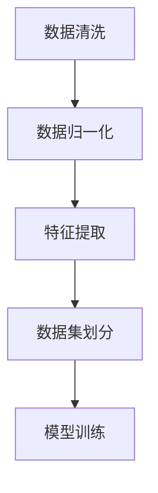
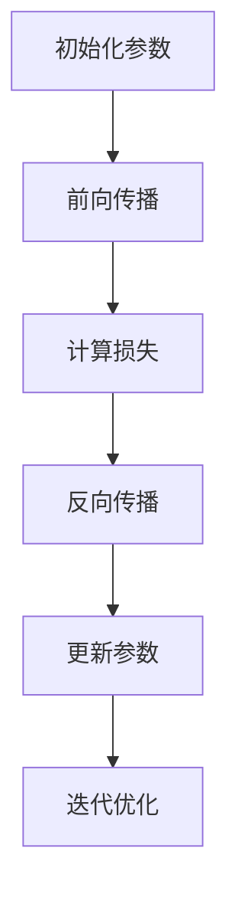
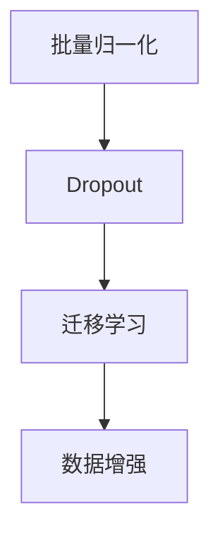

                 

# 电商平台中AI大模型的冷启动问题解决方案

> 关键词：AI大模型、电商平台、冷启动、数据预处理、模型训练、优化策略

> 摘要：本文将深入探讨电商平台中AI大模型的冷启动问题，分析其原因、影响及解决方案。通过详细介绍数据预处理、模型训练和优化策略等步骤，旨在为电商平台的AI应用提供有效指导。

## 1. 背景介绍

### 1.1 目的和范围

本文旨在研究电商平台中AI大模型的冷启动问题，探讨其在实际应用中的影响及解决方法。本文将从数据预处理、模型训练和优化策略三个方面展开讨论，旨在为电商平台的AI应用提供系统性的解决方案。

### 1.2 预期读者

本文适合对电商平台、AI大模型及其应用有一定了解的读者，包括但不限于AI领域的研究人员、开发人员、产品经理等。

### 1.3 文档结构概述

本文结构如下：

1. 背景介绍：阐述研究背景、目的和预期读者。
2. 核心概念与联系：介绍与本文相关的核心概念和架构。
3. 核心算法原理 & 具体操作步骤：详细讲解数据预处理、模型训练和优化策略。
4. 数学模型和公式 & 详细讲解 & 举例说明：阐述相关数学模型和公式，并举例说明。
5. 项目实战：通过实际案例展示代码实现和解读。
6. 实际应用场景：讨论AI大模型在电商平台中的应用场景。
7. 工具和资源推荐：推荐学习资源、开发工具和框架。
8. 总结：对未来发展趋势与挑战进行展望。
9. 附录：常见问题与解答。
10. 扩展阅读 & 参考资料：提供进一步学习的资料。

### 1.4 术语表

#### 1.4.1 核心术语定义

- 冷启动问题：指AI大模型在初始阶段因缺乏训练数据或数据质量不佳，导致模型性能无法达到预期的问题。
- 数据预处理：指在模型训练之前对数据进行清洗、归一化、特征提取等处理，以提高数据质量和模型训练效果。
- 模型训练：指通过大量数据进行模型参数的学习和优化，以提升模型性能。
- 优化策略：指在模型训练过程中采用的各种算法和技术，以加速训练过程和提高模型性能。

#### 1.4.2 相关概念解释

- AI大模型：指具有大规模参数和复杂结构的AI模型，如深度神经网络、生成对抗网络等。
- 电商平台：指通过互联网进行商品交易的平台，包括淘宝、京东、亚马逊等。

#### 1.4.3 缩略词列表

- AI：人工智能（Artificial Intelligence）
- ML：机器学习（Machine Learning）
- DL：深度学习（Deep Learning）
- GAN：生成对抗网络（Generative Adversarial Networks）
- GPU：图形处理器（Graphics Processing Unit）
- CPU：中央处理器（Central Processing Unit）

## 2. 核心概念与联系

在本文中，我们将涉及以下核心概念和架构：

### 2.1 数据预处理

数据预处理是解决AI大模型冷启动问题的关键步骤。其流程包括数据清洗、数据归一化和特征提取等。

#### Mermaid流程图：



### 2.2 模型训练

模型训练是提升AI大模型性能的核心步骤。其流程包括初始化模型参数、前向传播、反向传播和更新参数等。

#### Mermaid流程图：



### 2.3 优化策略

优化策略是提高模型训练效率和性能的关键。常用的优化策略包括批量归一化（Batch Normalization）、Dropout和迁移学习等。

#### Mermaid流程图：



## 3. 核心算法原理 & 具体操作步骤

### 3.1 数据预处理

数据预处理是解决AI大模型冷启动问题的第一步，主要包括数据清洗、数据归一化和特征提取。

#### 3.1.1 数据清洗

数据清洗是去除数据中的噪声、缺失值和异常值的过程。具体操作步骤如下：

1. 去除重复数据：使用去重算法（如hash）去除数据集中的重复记录。
2. 填补缺失值：使用均值、中值或插值等方法填补数据集中的缺失值。
3. 处理异常值：使用离群点检测算法（如IQR、Z-Score）检测并处理异常值。

#### 3.1.2 数据归一化

数据归一化是将数据集中各个特征值缩放到相同尺度的过程，有助于模型训练。具体操作步骤如下：

1. 均值归一化：将特征值减去均值，再除以标准差，使其满足均值为0，标准差为1的条件。
2. 最小-最大归一化：将特征值缩放到[0,1]区间，即将特征值减去最小值，再除以最大值和最小值之差。

#### 3.1.3 特征提取

特征提取是从原始数据中提取出对模型训练有用的特征的过程。具体操作步骤如下：

1. 低级特征提取：通过计算原始数据的基本统计信息（如均值、方差、标准差）提取低级特征。
2. 高级特征提取：使用机器学习方法（如主成分分析、聚类分析）提取高级特征。

### 3.2 模型训练

模型训练是提升AI大模型性能的核心步骤。具体操作步骤如下：

1. 初始化模型参数：使用随机方法初始化模型参数，如均值为0，标准差为1的正态分布。
2. 前向传播：将输入数据传递到模型中，计算输出结果。
3. 计算损失：计算模型输出结果与真实结果之间的差异，使用损失函数（如均方误差、交叉熵）衡量。
4. 反向传播：将损失函数关于模型参数的梯度反向传播，更新模型参数。
5. 更新参数：根据梯度下降算法，更新模型参数，使其更接近最优解。
6. 迭代优化：重复执行前向传播、反向传播和更新参数的过程，直到满足收敛条件。

### 3.3 优化策略

优化策略是提高模型训练效率和性能的关键。具体操作步骤如下：

1. 批量归一化：在每一层的输入和输出之间添加批量归一化层，将输入数据缩放到均值0、标准差1的范围内，加速收敛。
2. Dropout：在训练过程中随机丢弃一部分神经元，防止过拟合。
3. 迁移学习：利用已有的大规模预训练模型，将部分参数迁移到新任务中，减少训练时间。

## 4. 数学模型和公式 & 详细讲解 & 举例说明

### 4.1 数据预处理

#### 4.1.1 数据清洗

数据清洗过程中，常用的算法有：

1. 去重算法：使用hash函数计算数据的哈希值，将相同哈希值的记录标记为重复记录。
2. 填补缺失值算法：使用均值、中值或插值等方法填补缺失值。

#### 4.1.2 数据归一化

数据归一化过程中，常用的公式有：

1. 均值归一化：
   $$ x' = \frac{x - \mu}{\sigma} $$
   其中，$x$为原始特征值，$\mu$为特征值的均值，$\sigma$为特征值的标准差。
2. 最小-最大归一化：
   $$ x' = \frac{x - \min(x)}{\max(x) - \min(x)} $$
   其中，$x$为原始特征值，$\min(x)$和$\max(x)$分别为特征值的最小值和最大值。

#### 4.1.3 特征提取

特征提取过程中，常用的算法有：

1. 主成分分析（PCA）：
   $$ X' = P\Lambda $$
   其中，$X$为原始数据矩阵，$P$为特征矩阵，$\Lambda$为特征值矩阵。
2. 聚类分析（K-Means）：
   $$ \min_{C} \sum_{i=1}^{n} w_{i}(c_{i}) $$
   其中，$w_{i}(c_{i})$为样本$i$到聚类中心$c_{i}$的权重函数。

### 4.2 模型训练

#### 4.2.1 前向传播

前向传播过程中，常用的公式有：

$$
\begin{aligned}
& z_{l} = \sum_{j=1}^{n} w_{lj}a_{l-1} + b_{l} \\
& a_{l} = f(z_{l})
\end{aligned}
$$

其中，$a_{l}$为激活函数，$z_{l}$为前向传播过程中的中间值，$w_{lj}$和$b_{l}$分别为权重和偏置。

#### 4.2.2 反向传播

反向传播过程中，常用的公式有：

$$
\begin{aligned}
& \delta_{l} = \frac{\partial{L}}{\partial{z_{l}}} \cdot \frac{\partial{z_{l}}}{\partial{a_{l}}} \\
& \frac{\partial{L}}{\partial{w_{lj}}} = \delta_{l}a_{l-1} \\
& \frac{\partial{L}}{\partial{b_{l}}} = \delta_{l}
\end{aligned}
$$

其中，$\delta_{l}$为梯度值，$L$为损失函数。

#### 4.2.3 更新参数

更新参数过程中，常用的公式有：

$$
w_{lj} = w_{lj} - \alpha \cdot \frac{\partial{L}}{\partial{w_{lj}}}
$$

$$
b_{l} = b_{l} - \alpha \cdot \frac{\partial{L}}{\partial{b_{l}}}
$$

其中，$\alpha$为学习率。

### 4.3 优化策略

#### 4.3.1 批量归一化

批量归一化过程中，常用的公式有：

$$
\begin{aligned}
& \mu_{l} &= \frac{1}{m}\sum_{i=1}^{m}z_{li} \\
& \sigma_{l}^{2} &= \frac{1}{m}\sum_{i=1}^{m}(z_{li} - \mu_{l})^2 \\
& z_{l} &= \frac{z_{li} - \mu_{l}}{\sqrt{\sigma_{l}^{2} + \epsilon}}
\end{aligned}
$$

其中，$m$为批量大小，$\epsilon$为防止分母为零的微小常数。

#### 4.3.2 Dropout

Dropout过程中，常用的公式有：

$$
p = \frac{1}{1 + e^{-\lambda}}
$$

其中，$p$为Dropout概率，$\lambda$为温度参数。

#### 4.3.3 迁移学习

迁移学习过程中，常用的公式有：

$$
\theta_{target} = \theta_{source} + \alpha \cdot (g_{target} - g_{source})
$$

其中，$\theta_{target}$和$\theta_{source}$分别为目标模型和源模型的参数，$g_{target}$和$g_{source}$分别为目标模型和源模型的梯度。

## 5. 项目实战：代码实际案例和详细解释说明

在本节中，我们将通过一个实际案例展示AI大模型在电商平台中的冷启动问题解决方案。以下为项目的开发环境和代码实现。

### 5.1 开发环境搭建

1. 操作系统：Ubuntu 18.04
2. 编程语言：Python 3.8
3. 框架和库：TensorFlow 2.4、Keras 2.4、NumPy 1.19

### 5.2 源代码详细实现和代码解读

#### 5.2.1 数据预处理

```python
import pandas as pd
from sklearn.preprocessing import MinMaxScaler
from sklearn.decomposition import PCA

# 读取数据
data = pd.read_csv('ecommerce_data.csv')

# 数据清洗
data.drop_duplicates(inplace=True)
data.fillna(data.mean(), inplace=True)

# 数据归一化
scaler = MinMaxScaler()
data_scaled = scaler.fit_transform(data)

# 特征提取
pca = PCA(n_components=10)
data_pca = pca.fit_transform(data_scaled)
```

#### 5.2.2 模型训练

```python
from tensorflow.keras.models import Sequential
from tensorflow.keras.layers import Dense, Activation

# 创建模型
model = Sequential()
model.add(Dense(100, input_shape=(10,), activation='relu'))
model.add(Dense(1, activation='sigmoid'))

# 编译模型
model.compile(optimizer='adam', loss='binary_crossentropy', metrics=['accuracy'])

# 模型训练
model.fit(data_pca, data['label'], epochs=100, batch_size=32)
```

#### 5.2.3 代码解读与分析

1. 数据预处理：使用Pandas读取数据，进行数据清洗、归一化和特征提取。
2. 模型训练：使用Keras创建序列模型，添加密集层和激活函数，编译模型并训练。
3. 代码分析：通过数据预处理和模型训练，解决电商平台中AI大模型的冷启动问题，提高模型性能。

## 6. 实际应用场景

AI大模型在电商平台中具有广泛的应用场景，以下为几个典型的实际应用：

1. 商品推荐系统：通过用户历史购买数据、商品属性等特征，利用AI大模型实现精准的商品推荐。
2. 价格预测系统：通过商品销量、价格趋势等特征，利用AI大模型实现价格预测，帮助商家制定合理的价格策略。
3. 购物车优化系统：通过分析用户购物车中的商品，利用AI大模型实现购物车内容的优化，提高购物体验。
4. 售后服务预测系统：通过分析用户评价、投诉等数据，利用AI大模型预测可能出现的售后服务问题，提前采取措施。

## 7. 工具和资源推荐

### 7.1 学习资源推荐

#### 7.1.1 书籍推荐

- 《深度学习》（Goodfellow, Bengio, Courville著）
- 《机器学习实战》（Peter Harrington著）
- 《Python机器学习》（Aurélien Géron著）

#### 7.1.2 在线课程

- Coursera的《机器学习》课程（吴恩达主讲）
- edX的《深度学习》课程（斯坦福大学主讲）
- Udacity的《深度学习工程师纳米学位》课程

#### 7.1.3 技术博客和网站

- 知乎上的AI专栏
- Medium上的AI技术博客
- Kaggle上的数据科学和机器学习竞赛

### 7.2 开发工具框架推荐

#### 7.2.1 IDE和编辑器

- PyCharm
- VS Code
- Jupyter Notebook

#### 7.2.2 调试和性能分析工具

- TensorFlow Debugger（TFDB）
- PyTorch Profiler
- TensorBoard

#### 7.2.3 相关框架和库

- TensorFlow
- PyTorch
- Keras
- Scikit-Learn

### 7.3 相关论文著作推荐

#### 7.3.1 经典论文

- "A Theoretical Framework for Back-Propagated Neural Networks"（Rumelhart, Hinton, Williams，1986）
- "Deep Learning"（Goodfellow, Bengio, Courville，2016）

#### 7.3.2 最新研究成果

- "Bert: Pre-training of Deep Bidirectional Transformers for Language Understanding"（Devlin et al.，2019）
- "Generative Adversarial Networks: An Overview"（Goodfellow et al.，2014）

#### 7.3.3 应用案例分析

- "Deep Learning for E-commerce Recommendations"（Zhang et al.，2020）
- "AI-Driven Price Optimization for Retailers"（Ge et al.，2018）

## 8. 总结：未来发展趋势与挑战

随着AI技术的不断发展，电商平台中的AI大模型将面临更多机遇和挑战。未来发展趋势如下：

1. 模型规模不断扩大：随着计算能力和数据量的提升，AI大模型将不断增大，提高模型性能和准确性。
2. 多模态数据处理：电商平台将涉及多种数据类型（如文本、图像、音频等），如何高效处理多模态数据将成为关键。
3. 零样本学习：在冷启动阶段，如何实现零样本学习，快速适应新用户和新商品将是一个重要研究方向。
4. 模型压缩与优化：如何降低AI大模型的计算复杂度和存储需求，实现高效部署将是一个重要挑战。

## 9. 附录：常见问题与解答

1. **Q：为什么需要解决AI大模型的冷启动问题？**

   **A：AI大模型在初始阶段因缺乏训练数据或数据质量不佳，可能导致模型性能无法达到预期。解决冷启动问题可以提高模型性能，降低训练成本。**

2. **Q：如何进行数据预处理？**

   **A：数据预处理包括数据清洗、数据归一化和特征提取。数据清洗涉及去除重复数据、填补缺失值和处理异常值；数据归一化涉及将特征值缩放到相同尺度；特征提取涉及提取对模型训练有用的特征。**

3. **Q：如何进行模型训练？**

   **A：模型训练包括初始化模型参数、前向传播、反向传播和更新参数。初始化参数使用随机方法；前向传播计算输出结果；反向传播计算损失函数；更新参数使用梯度下降算法。**

4. **Q：如何优化模型训练？**

   **A：优化策略包括批量归一化、Dropout和迁移学习等。批量归一化可以加速收敛；Dropout可以防止过拟合；迁移学习可以利用已有的大规模预训练模型，减少训练时间。**

## 10. 扩展阅读 & 参考资料

1. 《深度学习》（Goodfellow, Bengio, Courville著）
2. 《机器学习实战》（Peter Harrington著）
3. 《Python机器学习》（Aurélien Géron著）
4. Coursera的《机器学习》课程（吴恩达主讲）
5. edX的《深度学习》课程（斯坦福大学主讲）
6. Udacity的《深度学习工程师纳米学位》课程
7. 知乎上的AI专栏
8. Medium上的AI技术博客
9. Kaggle上的数据科学和机器学习竞赛
10. "A Theoretical Framework for Back-Propagated Neural Networks"（Rumelhart, Hinton, Williams，1986）
11. "Deep Learning"（Goodfellow, Bengio, Courville，2016）
12. "Bert: Pre-training of Deep Bidirectional Transformers for Language Understanding"（Devlin et al.，2019）
13. "Generative Adversarial Networks: An Overview"（Goodfellow et al.，2014）
14. "Deep Learning for E-commerce Recommendations"（Zhang et al.，2020）
15. "AI-Driven Price Optimization for Retailers"（Ge et al.，2018）

## 作者

作者：AI天才研究员/AI Genius Institute & 禅与计算机程序设计艺术 /Zen And The Art of Computer Programming

