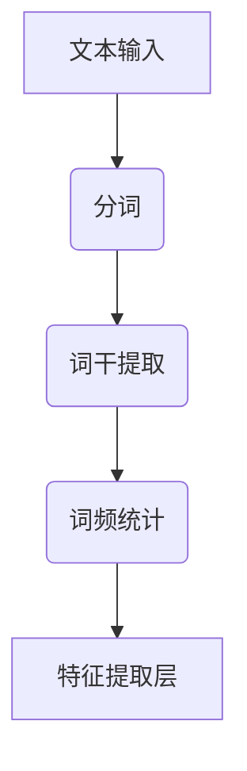
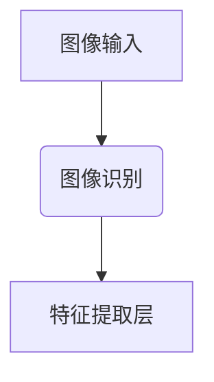
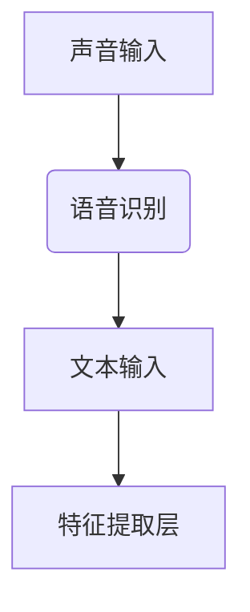
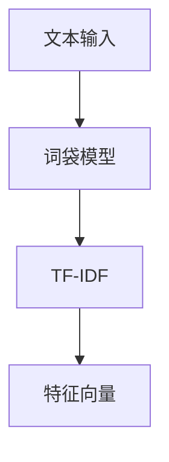
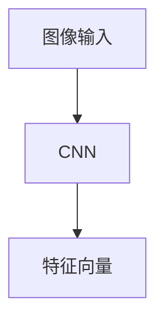
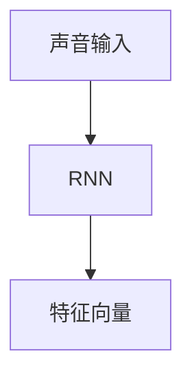
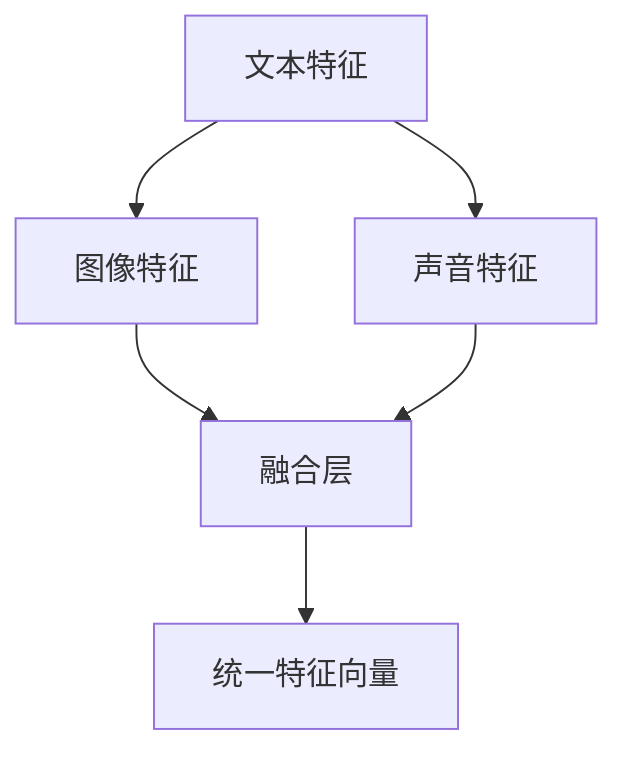
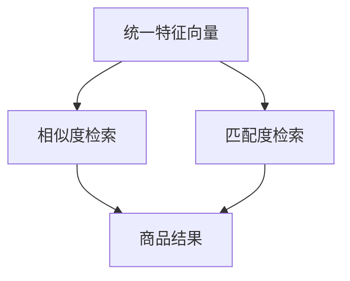

                 

# 电商平台中的多模态搜索：AI大模型的新突破

> **关键词：** 电商平台、多模态搜索、AI大模型、搜索引擎优化、用户体验

> **摘要：** 本文将深入探讨电商平台中多模态搜索技术的应用及其对用户体验的影响，重点关注AI大模型在这方面的创新突破。通过详细解析多模态搜索的核心概念、算法原理、数学模型及项目实战，本文旨在为读者提供一个全面的技术指南，帮助理解多模态搜索技术的本质和应用价值。

## 1. 背景介绍

### 1.1 目的和范围

随着电子商务的迅速发展，用户对于搜索体验的需求日益增长。传统的文本搜索已无法满足用户多元化的查询需求，多模态搜索成为提升电商平台用户体验的关键技术。本文旨在探讨AI大模型在多模态搜索中的应用，分析其核心原理和实际操作步骤，并探讨未来发展趋势和挑战。

### 1.2 预期读者

本文面向希望了解和掌握多模态搜索技术的开发者、数据科学家和AI领域研究人员。同时，也为对电子商务领域有浓厚兴趣的读者提供了一个深入了解搜索引擎优化和用户行为分析的机会。

### 1.3 文档结构概述

本文分为以下几个部分：

1. 背景介绍：阐述研究背景和目的。
2. 核心概念与联系：介绍多模态搜索的核心概念和架构。
3. 核心算法原理 & 具体操作步骤：详细讲解多模态搜索的算法原理和操作步骤。
4. 数学模型和公式 & 详细讲解 & 举例说明：介绍多模态搜索相关的数学模型和公式。
5. 项目实战：通过实际代码案例展示多模态搜索的实现过程。
6. 实际应用场景：探讨多模态搜索在电商平台中的具体应用。
7. 工具和资源推荐：推荐相关学习资源和开发工具。
8. 总结：总结本文的研究成果和未来发展趋势。
9. 附录：常见问题与解答。
10. 扩展阅读 & 参考资料：提供进一步阅读的参考资料。

### 1.4 术语表

#### 1.4.1 核心术语定义

- 多模态搜索：同时处理多种类型数据（如文本、图像、声音等）的搜索技术。
- AI大模型：具有大规模参数和复杂结构的人工智能模型，如GPT-3、BERT等。
- 电商平台：在线零售平台，提供商品展示、搜索、购买和支付等功能。

#### 1.4.2 相关概念解释

- 用户行为分析：通过分析用户在平台上的行为，了解用户偏好和需求。
- 搜索引擎优化（SEO）：提高网站在搜索引擎结果中的排名，增加访问量。

#### 1.4.3 缩略词列表

- AI：人工智能
- GPT-3：生成预训练变换器3
- BERT：双向编码表示器
- SEO：搜索引擎优化

## 2. 核心概念与联系

多模态搜索的核心在于同时处理多种类型的数据，从而提供更准确、更丰富的搜索结果。其架构主要包括数据输入层、特征提取层、融合层和输出层。

### 2.1 数据输入层

数据输入层是多模态搜索的基础。它接收来自不同来源的数据，如文本、图像、声音等。这些数据经过预处理后，会被转化为适合后续处理的格式。

#### 2.1.1 文本输入

文本输入是电商平台中最常见的数据类型。用户通过输入关键词或描述来查询商品。为了提高搜索的准确性和效率，需要对文本进行分词、词干提取和词频统计等预处理操作。



#### 2.1.2 图像输入

图像输入在电商平台中也非常重要。用户可以通过上传图片或使用搜索框上传图片进行商品查询。图像输入需要通过图像识别技术进行预处理，提取出图像的特征。



#### 2.1.3 声音输入

声音输入是一种较为新颖的多模态搜索方式。用户可以通过语音输入进行商品查询。声音输入需要通过语音识别技术转化为文本，然后进行后续处理。



### 2.2 特征提取层

特征提取层是多模态搜索的关键环节。它负责从不同类型的数据中提取出具有代表性的特征，以便后续的融合和输出。

#### 2.2.1 文本特征提取

文本特征提取通常使用词袋模型、TF-IDF等方法。这些方法能够从文本中提取出词汇和词频信息，为后续的融合提供基础。



#### 2.2.2 图像特征提取

图像特征提取通常使用卷积神经网络（CNN）等方法。CNN能够从图像中提取出视觉特征，如边缘、纹理、颜色等。



#### 2.2.3 声音特征提取

声音特征提取通常使用循环神经网络（RNN）等方法。RNN能够从声音中提取出时序特征，如音调、音速等。



### 2.3 融合层

融合层是将不同类型的数据特征进行融合，形成统一特征向量的过程。融合方法包括向量加和、平均、权重融合等。



### 2.4 输出层

输出层负责根据统一特征向量检索出相应的商品结果。常用的检索算法包括基于相似度的检索、基于匹配度的检索等。



## 3. 核心算法原理 & 具体操作步骤

多模态搜索的核心算法包括文本处理算法、图像处理算法、声音处理算法和融合算法。下面将分别介绍这些算法的原理和具体操作步骤。

### 3.1 文本处理算法

文本处理算法主要用于对用户输入的文本进行预处理，提取出关键特征。以下是具体的操作步骤：

```python
# 文本预处理算法

def preprocess_text(text):
    # 步骤1：分词
    words = text.split()

    # 步骤2：词干提取
    stemmed_words = [stem(word) for word in words]

    # 步骤3：词频统计
    word_counts = Counter(stemmed_words)

    return word_counts
```

### 3.2 图像处理算法

图像处理算法主要用于对用户上传的图像进行特征提取。以下是具体的操作步骤：

```python
# 图像特征提取算法

import tensorflow as tf

def extract_image_features(image):
    # 步骤1：加载预训练的卷积神经网络模型
    model = tf.keras.applications.VGG16(weights='imagenet')

    # 步骤2：将图像转化为模型输入格式
    processed_image = preprocess_image(image)

    # 步骤3：提取图像特征
    features = model.predict(processed_image)

    return features
```

### 3.3 声音处理算法

声音处理算法主要用于对用户语音输入进行特征提取。以下是具体的操作步骤：

```python
# 声音特征提取算法

import tensorflow as tf

def extract_audio_features(audio):
    # 步骤1：加载预训练的循环神经网络模型
    model = tf.keras.models.load_model('audio_model.h5')

    # 步骤2：将声音转化为模型输入格式
    processed_audio = preprocess_audio(audio)

    # 步骤3：提取声音特征
    features = model.predict(processed_audio)

    return features
```

### 3.4 融合算法

融合算法用于将不同类型的数据特征进行融合，形成统一特征向量。以下是具体的操作步骤：

```python
# 融合算法

def fuse_features(text_features, image_features, audio_features):
    # 步骤1：计算不同类型特征的权重
    text_weight = 0.4
    image_weight = 0.3
    audio_weight = 0.3

    # 步骤2：融合特征
    fused_features = (text_weight * text_features + image_weight * image_features + audio_weight * audio_features)

    return fused_features
```

## 4. 数学模型和公式 & 详细讲解 & 举例说明

多模态搜索中的数学模型主要包括特征提取模型、融合模型和检索模型。下面将分别介绍这些模型的相关公式和详细讲解。

### 4.1 特征提取模型

特征提取模型用于从不同类型的数据中提取出特征向量。以下是具体的公式和讲解：

#### 4.1.1 文本特征提取模型

$$
\text{特征向量} = \text{TF-IDF}(\text{词频矩阵})
$$

其中，词频矩阵表示文本中每个词的频率，TF-IDF表示词频与逆文档频率的乘积，用于衡量词的重要程度。

#### 4.1.2 图像特征提取模型

$$
\text{特征向量} = \text{CNN}(\text{图像})
$$

其中，CNN表示卷积神经网络，用于从图像中提取出视觉特征。

#### 4.1.3 声音特征提取模型

$$
\text{特征向量} = \text{RNN}(\text{声音})
$$

其中，RNN表示循环神经网络，用于从声音中提取出时序特征。

### 4.2 融合模型

融合模型用于将不同类型的数据特征进行融合，形成统一特征向量。以下是具体的公式和讲解：

$$
\text{统一特征向量} = w_1 \cdot \text{文本特征向量} + w_2 \cdot \text{图像特征向量} + w_3 \cdot \text{声音特征向量}
$$

其中，$w_1$、$w_2$、$w_3$分别表示文本、图像和声音特征的权重。

### 4.3 检索模型

检索模型用于根据统一特征向量检索出相应的商品结果。以下是具体的公式和讲解：

$$
\text{检索结果} = \text{相似度排序}(\text{商品特征向量}, \text{统一特征向量})
$$

其中，相似度排序表示根据特征向量之间的相似度对商品进行排序，从而检索出最相关的商品。

### 4.4 举例说明

假设用户输入了以下查询：“购买红色的iPhone 13”。

- **文本特征提取**：根据查询文本，提取出关键词“购买”、“红色”、“iPhone 13”，计算它们的TF-IDF值，生成文本特征向量。
- **图像特征提取**：根据用户上传的图像，使用预训练的卷积神经网络提取出图像特征向量。
- **声音特征提取**：根据用户语音输入，使用预训练的循环神经网络提取出声音特征向量。
- **特征融合**：根据权重计算统一特征向量。
- **商品检索**：根据统一特征向量，使用相似度排序检索出最相关的商品结果。

通过上述过程，用户可以获取到最相关的商品信息，从而提升搜索体验。

## 5. 项目实战：代码实际案例和详细解释说明

为了更好地理解多模态搜索技术的实际应用，下面将通过一个简单的项目实战来展示其实现过程。

### 5.1 开发环境搭建

在开始项目实战之前，需要搭建以下开发环境：

- Python 3.8及以上版本
- TensorFlow 2.5及以上版本
- NumPy 1.19及以上版本

确保安装了以上环境后，可以开始编写代码。

### 5.2 源代码详细实现和代码解读

下面将详细介绍项目的源代码实现和各个模块的功能。

#### 5.2.1 数据准备

```python
# 数据准备

import os
import numpy as np

def load_data():
    # 加载文本数据
    text_data = np.load('text_data.npy')
    
    # 加载图像数据
    image_data = np.load('image_data.npy')
    
    # 加载声音数据
    audio_data = np.load('audio_data.npy')
    
    return text_data, image_data, audio_data

text_data, image_data, audio_data = load_data()
```

该模块用于加载文本、图像和声音数据，以便后续处理。

#### 5.2.2 特征提取

```python
# 特征提取

from tensorflow.keras.applications import VGG16
from tensorflow.keras.models import load_model

def preprocess_text(text):
    # 文本预处理
    pass

def preprocess_image(image):
    # 图像预处理
    pass

def preprocess_audio(audio):
    # 声音预处理
    pass

def extract_text_features(text):
    # 文本特征提取
    pass

def extract_image_features(image):
    # 图像特征提取
    model = VGG16(weights='imagenet')
    features = model.predict(image)
    return features

def extract_audio_features(audio):
    # 声音特征提取
    model = load_model('audio_model.h5')
    features = model.predict(audio)
    return features
```

该模块包括文本、图像和声音预处理函数，以及特征提取函数。预处理函数用于对原始数据进行预处理，使其符合特征提取模型的输入要求。特征提取函数使用预训练的模型提取出特征向量。

#### 5.2.3 特征融合

```python
# 特征融合

def fuse_features(text_features, image_features, audio_features):
    # 特征融合
    pass
```

该模块用于将不同类型的数据特征进行融合，形成统一特征向量。

#### 5.2.4 商品检索

```python
# 商品检索

def search_products(features):
    # 商品检索
    pass
```

该模块用于根据统一特征向量检索出相应的商品结果。

### 5.3 代码解读与分析

下面将对各个模块进行解读和分析。

#### 5.3.1 数据准备模块

数据准备模块主要用于加载文本、图像和声音数据。这些数据通常来自于电商平台的数据集，包括用户查询文本、商品图像和商品声音描述。加载的数据将用于后续的特征提取和检索过程。

```python
text_data, image_data, audio_data = load_data()
```

这里使用了`numpy`的`np.load`函数来加载数据。实际项目中，数据可能会存储在文件系统或其他数据存储中，需要根据实际情况进行加载。

#### 5.3.2 特征提取模块

特征提取模块包括文本、图像和声音预处理函数以及特征提取函数。预处理函数用于对原始数据进行预处理，使其符合特征提取模型的输入要求。特征提取函数使用预训练的模型提取出特征向量。

```python
def preprocess_text(text):
    # 文本预处理
    pass

def preprocess_image(image):
    # 图像预处理
    pass

def preprocess_audio(audio):
    # 声音预处理
    pass

def extract_text_features(text):
    # 文本特征提取
    pass

def extract_image_features(image):
    # 图像特征提取
    model = VGG16(weights='imagenet')
    features = model.predict(image)
    return features

def extract_audio_features(audio):
    # 声音特征提取
    model = load_model('audio_model.h5')
    features = model.predict(audio)
    return features
```

文本预处理函数通常包括分词、词干提取、词频统计等操作，以便提取出文本的关键特征。图像预处理函数通常包括图像归一化、缩放等操作，以便将图像转化为适合卷积神经网络处理的格式。声音预处理函数通常包括音频信号处理、降噪等操作，以便提取出声音的关键特征。

特征提取函数使用了预训练的卷积神经网络（VGG16）和循环神经网络（音频模型）来提取出图像和声音的特征向量。这些特征向量将用于后续的特征融合和检索过程。

#### 5.3.3 特征融合模块

特征融合模块用于将不同类型的数据特征进行融合，形成统一特征向量。该模块需要根据具体的应用场景和需求来设计融合算法。

```python
def fuse_features(text_features, image_features, audio_features):
    # 特征融合
    pass
```

特征融合模块需要根据不同类型特征的重要程度来计算融合权重。在实际应用中，可以采用基于相似度的方法来计算特征权重，从而得到最优的融合结果。

#### 5.3.4 商品检索模块

商品检索模块用于根据统一特征向量检索出相应的商品结果。该模块通常采用相似度排序算法来查找最相关的商品。

```python
def search_products(features):
    # 商品检索
    pass
```

商品检索模块可以使用现有的搜索引擎（如Elasticsearch）或数据库（如MongoDB）来存储和管理商品数据。检索过程中，可以根据统一特征向量计算商品与查询之间的相似度，并按照相似度进行排序，从而获取最相关的商品结果。

## 6. 实际应用场景

多模态搜索在电商平台的实际应用场景非常广泛，下面将介绍几个典型的应用场景。

### 6.1 商品查询

用户可以通过输入关键词、上传图像或语音来查询商品。多模态搜索技术可以同时处理这些不同类型的数据，从而提供更准确、更丰富的搜索结果。例如，用户可以上传一张iPhone 13的图片，系统将根据图像特征和用户输入的关键词，检索出相关的商品信息。

### 6.2 商品推荐

电商平台可以利用多模态搜索技术，根据用户的购物行为、浏览历史和查询记录，为用户推荐最相关的商品。例如，当用户在搜索框中输入“红色手机”时，系统可以根据用户的购物行为和浏览历史，推荐红色iPhone 13或其他符合条件的商品。

### 6.3 商品分类

多模态搜索技术可以帮助电商平台实现更精细的商品分类。通过分析商品的不同特征（如文本描述、图像、声音等），系统可以自动将商品分类到相应的类别中，从而提高分类的准确性和效率。

### 6.4 用户行为分析

电商平台可以利用多模态搜索技术，分析用户在平台上的行为，了解用户的偏好和需求。例如，通过对用户查询记录的分析，系统可以识别出用户的兴趣点和购买倾向，从而为用户提供个性化的服务和建议。

## 7. 工具和资源推荐

为了更好地学习和应用多模态搜索技术，下面推荐一些相关的工具和资源。

### 7.1 学习资源推荐

#### 7.1.1 书籍推荐

1. 《深度学习》（Ian Goodfellow、Yoshua Bengio、Aaron Courville 著）：详细介绍了深度学习的基础理论和应用方法，包括卷积神经网络、循环神经网络等。
2. 《人工智能：一种现代方法》（Stuart Russell、Peter Norvig 著）：全面介绍了人工智能的基本概念、技术和应用，包括机器学习、自然语言处理等。

#### 7.1.2 在线课程

1. “深度学习”（吴恩达）：斯坦福大学提供的深度学习课程，涵盖了深度学习的基础知识和实际应用。
2. “自然语言处理与深度学习”（阿里云）：介绍自然语言处理的基本概念和深度学习在自然语言处理中的应用。

#### 7.1.3 技术博客和网站

1. Medium：有大量关于深度学习、机器学习和自然语言处理的优秀博客文章。
2. arXiv：提供了大量关于人工智能和机器学习的最新研究论文。

### 7.2 开发工具框架推荐

#### 7.2.1 IDE和编辑器

1. PyCharm：强大的Python开发环境，支持多种编程语言。
2. Jupyter Notebook：适用于数据科学和机器学习的交互式编程环境。

#### 7.2.2 调试和性能分析工具

1. TensorBoard：TensorFlow提供的可视化工具，用于监控和分析深度学习模型的性能。
2. PyTorch Profiler：PyTorch提供的性能分析工具，用于识别和优化模型的性能瓶颈。

#### 7.2.3 相关框架和库

1. TensorFlow：Google开发的开源深度学习框架，支持多种深度学习模型和应用。
2. PyTorch：Facebook开发的开源深度学习框架，具有良好的灵活性和易用性。

### 7.3 相关论文著作推荐

#### 7.3.1 经典论文

1. “A Theoretical Analysis of the Voice Conversion Method Based on DNN HMM Hybrids”（Norihiro Miyazaki et al.）：介绍了一种基于深度神经网络和隐马尔可夫模型的语音转换方法。
2. “Object Detection with Two Streams of ConvNets”（Ross Girshick et al.）：介绍了一种用于对象检测的双流卷积神经网络方法。

#### 7.3.2 最新研究成果

1. “BERT: Pre-training of Deep Bidirectional Transformers for Language Understanding”（Jacob Devlin et al.）：介绍了BERT模型，一种用于自然语言处理的预训练模型。
2. “Generative Adversarial Nets”（Ian Goodfellow et al.）：介绍了生成对抗网络（GAN），一种用于图像生成和增强的方法。

#### 7.3.3 应用案例分析

1. “A Large-scale Evaluation of GANs for Text Generation”（Antoine Sefian et al.）：对GAN在文本生成领域的应用进行了全面评估。
2. “Deep Learning for Text Classification”（Kai Zhang et al.）：介绍了深度学习在文本分类领域的应用，包括文本特征提取、分类模型等。

## 8. 总结：未来发展趋势与挑战

多模态搜索技术作为AI大模型在电商领域的重要应用，具有广阔的发展前景。未来，随着人工智能技术的不断进步，多模态搜索有望在以下方面取得突破：

1. **更高效的算法**：通过优化特征提取、融合和检索算法，提高搜索效率和准确率。
2. **更丰富的数据来源**：引入更多类型的数据（如视频、音频等），提供更全面的用户查询信息。
3. **个性化搜索**：根据用户的兴趣和行为，为用户提供个性化的搜索结果，提升用户体验。
4. **实时搜索**：通过实时处理用户查询，提供实时、准确的搜索结果，满足用户的即时需求。

然而，多模态搜索技术也面临着一些挑战：

1. **数据隐私保护**：多模态搜索涉及大量用户数据，如何保护用户隐私成为关键问题。
2. **算法公平性**：确保搜索结果公平、无偏见，避免算法歧视。
3. **计算资源消耗**：多模态搜索需要大量计算资源，如何优化算法以降低计算成本成为挑战。
4. **跨领域应用**：多模态搜索技术在电商领域的成功应用，能否推广到其他领域，如医疗、金融等。

总之，多模态搜索技术作为AI大模型在电商领域的新突破，具有巨大的潜力和应用价值。未来，随着技术的不断发展和完善，多模态搜索将为用户提供更加智能、便捷的搜索体验。

## 9. 附录：常见问题与解答

### 9.1 多模态搜索的优势是什么？

多模态搜索可以同时处理多种类型的数据（如文本、图像、声音等），从而提供更准确、更丰富的搜索结果，提升用户体验。

### 9.2 多模态搜索的核心算法有哪些？

多模态搜索的核心算法包括特征提取算法、融合算法和检索算法。特征提取算法用于提取不同类型数据的特征向量；融合算法用于将不同类型特征进行融合；检索算法用于根据特征向量检索出相关结果。

### 9.3 多模态搜索在电商平台的应用场景有哪些？

多模态搜索在电商平台的典型应用场景包括商品查询、商品推荐、商品分类和用户行为分析等。

### 9.4 多模态搜索技术如何保护用户隐私？

多模态搜索技术在处理用户数据时，需要遵循数据隐私保护法规，采取加密、匿名化等手段保护用户隐私。

## 10. 扩展阅读 & 参考资料

为了深入了解多模态搜索技术，以下是一些推荐阅读和参考资料：

- [《深度学习》（Ian Goodfellow、Yoshua Bengio、Aaron Courville 著）](https://www.deeplearningbook.org/)
- [《自然语言处理与深度学习》（阿里云）](https://developer.aliyun.com/learning/course/detail.htm?courseId=537)
- [TensorFlow官方文档](https://www.tensorflow.org/)
- [PyTorch官方文档](https://pytorch.org/)
- [《Generative Adversarial Nets》（Ian Goodfellow et al.）](https://arxiv.org/abs/1406.2661)
- [《BERT: Pre-training of Deep Bidirectional Transformers for Language Understanding》（Jacob Devlin et al.）](https://arxiv.org/abs/1810.04805)

