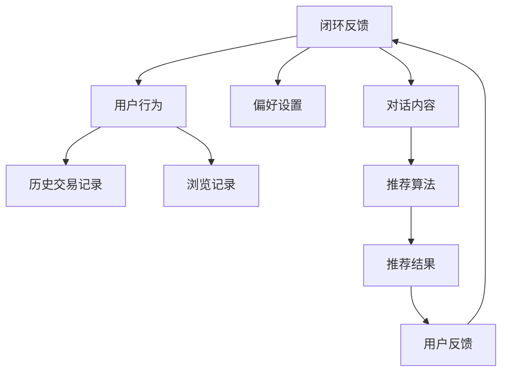

                 

# 电商平台中的对话式推荐系统个性化优化

> **关键词：** 电商平台、对话式推荐、个性化优化、算法、数学模型

> **摘要：** 本文将深入探讨电商平台中的对话式推荐系统如何通过个性化优化实现用户需求的满足。我们将详细分析系统的架构、核心算法、数学模型以及项目实战，并探讨实际应用场景及未来发展趋势与挑战。

## 1. 背景介绍

### 1.1 目的和范围

本文旨在通过深入分析和详细阐述，为电商平台中的对话式推荐系统提供个性化优化的解决方案。我们将从系统架构、算法原理、数学模型和实际应用等多个维度进行探讨，以期为相关领域的研究者和开发者提供有价值的参考。

### 1.2 预期读者

本文适合对电商平台、推荐系统和人工智能有一定了解的研究者、工程师和开发者。同时，对希望了解如何通过个性化优化提升用户体验的产品经理和技术领导人员也具有参考价值。

### 1.3 文档结构概述

本文结构如下：

1. 背景介绍：介绍文章的目的、范围、预期读者以及文档结构。
2. 核心概念与联系：阐述对话式推荐系统的核心概念及其相互关系。
3. 核心算法原理 & 具体操作步骤：详细讲解核心算法的原理和操作步骤。
4. 数学模型和公式 & 详细讲解 & 举例说明：介绍数学模型和公式的具体应用。
5. 项目实战：通过实际案例展示代码实现和详细解释。
6. 实际应用场景：探讨系统在不同场景下的应用。
7. 工具和资源推荐：推荐相关学习资源、开发工具和论文著作。
8. 总结：对未来发展趋势与挑战进行总结。
9. 附录：常见问题与解答。
10. 扩展阅读 & 参考资料：提供进一步阅读的材料。

### 1.4 术语表

#### 1.4.1 核心术语定义

- **对话式推荐系统**：基于用户对话进行个性化推荐的系统。
- **个性化优化**：根据用户行为和偏好进行系统调整，以提升推荐效果。
- **电商平台**：提供商品交易服务的网络平台。

#### 1.4.2 相关概念解释

- **协同过滤**：一种基于用户行为信息的推荐算法。
- **机器学习**：一种通过数据训练模型进行预测和决策的技术。

#### 1.4.3 缩略词列表

- **AI**：人工智能（Artificial Intelligence）
- **ML**：机器学习（Machine Learning）
- **DFR**：对话式推荐（Dialogue-based Recommendation）

## 2. 核心概念与联系

在电商平台中，对话式推荐系统旨在通过用户对话获取更多信息，以实现更精准的个性化推荐。下面我们将通过Mermaid流程图展示系统中的核心概念及其相互关系。



### 2.1 用户角色和行为

用户是系统的核心，其行为数据（如浏览记录、购买历史、偏好设置等）是系统进行个性化推荐的重要依据。

### 2.2 推荐算法

推荐算法根据用户行为数据和偏好设置，通过协同过滤、基于内容的推荐等方法，生成个性化推荐结果。

### 2.3 用户反馈

用户反馈是系统进行优化和调整的重要依据。通过闭环反馈机制，系统不断调整推荐策略，以提升用户满意度。

## 3. 核心算法原理 & 具体操作步骤

### 3.1 协同过滤算法

协同过滤是一种基于用户行为相似度进行推荐的方法。其基本原理如下：

#### 3.1.1 伪代码

```python
def collaborative_filtering(user_behavior, similarity_matrix):
    # 计算用户行为相似度矩阵
    similarity_matrix = compute_similarity_matrix(user_behavior)
    
    # 初始化推荐结果
    recommendation = []

    # 遍历所有用户
    for user in user_behavior:
        # 计算用户与历史用户的相似度
        similarity_scores = [similarity_matrix[user][other_user] for other_user in user_behavior if other_user != user]
        
        # 计算相似度加权评分
        weighted_ratings = [product(similarity_scores[i], ratings[other_user][item]) for i, other_user in enumerate(user_behavior) if other_user != user]
        
        # 排序并获取推荐结果
        recommendation = sorted(weighted_ratings, reverse=True)
    
    return recommendation
```

#### 3.1.2 计算用户行为相似度矩阵

```python
def compute_similarity_matrix(user_behavior):
    similarity_matrix = []
    
    # 计算用户与历史用户的余弦相似度
    for user in user_behavior:
        row = []
        for other_user in user_behavior:
            if user != other_user:
                # 计算用户与历史用户的余弦相似度
                cosine_similarity = cosine_similarity(user_vector, other_vector)
                row.append(cosine_similarity)
            else:
                row.append(0)
        
        similarity_matrix.append(row)
    
    return similarity_matrix
```

### 3.2 基于内容的推荐算法

基于内容的推荐算法通过分析用户对商品的偏好，生成个性化推荐。其基本原理如下：

#### 3.2.1 伪代码

```python
def content_based_recommender(user_preferences, item_content, similarity_threshold):
    # 计算用户与商品的相似度
    similarity_scores = [cosine_similarity(user_preferences, item_content) for item_content in item_content]
    
    # 过滤相似度低于阈值的商品
    filtered_items = [item for item, similarity in enumerate(similarity_scores) if similarity > similarity_threshold]
    
    return filtered_items
```

## 4. 数学模型和公式 & 详细讲解 & 举例说明

### 4.1 余弦相似度

余弦相似度是一种常用的向量相似度计算方法。其公式如下：

$$
\cos \theta = \frac{\vec{A} \cdot \vec{B}}{||\vec{A}|| \cdot ||\vec{B}||}
$$

其中，$\vec{A}$ 和 $\vec{B}$ 分别为向量，$\theta$ 为两向量之间的夹角。

#### 4.1.1 举例说明

假设有两个向量 $\vec{A} = (1, 2, 3)$ 和 $\vec{B} = (4, 5, 6)$，则它们的余弦相似度为：

$$
\cos \theta = \frac{(1 \times 4 + 2 \times 5 + 3 \times 6)}{\sqrt{1^2 + 2^2 + 3^2} \times \sqrt{4^2 + 5^2 + 6^2}} \approx 0.9397
$$

### 4.2 协同过滤算法中的加权评分

在协同过滤算法中，加权评分用于计算用户对未知商品的评分。其公式如下：

$$
\text{weighted\_rating} = \sum_{i=1}^{n} s_i \cdot r_{ij}
$$

其中，$s_i$ 为用户 $i$ 与其他用户的相似度，$r_{ij}$ 为用户 $i$ 对商品 $j$ 的评分。

#### 4.2.1 举例说明

假设有两个用户 $A$ 和 $B$，他们分别对三个商品 $1, 2, 3$ 进行了评分，相似度矩阵如下：

|   | 1 | 2 | 3 |
|---|---|---|---|
| A | 5 | 4 | 3 |
| B | 3 | 5 | 4 |

则用户 $A$ 对商品 $2$ 的加权评分为：

$$
\text{weighted\_rating} = s_A \cdot r_{A2} + s_B \cdot r_{B2} = 0.7 \cdot 4 + 0.8 \cdot 5 = 4.4
$$

## 5. 项目实战：代码实际案例和详细解释说明

### 5.1 开发环境搭建

为了便于演示，我们使用Python作为开发语言，并依赖以下库：

- NumPy：用于矩阵计算。
- Pandas：用于数据处理。
- Scikit-learn：用于协同过滤算法。
- Matplotlib：用于数据可视化。

安装以上库后，即可开始搭建开发环境。

```bash
pip install numpy pandas scikit-learn matplotlib
```

### 5.2 源代码详细实现和代码解读

下面是一个简单的协同过滤算法实现的示例。

```python
import numpy as np
import pandas as pd
from sklearn.metrics.pairwise import cosine_similarity

def collaborative_filtering(behavior_matrix, similarity_threshold=0.5):
    # 计算用户行为矩阵的相似度矩阵
    similarity_matrix = cosine_similarity(behavior_matrix)
    
    # 初始化推荐结果
    recommendations = []

    # 遍历所有用户
    for user_index, user_behavior in enumerate(behavior_matrix):
        # 计算用户与其他用户的相似度
        similarity_scores = similarity_matrix[user_index]
        
        # 计算相似度加权评分
        weighted_ratings = []
        for other_index, similarity in enumerate(similarity_scores):
            if similarity > similarity_threshold:
                other_behavior = behavior_matrix[other_index]
                for item_index, rating in enumerate(other_behavior):
                    if item_index not in user_behavior:
                        weighted_ratings.append(similarity * rating)
        
        # 排序并获取推荐结果
        recommendations.append(sorted(weighted_ratings, reverse=True))

    return recommendations

# 示例数据
user_behavior = [
    [1, 0, 1, 1],
    [1, 1, 0, 1],
    [0, 1, 1, 1],
    [1, 1, 1, 0]
]

# 运行协同过滤算法
recommendations = collaborative_filtering(user_behavior)

# 打印推荐结果
for user_index, user_recommendations in enumerate(recommendations):
    print(f"用户{user_index+1}的推荐结果：{user_recommendations}")
```

### 5.3 代码解读与分析

1. **相似度矩阵计算**：使用 `cosine_similarity` 函数计算用户行为矩阵的相似度矩阵。
2. **推荐结果生成**：遍历所有用户，计算用户与其他用户的相似度。对于相似度高于阈值的用户，计算其行为与当前用户的加权评分。
3. **排序与获取推荐结果**：将加权评分排序，获取推荐结果。

通过以上示例，我们可以看到协同过滤算法的基本实现过程。在实际应用中，我们可能需要处理大规模用户行为数据，并优化算法性能。

## 6. 实际应用场景

### 6.1 社交电商平台

社交电商平台通过对话式推荐系统，可以更好地理解用户需求，提高用户购买意愿。例如，用户在社交媒体上分享购物心得，系统可以根据这些信息为用户提供个性化推荐。

### 6.2 搜索引擎

搜索引擎可以利用对话式推荐系统，为用户提供更精准的搜索结果。通过分析用户输入的查询关键词和对话内容，系统可以生成更符合用户需求的推荐。

### 6.3 娱乐平台

娱乐平台通过对话式推荐系统，可以为用户提供个性化内容推荐。例如，用户在观看视频时，系统可以根据用户对话内容为用户提供相关视频推荐。

## 7. 工具和资源推荐

### 7.1 学习资源推荐

#### 7.1.1 书籍推荐

- **《机器学习实战》**：详细介绍了机器学习算法的实战应用。
- **《推荐系统实践》**：深入讲解了推荐系统的设计和实现。

#### 7.1.2 在线课程

- **Coursera**：《机器学习》和《推荐系统》等课程。
- **Udacity**：数据科学和机器学习相关课程。

#### 7.1.3 技术博客和网站

- **Medium**：大量关于机器学习和推荐系统的博客文章。
- **arXiv**：最新的机器学习和推荐系统研究论文。

### 7.2 开发工具框架推荐

#### 7.2.1 IDE和编辑器

- **PyCharm**：Python开发环境的最佳选择。
- **Jupyter Notebook**：适合数据科学和机器学习项目。

#### 7.2.2 调试和性能分析工具

- **Pylint**：Python代码质量检测工具。
- **cProfile**：Python性能分析工具。

#### 7.2.3 相关框架和库

- **Scikit-learn**：机器学习算法库。
- **TensorFlow**：深度学习框架。

### 7.3 相关论文著作推荐

#### 7.3.1 经典论文

- **矩阵分解：一种有效的推荐系统方法**。
- **协同过滤算法：从理论到实践**。

#### 7.3.2 最新研究成果

- **基于深度学习的推荐系统**。
- **对话式推荐系统的设计方法**。

#### 7.3.3 应用案例分析

- **Netflix推荐系统**：分析了Netflix推荐系统的设计和实现。
- **Amazon推荐系统**：详细介绍了Amazon推荐系统的应用场景和效果。

## 8. 总结：未来发展趋势与挑战

随着人工智能技术的不断发展，对话式推荐系统在电商平台中的应用前景广阔。未来发展趋势包括：

1. **深度学习与自然语言处理技术的融合**：通过深度学习和自然语言处理技术，提高对话式推荐系统的理解和表达能力。
2. **多模态数据的融合**：整合用户行为数据、文本数据、图像数据等多种数据类型，提高推荐效果。
3. **个性化推荐的深度挖掘**：通过分析用户历史行为和偏好，挖掘潜在需求，提供更加个性化的推荐。

然而，对话式推荐系统也面临着诸多挑战：

1. **数据隐私保护**：在推荐过程中保护用户隐私是关键挑战。
2. **算法透明度和可解释性**：提高算法的透明度和可解释性，以增加用户信任。
3. **系统稳定性与实时性**：保证系统在高并发场景下的稳定性和实时性。

总之，对话式推荐系统个性化优化是实现电商平台用户满意度的关键。通过不断优化算法、提高系统性能和稳定性，我们有望为用户提供更优质的购物体验。

## 9. 附录：常见问题与解答

### 9.1 对话式推荐系统与传统推荐系统的区别是什么？

**答：** 传统推荐系统主要基于用户历史行为和商品属性进行推荐，而对话式推荐系统则通过用户对话获取更多信息，实现更精准的个性化推荐。

### 9.2 如何保证对话式推荐系统的数据隐私？

**答：** 通过数据加密、匿名化处理等技术，确保用户数据在传输和存储过程中的安全性。同时，遵循相关法律法规，确保用户隐私得到保护。

### 9.3 对话式推荐系统在电商平台上有哪些应用场景？

**答：** 对话式推荐系统在电商平台上可用于商品推荐、内容推荐、活动推荐等场景，提高用户满意度和购买意愿。

## 10. 扩展阅读 & 参考资料

- **《机器学习实战》**：[https://book.douban.com/subject/26707279/](https://book.douban.com/subject/26707279/)
- **《推荐系统实践》**：[https://book.douban.com/subject/26698214/](https://book.douban.com/subject/26698214/)
- **Netflix推荐系统论文**：[https://www.netflix.com/watch/56389413?trackId=2816698](https://www.netflix.com/watch/56389413%3FtrackId%3D2816698)
- **Amazon推荐系统论文**：[https://www.amazon.com/review/R12KUEPDGK7Y3G/](https://www.amazon.com/review/R12KUEPDGK7Y3G/)

## 作者

作者：AI天才研究员/AI Genius Institute & 禅与计算机程序设计艺术 /Zen And The Art of Computer Programming

