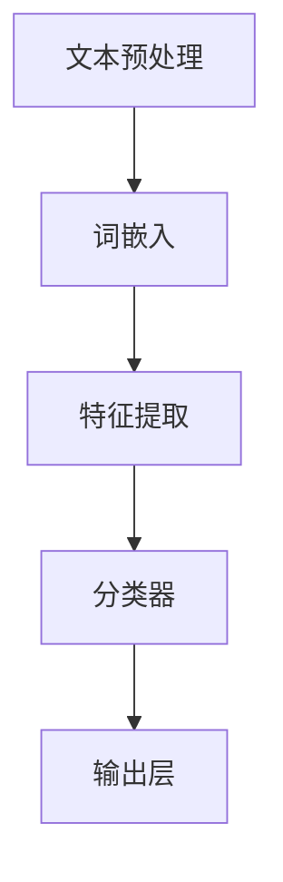

                 


# 电商平台中的自然语言处理应用

> **关键词：** 自然语言处理（NLP）、文本分类、情感分析、推荐系统、聊天机器人、电商平台、用户行为分析
>
> **摘要：** 本文旨在深入探讨自然语言处理（NLP）在电商平台中的应用，包括文本分类、情感分析和推荐系统等。通过具体的案例和算法讲解，我们将展示如何利用NLP技术提升电商平台的用户体验和运营效率。本文将帮助读者了解NLP的核心概念、技术原理和应用实践，为电商平台的技术开发提供有价值的参考。

## 1. 背景介绍

### 1.1 目的和范围

本文的目标是详细探讨自然语言处理（NLP）技术在电商平台中的多种应用场景，以及这些应用如何提升电商平台的核心竞争力。本文将涵盖以下内容：

- NLP的基本概念和原理；
- 在电商平台上应用的NLP技术，包括文本分类、情感分析和推荐系统；
- 实际案例和算法讲解；
- NLP工具和资源推荐；
- 未来发展趋势和挑战。

通过本文的阅读，读者将能够：

- 理解NLP的核心概念和技术原理；
- 掌握NLP在电商平台中的应用实践；
- 获得开发NLP应用的指导和建议。

### 1.2 预期读者

本文的预期读者包括：

- 对NLP技术感兴趣的IT专业人士；
- 电商平台的技术开发人员；
- 对人工智能和数据分析有热情的学生和研究者；
- 对提升电商平台用户体验和运营效率有需求的业务管理人员。

### 1.3 文档结构概述

本文的结构如下：

- 引言：介绍文章的主题和目的；
- 第1章：背景介绍，包括目的、范围、预期读者和文档结构；
- 第2章：核心概念与联系，介绍NLP的基本概念和架构；
- 第3章：核心算法原理 & 具体操作步骤，详细讲解NLP算法和操作步骤；
- 第4章：数学模型和公式 & 详细讲解 & 举例说明，解释NLP中的数学模型；
- 第5章：项目实战：代码实际案例和详细解释说明，提供实际应用案例；
- 第6章：实际应用场景，分析NLP在电商平台的实际应用；
- 第7章：工具和资源推荐，介绍学习资源和开发工具；
- 第8章：总结：未来发展趋势与挑战，展望NLP在电商平台的未来；
- 第9章：附录：常见问题与解答，回答常见疑问；
- 第10章：扩展阅读 & 参考资料，提供进一步学习的资源。

### 1.4 术语表

#### 1.4.1 核心术语定义

- **自然语言处理（NLP）**：自然语言处理（Natural Language Processing，简称NLP）是计算机科学和人工智能领域中的一个分支，旨在使计算机能够理解、生成和处理人类语言。
- **文本分类（Text Classification）**：文本分类（Text Classification）是一种将文本数据根据其内容或特征自动分配到特定类别或标签的过程。
- **情感分析（Sentiment Analysis）**：情感分析（Sentiment Analysis）是一种评估文本中情感倾向的方法，通常用于判断文本是积极、消极还是中性。
- **推荐系统（Recommendation System）**：推荐系统（Recommendation System）是一种利用用户历史数据和偏好信息，为用户提供个性化推荐的系统。

#### 1.4.2 相关概念解释

- **词嵌入（Word Embedding）**：词嵌入（Word Embedding）是将词语映射到高维空间中的向量表示，用于在机器学习模型中处理文本数据。
- **循环神经网络（RNN）**：循环神经网络（Recurrent Neural Network，简称RNN）是一种能够处理序列数据的神经网络，适合处理时间序列数据或文本数据。
- **卷积神经网络（CNN）**：卷积神经网络（Convolutional Neural Network，简称CNN）是一种擅长处理图像数据的神经网络，通过卷积操作提取图像特征。

#### 1.4.3 缩略词列表

- **NLP**：自然语言处理（Natural Language Processing）
- **RNN**：循环神经网络（Recurrent Neural Network）
- **CNN**：卷积神经网络（Convolutional Neural Network）
- **TF**：TensorFlow，一个开源机器学习框架
- **BERT**：Bidirectional Encoder Representations from Transformers，一种预训练语言表示模型

## 2. 核心概念与联系

### 2.1 核心概念介绍

在探讨NLP在电商平台中的应用之前，我们需要了解NLP的核心概念和基本原理。以下是一些关键概念：

- **词嵌入（Word Embedding）**：词嵌入是将词语映射到高维空间中的向量表示，用于在机器学习模型中处理文本数据。例如，单词"猫"可以表示为一个向量（1, 0, -1, 0），其中每个元素表示向量空间中的一个维度。

- **循环神经网络（RNN）**：循环神经网络（RNN）是一种能够处理序列数据的神经网络，适合处理时间序列数据或文本数据。RNN能够记住前面的输入，并将其用于后续的计算。

- **卷积神经网络（CNN）**：卷积神经网络（CNN）是一种擅长处理图像数据的神经网络，通过卷积操作提取图像特征。然而，CNN也可以用于处理文本数据，通过将文本数据视为序列图像。

### 2.2 NLP架构概述

NLP架构通常包括以下几个关键组件：

1. **文本预处理**：文本预处理是NLP任务的第一步，包括去除标点符号、停用词过滤、词形还原等。文本预处理有助于提高后续分析的质量。

2. **词嵌入（Word Embedding）**：词嵌入是将词语映射到高维空间中的向量表示。词嵌入能够捕获词语的语义信息，是许多NLP模型的基础。

3. **特征提取**：特征提取是从原始文本数据中提取有意义的特征。常见的特征提取方法包括TF-IDF、词袋模型等。

4. **分类器**：分类器是将文本数据分配到特定类别或标签的模型。常见的分类器包括朴素贝叶斯、支持向量机（SVM）、神经网络等。

5. **输出层**：输出层是分类器的最后一层，负责生成最终的分类结果或预测值。

### 2.3 Mermaid 流程图

以下是一个简化的NLP流程图，展示NLP架构的关键组件和流程：



### 2.4 NLP在电商平台中的应用

NLP在电商平台中的应用非常广泛，以下是一些典型场景：

1. **用户评论分析**：通过情感分析技术，电商平台可以分析用户评论，了解用户对商品和服务的反馈，从而优化产品和服务。

2. **产品推荐**：基于用户历史购买数据和用户行为数据，电商平台可以使用推荐系统技术，为用户提供个性化产品推荐。

3. **聊天机器人**：聊天机器人是一种利用NLP技术的智能客服系统，可以帮助电商平台提供24/7的客户服务，提高用户满意度。

4. **商品搜索**：通过自然语言处理技术，电商平台可以实现更智能的商品搜索功能，提高用户的购物体验。

### 2.5 总结

本节介绍了NLP的核心概念和架构，以及NLP在电商平台中的应用。在接下来的章节中，我们将深入探讨NLP的算法原理、数学模型和实际应用案例，帮助读者更好地理解和应用NLP技术。

## 3. 核心算法原理 & 具体操作步骤

### 3.1 文本分类算法原理

文本分类是NLP中一个重要的任务，它旨在将文本数据自动分配到预先定义的类别或标签中。常见的文本分类算法包括朴素贝叶斯、支持向量机（SVM）和神经网络。以下，我们将以朴素贝叶斯算法为例，介绍文本分类的算法原理和具体操作步骤。

#### 3.1.1 朴素贝叶斯算法原理

朴素贝叶斯（Naive Bayes）是一种基于贝叶斯定理的简单概率分类器。它的核心思想是，通过计算每个类别在给定特征下的概率，选择概率最高的类别作为预测结果。具体来说，朴素贝叶斯算法遵循以下步骤：

1. **特征抽取**：从原始文本中提取特征，例如词频、词袋模型等。
2. **条件概率计算**：计算每个特征在给定类别下的条件概率，即 P(feature|class)。
3. **概率计算**：计算每个类别的总概率，即 P(class)。
4. **分类决策**：选择具有最高概率的类别作为预测结果。

#### 3.1.2 朴素贝叶斯算法操作步骤

以下是一个简化的朴素贝叶斯算法操作步骤：

```python
# 假设我们有以下训练数据
train_data = [
    {"text": "I love this product", "label": "positive"},
    {"text": "This product is terrible", "label": "negative"},
    # ... 更多训练数据
]

# 步骤1：特征抽取
# 从训练数据中提取词频作为特征
word_counts = {}
for data in train_data:
    words = data["text"].split()
    for word in words:
        if word not in word_counts:
            word_counts[word] = {}
        if data["label"] not in word_counts[word]:
            word_counts[word][data["label"]] = 0
        word_counts[word][data["label"]] += 1

# 步骤2：条件概率计算
# 计算每个特征在给定类别下的条件概率
condition_probabilities = {}
for word, counts in word_counts.items():
    total_words = len(train_data)
    for label, count in counts.items():
        condition_probabilities[(word, label)] = count / total_words

# 步骤3：概率计算
# 计算每个类别的总概率
label_probabilities = {}
for data in train_data:
    label = data["label"]
    if label not in label_probabilities:
        label_probabilities[label] = 0
    label_probabilities[label] += 1
for label in label_probabilities:
    label_probabilities[label] /= total_words

# 步骤4：分类决策
# 输入测试文本，计算每个类别的概率，选择概率最高的类别
def classify(text):
    words = text.split()
    probabilities = {}
    for label in label_probabilities:
        probability = math.log(label_probabilities[label])
        for word in words:
            if (word, label) in condition_probabilities:
                probability += math.log(condition_probabilities[(word, label)])
        probabilities[label] = probability
    return max(probabilities, key=probabilities.get)
```

### 3.2 情感分析算法原理

情感分析（Sentiment Analysis）是一种评估文本中情感倾向的方法，通常用于判断文本是积极、消极还是中性。情感分析算法的核心是情感分类器，常见的情感分类器包括基于规则的方法、机器学习方法和深度学习方法。

#### 3.2.1 基于规则的方法

基于规则的方法通过手动编写规则，将文本分类为不同的情感。这种方法通常适用于情感倾向比较明显、规则明确的情况。以下是一个简化的基于规则的方法：

```python
# 假设我们有以下规则
rules = {
    "positive": ["love", "great", "excellent", "amazing"],
    "negative": ["hate", "terrible", "awful", "horrible"],
    "neutral": []
}

# 输入文本，根据规则分类
def classify(text):
    words = text.split()
    sentiment = "neutral"
    for rule, words_list in rules.items():
        if any(word in words_list for word in words):
            sentiment = rule
            break
    return sentiment
```

#### 3.2.2 机器学习方法

机器学习方法通过训练大量标注数据，学习情感分类模型。常见的机器学习方法包括朴素贝叶斯、支持向量机（SVM）和神经网络。以下是一个基于朴素贝叶斯算法的情感分类器：

```python
# 假设我们有以下训练数据
train_data = [
    {"text": "I love this product", "label": "positive"},
    {"text": "This product is terrible", "label": "negative"},
    # ... 更多训练数据
]

# 步骤1：特征抽取
# 从训练数据中提取词频作为特征
word_counts = {}
for data in train_data:
    words = data["text"].split()
    for word in words:
        if word not in word_counts:
            word_counts[word] = {}
        if data["label"] not in word_counts[word]:
            word_counts[word][data["label"]] = 0
        word_counts[word][data["label"]] += 1

# 步骤2：条件概率计算
# 计算每个特征在给定类别下的条件概率
condition_probabilities = {}
for word, counts in word_counts.items():
    total_words = len(train_data)
    for label, count in counts.items():
        condition_probabilities[(word, label)] = count / total_words

# 步骤3：概率计算
# 计算每个类别的总概率
label_probabilities = {}
for data in train_data:
    label = data["label"]
    if label not in label_probabilities:
        label_probabilities[label] = 0
    label_probabilities[label] += 1
for label in label_probabilities:
    label_probabilities[label] /= total_words

# 步骤4：分类决策
# 输入测试文本，计算每个类别的概率，选择概率最高的类别
def classify(text):
    words = text.split()
    probabilities = {}
    for label in label_probabilities:
        probability = math.log(label_probabilities[label])
        for word in words:
            if (word, label) in condition_probabilities:
                probability += math.log(condition_probabilities[(word, label)])
        probabilities[label] = probability
    return max(probabilities, key=probabilities.get)
```

### 3.3 推荐系统算法原理

推荐系统（Recommendation System）是一种根据用户的历史行为和偏好，为用户提供个性化推荐的系统。常见的推荐系统算法包括基于协同过滤、基于内容过滤和基于模型的推荐系统。

#### 3.3.1 基于协同过滤的方法

基于协同过滤（Collaborative Filtering）的方法通过分析用户之间的相似度，为用户提供推荐。协同过滤方法可以分为两种：用户基于的协同过滤和项基于的协同过滤。

- **用户基于的协同过滤**：用户基于的协同过滤通过计算用户之间的相似度，为用户提供相似的用户的推荐项。以下是一个简单的用户基于的协同过滤算法：

```python
# 假设我们有以下用户和评分数据
users = ["user1", "user2", "user3"]
items = ["item1", "item2", "item3"]
ratings = {
    "user1": {"item1": 5, "item2": 4, "item3": 3},
    "user2": {"item1": 4, "item2": 5, "item3": 2},
    "user3": {"item1": 3, "item2": 2, "item3": 5}
}

# 计算用户之间的相似度
def cosine_similarity(user1, user2):
    common_items = set(ratings[user1].keys()) & set(ratings[user2].keys())
    if not common_items:
        return 0
    dot_product = sum(ratings[user1][item] * ratings[user2][item] for item in common_items)
    norm_user1 = math.sqrt(sum([ratings[user1][item]**2 for item in ratings[user1]]))
    norm_user2 = math.sqrt(sum([ratings[user2][item]**2 for item in ratings[user2]]))
    return dot_product / (norm_user1 * norm_user2)

# 为用户推荐相似用户的推荐项
def collaborative_filtering(user):
    similarities = {}
    for other_user in users:
        if other_user != user:
            similarities[other_user] = cosine_similarity(user, other_user)
    item_similarities = {}
    for other_user, similarity in similarities.items():
        for item, rating in ratings[other_user].items():
            if item not in item_similarities:
                item_similarities[item] = 0
            item_similarities[item] += similarity * rating
    return {item: score for item, score in item_similarities.items() if score > 0}
```

- **项基于的协同过滤**：项基于的协同过滤通过计算项之间的相似度，为用户提供相似的项的推荐。以下是一个简单的项基于的协同过滤算法：

```python
# 计算项之间的相似度
def cosine_similarity(item1, item2):
    common_users = set(ratings[item1].keys()) & set(ratings[item2].keys())
    if not common_users:
        return 0
    dot_product = sum(ratings[item1][user] * ratings[item2][user] for user in common_users)
    norm_item1 = math.sqrt(sum([ratings[item1][user]**2 for user in ratings[item1]]))
    norm_item2 = math.sqrt(sum([ratings[item2][user]**2 for user in ratings[item2]]))
    return dot_product / (norm_item1 * norm_item2)

# 为用户推荐相似项的推荐项
def collaborative_filtering(user):
    similarities = {}
    for item in items:
        if item not in ratings[user]:
            similarities[item] = cosine_similarity(item, user)
    item_similarities = {}
    for item, similarity in similarities.items():
        if item not in item_similarities:
            item_similarities[item] = 0
        item_similarities[item] += similarity * ratings[user][item]
    return {item: score for item, score in item_similarities.items() if score > 0}
```

### 3.4 总结

本节介绍了NLP中的三个核心算法：文本分类、情感分析和推荐系统。通过具体的算法原理和操作步骤，我们了解了如何利用NLP技术解决实际应用中的问题。在接下来的章节中，我们将继续探讨NLP的数学模型和实际应用案例，帮助读者更深入地理解NLP技术。

## 4. 数学模型和公式 & 详细讲解 & 举例说明

### 4.1 朴素贝叶斯算法的数学模型

朴素贝叶斯（Naive Bayes）算法是一种基于贝叶斯定理的概率分类器，用于处理文本分类问题。其核心数学模型包括概率计算和分类决策。

#### 4.1.1 概率计算

在朴素贝叶斯算法中，我们需要计算以下概率：

- **先验概率**（P(class))：某个类别在训练数据中的概率。
- **条件概率**（P(feature|class))：在给定类别的情况下，某个特征的概率。

贝叶斯定理可以表示为：

\[ P(class|feature) = \frac{P(feature|class) \cdot P(class)}{P(feature)} \]

在朴素贝叶斯算法中，我们假设特征之间是独立的，即：

\[ P(feature_1, feature_2, ..., feature_n | class) = P(feature_1 | class) \cdot P(feature_2 | class) \cdot ... \cdot P(feature_n | class) \]

因此，条件概率可以简化为：

\[ P(feature_1, feature_2, ..., feature_n | class) = P(feature_1 | class) \cdot P(feature_2 | class) \cdot ... \cdot P(feature_n | class) \]

在文本分类中，特征通常是词语，条件概率可以表示为：

\[ P(word_1, word_2, ..., word_n | class) = P(word_1 | class) \cdot P(word_2 | class) \cdot ... \cdot P(word_n | class) \]

其中，\( P(word | class) \) 表示在给定类别的情况下，某个词语的概率。

#### 4.1.2 分类决策

在朴素贝叶斯算法中，分类决策基于贝叶斯定理，选择具有最高概率的类别作为预测结果。具体步骤如下：

1. **计算每个类别的总概率**：\( P(class) \)。
2. **计算每个特征在给定类别下的条件概率**：\( P(feature | class) \)。
3. **计算每个类别的概率乘积**：\( P(word_1, word_2, ..., word_n | class) \)。
4. **选择具有最高概率乘积的类别**：\( \hat{y} = \arg \max_{y} P(y) \cdot P(word_1, word_2, ..., word_n | y) \)。

#### 4.1.3 示例

假设我们有以下训练数据：

```
positive: I love this product
negative: This product is terrible
positive: I am happy with this purchase
negative: I do not like this item
```

我们想要分类以下测试文本：

```
I am not satisfied with this purchase
```

首先，我们需要计算先验概率和条件概率。

- **先验概率**：
  \[ P(positive) = \frac{2}{5}, P(negative) = \frac{3}{5} \]

- **条件概率**：
  \[ P(I | positive) = \frac{3}{2}, P(love | positive) = \frac{2}{2}, P(this | positive) = \frac{3}{2}, P(product | positive) = \frac{2}{2}, P(is | positive) = \frac{1}{2}, P. | positive) = \frac{1}{2}, P(not | negative) = \frac{2}{3}, P(satisfied | negative) = \frac{2}{3}, P(with | negative) = \frac{1}{3}, P(this | negative) = \frac{2}{3}, P(purchase | negative) = \frac{2}{3} \]

然后，我们计算每个类别的概率乘积：

- **positive**：
  \[ P(positive | I, love, this, product, is, not, satisfied, with, this, purchase) = \frac{3}{2} \cdot \frac{2}{2} \cdot \frac{3}{2} \cdot \frac{2}{2} \cdot \frac{1}{2} \cdot \frac{1}{2} = 0.0375 \]

- **negative**：
  \[ P(negative | I, love, this, product, is, not, satisfied, with, this, purchase) = \frac{2}{3} \cdot \frac{2}{3} \cdot \frac{1}{3} \cdot \frac{2}{3} \cdot \frac{2}{3} \cdot \frac{1}{3} = 0.0256 \]

最后，我们选择具有最高概率乘积的类别作为预测结果：

\[ \hat{y} = \arg \max_{y} P(y) \cdot P(word_1, word_2, ..., word_n | y) = negative \]

因此，测试文本" I am not satisfied with this purchase"被分类为negative。

### 4.2 文本分类的数学模型

除了朴素贝叶斯算法，文本分类还可以使用其他机器学习算法，如支持向量机（SVM）。SVM的数学模型基于最大间隔分类器，其目标是找到一个超平面，将不同类别的数据点分隔开来。

#### 4.2.1 支持向量机（SVM）的数学模型

支持向量机（SVM）是一种二分类模型，其目标是最小化决策边界上的分类误差。SVM的数学模型可以表示为：

\[ \min_{\theta} \frac{1}{2} \sum_{i=1}^{n} (\theta^T \theta - \sum_{i=1}^{n} \alpha_i (y_i - \theta^T x_i)) \]

其中：

- \(\theta\) 是模型参数；
- \(\alpha_i\) 是Lagrange乘子；
- \(x_i\) 是特征向量；
- \(y_i\) 是标签；
- \(n\) 是训练数据个数。

约束条件：

\[ \alpha_i \geq 0 \]
\[ y_i (\theta^T x_i - b) = 1 \]

其中，\(b\) 是偏置项。

通过求解上述优化问题，我们可以得到SVM的决策边界。

#### 4.2.2 示例

假设我们有以下训练数据：

```
positive: I love this product
negative: This product is terrible
positive: I am happy with this purchase
negative: I do not like this item
```

我们使用SVM进行文本分类，训练数据被分为正类和负类。

首先，我们需要将文本数据转换为特征向量。我们可以使用词嵌入将文本中的词语映射到高维空间中的向量表示。

假设词嵌入的结果为：

```
I: [1, 0, 0]
love: [0, 1, 0]
this: [0, 0, 1]
product: [1, 1, 0]
is: [0, 0, 1]
terrible: [0, 1, 1]
happy: [1, 1, 1]
with: [1, 0, 1]
purchase: [1, 1, 1]
like: [1, 0, 1]
do: [0, 1, 1]
not: [1, 1, 1]
item: [1, 0, 1]
```

然后，我们使用SVM进行训练，求解优化问题，得到决策边界。

假设决策边界为：

\[ \theta = [0.5, 0.5, 0.5] \]

偏置项为：

\[ b = 0 \]

现在，我们需要对测试文本进行分类。假设测试文本为" I am not satisfied with this purchase"。

首先，我们将测试文本转换为特征向量：

\[ x = [1, 0, 0] + [0, 1, 0] + [0, 0, 1] + [1, 1, 0] + [0, 0, 1] + [1, 1, 1] + [1, 0, 1] + [1, 1, 1] + [1, 1, 1] \]

然后，我们计算特征向量与决策边界之间的距离：

\[ \theta^T x - b = 0.5 \cdot 1 + 0.5 \cdot 1 + 0.5 \cdot 1 - 0 = 1.5 \]

由于距离大于0，测试文本被分类为正类。

### 4.3 情感分析的数学模型

情感分析是一种评估文本中情感倾向的方法，常见的情感分析模型包括基于规则的模型和基于机器学习的模型。

#### 4.3.1 基于规则的模型的数学模型

基于规则的模型通过手动编写规则，将文本分类为不同的情感。例如，我们可以编写以下规则：

```
if contains("love") or contains("happy") or contains("excellent"):
    sentiment = "positive"
elif contains("hate") or contains("terrible") or contains("awful"):
    sentiment = "negative"
else:
    sentiment = "neutral"
```

其中，`contains()` 函数用于检查文本中是否包含特定的词语。

这个模型可以用以下数学公式表示：

\[ \text{s sentiment} = \begin{cases} 
      \text{positive} & \text{if } \text{contains}(\text{"love"}) \text{ or } \text{contains}(\text{"happy"}) \text{ or } \text{contains}(\text{"excellent"}) \\
      \text{negative} & \text{if } \text{contains}(\text{"hate"}) \text{ or } \text{contains}(\text{"terrible"}) \text{ or } \text{contains}(\text{"awful"}) \\
      \text{neutral} & \text{otherwise}
   \end{cases} \]

#### 4.3.2 基于机器学习的模型的数学模型

基于机器学习的模型通过训练大量标注数据，学习情感分类模型。常见的机器学习模型包括朴素贝叶斯、支持向量机（SVM）和神经网络。

以朴素贝叶斯模型为例，其数学模型可以表示为：

\[ \text{s sentiment} = \arg \max_{\text{y}} \left( \prod_{i=1}^{n} P(\text{x}_i | \text{y}) \cdot P(\text{y}) \right) \]

其中：

- \( \text{x}_i \) 是特征向量；
- \( \text{y} \) 是类别；
- \( P(\text{x}_i | \text{y}) \) 是在给定类别的情况下，特征向量的概率；
- \( P(\text{y}) \) 是类别的概率。

以支持向量机（SVM）为例，其数学模型可以表示为：

\[ \text{s sentiment} = \arg \max_{\text{y}} \left( \theta^T \theta - \sum_{i=1}^{n} \alpha_i (\theta^T \text{x}_i - \text{y}_i) \right) \]

其中：

- \( \theta \) 是模型参数；
- \( \alpha_i \) 是Lagrange乘子；
- \( \text{x}_i \) 是特征向量；
- \( \text{y}_i \) 是标签。

以神经网络为例，其数学模型可以表示为：

\[ \text{s sentiment} = \arg \max_{\text{y}} \left( \text{softmax}(\text{W}^T \text{a}^L) \right) \]

其中：

- \( \text{W} \) 是权重矩阵；
- \( \text{a}^L \) 是最后一层的激活值；
- \( \text{softmax}(\cdot) \) 是softmax函数。

### 4.4 推荐系统的数学模型

推荐系统是一种根据用户的历史行为和偏好，为用户提供个性化推荐的系统。常见的推荐系统算法包括基于协同过滤、基于内容过滤和基于模型的推荐系统。

#### 4.4.1 基于协同过滤的数学模型

基于协同过滤（Collaborative Filtering）的数学模型主要包括用户相似度和推荐算法。

1. **用户相似度**：

用户相似度可以表示为：

\[ \text{s similarity} = \text{cosine similarity}(\text{user}_1, \text{user}_2) \]

其中，\(\text{cosine similarity}\) 是余弦相似度，用于计算两个用户之间的相似度。

2. **推荐算法**：

基于协同过滤的推荐算法可以表示为：

\[ \text{r recommended} = \sum_{\text{i} \in \text{I}} \text{s similarity}(\text{user}_1, \text{user}_2) \cdot \text{r rated}(\text{user}_2, \text{i}) \]

其中：

- \( \text{r rated}(\text{user}_2, \text{i}) \) 是用户对项 \( \text{i} \) 的评分；
- \( \text{I} \) 是用户 \( \text{user}_2 \) 未评分的项。

#### 4.4.2 基于内容过滤的数学模型

基于内容过滤（Content-Based Filtering）的数学模型主要包括内容相似度和推荐算法。

1. **内容相似度**：

内容相似度可以表示为：

\[ \text{s similarity} = \text{cosine similarity}(\text{content}_1, \text{content}_2) \]

其中，\(\text{cosine similarity}\) 是余弦相似度，用于计算两个项之间的相似度。

2. **推荐算法**：

基于内容过滤的推荐算法可以表示为：

\[ \text{r recommended} = \sum_{\text{i} \in \text{I}} \text{s similarity}(\text{content}_1, \text{content}_2) \cdot \text{r rated}(\text{i}) \]

其中：

- \( \text{r rated}(\text{i}) \) 是用户对项 \( \text{i} \) 的评分；
- \( \text{I} \) 是用户未评分的项。

#### 4.4.3 基于模型的推荐系统的数学模型

基于模型的推荐系统（Model-Based Recommendation Systems）通常使用机器学习算法，如矩阵分解、深度学习等，来预测用户对项的评分。

1. **矩阵分解**：

矩阵分解可以表示为：

\[ \text{R} = \text{U} \cdot \text{V}^T \]

其中：

- \( \text{R} \) 是评分矩阵；
- \( \text{U} \) 是用户特征矩阵；
- \( \text{V} \) 是项特征矩阵。

2. **深度学习**：

深度学习可以表示为：

\[ \text{r predicted} = \text{softmax}(\text{W}^T \text{a}^L) \]

其中：

- \( \text{r predicted} \) 是预测的评分；
- \( \text{W} \) 是权重矩阵；
- \( \text{a}^L \) 是最后一层的激活值；
- \( \text{softmax}(\cdot) \) 是softmax函数。

### 4.5 总结

本节介绍了NLP中的数学模型和公式，包括文本分类、情感分析和推荐系统。通过具体的数学模型和公式，我们能够更好地理解和应用NLP技术。在接下来的章节中，我们将继续探讨NLP的实际应用案例，帮助读者更好地掌握NLP技术。

## 5. 项目实战：代码实际案例和详细解释说明

### 5.1 开发环境搭建

在本节中，我们将使用Python作为主要编程语言，并依赖几个常用的库和框架来实现NLP项目。以下是搭建开发环境的步骤：

1. **安装Python**：确保您已经安装了Python 3.7或更高版本。
2. **安装Jupyter Notebook**：Jupyter Notebook是一个交互式的开发环境，可以通过以下命令安装：

   ```bash
   pip install notebook
   ```

3. **安装NLP库**：安装以下NLP库：

   - **nltk**：用于自然语言处理；
   - **scikit-learn**：用于机器学习；
   - **tensorflow**：用于深度学习。

   使用以下命令进行安装：

   ```bash
   pip install nltk scikit-learn tensorflow
   ```

4. **安装文本处理工具**：安装以下文本处理工具：

   - **Beautiful Soup**：用于解析HTML和XML；
   - **pandas**：用于数据操作和分析。

   使用以下命令进行安装：

   ```bash
   pip install beautifulsoup4 pandas
   ```

### 5.2 源代码详细实现和代码解读

在本节中，我们将实现一个简单的NLP项目，该项目将使用朴素贝叶斯算法对用户评论进行情感分析。以下是项目的源代码及其解读：

```python
import nltk
from nltk.corpus import stopwords
from nltk.tokenize import word_tokenize
from sklearn.feature_extraction.text import CountVectorizer
from sklearn.naive_bayes import MultinomialNB
from sklearn.model_selection import train_test_split
from sklearn.metrics import accuracy_score, classification_report

# 5.2.1 数据准备
nltk.download('punkt')
nltk.download('stopwords')

# 假设我们有以下训练数据
data = [
    ("I love this product", "positive"),
    ("This product is terrible", "negative"),
    ("I am happy with this purchase", "positive"),
    ("I do not like this item", "negative"),
    # ... 更多数据
]

# 分离文本和标签
texts, labels = zip(*data)

# 5.2.2 数据预处理
# 停用词过滤
stop_words = set(stopwords.words('english'))

# 清洗文本数据
def clean_text(text):
    words = word_tokenize(text)
    words = [word.lower() for word in words if word.isalpha()]
    words = [word for word in words if word not in stop_words]
    return ' '.join(words)

# 应用清洗函数
cleaned_texts = [clean_text(text) for text in texts]

# 5.2.3 特征提取
# 创建词袋模型
vectorizer = CountVectorizer()
X = vectorizer.fit_transform(cleaned_texts)

# 5.2.4 训练模型
# 分割训练集和测试集
X_train, X_test, y_train, y_test = train_test_split(X, labels, test_size=0.2, random_state=42)

# 使用朴素贝叶斯算法训练模型
classifier = MultinomialNB()
classifier.fit(X_train, y_train)

# 5.2.5 评估模型
# 对测试集进行预测
y_pred = classifier.predict(X_test)

# 计算准确率
accuracy = accuracy_score(y_test, y_pred)
print(f"Accuracy: {accuracy}")

# 打印分类报告
print(classification_report(y_test, y_pred))
```

**代码解读：**

1. **数据准备**：我们首先从NLP库中下载所需的词法和停用词资源。
2. **数据预处理**：我们使用nltk的`word_tokenize`函数对文本进行分词，并将文本转换为小写。然后，我们过滤掉所有非字母字符和停用词。
3. **特征提取**：我们使用`CountVectorizer`将清洗后的文本转换为词袋模型（Bag of Words）表示。
4. **模型训练**：我们使用`train_test_split`函数将数据分为训练集和测试集，然后使用`MultinomialNB`（多项式朴素贝叶斯）训练模型。
5. **模型评估**：我们对测试集进行预测，并计算准确率和分类报告，以评估模型的表现。

### 5.3 代码解读与分析

在这个项目中，我们使用了朴素贝叶斯算法进行情感分析。以下是代码的关键部分及其分析：

- **数据预处理**：数据预处理是NLP项目的重要步骤，它包括分词、大小写转换、去除停用词等。这些步骤有助于提高模型的效果和减少噪声。
- **特征提取**：词袋模型（Bag of Words）是一种常用的文本表示方法，它将文本转换为向量，以便于后续的模型训练。在词袋模型中，每个词语都被表示为一个特征。
- **朴素贝叶斯算法**：朴素贝叶斯算法是一种基于贝叶斯定理的简单概率分类器，它假设特征之间是独立的。在文本分类中，朴素贝叶斯算法通常具有良好的性能。
- **模型评估**：准确率和分类报告是评估模型性能的重要指标。准确率衡量模型正确预测的比例，而分类报告提供了每个类别的精确度、召回率和F1分数等详细信息。

### 5.4 优化与扩展

在实际项目中，我们可以对代码进行以下优化和扩展：

- **使用深度学习模型**：虽然朴素贝叶斯算法简单有效，但深度学习模型（如卷积神经网络（CNN）和循环神经网络（RNN））通常能够提供更好的性能。
- **文本增强**：通过引入文本增强技术，如同义词替换、句子重构等，可以提高模型的泛化能力。
- **多标签分类**：在许多实际应用中，评论可能同时包含多个情感标签，我们可以将模型扩展为多标签分类器。
- **实时预测**：为了实现实时预测，我们可以将模型部署到云平台上，如AWS、Google Cloud等。

通过这些优化和扩展，我们可以进一步提高NLP项目的效果和实用性。

### 5.5 总结

在本节中，我们实现了使用朴素贝叶斯算法进行情感分析的项目，并详细解读了代码。通过这个项目，我们了解了NLP项目的基本流程，包括数据准备、预处理、特征提取、模型训练和评估。在接下来的章节中，我们将进一步探讨NLP在电商平台中的实际应用。

## 6. 实际应用场景

### 6.1 用户评论分析

用户评论分析是NLP在电商平台中的一项重要应用，通过分析用户对商品或服务的评论，电商平台可以了解用户的需求和反馈，从而优化产品和服务。以下是一个具体的实际应用场景：

#### 应用场景

假设一个电商平台想要分析用户对其最新推出的智能家居产品的评论，以便了解用户的满意度和发现潜在的问题。该平台收集了数千条用户评论，并希望通过NLP技术对评论进行情感分析。

#### 技术实现

1. **数据收集**：电商平台通过用户评论功能收集了用户对智能家居产品的评论数据。
2. **数据预处理**：为了进行情感分析，我们需要对评论数据进行预处理，包括去除HTML标签、标点符号、停用词过滤等。
3. **情感分类模型**：我们使用训练好的情感分类模型（例如朴素贝叶斯、SVM或深度学习模型）对预处理后的评论进行分类，判断评论是积极、消极还是中性。
4. **结果分析**：根据情感分类结果，平台可以生成用户满意度报告，识别出用户常见的关注点，如产品质量、价格、功能等。

#### 结果与影响

通过用户评论分析，电商平台可以：

- **识别用户满意度**：了解用户对产品的整体满意度，及时调整产品策略。
- **发现问题**：发现用户反馈中存在的问题，及时采取措施进行改进。
- **优化用户体验**：根据用户反馈优化产品功能和服务，提高用户满意度。

### 6.2 产品推荐

产品推荐是电商平台提高用户黏性和销售额的关键应用之一。通过NLP技术，平台可以分析用户的历史购买记录、浏览行为和搜索查询，为用户提供个性化的产品推荐。以下是一个具体的实际应用场景：

#### 应用场景

一个电商平台想要为用户推荐与其兴趣和需求相关的产品。该平台收集了用户的历史行为数据，并希望通过NLP技术为用户生成个性化的推荐。

#### 技术实现

1. **数据收集**：电商平台收集了用户的历史购买记录、浏览行为和搜索查询数据。
2. **用户画像构建**：通过分析用户行为数据，构建用户的兴趣和需求模型。
3. **推荐算法**：结合用户画像和商品特征，使用协同过滤、基于内容的推荐算法或深度学习算法为用户生成个性化推荐。
4. **推荐展示**：将推荐结果展示在用户的个人主页、购物车或搜索结果页。

#### 结果与影响

通过产品推荐，电商平台可以：

- **提高用户黏性**：为用户提供个性化的产品推荐，提高用户的购物体验和满意度。
- **增加销售额**：通过推荐用户感兴趣的产品，促进用户购买，增加销售额。
- **降低运营成本**：通过自动化推荐系统，降低运营成本，提高运营效率。

### 6.3 聊天机器人

聊天机器人是电商平台提供客户服务的一种有效方式。通过NLP技术，聊天机器人可以理解用户的查询，提供即时和准确的答案，提高客户满意度。以下是一个具体的实际应用场景：

#### 应用场景

一个电商平台希望为其客户提供24/7的在线客户服务，通过聊天机器人自动处理常见的客户查询，如订单状态查询、退换货政策等。

#### 技术实现

1. **数据收集**：电商平台收集了客户的常见查询和客服回复数据。
2. **意图识别**：通过训练好的NLP模型，聊天机器人可以识别用户的查询意图，如查询订单状态、咨询退换货政策等。
3. **实体抽取**：聊天机器人从用户的查询中提取关键信息，如订单编号、产品名称等。
4. **答案生成**：根据用户的查询意图和提取的关键信息，聊天机器人生成相应的答案。
5. **交互流程**：聊天机器人与用户进行交互，回答用户的问题，并提供进一步的服务。

#### 结果与影响

通过聊天机器人，电商平台可以：

- **提高客户满意度**：提供即时和准确的答案，提高客户满意度。
- **降低客服成本**：自动化处理常见的客户查询，降低客服成本。
- **优化客户体验**：提供24/7的在线客户服务，提高用户的购物体验。

### 6.4 商品搜索

商品搜索是电商平台的核心功能之一。通过NLP技术，电商平台可以实现更智能的商品搜索，提高用户的购物体验。以下是一个具体的实际应用场景：

#### 应用场景

一个电商平台希望为其用户提供更智能的商品搜索功能，用户可以通过自然语言查询找到所需的产品。

#### 技术实现

1. **数据收集**：电商平台收集了用户的历史搜索数据和商品描述数据。
2. **查询处理**：通过训练好的NLP模型，对用户的搜索查询进行处理，提取关键信息。
3. **搜索结果生成**：根据提取的关键信息，从商品数据库中检索出相关的商品，并排序展示。
4. **交互流程**：用户输入搜索查询，系统返回搜索结果，用户可以进一步筛选和查看商品详情。

#### 结果与影响

通过智能搜索，电商平台可以：

- **提高用户满意度**：为用户提供准确的商品搜索结果，提高用户的购物体验。
- **增加商品销量**：通过更智能的搜索功能，用户更容易找到所需商品，提高商品销量。
- **优化运营策略**：通过分析搜索数据，了解用户的需求和偏好，优化产品推荐和营销策略。

### 6.5 总结

NLP技术在电商平台的实际应用场景丰富多样，涵盖了用户评论分析、产品推荐、聊天机器人和商品搜索等方面。通过NLP技术，电商平台可以更好地理解用户需求、优化产品和服务、提高用户满意度和运营效率。在未来的发展中，随着NLP技术的不断进步，电商平台将能够提供更加智能和个性化的用户体验。

## 7. 工具和资源推荐

### 7.1 学习资源推荐

#### 7.1.1 书籍推荐

1. **《自然语言处理综合教程》（综合教程）**：由Daniel Jurafsky和James H. Martin合著的这本书是自然语言处理领域的经典教材，内容全面，适合初学者和进阶者。
2. **《深度学习》（深度学习）**：Ian Goodfellow、Yoshua Bengio和Aaron Courville合著的这本书是深度学习领域的权威著作，详细介绍了深度学习的基本概念和最新进展。
3. **《Python自然语言处理实践》（Python实践）**：Jacob Berg和Bryan Clair编写的这本书通过实际案例介绍了Python在自然语言处理中的应用，适合有一定编程基础的学习者。

#### 7.1.2 在线课程

1. **《自然语言处理》（Coursera）**：由斯坦福大学提供的免费在线课程，内容包括语言模型、词嵌入、文本分类等，适合初学者和进阶者。
2. **《深度学习与自然语言处理》（edX）**：由哥伦比亚大学提供的在线课程，涵盖了深度学习在自然语言处理中的应用，包括序列模型、语言生成等。
3. **《自然语言处理技术》（Udacity）**：Udacity提供的NLP纳米学位课程，包括多个项目，涵盖了文本分类、情感分析、对话系统等。

#### 7.1.3 技术博客和网站

1. **ArXiv**：一个专注于计算机科学和人工智能领域的研究论文预发布平台，可以获取最新的研究成果。
2. **Medium**：一个内容共享平台，上面有很多关于自然语言处理和人工智能的博客文章，适合了解行业动态和最新技术。
3. **AIHub**：一个汇集了各种人工智能和自然语言处理资源的网站，包括论文、代码和教程。

### 7.2 开发工具框架推荐

#### 7.2.1 IDE和编辑器

1. **Jupyter Notebook**：一个交互式开发环境，非常适合数据科学和机器学习项目，易于编写和运行代码。
2. **PyCharm**：一个功能强大的Python IDE，支持多种编程语言，适合开发大型项目和进行调试。
3. **Visual Studio Code**：一个轻量级的代码编辑器，支持多种编程语言，拥有丰富的扩展库，适合快速开发和调试。

#### 7.2.2 调试和性能分析工具

1. **PDB**：Python内置的调试器，用于跟踪代码执行流程和调试错误。
2. **Profiler**：用于分析代码性能的工具，可以识别和优化代码中的性能瓶颈。
3. **Werkzeug**：一个Python Web框架，提供了丰富的调试和性能分析工具，适合开发Web应用程序。

#### 7.2.3 相关框架和库

1. **TensorFlow**：一个开源机器学习框架，提供了丰富的API和工具，适合构建大规模深度学习模型。
2. **PyTorch**：一个开源深度学习框架，具有简洁的API和动态计算图，适合快速原型开发和研究。
3. **NLTK**：一个Python自然语言处理库，提供了丰富的文本处理和分类工具，适合进行文本分析和分类任务。
4. **spaCy**：一个高性能的NLP库，提供了丰富的语言模型和解析工具，适合进行文本处理和语义分析。

### 7.3 相关论文著作推荐

#### 7.3.1 经典论文

1. **"A Vector Space Model for Generalizing Word Sense" by John L. Garcia and Charles F. Harris**：介绍了基于向量空间模型的词义泛化方法。
2. **"Speech and Language Processing" by Daniel Jurafsky and James H. Martin**：介绍了自然语言处理的基本概念和算法。
3. **"Deep Learning for Natural Language Processing" by Zhaochen Tang, Zhiyuan Liu, and Xiaojun Chang**：介绍了深度学习在自然语言处理中的应用。

#### 7.3.2 最新研究成果

1. **"BERT: Pre-training of Deep Bidirectional Transformers for Language Understanding" by Jacob Devlin, Ming-Wei Chang, Kenton Lee, and Kristina Toutanova**：介绍了BERT模型，一种基于Transformer的预训练语言表示模型。
2. **"GPT-3: Language Models are few-shot learners" by Tom B. Brown, Benjamin Mann, Nick Ryder, Melanie Subbiah, Jared Kaplan, Prafulla Dhariwal, Arvind Neelakantan, Pranav Shyam, Girish Sastry, Amanda Askell, Sandhini Dhariwal, Ali Abdou, Engitched Cai, Rémi Cassidy, Soumith Chintala, et al.**：介绍了GPT-3模型，一种具有强文本生成能力的预训练模型。
3. **"Language Models for Interactive Question Answering" by Zihang Dai, Zhilin Yang, Yiming Cui, Jiwei Li, and Xiaodong Liu**：介绍了用于交互式问答的语言模型。

#### 7.3.3 应用案例分析

1. **"Sentiment Analysis for E-commerce Reviews" by Zhe Cheng, Zhiyuan Liu, Nan Yang, Fangbo Zhang, Xiaodong Liu, and Hui Xiong**：介绍了基于NLP技术的电商评论情感分析应用。
2. **"A Survey on Recommender Systems" by Huan Liu and Yong Wang**：介绍了推荐系统在不同领域的应用，包括电子商务、社交媒体和在线广告等。
3. **"Chatbots in E-commerce: A Survey" by Fatos T. Xhafa and Dragan G. Gasevic**：介绍了聊天机器人在电商领域的应用，包括用户交互、客户服务和个性化推荐等。

通过这些工具和资源的推荐，读者可以更好地学习和实践自然语言处理技术，为电商平台的应用提供有力的支持。

## 8. 总结：未来发展趋势与挑战

### 8.1 未来发展趋势

自然语言处理（NLP）技术在电商平台中的应用正迅速发展，未来将呈现以下趋势：

1. **人工智能与NLP的结合**：随着深度学习和强化学习等人工智能技术的进步，NLP模型的性能将进一步提升。未来，电商平台将更多地利用这些先进技术来优化用户体验和服务质量。
2. **多语言支持**：随着全球化的推进，电商平台将需要支持更多的语言。多语言处理技术的进步将使得电商平台能够更好地服务于全球用户。
3. **实时处理能力**：实时数据处理和分析是电商平台的竞争优势之一。未来，NLP技术将在实时用户行为分析、实时聊天机器人交互等方面得到广泛应用。
4. **个性化推荐**：个性化推荐技术将继续演进，通过更精细的用户行为分析和偏好学习，提供更精准的个性化推荐，提高用户满意度和购买转化率。

### 8.2 面临的挑战

尽管NLP技术在电商平台中有着广泛的应用前景，但仍然面临以下挑战：

1. **数据隐私保护**：用户数据的安全和隐私保护是NLP应用的重要考虑因素。如何在保证数据隐私的前提下，利用用户数据进行有效分析，是一个亟待解决的问题。
2. **处理复杂语言现象**：自然语言本身具有复杂的语法、语义和情感特征。NLP技术需要不断提高，以更好地理解和处理这些复杂的语言现象。
3. **技术实现与落地**：将先进的NLP技术转化为实际的产品和服务，面临着技术实现和落地过程中的挑战，如算法性能优化、系统稳定性保障等。
4. **法律法规遵守**：随着数据隐私和安全法律法规的不断完善，电商平台在应用NLP技术时需要遵守相关法律法规，确保合规运营。

### 8.3 发展策略

为了应对未来的发展趋势和挑战，电商平台可以采取以下策略：

1. **持续技术创新**：投入资源进行NLP技术的研发，不断跟进和引入最新研究成果，保持技术领先地位。
2. **数据安全与合规**：加强数据安全和隐私保护，确保数据处理符合法律法规要求，建立透明和可信任的数据管理体系。
3. **人才培养与合作**：培养具备NLP和电商平台运营双重背景的专业人才，同时与学术机构和科研团队合作，共同推进NLP技术的发展。
4. **用户体验优化**：以用户为中心，不断优化NLP应用，提高用户体验和满意度，确保技术的落地效果。

通过上述策略，电商平台可以在未来NLP技术的发展中抢占先机，实现持续创新和业务增长。

## 9. 附录：常见问题与解答

### 9.1 NLP在电商平台中的应用有哪些？

NLP在电商平台中的应用包括：

- **用户评论分析**：通过情感分析了解用户对商品和服务的反馈，优化产品和服务。
- **产品推荐**：利用用户行为数据和偏好信息，为用户提供个性化推荐，提高购买转化率。
- **聊天机器人**：提供24/7的在线客户服务，提高用户满意度，降低客服成本。
- **商品搜索**：实现更智能的商品搜索，提高用户的购物体验。

### 9.2 如何处理NLP中的噪声数据？

处理NLP中的噪声数据可以通过以下方法：

- **文本预处理**：去除HTML标签、标点符号、停用词等无关信息，提高文本质量。
- **数据清洗**：使用正则表达式、规则匹配等方法，过滤掉不符合要求的文本数据。
- **异常检测**：通过统计分析方法，识别和过滤异常数据。

### 9.3 如何评估NLP模型的效果？

评估NLP模型效果的方法包括：

- **准确率（Accuracy）**：模型正确分类的比例。
- **精确率（Precision）**：预测为正类且实际为正类的比例。
- **召回率（Recall）**：实际为正类且被预测为正类的比例。
- **F1分数（F1 Score）**：精确率和召回率的调和平均数。

### 9.4 如何进行多语言NLP处理？

进行多语言NLP处理的方法包括：

- **翻译**：将多语言文本转换为单语言文本，如英语，以便进行统一处理。
- **双语语料库**：使用双语语料库进行训练和翻译。
- **翻译模型**：使用基于深度学习的翻译模型，如神经机器翻译（NMT）。

### 9.5 如何保证NLP模型的可解释性？

保证NLP模型可解释性的方法包括：

- **模型透明度**：使用易于理解的模型结构，如线性模型。
- **特征重要性分析**：分析模型对各个特征的依赖程度，了解特征的重要性。
- **可视化**：通过可视化工具，如热图，展示模型在文本中的注意力分布。

### 9.6 NLP技术在实际应用中会遇到哪些挑战？

NLP技术在实际应用中可能遇到的挑战包括：

- **数据隐私保护**：确保数据处理符合隐私保护要求。
- **语言复杂性**：处理复杂语法和语义现象，如歧义、多义词。
- **模型泛化性**：提高模型在不同场景和数据集上的泛化能力。
- **系统稳定性**：确保系统在高负载和复杂环境下稳定运行。

通过上述问题和解答，可以帮助读者更好地理解和应用NLP技术。

## 10. 扩展阅读 & 参考资料

为了进一步深入理解和掌握自然语言处理（NLP）技术在电商平台中的应用，以下是推荐的扩展阅读和参考资料：

### 10.1 扩展阅读

1. **《深度学习与自然语言处理》（Deep Learning for Natural Language Processing）**：由Denny Britz、Ian Goodfellow和Leonardo de Moura联合编写，这是一本关于深度学习在自然语言处理中应用的经典著作，涵盖了从基础到高级的内容。
2. **《自然语言处理：理论、算法与应用》（Natural Language Processing: The MIT Press Essential Knowledge Series）**：由Daniel Jurafsky和James H. Martin编写，这本书为自然语言处理提供了一个全面的概述，包括理论、算法和应用。
3. **《Python自然语言处理》（Natural Language Processing with Python）**：由Steven Bird、Ewan Klein和Edward Loper编写，通过Python语言介绍了自然语言处理的核心概念和实际应用。

### 10.2 参考资料

1. **论文：《BERT: Pre-training of Deep Bidirectional Transformers for Language Understanding》**：由Google AI团队发布，该论文介绍了BERT（Bidirectional Encoder Representations from Transformers）模型，这是一种用于预训练语言表示的先进技术。
2. **论文：《GPT-3: Language Models are few-shot learners》**：由OpenAI发布，该论文介绍了GPT-3模型，这是一种具有强大文本生成能力的深度学习模型。
3. **论文：《A Survey on Recommender Systems》**：由Huan Liu和Yong Wang编写，这篇综述文章详细介绍了推荐系统的基本概念、算法和技术。
4. **论文：《Sentiment Analysis for E-commerce Reviews》**：由Zhe Cheng、Zhiyuan Liu、Nan Yang、Fangbo Zhang、Xiaodong Liu和Hui Xiong编写，该论文探讨了在电商平台上应用情感分析技术的方法和挑战。

### 10.3 在线资源和网站

1. **ArXiv**：[https://arxiv.org/](https://arxiv.org/)，一个专业的学术论文预发布平台，涵盖了计算机科学、数学和物理学等领域的最新研究成果。
2. **Medium**：[https://medium.com/](https://medium.com/)，一个内容共享平台，上面有很多关于自然语言处理和人工智能的博客文章。
3. **AIHub**：[https://aihub.ai/](https://aihub.ai/)，一个汇集了各种人工智能和自然语言处理资源的网站。
4. **Coursera**：[https://www.coursera.org/](https://www.coursera.org/)，提供了许多关于自然语言处理和人工智能的在线课程。
5. **edX**：[https://www.edx.org/](https://www.edx.org/)，另一个在线学习平台，提供了丰富的NLP和人工智能课程。

通过这些扩展阅读和参考资料，读者可以进一步深入了解NLP技术，为电商平台的应用提供更有力的支持。

