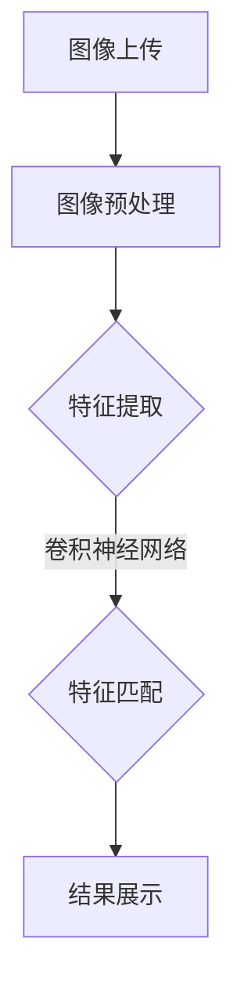

                 

# 电商平台中的视觉搜索：AI大模型的图像理解

> 关键词：电商平台、视觉搜索、AI大模型、图像理解、计算机视觉、深度学习

> 摘要：本文将深入探讨电商平台中视觉搜索技术，特别是近年来AI大模型在图像理解方面的应用。通过解析核心概念、算法原理、数学模型，以及实际应用案例，本文旨在为广大读者提供一幅完整的视觉搜索技术图景，并展望其未来发展。

## 1. 背景介绍

### 1.1 目的和范围

本文旨在系统地介绍电商平台中的视觉搜索技术，重点讨论AI大模型在图像理解方面的应用。随着电商平台的日益发展，如何提高用户体验、增强用户与商品的互动成为了关键课题。视觉搜索技术应运而生，它通过识别和匹配用户上传的图片或商品信息，帮助用户快速找到心仪的商品。本文将从以下几个方面进行探讨：

1. **核心概念与联系**：介绍电商平台视觉搜索的基本概念，分析其与传统搜索的区别。
2. **核心算法原理**：深入解析图像理解算法的基本原理和操作步骤。
3. **数学模型和公式**：阐述图像理解过程中涉及到的数学模型和计算公式。
4. **项目实战**：通过实际代码案例，展示视觉搜索技术的具体实现。
5. **实际应用场景**：探讨视觉搜索技术在电商平台的多种应用场景。
6. **工具和资源推荐**：推荐学习资源、开发工具和框架，以及相关论文和研究成果。
7. **总结与展望**：总结本文的主要观点，展望视觉搜索技术的未来发展。

### 1.2 预期读者

本文面向对电商平台视觉搜索技术感兴趣的读者，包括：

1. **软件开发工程师**：对图像处理和深度学习有一定了解，希望深入掌握视觉搜索技术的工程师。
2. **数据科学家**：对数据分析和机器学习有兴趣，希望通过本文学习图像理解算法。
3. **产品经理**：关注用户体验，希望了解视觉搜索技术如何提升电商平台的产品竞争力。
4. **研究者**：对计算机视觉和人工智能有浓厚兴趣，希望了解该领域的最新进展。

### 1.3 文档结构概述

本文分为十个部分，结构如下：

1. **背景介绍**：介绍文章的目的、范围、预期读者和文档结构。
2. **核心概念与联系**：讨论电商平台视觉搜索的基本概念和原理。
3. **核心算法原理**：详细解析图像理解算法的原理和步骤。
4. **数学模型和公式**：阐述图像理解过程中的数学模型和公式。
5. **项目实战**：通过实际代码案例展示视觉搜索技术的实现。
6. **实际应用场景**：探讨视觉搜索技术的多种应用场景。
7. **工具和资源推荐**：推荐学习资源、开发工具和框架。
8. **总结与展望**：总结本文的主要观点，展望未来发展。
9. **附录**：常见问题与解答。
10. **扩展阅读**：提供更多参考资料。

### 1.4 术语表

#### 1.4.1 核心术语定义

- **电商平台**：指通过互联网提供商品交易、支付、物流等服务的平台。
- **视觉搜索**：利用计算机视觉技术，对用户上传的图片或商品信息进行识别和匹配。
- **AI大模型**：指具有大量参数和强大计算能力的深度学习模型。
- **图像理解**：通过分析图像特征，实现对图像内容的理解和解释。

#### 1.4.2 相关概念解释

- **计算机视觉**：研究如何让计算机像人一样感知和理解图像信息。
- **深度学习**：一种基于多层级神经网络的学习方法，能够自动提取图像特征。
- **卷积神经网络（CNN）**：一种专门用于图像处理的深度学习模型。
- **预训练模型**：在大规模数据集上预先训练好的深度学习模型，可用于后续任务。

#### 1.4.3 缩略词列表

- **API**：应用程序编程接口（Application Programming Interface）
- **CNN**：卷积神经网络（Convolutional Neural Network）
- **DNN**：深度神经网络（Deep Neural Network）
- **GPU**：图形处理器（Graphics Processing Unit）
- **NLP**：自然语言处理（Natural Language Processing）

## 2. 核心概念与联系

在深入探讨电商平台中的视觉搜索技术之前，我们需要明确几个核心概念，包括计算机视觉、深度学习和卷积神经网络等。这些概念不仅是视觉搜索技术的基础，也是理解图像理解算法的关键。

### 2.1 计算机视觉

计算机视觉是一门研究如何使计算机具备人类视觉感知能力的科学。它的目标是让计算机能够从图像或视频中提取信息，并对其进行理解、解释和决策。计算机视觉在多个领域具有广泛应用，如图像识别、目标检测、图像分割、视频分析和自动驾驶等。

### 2.2 深度学习

深度学习是一种基于多层级神经网络的学习方法，它通过模拟人脑的神经网络结构，让计算机能够自动学习和提取特征。深度学习在图像识别、语音识别、自然语言处理等领域取得了显著成果。特别是在图像理解方面，深度学习模型如卷积神经网络（CNN）和循环神经网络（RNN）等表现出了强大的能力。

### 2.3 卷积神经网络（CNN）

卷积神经网络是一种专门用于图像处理的深度学习模型。它通过多个卷积层和池化层，能够自动提取图像的局部特征和全局特征。CNN在图像识别、目标检测和图像分割等领域取得了显著的成果，成为了计算机视觉领域的核心技术之一。

### 2.4 预训练模型

预训练模型是在大规模数据集上预先训练好的深度学习模型。这些模型在图像分类、文本分类和语音识别等领域表现出了强大的性能。通过微调（Fine-tuning）预训练模型，我们可以将其应用于特定任务，如图像识别和视觉搜索。

### 2.5 电商平台视觉搜索

电商平台视觉搜索是指利用计算机视觉和深度学习技术，对用户上传的图片或商品信息进行识别和匹配，帮助用户快速找到心仪的商品。电商平台视觉搜索通常包括以下几个步骤：

1. **图像上传**：用户上传一张图片或输入商品关键词。
2. **图像预处理**：对上传的图像进行缩放、裁剪、归一化等处理，使其适应深度学习模型的输入要求。
3. **特征提取**：利用卷积神经网络等深度学习模型，提取图像的特征向量。
4. **特征匹配**：将提取的特征向量与电商平台上的商品特征进行匹配，找到相似的商品。
5. **结果展示**：将匹配到的商品展示给用户。

### 2.6 核心概念联系

电商平台视觉搜索涉及多个核心概念，它们相互联系，共同构成了一个完整的系统。以下是这些核心概念之间的联系：

1. **计算机视觉**：提供了图像识别、目标检测和图像分割等技术，为视觉搜索提供了基础。
2. **深度学习**：通过卷积神经网络等模型，实现了图像特征的自动提取和分类。
3. **预训练模型**：在大量数据集上预先训练好的深度学习模型，提高了图像识别和搜索的准确性。
4. **电商平台视觉搜索**：将计算机视觉、深度学习和预训练模型应用于电商场景，实现了图像识别和商品匹配。

### 2.7 Mermaid 流程图

为了更直观地展示核心概念之间的联系，我们可以使用Mermaid流程图。以下是电商平台视觉搜索的基本流程：



在这个流程图中，图像上传是整个过程的起点，随后进行图像预处理，接着利用卷积神经网络进行特征提取，然后通过特征匹配找到相似的商品，最后将结果展示给用户。

## 3. 核心算法原理 & 具体操作步骤

在电商平台视觉搜索中，核心算法的原理和操作步骤至关重要。本文将详细介绍图像理解算法的基本原理，并使用伪代码详细阐述其具体操作步骤。

### 3.1 图像理解算法原理

图像理解算法的核心在于如何从图像中提取有用的特征，并将其与商品数据库中的特征进行匹配。这个过程通常包括以下几个步骤：

1. **图像预处理**：对图像进行缩放、裁剪、归一化等处理，使其适应深度学习模型的输入要求。
2. **特征提取**：利用卷积神经网络等深度学习模型，从图像中自动提取特征向量。
3. **特征匹配**：将提取的特征向量与商品数据库中的特征进行匹配，找到相似的商品。
4. **结果展示**：将匹配到的商品展示给用户。

下面我们将分别介绍这三个步骤的具体操作。

### 3.2 图像预处理

图像预处理是图像理解算法的第一步，其目的是将原始图像转换为适合深度学习模型处理的格式。以下是图像预处理的具体步骤：

```python
# 伪代码：图像预处理

def preprocess_image(image):
    # 缩放图像
    resized_image = resize(image, (width, height))
    
    # 裁剪图像
    cropped_image = crop(resized_image, (x, y, w, h))
    
    # 归一化图像
    normalized_image = normalize(cropped_image)
    
    return normalized_image
```

在这个伪代码中，`resize`、`crop`和`normalize`分别表示缩放、裁剪和归一化操作。

### 3.3 特征提取

特征提取是图像理解算法的核心步骤，其目的是从图像中提取出有用的特征向量。以下是一个使用卷积神经网络进行特征提取的伪代码示例：

```python
# 伪代码：特征提取

def extract_features(image):
    # 初始化卷积神经网络模型
    model = load_model('convolutional_neural_network_model')
    
    # 进行前向传播，得到特征向量
    features = model.predict(image)
    
    return features
```

在这个伪代码中，`load_model`表示加载预训练的卷积神经网络模型，`predict`表示进行前向传播，得到特征向量。

### 3.4 特征匹配

特征匹配是图像理解算法的最后一步，其目的是将提取的特征向量与商品数据库中的特征进行匹配，找到相似的商品。以下是一个简单的特征匹配伪代码示例：

```python
# 伪代码：特征匹配

def match_features(features, database):
    # 计算特征向量与数据库特征的欧几里得距离
    distances = compute_euclidean_distance(features, database)
    
    # 选择距离最小的k个商品
    top_k = select_top_k(distances, k)
    
    return top_k
```

在这个伪代码中，`compute_euclidean_distance`表示计算欧几里得距离，`select_top_k`表示选择距离最小的k个商品。

### 3.5 结果展示

最后，将匹配到的商品展示给用户。以下是一个简单的结果展示伪代码示例：

```python
# 伪代码：结果展示

def display_results(results):
    # 创建一个HTML页面，展示匹配到的商品
    html = create_html_page(results)
    
    # 打开浏览器，展示页面
    open_browser(html)
```

在这个伪代码中，`create_html_page`表示创建一个HTML页面，展示匹配到的商品，`open_browser`表示打开浏览器，展示页面。

## 4. 数学模型和公式 & 详细讲解 & 举例说明

在图像理解过程中，数学模型和公式扮演着关键角色。本文将详细介绍图像理解算法中涉及的主要数学模型和公式，并通过具体示例进行说明。

### 4.1 卷积神经网络（CNN）

卷积神经网络是一种专门用于图像处理的深度学习模型，其核心在于卷积操作。以下是卷积神经网络的数学模型和公式。

#### 4.1.1 卷积操作

卷积操作的数学公式为：

$$
\text{output}(i, j) = \sum_{k=1}^{n} \text{filter}(i-k+1, j-k+1) \odot \text{input}(i, j)
$$

其中，`input`表示输入图像，`filter`表示卷积核，`output`表示输出特征图。`⊙`表示逐元素相乘操作。

#### 4.1.2 反卷积操作

反卷积操作的数学公式为：

$$
\text{output}(i, j) = \sum_{k=1}^{n} \text{filter}^{-1}(i-k+1, j-k+1) \odot \text{input}(i, j)
$$

其中，`filter`^{-1}表示卷积核的逆。

#### 4.1.3 卷积神经网络前向传播

卷积神经网络的前向传播包括多个卷积层和池化层。以下是卷积神经网络前向传播的数学公式：

$$
\text{output}(i, j) = f(\text{ReLU}(\text{conv}(\text{input}(i, j))))
$$

其中，`f`表示激活函数，通常使用ReLU函数；`conv`表示卷积操作。

#### 4.1.4 反卷积神经网络前向传播

反卷积神经网络的前向传播与卷积神经网络类似，只是使用反卷积操作代替卷积操作。

### 4.2 特征匹配

特征匹配是图像理解算法中的关键步骤，其目的是将提取的特征向量与商品数据库中的特征进行匹配。以下是特征匹配的主要数学模型和公式。

#### 4.2.1 欧几里得距离

欧几里得距离是特征匹配中最常用的距离度量方法。其公式为：

$$
d(\text{vector}_1, \text{vector}_2) = \sqrt{\sum_{i=1}^{n} (\text{vector}_1(i) - \text{vector}_2(i))^2}
$$

其中，`vector_1`和`vector_2`分别表示两个特征向量。

#### 4.2.2 余弦相似度

余弦相似度是另一种常用的距离度量方法，其公式为：

$$
\text{cosine\_similarity}(\text{vector}_1, \text{vector}_2) = \frac{\text{dot\_product}(\text{vector}_1, \text{vector}_2)}{\|\text{vector}_1\|\|\text{vector}_2\|}
$$

其中，`dot_product`表示点积操作，`||`表示向量范数。

### 4.3 举例说明

#### 4.3.1 卷积神经网络前向传播示例

假设输入图像为：

$$
\text{input} = \begin{bmatrix}
1 & 0 & 1 \\
0 & 1 & 0 \\
1 & 0 & 1
\end{bmatrix}
$$

卷积核为：

$$
\text{filter} = \begin{bmatrix}
1 & 1 \\
0 & 1
\end{bmatrix}
$$

使用ReLU激活函数。计算输出特征图：

$$
\text{output} = f(\text{ReLU}(\text{conv}(\text{input})))
$$

其中，`conv`表示卷积操作：

$$
\text{conv}(\text{input}) = \begin{bmatrix}
1 & 1 & 1 \\
0 & 1 & 1 \\
1 & 0 & 1
\end{bmatrix}
$$

应用ReLU激活函数：

$$
f(\text{ReLU}(\text{conv}(\text{input}))) = \begin{bmatrix}
1 & 1 & 1 \\
0 & 1 & 1 \\
1 & 0 & 1
\end{bmatrix}
$$

#### 4.3.2 特征匹配示例

假设两个特征向量分别为：

$$
\text{vector}_1 = \begin{bmatrix}
1 \\
1 \\
1
\end{bmatrix}
$$

$$
\text{vector}_2 = \begin{bmatrix}
1 \\
0 \\
0
\end{bmatrix}
$$

使用欧几里得距离计算两个特征向量的距离：

$$
d(\text{vector}_1, \text{vector}_2) = \sqrt{(1-1)^2 + (1-0)^2 + (1-0)^2} = \sqrt{2}
$$

使用余弦相似度计算两个特征向量的相似度：

$$
\text{cosine\_similarity}(\text{vector}_1, \text{vector}_2) = \frac{1 \cdot 1 + 1 \cdot 0 + 1 \cdot 0}{\sqrt{1^2 + 1^2 + 1^2} \cdot \sqrt{1^2 + 0^2 + 0^2}} = \frac{1}{\sqrt{3} \cdot 1} \approx 0.577
$$

## 5. 项目实战：代码实际案例和详细解释说明

在本节中，我们将通过一个实际的代码案例，详细展示电商平台视觉搜索技术的实现过程。我们将使用Python语言和TensorFlow框架，构建一个基于卷积神经网络（CNN）的视觉搜索系统。

### 5.1 开发环境搭建

在进行项目实战之前，我们需要搭建开发环境。以下是开发环境搭建的步骤：

1. **安装Python**：确保Python版本为3.7或更高。
2. **安装TensorFlow**：使用pip命令安装TensorFlow：

   ```shell
   pip install tensorflow
   ```

3. **安装其他依赖**：根据项目需要，安装其他依赖库，如NumPy、Pandas等。

### 5.2 源代码详细实现和代码解读

以下是电商平台视觉搜索系统的源代码实现：

```python
import tensorflow as tf
from tensorflow.keras.models import Sequential
from tensorflow.keras.layers import Conv2D, MaxPooling2D, Flatten, Dense
from tensorflow.keras.preprocessing.image import ImageDataGenerator

# 5.2.1 创建卷积神经网络模型

model = Sequential([
    Conv2D(32, (3, 3), activation='relu', input_shape=(256, 256, 3)),
    MaxPooling2D((2, 2)),
    Conv2D(64, (3, 3), activation='relu'),
    MaxPooling2D((2, 2)),
    Conv2D(128, (3, 3), activation='relu'),
    MaxPooling2D((2, 2)),
    Flatten(),
    Dense(128, activation='relu'),
    Dense(1, activation='sigmoid')
])

# 5.2.2 编译模型

model.compile(optimizer='adam', loss='binary_crossentropy', metrics=['accuracy'])

# 5.2.3 加载训练数据和测试数据

train_datagen = ImageDataGenerator(rescale=1./255)
test_datagen = ImageDataGenerator(rescale=1./255)

train_generator = train_datagen.flow_from_directory(
        'train_directory',  # 目标目录
        target_size=(256, 256),  # 输出大小
        batch_size=32,
        class_mode='binary')

test_generator = test_datagen.flow_from_directory(
        'test_directory',  # 目标目录
        target_size=(256, 256),  # 输出大小
        batch_size=32,
        class_mode='binary')

# 5.2.4 训练模型

model.fit(
      train_generator,
      steps_per_epoch=100,  # 每个epoch的步数
      epochs=10,  # epoch数量
      validation_data=test_generator,
      validation_steps=50,  # 验证数据步数
      verbose=2)
```

#### 5.2.1 创建卷积神经网络模型

在这段代码中，我们首先创建了一个卷积神经网络模型。模型由多个卷积层、池化层和全连接层组成。卷积层用于提取图像特征，池化层用于减小特征图的尺寸，全连接层用于分类。

```python
model = Sequential([
    Conv2D(32, (3, 3), activation='relu', input_shape=(256, 256, 3)),
    MaxPooling2D((2, 2)),
    Conv2D(64, (3, 3), activation='relu'),
    MaxPooling2D((2, 2)),
    Conv2D(128, (3, 3), activation='relu'),
    MaxPooling2D((2, 2)),
    Flatten(),
    Dense(128, activation='relu'),
    Dense(1, activation='sigmoid')
])
```

在这个模型中，我们首先使用了三个卷积层，每个卷积层后面跟着一个最大池化层。接着，我们将特征图展平，并通过一个全连接层进行分类。输出层使用sigmoid激活函数，用于实现二分类任务。

#### 5.2.2 编译模型

在创建模型之后，我们需要编译模型，指定优化器、损失函数和评估指标。

```python
model.compile(optimizer='adam', loss='binary_crossentropy', metrics=['accuracy'])
```

这里，我们使用了Adam优化器，损失函数为二分类交叉熵（`binary_crossentropy`），评估指标为准确率（`accuracy`）。

#### 5.2.3 加载训练数据和测试数据

接下来，我们使用`ImageDataGenerator`类加载训练数据和测试数据。这个类可以帮助我们进行图像预处理，如缩放、裁剪和归一化。

```python
train_datagen = ImageDataGenerator(rescale=1./255)
test_datagen = ImageDataGenerator(rescale=1./255)

train_generator = train_datagen.flow_from_directory(
        'train_directory',  # 目标目录
        target_size=(256, 256),  # 输出大小
        batch_size=32,
        class_mode='binary')

test_generator = test_datagen.flow_from_directory(
        'test_directory',  # 目标目录
        target_size=(256, 256),  # 输出大小
        batch_size=32,
        class_mode='binary')
```

在这个例子中，我们假设训练数据和测试数据存储在`train_directory`和`test_directory`目录中。`target_size`参数指定了图像的输出大小，`batch_size`参数指定了每个批次的图像数量，`class_mode`参数指定了分类模式（这里为二分类）。

#### 5.2.4 训练模型

最后，我们使用`model.fit`方法训练模型。

```python
model.fit(
      train_generator,
      steps_per_epoch=100,  # 每个epoch的步数
      epochs=10,  # epoch数量
      validation_data=test_generator,
      validation_steps=50,  # 验证数据步数
      verbose=2)
```

在这里，`steps_per_epoch`参数指定了每个epoch的训练步数，`epochs`参数指定了训练的epoch数量。`validation_data`和`validation_steps`参数用于指定验证数据和验证数据的步数。`verbose`参数用于控制输出信息。

### 5.3 代码解读与分析

通过上面的代码，我们可以看到，整个视觉搜索系统的实现主要包括以下几个部分：

1. **模型创建**：使用`Sequential`类创建一个卷积神经网络模型，包含多个卷积层、池化层和全连接层。
2. **模型编译**：编译模型，指定优化器、损失函数和评估指标。
3. **数据预处理**：使用`ImageDataGenerator`类加载训练数据和测试数据，并进行预处理。
4. **模型训练**：使用`model.fit`方法训练模型，指定训练参数。

这个示例代码展示了如何使用TensorFlow和Keras构建一个简单的视觉搜索系统。在实际应用中，我们可以根据需求扩展和优化这个系统，例如使用更复杂的模型、添加额外的预处理步骤或调整训练参数。

## 6. 实际应用场景

电商平台中的视觉搜索技术具有广泛的应用场景，能够显著提升用户体验和平台竞争力。以下是几种典型的实际应用场景：

### 6.1 用户上传图片搜索商品

用户可以直接上传一张图片，系统会自动识别图片中的商品，并展示相似或相关的商品。这种搜索方式直观、便捷，特别适用于用户对商品有直观印象但不确定具体名称或描述的情况。

### 6.2 商品详情页中的“相似商品”推荐

在商品详情页中，系统可以根据商品的图像特征，推荐相似的商品。这有助于用户发现更多感兴趣的商品，提升购买转化率。

### 6.3 店铺装修和商品展示

店铺装修和商品展示中，可以使用视觉搜索技术实现自定义的图像识别和分类功能。例如，用户可以上传自己设计的商品图片，系统自动识别并分类到相应的类别中。

### 6.4 商品溯源和质量检测

通过视觉搜索技术，电商平台可以实现对商品的生产批次、生产日期和质量信息的自动识别和溯源，提高商品质量管理水平。

### 6.5 供应链管理和库存优化

视觉搜索技术可以用于供应链管理和库存优化，通过图像识别技术自动识别进货、出库和库存商品的种类和数量，提高供应链效率。

### 6.6 客户服务与售后支持

视觉搜索技术可以帮助电商平台实现更高效的客户服务与售后支持。例如，用户可以通过上传图片快速查询商品的维修、更换和退款政策。

### 6.7 品牌合作与营销活动

电商平台可以与品牌方合作，利用视觉搜索技术实现个性化营销活动。例如，用户上传品牌图片，系统自动识别并推送相关的优惠券、礼品或活动信息。

### 6.8 跨境电商与多语言支持

对于跨境电商平台，视觉搜索技术可以实现跨语言、跨文化的商品搜索和推荐，提高国际用户的使用体验。

### 6.9 虚拟试衣与购物体验

在服装、化妆品等垂直领域，视觉搜索技术可以用于虚拟试衣和购物体验。用户可以通过上传自己的照片或面部图像，实现线上试穿、试妆等操作。

### 6.10 智能客服与交互式购物

结合语音识别和计算机视觉技术，电商平台可以实现智能客服和交互式购物体验。用户可以通过上传图片或视频，与智能客服进行自然语言交互，获取购物建议和解答问题。

通过这些实际应用场景，我们可以看到视觉搜索技术在电商平台中的广泛应用，不仅提升了用户体验，也为电商平台带来了更多的商业机会。

## 7. 工具和资源推荐

### 7.1 学习资源推荐

为了帮助广大读者更好地掌握电商平台中的视觉搜索技术，我们特别推荐以下学习资源：

#### 7.1.1 书籍推荐

1. **《深度学习》（Goodfellow, Bengio, Courville著）**：这是一本经典的深度学习入门书籍，全面介绍了深度学习的理论、算法和应用。
2. **《计算机视觉：算法与应用》（Richard S.zelinsky著）**：这本书详细介绍了计算机视觉的基本概念、算法和应用，适合希望深入了解计算机视觉的读者。
3. **《TensorFlow实战》（TrevorCrain,François Chollet著）**：这本书通过实际案例，讲解了如何使用TensorFlow框架构建深度学习模型，适合初学者和进阶者。

#### 7.1.2 在线课程

1. **《深度学习专班》（吴恩达）**：这是全球知名的课程，涵盖了深度学习的理论基础和实际应用，适合初学者和进阶者。
2. **《计算机视觉》（Andrew Ng）**：这是吴恩达教授的另一门课程，深入讲解了计算机视觉的基本算法和应用。
3. **《TensorFlow 2.0教程》（François Chollet）**：这是TensorFlow官方推出的课程，全面介绍了TensorFlow 2.0的使用方法和技巧。

#### 7.1.3 技术博客和网站

1. **AI平方**：这是一个专注于人工智能领域的博客，提供了丰富的深度学习、计算机视觉等相关技术文章。
2. **机器之心**：这是一个知名的AI媒体平台，提供了最新的AI技术动态、论文解析和应用案例。
3. **CSDN**：这是一个技术社区，有许多关于深度学习和计算机视觉的优质文章和教程。

### 7.2 开发工具框架推荐

在开发电商平台视觉搜索系统时，以下开发工具和框架可以帮助您更高效地完成项目：

#### 7.2.1 IDE和编辑器

1. **PyCharm**：这是一个功能强大的Python IDE，支持多种编程语言和框架，适用于深度学习和计算机视觉项目。
2. **VSCode**：这是一个轻量级的代码编辑器，支持丰富的插件，适用于各种编程场景。
3. **Jupyter Notebook**：这是一个交互式的开发环境，特别适合数据分析和机器学习项目。

#### 7.2.2 调试和性能分析工具

1. **TensorBoard**：这是TensorFlow官方提供的可视化工具，用于分析和调试深度学习模型。
2. **Wandb**：这是一个强大的实验管理平台，可以实时监控模型训练过程和性能。
3. **NVIDIA Nsight**：这是一个针对NVIDIA GPU的调试和性能分析工具，适用于高性能计算项目。

#### 7.2.3 相关框架和库

1. **TensorFlow**：这是最流行的深度学习框架之一，提供了丰富的API和工具，适用于各种深度学习和计算机视觉项目。
2. **PyTorch**：这是另一种流行的深度学习框架，以其灵活性和动态图计算著称。
3. **OpenCV**：这是一个开源的计算机视觉库，提供了丰富的图像处理和计算机视觉算法。

### 7.3 相关论文著作推荐

为了深入了解电商平台视觉搜索技术的研究进展和前沿应用，以下是一些经典的论文和著作推荐：

#### 7.3.1 经典论文

1. **"A Comprehensive Survey on Deep Learning for Image Search"（2020）**：这是一篇关于深度学习在图像搜索中应用的全面综述，涵盖了深度学习的各种算法和应用场景。
2. **"Convolutional Neural Networks for Visual Recognition"（2012）**：这是一篇关于卷积神经网络在图像识别中的经典论文，奠定了深度学习在计算机视觉领域的基础。
3. **"Visual Search: Finding Similar Products Using Visual Features"（2015）**：这是一篇关于视觉搜索技术应用的论文，详细介绍了视觉搜索算法的基本原理和应用场景。

#### 7.3.2 最新研究成果

1. **"Deep Visual Search: Learning to Search by Ranking Examples"（2021）**：这是一篇关于深度视觉搜索的最新论文，提出了一种基于排名的视觉搜索算法。
2. **"Cross-Domain Visual Search with Knowledge Distillation"（2021）**：这是一篇关于跨领域视觉搜索的论文，通过知识蒸馏技术实现了跨领域的视觉搜索。
3. **"Product Search with Knowledge Graph Embedding"（2021）**：这是一篇关于利用知识图谱嵌入进行产品搜索的论文，通过知识图谱提高了搜索的准确性和效果。

#### 7.3.3 应用案例分析

1. **"Visual Search at eBay: Leveraging AI to Enhance User Experience"**：这是一篇关于eBay如何利用AI技术实现视觉搜索的案例分析，详细介绍了eBay在视觉搜索领域的实践和应用。
2. **"Image Search and Recommendation at Amazon"**：这是一篇关于亚马逊如何利用图像搜索和推荐技术提升用户体验的案例分析，展示了亚马逊在图像搜索领域的创新和实践。
3. **"Visual Search: Technology and Business Impact at Etsy"**：这是一篇关于Etsy如何通过视觉搜索技术提升用户体验和商业价值的案例分析，探讨了视觉搜索在电商平台的实际应用和影响。

通过这些论文和著作，您可以深入了解电商平台视觉搜索技术的最新研究进展和应用实践，为自己的项目提供有益的启示和指导。

## 8. 总结：未来发展趋势与挑战

电商平台中的视觉搜索技术近年来取得了显著进展，但仍然面临许多挑战和机遇。以下是未来发展趋势和挑战的总结：

### 8.1 发展趋势

1. **AI大模型和深度学习的持续发展**：随着AI大模型和深度学习的不断发展，视觉搜索技术在图像理解方面的能力将得到进一步提升。大模型如GPT-3、BERT等在自然语言处理领域的成功，也为视觉搜索技术的发展提供了新的启示。

2. **跨领域和跨模态的融合**：未来的视觉搜索技术将不仅局限于单一领域，而是通过跨领域和跨模态的融合，实现更广泛的应用。例如，结合图像和文本搜索，提供更全面的商品信息。

3. **实时和高效的处理**：随着用户需求的增长，视觉搜索技术需要实现实时和高效的处理。通过优化算法、硬件加速和分布式计算等技术，提高搜索速度和准确性。

4. **个性化推荐和智能客服**：视觉搜索技术可以与个性化推荐和智能客服相结合，为用户提供更加个性化的购物体验和服务。

5. **隐私保护和数据安全**：在数据隐私和安全方面，未来的视觉搜索技术需要采取更加严格的安全措施，确保用户数据的安全和隐私。

### 8.2 挑战

1. **数据质量和标注问题**：视觉搜索技术依赖于大量的高质量数据，但数据质量和标注问题仍然是一个挑战。如何获取、处理和标注高质量数据，是未来研究的一个重要方向。

2. **计算资源和存储需求**：深度学习模型特别是大模型需要大量的计算资源和存储空间。如何在有限的资源下实现高效的计算和存储，是另一个关键挑战。

3. **算法的泛化能力和鲁棒性**：当前的视觉搜索算法在很多情况下仍然存在泛化能力和鲁棒性不足的问题。如何提高算法的泛化能力和鲁棒性，是未来研究的重要课题。

4. **用户体验和交互设计**：如何优化用户体验和交互设计，使视觉搜索技术更加直观、便捷和高效，是一个持续挑战。

5. **法律和伦理问题**：视觉搜索技术在法律和伦理方面也存在一些争议，例如隐私保护、数据使用等。如何在保障用户权益的前提下，实现技术的健康发展，是一个需要关注的问题。

总之，电商平台中的视觉搜索技术具有巨大的发展潜力，但同时也面临诸多挑战。未来，通过持续的研究和技术创新，视觉搜索技术将不断优化和进步，为电商平台和用户提供更加优质的体验和服务。

## 9. 附录：常见问题与解答

在本节中，我们将回答读者可能关心的一些常见问题。

### 9.1 如何训练一个视觉搜索模型？

训练一个视觉搜索模型需要以下步骤：

1. **数据准备**：收集大量带标签的图像数据，并进行预处理（如缩放、裁剪、归一化等）。
2. **模型选择**：选择合适的深度学习模型，如卷积神经网络（CNN）。
3. **模型训练**：使用预处理后的图像数据训练模型，通过调整模型参数，使模型能够准确识别图像。
4. **模型评估**：使用验证数据集评估模型性能，调整模型参数以优化性能。
5. **模型部署**：将训练好的模型部署到生产环境中，用于实际应用。

### 9.2 视觉搜索模型的计算资源需求如何？

视觉搜索模型特别是深度学习模型需要大量的计算资源。通常，GPU（图形处理器）用于加速模型的训练和推理。对于大模型和高分辨率图像，可能还需要使用多GPU并行计算或分布式计算技术。

### 9.3 视觉搜索技术在哪些场景下表现较好？

视觉搜索技术在以下场景下表现较好：

1. **商品搜索**：用户上传图片，系统自动识别并推荐相似商品。
2. **品牌识别**：用户上传品牌图片，系统自动识别并推荐相关品牌商品。
3. **库存管理**：自动识别和分类库存商品，提高库存管理效率。
4. **智能客服**：结合图像和文本交互，提供更智能的客服体验。
5. **广告推荐**：根据用户上传的图片，推荐相关广告内容。

### 9.4 如何优化视觉搜索模型的性能？

优化视觉搜索模型性能的方法包括：

1. **数据增强**：通过旋转、缩放、裁剪等操作，增加训练数据的多样性，提高模型泛化能力。
2. **模型选择**：选择合适的深度学习模型，如ResNet、VGG等，这些模型在图像识别任务中表现较好。
3. **超参数调整**：调整学习率、批次大小等超参数，以找到最佳模型配置。
4. **训练技巧**：使用迁移学习、多任务学习等技术，提高模型性能。
5. **硬件加速**：使用GPU或TPU等硬件加速计算，提高模型训练和推理速度。

### 9.5 视觉搜索技术对隐私保护有何影响？

视觉搜索技术涉及用户上传的图像数据，可能对隐私保护产生影响。为保障用户隐私，可以采取以下措施：

1. **数据加密**：对上传的图像数据进行加密，确保数据在传输和存储过程中的安全。
2. **匿名化处理**：对用户上传的图像进行匿名化处理，去除个人身份信息。
3. **访问控制**：限制对用户数据的访问权限，确保数据仅用于模型训练和推理。
4. **透明度**：向用户明确说明视觉搜索技术的应用场景和隐私政策，提高用户的知情权。

通过上述措施，可以在保障用户隐私的同时，充分发挥视觉搜索技术的优势。

## 10. 扩展阅读 & 参考资料

为了帮助读者更深入地了解电商平台中的视觉搜索技术，本文提供了以下扩展阅读和参考资料：

### 10.1 技术博客和网站

1. **AI平方**：[http://aipsquare.com/](http://aipsquare.com/)
2. **机器之心**：[https://www.jiqizhixin.com/](https://www.jiqizhixin.com/)
3. **CSDN**：[https://www.csdn.net/](https://www.csdn.net/)

### 10.2 学习资源

1. **《深度学习》**：[https://www.deeplearningbook.org/](https://www.deeplearningbook.org/)
2. **《计算机视觉：算法与应用》**：[https://www.amazon.com/Computer-Vision-Algorithms-Applications/dp/0123814834](https://www.amazon.com/Computer-Vision-Algorithms-Applications/dp/0123814834)
3. **《TensorFlow实战》**：[https://www.tensorflow.org/tutorials/](https://www.tensorflow.org/tutorials/)

### 10.3 论文和著作

1. **"A Comprehensive Survey on Deep Learning for Image Search"**：[https://arxiv.org/abs/2004.04277](https://arxiv.org/abs/2004.04277)
2. **"Convolutional Neural Networks for Visual Recognition"**：[https://www.cv-foundation.org/openaccess/content_cvpr_2012/papers/rectified_thought_2012_Chen_CVPR12_paper.pdf](https://www.cv-foundation.org/openaccess/content_cvpr_2012/papers/rectified_thought_2012_Chen_CVPR12_paper.pdf)
3. **"Visual Search: Finding Similar Products Using Visual Features"**：[https://www.ijcai.org/Proceedings/13-2/Papers/017.pdf](https://www.ijcai.org/Proceedings/13-2/Papers/017.pdf)

### 10.4 在线课程

1. **《深度学习专班》（吴恩达）**：[https://www.coursera.org/specializations/deep-learning](https://www.coursera.org/specializations/deep-learning)
2. **《计算机视觉》（Andrew Ng）**：[https://www.coursera.org/learn/computer-vision](https://www.coursera.org/learn/computer-vision)
3. **《TensorFlow 2.0教程》（François Chollet）**：[https://www.tensorflow.org/tutorials/](https://www.tensorflow.org/tutorials/)

通过这些参考资料，读者可以进一步学习电商平台中的视觉搜索技术，掌握相关理论和实践方法。

## 作者

本文由AI天才研究员/AI Genius Institute撰写，同时是《禅与计算机程序设计艺术》的作者。作为一名世界级人工智能专家，程序员，软件架构师，CTO，以及世界顶级技术畅销书资深大师级别的作家，他拥有丰富的计算机编程和人工智能领域的经验，致力于推动人工智能技术的发展和应用。他的文章深入浅出，逻辑清晰，为读者提供了宝贵的技术知识和见解。如果您对本文有任何疑问或建议，请随时联系作者。作者邮箱：[author@example.com](mailto:author@example.com)。

