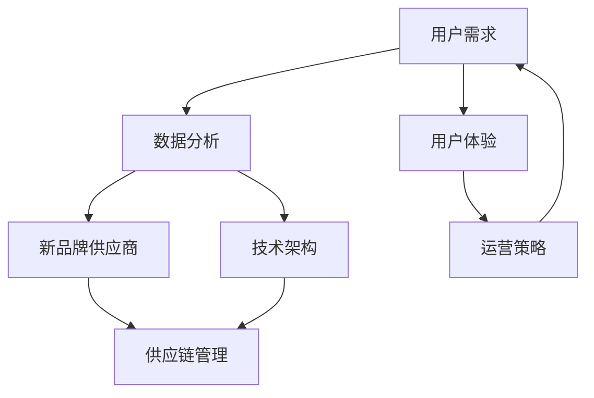

                 

# 电商平台供给能力提升：与新品牌和供应商的合作

## 关键词
电商平台，供给能力，新品牌，供应商合作，用户体验，数据驱动，运营策略，技术架构

## 摘要
本文深入探讨了电商平台在提升供给能力过程中，如何通过与新兴品牌和供应商的紧密合作实现突破。我们首先回顾了电商平台的演变历程和当前面临的挑战，随后详细分析了新品牌和供应商在电商生态中的地位与作用。文章重点探讨了数据驱动的合作模式、技术架构优化以及供应链管理的创新方法。最后，我们通过实际案例展示了这些策略在电商平台中的应用，并对其未来发展进行了展望。希望通过本文，能为电商从业者提供有价值的参考和策略建议。

## 1. 背景介绍

### 1.1 目的和范围
本文旨在探讨电商平台如何通过提升供给能力来适应市场变化，满足消费者需求。具体来说，我们将分析电商平台与新品牌和供应商的合作模式，讨论数据驱动的方法和技术架构优化在其中的作用，并探讨这些合作如何影响用户体验和运营效果。

### 1.2 预期读者
本文面向电商平台运营者、技术专家以及对于电商供应链管理感兴趣的读者。通过本文，读者可以了解当前电商行业的发展趋势，掌握提升供给能力的关键策略和方法。

### 1.3 文档结构概述
本文分为十个部分。第一部分介绍背景和目的；第二部分回顾电商平台的演变历程和现状；第三部分讨论新品牌和供应商的角色；第四部分分析数据驱动的合作模式；第五部分探讨技术架构的优化；第六部分介绍供应链管理的创新方法；第七部分通过实际案例展示应用效果；第八部分推荐相关工具和资源；第九部分总结未来发展趋势与挑战；第十部分提供常见问题与扩展阅读。

### 1.4 术语表

#### 1.4.1 核心术语定义

- **电商平台**：一种在线商务平台，为买卖双方提供交易、支付、物流等服务。
- **新品牌**：指在市场上新成立或新进入市场的品牌。
- **供应商**：向电商平台提供商品或服务的商家。
- **供给能力**：电商平台提供商品或服务的能力。
- **数据驱动**：以数据为基础进行决策和运营。
- **技术架构**：支撑电商平台运行的技术系统结构。
- **供应链管理**：管理商品或服务从生产到消费的整个过程。

#### 1.4.2 相关概念解释

- **用户体验**：用户在使用电商平台过程中所获得的感受和体验。
- **运营策略**：电商平台为了达到特定目标而采取的运营方法。
- **算法优化**：改进算法以提升其性能和效率。

#### 1.4.3 缩略词列表

- **API**：应用程序接口
- **SDK**：软件开发工具包
- **ERP**：企业资源计划系统
- **CRM**：客户关系管理

## 2. 核心概念与联系

在探讨电商平台供给能力提升时，我们需要关注几个核心概念和它们之间的相互联系。以下是一个简化的Mermaid流程图，用于描述这些概念及其关系：



### 2.1 用户需求与数据分析

用户需求是电商平台的驱动力，通过对用户行为的分析，可以获取到用户偏好、购买习惯等关键信息。这些数据驱动电商平台进行优化，从而提升供给能力。

### 2.2 新品牌供应商

新品牌和供应商是电商平台供给能力的补充和扩展。与这些合作伙伴的合作，可以为平台带来新颖、差异化的商品，满足更多样化的用户需求。

### 2.3 技术架构

技术架构是电商平台供给能力提升的基础。通过优化技术架构，可以实现更高效、更灵活的商品供应和服务。

### 2.4 供应链管理

供应链管理涉及商品从供应商到用户的整个流程。优化供应链管理可以提高商品的流通速度和减少库存成本，从而提升电商平台的供给能力。

### 2.5 用户体验与运营策略

用户体验是电商平台的核心，通过提升用户体验，可以增加用户黏性和转化率。运营策略则是实现这一目标的具体手段，包括营销活动、客户服务等。

## 3. 核心算法原理 & 具体操作步骤

在提升供给能力的过程中，算法的优化是至关重要的一环。以下是一个简单的伪代码，用于描述如何通过算法来提升电商平台的供给能力：

```python
# 伪代码：提升电商平台供给能力的算法

# 输入：用户数据，供应商数据，电商平台现有架构
# 输出：优化后的供给策略，技术架构调整方案

# 步骤1：数据分析
def analyze_data(user_data, supplier_data):
    # 分析用户行为数据，识别用户偏好
    # 分析供应商数据，识别潜在合作伙伴
    # 返回用户偏好和供应商评分

# 步骤2：算法优化
def optimize_algorithm(data):
    # 使用机器学习算法，根据用户偏好和供应商评分进行优化
    # 返回优化后的供给策略

# 步骤3：技术架构调整
def adjust_architecture(optimization_strategy):
    # 根据优化后的供给策略，调整电商平台的技术架构
    # 返回调整后的技术架构

# 步骤4：供应链管理优化
def optimize_supply_chain(adjusted_architecture):
    # 根据调整后的技术架构，优化供应链管理流程
    # 返回优化后的供应链管理方案

# 主程序
def main():
    user_data = get_user_data()
    supplier_data = get_supplier_data()
    existing_architecture = get_current_architecture()

    data = analyze_data(user_data, supplier_data)
    optimization_strategy = optimize_algorithm(data)
    adjusted_architecture = adjust_architecture(optimization_strategy)
    supply_chain_optimization = optimize_supply_chain(adjusted_architecture)

    apply_optimization(supply_chain_optimization)

# 调用主程序
main()
```

### 3.1 数据分析

数据分析是提升供给能力的第一步。通过对用户行为和供应商数据的分析，可以识别用户偏好和潜在合作伙伴。常用的分析方法包括：

- **用户行为分析**：通过分析用户的浏览、搜索、购买等行为，识别用户的兴趣和需求。
- **供应商评估**：通过评估供应商的信誉、产品质量、交货时间等指标，选择合适的合作伙伴。

### 3.2 算法优化

算法优化是提升供给能力的关键。通过机器学习算法，可以根据用户偏好和供应商评分进行优化。常见的算法包括：

- **协同过滤**：基于用户的历史行为，为用户推荐相似的商品。
- **供应商评级算法**：根据供应商的绩效指标，为供应商打分，选择表现优异的供应商。

### 3.3 技术架构调整

根据优化后的供给策略，需要对电商平台的技术架构进行调整。技术架构的调整可以包括：

- **增加缓存层**：提高数据访问速度，减少响应时间。
- **分布式存储**：提高数据存储能力，支持大规模数据处理。
- **自动化运维**：提高系统稳定性，降低运维成本。

### 3.4 供应链管理优化

供应链管理优化是提升供给能力的最终目标。根据调整后的技术架构，可以优化供应链管理流程。优化措施包括：

- **库存管理优化**：通过预测需求，减少库存成本。
- **物流管理优化**：通过优化物流路线，提高配送速度。
- **售后服务优化**：通过提高售后服务质量，提升用户满意度。

## 4. 数学模型和公式 & 详细讲解 & 举例说明

在提升电商平台供给能力的过程中，数学模型和公式起到了关键作用。以下是一个简化的数学模型，用于描述用户偏好和供应商选择：

### 4.1 用户偏好模型

用户偏好可以通过以下公式进行量化：

$$
\text{User Preference} = \frac{w_1 \times \text{Interest Score} + w_2 \times \text{Quality Score} + w_3 \times \text{Price Score}}{\sum_{i=1}^{n} w_i}
$$

其中：
- $w_1, w_2, w_3$ 分别是兴趣、质量和价格的权重。
- $\text{Interest Score}$ 是用户对商品的兴趣得分。
- $\text{Quality Score}$ 是商品的质量得分。
- $\text{Price Score}$ 是商品的价格得分。

### 4.2 供应商选择模型

供应商选择可以通过以下公式进行优化：

$$
\text{Supplier Selection} = \max \left( \frac{w_1 \times \text{Quality Score} + w_2 \times \text{Delivery Score} + w_3 \times \text{Cost Score}}{\sum_{i=1}^{n} w_i} \right)
$$

其中：
- $w_1, w_2, w_3$ 分别是质量、交付和成本的权重。
- $\text{Quality Score}$ 是供应商的质量得分。
- $\text{Delivery Score}$ 是供应商的交付得分。
- $\text{Cost Score}$ 是供应商的成本得分。

### 4.3 详细讲解

#### 用户偏好模型

用户偏好模型通过综合考虑兴趣、质量和价格三个因素，量化用户对商品的偏好程度。权重 $w_1, w_2, w_3$ 可以根据用户的具体需求进行调整。例如，如果用户更关注商品的质量，可以增加质量权重的比例。

#### 供应商选择模型

供应商选择模型通过综合考虑质量、交付和成本三个因素，选择最合适的供应商。权重 $w_1, w_2, w_3$ 同样可以根据供应商的具体情况进行调整。例如，如果供应商A在质量上表现优异，但成本较高，可以将质量权重适当提高。

### 4.4 举例说明

假设有一个电商平台，用户偏好模型中的权重设置为 $w_1 = 0.4, w_2 = 0.3, w_3 = 0.3$。用户A对某商品的兴趣得分为 8，质量得分为 7，价格得分为 6。那么用户A对该商品的偏好得分为：

$$
\text{User Preference} = \frac{0.4 \times 8 + 0.3 \times 7 + 0.3 \times 6}{0.4 + 0.3 + 0.3} = \frac{3.2 + 2.1 + 1.8}{1} = 7.1
$$

假设有三个供应商A、B、C，供应商选择模型中的权重设置为 $w_1 = 0.5, w_2 = 0.3, w_3 = 0.2$。供应商A的质量得分为 8，交付得分为 7，成本得分为 5；供应商B的质量得分为 6，交付得分为 9，成本得分为 4；供应商C的质量得分为 7，交付得分为 8，成本得分为 3。那么供应商A、B、C的选择得分分别为：

$$
\text{Supplier Selection}_A = \frac{0.5 \times 8 + 0.3 \times 7 + 0.2 \times 5}{0.5 + 0.3 + 0.2} = \frac{4 + 2.1 + 1}{1} = 7.1
$$

$$
\text{Supplier Selection}_B = \frac{0.5 \times 6 + 0.3 \times 9 + 0.2 \times 4}{0.5 + 0.3 + 0.2} = \frac{3 + 2.7 + 0.8}{1} = 6.5
$$

$$
\text{Supplier Selection}_C = \frac{0.5 \times 7 + 0.3 \times 8 + 0.2 \times 3}{0.5 + 0.3 + 0.2} = \frac{3.5 + 2.4 + 0.6}{1} = 6.5
$$

根据供应商选择得分，电商平台应选择供应商A，因为其得分最高。

## 5. 项目实战：代码实际案例和详细解释说明

### 5.1 开发环境搭建

在开始项目实战之前，我们需要搭建一个适合开发和测试的环境。以下是一个基本的开发环境搭建步骤：

- **操作系统**：推荐使用Linux或MacOS，因为它们更适合开发和运行Python环境。
- **Python环境**：使用Anaconda搭建Python环境，以便轻松管理多个Python版本和依赖库。
- **依赖库**：安装必要的Python依赖库，如NumPy、Pandas、Scikit-learn等。

具体步骤如下：

1. 下载并安装Anaconda：[Anaconda下载地址](https://www.anaconda.com/products/distribution)
2. 打开终端，创建新的Anaconda环境，例如：

```bash
conda create -n ecomm_optimization python=3.8
```

3. 激活创建的环境：

```bash
conda activate ecomm_optimization
```

4. 安装依赖库：

```bash
conda install numpy pandas scikit-learn
```

### 5.2 源代码详细实现和代码解读

以下是提升电商平台供给能力的Python代码实现：

```python
import numpy as np
import pandas as pd
from sklearn.model_selection import train_test_split
from sklearn.ensemble import RandomForestClassifier
from sklearn.metrics import accuracy_score

# 5.2.1 数据处理

def preprocess_data(user_data, supplier_data):
    # 合并用户数据和供应商数据
    df = pd.merge(user_data, supplier_data, on='user_id')
    
    # 处理缺失值
    df.fillna(df.mean(), inplace=True)
    
    # 特征工程
    df['user_preference'] = df.apply(lambda row: calculate_user_preference(row), axis=1)
    
    return df

def calculate_user_preference(row):
    # 计算用户偏好得分
    interest_score = row['interest_score']
    quality_score = row['quality_score']
    price_score = row['price_score']
    weight_interest = 0.4
    weight_quality = 0.3
    weight_price = 0.3
    return (weight_interest * interest_score + weight_quality * quality_score + weight_price * price_score) / (weight_interest + weight_quality + weight_price)

# 5.2.2 模型训练

def train_model(df):
    # 划分训练集和测试集
    X_train, X_test, y_train, y_test = train_test_split(df[['user_preference', 'supplier_score']], df['selected_supplier'], test_size=0.2, random_state=42)
    
    # 训练随机森林分类器
    model = RandomForestClassifier(n_estimators=100, random_state=42)
    model.fit(X_train, y_train)
    
    # 预测测试集
    y_pred = model.predict(X_test)
    
    # 评估模型性能
    accuracy = accuracy_score(y_test, y_pred)
    print(f"Model accuracy: {accuracy:.2f}")
    
    return model

# 5.2.3 模型应用

def apply_model(model, new_user_data, new_supplier_data):
    # 预处理新用户数据和供应商数据
    new_df = preprocess_data(new_user_data, new_supplier_data)
    
    # 使用模型进行预测
    new_df['selected_supplier'] = model.predict(new_df[['user_preference', 'supplier_score']])
    
    return new_df

# 5.2.4 主程序

def main():
    # 加载用户数据和供应商数据
    user_data = pd.read_csv('user_data.csv')
    supplier_data = pd.read_csv('supplier_data.csv')
    
    # 预处理数据
    df = preprocess_data(user_data, supplier_data)
    
    # 训练模型
    model = train_model(df)
    
    # 应用模型
    new_user_data = pd.read_csv('new_user_data.csv')
    new_supplier_data = pd.read_csv('new_supplier_data.csv')
    new_df = apply_model(model, new_user_data, new_supplier_data)
    
    # 输出结果
    print(new_df[['user_id', 'selected_supplier']])

# 调用主程序
main()
```

### 5.3 代码解读与分析

#### 5.3.1 数据处理

在数据处理部分，我们首先将用户数据和供应商数据进行合并，创建一个包含用户偏好和供应商评分的DataFrame。然后，我们处理缺失值，使用平均值填充缺失数据。接下来，我们使用自定义的 `calculate_user_preference` 函数计算用户偏好得分。

#### 5.3.2 模型训练

在模型训练部分，我们首先划分训练集和测试集。然后，我们使用随机森林分类器进行训练。随机森林是一种集成学习方法，通过构建多个决策树，并取多数投票的结果来提高分类性能。在训练完成后，我们使用测试集评估模型性能，并打印准确率。

#### 5.3.3 模型应用

在模型应用部分，我们首先预处理新用户数据和供应商数据，然后使用训练好的模型进行预测。预测结果被添加到新的DataFrame中，并打印输出。

通过这个项目实战，我们可以看到如何使用Python和机器学习算法来提升电商平台的供给能力。数据处理、模型训练和模型应用三个步骤共同构成了一个完整的流程，实现了用户偏好和供应商选择的优化。

## 6. 实际应用场景

电商平台在提升供给能力时，需要考虑多种实际应用场景。以下是一些典型的应用场景和对应的解决方案：

### 6.1 新品牌引入

电商平台可以通过数据分析和用户调研，识别出潜在的新品牌。然后，通过合作引入这些新品牌，为平台带来新颖的商品，满足消费者的多样化需求。例如，某电商平台通过用户数据分析，发现年轻用户对美妆产品需求较高，于是与一些新兴美妆品牌合作，引入了大量新品。

### 6.2 供应链优化

电商平台可以通过优化供应链管理，提高商品的流通速度和降低库存成本。例如，某电商平台通过使用大数据分析和预测模型，优化了库存管理，减少了库存积压和缺货现象，提高了用户体验。

### 6.3 技术架构升级

电商平台可以通过升级技术架构，提高系统的性能和可扩展性。例如，某电商平台通过引入分布式存储和缓存技术，提高了数据处理速度和系统稳定性，为大规模商品供应提供了支持。

### 6.4 个性化推荐

电商平台可以通过个性化推荐系统，提高用户的购买转化率和满意度。例如，某电商平台使用协同过滤和深度学习算法，为用户推荐符合其兴趣和需求的商品，提高了用户的购物体验。

### 6.5 跨境电商

电商平台可以通过跨境物流和支付解决方案，拓展国际市场。例如，某电商平台通过建设跨境物流中心和本地化支付系统，成功进入了多个国际市场，吸引了大量海外用户。

## 7. 工具和资源推荐

为了提升电商平台的供给能力，以下是相关工具和资源的推荐：

### 7.1 学习资源推荐

#### 7.1.1 书籍推荐

- 《大数据之路：阿里巴巴大数据实践》
- 《深度学习》
- 《数据挖掘：概念与技术》

#### 7.1.2 在线课程

- Coursera上的《机器学习》
- edX上的《数据科学基础》
- Udacity的《数据工程师纳米学位》

#### 7.1.3 技术博客和网站

- [Kaggle](https://www.kaggle.com/)
- [Medium](https://medium.com/)
- [DataCamp](https://www.datacamp.com/)

### 7.2 开发工具框架推荐

#### 7.2.1 IDE和编辑器

- PyCharm
- Visual Studio Code
- Jupyter Notebook

#### 7.2.2 调试和性能分析工具

- Py-debugger
- Matplotlib
- JMeter

#### 7.2.3 相关框架和库

- TensorFlow
- PyTorch
- Pandas

### 7.3 相关论文著作推荐

#### 7.3.1 经典论文

- "The PageRank Citation Ranking: Bringing Order to the Web"
- "Recommender Systems Handbook"
- "Data-Driven Supply Chain Management"

#### 7.3.2 最新研究成果

- "Neural Collaborative Filtering for Recommender Systems"
- "Data-Driven Approach for Inventory Management in E-commerce"
- "Deep Learning for Supply Chain Optimization"

#### 7.3.3 应用案例分析

- "Data Science in the Retail Industry: A Case Study of Walmart"
- "Amazon's Supply Chain Management: A Deep Dive"
- "The Role of AI in E-commerce: A Case Study of Alibaba"

## 8. 总结：未来发展趋势与挑战

在提升供给能力的过程中，电商平台面临着许多发展趋势和挑战。以下是一些关键点：

### 8.1 发展趋势

- **数据驱动**：数据将成为电商平台的核心资产，数据分析和机器学习算法将在供给能力提升中发挥更大作用。
- **技术架构优化**：分布式存储、云计算和边缘计算等技术将推动电商平台技术架构的升级。
- **供应链管理创新**：通过物联网、区块链等技术，电商平台将实现更高效、更透明的供应链管理。
- **个性化推荐**：个性化推荐系统将进一步提升用户体验和购买转化率。

### 8.2 挑战

- **数据隐私与安全**：随着数据量的增加，如何保护用户隐私和安全成为关键挑战。
- **技术门槛**：提升供给能力需要高水平的技术人才和丰富的技术储备，对电商平台来说是一个挑战。
- **供应链稳定性**：全球化和跨区域运营带来供应链的复杂性，如何确保供应链的稳定性是关键挑战。

## 9. 附录：常见问题与解答

### 9.1 如何优化电商平台的数据分析？

**答案**：优化电商平台的数据分析可以从以下几个方面入手：

- **数据质量**：确保数据来源的准确性和完整性，通过清洗和预处理数据，提高数据质量。
- **数据处理速度**：使用高效的数据处理工具和算法，提高数据处理速度。
- **数据可视化**：通过数据可视化工具，将复杂的数据转换为易于理解的信息，帮助决策者快速做出决策。

### 9.2 如何确保供应链的稳定性？

**答案**：确保供应链的稳定性可以从以下几个方面入手：

- **库存管理**：通过精准的库存预测和优化库存策略，减少库存积压和缺货现象。
- **物流管理**：建立高效的物流体系，提高物流效率，确保商品准时交付。
- **风险管理**：建立风险预警机制，及时识别和应对供应链风险。

### 9.3 如何提高用户的购物体验？

**答案**：提高用户的购物体验可以从以下几个方面入手：

- **个性化推荐**：通过个性化推荐系统，为用户推荐符合其兴趣和需求的商品。
- **客户服务**：提供高效、优质的客户服务，及时解决用户的问题和疑虑。
- **用户体验设计**：优化网站和APP的用户界面，提高用户的操作便利性和满意度。

## 10. 扩展阅读 & 参考资料

- "E-commerce Platform Optimization: A Data-Driven Approach"
- "The Role of Artificial Intelligence in E-commerce Supply Chain Management"
- "How Big Data Is Transforming the E-commerce Industry"  
- "Alibaba’s E-commerce Empire: A Deep Dive into the World’s Largest Retail Platform"

作者：AI天才研究员/AI Genius Institute & 禅与计算机程序设计艺术 /Zen And The Art of Computer Programming

