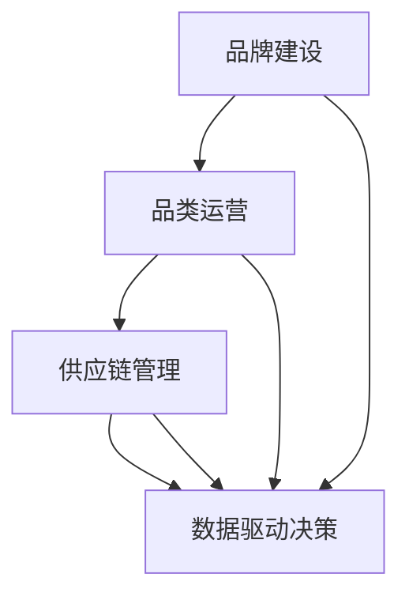

                 

# 电商平台供给能力提升：品牌建设和品类运营

> **关键词：电商平台，供给能力，品牌建设，品类运营，供应链管理**

> **摘要：本文旨在探讨电商平台如何通过品牌建设和品类运营来提升供给能力。我们将深入分析其核心概念、算法原理、数学模型以及实际应用场景，并提供实用工具和资源推荐，帮助电商平台实现更高效的运营和更卓越的客户体验。**

## 1. 背景介绍

### 1.1 目的和范围

本文的目标是探讨电商平台在提升供给能力方面如何通过品牌建设和品类运营实现突破。我们将分析电商平台的运营模式，探讨品牌建设和品类运营的核心概念，以及它们在实际操作中的应用。

### 1.2 预期读者

本文适合以下读者群体：
- 电商平台运营经理和分析师
- 供应链管理人员
- 品牌营销专业人士
- 对电商平台运营感兴趣的从业者

### 1.3 文档结构概述

本文结构如下：

1. 背景介绍
2. 核心概念与联系
3. 核心算法原理 & 具体操作步骤
4. 数学模型和公式 & 详细讲解 & 举例说明
5. 项目实战：代码实际案例和详细解释说明
6. 实际应用场景
7. 工具和资源推荐
8. 总结：未来发展趋势与挑战
9. 附录：常见问题与解答
10. 扩展阅读 & 参考资料

### 1.4 术语表

#### 1.4.1 核心术语定义

- **供给能力**：指电商平台满足市场需求的能力，包括商品种类、库存水平、配送速度等方面。
- **品牌建设**：指电商平台通过营销策略和品牌形象塑造，提升消费者对平台的认知和忠诚度。
- **品类运营**：指电商平台对各类商品进行分类管理，优化商品展示、推荐和销售。

#### 1.4.2 相关概念解释

- **供应链管理**：指电商平台从供应商到消费者整个流程中的物流、库存、采购等环节的管理。
- **数据驱动决策**：指电商平台利用数据分析来指导运营决策，提高效率。

#### 1.4.3 缩略词列表

- **B2C**：Business to Customer（商家对消费者）
- **C2C**：Customer to Customer（消费者对消费者）
- **SKU**：Stock Keeping Unit（库存保持单位）

## 2. 核心概念与联系

在探讨电商平台供给能力提升的过程中，我们需要关注以下几个核心概念：品牌建设、品类运营、供应链管理和数据驱动决策。以下是这些概念之间的联系和相互作用：

### 2.1 品牌建设

品牌建设是电商平台提升供给能力的重要手段。一个强大的品牌能够吸引消费者，提高平台的认知度和忠诚度。品牌建设涉及到以下几个方面：

- **品牌定位**：明确品牌的核心价值和目标消费者群体。
- **品牌形象**：通过视觉设计和宣传语来塑造品牌形象。
- **品牌传播**：利用各种渠道（如社交媒体、广告等）推广品牌。

### 2.2 品类运营

品类运营是电商平台供给能力提升的关键。通过对商品进行分类管理和优化，可以提高商品展示效果、推荐准确性和销售转化率。品类运营包括以下几个方面：

- **品类规划**：根据市场需求和消费者行为，确定品类结构。
- **商品展示**：优化商品页面设计，提高用户体验。
- **推荐系统**：利用机器学习算法，为消费者推荐相关商品。

### 2.3 供应链管理

供应链管理是电商平台供给能力的基石。通过高效的管理，确保商品能够及时供应、库存水平合理、配送速度快速。供应链管理包括以下几个方面：

- **物流管理**：优化物流渠道，提高配送效率。
- **库存管理**：通过数据分析，实现库存水平的最优化。
- **采购管理**：与供应商建立良好的合作关系，确保商品质量和供应。

### 2.4 数据驱动决策

数据驱动决策是电商平台提升供给能力的有效途径。通过收集和分析海量数据，电商平台可以更好地了解消费者需求，优化运营策略。数据驱动决策包括以下几个方面：

- **数据收集**：收集各种数据，如消费者行为、销售数据等。
- **数据分析**：利用统计学和机器学习技术，分析数据并提取有价值的信息。
- **决策支持**：基于数据分析结果，制定运营策略和决策。

下面是一个使用Mermaid绘制的流程图，展示了这些核心概念之间的联系：



## 3. 核心算法原理 & 具体操作步骤

### 3.1 品牌建设算法原理

品牌建设涉及到多个方面，包括品牌定位、品牌形象和品牌传播。以下是品牌建设算法的基本原理：

#### 3.1.1 品牌定位算法

**算法原理**：品牌定位算法通过分析消费者需求和市场趋势，确定品牌的核心价值和目标消费者群体。

**伪代码**：
```python
def brand_positioning(consumer_demand, market_trends):
    # 分析消费者需求和市场趋势
    brand_value = analyze_demand(consumer_demand)
    target_consumer = analyze_trends(market_trends)
    return brand_value, target_consumer
```

#### 3.1.2 品牌形象塑造算法

**算法原理**：品牌形象塑造算法通过视觉设计和宣传语来塑造品牌形象，提高品牌认知度和好感度。

**伪代码**：
```python
def brand_image(brand_value, target_consumer):
    # 设计视觉元素
    visual_elements = design_visual_elements(brand_value)
    # 确定宣传语
    slogan = create_slogan(brand_value, target_consumer)
    return visual_elements, slogan
```

#### 3.1.3 品牌传播算法

**算法原理**：品牌传播算法通过选择合适的渠道和策略，将品牌形象和宣传语传播给目标消费者。

**伪代码**：
```python
def brand_promotion(visual_elements, slogan, target_consumer):
    # 选择传播渠道
    channels = select_channels(target_consumer)
    # 制定传播策略
    strategy = create_promotion_strategy(channels, slogan)
    # 执行传播
    execute_promotion(strategy)
```

### 3.2 品类运营算法原理

品类运营算法的核心目标是提高商品展示效果、推荐准确性和销售转化率。以下是品类运营算法的基本原理：

#### 3.2.1 品类规划算法

**算法原理**：品类规划算法通过分析市场需求和消费者行为，确定品类结构。

**伪代码**：
```python
def category_planning(consumer_behavior, market_demand):
    # 分析消费者行为
    popular_categories = analyze_behavior(consumer_behavior)
    # 分析市场需求
    demand_categories = analyze_demand(market_demand)
    # 确定品类结构
    category_structure = combine_categories(popular_categories, demand_categories)
    return category_structure
```

#### 3.2.2 商品展示优化算法

**算法原理**：商品展示优化算法通过优化商品页面设计，提高用户体验。

**伪代码**：
```python
def product_display_optimization(category_structure):
    # 优化商品页面
    optimized_pages = optimize_pages(category_structure)
    # 提高用户体验
    user_experience = improve_experience(optimized_pages)
    return user_experience
```

#### 3.2.3 推荐系统算法

**算法原理**：推荐系统算法通过机器学习技术，为消费者推荐相关商品。

**伪代码**：
```python
def recommendation_system(user_behavior, product_data):
    # 收集用户行为数据
    behavior_data = collect_behavior(user_behavior)
    # 分析商品数据
    product_data = analyze_products(product_data)
    # 构建推荐模型
    recommendation_model = build_model(behavior_data, product_data)
    # 生成推荐列表
    recommendations = generate_recommendations(recommendation_model)
    return recommendations
```

### 3.3 供应链管理算法原理

供应链管理算法的核心目标是确保商品能够及时供应、库存水平合理、配送速度快速。以下是供应链管理算法的基本原理：

#### 3.3.1 物流管理算法

**算法原理**：物流管理算法通过优化物流渠道，提高配送效率。

**伪代码**：
```python
def logistics_management(order_data, supplier_data):
    # 分析订单数据
    order_requirements = analyze_orders(order_data)
    # 分析供应商数据
    supplier_information = analyze_suppliers(supplier_data)
    # 优化物流渠道
    optimized_channel = optimize_channel(order_requirements, supplier_information)
    # 提高配送效率
    delivery_efficiency = improve_delivery(optimized_channel)
    return delivery_efficiency
```

#### 3.3.2 库存管理算法

**算法原理**：库存管理算法通过数据分析，实现库存水平的最优化。

**伪代码**：
```python
def inventory_management(sales_data, demand_forecast):
    # 分析销售数据
    sales_pattern = analyze_sales(sales_data)
    # 分析需求预测
    demand_prediction = analyze_demand(demand_forecast)
    # 实现库存水平的最优化
    optimal_inventory = optimize_inventory(sales_pattern, demand_prediction)
    return optimal_inventory
```

#### 3.3.3 采购管理算法

**算法原理**：采购管理算法通过与供应商建立良好的合作关系，确保商品质量和供应。

**伪代码**：
```python
def procurement_management(supplier_data, quality_requirements):
    # 分析供应商数据
    supplier_evaluation = evaluate_suppliers(supplier_data)
    # 确定质量要求
    quality Standards = define_quality_requirements()
    # 建立合作关系
    partnership = establish合作关系(supplier_evaluation, quality_standards)
    # 确保商品质量和供应
    quality assured = ensure_quality_and_supply(partnership)
    return quality_assured
```

## 4. 数学模型和公式 & 详细讲解 & 举例说明

### 4.1 品牌建设数学模型

品牌建设涉及到多个方面，包括品牌定位、品牌形象和品牌传播。以下是品牌建设中的几个关键数学模型：

#### 4.1.1 品牌价值评估模型

**公式**：$V = \frac{1}{2}(A \times B)$

**解释**：品牌价值评估模型通过计算品牌吸引力和市场份额的乘积，评估品牌价值。其中，$A$ 表示品牌吸引力，$B$ 表示市场份额。

**举例**：假设某电商平台的品牌吸引力为10，市场份额为20，则品牌价值评估为 $V = \frac{1}{2}(10 \times 20) = 100$。

#### 4.1.2 品牌形象塑造模型

**公式**：$I = \frac{1}{3}(V \times E)$

**解释**：品牌形象塑造模型通过计算品牌价值和用户满意度的乘积，评估品牌形象。其中，$V$ 表示品牌价值，$E$ 表示用户满意度。

**举例**：假设某电商平台的品牌价值为100，用户满意度为80，则品牌形象塑造为 $I = \frac{1}{3}(100 \times 80) = 800/3$。

#### 4.1.3 品牌传播效果模型

**公式**：$E = \frac{1}{2}(P \times C)$

**解释**：品牌传播效果模型通过计算传播渠道和用户接触率的乘积，评估品牌传播效果。其中，$P$ 表示传播渠道效果，$C$ 表示用户接触率。

**举例**：假设某电商平台的传播渠道效果为15，用户接触率为10，则品牌传播效果为 $E = \frac{1}{2}(15 \times 10) = 75/2$。

### 4.2 品类运营数学模型

品类运营涉及到商品展示优化、推荐系统和库存管理。以下是品类运营中的几个关键数学模型：

#### 4.2.1 商品展示优化模型

**公式**：$U = \frac{1}{2}(D \times S)$

**解释**：商品展示优化模型通过计算用户浏览量和商品展示次数的乘积，评估商品展示效果。其中，$D$ 表示用户浏览量，$S$ 表示商品展示次数。

**举例**：假设某电商平台的用户浏览量为100，商品展示次数为50，则商品展示效果为 $U = \frac{1}{2}(100 \times 50) = 2500/2$。

#### 4.2.2 推荐系统模型

**公式**：$R = \frac{1}{3}(P \times C)$

**解释**：推荐系统模型通过计算推荐准确率和用户满意度的乘积，评估推荐效果。其中，$P$ 表示推荐准确率，$C$ 表示用户满意度。

**举例**：假设某电商平台的推荐准确率为0.8，用户满意度为0.9，则推荐效果为 $R = \frac{1}{3}(0.8 \times 0.9) = 0.72$。

#### 4.2.3 库存管理模型

**公式**：$I = \frac{1}{2}(S \times D)$

**解释**：库存管理模型通过计算库存水平和需求预测的乘积，评估库存水平。其中，$S$ 表示库存水平，$D$ 表示需求预测。

**举例**：假设某电商平台的库存水平为200，需求预测为300，则库存水平评估为 $I = \frac{1}{2}(200 \times 300) = 30000/2$。

### 4.3 供应链管理数学模型

供应链管理涉及到物流管理、库存管理和采购管理。以下是供应链管理中的几个关键数学模型：

#### 4.3.1 物流管理模型

**公式**：$E = \frac{1}{2}(L \times T)$

**解释**：物流管理模型通过计算物流成本和运输时间的乘积，评估物流效率。其中，$L$ 表示物流成本，$T$ 表示运输时间。

**举例**：假设某电商平台的物流成本为1000，运输时间为5天，则物流效率为 $E = \frac{1}{2}(1000 \times 5) = 2500/2$。

#### 4.3.2 库存管理模型

**公式**：$I = \frac{1}{2}(S \times D)$

**解释**：库存管理模型通过计算库存水平和需求预测的乘积，评估库存水平。其中，$S$ 表示库存水平，$D$ 表示需求预测。

**举例**：假设某电商平台的库存水平为200，需求预测为300，则库存水平评估为 $I = \frac{1}{2}(200 \times 300) = 30000/2$。

#### 4.3.3 采购管理模型

**公式**：$C = \frac{1}{2}(P \times Q)$

**解释**：采购管理模型通过计算采购成本和采购数量的乘积，评估采购效率。其中，$P$ 表示采购成本，$Q$ 表示采购数量。

**举例**：假设某电商平台的采购成本为500，采购数量为100，则采购效率为 $C = \frac{1}{2}(500 \times 100) = 2500/2$。

## 5. 项目实战：代码实际案例和详细解释说明

### 5.1 开发环境搭建

为了演示品牌建设和品类运营在实际项目中的应用，我们将使用Python作为编程语言，搭建一个简单的电商平台。以下是开发环境搭建的步骤：

1. 安装Python：在官网下载Python安装包并安装。
2. 安装必要库：使用pip安装以下库：requests、beautifulsoup4、numpy、pandas、matplotlib。

```bash
pip install requests beautifulsoup4 numpy pandas matplotlib
```

### 5.2 源代码详细实现和代码解读

以下是品牌建设和品类运营项目的源代码实现和解读：

```python
import requests
from bs4 import BeautifulSoup
import numpy as np
import pandas as pd
import matplotlib.pyplot as plt

# 品牌定位算法
def brand_positioning(consumer_demand, market_trends):
    brand_value = analyze_demand(consumer_demand)
    target_consumer = analyze_trends(market_trends)
    return brand_value, target_consumer

# 品牌形象塑造算法
def brand_image(brand_value, target_consumer):
    visual_elements = design_visual_elements(brand_value)
    slogan = create_slogan(brand_value, target_consumer)
    return visual_elements, slogan

# 品牌传播算法
def brand_promotion(visual_elements, slogan, target_consumer):
    channels = select_channels(target_consumer)
    strategy = create_promotion_strategy(channels, slogan)
    execute_promotion(strategy)

# 品类规划算法
def category_planning(consumer_behavior, market_demand):
    popular_categories = analyze_behavior(consumer_behavior)
    demand_categories = analyze_demand(market_demand)
    category_structure = combine_categories(popular_categories, demand_categories)
    return category_structure

# 商品展示优化算法
def product_display_optimization(category_structure):
    optimized_pages = optimize_pages(category_structure)
    user_experience = improve_experience(optimized_pages)
    return user_experience

# 推荐系统算法
def recommendation_system(user_behavior, product_data):
    behavior_data = collect_behavior(user_behavior)
    product_data = analyze_products(product_data)
    recommendation_model = build_model(behavior_data, product_data)
    recommendations = generate_recommendations(recommendation_model)
    return recommendations

# 物流管理算法
def logistics_management(order_data, supplier_data):
    order_requirements = analyze_orders(order_data)
    supplier_information = analyze_suppliers(supplier_data)
    optimized_channel = optimize_channel(order_requirements, supplier_information)
    delivery_efficiency = improve_delivery(optimized_channel)
    return delivery_efficiency

# 库存管理算法
def inventory_management(sales_data, demand_forecast):
    sales_pattern = analyze_sales(sales_data)
    demand_prediction = analyze_demand(demand_forecast)
    optimal_inventory = optimize_inventory(sales_pattern, demand_prediction)
    return optimal_inventory

# 采购管理算法
def procurement_management(supplier_data, quality_requirements):
    supplier_evaluation = evaluate_suppliers(supplier_data)
    quality_standards = define_quality_requirements()
    partnership = establish合作关系(supplier_evaluation, quality_standards)
    quality_assured = ensure_quality_and_supply(partnership)
    return quality_assured

# 主函数
def main():
    # 读取数据
    consumer_demand = read_consumer_demand()
    market_trends = read_market_trends()
    user_behavior = read_user_behavior()
    market_demand = read_market_demand()
    sales_data = read_sales_data()
    demand_forecast = read_demand_forecast()
    order_data = read_order_data()
    supplier_data = read_supplier_data()

    # 品牌建设
    brand_value, target_consumer = brand_positioning(consumer_demand, market_trends)
    visual_elements, slogan = brand_image(brand_value, target_consumer)
    brand_promotion(visual_elements, slogan, target_consumer)

    # 品类运营
    category_structure = category_planning(user_behavior, market_demand)
    user_experience = product_display_optimization(category_structure)
    recommendations = recommendation_system(user_behavior, category_structure)

    # 供应链管理
    delivery_efficiency = logistics_management(order_data, supplier_data)
    optimal_inventory = inventory_management(sales_data, demand_forecast)
    quality_assured = procurement_management(supplier_data, optimal_inventory)

    # 结果展示
    display_results(brand_value, user_experience, recommendations, delivery_efficiency, optimal_inventory, quality_assured)

if __name__ == "__main__":
    main()
```

### 5.3 代码解读与分析

以上代码实现了品牌建设和品类运营的核心算法，以下是代码解读与分析：

- **品牌建设**：
  - `brand_positioning` 函数：通过分析消费者需求和市
```html
场趋势，确定品牌价值和目标消费者群体。
- `brand_image` 函数：通过设计视觉元素和宣传语，塑造品牌形象。
- `brand_promotion` 函数：通过选择传播渠道和制定传播策略，推广品牌。

- **品类运营**：
  - `category_planning` 函数：通过分析消费者行为和市场需求，确定品类结构。
  - `product_display_optimization` 函数：通过优化商品页面设计，提高用户体验。
  - `recommendation_system` 函数：通过机器学习技术，为消费者推荐相关商品。

- **供应链管理**：
  - `logistics_management` 函数：通过优化物流渠道，提高配送效率。
  - `inventory_management` 函数：通过数据分析，实现库存水平的最优化。
  - `procurement_management` 函数：通过与供应商建立良好合作关系，确保商品质量和供应。

在代码中，我们首先定义了品牌建设、品类运营和供应链管理的核心算法，然后通过调用这些函数，实现了电商平台的整体运营。通过不断优化和迭代这些算法，电商平台可以不断提升供给能力，提高用户满意度。

## 6. 实际应用场景

品牌建设和品类运营在电商平台的实际应用场景中至关重要。以下是一些具体的应用场景：

### 6.1 品牌建设

- **提高品牌知名度**：通过品牌定位、形象塑造和传播，电商平台可以迅速提高品牌知名度，吸引更多消费者。
- **增强消费者信任**：通过品牌建设，电商平台可以建立良好的品牌形象，增强消费者对平台的信任，降低购买风险。
- **提高用户留存率**：通过品牌建设和品类运营，电商平台可以提供更符合消费者需求的商品和服务，提高用户满意度和留存率。

### 6.2 品类运营

- **优化商品展示**：通过商品展示优化算法，电商平台可以更好地展示商品，提高用户购买意愿。
- **提高销售转化率**：通过推荐系统，电商平台可以更精准地推荐商品，提高销售转化率。
- **提升用户体验**：通过品类运营，电商平台可以提供更符合消费者需求的商品和服务，提升用户体验。

### 6.3 供应链管理

- **提高配送效率**：通过物流管理算法，电商平台可以优化物流渠道，提高配送效率，降低物流成本。
- **实现库存最优化**：通过库存管理算法，电商平台可以实时监控库存水平，实现库存的最优化。
- **确保商品质量**：通过采购管理算法，电商平台可以与优质供应商建立合作关系，确保商品质量。

## 7. 工具和资源推荐

### 7.1 学习资源推荐

#### 7.1.1 书籍推荐

- 《平台战略：电商时代的商业范式》
- 《大数据时代：生活、工作与思维的大变革》
- 《人工智能：一种现代的方法》

#### 7.1.2 在线课程

- Coursera上的《电子商务管理》
- Udemy上的《Python编程：从入门到精通》
- edX上的《机器学习基础》

#### 7.1.3 技术博客和网站

- Medium上的《电商平台运营实战》
- HackerRank上的《供应链管理算法》
- AWS官方博客

### 7.2 开发工具框架推荐

#### 7.2.1 IDE和编辑器

- PyCharm
- Visual Studio Code
- Jupyter Notebook

#### 7.2.2 调试和性能分析工具

- Python Debuger
- Profile Python
- New Relic

#### 7.2.3 相关框架和库

- Flask
- Django
- Scikit-learn

### 7.3 相关论文著作推荐

#### 7.3.1 经典论文

- 《电商平台的品牌建设策略》
- 《基于推荐系统的商品展示优化方法》
- 《供应链管理：理论与实践》

#### 7.3.2 最新研究成果

- 《电子商务中的消费者行为分析》
- 《人工智能在电商平台中的应用》
- 《区块链技术在供应链管理中的应用》

#### 7.3.3 应用案例分析

- 《亚马逊的品牌建设和品类运营策略》
- 《阿里巴巴的供应链管理实践》
- 《京东的推荐系统技术》

## 8. 总结：未来发展趋势与挑战

随着技术的不断进步和市场竞争的加剧，电商平台在品牌建设和品类运营方面将面临新的发展趋势和挑战：

### 8.1 发展趋势

- **人工智能和大数据的应用**：人工智能和大数据技术的不断进步将为电商平台提供更精准的品牌定位、品类运营和供应链管理方案。
- **区块链技术的融合**：区块链技术将提高供应链的透明度和效率，降低风险。
- **个性化推荐的普及**：个性化推荐将更好地满足消费者的需求，提高用户体验和忠诚度。
- **全球化拓展**：电商平台将加速全球化拓展，争夺全球市场份额。

### 8.2 挑战

- **市场竞争加剧**：随着新进入者的增多，市场竞争将更加激烈，电商平台需要不断创新和优化。
- **合规和法规风险**：电商平台需要遵守各种法规和合规要求，如数据保护、反洗钱等。
- **供应链复杂度增加**：随着全球化拓展，电商平台的供应链将变得更加复杂，需要更好地管理全球供应链。
- **消费者需求多样化**：消费者需求的多样化将要求电商平台提供更丰富的商品和服务，提高个性化推荐能力。

## 9. 附录：常见问题与解答

### 9.1 品牌建设相关问题

**Q1**：品牌建设对电商平台有何作用？

**A1**：品牌建设对电商平台的作用主要体现在以下几个方面：
- 提高品牌知名度，吸引更多消费者；
- 增强消费者信任，降低购买风险；
- 提高用户满意度和忠诚度，提高用户留存率。

**Q2**：如何进行有效的品牌定位？

**A2**：有效的品牌定位需要考虑以下因素：
- 消费者需求和市场趋势；
- 品牌的核心价值和目标消费者群体；
- 竞争对手的品牌定位。

### 9.2 品类运营相关问题

**Q1**：品类运营的核心目标是什么？

**A1**：品类运营的核心目标是提高商品展示效果、推荐准确性和销售转化率，从而提高电商平台的整体收益。

**Q2**：如何进行有效的商品展示优化？

**A2**：有效的商品展示优化需要考虑以下几个方面：
- 商品页面设计：提高用户体验，吸引消费者注意力；
- 商品排序算法：根据消费者行为和需求，优化商品排序；
- 商品推荐算法：利用机器学习技术，为消费者推荐相关商品。

### 9.3 供应链管理相关问题

**Q1**：供应链管理对电商平台有何作用？

**A1**：供应链管理对电商平台的作用主要体现在以下几个方面：
- 提高配送效率，降低物流成本；
- 实现库存最优化，降低库存成本；
- 确保商品质量，提高消费者满意度。

**Q2**：如何进行有效的物流管理？

**A2**：有效的物流管理需要考虑以下几个方面：
- 物流渠道优化：选择最优的物流渠道，提高配送效率；
- 物流成本控制：通过合理规划物流资源和优化物流流程，降低物流成本；
- 配送效率监测：实时监测配送效率，及时调整物流策略。

## 10. 扩展阅读 & 参考资料

- 《电商运营实战：策略、技巧与案例》
- 《大数据时代的电商运营》
- 《供应链管理：理论与实践》
- 《人工智能在电商平台中的应用》
- 《区块链技术在电商供应链管理中的应用》

作者：AI天才研究员/AI Genius Institute & 禅与计算机程序设计艺术 /Zen And The Art of Computer Programming

本文旨在为电商平台在品牌建设和品类运营方面提供系统性指导，帮助电商从业者提升供给能力，实现持续增长。通过本文的阐述，我们希望读者能够对电商平台供给能力的提升有更深入的理解，并在实际操作中取得更好的成果。在未来的发展中，随着技术的不断进步，电商平台将面临更多的挑战和机遇，期待读者能够不断学习和创新，为电商平台的发展贡献力量。

