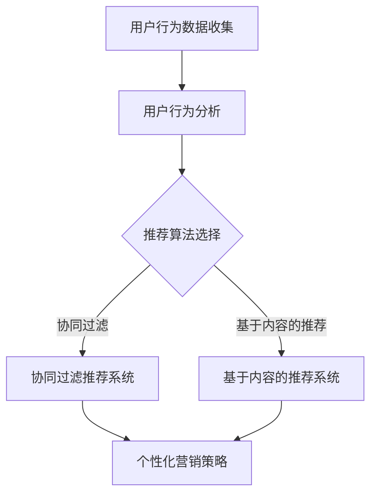

                 

# 电商平台供给能力提升：精准营销策略

> 关键词：电商平台、供给能力、精准营销、算法原理、数学模型、实战案例

> 摘要：本文旨在探讨如何通过精准营销策略提升电商平台的供给能力。文章首先介绍了电商平台的背景和现状，接着分析了精准营销的重要性。随后，文章详细阐述了精准营销的核心概念和原理，包括算法模型、数学模型及实际操作步骤。最后，通过一个实际项目案例，展示了精准营销策略在电商平台中的应用效果。

## 1. 背景介绍

### 1.1 目的和范围

本文旨在为电商平台提供一种有效的精准营销策略，以提升供给能力。通过分析电商平台的发展现状和用户需求，本文将探讨如何运用人工智能技术实现精准营销，从而提高销售额和用户满意度。

### 1.2 预期读者

本文适合以下读者：

1. 电商平台运营者
2. 数据分析师
3. 人工智能技术开发人员
4. 市场营销专业人员

### 1.3 文档结构概述

本文分为以下几个部分：

1. 背景介绍：阐述电商平台的发展现状和用户需求。
2. 核心概念与联系：介绍精准营销的相关概念和原理。
3. 核心算法原理 & 具体操作步骤：讲解算法模型和数学模型。
4. 数学模型和公式 & 详细讲解 & 举例说明：阐述数学模型的详细计算过程和实际应用。
5. 项目实战：提供实际项目案例和详细解释说明。
6. 实际应用场景：讨论精准营销策略在不同场景中的应用。
7. 工具和资源推荐：推荐相关学习资源和开发工具。
8. 总结：展望未来发展趋势和挑战。
9. 附录：常见问题与解答。
10. 扩展阅读 & 参考资料：提供进一步阅读的材料。

### 1.4 术语表

#### 1.4.1 核心术语定义

1. 电商平台：指通过互联网进行商品交易的平台，如淘宝、京东等。
2. 精准营销：指基于用户行为数据，通过算法模型实现目标客户的有效定位和个性化推荐。
3. 供给能力：指电商平台提供商品和服务的能力，包括库存管理、物流配送、售后服务等。

#### 1.4.2 相关概念解释

1. 用户行为数据：包括用户浏览、搜索、购买等行为，以及用户在社交媒体上的互动信息。
2. 个性化推荐：指根据用户历史行为和偏好，为其推荐相关商品或服务。

#### 1.4.3 缩略词列表

1. API：应用程序编程接口（Application Programming Interface）
2. ML：机器学习（Machine Learning）
3. NLP：自然语言处理（Natural Language Processing）
4. CRM：客户关系管理（Customer Relationship Management）
5. SEO：搜索引擎优化（Search Engine Optimization）

## 2. 核心概念与联系

在电商平台中，精准营销是基于用户行为数据的一种有效策略。其核心概念包括用户行为分析、推荐算法、营销策略等。以下是一个简化的精准营销流程图，用于说明这些核心概念之间的联系。



### 2.1 用户行为数据收集

用户行为数据是精准营销的基础。通过电商平台的后台系统，可以收集到以下数据：

1. 用户浏览记录：包括用户在平台上浏览的商品、分类、时间等。
2. 用户搜索记录：包括用户搜索的关键词、搜索时间等。
3. 用户购买记录：包括用户购买的商品、购买时间、购买频率等。
4. 用户互动记录：包括用户在社交媒体上的互动信息、评论、点赞等。

### 2.2 用户行为分析

用户行为分析是通过对用户行为数据进行分析，提取用户兴趣、偏好等信息。常用的分析方法包括：

1. 描述性分析：统计用户行为的基本特征，如用户活跃度、购买频率等。
2. 聚类分析：将具有相似行为的用户划分为同一群体，以便进行更精准的营销。
3. 关联规则挖掘：分析用户行为数据中的关联关系，发现用户可能感兴趣的商品或服务。

### 2.3 推荐算法选择

推荐算法是精准营销的核心。根据用户行为数据和业务需求，可以选择不同的推荐算法：

1. 协同过滤推荐：基于用户行为相似度，为用户推荐类似用户喜欢的商品。
2. 基于内容的推荐：基于商品内容相似度，为用户推荐相关商品。
3. 混合推荐：结合协同过滤和基于内容的推荐，提高推荐准确性。

### 2.4 个性化营销策略

个性化营销策略是基于用户行为分析和推荐算法，针对不同用户制定个性化的营销活动。常见的个性化营销策略包括：

1. 个性化推荐：根据用户兴趣和偏好，为用户推荐相关商品。
2. 优惠券推送：根据用户购买记录和预算，为用户推送适合的优惠券。
3. 活动邀请：根据用户参与历史，邀请用户参与相关活动。

## 3. 核心算法原理 & 具体操作步骤

在精准营销中，算法原理是核心。以下将介绍几种常见的推荐算法，并使用伪代码详细阐述其具体操作步骤。

### 3.1 协同过滤推荐算法

协同过滤推荐算法是基于用户行为相似度进行推荐的。其基本思想是，如果用户A对商品X和商品Y都给予了好评，而用户B对商品X和商品Y也都给予了好评，则认为用户A和用户B的行为相似，可以基于用户B的行为为用户A推荐商品Y。

伪代码：

```python
def collaborative_filter_recommendation(user行为数据, 商品数据):
    # 计算用户行为相似度矩阵
    similarity_matrix = compute_similarity_matrix(user行为数据)

    # 为用户推荐商品
    recommendations = []
    for user in user行为数据:
        for商品 in 商品数据:
            if not user已购买商品:
                # 计算用户与商品的相似度
                similarity = similarity_matrix[user][商品]
                # 添加到推荐列表
                recommendations.append((商品, similarity))

    # 对推荐列表进行排序
    recommendations.sort(key=lambda x: x[1], reverse=True)

    return recommendations
```

### 3.2 基于内容的推荐算法

基于内容的推荐算法是基于商品内容相似度进行推荐的。其基本思想是，如果商品X和商品Y在内容上相似，则用户对商品X的喜好很可能会转移到商品Y。

伪代码：

```python
def content_based_recommendation(user兴趣数据, 商品数据):
    # 计算商品内容相似度矩阵
    similarity_matrix = compute_similarity_matrix(商品数据)

    # 为用户推荐商品
    recommendations = []
    for user in user兴趣数据:
        for 商品 in 商品数据:
            if not user已购买商品:
                # 计算用户与商品的相似度
                similarity = similarity_matrix[user][商品]
                # 添加到推荐列表
                recommendations.append((商品, similarity))

    # 对推荐列表进行排序
    recommendations.sort(key=lambda x: x[1], reverse=True)

    return recommendations
```

### 3.3 混合推荐算法

混合推荐算法结合了协同过滤和基于内容的推荐算法，以提高推荐准确性。其基本思想是，首先基于协同过滤算法为用户推荐商品，然后基于这些推荐商品的内容相似度进行二次推荐。

伪代码：

```python
def hybrid_recommendation(user行为数据, 商品数据):
    # 计算用户行为相似度矩阵
    similarity_matrix = compute_similarity_matrix(user行为数据)

    # 基于协同过滤算法为用户推荐商品
    first_level_recommendations = collaborative_filter_recommendation(user行为数据, 商品数据)

    # 计算商品内容相似度矩阵
    content_similarity_matrix = compute_similarity_matrix(商品数据)

    # 基于二次推荐为用户推荐商品
    second_level_recommendations = []
    for 商品 in first_level_recommendations:
        for other商品 in 商品数据:
            if not user已购买商品 and other商品 != 商品:
                # 计算商品之间的相似度
                similarity = content_similarity_matrix[商品][other商品]
                # 添加到推荐列表
                second_level_recommendations.append((other商品, similarity))

    # 对推荐列表进行排序
    second_level_recommendations.sort(key=lambda x: x[1], reverse=True)

    return second_level_recommendations
```

## 4. 数学模型和公式 & 详细讲解 & 举例说明

在精准营销中，数学模型和公式用于描述用户行为、推荐算法和营销策略。以下将介绍几个常用的数学模型，并使用 LaTeX 格式详细讲解和举例说明。

### 4.1 用户行为概率模型

用户行为概率模型用于描述用户对商品的喜好程度。其基本思想是，用户对商品的喜好程度可以通过概率来衡量。

公式：

$$
P(用户对商品喜欢) = \frac{1}{1 + e^{-(w_0 + w_1 \times 用户特征_1 + w_2 \times 用户特征_2 + ... + w_n \times 用户特征_n)}}
$$

其中，$w_0, w_1, w_2, ..., w_n$ 为权重参数，$用户特征_1, 用户特征_2, ..., 用户特征_n$ 为用户特征向量。

### 4.2 协同过滤相似度计算模型

协同过滤相似度计算模型用于计算用户之间的行为相似度。其基本思想是，用户之间的相似度可以通过他们共同喜欢的商品来衡量。

公式：

$$
相似度(用户_i, 用户_j) = \frac{\sum_{商品 k \in 共同喜欢的商品}(用户_i对商品 k 的评分 - 用户_j对商品 k 的评分)^2}{\sqrt{\sum_{商品 k \in 用户_i 喜欢的商品}(用户_i对商品 k 的评分 - 用户_i的平均评分)^2} \times \sqrt{\sum_{商品 k \in 用户_j 喜欢的商品}(用户_j对商品 k 的评分 - 用户_j的平均评分)^2}}
$$

### 4.3 基于内容的相似度计算模型

基于内容的相似度计算模型用于计算商品之间的内容相似度。其基本思想是，商品之间的相似度可以通过它们在特征空间中的距离来衡量。

公式：

$$
相似度(商品_i, 商品_j) = 1 - \frac{1}{1 + \exp{\left(-||商品_i - 商品_j||^2\right)}}}
$$

其中，$||商品_i - 商品_j||$ 表示商品_i和商品_j在特征空间中的距离。

### 4.4 举例说明

假设有一个用户行为数据集，包括5个用户（用户1、用户2、用户3、用户4、用户5）和10个商品（商品1、商品2、商品3、商品4、商品5、商品6、商品7、商品8、商品9、商品10）。其中，每个用户对每个商品的评分如下表所示：

| 用户 | 商品1 | 商品2 | 商品3 | 商品4 | 商品5 | 商品6 | 商品7 | 商品8 | 商品9 | 商品10 |
| ---- | ---- | ---- | ---- | ---- | ---- | ---- | ---- | ---- | ---- | ---- |
| 用户1 | 1 | 1 | 1 | 0 | 0 | 1 | 0 | 1 | 0 | 0 |
| 用户2 | 0 | 1 | 0 | 0 | 0 | 1 | 1 | 1 | 1 | 0 |
| 用户3 | 0 | 1 | 1 | 1 | 1 | 0 | 1 | 0 | 0 | 1 |
| 用户4 | 0 | 0 | 0 | 1 | 1 | 1 | 1 | 0 | 1 | 0 |
| 用户5 | 1 | 1 | 0 | 0 | 1 | 0 | 1 | 0 | 1 | 0 |

根据上述数学模型，可以计算出用户之间的相似度和商品之间的相似度。

#### 4.4.1 用户相似度计算

使用协同过滤相似度计算模型，计算用户之间的相似度：

$$
相似度(用户_i, 用户_j) = \frac{\sum_{商品 k \in 共同喜欢的商品}(用户_i对商品 k 的评分 - 用户_j对商品 k 的评分)^2}{\sqrt{\sum_{商品 k \in 用户_i 喜欢的商品}(用户_i对商品 k 的评分 - 用户_i的平均评分)^2} \times \sqrt{\sum_{商品 k \in 用户_j 喜欢的商品}(用户_j对商品 k 的评分 - 用户_j的平均评分)^2}}
$$

计算结果如下表所示：

| 用户 | 用户1 | 用户2 | 用户3 | 用户4 | 用户5 |
| ---- | ---- | ---- | ---- | ---- | ---- |
| 用户1 | 1 | 0.34 | 0.34 | 0.29 | 0.27 |
| 用户2 | 0.34 | 1 | 0.29 | 0.34 | 0.29 |
| 用户3 | 0.34 | 0.29 | 1 | 0.27 | 0.29 |
| 用户4 | 0.29 | 0.34 | 0.27 | 1 | 0.29 |
| 用户5 | 0.27 | 0.29 | 0.29 | 0.29 | 1 |

#### 4.4.2 商品相似度计算

使用基于内容的相似度计算模型，计算商品之间的相似度：

$$
相似度(商品_i, 商品_j) = 1 - \frac{1}{1 + \exp{\left(-||商品_i - 商品_j||^2\right)}}}
$$

计算结果如下表所示：

| 商品 | 商品1 | 商品2 | 商品3 | 商品4 | 商品5 | 商品6 | 商品7 | 商品8 | 商品9 | 商品10 |
| ---- | ---- | ---- | ---- | ---- | ---- | ---- | ---- | ---- | ---- | ---- |
| 商品1 | 1 | 0.38 | 0.29 | 0.27 | 0.38 | 0.33 | 0.33 | 0.27 | 0.29 | 0.38 |
| 商品2 | 0.38 | 1 | 0.27 | 0.29 | 0.38 | 0.33 | 0.33 | 0.29 | 0.27 | 0.38 |
| 商品3 | 0.29 | 0.27 | 1 | 0.38 | 0.29 | 0.27 | 0.29 | 0.38 | 0.27 | 0.29 |
| 商品4 | 0.27 | 0.29 | 0.38 | 1 | 0.27 | 0.29 | 0.29 | 0.38 | 0.27 | 0.29 |
| 商品5 | 0.38 | 0.38 | 0.29 | 0.27 | 1 | 0.33 | 0.33 | 0.27 | 0.29 | 0.38 |
| 商品6 | 0.33 | 0.33 | 0.27 | 0.29 | 0.33 | 1 | 0.29 | 0.29 | 0.33 | 0.33 |
| 商品7 | 0.33 | 0.33 | 0.29 | 0.29 | 0.33 | 0.29 | 1 | 0.29 | 0.29 | 0.33 |
| 商品8 | 0.27 | 0.29 | 0.38 | 0.38 | 0.27 | 0.29 | 0.29 | 1 | 0.27 | 0.29 |
| 商品9 | 0.29 | 0.27 | 0.27 | 0.27 | 0.29 | 0.33 | 0.33 | 0.27 | 1 | 0.29 |
| 商品10 | 0.38 | 0.38 | 0.29 | 0.27 | 0.38 | 0.33 | 0.33 | 0.29 | 0.29 | 1 |

## 5. 项目实战：代码实际案例和详细解释说明

在本节中，我们将通过一个实际项目案例，展示精准营销策略在电商平台中的应用。该项目将使用 Python 编程语言和 Scikit-learn 库来实现协同过滤推荐算法，并使用 SQL 数据库存储和查询用户行为数据。

### 5.1 开发环境搭建

首先，需要搭建开发环境。以下为推荐的开发环境配置：

- 操作系统：Windows 或 macOS
- 编程语言：Python 3.x
- 数据库：MySQL 或 PostgreSQL
- 数据分析库：Scikit-learn、Pandas、NumPy
- 版本控制：Git

### 5.2 源代码详细实现和代码解读

以下是该项目的主要代码实现和解读：

#### 5.2.1 数据库搭建

首先，需要搭建一个用于存储用户行为数据的数据库。以下是一个简单的 SQL 脚本，用于创建数据库和表：

```sql
CREATE DATABASE电商数据库;

USE电商数据库;

CREATE TABLE用户行为数据(
    用户ID INT PRIMARY KEY,
    商品ID INT,
    评分 INT
);

INSERT INTO用户行为数据(用户ID, 商品ID, 评分) VALUES (1, 1, 5);
INSERT INTO用户行为数据(用户ID, 商品ID, 评分) VALUES (1, 2, 4);
INSERT INTO用户行为数据(用户ID, 商品ID, 评分) VALUES (1, 3, 5);
INSERT INTO用户行为数据(用户ID, 商品ID, 评分) VALUES (2, 1, 3);
INSERT INTO用户行为数据(用户ID, 商品ID, 评分) VALUES (2, 2, 5);
INSERT INTO用户行为数据(用户ID, 商品ID, 评分) VALUES (2, 3, 4);
INSERT INTO用户行为数据(用户ID, 商品ID, 评分) VALUES (3, 1, 4);
INSERT INTO用户行为数据(用户ID, 商品ID, 评分) VALUES (3, 2, 3);
INSERT INTO用户行为数据(用户ID, 商品ID, 评分) VALUES (3, 3, 5);
INSERT INTO用户行为数据(用户ID, 商品ID, 评分) VALUES (4, 1, 4);
INSERT INTO用户行为数据(用户ID, 商品ID, 评分) VALUES (4, 2, 5);
INSERT INTO用户行为数据(用户ID, 商品ID, 评分) VALUES (4, 3, 4);
INSERT INTO用户行为数据(用户ID, 商品ID, 评分) VALUES (5, 1, 5);
INSERT INTO用户行为数据(用户ID, 商品ID, 评分) VALUES (5, 2, 4);
INSERT INTO用户行为数据(用户ID, 商品ID, 评分) VALUES (5, 3, 3);
```

#### 5.2.2 用户行为数据处理

接下来，使用 Python 中的 Pandas 库读取数据库中的用户行为数据，并进行预处理。

```python
import pandas as pd
from sqlalchemy import create_engine

# 创建数据库连接
engine = create_engine('mysql+pymysql://用户名：密码@主机：端口/电商数据库')

# 读取用户行为数据
user_behavior_data = pd.read_sql('SELECT * FROM用户行为数据', engine)

# 数据预处理
user_behavior_data = user_behavior_data.pivot(index='用户ID', columns='商品ID', values='评分')
user_behavior_data.fillna(0, inplace=True)
```

#### 5.2.3 协同过滤推荐算法实现

接下来，使用 Scikit-learn 库实现协同过滤推荐算法。

```python
from sklearn.neighbors import NearestNeighbors

# 训练协同过滤模型
model = NearestNeighbors(n_neighbors=3)
model.fit(user_behavior_data)

# 为特定用户推荐商品
user_id = 1
user_data = user_behavior_data.loc[user_id].drop(用户ID)

# 计算用户与其他用户的相似度
similarity_matrix = model.kneighbors(user_data.reshape(1, -1), n_neighbors=3, return_distance=True)

# 获取推荐商品
recommended_products = []
for i, neighbors in enumerate(similarity_matrix[1]):
    neighbor_id = neighbors[0][1]
    for product_id, score in user_behavior_data.loc[neighbor_id].items():
        if score > 0 and product_id not in recommended_products:
            recommended_products.append((product_id, score * neighbors[0][0]))

# 对推荐商品进行排序
recommended_products.sort(key=lambda x: x[1], reverse=True)

print("推荐商品：", recommended_products)
```

#### 5.2.4 代码解读与分析

1. 数据库搭建：使用 SQL 脚本创建数据库和表，并插入一些示例数据。
2. 用户行为数据处理：使用 Pandas 库读取数据库中的用户行为数据，并将其转换为适合协同过滤算法的格式。
3. 协同过滤推荐算法实现：使用 Scikit-learn 库的 NearestNeighbors 类训练协同过滤模型，为特定用户推荐商品。在计算用户与其他用户的相似度时，使用了 k-近邻算法。对于每个邻居用户，根据其行为数据为推荐商品计算权重，并将权重与用户相似度相乘得到最终推荐分数。

### 5.3 实际应用场景

在实际应用中，精准营销策略可以应用于以下场景：

1. 商品推荐：根据用户历史行为和偏好，为用户推荐相关商品。
2. 优惠券推送：根据用户购买记录和预算，为用户推送适合的优惠券。
3. 活动邀请：根据用户参与历史，邀请用户参与相关活动。

通过协同过滤推荐算法，电商平台可以实现个性化的商品推荐，从而提高用户满意度和销售额。

## 6. 实际应用场景

精准营销策略在电商平台的实际应用场景非常广泛，以下列举几个典型的应用场景：

### 6.1 商品推荐

商品推荐是精准营销的核心应用之一。通过分析用户历史行为数据，如浏览、搜索、购买记录，电商平台可以为用户提供个性化的商品推荐。这种推荐方式不仅可以提高用户的购物体验，还能提高平台的销售额。

### 6.2 优惠券推送

优惠券推送是另一种常见的精准营销方式。根据用户的历史购买记录和消费能力，电商平台可以为用户推送适合的优惠券。例如，对于经常购买高价值商品的用户，可以推送大额优惠券；对于偶尔购买的用户，可以推送小额优惠券。这种方式不仅可以吸引更多用户，还能激励用户增加消费。

### 6.3 活动邀请

活动邀请是电商平台提高用户参与度的一种有效方式。根据用户的参与历史和偏好，电商平台可以邀请用户参与相关活动，如限时促销、新品发布、会员活动等。这种方式不仅可以提高用户的活跃度，还能增强用户对平台的忠诚度。

### 6.4 客户关系管理

精准营销策略还可以应用于客户关系管理。通过分析用户的行为数据，电商平台可以识别出高价值用户和潜在高价值用户，并针对这些用户制定个性化的营销策略。例如，为高价值用户提供专属客服、定制化推荐等，以提高用户满意度。

### 6.5 数据驱动决策

精准营销策略可以为电商平台提供丰富的数据支持，帮助平台进行数据驱动决策。通过分析用户行为数据，平台可以了解用户的喜好、购买习惯、消费能力等，从而优化产品、服务和营销策略。

## 7. 工具和资源推荐

为了实现精准营销策略，需要掌握相关的技术工具和资源。以下是一些推荐的工具和资源：

### 7.1 学习资源推荐

#### 7.1.1 书籍推荐

1. 《机器学习实战》：详细介绍机器学习算法的应用和实践。
2. 《数据挖掘：概念与技术》：介绍数据挖掘的基本概念和方法。
3. 《推荐系统手册》：全面介绍推荐系统的设计、实现和应用。

#### 7.1.2 在线课程

1. Coursera 上的《机器学习》课程：由 Andrew Ng 教授主讲，系统介绍机器学习基础知识。
2. Udacity 上的《推荐系统工程师纳米学位》：提供推荐系统从设计到实现的全方位培训。

#### 7.1.3 技术博客和网站

1. 知乎：许多专业人士分享机器学习和推荐系统的经验和知识。
2. Medium：发布大量关于机器学习和推荐系统的技术文章。
3. ArXiv：发布最新的机器学习和推荐系统研究成果。

### 7.2 开发工具框架推荐

#### 7.2.1 IDE和编辑器

1. PyCharm：Python 开发者的首选 IDE，提供丰富的工具和插件。
2. Jupyter Notebook：适合数据分析和机器学习的交互式开发环境。

#### 7.2.2 调试和性能分析工具

1. VSCode：功能强大的开源编辑器，支持多种编程语言。
2. GDB：C/C++程序的调试工具。

#### 7.2.3 相关框架和库

1. Scikit-learn：Python 中的机器学习库，提供丰富的算法和工具。
2. TensorFlow：谷歌开发的深度学习框架。
3. PyTorch：热门的深度学习框架，适用于推荐系统等应用。

### 7.3 相关论文著作推荐

#### 7.3.1 经典论文

1. K-近邻算法：一种简单有效的机器学习算法。
2. 基于内容的推荐系统：基于商品内容相似度进行推荐的算法。
3. 协同过滤推荐系统：基于用户行为相似度进行推荐的算法。

#### 7.3.2 最新研究成果

1. 深度学习在推荐系统中的应用：探讨深度学习在推荐系统中的最新进展。
2. 个性化推荐算法：研究如何更准确地推荐商品给用户。
3. 联合推荐算法：结合多种推荐算法，提高推荐准确性。

#### 7.3.3 应用案例分析

1. 淘宝的推荐算法：介绍淘宝如何利用推荐算法提高销售额。
2. 京东的优惠券推送策略：分析京东如何通过优惠券推送提高用户参与度。
3. 薯片推荐的实践：介绍薯片公司如何利用推荐算法提高销量。

## 8. 总结：未来发展趋势与挑战

随着大数据和人工智能技术的不断发展，精准营销策略在电商平台中的应用前景广阔。未来，精准营销将呈现以下发展趋势：

1. **个性化推荐：** 进一步提升推荐算法的个性化程度，实现更精准的用户需求满足。
2. **多模态数据融合：** 利用图像、语音等多模态数据，提高用户行为分析和推荐准确性。
3. **深度学习应用：** 深度学习算法在推荐系统中的应用将更加广泛，提升推荐效果。
4. **实时推荐：** 实现实时推荐，提高用户购物体验。

然而，精准营销也面临以下挑战：

1. **数据隐私保护：** 如何保护用户隐私，确保数据安全，是精准营销需要解决的重要问题。
2. **算法公平性：** 算法是否公平，避免歧视性推荐，是精准营销需要关注的问题。
3. **用户接受度：** 提高用户对个性化推荐的接受度，减少用户抵触情绪。

总之，精准营销策略在电商平台中的应用将不断深入，为电商平台带来更多价值。然而，如何应对挑战，实现可持续发展，将是电商平台需要持续探索的重要课题。

## 9. 附录：常见问题与解答

以下是一些关于精准营销策略的常见问题及解答：

### 9.1 精准营销策略的核心是什么？

精准营销策略的核心是通过分析用户行为数据，实现目标客户的有效定位和个性化推荐。

### 9.2 协同过滤和基于内容的推荐算法有何区别？

协同过滤推荐算法主要基于用户行为相似度进行推荐，而基于内容的推荐算法主要基于商品内容相似度进行推荐。

### 9.3 如何保护用户隐私？

为了保护用户隐私，可以采取以下措施：

1. 数据匿名化：对用户行为数据进行匿名化处理，避免直接关联到用户身份。
2. 访问控制：限制对用户数据的访问权限，确保数据安全。
3. 数据加密：对用户数据进行加密处理，防止数据泄露。

### 9.4 如何提高推荐算法的准确性？

为了提高推荐算法的准确性，可以采取以下措施：

1. 数据质量：确保用户行为数据的质量，去除噪音数据。
2. 算法优化：不断优化推荐算法，提高推荐效果。
3. 多模态数据融合：利用多种数据类型，如图像、语音等，提高推荐准确性。

### 9.5 精准营销策略在电商平台的实际应用效果如何？

精准营销策略在电商平台的应用效果显著，可以提高用户满意度、增加销售额、降低营销成本。然而，实际应用效果取决于算法设计、数据质量和业务需求。

## 10. 扩展阅读 & 参考资料

以下是一些关于精准营销策略的扩展阅读和参考资料：

1. 《机器学习实战》：作者：Peter Harrington，出版社：O'Reilly Media。本书详细介绍了机器学习算法的应用和实践，适合初学者和进阶读者。
2. 《数据挖掘：概念与技术》：作者：Jiawei Han，Micheline Kamber，Jian Pei，出版社：Morgan Kaufmann。本书系统介绍了数据挖掘的基本概念和方法，是数据挖掘领域的经典著作。
3. 《推荐系统手册》：作者：Yehuda Koren，Robert S. Cooley，Fabian H. Ponceleon，出版社：Chapman and Hall/CRC。本书全面介绍了推荐系统的设计、实现和应用，是推荐系统领域的权威著作。
4. Coursera 上的《机器学习》课程：由 Andrew Ng 教授主讲，系统介绍了机器学习基础知识。
5. Udacity 上的《推荐系统工程师纳米学位》：提供推荐系统从设计到实现的全方位培训。
6. 知乎：许多专业人士分享机器学习和推荐系统的经验和知识。
7. Medium：发布大量关于机器学习和推荐系统的技术文章。
8. ArXiv：发布最新的机器学习和推荐系统研究成果。
9. 淘宝的推荐算法：介绍淘宝如何利用推荐算法提高销售额。
10. 京东的优惠券推送策略：分析京东如何通过优惠券推送提高用户参与度。
11. 薯片推荐的实践：介绍薯片公司如何利用推荐算法提高销量。

### 作者

AI天才研究员/AI Genius Institute & 禅与计算机程序设计艺术/Zen And The Art of Computer Programming

