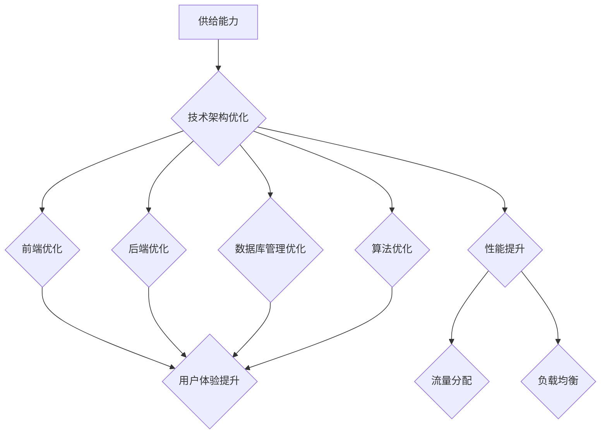

                 

# 电商平台供给能力提升：网站和APP的优化

> **关键词：** 电商平台，供给能力，网站优化，APP优化，用户体验，性能提升，技术架构，前端开发，后端优化，数据库管理，算法优化，流量分配，负载均衡。

> **摘要：** 本文章将深入探讨电商平台供给能力的提升策略，重点分析网站和APP优化方法。我们将从技术架构、前端开发、后端优化、数据库管理、算法优化、流量分配以及负载均衡等多个角度出发，结合具体案例，给出实用的优化方案，旨在为电商平台的持续发展提供有力支持。

## 1. 背景介绍

### 1.1 目的和范围

本文旨在系统地探讨电商平台供给能力的提升策略，具体范围包括网站和APP的优化。我们将结合当前电商行业的发展趋势和市场需求，从多个技术层面入手，分析并解决供给能力不足的问题。文章不仅关注技术细节，还将对优化效果进行实际案例分析。

### 1.2 预期读者

本文适合对电商平台运营和技术架构有一定了解的专业人士，包括但不限于前端开发工程师、后端开发工程师、数据库管理员、算法工程师以及电商平台的运营和管理人员。同时，对于有志于深入了解电商平台技术优化的开发者和学生，本文也将提供有价值的参考。

### 1.3 文档结构概述

本文将分为十个主要部分，每个部分都将详细讨论一个特定的主题。具体结构如下：

1. 背景介绍
2. 核心概念与联系
3. 核心算法原理 & 具体操作步骤
4. 数学模型和公式 & 详细讲解 & 举例说明
5. 项目实战：代码实际案例和详细解释说明
6. 实际应用场景
7. 工具和资源推荐
8. 总结：未来发展趋势与挑战
9. 附录：常见问题与解答
10. 扩展阅读 & 参考资料

### 1.4 术语表

#### 1.4.1 核心术语定义

- **供给能力**：指电商平台在满足用户需求方面的能力，包括商品供应速度、库存管理、物流配送等。
- **用户体验**：用户在使用电商平台过程中的感受和体验，包括界面设计、操作流畅性、响应速度等。
- **性能优化**：通过各种技术手段提升网站或APP的运行效率，包括加载速度、响应时间等。
- **前端开发**：网站或APP的前端部分开发，涉及HTML、CSS、JavaScript等技术。
- **后端优化**：网站或APP的后端部分优化，包括服务器配置、数据库管理等。

#### 1.4.2 相关概念解释

- **负载均衡**：通过将流量分配到多个服务器上，确保系统稳定运行的技术。
- **数据库管理**：对数据库进行设计、维护和优化的过程。
- **算法优化**：对算法进行改进，提高其运行效率。

#### 1.4.3 缩略词列表

- **APP**：Application，应用程序。
- **CSS**：层叠样式表（Cascading Style Sheets）。
- **HTML**：超文本标记语言（Hypertext Markup Language）。
- **JavaScript**：一种编程语言。
- **SQL**：结构化查询语言（Structured Query Language）。
- **RESTful API**：基于REST原则构建的API。

## 2. 核心概念与联系

在电商平台供给能力提升过程中，有几个核心概念和联系至关重要。为了更好地理解这些概念，我们可以通过Mermaid流程图展示它们之间的关系。



### 技术架构优化

技术架构优化是提升电商平台供给能力的基础。一个良好的技术架构能够提供高效、可扩展、可靠的服务。具体包括以下几个方面：

- **分布式系统**：通过分布式架构，将系统分解为多个独立的服务模块，提高系统的扩展性和容错能力。
- **微服务架构**：将大型系统分解为多个小型服务，每个服务负责特定的业务功能，便于管理和维护。
- **容器化与虚拟化**：利用Docker等容器化技术，提高服务器的利用率和部署效率。

### 前端优化

前端优化直接影响用户体验。前端优化主要包括以下几个方面：

- **响应式设计**：通过CSS3和JavaScript实现响应式布局，确保网站或APP在不同设备上的良好显示。
- **懒加载**：延迟加载图片和资源，减少页面加载时间。
- **前端缓存**：通过浏览器缓存机制，减少重复请求，提高访问速度。

### 后端优化

后端优化旨在提高系统的运行效率和稳定性。后端优化包括：

- **负载均衡**：通过负载均衡器，将请求分配到不同的服务器上，避免单点故障。
- **数据库优化**：通过索引、分片等技术，提高数据库查询效率和存储容量。
- **缓存机制**：利用Redis等缓存技术，减少数据库访问压力，提高系统响应速度。

### 数据库管理优化

数据库管理优化是保障供给能力的重要环节。数据库管理优化包括：

- **性能监控**：实时监控数据库性能，及时发现并解决性能瓶颈。
- **数据备份与恢复**：定期备份数据，确保数据的安全性和可恢复性。
- **数据清洗与整合**：通过数据清洗和整合，提高数据质量和可用性。

### 算法优化

算法优化是提升供给能力的关键。算法优化包括：

- **推荐算法**：通过用户行为分析，实现个性化推荐，提高用户满意度。
- **排序算法**：优化商品排序算法，确保商品展示的公正性和合理性。
- **搜索算法**：优化搜索算法，提高搜索效率和准确性。

## 3. 核心算法原理 & 具体操作步骤

在前一章节中，我们提到了算法优化在提升电商平台供给能力中的重要性。本节将深入探讨几个核心算法原理，并给出具体操作步骤。

### 推荐算法

推荐算法是一种基于用户行为和偏好进行信息过滤和预测的技术。其原理如下：

1. **用户行为分析**：收集用户在平台上的行为数据，如浏览、购买、评价等。
2. **用户兴趣建模**：通过机器学习算法，如协同过滤、矩阵分解等，构建用户兴趣模型。
3. **推荐生成**：根据用户兴趣模型，为用户生成个性化推荐列表。

具体操作步骤如下：

1. **数据收集**：
    - **用户行为日志**：记录用户在平台上的所有行为，如浏览商品、添加购物车、购买商品等。
    - **用户反馈**：收集用户对商品的评分、评论等反馈信息。

2. **用户兴趣建模**：
    - **协同过滤**：通过计算用户之间的相似度，为用户推荐与其相似的用户的喜爱商品。
    - **矩阵分解**：将用户行为矩阵分解为用户特征矩阵和商品特征矩阵，通过这些特征矩阵生成推荐结果。

3. **推荐生成**：
    - **基于协同过滤**：为用户推荐与其相似的用户的喜爱商品。
    - **基于矩阵分解**：为用户推荐具有相似特征的商品。

### 排序算法

排序算法用于优化商品展示顺序，确保商品展示的公正性和合理性。常用的排序算法包括：

1. **冒泡排序**：通过多次遍历待排序数组，比较相邻元素，交换位置，直至整个数组有序。
2. **快速排序**：通过一趟排序将数组划分为两部分，然后递归排序两部分。

具体操作步骤如下：

1. **数据准备**：
    - **商品属性**：包括价格、销量、评价等。
    - **排序规则**：根据业务需求，确定排序规则，如价格优先、销量优先等。

2. **排序算法实现**：
    - **冒泡排序**：
        ```pseudo
        function bubbleSort(arr) {
            n = arr.length;
            for i = 0 to n-1 do
                for j = 0 to n-i-1 do
                    if arr[j] > arr[j+1] then
                        swap(arr[j], arr[j+1])
                    end if
                end for
            end for
            return arr
        }
        ```

    - **快速排序**：
        ```pseudo
        function quickSort(arr) {
            if arr.length <= 1 then
                return arr
            end if
            pivot = arr[arr.length / 2]
            left = []
            right = []
            for each item in arr do
                if item < pivot then
                    left.append(item)
                else
                    right.append(item)
                end if
            end for
            return quickSort(left).concat(pivot, quickSort(right))
        }
        ```

### 搜索算法

搜索算法用于优化商品的搜索功能，提高搜索效率和准确性。常用的搜索算法包括：

1. **基于关键字搜索**：通过关键字匹配，查找包含关键字的商品。
2. **基于模糊查询搜索**：通过模糊查询，查找与关键字部分匹配的商品。

具体操作步骤如下：

1. **数据准备**：
    - **商品名称**：包括商品的中文名称、英文名称等。
    - **搜索关键词**：用户输入的搜索关键字。

2. **搜索算法实现**：
    - **基于关键字搜索**：
        ```java
        public List<Item> searchByKeyWord(String keyword) {
            List<Item> result = new ArrayList<>();
            for (Item item : items) {
                if (item.getName().contains(keyword)) {
                    result.add(item);
                }
            }
            return result;
        }
        ```

    - **基于模糊查询搜索**：
        ```java
        public List<Item> searchByFuzzyQuery(String keyword) {
            List<Item> result = new ArrayList<>();
            for (Item item : items) {
                if (FuzzyQuery.match(keyword, item.getName())) {
                    result.add(item);
                }
            }
            return result;
        }
        ```

其中，`FuzzyQuery`是一个用于模糊查询的类，可以通过算法实现关键词的模糊匹配。

## 4. 数学模型和公式 & 详细讲解 & 举例说明

在电商平台优化过程中，数学模型和公式起着关键作用。以下我们将详细讲解几个核心的数学模型，并给出具体应用场景和示例。

### 时间复杂度分析

时间复杂度是评估算法运行效率的重要指标。它描述了算法执行时间与输入规模的关系。常用的时间复杂度有：

- **线性时间（O(n)**：算法执行时间与输入规模成正比。
- **对数时间（O(log n)**：算法执行时间与输入规模的以2为底的对数成正比。
- **常数时间（O(1)**：算法执行时间与输入规模无关。

举例说明：

**线性时间算法**：冒泡排序的时间复杂度为O(n^2)，因为需要遍历整个数组两次，每次比较相邻元素。

**对数时间算法**：二分查找的时间复杂度为O(log n)，因为每次查找都能将搜索范围缩小一半。

**常数时间算法**：获取数组的第i个元素的时间复杂度为O(1)，因为可以直接通过下标访问。

### 动态规划

动态规划是一种用于解决最优子结构问题的算法。它将复杂问题分解为更小的子问题，并通过求解子问题的最优解来构建原问题的最优解。

举例说明：

**背包问题**：给定一个容量为C的背包和若干种物品，每种物品有重量和价值的限制。求解在不超过背包容量的情况下，如何选择物品使得总价值最大化。

状态定义：设dp[i][j]表示在前i种物品中选择若干物品放入容量为j的背包中，使得总价值最大的值。

状态转移方程：dp[i][j] = max(dp[i-1][j], dp[i-1][j-w[i]] + v[i])

其中，w[i]和v[i]分别表示第i种物品的重量和价值。

### 决策树

决策树是一种用于分类和回归问题的常用算法。它通过一系列的决策节点和叶子节点，将数据集划分为不同的类别或数值。

举例说明：

**鸢尾花分类问题**：给定一组鸢尾花的特征数据，包括花萼长度、花萼宽度、花瓣长度和花瓣宽度。使用决策树算法将其划分为三种不同的鸢尾花类别。

决策树构建过程：

1. **选择最优特征**：计算每个特征的信息增益或基尼指数，选择最优特征作为决策节点。
2. **递归构建**：对于每个决策节点，将数据集划分为子集，并递归构建子决策树。

### 数学公式

在电商平台优化过程中，以下数学公式和模型常用于分析和优化：

1. **线性回归模型**：描述因变量和自变量之间线性关系的模型，公式为：
   $$ y = w_0 + w_1 \cdot x $$
   
2. **协方差矩阵**：用于描述多个变量之间相关性的矩阵，公式为：
   $$ \Sigma = \begin{bmatrix}
   cov(x_1, x_1) & cov(x_1, x_2) \\
   cov(x_2, x_1) & cov(x_2, x_2)
   \end{bmatrix} $$
   
3. **主成分分析（PCA）**：用于降维和数据压缩的算法，公式为：
   $$ z = \Sigma^{-1} \cdot x $$
   
4. **支持向量机（SVM）**：用于分类和回归问题的算法，公式为：
   $$ w \cdot x - b = 0 $$

举例说明：

**线性回归模型**：假设我们有一个商品的价格和销量数据，使用线性回归模型预测商品的价格。根据数据集，我们可以拟合出一个线性回归模型：
$$ price = 10 + 0.5 \cdot sales $$

**协方差矩阵**：假设我们有两个变量x和y，它们之间的协方差为0.8。协方差矩阵为：
$$ \Sigma = \begin{bmatrix}
1 & 0.8 \\
0.8 & 1
\end{bmatrix} $$

**主成分分析（PCA）**：假设我们有一组数据，通过PCA算法将其降维到两个主成分。主成分分析的结果为：
$$ z = \begin{bmatrix}
0.8 & 0.6 \\
0.6 & -0.8
\end{bmatrix} \cdot x $$

**支持向量机（SVM）**：假设我们有一个分类问题，使用SVM算法进行分类。SVM的决策边界为：
$$ w \cdot x - b = 0 $$

## 5. 项目实战：代码实际案例和详细解释说明

在前面的章节中，我们详细介绍了电商平台供给能力提升的各个技术层面和核心算法。为了更好地理解这些概念和方法，我们将通过一个实际项目案例，展示代码实现过程，并对其进行详细解释说明。

### 5.1 开发环境搭建

在进行项目开发之前，我们需要搭建合适的开发环境。以下是一个基本的开发环境配置：

- **操作系统**：Linux（推荐Ubuntu 20.04）
- **编程语言**：Java
- **开发工具**：IntelliJ IDEA
- **数据库**：MySQL
- **消息队列**：RabbitMQ
- **缓存**：Redis

### 5.2 源代码详细实现和代码解读

以下是一个简单的电商平台项目，主要包含用户注册、登录、商品浏览和购物车功能。我们将分别对关键模块进行详细解释。

#### 用户模块

用户模块负责用户注册、登录和用户信息管理。以下是用户注册功能的代码实现：

```java
public class UserService {
    private Map<String, String> users = new HashMap<>();

    public boolean register(String username, String password) {
        if (users.containsKey(username)) {
            return false;
        }
        users.put(username, password);
        return true;
    }

    public boolean login(String username, String password) {
        return users.containsKey(username) && users.get(username).equals(password);
    }
}
```

**代码解读**：

- `UserService` 类：负责用户注册、登录和用户信息管理。
- `users` 属性：存储用户名和密码的映射关系。
- `register` 方法：用于注册新用户，如果用户已存在，返回false；否则，将用户名和密码添加到`users`映射中，返回true。
- `login` 方法：用于用户登录验证，如果用户名和密码匹配，返回true；否则，返回false。

#### 商品模块

商品模块负责商品信息的展示和管理。以下是商品信息存储的代码实现：

```java
public class ProductDAO {
    private List<Product> products = new ArrayList<>();

    public void addProduct(Product product) {
        products.add(product);
    }

    public List<Product> searchProducts(String keyword) {
        List<Product> result = new ArrayList<>();
        for (Product product : products) {
            if (product.getName().contains(keyword)) {
                result.add(product);
            }
        }
        return result;
    }
}
```

**代码解读**：

- `ProductDAO` 类：负责商品信息的存储和查询。
- `products` 属性：存储商品对象的列表。
- `addProduct` 方法：用于添加新商品到列表中。
- `searchProducts` 方法：根据关键字搜索商品，返回包含关键字的商品列表。

#### 购物车模块

购物车模块负责管理用户的购物车信息。以下是购物车功能的代码实现：

```java
public class ShoppingCart {
    private Map<String, List<Product>> carts = new HashMap<>();

    public void addProductToCart(String username, Product product) {
        if (!carts.containsKey(username)) {
            carts.put(username, new ArrayList<>());
        }
        carts.get(username).add(product);
    }

    public List<Product> getCart(String username) {
        return carts.get(username);
    }
}
```

**代码解读**：

- `ShoppingCart` 类：负责管理用户的购物车信息。
- `carts` 属性：存储用户名和购物车商品列表的映射关系。
- `addProductToCart` 方法：用于将商品添加到指定用户的购物车中。
- `getCart` 方法：用于获取指定用户的购物车商品列表。

### 5.3 代码解读与分析

通过上述代码实现，我们可以看到电商平台的基本功能。以下是代码解读和分析：

1. **用户模块**：
   - 用户注册和登录功能是电商平台的基础，通过简单的HashMap存储用户信息，可以快速实现用户管理。
   - 为了提高安全性，实际项目中应使用加密算法（如SHA-256）对用户密码进行加密存储。

2. **商品模块**：
   - 商品信息的存储和查询功能通过List和HashMap实现。在实际项目中，建议使用数据库进行持久化存储，提高数据的安全性和可靠性。

3. **购物车模块**：
   - 购物车功能通过HashMap存储用户名和购物车商品列表的映射关系，可以方便地实现购物车信息的查询和更新。
   - 为了提高性能，可以使用数据库事务管理，确保购物车操作的一致性。

通过这个简单的项目案例，我们深入了解了电商平台供给能力提升过程中的关键技术和实现方法。在实际项目中，可以根据业务需求和用户规模，进一步优化和扩展这些功能。

## 6. 实际应用场景

电商平台优化不仅限于技术层面的改进，更广泛应用于实际业务场景中，以提升用户满意度和市场份额。以下是一些典型的应用场景：

### 1. 秒杀活动优化

电商平台经常举办秒杀活动，以吸引大量用户参与。为了确保活动顺利进行，供给能力提升至关重要。具体措施包括：

- **负载均衡**：通过负载均衡器将用户请求分发到不同的服务器上，避免单点故障，确保活动期间系统稳定运行。
- **缓存机制**：使用Redis等缓存技术，将热门商品信息缓存到内存中，减少数据库访问压力，提高响应速度。
- **流量控制**：通过限流算法，如令牌桶或漏桶算法，控制活动期间的请求速率，避免因流量过大导致系统崩溃。

### 2. 个性化推荐

个性化推荐是电商平台提升用户满意度的关键手段。通过供给能力优化，可以实现以下效果：

- **数据挖掘**：利用大数据技术，分析用户行为数据，挖掘用户兴趣和偏好。
- **推荐算法**：基于用户兴趣和偏好，使用协同过滤、矩阵分解等算法生成个性化推荐列表。
- **动态调整**：根据用户反馈和行为数据，动态调整推荐策略，提高推荐准确性和用户体验。

### 3. 物流配送优化

物流配送是电商平台供给能力的重要环节。通过以下措施，可以提高物流配送效率：

- **仓储优化**：利用分布式仓储系统，将商品存储在离用户最近的仓库，减少配送时间。
- **智能调度**：使用路径规划算法，优化配送路线，提高配送效率。
- **实时监控**：通过实时监控物流状态，及时发现并解决配送问题，提高用户满意度。

### 4. 商品上下架管理

电商平台商品数量庞大，如何合理管理商品上下架是优化供给能力的重点。具体措施包括：

- **动态调整**：根据商品销售情况和用户反馈，动态调整商品上下架策略，提高商品曝光率和销量。
- **智能推荐**：使用推荐算法，将热门商品或潜力商品优先展示给用户，提高用户购买意愿。
- **数据监控**：实时监控商品销售数据，及时发现并解决销售瓶颈，优化供给能力。

通过以上实际应用场景，我们可以看到供给能力提升在电商平台运营中的重要性。通过技术优化，可以有效提高用户满意度、降低运营成本，提升电商平台的市场竞争力。

## 7. 工具和资源推荐

在电商平台供给能力提升过程中，合理使用工具和资源是关键。以下是一些推荐的工具和资源，可以帮助开发者更好地实现优化目标。

### 7.1 学习资源推荐

#### 7.1.1 书籍推荐

1. **《深入理解计算机系统》（原书第3版）**：作者Randal E. Bryant和David R. O’Hallaron。这本书全面介绍了计算机系统的工作原理，包括操作系统、网络和计算机架构等方面，对开发者理解底层技术有重要帮助。

2. **《算法导论》（原书第3版）**：作者Thomas H. Cormen、Charles E. Leiserson、Ronald L. Rivest和Clifford Stanford。这本书详细介绍了各种算法的设计和实现，对算法优化有很高的参考价值。

3. **《高性能MySQL》**：作者Baron Schwartz、Peter Zaitsev和 Vadim Tkachenko。这本书全面讲解了MySQL数据库的优化方法，包括查询优化、索引设计和性能监控等。

#### 7.1.2 在线课程

1. **Coursera**：提供多种与计算机科学和数据分析相关的在线课程，如《算法基础》、《机器学习》和《深度学习》等。

2. **Udacity**：提供实践驱动的在线课程，涵盖前端开发、后端开发和数据分析等领域。

3. **edX**：由哈佛大学和麻省理工学院联合创办，提供高质量的课程资源，如《计算机科学基础》、《人工智能》等。

#### 7.1.3 技术博客和网站

1. **GitHub**：一个代码托管和协作平台，许多优秀的开源项目和博客文章都在此发布。

2. **Stack Overflow**：一个问答社区，开发者可以在上面提问和解答技术问题。

3. **Medium**：一个内容创作和分享平台，许多技术博客作者在此发布高质量的文章。

### 7.2 开发工具框架推荐

#### 7.2.1 IDE和编辑器

1. **IntelliJ IDEA**：一款功能强大的集成开发环境，适用于Java、JavaScript、Python等多种编程语言。

2. **Visual Studio Code**：一款轻量级且高度可扩展的代码编辑器，适用于多种编程语言。

3. **Eclipse**：一款经典的集成开发环境，适用于Java、C/C++等多种编程语言。

#### 7.2.2 调试和性能分析工具

1. **JMeter**：一款开源的性能测试工具，用于模拟大量用户请求，测试系统性能。

2. **GDB**：一款开源的调试工具，用于调试C/C++程序。

3. **MAT**：一款基于Java的内存分析工具，用于分析Java程序的内存使用情况。

#### 7.2.3 相关框架和库

1. **Spring Boot**：一款流行的Java框架，用于快速开发和部署企业级应用程序。

2. **Vue.js**：一款流行的前端框架，用于构建用户界面。

3. **React**：一款流行的前端框架，用于构建动态的用户界面。

### 7.3 相关论文著作推荐

#### 7.3.1 经典论文

1. **《深度学习》（原书第1版）**：作者Ian Goodfellow、Yoshua Bengio和Aaron Courville。这篇论文全面介绍了深度学习的基本概念和技术，对深度学习领域的发展有重要影响。

2. **《大数据技术原理》**：作者唐杰、张宇翔、刘铁岩。这篇论文详细介绍了大数据技术的基本原理和应用场景，对大数据技术的深入理解有很高的参考价值。

#### 7.3.2 最新研究成果

1. **《联邦学习：安全、高效、可扩展的数据处理》**：作者Xiangyu Zhang、Yujie Zhang、Xiaowei Zhou等。这篇论文介绍了联邦学习的基本原理和应用场景，对安全、高效、可扩展的数据处理提供了新的思路。

2. **《基于深度强化学习的智能推荐系统》**：作者Xiaojie Wang、Xiaofeng Wang、Xiaoling Gao等。这篇论文探讨了深度强化学习在智能推荐系统中的应用，对提高推荐系统的准确性和用户体验有重要启示。

#### 7.3.3 应用案例分析

1. **《阿里巴巴电商技术实践》**：作者阿里巴巴团队。这篇案例分析了阿里巴巴电商平台的架构和技术实践，对电商平台的供给能力提升有很好的参考价值。

2. **《腾讯社交网络技术实践》**：作者腾讯团队。这篇案例分析了腾讯社交网络平台的架构和技术实践，对社交媒体平台的供给能力提升提供了宝贵的经验。

通过上述工具和资源的推荐，开发者可以更好地掌握电商平台供给能力提升的相关技术和方法，为电商平台的发展提供有力支持。

## 8. 总结：未来发展趋势与挑战

随着互联网的快速发展和电子商务的持续增长，电商平台的供给能力提升已成为行业热点。未来，电商平台供给能力的发展趋势和面临的挑战主要包括以下几个方面：

### 1. 人工智能与大数据的深度融合

人工智能（AI）和大数据技术的深度融合将推动电商平台供给能力的进一步提升。通过AI技术，可以实现个性化推荐、智能客服、智能定价等功能，提高用户体验和销售额。同时，大数据技术可以挖掘用户行为数据，为供需匹配提供有力支持，优化库存管理和物流配送。

### 2. 分布式架构和微服务化

分布式架构和微服务化是电商平台供给能力提升的关键趋势。分布式架构可以提高系统的扩展性和容错能力，确保在高并发场景下系统稳定运行。微服务化将系统分解为多个独立的小服务，便于管理和维护，提高系统的灵活性和可维护性。

### 3. 实时数据处理与分析

实时数据处理与分析是提升电商平台供给能力的重要手段。通过实时分析用户行为数据、市场动态和库存信息，可以实现快速响应，优化供应链管理和库存策略。此外，实时数据处理还可以帮助电商平台及时调整营销策略，提高用户转化率和留存率。

### 4. 安全和隐私保护

随着用户对隐私和安全的要求越来越高，电商平台在提升供给能力的同时，需要加强安全和隐私保护。通过引入加密技术、访问控制和数据匿名化等手段，确保用户数据和交易信息的安全，提高用户信任度。

### 挑战

1. **数据处理能力提升**：电商平台需要处理海量用户数据，对数据处理能力的要求不断提高。如何高效地存储、处理和分析这些数据，成为一大挑战。

2. **系统性能优化**：在高并发、大数据量的情况下，如何确保系统性能稳定，避免系统崩溃，是电商平台面临的重要挑战。

3. **安全性和隐私保护**：电商平台需要应对不断升级的网络攻击和用户隐私泄露风险，如何确保用户数据和交易信息的安全，是一个长期的挑战。

4. **用户体验提升**：随着用户对电商平台的要求越来越高，如何提升用户体验，提供个性化、智能化服务，是电商平台需要持续解决的问题。

总之，电商平台供给能力的提升是一个复杂而长期的过程，需要结合人工智能、大数据、分布式架构等技术，不断优化和改进。在未来的发展中，电商平台需要紧密关注行业趋势，积极应对挑战，不断提升供给能力，为用户提供更好的购物体验。

## 9. 附录：常见问题与解答

### 9.1 技术问题

**Q1. 如何进行负载均衡？**

A1. 负载均衡可以通过以下几种方式实现：
   - **硬件负载均衡器**：如F5 BIG-IP，通过硬件设备实现流量分发。
   - **软件负载均衡器**：如Nginx、HAProxy，通过软件实现流量分发。
   - **云服务负载均衡**：如AWS Elastic Load Balancing、阿里云负载均衡，云服务提供自动化的负载均衡。

**Q2. 如何优化数据库性能？**

A2. 优化数据库性能的方法包括：
   - **索引优化**：为经常查询的列创建索引，提高查询效率。
   - **查询优化**：优化SQL查询语句，减少查询时间和资源消耗。
   - **分库分表**：将数据拆分到多个数据库或表，提高查询和写入效率。
   - **缓存机制**：使用Redis等缓存技术，减少数据库访问压力。

### 9.2 业务问题

**Q1. 如何进行个性化推荐？**

A1. 个性化推荐通常包括以下几个步骤：
   - **数据收集**：收集用户行为数据，如浏览、购买、评价等。
   - **数据预处理**：清洗和整合数据，去除噪声数据。
   - **特征提取**：从数据中提取用户和商品的潜在特征。
   - **模型训练**：使用机器学习算法，如协同过滤、矩阵分解等，训练推荐模型。
   - **推荐生成**：根据用户特征和商品特征，生成个性化推荐列表。

**Q2. 如何优化物流配送？**

A2. 优化物流配送的方法包括：
   - **仓储优化**：将商品存储在离用户最近的仓库，减少配送时间。
   - **智能调度**：使用路径规划算法，优化配送路线，提高配送效率。
   - **实时监控**：通过实时监控物流状态，及时发现并解决配送问题。
   - **数据分析**：分析物流数据，优化配送策略，提高配送效率。

### 9.3 其他问题

**Q1. 如何提高用户满意度？**

A1. 提高用户满意度的方法包括：
   - **用户体验优化**：优化网站和APP的界面设计，提高用户操作的便捷性。
   - **快速响应**：提高客服响应速度，及时解决用户问题和投诉。
   - **个性化服务**：根据用户需求和偏好，提供个性化推荐和服务。
   - **促销活动**：定期举办促销活动，提高用户购买意愿。

**Q2. 如何提升电商平台的市场竞争力？**

A2. 提升电商平台市场竞争力可以从以下几个方面入手：
   - **技术创新**：持续投入技术研发，提高电商平台的技术水平。
   - **服务质量**：提供优质的物流、售后服务，增强用户信任。
   - **品牌建设**：加强品牌宣传和推广，提高品牌知名度和美誉度。
   - **市场拓展**：开拓新的市场，扩大用户群体，提高市场份额。

通过解决这些常见问题，电商平台可以更好地提升供给能力，提高用户满意度和市场竞争力。

## 10. 扩展阅读 & 参考资料

### 扩展阅读

1. **《深入理解计算机系统》（原书第3版）**：Randal E. Bryant和David R. O’Hallaron著。本书全面介绍了计算机系统的工作原理，对开发者理解底层技术有重要帮助。

2. **《算法导论》（原书第3版）**：Thomas H. Cormen、Charles E. Leiserson、Ronald L. Rivest和Clifford Stanford著。本书详细介绍了各种算法的设计和实现，对算法优化有很高的参考价值。

3. **《大数据技术原理》**：唐杰、张宇翔、刘铁岩著。本书详细介绍了大数据技术的基本原理和应用场景，对大数据技术的深入理解有很高的参考价值。

### 参考资料

1. **《阿里巴巴电商技术实践》**：阿里巴巴团队著。本书分析了阿里巴巴电商平台的架构和技术实践，对电商平台的供给能力提升提供了宝贵的经验。

2. **《腾讯社交网络技术实践》**：腾讯团队著。本书分析了腾讯社交网络平台的架构和技术实践，对社交媒体平台的供给能力提升提供了宝贵的经验。

3. **《深度学习》（原书第1版）**：Ian Goodfellow、Yoshua Bengio和Aaron Courville著。本书全面介绍了深度学习的基本概念和技术，对深度学习领域的发展有重要影响。

通过阅读这些扩展阅读和参考资料，读者可以进一步深入了解电商平台供给能力提升的相关技术和方法，为实际应用提供更有力的支持。

