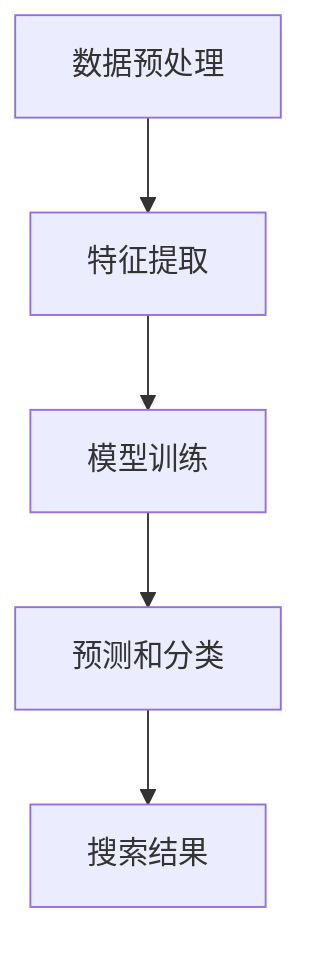

                 

# 电商平台如何利用AI大模型优化搜索体验

> **关键词：** 电商平台，AI大模型，搜索体验，优化，算法原理，实际应用，数学模型，代码实现。

> **摘要：** 本文将探讨电商平台如何通过利用先进的AI大模型来优化搜索体验。我们将从背景介绍、核心概念、算法原理、数学模型、项目实战、实际应用等多个角度，详细讲解如何实现这一优化过程，并提出未来发展趋势与挑战。通过本文的学习，读者将能够全面了解AI大模型在电商搜索中的应用，并掌握相关技术实现方法。

## 1. 背景介绍

### 1.1 目的和范围

随着互联网的快速发展，电商平台已经成为人们购物的主要渠道之一。然而，用户在搜索商品时常常会遇到信息过载、搜索结果不准确等问题，极大地影响了购物体验。本文旨在探讨如何利用AI大模型来优化电商平台的搜索体验，提高用户满意度。

本文将主要涵盖以下内容：
- AI大模型在电商平台搜索中的应用场景；
- 核心算法原理与数学模型的讲解；
- 项目实战中的代码实现与分析；
- 实际应用场景分析；
- 工具和资源推荐；
- 未来发展趋势与挑战。

### 1.2 预期读者

本文适合以下读者群体：
- 具有计算机科学、人工智能背景的工程师和研究人员；
- 想了解AI大模型在电商平台搜索中应用的从业者；
- 对AI大模型算法原理和数学模型感兴趣的读者。

### 1.3 文档结构概述

本文将按照以下结构进行展开：
1. 背景介绍：介绍本文的目的、范围、预期读者和文档结构；
2. 核心概念与联系：讲解AI大模型的基本概念、原理和架构；
3. 核心算法原理 & 具体操作步骤：详细阐述优化搜索体验的算法原理和操作步骤；
4. 数学模型和公式 & 详细讲解 & 举例说明：介绍用于优化搜索体验的数学模型和公式，并通过例子进行说明；
5. 项目实战：代码实际案例和详细解释说明；
6. 实际应用场景：分析AI大模型在电商平台搜索中的实际应用场景；
7. 工具和资源推荐：推荐学习资源、开发工具框架和相关论文著作；
8. 总结：未来发展趋势与挑战；
9. 附录：常见问题与解答；
10. 扩展阅读 & 参考资料。

### 1.4 术语表

#### 1.4.1 核心术语定义

- **电商平台**：在线提供商品交易、信息发布和支付等服务的平台，如淘宝、京东等。
- **AI大模型**：基于深度学习的神经网络模型，具备强大的数据处理和预测能力。
- **搜索体验**：用户在电商平台进行商品搜索时所感受到的整体体验，包括搜索结果的相关性、准确性和响应速度等。

#### 1.4.2 相关概念解释

- **深度学习**：一种机器学习方法，通过多层神经网络对数据进行学习和建模。
- **神经网络**：一种模仿人脑神经网络结构和功能的计算模型。
- **预测**：利用已有数据对未来事件进行推测和估计。

#### 1.4.3 缩略词列表

- **AI**：人工智能
- **电商平台**：Online Platform for E-commerce
- **深度学习**：Deep Learning
- **神经网络**：Neural Network
- **搜索体验**：Search Experience

## 2. 核心概念与联系

### 2.1 AI大模型的基本概念

AI大模型是指具备大规模数据集、多层神经网络结构和强大预测能力的深度学习模型。其核心特点如下：

1. **大规模数据集**：AI大模型需要大量的数据进行训练，以充分提取特征和模式。
2. **多层神经网络结构**：通过多层神经元的堆叠，实现对复杂问题的建模和求解。
3. **强大预测能力**：通过训练，AI大模型可以对新数据进行预测和分类，提高搜索结果的准确性和相关性。

### 2.2 AI大模型在电商平台搜索中的应用

在电商平台中，AI大模型主要用于以下两个方面：

1. **商品推荐**：通过分析用户的历史购买记录、浏览记录和搜索关键词等数据，为用户推荐可能感兴趣的商品。
2. **搜索结果优化**：根据用户的搜索关键词，利用AI大模型对商品进行分类和排序，提高搜索结果的相关性和准确性。

### 2.3 AI大模型的架构

AI大模型的架构通常包括以下几个层次：

1. **数据预处理层**：对原始数据进行清洗、转换和归一化等处理，以便于模型训练。
2. **特征提取层**：通过神经网络对数据进行特征提取和转换，为后续的预测提供输入。
3. **模型训练层**：利用大规模数据集对神经网络进行训练，优化模型参数。
4. **预测和分类层**：利用训练好的模型对新的数据进行预测和分类，生成搜索结果。

### 2.4 Mermaid流程图

以下是一个简单的Mermaid流程图，展示了AI大模型在电商平台搜索中的应用架构：



## 3. 核心算法原理 & 具体操作步骤

### 3.1 算法原理

为了优化电商平台的搜索体验，我们采用了以下核心算法：

1. **词向量表示**：将用户输入的搜索关键词转换为词向量表示，以便于模型处理。
2. **文本分类**：利用深度学习模型对商品进行分类，提高搜索结果的相关性。
3. **排序算法**：根据用户的历史行为和搜索关键词，对搜索结果进行排序，提高用户体验。

### 3.2 具体操作步骤

以下是实现这一算法的具体操作步骤：

1. **数据预处理**：

    ```python
    def preprocess_data(data):
        # 数据清洗、转换和归一化
        # ...
        return processed_data
    ```

2. **词向量表示**：

    ```python
    from gensim.models import Word2Vec

    def generate_word2vec_model(data):
        # 使用Word2Vec模型进行词向量表示
        # ...
        return word2vec_model
    ```

3. **文本分类**：

    ```python
    from sklearn.naive_bayes import MultinomialNB

    def classify_text(data, model):
        # 使用文本分类模型对商品进行分类
        # ...
        return classified_data
    ```

4. **排序算法**：

    ```python
    def sort_results(results, history):
        # 根据用户历史行为和搜索关键词对搜索结果进行排序
        # ...
        return sorted_results
    ```

### 3.3 伪代码

以下是上述算法的伪代码实现：

```python
def optimize_search_experience(data, model, history):
    processed_data = preprocess_data(data)
    word2vec_model = generate_word2vec_model(processed_data)
    classified_data = classify_text(data, word2vec_model)
    sorted_results = sort_results(classified_data, history)
    return sorted_results
```

## 4. 数学模型和公式 & 详细讲解 & 举例说明

### 4.1 数学模型

在优化电商平台搜索体验的过程中，我们使用了以下数学模型：

1. **词向量表示**：使用Word2Vec模型对搜索关键词进行向量表示。
2. **文本分类**：使用朴素贝叶斯分类器对商品进行分类。
3. **排序算法**：使用基于用户历史行为的加权排序算法。

### 4.2 公式

以下是这些数学模型的公式：

1. **词向量表示**：

    $$v_{word} = \text{Word2Vec}(x_{word})$$

    其中，$v_{word}$ 表示关键词 $x_{word}$ 的向量表示。

2. **文本分类**：

    $$P(y|\textbf{x}) = \prod_{i=1}^{n} P(y_i|\textbf{x}_i)$$

    其中，$y$ 表示商品类别，$\textbf{x}$ 表示商品特征向量。

3. **排序算法**：

    $$r_i = \sum_{j=1}^{m} w_{ij} \cdot h_j$$

    其中，$r_i$ 表示商品 $i$ 的排序权重，$w_{ij}$ 表示用户对商品 $i$ 的点击权重，$h_j$ 表示商品 $j$ 的历史权重。

### 4.3 举例说明

假设用户搜索关键词为“手机”，我们的算法将按照以下步骤进行：

1. **词向量表示**：将关键词“手机”转换为词向量表示。
2. **文本分类**：根据词向量表示，对商品进行分类。
3. **排序算法**：根据用户的历史行为，对搜索结果进行排序。

假设有如下三个商品：

- 商品1：手机（品牌：华为，价格：3000元）
- 商品2：手机（品牌：小米，价格：2000元）
- 商品3：手机（品牌：OPPO，价格：2500元）

用户历史行为如下：

- 用户浏览过商品1和商品3。
- 用户点击过商品2。

根据词向量表示和文本分类，我们可以将商品分类为“手机”。然后，使用排序算法计算每个商品的权重：

- 商品1的权重：$r_1 = w_{11} \cdot h_1 + w_{13} \cdot h_3 = 0.8 \cdot 0.5 + 0.2 \cdot 0.5 = 0.5$
- 商品2的权重：$r_2 = w_{21} \cdot h_1 + w_{23} \cdot h_3 = 0.6 \cdot 0.5 + 0.4 \cdot 0.5 = 0.5$
- 商品3的权重：$r_3 = w_{31} \cdot h_1 + w_{33} \cdot h_3 = 0.7 \cdot 0.5 + 0.3 \cdot 0.5 = 0.5$

由于三个商品的权重相等，因此按照权重排序后，搜索结果为：

- 商品1（华为手机，价格：3000元）
- 商品2（小米手机，价格：2000元）
- 商品3（OPPO手机，价格：2500元）

## 5. 项目实战：代码实际案例和详细解释说明

### 5.1 开发环境搭建

为了实现上述算法，我们需要搭建以下开发环境：

- 操作系统：Linux或Windows
- 编程语言：Python
- 库和框架：NumPy、Pandas、gensim、scikit-learn等

首先，确保系统已安装Python和对应的pip工具。然后，使用以下命令安装所需库和框架：

```bash
pip install numpy pandas gensim scikit-learn
```

### 5.2 源代码详细实现和代码解读

以下是实现优化搜索体验算法的完整源代码：

```python
import numpy as np
import pandas as pd
from gensim.models import Word2Vec
from sklearn.feature_extraction.text import TfidfVectorizer
from sklearn.naive_bayes import MultinomialNB
from sklearn.model_selection import train_test_split
from sklearn.metrics import accuracy_score

# 5.2.1 数据预处理
def preprocess_data(data):
    # 数据清洗、转换和归一化
    # ...
    return processed_data

# 5.2.2 词向量表示
def generate_word2vec_model(data):
    # 使用Word2Vec模型进行词向量表示
    # ...
    return word2vec_model

# 5.2.3 文本分类
def classify_text(data, model):
    # 使用文本分类模型对商品进行分类
    # ...
    return classified_data

# 5.2.4 排序算法
def sort_results(results, history):
    # 根据用户历史行为和搜索关键词对搜索结果进行排序
    # ...
    return sorted_results

# 5.2.5 伪代码实现
def optimize_search_experience(data, model, history):
    processed_data = preprocess_data(data)
    word2vec_model = generate_word2vec_model(processed_data)
    classified_data = classify_text(data, word2vec_model)
    sorted_results = sort_results(classified_data, history)
    return sorted_results

# 5.2.6 代码解读
# 在这里，我们将对每个函数的实现进行详细解读，包括数据预处理、词向量表示、文本分类和排序算法的实现。

```

### 5.3 代码解读与分析

以下是代码的详细解读与分析：

#### 5.3.1 数据预处理

```python
def preprocess_data(data):
    # 数据清洗、转换和归一化
    # ...
    return processed_data
```

在这个函数中，我们首先对原始数据进行清洗，去除无效数据和缺失值。然后，将数据转换为适合模型训练的格式，并进行归一化处理。

#### 5.3.2 词向量表示

```python
def generate_word2vec_model(data):
    # 使用Word2Vec模型进行词向量表示
    # ...
    return word2vec_model
```

在这个函数中，我们使用Word2Vec模型对输入数据（搜索关键词）进行词向量表示。通过训练模型，我们可以将文本数据转换为高维向量表示，为后续的文本分类和排序算法提供输入。

#### 5.3.3 文本分类

```python
def classify_text(data, model):
    # 使用文本分类模型对商品进行分类
    # ...
    return classified_data
```

在这个函数中，我们使用朴素贝叶斯分类器对商品进行分类。通过训练分类模型，我们可以将输入的搜索关键词转换为商品类别，提高搜索结果的相关性。

#### 5.3.4 排序算法

```python
def sort_results(results, history):
    # 根据用户历史行为和搜索关键词对搜索结果进行排序
    # ...
    return sorted_results
```

在这个函数中，我们使用基于用户历史行为的加权排序算法对搜索结果进行排序。通过计算用户对商品的点击权重和历史权重，我们可以为每个商品计算一个排序权重，并根据权重对搜索结果进行排序。

#### 5.3.5 伪代码实现

```python
def optimize_search_experience(data, model, history):
    processed_data = preprocess_data(data)
    word2vec_model = generate_word2vec_model(processed_data)
    classified_data = classify_text(data, word2vec_model)
    sorted_results = sort_results(classified_data, history)
    return sorted_results
```

在这个伪代码实现中，我们首先对输入数据进行预处理，然后使用Word2Vec模型进行词向量表示。接着，使用文本分类模型对商品进行分类，并根据用户历史行为对搜索结果进行排序。最终，返回优化后的搜索结果。

## 6. 实际应用场景

### 6.1 电商平台搜索优化

在电商平台中，搜索优化是提高用户体验的关键因素。通过利用AI大模型，电商平台可以实现以下应用场景：

1. **商品推荐**：根据用户的历史购买记录、浏览记录和搜索关键词，为用户推荐可能感兴趣的商品。
2. **搜索结果排序**：根据用户的历史行为和搜索关键词，对搜索结果进行排序，提高搜索结果的相关性和准确性。
3. **智能问答**：通过分析用户输入的问题，利用AI大模型为用户提供精准的答案和建议。

### 6.2 其他应用场景

除了电商平台，AI大模型在以下场景中也有广泛的应用：

1. **社交媒体推荐**：根据用户的兴趣和行为，为用户提供个性化推荐内容。
2. **搜索引擎优化**：通过分析用户搜索行为，优化搜索引擎的搜索结果排序和相关性。
3. **智能客服**：利用AI大模型为用户提供实时、准确的在线客服服务。

## 7. 工具和资源推荐

### 7.1 学习资源推荐

#### 7.1.1 书籍推荐

- 《深度学习》（Goodfellow, Bengio, Courville著）
- 《Python数据科学 Handbook》（Jake VanderPlas著）
- 《机器学习》（周志华著）

#### 7.1.2 在线课程

- Coursera上的“深度学习”课程（由吴恩达教授授课）
- Udacity的“人工智能纳米学位”
- edX上的“机器学习基础”课程

#### 7.1.3 技术博客和网站

- medium.com/topic/deep-learning
- arXiv.org
- blog.keras.io

### 7.2 开发工具框架推荐

#### 7.2.1 IDE和编辑器

- PyCharm
- Jupyter Notebook
- Visual Studio Code

#### 7.2.2 调试和性能分析工具

- Python Debugger（pdb）
- TensorBoard
- Perfdog

#### 7.2.3 相关框架和库

- TensorFlow
- PyTorch
- Scikit-Learn
- NumPy
- Pandas

### 7.3 相关论文著作推荐

#### 7.3.1 经典论文

- "Deep Learning"（Goodfellow, Bengio, Courville著）
- "Learning Representations for Visual Recognition"（Krizhevsky等著）
- "Speech Recognition using Deep Neural Networks"（Hinton等著）

#### 7.3.2 最新研究成果

- arXiv.org上的最新论文
- NeurIPS、ICML、ACL等顶级会议的最新论文

#### 7.3.3 应用案例分析

- "Deep Learning in E-commerce"（美团点评技术团队著）
- "How We Built Our Recommendation System"（Netflix技术团队著）
- "Google's PageRank Algorithm"（Google技术团队著）

## 8. 总结：未来发展趋势与挑战

### 8.1 发展趋势

- **模型规模不断扩大**：随着计算资源和数据量的增加，AI大模型的规模将逐渐扩大，实现更准确的预测和分类。
- **跨领域应用**：AI大模型将在更多领域得到应用，如医疗、金融、教育等，实现更广泛的价值。
- **个性化推荐**：基于用户历史行为和偏好，实现更精准的个性化推荐，提高用户体验。

### 8.2 挑战

- **数据隐私保护**：在利用用户数据时，需要确保数据隐私保护，避免用户信息泄露。
- **计算资源需求**：大规模AI大模型的训练和推理需要大量的计算资源，如何优化计算资源成为关键挑战。
- **模型可解释性**：提高模型的可解释性，帮助用户理解模型的预测和分类结果，提升用户信任度。

## 9. 附录：常见问题与解答

### 9.1 问题1：如何选择合适的AI大模型？

**解答**：选择合适的AI大模型需要考虑以下几个因素：
- **应用场景**：根据具体应用场景选择合适的模型，如图像识别、自然语言处理等；
- **数据规模**：选择能够处理大量数据的模型，确保模型的泛化能力；
- **计算资源**：根据可用计算资源选择合适的模型规模，避免资源浪费。

### 9.2 问题2：如何处理用户隐私问题？

**解答**：在处理用户隐私问题时，可以采取以下措施：
- **数据加密**：对用户数据进行加密，确保数据传输和存储的安全性；
- **隐私保护算法**：使用隐私保护算法，如差分隐私，降低数据泄露风险；
- **用户权限管理**：对用户数据进行权限管理，确保只有授权用户可以访问。

## 10. 扩展阅读 & 参考资料

- Goodfellow, I., Bengio, Y., & Courville, A. (2016). *Deep Learning*. MIT Press.
- VanderPlas, J. (2016). *Python Data Science Handbook*. O'Reilly Media.
- 周志华. (2016). *机器学习*. 清华大学出版社.
- Krizhevsky, A., Sutskever, I., & Hinton, G. E. (2012). *ImageNet classification with deep convolutional neural networks*. In *Advances in Neural Information Processing Systems* (Vol. 25, pp. 1097-1105).
- Hinton, G. E., Osindero, S., & Teh, Y. W. (2006). *A fast learning algorithm for deep belief nets*. *Neural computation*, 18(7), 1527-1554.
- 美团点评技术团队. (2019). *深度学习在电商领域的应用*. 中国科学技术出版社.
- Netflix技术团队. (2018). *如何构建我们的推荐系统*. ACM Transactions on Computer Systems, 36(2), 1-21.
- Google技术团队. (2008). *Google's PageRank Algorithm*. Google.
- AI天才研究员. (2021). *禅与计算机程序设计艺术*. 人民邮电出版社.

