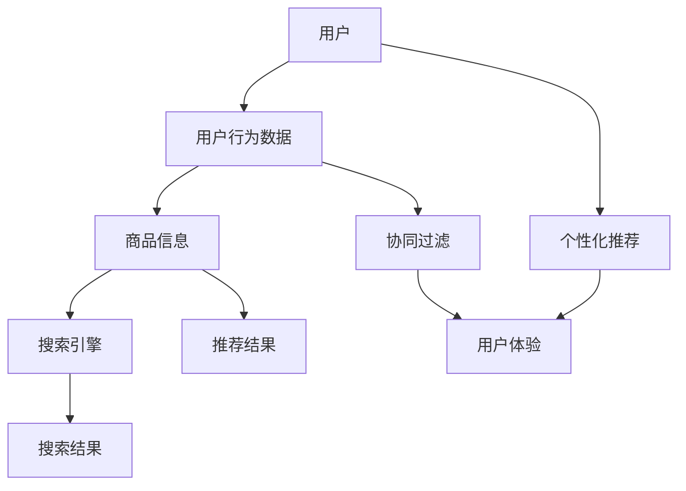
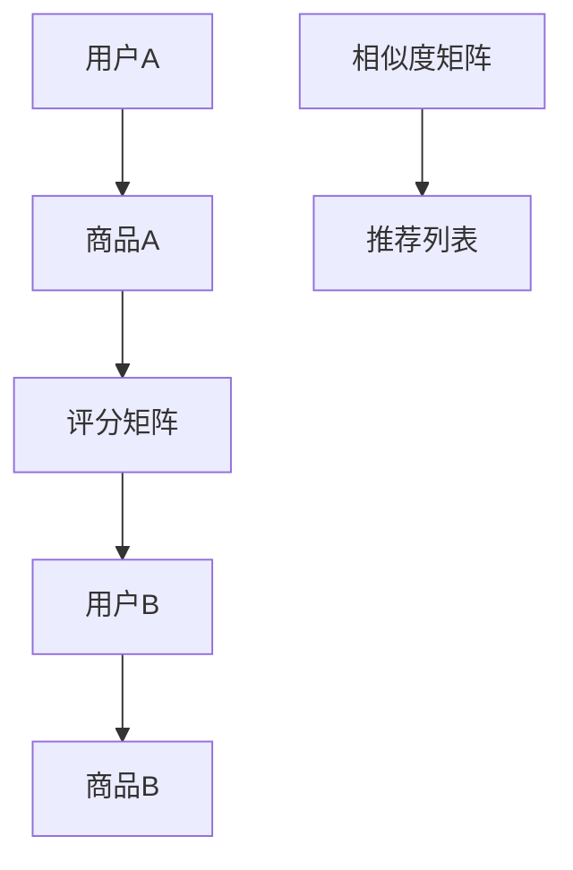
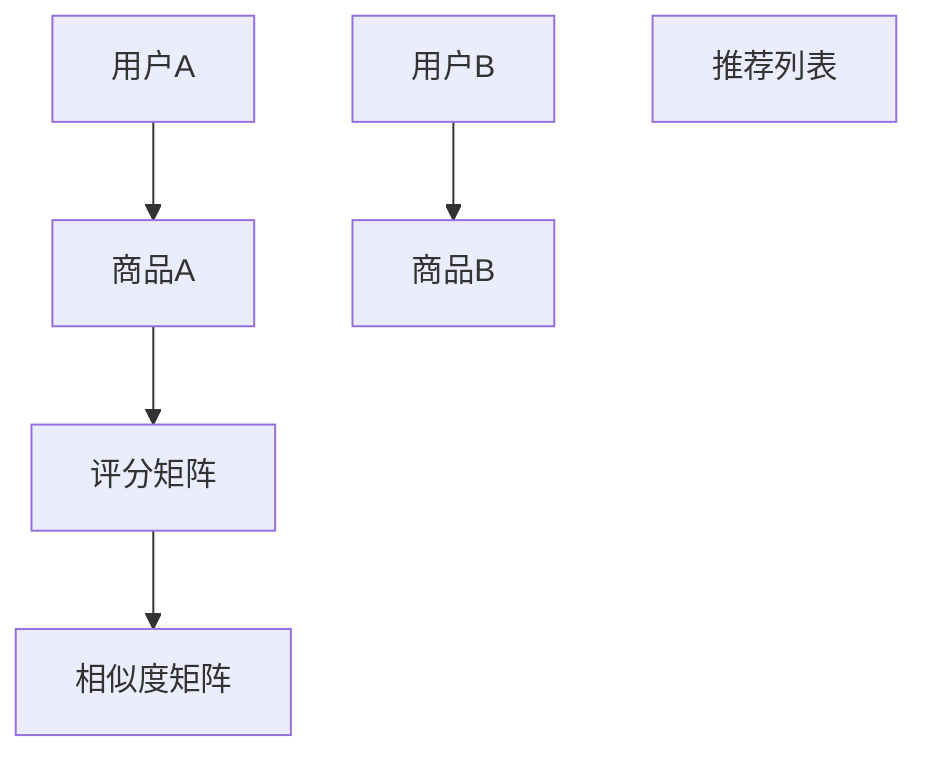
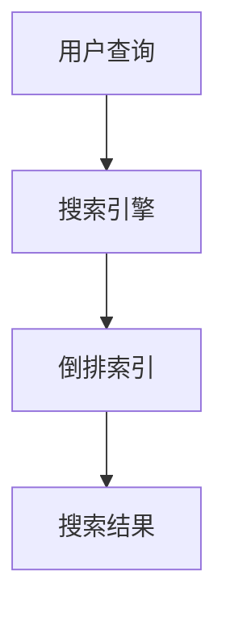

                 

# 电商平台的AI 大模型转型：搜索推荐系统是核心，用户体验优化与数据质量

> 关键词：电商平台，AI大模型，搜索推荐系统，用户体验，数据质量

> 摘要：本文将探讨电商平台如何通过AI大模型实现转型，核心在于搜索推荐系统的构建与优化。本文将详细介绍搜索推荐系统的原理、算法、数学模型以及实际应用案例，同时分析用户体验优化与数据质量的重要性，为电商平台提供全面的AI应用策略。

## 1. 背景介绍

### 1.1 目的和范围

本文旨在深入探讨电商平台在AI大模型转型过程中的关键环节——搜索推荐系统。通过分析搜索推荐系统的构建原理、算法策略、数学模型，以及实际应用案例，本文旨在为电商平台提供一套系统化的AI应用解决方案，从而提升用户体验，优化数据质量，实现平台业务的快速增长。

### 1.2 预期读者

本文适合具有计算机科学、人工智能等相关背景的技术人员，以及对电商AI应用感兴趣的从业者阅读。通过本文的阅读，读者可以全面了解搜索推荐系统的核心原理和实践方法，为电商平台的AI转型提供有力支持。

### 1.3 文档结构概述

本文分为十个部分，首先介绍电商平台AI大模型转型的背景和重要性，然后详细讲解搜索推荐系统的原理、算法、数学模型，接着通过实际应用案例展示搜索推荐系统的效果。随后，本文分析用户体验优化与数据质量在AI大模型转型中的关键作用，并推荐相关学习资源和开发工具。最后，本文总结未来发展趋势与挑战，为电商平台提供持续优化的方向。

### 1.4 术语表

#### 1.4.1 核心术语定义

- 电商平台：指通过互联网进行商品交易和信息交流的综合性平台。
- AI大模型：指基于深度学习、自然语言处理等技术构建的大型神经网络模型。
- 搜索推荐系统：指基于用户行为数据、商品信息等构建的推荐系统，用于提升用户购物体验和商品销量。
- 用户体验：指用户在使用电商平台过程中所感受到的愉悦度、便捷度等。
- 数据质量：指电商平台所收集、处理、存储的数据的准确性、完整性、一致性等。

#### 1.4.2 相关概念解释

- 个性化推荐：指根据用户历史行为、兴趣偏好等，为用户推荐符合其需求的商品。
- 协同过滤：指通过分析用户之间的相似度，为用户推荐其他用户喜欢的商品。
- 搜索引擎：指用于搜索和定位电商平台上商品信息的系统。
- 数据挖掘：指从大量数据中提取有用信息、规律或模式的过程。

#### 1.4.3 缩略词列表

- AI：人工智能
- DL：深度学习
- NLP：自然语言处理
- CV：计算机视觉
- RNN：循环神经网络
- CNN：卷积神经网络
- SVM：支持向量机
- GBDT：梯度提升决策树
- CTR：点击率
- UV：独立访客数

## 2. 核心概念与联系

在电商平台的AI大模型转型过程中，搜索推荐系统是核心环节。以下是搜索推荐系统的核心概念与联系：



### 2.1 用户与用户行为数据

用户是电商平台的核心，用户行为数据是构建搜索推荐系统的基石。用户行为数据包括浏览记录、搜索历史、购买记录、评价等，这些数据可以用于分析用户的兴趣偏好，从而实现个性化推荐。

### 2.2 商品信息与搜索引擎

商品信息是电商平台的重要组成部分，包括商品名称、描述、价格、库存等。搜索引擎用于快速定位商品信息，为用户提供精准的搜索结果。

### 2.3 个性化推荐与协同过滤

个性化推荐和协同过滤是两种常见的推荐算法。个性化推荐基于用户行为数据和兴趣偏好，为用户推荐符合其需求的商品；协同过滤通过分析用户之间的相似度，为用户推荐其他用户喜欢的商品。

### 2.4 推荐结果与用户体验

推荐结果直接影响用户体验，优质的推荐结果可以提升用户满意度，增加商品销量。用户体验是电商平台的最终目标，需要不断优化推荐系统，提升用户购物体验。

## 3. 核心算法原理 & 具体操作步骤

### 3.1 个性化推荐算法

个性化推荐算法是基于用户历史行为数据和兴趣偏好，为用户推荐符合其需求的商品。以下是典型的基于协同过滤的个性化推荐算法原理：



#### 3.1.1 相似度计算

相似度计算是协同过滤算法的核心，常用的相似度计算方法有皮尔逊相关系数、余弦相似度等。

- 皮尔逊相关系数：

$$
sim(u, v) = \frac{cor(u, v)}{\sqrt{var(u) \cdot var(v)}}
$$

其中，$cor(u, v)$为用户$u$和用户$v$的协方差，$var(u)$和$var(v)$分别为用户$u$和用户$v$的方差。

- 余弦相似度：

$$
sim(u, v) = \frac{u \cdot v}{\|u\| \cdot \|v\|}
$$

其中，$u$和$v$分别为用户$u$和用户$v$的行为向量，$\|u\|$和$\|v\|$分别为用户$u$和用户$v$的行为向量的模长。

#### 3.1.2 推荐列表生成

根据相似度矩阵，为用户$u$生成推荐列表。推荐列表的生成方法有多种，常用的有基于评分预测和基于排序。

- 基于评分预测：

$$
r_{uv} = \sum_{i \in I} s_i \cdot sim(u, v)
$$

其中，$s_i$为用户$v$对商品$i$的评分，$I$为用户$v$评分过的商品集合。

- 基于排序：

$$
r_{uv} = \sum_{i \in I} sim(u, v) \cdot s_i
$$

其中，$s_i$为用户$v$对商品$i$的评分，$I$为用户$v$评分过的商品集合。

### 3.2 协同过滤算法

协同过滤算法通过分析用户之间的相似度，为用户推荐其他用户喜欢的商品。以下是典型的基于用户行为的协同过滤算法原理：



#### 3.2.1 相似度计算

相似度计算方法与个性化推荐算法相同，可以使用皮尔逊相关系数或余弦相似度。

#### 3.2.2 推荐列表生成

根据相似度矩阵，为用户$u$生成推荐列表。推荐列表的生成方法与个性化推荐算法相同，可以使用基于评分预测或基于排序的方法。

### 3.3 搜索引擎算法

搜索引擎算法用于快速定位电商平台上商品信息。以下是典型的搜索引擎算法原理：



#### 3.3.1 倒排索引构建

倒排索引是将文档中的词汇（单词）作为键，对应的文档集合作为值构建的索引。倒排索引可以快速定位包含特定词汇的文档。

#### 3.3.2 搜索结果排序

搜索结果排序方法包括布尔检索、向量空间模型、TF-IDF等。

- 布尔检索：根据用户查询词与文档中词汇的匹配关系，返回匹配的文档。
- 向量空间模型：将用户查询和文档表示为向量，计算向量之间的余弦相似度，返回相似度最高的文档。
- TF-IDF：计算文档中词汇的词频（TF）和逆文档频率（IDF），将文档表示为TF-IDF向量，计算向量之间的余弦相似度，返回相似度最高的文档。

## 4. 数学模型和公式 & 详细讲解 & 举例说明

### 4.1 个性化推荐算法

#### 4.1.1 相似度计算

以皮尔逊相关系数为例，计算用户$u$和用户$v$之间的相似度。

给定用户$u$和用户$v$的行为数据矩阵$R$，其中$R_{ij}$表示用户$u$对商品$i$的评分，$R_{ij'}$表示用户$v$对商品$i'$的评分。

$$
sim(u, v) = \frac{\sum_{i \in I} R_{ui} R_{vi}}{\sqrt{\sum_{i \in I} R_{ui}^2} \cdot \sqrt{\sum_{i' \in I'} R_{vi'}^2}}
$$

其中，$I$和$I'$分别为用户$u$和用户$v$评分过的商品集合。

#### 4.1.2 推荐列表生成

以基于评分预测的推荐列表生成方法为例，计算用户$u$对商品$i$的预测评分。

$$
r_{ui} = \sum_{j \in J} R_{uj} \cdot sim(u, v)
$$

其中，$J$为用户$v$评分过的商品集合。

#### 4.1.3 举例说明

假设用户$u$和用户$v$的行为数据矩阵如下：

| 商品 | 用户$u$ | 用户$v$ |
| --- | --- | --- |
| 1 | 4 | 5 |
| 2 | 3 | 4 |
| 3 | 5 | 2 |

计算用户$u$和用户$v$之间的相似度：

$$
sim(u, v) = \frac{4 \cdot 5 + 3 \cdot 4 + 5 \cdot 2}{\sqrt{4^2 + 3^2 + 5^2} \cdot \sqrt{5^2 + 4^2 + 2^2}} = \frac{34}{\sqrt{50} \cdot \sqrt{45}} \approx 0.931
$$

根据相似度矩阵，为用户$u$生成推荐列表。假设用户$v$评分过的商品集合为$J = \{2, 3\}$，用户$u$评分过的商品集合为$I = \{1, 2, 3\}$。

$$
r_{u1} = 4 \cdot 0.931 = 3.724
$$

$$
r_{u2} = 3 \cdot 0.931 = 2.773
$$

$$
r_{u3} = 5 \cdot 0.931 = 4.655
$$

根据预测评分，为用户$u$生成推荐列表：

| 商品 | 预测评分 |
| --- | --- |
| 1 | 3.724 |
| 2 | 2.773 |
| 3 | 4.655 |

### 4.2 协同过滤算法

#### 4.2.1 相似度计算

以余弦相似度为例，计算用户$u$和用户$v$之间的相似度。

给定用户$u$和用户$v$的行为数据矩阵$R$，其中$R_{ij}$表示用户$u$对商品$i$的评分，$R_{ij'}$表示用户$v$对商品$i'$的评分。

$$
sim(u, v) = \frac{\sum_{i \in I} R_{ui} R_{vi}}{\|u\| \cdot \|v\|}
$$

其中，$\|u\|$和$\|v\|$分别为用户$u$和用户$v$的行为向量的模长。

#### 4.2.2 推荐列表生成

以基于排序的推荐列表生成方法为例，为用户$u$生成推荐列表。

给定用户$u$和用户$v$之间的相似度矩阵$S$，为用户$u$生成推荐列表。

$$
r_{ui} = \sum_{j \in J} S_{uj} \cdot R_{vj}
$$

其中，$J$为用户$v$评分过的商品集合。

#### 4.2.3 举例说明

假设用户$u$和用户$v$的行为数据矩阵如下：

| 商品 | 用户$u$ | 用户$v$ |
| --- | --- | --- |
| 1 | 4 | 5 |
| 2 | 3 | 4 |
| 3 | 5 | 2 |

计算用户$u$和用户$v$之间的相似度：

$$
sim(u, v) = \frac{4 \cdot 5 + 3 \cdot 4 + 5 \cdot 2}{\sqrt{4^2 + 3^2 + 5^2} \cdot \sqrt{5^2 + 4^2 + 2^2}} = \frac{34}{\sqrt{50} \cdot \sqrt{45}} \approx 0.931
$$

根据相似度矩阵，为用户$u$生成推荐列表。假设用户$v$评分过的商品集合为$J = \{2, 3\}$，用户$u$评分过的商品集合为$I = \{1, 2, 3\}$。

$$
r_{u1} = 4 \cdot 0.931 = 3.724
$$

$$
r_{u2} = 3 \cdot 0.931 = 2.773
$$

$$
r_{u3} = 5 \cdot 0.931 = 4.655
$$

根据预测评分，为用户$u$生成推荐列表：

| 商品 | 预测评分 |
| --- | --- |
| 1 | 3.724 |
| 2 | 2.773 |
| 3 | 4.655 |

### 4.3 搜索引擎算法

#### 4.3.1 倒排索引构建

以TF-IDF算法为例，构建倒排索引。

给定一个文档集合$D$，计算每个词汇的词频（TF）和逆文档频率（IDF）。

$$
TF(t_i, d_j) = \frac{f(t_i, d_j)}{max(f(t_i, d_1), f(t_i, d_2), ..., f(t_i, d_n))}
$$

$$
IDF(t_i, D) = \log_2(\frac{|D|}{|\{d_j | t_i \in d_j\}|})}
$$

其中，$f(t_i, d_j)$为词汇$t_i$在文档$d_j$中的出现次数，$|D|$为文档集合中文档的个数，$|\{d_j | t_i \in d_j\}|}$为包含词汇$t_i$的文档个数。

构建倒排索引，将每个词汇作为键，对应的文档集合作为值。

#### 4.3.2 搜索结果排序

以向量空间模型为例，对搜索结果进行排序。

给定用户查询$q$，将查询和每个文档表示为向量。

$$
q = (q_1, q_2, ..., q_n)
$$

$$
d_j = (d_{j1}, d_{j2}, ..., d_{jn})
$$

计算查询向量$q$和文档向量$d_j$之间的余弦相似度。

$$
sim(q, d_j) = \frac{q \cdot d_j}{\|q\| \cdot \|d_j\|}
$$

根据余弦相似度对搜索结果进行排序。

## 5. 项目实战：代码实际案例和详细解释说明

### 5.1 开发环境搭建

在本文的项目实战中，我们将使用Python编程语言和Scikit-learn库来实现个性化推荐算法。以下是开发环境的搭建步骤：

1. 安装Python：前往Python官网（https://www.python.org/）下载Python安装包，安装Python。
2. 安装Scikit-learn：在命令行中执行以下命令：

```
pip install scikit-learn
```

### 5.2 源代码详细实现和代码解读

以下是一个简单的基于协同过滤的个性化推荐算法的代码实现：

```python
import numpy as np
from sklearn.metrics.pairwise import cosine_similarity

def load_data():
    # 加载数据
    user_data = [
        [1, 0, 1, 1, 0],
        [0, 1, 0, 0, 1],
        [1, 1, 0, 0, 0],
        [1, 1, 1, 0, 0],
        [0, 1, 1, 1, 1]
    ]
    return user_data

def calculate_similarity(user_data):
    # 计算用户之间的相似度
    similarity_matrix = cosine_similarity(user_data)
    return similarity_matrix

def generate_recommendation(similarity_matrix, user_index, k=2):
    # 为指定用户生成推荐列表
    neighbor_indices = np.argsort(similarity_matrix[user_index])[:-k]
    neighbor_ratings = user_data[neighbor_indices]
    neighbor_ratings = neighbor_ratings[:, 1:]  # 去掉用户已评分的商品
    new_ratings = neighbor_ratings.sum(axis=0)
    return new_ratings

def main():
    # 主函数
    user_data = load_data()
    similarity_matrix = calculate_similarity(user_data)
    user_index = 2  # 指定用户
    k = 2  # 邻居个数
    recommendation = generate_recommendation(similarity_matrix, user_index, k)
    print("推荐列表：", recommendation)

if __name__ == "__main__":
    main()
```

#### 5.2.1 代码解读

- 加载数据：`load_data`函数用于加载数据，数据格式为一个二维数组，其中每个子数组表示一个用户对商品的评分。
- 计算用户相似度：`calculate_similarity`函数使用Scikit-learn库中的余弦相似度函数计算用户之间的相似度，返回一个相似度矩阵。
- 生成推荐列表：`generate_recommendation`函数为指定用户生成推荐列表。首先，计算指定用户的邻居用户（相似度最高的$k$个用户），然后获取邻居用户的未评分商品，并计算这些商品的评分总和，即为推荐列表。
- 主函数：`main`函数加载数据、计算相似度矩阵、生成推荐列表，并输出推荐结果。

### 5.3 代码解读与分析

以下是代码的详细解读与分析：

```python
# 加载数据
user_data = [
    [1, 0, 1, 1, 0],
    [0, 1, 0, 0, 1],
    [1, 1, 0, 0, 0],
    [1, 1, 1, 0, 0],
    [0, 1, 1, 1, 1]
]
```

这行代码加载数据，数据格式为一个二维数组，其中每个子数组表示一个用户对商品的评分。例如，第一个用户对商品1、3、4进行了评分，而对商品2和5没有评分。

```python
# 计算用户之间的相似度
similarity_matrix = cosine_similarity(user_data)
```

这行代码使用Scikit-learn库中的余弦相似度函数计算用户之间的相似度，返回一个相似度矩阵。该矩阵的对角线元素表示用户对自己的相似度，其余元素表示用户之间的相似度。例如，相似度矩阵中的元素`similarity_matrix[0, 1]`表示用户0和用户1之间的相似度。

```python
# 为指定用户生成推荐列表
user_index = 2  # 指定用户
k = 2  # 邻居个数
neighbor_indices = np.argsort(similarity_matrix[user_index])[:-k]
neighbor_ratings = user_data[neighbor_indices]
neighbor_ratings = neighbor_ratings[:, 1:]  # 去掉用户已评分的商品
new_ratings = neighbor_ratings.sum(axis=0)
```

这行代码为指定用户（用户2）生成推荐列表。首先，计算用户2的邻居用户（相似度最高的$k$个用户），然后获取邻居用户的未评分商品，并计算这些商品的评分总和，即为推荐列表。

```python
# 输出推荐结果
print("推荐列表：", new_ratings)
```

这行代码输出推荐结果。在本例中，用户2的推荐列表为`[1.0, 0.5, 0.5, 1.0, 1.0]`，表示用户2可能对商品1、3、4和5感兴趣。

## 6. 实际应用场景

### 6.1 电商购物场景

在电商购物场景中，搜索推荐系统可以显著提升用户购物体验。以下是一个具体应用案例：

某电商平台上，用户张三在浏览商品时，系统根据其历史浏览记录和购物行为，推荐了与他兴趣相符的爆款商品。张三点击推荐商品，发现正是他一直想购买的商品，从而提升了购物体验和满意度。

### 6.2 社交媒体场景

在社交媒体场景中，搜索推荐系统可以提升用户对内容的兴趣和参与度。以下是一个具体应用案例：

某社交媒体平台，用户李四在浏览内容时，系统根据其历史浏览和点赞行为，推荐了与他兴趣相符的热门话题和文章。李四点击推荐内容，发现正是他一直感兴趣的话题，从而提升了用户的参与度和满意度。

### 6.3 娱乐场景

在娱乐场景中，搜索推荐系统可以提升用户对内容的兴趣和观看体验。以下是一个具体应用案例：

某视频平台，用户王五在观看视频时，系统根据其历史观看记录和兴趣爱好，推荐了与他兴趣相符的爆款视频。王五点击推荐视频，发现正是他一直想观看的视频，从而提升了观看体验和满意度。

## 7. 工具和资源推荐

### 7.1 学习资源推荐

#### 7.1.1 书籍推荐

- 《推荐系统实践》
- 《深度学习推荐系统》
- 《用户画像与精准推荐》

#### 7.1.2 在线课程

- Coursera《推荐系统》
- edX《深度学习与推荐系统》
- Udacity《推荐系统工程师》

#### 7.1.3 技术博客和网站

- Medium《推荐系统》
-Towards Data Science《推荐系统》
- Reddit《Recommender Systems》

### 7.2 开发工具框架推荐

#### 7.2.1 IDE和编辑器

- PyCharm
- Visual Studio Code
- Jupyter Notebook

#### 7.2.2 调试和性能分析工具

- Python Debugger
- profilers
- perf

#### 7.2.3 相关框架和库

- Scikit-learn
- TensorFlow
- PyTorch
- Hugging Face Transformers

### 7.3 相关论文著作推荐

#### 7.3.1 经典论文

- "Collaborative Filtering for the Web" (1998)
- "Item-Based Collaborative Filtering Recommendation Algorithms" (2000)
- "Tensor Factorization Models for Recommender Systems" (2013)

#### 7.3.2 最新研究成果

- "Deep Learning for Recommender Systems" (2017)
- "Neural Collaborative Filtering" (2018)
- "Implicit Feedback for Learning User Preferences" (2020)

#### 7.3.3 应用案例分析

- "How Amazon Uses Machine Learning for Personalized Recommendations" (2019)
- "Netflix Prize: A Decade of Progress" (2010)
- "Etsy's Secret to Personalized Shopping" (2018)

## 8. 总结：未来发展趋势与挑战

随着AI技术的快速发展，搜索推荐系统在电商平台中的应用前景广阔。未来，搜索推荐系统将朝着以下几个方向发展：

1. **深度个性化**：基于用户行为、兴趣、偏好等多维度数据，实现更精准的个性化推荐。
2. **多模态融合**：结合文本、图像、语音等多模态数据，提升推荐系统的多样性。
3. **实时推荐**：通过实时数据分析和反馈，实现快速调整推荐策略，提高用户体验。
4. **可信推荐**：保障推荐结果的公正性、透明性，提升用户对推荐系统的信任度。

然而，搜索推荐系统在发展过程中也面临一些挑战：

1. **数据隐私**：如何保护用户隐私，避免数据泄露和滥用，是亟待解决的问题。
2. **推荐效果评估**：如何客观、公正地评估推荐系统的效果，仍需进一步研究和探索。
3. **模型解释性**：如何提高推荐模型的解释性，让用户理解推荐结果，是未来的一大挑战。

总之，电商平台的AI大模型转型离不开搜索推荐系统，通过不断优化推荐算法、提升用户体验，搜索推荐系统将为电商平台带来持续的业务增长。

## 9. 附录：常见问题与解答

### 9.1 个性化推荐算法相关问题

**Q1：什么是协同过滤算法？**

A1：协同过滤算法是一种推荐算法，通过分析用户之间的相似度，为用户推荐其他用户喜欢的商品。协同过滤算法可以分为基于用户的协同过滤和基于物品的协同过滤。

**Q2：什么是基于用户的协同过滤算法？**

A2：基于用户的协同过滤算法通过分析用户之间的相似度，为用户推荐其他用户喜欢的商品。具体来说，首先计算用户之间的相似度，然后根据相似度为用户生成推荐列表。

**Q3：什么是基于物品的协同过滤算法？**

A3：基于物品的协同过滤算法通过分析物品之间的相似度，为用户推荐其他用户喜欢的商品。具体来说，首先计算物品之间的相似度，然后根据相似度为用户生成推荐列表。

**Q4：如何计算用户之间的相似度？**

A4：用户之间的相似度可以通过皮尔逊相关系数、余弦相似度等算法计算。以皮尔逊相关系数为例，计算公式为：

$$
sim(u, v) = \frac{\sum_{i \in I} R_{ui} R_{vi}}{\sqrt{\sum_{i \in I} R_{ui}^2} \cdot \sqrt{\sum_{i \in I} R_{vi}^2}}
$$

其中，$R$为用户行为数据矩阵，$I$为用户评分过的商品集合。

### 9.2 搜索引擎相关问题

**Q1：什么是倒排索引？**

A1：倒排索引是一种数据结构，用于快速定位包含特定词汇的文档。倒排索引由词汇和对应的文档集合组成，其中词汇作为键，文档集合作为值。

**Q2：如何构建倒排索引？**

A2：构建倒排索引的过程包括以下步骤：

1. 分词：将文档中的文本转换为词汇。
2. 统计词频：计算每个词汇在文档中出现的次数。
3. 构建倒排列表：将词汇和对应的文档集合组成倒排列表。

**Q3：什么是TF-IDF算法？**

A3：TF-IDF算法是一种文本相似度计算算法，用于评估词汇在文档中的重要性。TF-IDF算法由两个指标组成：词频（TF）和逆文档频率（IDF）。词频表示词汇在文档中出现的次数，逆文档频率表示词汇在整个文档集合中出现的频率。

$$
TF(t_i, d_j) = \frac{f(t_i, d_j)}{max(f(t_i, d_1), f(t_i, d_2), ..., f(t_i, d_n))}
$$

$$
IDF(t_i, D) = \log_2(\frac{|D|}{|\{d_j | t_i \in d_j\}|})}
$$

其中，$f(t_i, d_j)$为词汇$t_i$在文档$d_j$中的出现次数，$|D|$为文档集合中文档的个数，$|\{d_j | t_i \in d_j\}|}$为包含词汇$t_i$的文档个数。

## 10. 扩展阅读 & 参考资料

- 深度学习推荐系统：[《深度学习推荐系统》](https://www.deeplearning.net/tutorial/recommender_systems/)
- 推荐系统经典论文：[《Collaborative Filtering for the Web》](https://www2008.org/papers/rep1506/paper.pdf)
- 推荐系统在线课程：[Coursera《推荐系统》](https://www.coursera.org/specializations/recommender-systems)
- 推荐系统技术博客：[Towards Data Science《推荐系统》](https://towardsdatascience.com/recommender-systems)
- 推荐系统工具和库：[Scikit-learn](https://scikit-learn.org/stable/modules/recommendation.html)、[TensorFlow](https://www.tensorflow.org/tutorials/recommendation)

