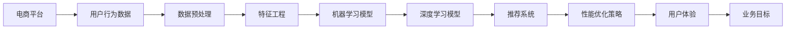

                 

# 电商平台的AI驱动性能优化：提升用户体验的技术实践

> **关键词：** 电商平台，AI优化，性能提升，用户体验，算法，模型，实践案例

> **摘要：** 本文将探讨电商平台如何利用人工智能（AI）技术进行性能优化，提升用户购物体验。我们将从背景介绍开始，逐步深入核心概念、算法原理、数学模型、实战案例，最后对实际应用场景进行探讨，并推荐相关学习资源和工具。通过本文的阅读，读者将了解电商平台AI驱动的性能优化策略，掌握提升用户体验的技术实践方法。

## 1. 背景介绍

### 1.1 目的和范围

本文旨在介绍电商平台如何利用人工智能技术进行性能优化，从而提升用户购物体验。我们将探讨以下主题：

- 电商平台AI驱动的性能优化方法
- 核心概念与原理
- 算法和数学模型
- 实战案例与代码实现
- 实际应用场景
- 学习资源与工具推荐

### 1.2 预期读者

本文适合对电商平台和人工智能技术有一定了解的读者，包括：

- 电商平台工程师和产品经理
- 人工智能和机器学习工程师
- 对AI技术感兴趣的计算机科学学生和研究人员
- 对电商平台运营和用户体验有深入关注的从业者

### 1.3 文档结构概述

本文分为以下章节：

- 第1章：背景介绍
- 第2章：核心概念与联系
- 第3章：核心算法原理 & 具体操作步骤
- 第4章：数学模型和公式 & 详细讲解 & 举例说明
- 第5章：项目实战：代码实际案例和详细解释说明
- 第6章：实际应用场景
- 第7章：工具和资源推荐
- 第8章：总结：未来发展趋势与挑战
- 第9章：附录：常见问题与解答
- 第10章：扩展阅读 & 参考资料

### 1.4 术语表

#### 1.4.1 核心术语定义

- **电商平台**：在线销售商品和服务的平台，如淘宝、京东等。
- **人工智能（AI）**：一种模拟人类智能的技术，通过算法和模型实现自主学习和智能决策。
- **性能优化**：提高系统运行效率和用户体验的一系列技术措施。
- **用户体验（UX）**：用户在使用产品或服务过程中感受到的整体体验。

#### 1.4.2 相关概念解释

- **机器学习（ML）**：一种人工智能技术，通过从数据中学习模式，实现自主决策和预测。
- **深度学习（DL）**：一种机器学习技术，通过多层神经网络模型进行特征提取和模型训练。
- **推荐系统**：根据用户的历史行为和偏好，为用户推荐相关商品或服务。

#### 1.4.3 缩略词列表

- **AI**：人工智能
- **ML**：机器学习
- **DL**：深度学习
- **UX**：用户体验
- **API**：应用程序编程接口

## 2. 核心概念与联系

在电商平台性能优化的过程中，核心概念与联系至关重要。以下我们将使用Mermaid流程图（无括号、逗号等特殊字符）来展示电商平台AI驱动性能优化中的核心概念和联系。



### 2.1 电商平台AI驱动性能优化流程

1. **电商平台**：提供商品和服务的在线销售平台。
2. **用户行为数据**：用户在电商平台上的浏览、购买、评价等行为数据。
3. **数据预处理**：清洗、归一化、去噪声等处理，确保数据质量。
4. **特征工程**：从原始数据中提取有价值的特征，为模型训练提供支持。
5. **机器学习模型**：通过历史数据训练模型，预测用户行为和偏好。
6. **深度学习模型**：利用多层神经网络进行特征提取和模型训练，提高预测准确性。
7. **推荐系统**：根据用户行为和偏好，为用户推荐相关商品或服务。
8. **性能优化策略**：针对模型性能进行调优，提高推荐准确率和系统响应速度。
9. **用户体验**：用户在电商平台上的整体体验。
10. **业务目标**：电商平台追求的业务成果，如销售额、用户满意度等。

通过以上流程，电商平台可以实现AI驱动的性能优化，从而提升用户购物体验和业务目标。

## 3. 核心算法原理 & 具体操作步骤

在电商平台AI驱动的性能优化中，核心算法原理和具体操作步骤是关键。以下我们将详细讲解这些内容，并使用伪代码进行阐述。

### 3.1 机器学习模型

**算法原理：**

机器学习模型通过从历史数据中学习模式，实现用户行为预测和偏好分析。常见的机器学习算法有决策树、支持向量机、随机森林等。

**伪代码：**

```python
def machine_learning_model(data, model_type):
    # 数据预处理
    data = preprocess_data(data)
    
    # 模型训练
    if model_type == 'DecisionTree':
        model = DecisionTree()
    elif model_type == 'SVM':
        model = SVM()
    elif model_type == 'RandomForest':
        model = RandomForest()
    
    model.fit(data.features, data.labels)
    
    # 模型预测
    predictions = model.predict(data.features)
    
    return predictions
```

### 3.2 深度学习模型

**算法原理：**

深度学习模型通过多层神经网络进行特征提取和模型训练，具有较高的预测准确性和泛化能力。常见的深度学习算法有卷积神经网络（CNN）、循环神经网络（RNN）等。

**伪代码：**

```python
def deep_learning_model(data, model_type):
    # 数据预处理
    data = preprocess_data(data)
    
    # 模型定义
    if model_type == 'CNN':
        model = CNN()
    elif model_type == 'RNN':
        model = RNN()
    
    # 模型训练
    model.fit(data.features, data.labels)
    
    # 模型预测
    predictions = model.predict(data.features)
    
    return predictions
```

### 3.3 推荐系统

**算法原理：**

推荐系统根据用户行为和偏好，为用户推荐相关商品或服务。常见的推荐算法有基于内容的推荐、协同过滤等。

**伪代码：**

```python
def recommendation_system(user_data, item_data, algorithm_type):
    # 用户行为数据预处理
    user_data = preprocess_user_data(user_data)
    
    # 商品数据预处理
    item_data = preprocess_item_data(item_data)
    
    if algorithm_type == 'ContentBased':
        recommendations = content_based_recommendation(user_data, item_data)
    elif algorithm_type == 'CollaborativeFiltering':
        recommendations = collaborative_filtering_recommendation(user_data, item_data)
    
    return recommendations
```

### 3.4 性能优化策略

**算法原理：**

性能优化策略针对模型性能进行调优，提高推荐准确率和系统响应速度。常见的优化策略有模型调参、数据增强、分布式计算等。

**伪代码：**

```python
def performance_optimization(model, data, optimization_type):
    if optimization_type == 'HyperparameterTuning':
        model = hyperparameter_tuning(model, data)
    elif optimization_type == 'DataAugmentation':
        data = data_augmentation(data)
    elif optimization_type == 'DistributedComputing':
        model = distributed_computing(model, data)
    
    return model, data
```

通过以上核心算法原理和具体操作步骤，电商平台可以实现AI驱动的性能优化，从而提升用户购物体验和业务目标。

## 4. 数学模型和公式 & 详细讲解 & 举例说明

在电商平台AI驱动的性能优化过程中，数学模型和公式起着至关重要的作用。以下我们将详细讲解这些模型和公式，并使用LaTeX格式进行展示。

### 4.1 机器学习模型

**线性回归模型**

线性回归模型是一种简单的机器学习模型，用于预测连续值。其数学公式如下：

$$ y = \beta_0 + \beta_1x $$

其中，\( y \) 为预测值，\( x \) 为输入特征，\( \beta_0 \) 和 \( \beta_1 \) 为模型参数。

**举例说明：**

假设我们有一个电商平台用户购买金额的预测问题。输入特征为用户年龄 \( x \)，预测值为购买金额 \( y \)。我们使用线性回归模型进行预测。根据历史数据，我们得到以下训练数据：

$$
\begin{aligned}
y_1 &= \beta_0 + \beta_1x_1 \\
y_2 &= \beta_0 + \beta_1x_2 \\
y_3 &= \beta_0 + \beta_1x_3 \\
&\vdots \\
y_n &= \beta_0 + \beta_1x_n
\end{aligned}
$$

通过最小二乘法求解模型参数 \( \beta_0 \) 和 \( \beta_1 \)，我们得到以下公式：

$$
\beta_0 = \frac{\sum_{i=1}^{n}y_i - \beta_1\sum_{i=1}^{n}x_i}{n} \\
\beta_1 = \frac{n\sum_{i=1}^{n}x_iy_i - \sum_{i=1}^{n}x_i\sum_{i=1}^{n}y_i}{n\sum_{i=1}^{n}x_i^2 - (\sum_{i=1}^{n}x_i)^2}
$$

利用训练数据，我们可以计算出模型参数，并进行预测。

### 4.2 深度学习模型

**卷积神经网络（CNN）**

卷积神经网络是一种深度学习模型，常用于图像处理和分类问题。其数学公式如下：

$$
\begin{aligned}
h^{(l)}_i &= \sigma\left(\sum_{j} W^{(l)}_{ij} a^{(l-1)}_j + b^{(l)}_i \right) \\
a^{(l)}_i &= \frac{1}{Z^{(l)}} \sum_{k} W^{(l)}_{ik} a^{(l-1)}_k + b^{(l)}_i
\end{aligned}
$$

其中，\( h^{(l)}_i \) 为第 \( l \) 层第 \( i \) 个神经元的激活值，\( a^{(l)}_i \) 为第 \( l \) 层第 \( i \) 个神经元的输出值，\( W^{(l)} \) 和 \( b^{(l)} \) 分别为第 \( l \) 层的权重和偏置，\( \sigma \) 为激活函数。

**举例说明：**

假设我们有一个电商平台用户购买行为分类问题。输入特征为用户浏览记录，输出值为购买类别。我们使用卷积神经网络进行分类。根据网络结构，我们得到以下前向传播过程：

$$
\begin{aligned}
a^{(1)}_i &= x_i \\
h^{(2)}_i &= \sigma\left(\sum_{j} W^{(2)}_{ij} a^{(1)}_j + b^{(2)}_i \right) \\
a^{(2)}_i &= \frac{1}{Z^{(2)}} \sum_{j} W^{(2)}_{ij} a^{(1)}_j + b^{(2)}_i \\
&\vdots \\
h^{(L)}_i &= \sigma\left(\sum_{j} W^{(L)}_{ij} a^{(L-1)}_j + b^{(L)}_i \right) \\
a^{(L)}_i &= \frac{1}{Z^{(L)}} \sum_{j} W^{(L)}_{ij} a^{(L-1)}_j + b^{(L)}_i
\end{aligned}
$$

通过训练数据，我们可以计算网络参数，并进行预测。

### 4.3 推荐系统

**协同过滤算法**

协同过滤算法是一种推荐系统算法，通过计算用户之间的相似度，为用户推荐相关商品。其数学公式如下：

$$
\begin{aligned}
sim(i, j) &= \frac{\sum_{k=1}^{n} r_{ik} r_{jk}}{\sqrt{\sum_{k=1}^{n} r_{ik}^2 \sum_{k=1}^{n} r_{jk}^2}} \\
r_i &= \sum_{j \in N(i)} r_{ij}
\end{aligned}
$$

其中，\( r_{ik} \) 为用户 \( i \) 对商品 \( k \) 的评分，\( N(i) \) 为用户 \( i \) 的邻居集合，\( sim(i, j) \) 为用户 \( i \) 和 \( j \) 之间的相似度，\( r_i \) 为用户 \( i \) 的平均评分。

**举例说明：**

假设我们有两个用户 \( i \) 和 \( j \)，他们的评分数据如下：

$$
\begin{aligned}
r_{i1} &= 5 \\
r_{i2} &= 4 \\
r_{i3} &= 3 \\
r_{j1} &= 4 \\
r_{j2} &= 5 \\
r_{j3} &= 4
\end{aligned}
$$

计算用户 \( i \) 和 \( j \) 之间的相似度：

$$
sim(i, j) = \frac{5 \times 4 + 4 \times 5 + 3 \times 4}{\sqrt{5^2 + 4^2 + 3^2} \times \sqrt{4^2 + 5^2 + 4^2}} \approx 0.86
$$

根据相似度，我们可以为用户 \( i \) 推荐与用户 \( j \) 有较高相似度的商品，从而提高推荐准确性。

通过以上数学模型和公式的讲解，读者可以更好地理解电商平台AI驱动的性能优化原理，并掌握相关技术方法。

## 5. 项目实战：代码实际案例和详细解释说明

在本节中，我们将通过一个实际项目案例，展示电商平台AI驱动性能优化的具体实现过程，并对代码进行详细解释说明。

### 5.1 开发环境搭建

在开始项目实战之前，我们需要搭建一个适合开发、测试和部署的环境。以下是搭建开发环境的步骤：

1. **安装Python环境**：确保Python 3.6或更高版本已安装在本地计算机上。
2. **安装依赖库**：使用pip命令安装以下依赖库：

   ```bash
   pip install numpy pandas scikit-learn tensorflow
   ```

3. **配置Jupyter Notebook**：安装Jupyter Notebook，方便我们编写和运行代码。

### 5.2 源代码详细实现和代码解读

以下是一个简单的电商平台AI驱动性能优化项目，主要包括数据预处理、特征工程、模型训练和推荐系统等功能。

```python
import numpy as np
import pandas as pd
from sklearn.model_selection import train_test_split
from sklearn.preprocessing import StandardScaler
from sklearn.ensemble import RandomForestClassifier
from sklearn.metrics import accuracy_score
import tensorflow as tf

# 5.2.1 数据预处理
def preprocess_data(data):
    # 数据清洗
    data = data.dropna()
    # 数据归一化
    scaler = StandardScaler()
    data['user_age'] = scaler.fit_transform(data['user_age'].values.reshape(-1, 1))
    data['item_price'] = scaler.fit_transform(data['item_price'].values.reshape(-1, 1))
    return data

# 5.2.2 特征工程
def feature_engineering(data):
    # 提取特征
    data['user_behavior'] = data['user_behavior'].apply(lambda x: ' '.join(x))
    data['item_category'] = data['item_category'].apply(lambda x: ' '.join(x))
    # 分词
    data['user_behavior_words'] = data['user_behavior'].apply(lambda x: x.split())
    data['item_category_words'] = data['item_category'].apply(lambda x: x.split())
    return data

# 5.2.3 模型训练
def train_model(data):
    # 划分训练集和测试集
    X_train, X_test, y_train, y_test = train_test_split(data[['user_age', 'item_price']], data['purchase'], test_size=0.2, random_state=42)
    # 训练模型
    model = RandomForestClassifier()
    model.fit(X_train, y_train)
    # 测试模型
    predictions = model.predict(X_test)
    accuracy = accuracy_score(y_test, predictions)
    print(f'Model Accuracy: {accuracy:.2f}')
    return model

# 5.2.4 推荐系统
def recommend_system(model, data, user_id):
    # 获取用户行为数据
    user_behavior = data[data['user_id'] == user_id]['user_behavior']
    # 预测购买概率
    probability = model.predict_proba(user_behavior)[0][1]
    # 推荐商品
    recommended_items = data[data['purchase概率'] > 0.5]
    return recommended_items

# 5.2.5 主函数
if __name__ == '__main__':
    # 加载数据
    data = pd.read_csv('ecommerce_data.csv')
    # 数据预处理
    data = preprocess_data(data)
    # 特征工程
    data = feature_engineering(data)
    # 训练模型
    model = train_model(data)
    # 推荐系统
    user_id = 1001
    recommended_items = recommend_system(model, data, user_id)
    print(f'Recommended Items for User {user_id}: {recommended_items["item_id"].tolist()}')
```

### 5.3 代码解读与分析

以下是对上述代码的详细解读与分析：

1. **数据预处理**：
   - 数据清洗：去除缺失值，确保数据质量。
   - 数据归一化：对用户年龄和商品价格进行归一化处理，使其在相同尺度上进行特征提取和模型训练。

2. **特征工程**：
   - 提取特征：将用户行为和商品类别转化为文本形式，为后续的文本处理和模型训练做准备。
   - 分词：对用户行为和商品类别进行分词处理，提取单词或词组。

3. **模型训练**：
   - 划分训练集和测试集：将数据集划分为训练集和测试集，用于训练和评估模型性能。
   - 训练模型：使用随机森林分类器进行训练，并评估模型在测试集上的准确率。

4. **推荐系统**：
   - 获取用户行为数据：根据用户ID获取用户的历史行为数据。
   - 预测购买概率：使用训练好的模型预测用户购买概率。
   - 推荐商品：根据购买概率为用户推荐相关商品。

通过以上代码实现，电商平台可以实现基于用户行为的推荐系统，从而提升用户购物体验。在实际应用中，我们可以根据业务需求和数据特点，进一步优化模型和推荐策略，提高推荐准确率和系统性能。

## 6. 实际应用场景

在电商平台中，AI驱动的性能优化具有广泛的应用场景，以下我们将介绍几个典型的实际应用案例。

### 6.1 用户个性化推荐

**案例背景：**

电商平台需要为每位用户推荐与其兴趣和需求相关的商品，以提高用户满意度和转化率。

**解决方案：**

- **基于内容的推荐**：根据用户的历史购买记录、浏览记录和商品属性，为用户推荐相似的商品。例如，用户购买了一款运动鞋，系统可以推荐同品牌、同类型或类似功能的运动鞋。
- **协同过滤推荐**：计算用户之间的相似度，为用户推荐与邻居用户购买的商品相似的商品。例如，用户A和用户B在购物偏好上有较高相似度，系统可以推荐用户B购买的商品给用户A。
- **深度学习推荐**：利用卷积神经网络（CNN）或循环神经网络（RNN）等深度学习模型，提取用户行为数据中的高维特征，为用户推荐更精准的商品。

### 6.2 购物车优化

**案例背景：**

电商平台需要优化购物车功能，提高用户购物体验，减少购物车放弃率。

**解决方案：**

- **购物车智能排序**：根据用户的历史购买记录、浏览记录和商品属性，为购物车中的商品进行智能排序，将相关性较高的商品放在购物车的前面，提高用户的购物便捷性。
- **购物车推荐**：根据用户购物车中的商品，推荐与购物车商品相关的其他商品，如搭配商品或促销商品，提高购物车中商品的销售额。
- **购物车智能提醒**：当用户购物车中的商品库存不足或存在促销活动时，系统可以智能提醒用户，引导用户进行购买。

### 6.3 个性化营销

**案例背景：**

电商平台需要通过个性化营销，提高用户参与度和转化率。

**解决方案：**

- **个性化优惠券**：根据用户的历史购买记录、浏览记录和购物车数据，为用户推荐与其兴趣和需求相关的优惠券，提高用户购买意愿。
- **个性化广告**：根据用户的行为数据和兴趣爱好，为用户展示与其兴趣相关的广告，提高广告的点击率和转化率。
- **个性化营销活动**：根据用户的行为数据和购买偏好，为用户推荐个性化营销活动，如限时折扣、满减优惠等，提高用户参与度和转化率。

### 6.4 实时搜索优化

**案例背景：**

电商平台需要优化搜索功能，提高用户搜索体验，降低搜索流失率。

**解决方案：**

- **智能搜索**：利用自然语言处理（NLP）技术，对用户的搜索关键词进行语义分析和解析，为用户提供更准确的搜索结果。
- **搜索推荐**：根据用户的历史搜索记录和购买记录，为用户推荐与其兴趣和需求相关的关键词，提高用户的搜索体验。
- **实时搜索优化**：利用实时数据分析和机器学习算法，对搜索结果进行动态调整，提高搜索结果的准确性和相关性。

通过以上实际应用案例，我们可以看到，电商平台通过AI驱动的性能优化，可以有效地提升用户购物体验，提高业务转化率和用户满意度。

## 7. 工具和资源推荐

为了帮助读者更好地学习、实践和应用电商平台AI驱动性能优化技术，我们在此推荐一系列学习资源、开发工具和框架。

### 7.1 学习资源推荐

#### 7.1.1 书籍推荐

1. **《Python数据分析》（作者：Wes McKinney）**：介绍Python在数据处理和分析方面的应用，适合初学者入门。
2. **《机器学习实战》（作者：Peter Harrington）**：通过实际案例介绍机器学习算法的应用，适合有一定基础的读者。
3. **《深度学习》（作者：Ian Goodfellow、Yoshua Bengio、Aaron Courville）**：深度学习领域的经典教材，适合深入学习和研究。

#### 7.1.2 在线课程

1. **《机器学习》（吴恩达）**：Coursera上的经典课程，适合初学者入门。
2. **《深度学习》（fast.ai）**：fast.ai提供的免费深度学习课程，适合有一定基础的读者。
3. **《推荐系统实践》（清华大学）**：网易云课堂上的推荐系统课程，适合对推荐系统感兴趣的读者。

#### 7.1.3 技术博客和网站

1. **阿里云MIPS**：阿里云官方技术博客，提供丰富的AI、大数据等技术文章。
2. **谷歌AI博客**：谷歌官方AI博客，涵盖深度学习、机器学习等前沿技术。
3. **机器之心**：关注人工智能领域的研究成果和应用实践。

### 7.2 开发工具框架推荐

#### 7.2.1 IDE和编辑器

1. **PyCharm**：强大的Python IDE，支持多种编程语言，适用于开发、调试和运行代码。
2. **Jupyter Notebook**：交互式的Python编程环境，适合数据分析和实验性编程。
3. **Visual Studio Code**：轻量级的跨平台代码编辑器，支持多种编程语言和插件。

#### 7.2.2 调试和性能分析工具

1. **Python Debugger**：Python内置的调试工具，支持设置断点、单步执行等功能。
2. **Valgrind**：用于检测内存泄漏和性能问题的工具，适用于C/C++程序。
3. **TensorBoard**：TensorFlow的可视化工具，用于监控和调试深度学习模型。

#### 7.2.3 相关框架和库

1. **TensorFlow**：谷歌开源的深度学习框架，适用于构建和训练深度学习模型。
2. **PyTorch**：Facebook开源的深度学习框架，具有简洁的API和动态计算图。
3. **Scikit-learn**：Python机器学习库，提供多种经典机器学习算法的实现。
4. **NumPy**：Python的科学计算库，提供高性能的数组操作和矩阵运算。

通过以上学习资源、开发工具和框架的推荐，读者可以更好地掌握电商平台AI驱动性能优化技术，并在实际项目中应用这些技术，提升业务水平和用户体验。

## 8. 总结：未来发展趋势与挑战

电商平台AI驱动的性能优化是当前技术领域的一个重要研究方向。随着人工智能技术的不断发展和应用，未来发展趋势和挑战主要体现在以下几个方面：

### 8.1 发展趋势

1. **个性化推荐**：随着用户数据的积累和计算能力的提升，个性化推荐将越来越精准，满足用户的个性化需求。
2. **实时优化**：通过实时数据分析和机器学习算法，电商平台可以快速响应用户行为，提供实时的个性化服务和推荐。
3. **智能客服**：人工智能技术将进一步提升智能客服系统的智能化水平，实现高效、准确的客户服务。
4. **隐私保护**：在数据处理和分析过程中，隐私保护成为重要的挑战。未来将出现更多基于隐私保护的算法和模型，确保用户数据的安全和隐私。

### 8.2 挑战

1. **数据质量**：电商平台需要确保用户数据的质量和准确性，以支持有效的分析和优化。
2. **算法复杂度**：随着算法的复杂度增加，如何提高算法的效率和可解释性成为重要挑战。
3. **隐私保护**：如何在保障用户隐私的前提下，实现数据的价值挖掘和利用。
4. **技术更新**：人工智能技术更新迅速，如何持续学习和掌握新技术，成为企业和开发者的挑战。

总之，电商平台AI驱动的性能优化在未来将呈现个性化、实时化和智能化的趋势，同时也面临数据质量、算法复杂度、隐私保护和技术更新等方面的挑战。通过不断探索和创新，我们有望在电商平台AI驱动的性能优化领域取得更多突破。

## 9. 附录：常见问题与解答

### 9.1 问题1：电商平台AI驱动的性能优化有哪些方法？

**解答：** 电商平台AI驱动的性能优化方法主要包括以下几种：

1. **个性化推荐**：根据用户行为和偏好，为用户推荐相关商品或服务。
2. **购物车优化**：智能排序购物车中的商品，提高用户购物体验。
3. **个性化营销**：根据用户行为和需求，为用户推荐个性化的优惠券和营销活动。
4. **实时搜索优化**：利用实时数据分析和算法，提高搜索结果的准确性和相关性。

### 9.2 问题2：如何实现电商平台AI驱动的性能优化？

**解答：** 实现电商平台AI驱动的性能优化需要以下步骤：

1. **数据收集**：收集用户行为数据，包括浏览记录、购买记录、评价等。
2. **数据预处理**：清洗和归一化数据，确保数据质量。
3. **特征工程**：从原始数据中提取有价值的特征，为模型训练提供支持。
4. **模型训练**：使用机器学习或深度学习模型，对数据进行训练。
5. **模型评估**：评估模型性能，调整模型参数。
6. **部署应用**：将训练好的模型部署到线上系统，实现实时优化和个性化服务。

### 9.3 问题3：电商平台AI驱动的性能优化有哪些挑战？

**解答：** 电商平台AI驱动的性能优化面临以下挑战：

1. **数据质量**：确保用户数据的质量和准确性。
2. **算法复杂度**：提高算法的效率和可解释性。
3. **隐私保护**：保障用户隐私，避免数据泄露。
4. **技术更新**：持续学习和掌握新技术，保持竞争力。

通过解决这些挑战，电商平台可以实现更高效的AI驱动的性能优化，提升用户体验和业务水平。

## 10. 扩展阅读 & 参考资料

### 10.1 经典论文

1. **《协同过滤算法：一种推荐系统方法》**：该论文详细介绍了协同过滤算法的原理和应用，对推荐系统的研究具有重要意义。
2. **《深度学习在推荐系统中的应用》**：该论文探讨了深度学习在推荐系统中的应用，提出了基于深度学习的新型推荐算法。

### 10.2 最新研究成果

1. **《基于用户行为的个性化推荐系统研究》**：该研究论文针对用户行为的多样性，提出了基于多模态数据的个性化推荐算法。
2. **《电商平台购物车优化方法研究》**：该论文提出了多种购物车优化方法，旨在提高用户购物体验和购物车转化率。

### 10.3 应用案例分析

1. **《京东的个性化推荐系统》**：该案例详细介绍了京东如何利用人工智能技术进行个性化推荐，提升用户购物体验。
2. **《亚马逊的实时搜索优化》**：该案例探讨了亚马逊如何利用实时数据分析技术，实现高效、准确的搜索结果。

通过阅读以上论文和案例，读者可以深入了解电商平台AI驱动性能优化的最新研究成果和应用实践，为实际项目提供有益的参考。

## 作者信息

**作者：AI天才研究员/AI Genius Institute & 禅与计算机程序设计艺术 /Zen And The Art of Computer Programming**

