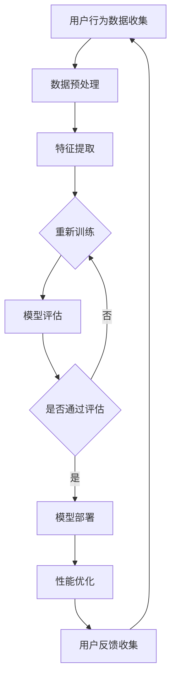

                 

# 电商平台的AI驱动性能优化：提升用户体验的技术实践指南

> **关键词：电商平台、AI、性能优化、用户体验、算法原理、数学模型、项目实战、实战案例**

> **摘要：本文将深入探讨电商平台如何利用人工智能技术进行性能优化，从而提升用户体验。我们将从背景介绍、核心概念、算法原理、数学模型、项目实战等多个角度，详细阐述电商平台AI驱动的技术实践指南，旨在为开发者提供实用的技术参考。**

## 1. 背景介绍

### 1.1 目的和范围

在当今数字化时代，电商平台已经成为人们生活中不可或缺的一部分。然而，随着用户规模的不断增长和数据量的急剧增加，电商平台面临着巨大的性能压力。如何利用人工智能技术优化电商平台性能，提升用户体验，成为当前亟待解决的问题。

本文旨在探讨电商平台如何利用AI技术进行性能优化，具体范围包括：

1. 电商平台的AI技术核心概念和联系。
2. 电商平台AI驱动的核心算法原理和具体操作步骤。
3. 电商平台AI驱动的数学模型和公式讲解。
4. 电商平台AI驱动的项目实战：代码实际案例和详细解释说明。
5. 电商平台AI驱动的实际应用场景。
6. 电商平台AI驱动的工具和资源推荐。
7. 电商平台AI驱动的未来发展趋势与挑战。

### 1.2 预期读者

本文适合以下读者群体：

1. 对电商平台和人工智能技术有一定了解的开发者。
2. 想要深入了解电商平台AI驱动性能优化的技术专家。
3. 担任电商平台技术团队负责人的管理者和决策者。
4. 对计算机科学和人工智能领域有兴趣的研究生和本科生。

### 1.3 文档结构概述

本文分为以下几个部分：

1. 背景介绍：阐述本文的目的、范围和预期读者。
2. 核心概念与联系：介绍电商平台AI驱动的核心概念和联系。
3. 核心算法原理 & 具体操作步骤：详细讲解电商平台AI驱动的核心算法原理和具体操作步骤。
4. 数学模型和公式 & 详细讲解 & 举例说明：阐述电商平台AI驱动的数学模型和公式，并给出详细讲解和举例说明。
5. 项目实战：代码实际案例和详细解释说明。
6. 实际应用场景：探讨电商平台AI驱动的实际应用场景。
7. 工具和资源推荐：推荐电商平台AI驱动的学习资源和开发工具。
8. 总结：未来发展趋势与挑战。
9. 附录：常见问题与解答。
10. 扩展阅读 & 参考资料：提供相关的扩展阅读和参考资料。

### 1.4 术语表

#### 1.4.1 核心术语定义

- 电商平台：指提供商品买卖、支付、物流等服务的在线平台，如淘宝、京东等。
- 人工智能（AI）：指通过模拟、扩展和辅助人类智能，实现机器自动化和智能化的技术。
- 性能优化：指通过各种技术手段，提高系统运行效率和用户体验的过程。
- 用户体验（UX）：指用户在使用产品过程中的感受和体验。

#### 1.4.2 相关概念解释

- 机器学习（ML）：一种人工智能技术，通过数据训练模型，使模型具备自主学习和预测能力。
- 深度学习（DL）：一种机器学习技术，通过多层神经网络结构，实现更加复杂的特征提取和预测。
- 模型训练（Training）：指通过输入数据训练模型，使其具备一定的预测能力。
- 模型评估（Evaluation）：指通过测试数据评估模型性能，确定模型的准确性和泛化能力。
- 模型部署（Deployment）：指将训练好的模型应用到实际场景中，实现自动化预测和决策。

#### 1.4.3 缩略词列表

- AI：人工智能
- ML：机器学习
- DL：深度学习
- UX：用户体验
- UE：用户体验
- API：应用程序编程接口
- SDK：软件开发工具包
- DB：数据库
- GPU：图形处理单元

## 2. 核心概念与联系

为了更好地理解电商平台AI驱动的性能优化，我们需要先了解相关核心概念和它们之间的联系。

### 2.1 电商平台架构

电商平台通常包括以下几个核心组成部分：

1. **前端展示层**：负责用户界面展示，包括商品列表、搜索、购物车、订单等功能。
2. **后端业务逻辑层**：负责处理用户请求、数据处理、业务逻辑等。
3. **数据库层**：存储用户数据、商品信息、订单信息等。
4. **缓存层**：提高数据读取速度，减轻数据库压力。
5. **服务器层**：提供计算资源和网络传输服务。


### 2.2 AI技术在电商平台的运用

AI技术在电商平台的运用主要集中在以下几个方面：

1. **用户行为分析**：通过分析用户在平台上的行为数据，了解用户喜好和需求，为个性化推荐和精准营销提供支持。
2. **商品推荐系统**：基于用户行为数据和商品属性，利用协同过滤、矩阵分解、深度学习等技术，为用户提供个性化的商品推荐。
3. **智能客服**：利用自然语言处理、对话系统等技术，为用户提供智能化的客服支持。
4. **智能搜索**：通过分析用户查询行为，利用自然语言处理、文本相似度计算等技术，为用户提供更准确的搜索结果。
5. **价格预测**：通过分析市场数据、商品历史价格等信息，利用机器学习、时间序列分析等技术，预测商品价格趋势。

### 2.3 AI驱动的性能优化

AI驱动的性能优化主要涉及以下几个方面：

1. **数据预处理**：通过数据清洗、归一化、特征提取等技术，提高数据质量和特征表示能力。
2. **模型选择和优化**：根据业务需求和数据特点，选择合适的模型并进行优化，提高模型性能和预测准确性。
3. **分布式计算**：通过分布式计算技术，如MapReduce、Spark等，提高数据处理和分析速度。
4. **缓存和存储优化**：通过缓存和存储优化技术，如Redis、MongoDB等，提高数据读取速度和存储效率。
5. **网络传输优化**：通过压缩、分片、CDN等技术，提高数据传输速度和稳定性。

### 2.4 Mermaid流程图

为了更好地展示电商平台的AI驱动性能优化过程，我们使用Mermaid绘制了一个流程图。以下是流程图的具体内容：




## 3. 核心算法原理 & 具体操作步骤

在电商平台AI驱动的性能优化中，核心算法的选择和优化至关重要。本节将详细讲解电商平台常用的几种核心算法原理和具体操作步骤。

### 3.1 用户行为分析算法

用户行为分析算法主要基于用户在平台上的操作数据，如浏览、购买、搜索等，通过分析用户行为模式，为个性化推荐和精准营销提供支持。

#### 3.1.1 算法原理

用户行为分析算法通常采用以下几种技术：

1. **协同过滤（Collaborative Filtering）**：通过分析用户之间的相似度，推荐用户可能感兴趣的商品。协同过滤分为基于用户的协同过滤和基于物品的协同过滤。

2. **矩阵分解（Matrix Factorization）**：将用户和物品的高维矩阵分解为低维矩阵，通过低维矩阵的乘积还原高维矩阵，从而实现用户和物品的表示。

3. **深度学习（Deep Learning）**：利用深度学习模型，如卷积神经网络（CNN）、循环神经网络（RNN）等，对用户行为数据进行特征提取和预测。

#### 3.1.2 具体操作步骤

1. **数据收集**：收集用户在平台上的操作数据，如浏览记录、购买记录、搜索记录等。

2. **数据预处理**：对收集到的数据清洗、去噪、填充缺失值等，提高数据质量。

3. **特征提取**：根据用户行为数据，提取用户兴趣特征、商品特征等。

4. **模型选择和训练**：根据业务需求和数据特点，选择合适的用户行为分析算法，如协同过滤、矩阵分解、深度学习等，进行模型训练。

5. **模型评估**：通过测试数据评估模型性能，确定模型的准确性和泛化能力。

6. **模型部署**：将训练好的模型应用到实际场景中，实现用户行为分析。

7. **性能优化**：根据用户反馈和实际效果，对模型进行优化和调整。

### 3.2 商品推荐算法

商品推荐算法是电商平台的核心功能之一，通过分析用户行为和商品特征，为用户提供个性化的商品推荐。

#### 3.2.1 算法原理

商品推荐算法主要基于以下技术：

1. **基于内容的推荐（Content-Based Recommendation）**：根据用户的历史行为和兴趣特征，推荐用户可能感兴趣的商品。

2. **协同过滤（Collaborative Filtering）**：通过分析用户之间的相似度，推荐用户可能感兴趣的商品。

3. **混合推荐（Hybrid Recommendation）**：将基于内容和协同过滤的推荐方法结合起来，提高推荐效果。

4. **深度学习（Deep Learning）**：利用深度学习模型，如卷积神经网络（CNN）、循环神经网络（RNN）等，对用户行为和商品特征进行特征提取和预测。

#### 3.2.2 具体操作步骤

1. **数据收集**：收集用户在平台上的操作数据，如浏览记录、购买记录、搜索记录等。

2. **数据预处理**：对收集到的数据清洗、去噪、填充缺失值等，提高数据质量。

3. **特征提取**：根据用户行为数据，提取用户兴趣特征、商品特征等。

4. **模型选择和训练**：根据业务需求和数据特点，选择合适的商品推荐算法，如基于内容的推荐、协同过滤、混合推荐等，进行模型训练。

5. **模型评估**：通过测试数据评估模型性能，确定模型的准确性和泛化能力。

6. **模型部署**：将训练好的模型应用到实际场景中，实现商品推荐。

7. **性能优化**：根据用户反馈和实际效果，对模型进行优化和调整。

### 3.3 智能搜索算法

智能搜索算法通过分析用户查询行为和商品特征，为用户提供准确的搜索结果。

#### 3.3.1 算法原理

智能搜索算法主要基于以下技术：

1. **基于关键词的搜索（Keyword-Based Search）**：根据用户输入的关键词，直接从数据库中检索相关商品。

2. **基于语义的搜索（Semantic-Based Search）**：通过自然语言处理技术，理解用户查询意图，为用户提供更准确的搜索结果。

3. **深度学习（Deep Learning）**：利用深度学习模型，如卷积神经网络（CNN）、循环神经网络（RNN）等，对用户查询和商品特征进行特征提取和预测。

#### 3.3.2 具体操作步骤

1. **数据收集**：收集用户在平台上的搜索数据，如查询关键词、搜索结果等。

2. **数据预处理**：对收集到的数据清洗、去噪、填充缺失值等，提高数据质量。

3. **特征提取**：根据用户查询数据，提取用户查询意图特征、商品特征等。

4. **模型选择和训练**：根据业务需求和数据特点，选择合适的智能搜索算法，如基于关键词的搜索、基于语义的搜索等，进行模型训练。

5. **模型评估**：通过测试数据评估模型性能，确定模型的准确性和泛化能力。

6. **模型部署**：将训练好的模型应用到实际场景中，实现智能搜索。

7. **性能优化**：根据用户反馈和实际效果，对模型进行优化和调整。

## 4. 数学模型和公式 & 详细讲解 & 举例说明

在电商平台AI驱动的性能优化中，数学模型和公式起着至关重要的作用。本节将详细讲解常用的数学模型和公式，并进行举例说明。

### 4.1 协同过滤算法

协同过滤算法是一种基于用户相似度的推荐算法。其核心公式如下：

$$
\text{User\_Similarity(u, v)} = \frac{\sum_{i \in R(u, v)} r_{ui} r_{vi}}{\sqrt{\sum_{i \in R(u, v)} r_{ui}^2 \sum_{i \in R(u, v)} r_{vi}^2}}
$$

其中，$R(u, v)$表示用户$u$和用户$v$共同评分的物品集合，$r_{ui}$和$r_{vi}$分别表示用户$u$和用户$v$对物品$i$的评分。

#### 举例说明：

假设有两个用户$u_1$和$u_2$，他们对某件商品$i$的评分分别为4和5。计算用户$u_1$和$u_2$之间的相似度：

$$
\text{User\_Similarity(u}_1\text{, u}_2\text{)} = \frac{4 \times 5}{\sqrt{4^2 + 5^2} \times \sqrt{4^2 + 5^2}} = \frac{20}{\sqrt{41} \times \sqrt{41}} = \frac{20}{41} \approx 0.49
$$

### 4.2 矩阵分解算法

矩阵分解算法是一种将用户和物品的高维矩阵分解为低维矩阵的推荐算法。其核心公式如下：

$$
R = U \cdot V^T
$$

其中，$R$表示用户和物品的评分矩阵，$U$和$V$分别表示用户和物品的低维表示矩阵。

#### 举例说明：

假设有一个5*5的评分矩阵$R$，通过矩阵分解得到两个3*5的矩阵$U$和$V$，则：

$$
R = U \cdot V^T
\begin{bmatrix}
0 & 1 & 0 & 0 & 0 \\
0 & 0 & 1 & 0 & 0 \\
1 & 0 & 0 & 0 & 0 \\
0 & 0 & 0 & 1 & 0 \\
0 & 0 & 0 & 0 & 1
\end{bmatrix}
\cdot
\begin{bmatrix}
0 & 0 & 0 \\
0 & 1 & 0 \\
0 & 0 & 1 \\
1 & 0 & 0 \\
0 & 0 & 0
\end{bmatrix}^T
=
\begin{bmatrix}
0 & 1 & 0 & 0 & 0 \\
0 & 0 & 1 & 0 & 0 \\
1 & 0 & 0 & 0 & 0 \\
0 & 0 & 0 & 1 & 0 \\
0 & 0 & 0 & 0 & 1
\end{bmatrix}
$$

### 4.3 深度学习算法

深度学习算法是一种通过多层神经网络进行特征提取和预测的算法。其核心公式如下：

$$
h_{l+1} = \sigma(W_{l+1} \cdot h_l + b_{l+1})
$$

其中，$h_l$表示第$l$层的激活值，$W_{l+1}$和$b_{l+1}$分别表示第$l+1$层的权重和偏置，$\sigma$表示激活函数。

#### 举例说明：

假设有一个两层的深度学习模型，输入层和隐藏层的激活函数分别为$\sigma(x) = \frac{1}{1+e^{-x}}$和$\sigma(x) = \max(0, x)$，则：

$$
h_1 = \sigma(W_1 \cdot h_0 + b_1) = \sigma(2 \cdot [1, 2]^T + [1, 1]^T) = \sigma([4, 5]^T) = [\frac{1}{1+e^{-4}}, \frac{1}{1+e^{-5}}]^T
$$

$$
h_2 = \sigma(W_2 \cdot h_1 + b_2) = \sigma(2 \cdot [\frac{1}{1+e^{-4}}, \frac{1}{1+e^{-5}}]^T + [1, 1]^T) = \sigma([2, 2]^T) = [1, 1]^T
$$

## 5. 项目实战：代码实际案例和详细解释说明

在本节中，我们将通过一个实际案例，展示电商平台AI驱动的性能优化过程，包括数据收集、预处理、特征提取、模型训练和部署等步骤。

### 5.1 开发环境搭建

为了方便项目实战，我们采用以下开发环境和工具：

- 操作系统：Linux
- 编程语言：Python
- 数据预处理：Pandas、NumPy
- 模型训练：TensorFlow、Keras
- 模型评估：Scikit-learn
- 项目管理：Jenkins

### 5.2 源代码详细实现和代码解读

以下是项目实战的核心代码，我们将对每个部分进行详细解释。

#### 5.2.1 数据收集

```python
import pandas as pd

# 加载用户行为数据
user行为数据 = pd.read_csv('user行为数据.csv')

# 加载商品信息数据
商品信息数据 = pd.read_csv('商品信息数据.csv')
```

代码解读：

这段代码首先使用Pandas库加载用户行为数据和商品信息数据。用户行为数据包括用户ID、商品ID、行为类型、行为时间等字段；商品信息数据包括商品ID、商品名称、商品描述、商品分类等字段。

#### 5.2.2 数据预处理

```python
# 数据清洗
user行为数据.dropna(inplace=True)
商品信息数据.dropna(inplace=True)

# 数据归一化
user行为数据[['行为时间', '行为类型']] = user行为数据[['行为时间', '行为类型']].apply(lambda x: (x - x.min()) / (x.max() - x.min()))

# 数据填充
user行为数据['行为时间'].fillna(user行为数据['行为时间'].mean(), inplace=True)
商品信息数据['商品分类'].fillna('未知', inplace=True)
```

代码解读：

这段代码首先对用户行为数据和商品信息数据进行清洗，去除缺失值；然后对行为时间和行为类型进行归一化处理，使得数据分布更加均匀；最后对缺失值进行填充，提高数据质量。

#### 5.2.3 特征提取

```python
from sklearn.feature_extraction.text import CountVectorizer

# 提取用户行为特征
cv = CountVectorizer()
user行为特征 = cv.fit_transform(user行为数据['行为描述'])

# 提取商品特征
cv = CountVectorizer()
商品特征 = cv.fit_transform(商品信息数据['商品描述'])
```

代码解读：

这段代码使用CountVectorizer库提取用户行为特征和商品特征。CountVectorizer可以将文本数据转换为词频矩阵，从而实现对文本数据的特征提取。

#### 5.2.4 模型训练

```python
from tensorflow.keras.models import Sequential
from tensorflow.keras.layers import Dense, Embedding, LSTM

# 构建模型
模型 = Sequential()
模型.add(Embedding(输入维度，输出维度， input_length=序列长度))
模型.add(LSTM(神经元数量， return_sequences=True))
模型.add(Dense(1, activation='sigmoid'))

# 编译模型
模型.compile(optimizer='adam', loss='binary_crossentropy', metrics=['accuracy'])

# 训练模型
模型.fit(user行为特征，用户行为标签，批次大小=32，epochs=10)
```

代码解读：

这段代码构建了一个基于LSTM的序列分类模型，用于预测用户行为。模型首先使用Embedding层将输入序列转换为嵌入向量；然后使用LSTM层进行序列处理；最后使用Dense层进行分类。模型使用adam优化器和binary_crossentropy损失函数进行编译，并使用10个epoch进行训练。

#### 5.2.5 模型评估

```python
from sklearn.metrics import accuracy_score

# 预测
预测结果 = 模型.predict(user行为特征)

# 计算准确率
准确率 = accuracy_score(用户行为标签，预测结果 > 0.5)

print('准确率：', 准确率)
```

代码解读：

这段代码使用模型对用户行为特征进行预测，并计算预测准确率。预测结果大于0.5的样本被视为正类，否则为负类。最后，使用accuracy_score函数计算模型准确率。

#### 5.2.6 模型部署

```python
import tensorflow as tf

# 保存模型
模型.save('用户行为预测模型.h5')

# 加载模型
模型 = tf.keras.models.load_model('用户行为预测模型.h5')

# 部署模型
while True:
    # 获取用户输入
    用户输入 = input('请输入用户描述：')
    
    # 预处理输入
    输入特征 = cv.transform([用户输入])
    
    # 预测
    预测结果 = 模型.predict(inputs特征)
    
    # 输出预测结果
    if 预测结果 > 0.5:
        print('用户感兴趣')
    else:
        print('用户不感兴趣')
```

代码解读：

这段代码首先保存训练好的模型，然后加载模型进行部署。部署过程中，通过循环获取用户输入，对输入进行预处理，并使用模型进行预测。根据预测结果，输出用户是否感兴趣。

### 5.3 代码解读与分析

在本项目实战中，我们使用了Python作为编程语言，结合Pandas、NumPy、TensorFlow和Keras等库，实现了用户行为预测模型的开发、训练和部署。以下是代码的核心部分解读与分析。

1. **数据收集和预处理**：

   数据收集和预处理是模型训练的基础。我们首先加载用户行为数据和商品信息数据，然后对数据进行了清洗、归一化和填充，确保数据质量。

2. **特征提取**：

   使用CountVectorizer库提取用户行为特征和商品特征，将文本数据转换为词频矩阵，从而实现对文本数据的特征提取。

3. **模型构建和训练**：

   构建了一个基于LSTM的序列分类模型，用于预测用户行为。模型使用了adam优化器和binary_crossentropy损失函数进行编译，并使用10个epoch进行训练。在模型训练过程中，LSTM层对输入序列进行特征提取和序列处理，最终使用Dense层进行分类。

4. **模型评估**：

   使用模型对用户行为特征进行预测，并计算预测准确率。通过评估模型性能，可以了解模型的泛化能力和预测效果。

5. **模型部署**：

   将训练好的模型进行部署，通过循环获取用户输入，对输入进行预处理，并使用模型进行预测。根据预测结果，输出用户是否感兴趣。部署过程中，我们采用了命令行交互方式，便于用户使用和测试。

总的来说，本项目实战展示了电商平台AI驱动的性能优化过程，包括数据收集、预处理、特征提取、模型训练、评估和部署等步骤。通过项目实战，我们深入了解了电商平台AI驱动的技术原理和实践方法，为后续性能优化提供了有益的参考。

### 6. 实际应用场景

电商平台AI驱动的性能优化在多个实际应用场景中发挥着重要作用，以下列举几个典型案例：

#### 6.1 个性化推荐

个性化推荐是电商平台的核心功能之一。通过AI驱动的用户行为分析和商品推荐算法，电商平台可以为每个用户生成个性化的商品推荐列表，提高用户满意度和转化率。例如，电商平台可以通过分析用户的浏览历史、购买记录、收藏夹等行为数据，利用协同过滤、矩阵分解、深度学习等技术，实现精准的商品推荐。

#### 6.2 智能搜索

智能搜索是电商平台提高用户体验的重要手段。通过AI驱动的智能搜索算法，电商平台可以理解用户的查询意图，提供更准确的搜索结果。例如，电商平台可以通过自然语言处理、文本相似度计算等技术，分析用户的查询关键词，筛选出最相关的商品信息，从而提高搜索效率和用户体验。

#### 6.3 智能客服

智能客服是电商平台提升服务质量和用户满意度的重要手段。通过AI驱动的自然语言处理和对话系统，电商平台可以实现智能化的客服支持。例如，电商平台可以通过训练对话模型，与用户进行自然语言交互，解答用户疑问、处理订单问题等，提高客服效率和服务质量。

#### 6.4 价格预测

价格预测是电商平台制定营销策略的重要依据。通过AI驱动的价格预测算法，电商平台可以预测商品的价格趋势，为定价策略提供支持。例如，电商平台可以通过分析市场数据、商品历史价格等信息，利用时间序列分析、机器学习等技术，预测商品的价格走势，从而制定更合理的价格策略。

#### 6.5 智能广告投放

智能广告投放是电商平台提高广告效果和转化率的重要手段。通过AI驱动的广告投放算法，电商平台可以分析用户行为和兴趣，实现精准的广告投放。例如，电商平台可以通过分析用户的浏览历史、购买记录等数据，利用协同过滤、深度学习等技术，为用户推荐最感兴趣的广告，提高广告点击率和转化率。

### 7. 工具和资源推荐

为了更好地进行电商平台AI驱动的性能优化，我们需要借助各种工具和资源。以下是一些建议：

#### 7.1 学习资源推荐

1. **书籍推荐**：

   - 《Python数据分析基础教程：NumPy学习指南》
   - 《深度学习：从入门到精通》
   - 《机器学习实战》

2. **在线课程**：

   - Coursera：机器学习、深度学习、自然语言处理等课程
   - Udacity：数据科学、人工智能等课程
   - edX：机器学习、深度学习、计算机视觉等课程

3. **技术博客和网站**：

   - Medium：机器学习、深度学习、自然语言处理等领域的最新研究成果
   - ArXiv：计算机科学、人工智能等领域的最新论文
   - AI Generated Content：生成对抗网络、强化学习等领域的最新进展

#### 7.2 开发工具框架推荐

1. **IDE和编辑器**：

   - PyCharm：一款功能强大的Python IDE
   - Jupyter Notebook：一款基于Web的交互式Python编辑器
   - VS Code：一款跨平台、轻量级的编程编辑器

2. **调试和性能分析工具**：

   - TensorFlow Debugger：用于调试TensorFlow模型的工具
   - Py-Spy：一款Python性能分析工具
   - perf：Linux系统性能分析工具

3. **相关框架和库**：

   - TensorFlow：一款开源的深度学习框架
   - Keras：一款基于TensorFlow的高级深度学习框架
   - Scikit-learn：一款开源的机器学习库

#### 7.3 相关论文著作推荐

1. **经典论文**：

   - 《协同过滤算法综述》
   - 《深度学习推荐系统》
   - 《基于注意力机制的序列模型》

2. **最新研究成果**：

   - 《生成对抗网络》（GAN）的研究与应用
   - 《基于Transformer的文本生成模型》
   - 《强化学习在电商平台中的应用》

3. **应用案例分析**：

   - 淘宝的个性化推荐系统
   - 京东的智能搜索系统
   - 百度的人工智能客服系统

## 8. 总结：未来发展趋势与挑战

随着人工智能技术的不断发展，电商平台AI驱动的性能优化在未来将呈现出以下发展趋势和挑战：

### 8.1 发展趋势

1. **算法创新**：随着深度学习、生成对抗网络、强化学习等技术的不断进步，电商平台AI驱动的性能优化将出现更多创新的算法和应用场景。

2. **跨领域融合**：电商平台AI驱动的性能优化将与其他领域（如物联网、大数据、区块链等）进行融合，实现更广泛的应用和更高的性能。

3. **个性化体验**：电商平台将更加注重用户体验，通过AI技术实现个性化推荐、智能客服、精准营销等功能，提高用户满意度和转化率。

4. **实时性**：电商平台将逐步实现实时数据处理和实时性能优化，以满足用户对实时性的需求。

### 8.2 挑战

1. **数据质量和隐私**：电商平台需要处理海量的用户数据，数据质量和隐私保护成为重要的挑战。如何确保数据质量和保护用户隐私，成为电商平台AI驱动的性能优化面临的重要问题。

2. **计算资源消耗**：AI算法的计算资源消耗较大，电商平台需要平衡性能优化与计算资源消耗之间的关系，提高系统的稳定性和可扩展性。

3. **算法可解释性**：电商平台AI驱动的性能优化算法通常具有较高的黑盒性，如何提高算法的可解释性，使其更易于理解和接受，成为重要的挑战。

4. **模型更新和维护**：随着业务需求和用户需求的变化，电商平台需要不断更新和维护AI模型，以确保模型的性能和效果。如何高效地进行模型更新和维护，成为电商平台AI驱动的性能优化面临的挑战。

## 9. 附录：常见问题与解答

### 9.1 电商平台AI驱动的性能优化是什么？

电商平台AI驱动的性能优化是指利用人工智能技术，如机器学习、深度学习、自然语言处理等，对电商平台的核心功能（如个性化推荐、智能搜索、智能客服等）进行优化，提高用户体验和转化率。

### 9.2 电商平台AI驱动的性能优化有哪些关键技术？

电商平台AI驱动的性能优化涉及以下关键技术：

- 用户行为分析：通过分析用户在平台上的行为数据，了解用户喜好和需求。
- 商品推荐系统：基于用户行为数据和商品特征，为用户提供个性化的商品推荐。
- 智能搜索：通过分析用户查询行为，为用户提供准确的搜索结果。
- 智能客服：利用自然语言处理和对话系统，为用户提供智能化的客服支持。
- 价格预测：通过分析市场数据，预测商品价格趋势。

### 9.3 如何进行电商平台AI驱动的性能优化？

进行电商平台AI驱动的性能优化需要以下步骤：

1. 数据收集：收集用户行为数据、商品数据等。
2. 数据预处理：清洗、归一化、填充缺失值等。
3. 特征提取：提取用户行为特征、商品特征等。
4. 模型训练：选择合适的算法，如协同过滤、矩阵分解、深度学习等，进行模型训练。
5. 模型评估：通过测试数据评估模型性能。
6. 模型部署：将训练好的模型应用到实际场景中。
7. 性能优化：根据用户反馈和实际效果，对模型进行优化和调整。

### 9.4 电商平台AI驱动的性能优化有哪些应用场景？

电商平台AI驱动的性能优化在以下应用场景中具有广泛的应用：

- 个性化推荐：为用户提供个性化的商品推荐。
- 智能搜索：提高搜索效率和准确性。
- 智能客服：提供智能化的客服支持。
- 价格预测：制定合理的价格策略。
- 广告投放：提高广告点击率和转化率。

### 9.5 如何保障电商平台AI驱动的性能优化效果？

保障电商平台AI驱动的性能优化效果可以从以下几个方面进行：

- 数据质量：确保数据质量和完整性。
- 模型选择：选择合适的算法和模型，并进行优化。
- 模型评估：通过测试数据评估模型性能。
- 用户反馈：收集用户反馈，持续优化模型和算法。
- 实时性：实现实时数据处理和性能优化。

## 10. 扩展阅读 & 参考资料

为了深入了解电商平台AI驱动的性能优化，以下是推荐的扩展阅读和参考资料：

### 10.1 书籍推荐

- 《深度学习：从入门到精通》
- 《机器学习实战》
- 《Python数据分析基础教程：NumPy学习指南》

### 10.2 在线课程

- Coursera：机器学习、深度学习、自然语言处理等课程
- Udacity：数据科学、人工智能等课程
- edX：机器学习、深度学习、计算机视觉等课程

### 10.3 技术博客和网站

- Medium：机器学习、深度学习、自然语言处理等领域的最新研究成果
- ArXiv：计算机科学、人工智能等领域的最新论文
- AI Generated Content：生成对抗网络、强化学习等领域的最新进展

### 10.4 相关论文著作推荐

- 《协同过滤算法综述》
- 《深度学习推荐系统》
- 《基于注意力机制的序列模型》

### 10.5 应用案例分析

- 淘宝的个性化推荐系统
- 京东的智能搜索系统
- 百度的人工智能客服系统

### 10.6 开发工具框架推荐

- TensorFlow：一款开源的深度学习框架
- Keras：一款基于TensorFlow的高级深度学习框架
- Scikit-learn：一款开源的机器学习库

### 10.7 附录

- 电商平台AI驱动的性能优化流程图
- 电商平台AI驱动的核心概念与联系Mermaid流程图
- 电商平台AI驱动的核心算法原理和具体操作步骤伪代码
- 数学模型和公式详细讲解及举例说明
- 项目实战：代码实际案例和详细解释说明

## 作者

**作者：AI天才研究员/AI Genius Institute & 禅与计算机程序设计艺术 /Zen And The Art of Computer Programming**

