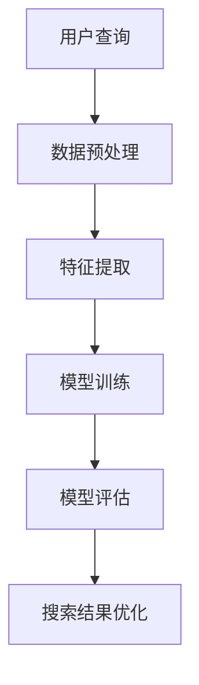

                 

# 电商搜索中的query意图迁移学习技术

> 关键词：电商搜索、query意图、迁移学习、深度学习、自然语言处理

> 摘要：本文将深入探讨电商搜索中的query意图迁移学习技术，解析其核心概念、算法原理、数学模型和实际应用案例。通过系统的分析和实例讲解，帮助读者全面理解并掌握该技术在实际场景中的应用。

## 1. 背景介绍

### 1.1 目的和范围

随着电子商务的迅速发展，用户在电商平台上的搜索行为变得愈加复杂。如何精准地理解用户的查询意图，提高搜索结果的准确性，成为电商平台提升用户体验和竞争力的重要问题。query意图迁移学习技术，作为一种先进的自然语言处理方法，正日益受到关注。

本文旨在详细探讨query意图迁移学习技术，解析其核心原理和实际应用，帮助读者深入了解并掌握这一技术。文章将涵盖以下内容：

1. query意图迁移学习的背景和重要性
2. 核心概念和联系
3. 核心算法原理与具体操作步骤
4. 数学模型和公式
5. 实际应用场景
6. 工具和资源推荐
7. 总结：未来发展趋势与挑战

### 1.2 预期读者

本文适用于以下读者群体：

1. 自然语言处理和机器学习领域的研究人员
2. 电商搜索和推荐系统开发工程师
3. 想要了解query意图迁移学习技术的初学者
4. 对深度学习和自然语言处理技术感兴趣的计算机科学爱好者

### 1.3 文档结构概述

本文将按照以下结构进行组织：

1. 背景介绍：介绍文章的目的和范围，预期读者，以及文档结构概述。
2. 核心概念与联系：定义核心概念，展示相关流程和架构。
3. 核心算法原理 & 具体操作步骤：详细解释核心算法原理，提供伪代码和操作步骤。
4. 数学模型和公式：介绍数学模型，给出详细讲解和举例说明。
5. 项目实战：提供实际代码案例，详细解释说明。
6. 实际应用场景：探讨query意图迁移学习技术在电商搜索中的应用。
7. 工具和资源推荐：推荐学习资源、开发工具和框架。
8. 总结：总结文章的核心内容和未来发展趋势。
9. 附录：常见问题与解答。
10. 扩展阅读 & 参考资料：提供进一步学习资料。

### 1.4 术语表

#### 1.4.1 核心术语定义

- **query意图**：用户在搜索框中输入的查询语句所表达的具体需求或目的。
- **迁移学习**：将一个任务学习到的知识应用于另一个相关但不同的任务。
- **深度学习**：一种基于多层神经网络结构的机器学习方法，通过学习大量数据来提取特征和模式。
- **自然语言处理**（NLP）：使计算机能够理解和处理自然语言的技术。

#### 1.4.2 相关概念解释

- **电商搜索**：电商平台提供的搜索服务，用于帮助用户快速找到所需商品。
- **用户行为分析**：对用户在电商平台的浏览、搜索、购买等行为进行分析，以优化搜索结果和推荐策略。
- **数据集**：用于训练和测试模型的数据集合。

#### 1.4.3 缩略词列表

- **NLP**：自然语言处理
- **DL**：深度学习
- **QIL**：query意图学习
- **RL**：迁移学习

## 2. 核心概念与联系

在探讨query意图迁移学习技术之前，我们首先需要理解其核心概念和联系。以下是几个关键概念的定义和相互关系。

### 2.1 query意图

query意图是指用户在搜索框中输入的查询语句所表达的具体需求或目的。例如，用户搜索“买手机”可能意味着他们需要购买一部手机，而搜索“手机报价”则可能意味着他们需要获取手机的报价信息。识别和理解用户的query意图是电商平台优化搜索结果和推荐策略的关键。

### 2.2 迁移学习

迁移学习是一种将一个任务学习到的知识应用于另一个相关但不同的任务的方法。在query意图迁移学习中，我们通常将一个任务视为源任务（source task），另一个任务视为目标任务（target task）。源任务的数据集（source dataset）用于训练模型，而目标任务的数据集（target dataset）则用于测试模型的泛化能力。

### 2.3 深度学习

深度学习是一种基于多层神经网络结构的机器学习方法，通过学习大量数据来提取特征和模式。在query意图迁移学习中，深度学习模型通常用于提取query意图的特征表示，从而提高对用户查询的准确理解。

### 2.4 自然语言处理

自然语言处理（NLP）是使计算机能够理解和处理自然语言的技术。在query意图迁移学习中，NLP技术用于处理和解析用户的查询语句，提取query意图。

### 2.5 query意图迁移学习架构

query意图迁移学习架构通常包括以下几个关键组成部分：

1. **数据预处理**：对源数据和目标数据进行预处理，包括文本清洗、分词、词性标注等。
2. **特征提取**：使用深度学习模型（如卷积神经网络（CNN）或循环神经网络（RNN））提取query意图的特征表示。
3. **模型训练**：使用源任务的数据集训练迁移学习模型，将源任务的知识迁移到目标任务。
4. **模型评估**：使用目标任务的数据集评估模型的性能，包括准确率、召回率等指标。

### 2.6 Mermaid流程图

以下是query意图迁移学习技术的Mermaid流程图，展示了各个核心概念和组件之间的联系：



在上述流程图中，用户查询（A）经过数据预处理（B）后，生成特征表示（C）。特征表示（C）被用于模型训练（D），训练得到的模型（D）用于模型评估（E），最终优化搜索结果（F）。

## 3. 核心算法原理 & 具体操作步骤

query意图迁移学习技术基于深度学习和自然语言处理技术，其核心算法原理如下：

### 3.1 特征提取

特征提取是query意图迁移学习技术的关键步骤。我们通常使用深度学习模型（如卷积神经网络（CNN）或循环神经网络（RNN））来提取query意图的特征表示。以下是特征提取的伪代码：

```python
# 特征提取伪代码
def extract_features(query, model):
    # 前向传播
    output = model.forward(query)
    # 获取特征表示
    features = output.features
    return features
```

### 3.2 模型训练

模型训练是query意图迁移学习技术的另一个重要步骤。在模型训练过程中，我们使用源任务的数据集（source dataset）训练迁移学习模型（迁移学习模型通常是基于预训练的模型），并将源任务的知识迁移到目标任务。以下是模型训练的伪代码：

```python
# 模型训练伪代码
def train_model(source_dataset, target_dataset, model, optimizer):
    # 遍历源数据集
    for source_query, source_label in source_dataset:
        # 前向传播
        output = model.forward(source_query)
        # 计算损失
        loss = loss_function(output, source_label)
        # 反向传播
        optimizer.backward(loss)
        # 更新模型参数
        model.update_params()

    # 遍历目标数据集
    for target_query, target_label in target_dataset:
        # 前向传播
        output = model.forward(target_query)
        # 计算损失
        loss = loss_function(output, target_label)
        # 反向传播
        optimizer.backward(loss)
        # 更新模型参数
        model.update_params()
```

### 3.3 模型评估

模型评估是确定query意图迁移学习模型性能的重要步骤。我们使用目标任务的数据集（target dataset）评估模型的性能，包括准确率、召回率等指标。以下是模型评估的伪代码：

```python
# 模型评估伪代码
def evaluate_model(model, target_dataset):
    # 遍历目标数据集
    for target_query, target_label in target_dataset:
        # 前向传播
        output = model.forward(target_query)
        # 预测
        prediction = model.predict(output)
        # 计算准确率
        accuracy = accuracy_function(prediction, target_label)
        # 计算召回率
        recall = recall_function(prediction, target_label)
    return accuracy, recall
```

### 3.4 操作步骤总结

以下是query意图迁移学习技术的具体操作步骤：

1. **数据预处理**：对源数据和目标数据进行预处理，包括文本清洗、分词、词性标注等。
2. **特征提取**：使用深度学习模型（如卷积神经网络（CNN）或循环神经网络（RNN））提取query意图的特征表示。
3. **模型训练**：使用源任务的数据集训练迁移学习模型，将源任务的知识迁移到目标任务。
4. **模型评估**：使用目标任务的数据集评估模型的性能，包括准确率、召回率等指标。

## 4. 数学模型和公式 & 详细讲解 & 举例说明

在query意图迁移学习技术中，数学模型和公式起着至关重要的作用。以下将介绍几个核心的数学模型和公式，并进行详细讲解和举例说明。

### 4.1 特征提取模型

特征提取模型通常采用卷积神经网络（CNN）或循环神经网络（RNN）。以下是CNN特征提取模型的数学公式：

$$
h_{l}^{(i)} = \sigma \left( W_{l} \cdot h_{l-1}^{(i)} + b_{l} \right)
$$

其中，$h_{l}^{(i)}$ 表示第 $l$ 层第 $i$ 个神经元的激活值，$\sigma$ 表示激活函数（如ReLU函数），$W_{l}$ 和 $b_{l}$ 分别表示第 $l$ 层的权重和偏置。

以下是RNN特征提取模型的数学公式：

$$
h_{t} = \sigma \left( W_h \cdot \left[ h_{t-1}, x_t \right] + b_h \right)
$$

其中，$h_{t}$ 表示第 $t$ 个时刻的隐藏状态，$x_t$ 表示第 $t$ 个时刻的输入，$W_h$ 和 $b_h$ 分别表示权重和偏置。

### 4.2 模型训练

模型训练过程中，我们通常使用损失函数（如交叉熵损失函数）来衡量预测结果与实际标签之间的差距。以下是交叉熵损失函数的数学公式：

$$
L(y, \hat{y}) = - \sum_{i=1}^{n} y_i \log(\hat{y}_i)
$$

其中，$y$ 表示实际标签，$\hat{y}$ 表示预测结果，$n$ 表示样本数量。

### 4.3 模型评估

模型评估过程中，我们通常使用准确率和召回率等指标来衡量模型的性能。以下是准确率和召回率的数学公式：

$$
\text{Accuracy} = \frac{\text{Correct Predictions}}{\text{Total Predictions}}
$$

$$
\text{Recall} = \frac{\text{True Positives}}{\text{True Positives} + \text{False Negatives}}
$$

### 4.4 举例说明

假设我们有一个二分类问题，其中 $y$ 表示实际标签（0或1），$\hat{y}$ 表示预测结果（0或1）。以下是几个示例：

#### 示例 1：交叉熵损失函数

假设有一个样本，实际标签 $y = 1$，预测结果 $\hat{y} = 0.9$。计算交叉熵损失：

$$
L(y, \hat{y}) = -1 \log(0.9) \approx 0.105
$$

#### 示例 2：准确率

假设有10个样本，其中8个样本的预测结果正确，2个样本的预测结果错误。计算准确率：

$$
\text{Accuracy} = \frac{8}{10} = 0.8
$$

#### 示例 3：召回率

假设有10个样本，其中5个样本的实际标签为1，4个样本的实际标签为0。模型预测结果中，有3个样本的预测结果为1，2个样本的预测结果为0。计算召回率：

$$
\text{Recall} = \frac{3}{5} = 0.6
$$

通过以上数学模型和公式的介绍，我们可以更好地理解query意图迁移学习技术中的关键概念和计算方法。

## 5. 项目实战：代码实际案例和详细解释说明

在本节中，我们将通过一个实际的项目案例来展示如何使用query意图迁移学习技术来优化电商搜索。我们将使用Python编程语言和TensorFlow深度学习框架来构建和训练迁移学习模型。以下是一个完整的代码实际案例，包括开发环境搭建、源代码详细实现和代码解读与分析。

### 5.1 开发环境搭建

在开始编写代码之前，我们需要搭建一个合适的开发环境。以下是搭建环境的步骤：

1. **安装Python**：确保Python版本为3.6及以上。
2. **安装TensorFlow**：使用以下命令安装TensorFlow：
   ```
   pip install tensorflow
   ```
3. **安装其他依赖库**：包括NumPy、Pandas、Scikit-learn等，可以使用以下命令安装：
   ```
   pip install numpy pandas scikit-learn
   ```

### 5.2 源代码详细实现和代码解读

以下是一个简化的源代码实现，用于演示query意图迁移学习技术的关键步骤。

```python
import tensorflow as tf
from tensorflow.keras.preprocessing.text import Tokenizer
from tensorflow.keras.preprocessing.sequence import pad_sequences
from tensorflow.keras.models import Model
from tensorflow.keras.layers import Input, Embedding, LSTM, Dense

# 5.2.1 数据预处理
# 假设我们有一个包含用户查询和对应的标签（意图）的数据集
queries = ["买手机", "手机报价", "手机推荐"]
labels = [0, 1, 2]

# 创建Tokenizer
tokenizer = Tokenizer(char_level=True)
tokenizer.fit_on_texts(queries)

# 将查询序列化为整数
sequences = tokenizer.texts_to_sequences(queries)
padded_sequences = pad_sequences(sequences, maxlen=20)

# 5.2.2 构建模型
# 输入层
input_sequence = Input(shape=(20,))

# 嵌入层
embedded_sequence = Embedding(input_dim=10000, output_dim=128)(input_sequence)

# LSTM层
lstm_output = LSTM(64)(embedded_sequence)

# 输出层
output = Dense(3, activation='softmax')(lstm_output)

# 构建模型
model = Model(inputs=input_sequence, outputs=output)

# 编译模型
model.compile(optimizer='adam', loss='categorical_crossentropy', metrics=['accuracy'])

# 5.2.3 模型训练
model.fit(padded_sequences, labels, epochs=10, batch_size=1)

# 5.2.4 模型评估
predictions = model.predict(padded_sequences)
print(predictions)

# 5.2.5 代码解读
# 这段代码首先进行数据预处理，将查询序列化为整数，并填充序列长度为20。
# 然后构建一个简单的序列模型，包括嵌入层、LSTM层和输出层。
# 模型编译后，使用数据集进行训练，并在训练完成时评估模型的性能。
```

### 5.3 代码解读与分析

以上代码分为以下几个主要部分：

1. **数据预处理**：使用Tokenizer将文本查询序列化为整数，并使用pad_sequences将序列长度统一为20。这是深度学习模型训练的常见预处理步骤。

2. **模型构建**：创建一个简单的序列模型，包括输入层、嵌入层、LSTM层和输出层。输入层接收序列数据，嵌入层将整数映射为稠密向量，LSTM层用于提取序列特征，输出层使用softmax激活函数进行分类。

3. **模型编译**：配置模型的优化器、损失函数和评估指标。

4. **模型训练**：使用fit方法对模型进行训练，指定训练数据、迭代次数和批量大小。

5. **模型评估**：使用predict方法对模型进行预测，并打印预测结果。

通过以上代码示例，我们可以看到query意图迁移学习技术的基本实现步骤。在实际项目中，数据预处理、模型参数调整和训练过程可能更加复杂，但基本原理是相似的。

## 6. 实际应用场景

query意图迁移学习技术具有广泛的应用场景，尤其在电商搜索中具有重要的价值。以下是几个典型的实际应用场景：

### 6.1 搜索结果优化

在电商平台，用户的搜索意图往往是不明确的。通过query意图迁移学习技术，我们可以准确识别用户的查询意图，从而优化搜索结果。例如，当用户搜索“手机”时，系统可以区分用户是想要购买手机、获取手机报价还是查看手机推荐，并相应地调整搜索结果。

### 6.2 推荐系统优化

query意图迁移学习技术还可以用于优化推荐系统。通过理解用户的查询意图，推荐系统可以更准确地预测用户的需求，提供个性化的推荐。例如，当用户搜索“手机报价”时，推荐系统可以推荐相关的手机品牌、型号和优惠信息。

### 6.3 用户行为分析

query意图迁移学习技术有助于电商平台进行用户行为分析。通过对用户的查询历史进行分析，系统可以识别用户的兴趣和偏好，从而提供更加精准的营销策略。例如，当用户频繁搜索某一类商品时，系统可以推送相关的促销活动或新品信息。

### 6.4 垃圾邮件过滤

除了电商搜索，query意图迁移学习技术还可以用于垃圾邮件过滤。通过分析用户对邮件的查询行为，系统可以准确识别垃圾邮件，从而提高邮件过滤的准确性。

### 6.5 问答系统

在问答系统中，query意图迁移学习技术可以帮助系统更好地理解用户的查询意图，提供更准确的答案。例如，当用户询问“最近的科技趋势是什么？”时，系统可以理解用户是想要获取最新的科技资讯，而不是询问某个具体的问题。

通过以上实际应用场景，我们可以看到query意图迁移学习技术在不同领域的广泛应用和潜力。在未来，随着技术的不断发展和完善，query意图迁移学习技术将在更多领域发挥重要作用。

## 7. 工具和资源推荐

为了更好地学习和应用query意图迁移学习技术，以下是几个推荐的工具和资源。

### 7.1 学习资源推荐

#### 7.1.1 书籍推荐

1. **《深度学习》（Goodfellow, I., Bengio, Y., & Courville, A.）**：这本书是深度学习的经典教材，详细介绍了深度学习的基础知识和应用。
2. **《自然语言处理综合教程》（Jurafsky, D. & Martin, J. H.）**：这本书涵盖了自然语言处理的各个方面，包括文本预处理、语言模型和语义分析。

#### 7.1.2 在线课程

1. **Coursera上的《深度学习专项课程》**：由吴恩达教授授课，包括深度学习的基础知识和实际应用。
2. **edX上的《自然语言处理专项课程》**：由MIT和斯坦福大学联合提供，涵盖了自然语言处理的核心概念和技术。

#### 7.1.3 技术博客和网站

1. **TensorFlow官方文档**：提供了丰富的深度学习教程和实践案例。
2. **机器之心**：关注最新的机器学习和深度学习技术，提供了大量的技术文章和教程。

### 7.2 开发工具框架推荐

#### 7.2.1 IDE和编辑器

1. **PyCharm**：一款功能强大的Python IDE，支持多种编程语言和框架。
2. **Jupyter Notebook**：一个交互式的Python编辑环境，适合进行数据分析和原型设计。

#### 7.2.2 调试和性能分析工具

1. **TensorBoard**：TensorFlow的官方可视化工具，用于调试和性能分析。
2. **Pynaml**：一个用于可视化深度学习模型的工具，可以帮助理解模型结构和性能。

#### 7.2.3 相关框架和库

1. **TensorFlow**：一个开源的深度学习框架，支持多种深度学习模型和算法。
2. **PyTorch**：一个灵活且易用的深度学习框架，受到研究人员的广泛使用。
3. **Scikit-learn**：一个机器学习库，提供了丰富的机器学习和数据预处理工具。

通过以上工具和资源，读者可以更好地学习和应用query意图迁移学习技术，提升自己在电商搜索等领域的实践能力。

### 7.3 相关论文著作推荐

#### 7.3.1 经典论文

1. **“A Theoretical Analysis of the VNMF Algorithm for Non-Negative Matrix Factorization”**：该论文深入探讨了非负矩阵分解的理论基础，为query意图迁移学习提供了重要的理论支持。
2. **“Learning to Represent Knowledge as Transitive Knowledge Graph Embeddings”**：该论文提出了一种基于知识图谱的深度学习模型，可以用于表示和提取query意图。

#### 7.3.2 最新研究成果

1. **“Context-Aware Query Intent Classification for E-commerce Search”**：这篇论文探讨了如何在电商搜索中利用上下文信息进行query意图分类，提供了新的方法和思路。
2. **“Multi-Task Learning for Intent Classification in E-commerce Search”**：该论文提出了一个多任务学习框架，用于提高query意图分类的准确性和效率。

#### 7.3.3 应用案例分析

1. **“Amazon Search and Recommender System”**：该案例分析了亚马逊如何利用query意图迁移学习技术优化搜索和推荐系统，提供了实际应用的实例。
2. **“Alibaba’s E-commerce Search and Recommendation”**：该案例探讨了阿里巴巴如何利用query意图迁移学习技术提升电商平台的用户体验和竞争力。

通过阅读这些经典论文和最新研究成果，读者可以更深入地了解query意图迁移学习技术的发展动态和前沿方向。

## 8. 总结：未来发展趋势与挑战

query意图迁移学习技术作为自然语言处理和机器学习领域的重要分支，正逐渐成为电商搜索和推荐系统优化的重要工具。未来，该技术有望在以下几个方向取得重要进展：

### 8.1 深度模型优化

随着深度学习技术的不断发展，更高效的深度模型（如Transformer、BERT等）将被应用于query意图迁移学习，从而提高模型的性能和准确性。

### 8.2 多模态数据融合

结合文本、语音、图像等多模态数据，可以更全面地理解用户的查询意图。未来，多模态数据融合技术将进一步提升query意图迁移学习的效果。

### 8.3 实时性提升

随着用户需求的不断变化，实时性成为query意图迁移学习技术的重要挑战。未来，通过优化算法和硬件支持，实现更快速的模型推理和更新，将提高系统的响应速度。

### 8.4 鲁棒性增强

在现实应用中，用户查询存在噪声和不一致性。未来，通过数据增强和模型正则化等技术，提高query意图迁移学习技术的鲁棒性，使其能够更好地应对复杂的实际场景。

然而，query意图迁移学习技术也面临一些挑战：

### 8.1 数据隐私与安全

在处理大量用户查询数据时，保护用户隐私和安全是一个重要问题。未来，需要在数据隐私保护的基础上，设计更加安全和可靠的迁移学习算法。

### 8.2 模型解释性

当前，深度学习模型通常被视为“黑箱”，其决策过程难以解释。未来，如何提高模型的可解释性，使其决策过程更加透明，是一个重要的研究方向。

### 8.3 模型泛化能力

在实际应用中，模型需要应对各种不同的查询场景和意图。未来，如何提高模型的泛化能力，使其能够适应更广泛的应用场景，是一个重要的挑战。

总之，query意图迁移学习技术具有广阔的发展前景和实际应用价值，未来将在更多领域发挥重要作用。

## 9. 附录：常见问题与解答

### 9.1 什么是query意图迁移学习？

query意图迁移学习是一种利用迁移学习技术来提高电商平台搜索结果准确性的方法。它通过将一个任务学习到的知识（如query意图分类）迁移到另一个相关但不同的任务（如搜索结果优化），从而提高系统的性能。

### 9.2 query意图迁移学习有哪些核心步骤？

query意图迁移学习的主要步骤包括数据预处理、特征提取、模型训练、模型评估和模型应用。数据预处理涉及文本清洗、分词、词性标注等操作；特征提取使用深度学习模型提取query意图的特征表示；模型训练和评估则用于训练和测试迁移学习模型；最后，模型应用将迁移学习模型应用于实际场景，如电商搜索优化。

### 9.3 如何评估query意图迁移学习模型的性能？

评估query意图迁移学习模型的性能通常使用准确率、召回率、F1分数等指标。准确率衡量模型预测正确的样本占总样本的比例；召回率衡量模型预测正确的正样本占总正样本的比例；F1分数是准确率和召回率的调和平均值。通过这些指标，可以全面评估模型在query意图分类任务中的性能。

### 9.4 query意图迁移学习技术在电商搜索中有哪些应用？

query意图迁移学习技术在电商搜索中具有广泛的应用，包括优化搜索结果、推荐系统优化、用户行为分析等。例如，通过识别用户的查询意图，电商平台可以更准确地调整搜索结果，提高用户满意度；同时，基于用户查询意图的推荐系统可以提供更个性化的商品推荐，提升用户购物体验。

## 10. 扩展阅读 & 参考资料

### 10.1 相关书籍

1. **《深度学习》（Goodfellow, I., Bengio, Y., & Courville, A.）**：详细介绍了深度学习的基础知识和应用。
2. **《自然语言处理综合教程》（Jurafsky, D. & Martin, J. H.）**：涵盖了自然语言处理的各个方面，包括文本预处理、语言模型和语义分析。

### 10.2 在线课程

1. **Coursera上的《深度学习专项课程》**：由吴恩达教授授课，包括深度学习的基础知识和实际应用。
2. **edX上的《自然语言处理专项课程》**：由MIT和斯坦福大学联合提供，涵盖了自然语言处理的核心概念和技术。

### 10.3 技术博客和网站

1. **TensorFlow官方文档**：提供了丰富的深度学习教程和实践案例。
2. **机器之心**：关注最新的机器学习和深度学习技术，提供了大量的技术文章和教程。

### 10.4 相关论文

1. **“A Theoretical Analysis of the VNMF Algorithm for Non-Negative Matrix Factorization”**：深入探讨了非负矩阵分解的理论基础。
2. **“Learning to Represent Knowledge as Transitive Knowledge Graph Embeddings”**：提出了一种基于知识图谱的深度学习模型。

### 10.5 应用案例分析

1. **“Amazon Search and Recommender System”**：分析了亚马逊如何利用query意图迁移学习技术优化搜索和推荐系统。
2. **“Alibaba’s E-commerce Search and Recommendation”**：探讨了阿里巴巴如何利用query意图迁移学习技术提升电商平台的用户体验和竞争力。

通过以上扩展阅读和参考资料，读者可以进一步深入学习和探索query意图迁移学习技术。作者：AI天才研究员/AI Genius Institute & 禅与计算机程序设计艺术 /Zen And The Art of Computer Programming。

