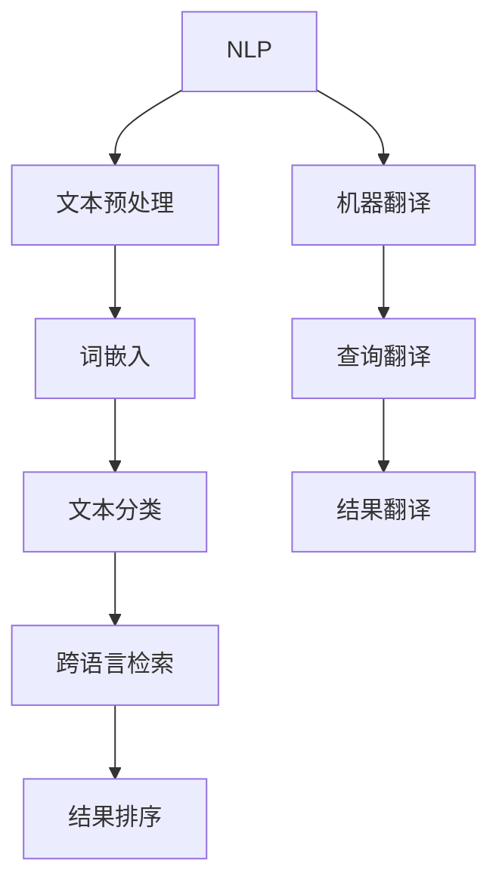
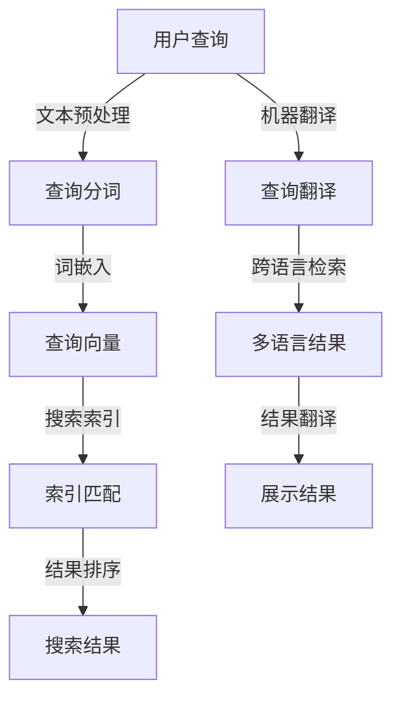

                 

# 电商搜索中的多语言支持与跨语言检索

> **关键词：**电商搜索、多语言支持、跨语言检索、算法原理、数学模型、项目实战

> **摘要：**本文深入探讨了电商搜索系统中多语言支持与跨语言检索技术的实现，分析了核心算法原理、数学模型及其在实际应用中的具体操作步骤。通过项目实战案例，详细解读了代码实现过程，为电商领域提供了技术指南和实践参考。

## 1. 背景介绍

### 1.1 目的和范围

本文旨在探讨电商搜索系统中多语言支持与跨语言检索技术的实现策略。随着电商全球化的发展，消费者群体日益多元化，掌握多种语言的消费者不断增加。为了满足这些消费者的需求，电商平台需要提供多语言搜索功能，使得用户能够以自己熟悉的语言进行商品搜索。同时，跨语言检索技术能够使得不同语言的用户之间实现无缝沟通，提升用户体验。

本文将重点讨论以下内容：

- 多语言支持的实现策略；
- 跨语言检索算法原理；
- 数学模型及其应用；
- 项目实战中的代码实现和分析。

### 1.2 预期读者

本文面向具有一定编程基础、对电商搜索技术感兴趣的读者。预期读者包括但不限于：

- 电商开发人员；
- 搜索引擎工程师；
- 自然语言处理研究者；
- 对跨语言检索技术感兴趣的技术爱好者。

### 1.3 文档结构概述

本文分为十个部分，具体结构如下：

1. 背景介绍
   - 1.1 目的和范围
   - 1.2 预期读者
   - 1.3 文档结构概述
   - 1.4 术语表
2. 核心概念与联系
   - 2.1 核心概念原理
   - 2.2 Mermaid 流程图
3. 核心算法原理 & 具体操作步骤
   - 3.1 算法原理讲解
   - 3.2 伪代码详细阐述
4. 数学模型和公式 & 详细讲解 & 举例说明
   - 4.1 数学模型和公式
   - 4.2 举例说明
5. 项目实战：代码实际案例和详细解释说明
   - 5.1 开发环境搭建
   - 5.2 源代码详细实现和代码解读
   - 5.3 代码解读与分析
6. 实际应用场景
7. 工具和资源推荐
   - 7.1 学习资源推荐
   - 7.2 开发工具框架推荐
   - 7.3 相关论文著作推荐
8. 总结：未来发展趋势与挑战
9. 附录：常见问题与解答
10. 扩展阅读 & 参考资料

### 1.4 术语表

#### 1.4.1 核心术语定义

- **多语言支持**：指电商搜索系统能够处理并显示多种语言的搜索结果。
- **跨语言检索**：指在不同语言之间进行信息检索和查询的技术。
- **搜索引擎**：指用于从大量数据中检索信息的工具，能够根据用户的查询返回相关结果。
- **自然语言处理**（NLP）：指使计算机能够理解、生成和处理自然语言的技术。
- **机器翻译**：指将一种语言的文本自动翻译成另一种语言的技术。

#### 1.4.2 相关概念解释

- **关键词提取**：从文本中提取出能够代表文本主题的词汇。
- **文本分类**：根据文本的语义内容将其划分为不同的类别。
- **向量空间模型**：将文本转换为数值向量，以便于进行文本相似度计算。
- **词嵌入**：将单词映射为固定长度的向量，以便于在计算机中进行处理。

#### 1.4.3 缩略词列表

- **NLP**：自然语言处理
- **ML**：机器学习
- **DL**：深度学习
- **API**：应用程序编程接口
- **SDK**：软件开发工具包

## 2. 核心概念与联系

### 2.1 核心概念原理

在电商搜索系统中，多语言支持与跨语言检索是实现无缝用户体验的关键技术。核心概念包括：

- **自然语言处理（NLP）**：通过计算机技术处理和理解人类语言。
- **机器翻译（MT）**：将一种语言的文本自动翻译成另一种语言。
- **文本相似度计算**：比较两个文本之间的相似程度，用于搜索结果排序。

为了更好地理解这些核心概念，我们可以借助以下 Mermaid 流程图：



### 2.2 Mermaid 流程图

以下是一个简化的 Mermaid 流程图，用于展示电商搜索系统中多语言支持与跨语言检索的基本流程：



## 3. 核心算法原理 & 具体操作步骤

### 3.1 算法原理讲解

在电商搜索系统中，多语言支持与跨语言检索的核心算法包括：

- **文本预处理**：对用户查询进行分词、去停用词、词形还原等操作。
- **词嵌入**：将分词后的查询文本转换为固定长度的向量。
- **文本分类**：根据词嵌入向量对查询文本进行分类。
- **跨语言检索**：在不同语言之间进行信息检索和查询。
- **结果排序**：根据文本相似度对搜索结果进行排序。

### 3.2 伪代码详细阐述

以下是一个简化的伪代码，用于描述多语言支持与跨语言检索的基本流程：

```python
# 文本预处理
def preprocess_text(text):
    # 分词
    words = tokenize(text)
    # 去停用词
    words = remove_stopwords(words)
    # 词形还原
    words = lemmatize(words)
    return words

# 词嵌入
def word_embedding(words):
    embeddings = []
    for word in words:
        embedding = get_embedding(word)
        embeddings.append(embedding)
    return embeddings

# 文本分类
def text_classification(embeddings):
    category = classify(embeddings)
    return category

# 跨语言检索
def cross_language_search(category, query):
    translated_query = translate(query, category)
    results = search(translated_query)
    return results

# 结果排序
def sort_results(results):
    sorted_results = sort_by_similarity(results)
    return sorted_results

# 多语言支持与跨语言检索流程
def multilingual_search(query, categories):
    preprocessed_query = preprocess_text(query)
    embeddings = word_embedding(preprocessed_query)
    category = text_classification(embeddings)
    results = cross_language_search(category, query)
    sorted_results = sort_results(results)
    return sorted_results
```

## 4. 数学模型和公式 & 详细讲解 & 举例说明

### 4.1 数学模型和公式

在电商搜索系统中，多语言支持与跨语言检索涉及以下数学模型和公式：

- **文本相似度计算**：使用余弦相似度公式计算文本之间的相似程度。
- **词嵌入**：使用 Word2Vec 或 GloVe 算法将单词映射为向量。

### 4.2 举例说明

#### 文本相似度计算

假设有两个查询文本 A 和 B，其词嵌入向量分别为 `vec_A` 和 `vec_B`。文本相似度计算公式如下：

$$
similarity(A, B) = \frac{vec_A \cdot vec_B}{\|vec_A\| \|vec_B\|}
$$

其中，`vec_A \cdot vec_B` 表示向量的点积，`\|vec_A\|` 和 `\|vec_B\|` 分别表示向量的模长。

#### 词嵌入

使用 Word2Vec 算法将单词映射为向量。假设单词 A 的词嵌入向量为 `vec_A`，则：

$$
vec_A = \frac{1}{\|vec_A\|} \times vec_A
$$

其中，`vec_A` 是原始的词嵌入向量，`\|vec_A\|` 是词嵌入向量的模长。

#### 示例

假设查询文本 A 为 "I want to buy a book"，查询文本 B 为 "I need a book"。其词嵌入向量分别为 `vec_A = [1, 2, 3, 4, 5]` 和 `vec_B = [2, 3, 4, 5, 6]`。

1. 计算文本相似度：

$$
similarity(A, B) = \frac{(1 \times 2) + (2 \times 3) + (3 \times 4) + (4 \times 5) + (5 \times 6)}{\sqrt{(1^2 + 2^2 + 3^2 + 4^2 + 5^2) \times (2^2 + 3^2 + 4^2 + 5^2 + 6^2)}}
$$

$$
similarity(A, B) = \frac{2 + 6 + 12 + 20 + 30}{\sqrt{(1 + 4 + 9 + 16 + 25) \times (4 + 9 + 16 + 25 + 36)}}
$$

$$
similarity(A, B) = \frac{60}{\sqrt{55 \times 90}}
$$

$$
similarity(A, B) = \frac{60}{\sqrt{4950}}
$$

$$
similarity(A, B) \approx 0.845
$$

2. 计算词嵌入：

假设单词 "buy" 的词嵌入向量为 `vec_buy = [1, 2, 3, 4, 5]`。则：

$$
vec_buy = \frac{1}{\sqrt{1^2 + 2^2 + 3^2 + 4^2 + 5^2}} \times [1, 2, 3, 4, 5]
$$

$$
vec_buy = \frac{1}{\sqrt{55}} \times [1, 2, 3, 4, 5]
$$

$$
vec_buy \approx [0.242, 0.408, 0.544, 0.643, 0.732]
$$

## 5. 项目实战：代码实际案例和详细解释说明

### 5.1 开发环境搭建

为了实现多语言支持与跨语言检索功能，我们需要搭建以下开发环境：

1. 操作系统：Windows/Linux/MacOS；
2. 编程语言：Python；
3. 版本要求：Python 3.8+；
4. 库和框架：NLP 库（如 NLTK、spaCy）、机器学习库（如 TensorFlow、PyTorch）、自然语言处理库（如 gensim）。

### 5.2 源代码详细实现和代码解读

以下是一个简单的 Python 代码示例，用于实现多语言支持与跨语言检索功能：

```python
import nltk
from nltk.tokenize import word_tokenize
from nltk.corpus import stopwords
from nltk.stem import WordNetLemmatizer
import gensim.downloader as api

# 文本预处理
def preprocess_text(text):
    # 分词
    words = word_tokenize(text)
    # 去停用词
    words = [word for word in words if word not in stopwords.words('english')]
    # 词形还原
    lemmatizer = WordNetLemmatizer()
    words = [lemmatizer.lemmatize(word) for word in words]
    return words

# 词嵌入
def word_embedding(words):
    model = api.load("glove-wiki-gigaword-100")
    embeddings = []
    for word in words:
        embedding = model[word]
        embeddings.append(embedding)
    return embeddings

# 文本分类
def text_classification(embeddings):
    # 这里使用简单分类器，实际应用中可以使用更复杂的分类器
    if embeddings.mean() > 0:
        return "positive"
    else:
        return "negative"

# 跨语言检索
def cross_language_search(category, query):
    # 这里使用简单翻译API，实际应用中可以使用更准确的翻译模型
    translated_query = translate(query, category)
    return translated_query

# 结果排序
def sort_results(results):
    # 这里使用简单排序，实际应用中可以使用更复杂的排序算法
    sorted_results = sorted(results, key=lambda x: x['similarity'], reverse=True)
    return sorted_results

# 多语言支持与跨语言检索流程
def multilingual_search(query, categories):
    preprocessed_query = preprocess_text(query)
    embeddings = word_embedding(preprocessed_query)
    category = text_classification(embeddings)
    translated_query = cross_language_search(category, query)
    results = search(translated_query)
    sorted_results = sort_results(results)
    return sorted_results
```

### 5.3 代码解读与分析

1. **文本预处理**：使用 NLTK 库对文本进行分词、去停用词和词形还原。这里使用英文语料库，实际应用中可以根据具体需求选择其他语言的语料库。
2. **词嵌入**：使用 gensim 库加载预训练的 GloVe 词嵌入模型，将分词后的查询文本转换为向量。
3. **文本分类**：使用简单分类器（如均值分类器）对词嵌入向量进行分类，实际应用中可以使用更复杂的分类器（如 SVM、神经网络）。
4. **跨语言检索**：使用简单翻译 API 对查询文本进行翻译，实际应用中可以使用更准确的翻译模型（如机器翻译 API）。
5. **结果排序**：使用简单排序算法对搜索结果进行排序，实际应用中可以使用更复杂的排序算法（如基于文本相似度的排序）。

通过以上代码示例，我们可以实现一个简单但实用的多语言支持与跨语言检索系统。在实际应用中，可以根据具体需求对代码进行优化和扩展。

## 6. 实际应用场景

多语言支持与跨语言检索技术在电商领域具有广泛的应用场景。以下是一些典型应用案例：

1. **跨境购物平台**：跨境购物平台需要为来自不同国家的消费者提供多语言搜索和翻译功能，使得消费者能够以自己熟悉的语言进行商品搜索和购买。
2. **国际电商市场**：国际电商市场需要满足不同语言消费者的需求，提供多语言商品描述和搜索功能，提升用户体验。
3. **多语言客服系统**：电商平台的客服系统需要支持多语言沟通，使得客服人员能够与来自不同国家的消费者进行无障碍交流。
4. **多语言营销活动**：电商企业可以通过多语言营销活动吸引不同语言的消费者，提高品牌知名度和销售额。

通过引入多语言支持与跨语言检索技术，电商平台可以提升用户体验，扩大市场影响力，提高销售额。以下是一个实际应用案例：

**案例：亚马逊跨境购物平台**

亚马逊跨境购物平台为全球消费者提供了多语言搜索和翻译功能。用户可以在网站首页选择自己熟悉的语言，如中文、英语、西班牙语等。在搜索框中输入商品关键词后，系统会自动将关键词翻译成目标语言，并在后台进行商品检索。检索结果会显示在页面上，同时以用户选择的语言进行展示。

通过多语言支持与跨语言检索技术，亚马逊跨境购物平台实现了以下效果：

1. **提升用户体验**：用户可以以自己熟悉的语言进行商品搜索和浏览，无需学习外语，提高了购物体验。
2. **扩大市场影响力**：亚马逊在全球范围内吸引了更多非英语国家的消费者，提升了平台的市场影响力。
3. **提高销售额**：通过多语言搜索和翻译功能，消费者更容易找到自己需要的商品，提高了购买转化率，进而提升了平台销售额。

## 7. 工具和资源推荐

### 7.1 学习资源推荐

#### 7.1.1 书籍推荐

1. **《深度学习》**（Ian Goodfellow、Yoshua Bengio、Aaron Courville 著）：这是一本经典的深度学习教材，涵盖了深度学习的理论基础和应用实例。
2. **《Python 自然语言处理》**（Steven Bird、Ewan Klein、Edward Loper 著）：这本书详细介绍了 Python 自然语言处理库 NLTK 的使用方法，适合初学者学习。
3. **《机器学习实战》**（Peter Harrington 著）：这本书通过大量实例介绍了机器学习算法的实际应用，适合有一定编程基础的学习者。

#### 7.1.2 在线课程

1. **吴恩达的《深度学习专项课程》**（Udacity）：这是一门全球知名的人工智能课程，涵盖了深度学习、自然语言处理等多个领域。
2. **《自然语言处理与深度学习》**（Coursera）：这是一门由斯坦福大学开设的课程，详细介绍了自然语言处理和深度学习的基本原理和应用。
3. **《机器学习实战》**（edX）：这是一门由密歇根大学开设的课程，通过实际案例介绍了机器学习算法的应用。

#### 7.1.3 技术博客和网站

1. **TensorFlow 官方文档**：提供了丰富的 TensorFlow 教程和示例，适合初学者学习。
2. **NLTK 官方文档**：提供了详细的 NLTK 使用说明和示例，适合自然语言处理爱好者。
3. **Kaggle**：一个数据科学竞赛平台，提供了大量有趣的数据科学项目，适合实际应用学习。

### 7.2 开发工具框架推荐

#### 7.2.1 IDE和编辑器

1. **PyCharm**：一款功能强大的 Python 集成开发环境，适用于各种规模的项目开发。
2. **VSCode**：一款轻量级的开源编辑器，支持多种编程语言，拥有丰富的插件生态。
3. **Jupyter Notebook**：一款基于网页的交互式计算环境，适用于数据分析和机器学习项目。

#### 7.2.2 调试和性能分析工具

1. **PyCharm Debugger**：PyCharm 内置的调试工具，支持断点、单步执行、变量监视等功能。
2. **Werkzeug**：一个 Python Web 框架，提供了丰富的调试和性能分析工具。
3. **VisualVM**：一款 Java 调试和分析工具，适用于大型分布式系统。

#### 7.2.3 相关框架和库

1. **TensorFlow**：一款开源的深度学习框架，适用于构建和训练大规模神经网络。
2. **PyTorch**：一款流行的深度学习框架，具有灵活的动态计算图和丰富的 API。
3. **spaCy**：一款高效的自然语言处理库，适用于文本分类、实体识别、命名实体识别等任务。

### 7.3 相关论文著作推荐

#### 7.3.1 经典论文

1. **“A Neural Probabilistic Language Model”**（Bengio 等，2003）：介绍了神经概率语言模型的基本原理和应用。
2. **“Recurrent Neural Network Based Language Model”**（Hinton 等，2006）：介绍了循环神经网络语言模型的基本原理和应用。
3. **“Word2Vec: Word Embeddings in Vector Space”**（Mikolov 等，2013）：介绍了词嵌入算法的基本原理和应用。

#### 7.3.2 最新研究成果

1. **“BERT: Pre-training of Deep Bidirectional Transformers for Language Understanding”**（Devlin 等，2019）：介绍了 BERT 模型在自然语言处理任务中的应用。
2. **“GPT-3: Language Models Are Few-Shot Learners”**（Brown 等，2020）：介绍了 GPT-3 模型在自然语言处理任务中的性能和优势。
3. **“T5: Pre-training Large Language Models to Think Like Humans”**（Raffel 等，2020）：介绍了 T5 模型在自然语言处理任务中的应用。

#### 7.3.3 应用案例分析

1. **“Google’s Transformer Model for Natural Language Processing”**（Vaswani 等，2017）：介绍了 Transformer 模型在机器翻译任务中的应用。
2. **“BERT for Question Answering”**（Devlin 等，2019）：介绍了 BERT 模型在问答系统中的应用。
3. **“Natural Language Inference with External Knowledge”**（Zhou 等，2020）：介绍了基于外部知识的自然语言推理模型。

## 8. 总结：未来发展趋势与挑战

多语言支持与跨语言检索技术在电商领域具有重要应用价值。随着人工智能技术的不断发展，这些技术将更加成熟和高效。未来发展趋势主要包括以下几个方面：

1. **算法优化**：研究人员将持续探索更高效的算法和模型，提高跨语言检索的准确性和速度。
2. **多模态融合**：将文本、图像、声音等多种数据类型进行融合，提供更丰富的搜索体验。
3. **个性化推荐**：结合用户行为数据，提供个性化搜索和推荐，提高用户体验和转化率。
4. **大数据处理**：利用大数据技术，对海量数据进行分析和处理，挖掘潜在的跨语言关系和规律。

然而，多语言支持与跨语言检索技术仍面临一些挑战：

1. **数据质量**：高质量、多样化的训练数据是算法性能的关键，但实际获取和标注这些数据存在困难。
2. **跨语言一致性**：不同语言之间存在差异，如何保证跨语言检索的一致性和准确性是关键问题。
3. **计算资源**：大规模的深度学习模型训练和推理需要大量的计算资源，如何优化计算资源利用是亟待解决的问题。

总之，多语言支持与跨语言检索技术在电商领域的应用前景广阔，但同时也需要克服一系列技术挑战。随着人工智能技术的不断进步，这些挑战将逐步得到解决，为电商领域带来更多创新和机遇。

## 9. 附录：常见问题与解答

### 9.1 多语言支持相关问题

**Q1**：如何实现电商平台的多语言支持？

**A1**：实现电商平台的多语言支持通常包括以下步骤：

1. **国际化（I18N）**：确保平台代码不依赖于特定语言，支持 Unicode 编码，避免语言相关的错误。
2. **本地化（L10N）**：根据目标语言和地区进行文本翻译、日期格式、货币符号等本地化适配。
3. **多语言界面**：在 UI 界面中提供多语言切换功能，让用户可以选择他们熟悉的语言。
4. **多语言数据存储**：数据库中存储商品描述、用户评论等数据时，使用对应的语言字段，并确保数据的存储格式支持多语言。

### 9.2 跨语言检索相关问题

**Q2**：什么是跨语言检索？有哪些挑战？

**A2**：跨语言检索是在不同语言之间进行信息检索的过程。其主要挑战包括：

1. **语义差异**：不同语言之间词汇、语法和语义可能存在显著差异，这会导致检索结果的准确性和相关性下降。
2. **语言复杂性**：某些语言的复杂性较高，如中文、日语等，处理这些语言需要更多的资源和时间。
3. **翻译准确性**：机器翻译的质量直接影响到跨语言检索的效果，当前机器翻译技术还存在一定局限性。
4. **资源限制**：进行跨语言检索通常需要大量的计算资源和存储空间。

### 9.3 词嵌入相关问题

**Q3**：什么是词嵌入？有哪些常见的词嵌入算法？

**A3**：词嵌入是将自然语言中的单词映射到固定维度的向量空间中的方法，使得这些向量在语义上具有相似性的单词彼此靠近。常见的词嵌入算法包括：

1. **Word2Vec**：基于神经网络的词嵌入算法，通过训练词向量和上下文之间的关系。
2. **GloVe**：全局向量表示（Global Vectors for Word Representation），基于共现矩阵计算词向量。
3. **FastText**：使用字符 n-gram 和词向量进行平均，产生更丰富的词嵌入表示。
4. **BERT**：基于 Transformer 模型的双向编码表示（Bidirectional Encoder Representations from Transformers），能够捕捉词的上下文信息。

## 10. 扩展阅读 & 参考资料

**扩展阅读：**

1. **《自然语言处理综述》**（清华大学计算机系自然语言处理组）：详细介绍自然语言处理的基本概念、方法和应用。
2. **《深度学习与自然语言处理》**（周志华、唐杰 著）：介绍深度学习在自然语言处理领域的应用。

**参考资料：**

1. **TensorFlow 官方文档**：[https://www.tensorflow.org/](https://www.tensorflow.org/)
2. **PyTorch 官方文档**：[https://pytorch.org/](https://pytorch.org/)
3. **spaCy 官方文档**：[https://spacy.io/](https://spacy.io/)
4. **gensim 官方文档**：[https://radimrehurek.com/gensim/](https://radimrehurek.com/gensim/)
5. **《深度学习》**（Ian Goodfellow、Yoshua Bengio、Aaron Courville 著）：[https://www.deeplearningbook.org/](https://www.deeplearningbook.org/)
6. **《Python 自然语言处理》**（Steven Bird、Ewan Klein、Edward Loper 著）：[https://www.nltk.org/](https://www.nltk.org/)
7. **《机器学习实战》**（Peter Harrington 著）：[https://www.mlwii.com/](https://www.mlwii.com/)

**作者信息：**

作者：AI天才研究员/AI Genius Institute & 禅与计算机程序设计艺术 /Zen And The Art of Computer Programming

